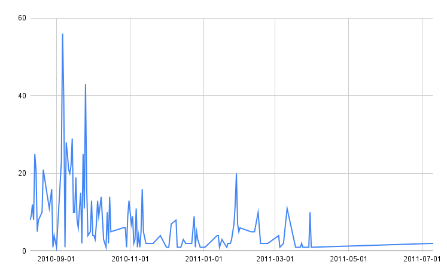
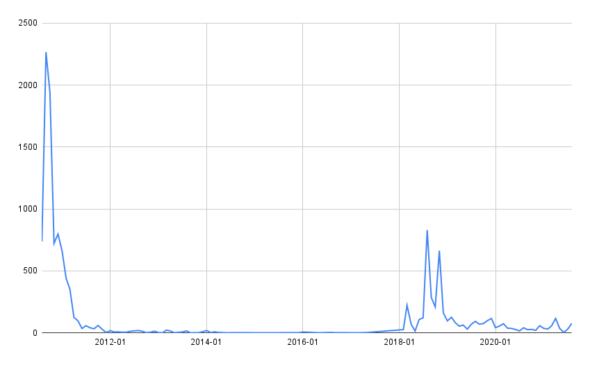
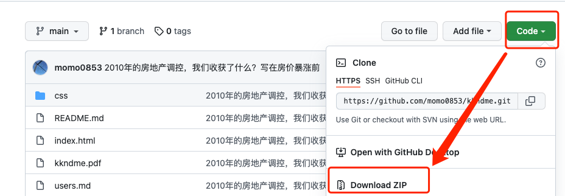

# 说明

**声明: 本人仅整理帖子内容，帖子中的内容、观点仅代表原作者、与本人无关。**

**由于Github的限制(大约25万字(包含标点符号和数字))，Markdown版本会渲染不完整(总共52万字(包含标点符号和数字))，建议直接阅读[HTML](https://htmlpreview.github.io/?https://github.com/momo0853/kkndme/blob/main/index.html)版本，HTML的排版和天涯是一样的，或者[在线阅读PDF(577页)](https://github.com/momo0853/kkndme/blob/main/kkndme.pdf)文档，也可以直接[下载PDF(577页)](https://github.com/momo0853/kkndme/raw/main/kkndme.pdf)**

- 整理：StoneLiu
- 天涯(手机版)：https://bbs.tianya.cn/m/post-house-252774-1.shtml
- 天涯(电脑版)：https://bbs.tianya.cn/post-house-252774-1.shtml
- GitHub：https://github.com/momo0853/kkndme
- 字数：523521
- 更新：2021-12-23
- 起止：2010-08-10 19:03 / 2011-07-10 09:21，共1018次回复，其中有84次回复是从其他回答中恢复的
  - 2010年作者发表和回复共871次
  - 2011年作者发表和回复共147次
  
- 帖子是否被封禁过，这个情况我没有办法知道，但是我可以统计出历年来帖子的回复情况(网页爬日期是2022-06-13)，[所有回帖用户以及回帖时间](users.md)，[下载回帖用户信息](https://github.com/momo0853/kkndme/raw/main/users.pdf)
  
- 是否存在删贴行为，从楼层的不连续性可以看出**存在这样的情况**，[所有回帖用户以及回帖时间、楼层信息](users.md)，[下载回帖用户信息](https://github.com/momo0853/kkndme/raw/main/users.pdf)
- **不管是Markdown方式还是PDF方式标题都是可以点击打开对应的网页查看原始详细信息的。本人仅仅是汇总，不对任何内容进行修改。**

# 离线阅读(下载)
下载之后直接用浏览器打开index.html或者kkndme.pdf体验会好一些  

- Git方式
```
$ git clone https://github.com/momo0853/kkndme.git
```

- ZIP方式
Code -> Download ZIP  
  

# HTML版本
[2010年的房地产调控，我们收获了什么？写在房价暴涨前](https://htmlpreview.github.io/?https://github.com/momo0853/kkndme/blob/main/index.html)  

**直接点击GitHub上的index.html是无法加载的，所以我使用htmlpreview.github.io来加载GitHub的这个文件，有可能出现无法打开或者打开过慢的情况。**

# Markdown版本

## 1 2010-08-10 19:03([post-house-252774-1.shtml](https://bbs.tianya.cn/m/post-house-252774-1.shtml))
2010年的房地产调控，让很多人看到了希望：让房价降得再猛烈些吧。还有人更是幸灾乐祸似的呼喊：让房地产赶紧崩盘吧。让没房子的好好看看有房子的笑话，是人生的一大快事。  
但是我们是不是要仔细想想，为什么调控？调控期望得到什么样的效果？  
1)是如千千万万想买房子的人期望的那样，让人人买的起房吗？  
2)是如千千万万的流氓无产者期望的那样，让房地产崩盘，开发商上吊，dfzf不再靠卖地实现gdp吗？  

2010年房价下跌已经变成了人民最急切的期望，已经高过了解决超贫困家庭的温饱问题，已经超过了子女教育，医疗和养老。并且为房地产必须下降提出了若干义正言辞理由，总结下来无外乎三条：  
1)人人都有居住权。房子是用来住的，不是用来炒的。  
2)房子太贵了，租售比严重不合理，空置率太高，人均收入太低，早晚要崩盘。  
3)房价上涨造成物价上涨，人民生活变得困难。  

## 2 2010-08-10 19:04([post-house-252774-1.shtml](https://bbs.tianya.cn/m/post-house-252774-1.shtml))
的确，当经济过热，房价过高，会对经济运行和社会安定带来较高的风险。这也是国家所担忧的。防范金融风险，一切维稳才是zy考虑的重中之中。  
而民间所总结的三条，应该和调控的原因和目的基本不沾边。让我们一条一条的分析一下：  

## 3 2010-08-10 19:06([post-house-252774-1.shtml](https://bbs.tianya.cn/m/post-house-252774-1.shtml))
1)人人都有居住权。房子是用来住的，不是用来炒的。  
其实这是一个伪命题。房子包括房屋及房屋所属的土地两个部分。房屋本身只有居住价值；而土地所具备稀缺性，决定了土地的投资价值。房地产贵的不是房屋，而是房屋下面那块地皮。所以商品房具备了投资与自住双重属性。  
任志强说的并没有错，居者有其屋并不等于人人享有商品房的产权。居住的房屋也不等于商品房。  

## 4 2010-08-10 19:08([post-house-252774-1.shtml](https://bbs.tianya.cn/m/post-house-252774-1.shtml))
2)房子太贵了，租售比严重不合理，空置率太高，人均收入太低，早晚要崩盘。  
这个问题比较大。房价是不是太贵了？有没有泡沫？  
我们首先从国民的收入结构来分析  

## 5 2010-08-10 19:14([post-house-252774-1.shtml](https://bbs.tianya.cn/m/post-house-252774-1.shtml))
一个遵从“丛林法则”的精英社会决定了国民收入的金字塔结构。  
既然是金字塔，底端的中低收入者占据了金子塔的最大比例，但是大家要知道金字塔的顶端既使只有10%人口，那也将是一个1亿多的绝对庞大的数字，远远超过了绝大多数西方国家的人口总和。  
而北上广深以及三十多个省会，这些个靠掠夺全国或者一省资源，以牺牲大多数人口的利益为代价发展壮大起来的超大型及大型城市，需要容纳全国1亿多的精英人群，是否能得出房地产严重泡沫，空置率过高的结论？  
当低收入者们努力挥洒汗水期望着自己年薪能够超过5万，8万，10万。。。的时候，他们可能做梦也想不出精英阶层手中究竟拥有多少财富。  
精英们会象流氓无产者们一厢情愿认为的那样：因为一个区区房产税而恐慌性抛弃手中的大量房产吗？  
答案显然是否定的。  
可以确认的是，房价不是由统计局的平均收入决定的。而是精英的平均收入决定的。  

## 6 2010-08-10 19:18([post-house-252774-1.shtml](https://bbs.tianya.cn/m/post-house-252774-1.shtml))
买房问题很象是中国的上学问题，而且简直是异曲同工。  
假设你家附近有个重点中学，教学质量很好，考大学几率很高，而其他的学校你觉得不理想，你肯定希望无论如何自家小孩也要上这个重点中学。  
上重点中学凭什么？我们简单的剥离掉其他社会因素的影响，可以认为想上重点中学就要凭好成绩，小孩努力考到前多少名，就可以上重点中学。这与努力赚钱买房是一个道理，有钱的出高价就能买到好位置好环境的房子。  
我们再加入社会因素的影响，比如某大人物看到这个中学很抢手，很可以赚一笔，于是就设计了加分项，谁给自己送的钱多，就给谁加分，于是小孩要上重点中学不但要考高分，还要送钱加分。  
同理，当好位置的商品房成为稀缺资源，各类炒房客的出现是必然的。  

## 7 2010-08-10 19:21([post-house-252774-1.shtml](https://bbs.tianya.cn/m/post-house-252774-1.shtml))
第二：租售比问题  
这个问题不用过多解释，使租售比更合理的方法不是只有降低房价一种，还有一种更靠谱的：房租大幅度上涨。而且已经在行动中。房租长期保持低价就像1990年以前的和田玉长期保持低价一样不可能。  
3)房价上涨造成物价上涨，人民生活变得困难。  
这个问题其实也不用多解释，懂经济学的该明白自然会明白，不会轻易被忽悠，不懂的解释半天也不会明白。  
简单的可以这样说，物价上涨是经济过热，钞票印多了的后果。而房地产因为稀缺性和易保存比较吸金，所以吸收了大量的钞票，以至于大家光看到了房地产的飞涨。  
其实如果房地产交易量下降，不再具有吸金功能，那么农产品等生活必须品以及房屋租金等等就会大幅上涨。这是因为多出来的大量钞票总要有个流向，如果不被房地产吸收，就会被大蒜，绿豆，姜，及全部生活必须品的上涨来吸收  
事实也证明确实如此。2010年房产调控后，物价上涨的势头非常迅猛。  

## 8 2010-08-10 19:22([post-house-252774-1.shtml](https://bbs.tianya.cn/m/post-house-252774-1.shtml))
那麽是不是房地产就没有泡沫呢？  
这个问题谁也不知道，因为到现在zf拿不出一份权威的数据来说明房地产到底有无泡沫。  
但是房价高了就有风险，zf从感性上还是有清楚认识的。  
注意，我们前面啰嗦了很多，现在才开始接近这次调控的真实意图。  
防范金融风险？不错，你说的很对，但是没这么简单。  

## 9 2010-08-11 18:10([post-house-252774-2.shtml](https://bbs.tianya.cn/m/post-house-252774-2.shtml))
作者：cdw1  回复日期：2010-08-11 14:48:56  
商品房本来名字中就有商品二字不准投资岂不是笑话？真正不准投资的那叫公房，这才是保证老百姓有房住的关键，商品房诞生的时候就很明确是改善居民居住条件的，现在政府怪商品房价格过高造成老百姓没房住本来就是颠倒黑白，政府不造保障老百姓居住的公房，而让老百姓去购买改善居住条件的商品房来解决本该政府解决的居住问题，政府不作为才是造成老百姓出现居住问题的罪魁祸首。我不期望人人有房，我只希望每一个在城市里找到工作的人通过努力工作勤俭持家能在生活城市里有希望拥有一套安稳的房子来容身，不管这房子的性质是商品房、经适房、廉租房或者其他什么房子。  
--------
你说的正是根源所在啊  
zf的职责应该向无房者提供的保障房，建成经适房、两限房，被权贵占有牟利，  
而非要把商品房赋予稳定社会的职能。  
zf不是不知道问题的根源，而是不愿意放弃巨大的利益  

## 10 2010-08-11 18:53([post-house-252774-2.shtml](https://bbs.tianya.cn/m/post-house-252774-2.shtml))
闲扯了一下统计数据  
还是回到这次调控中来  
房地产游戏的模式三个环节：dfzf卖地、银行贷款、开发商在二级市场销售  
dfzf卖地之后，剩余的风险和收益都归银行和开发商  
dfzf卖地的款则用于地方广场，地铁，公路之类的建设和权贵的挥霍。  
dfzf只负责卖地，是无风险的买卖。当然还有人企图利用流氓无产者和无知群众的群情激奋来进一步收取房产税来提高dfzf收入。  
税收从来都是向下游转嫁的，zf多收出来的钱一定是通过最下游的房租来体现。  
当然，也有很多明白人士大声疾呼反对房产税。  
自古而今，即使最辉煌的朝代，最被广大群众津津乐道的太平盛世，普通群众也仅仅只是解决了温饱而已，包括贞观、文景、康乾。  
国家的富庶都是以老百姓勒紧裤腰带为代价的。  
所以，zf是不会理会部分明白人反对房产税的呼声的。  
真正对房产税的顾及来自于dfzf对土地出卖前途的担忧，真是鱼与熊掌不可兼得。  
尽管流氓无产者和无知群众的呼声很高，然而房产税征收一旦实际操作起来，就会变的不得人心，征收难度非常之大，实际效果难以预知。也就是说zf没有底。而如果房产税征收效果不佳，dfzf卖地收入再受到巨大影响，那就真正是得不偿失了。  
就会变成赔了夫人又折兵。  
这样的买卖，zf是不会轻易做的  

## 11 2010-08-11 19:10([post-house-252774-2.shtml](https://bbs.tianya.cn/m/post-house-252774-2.shtml))
房地产的现状是，商品房二级市场是由各种类型的开发商自由竞争的，一手房开发商之间的竞争，二手房投资客之间的的竞争。  
房价为什麽在一个自由竞争的市场上能够持续上涨？因为稀缺性。不是房屋的稀缺性，而是房屋所必须占用的土地的稀缺性。  
有些群情激奋的群众立刻以6500万套房子空置的事情提出质疑，还有ccav的报道，那是要多煽情又多煽情。  
我们无需说6500万套的真实性（明白人都知道非常离谱）和空置我心的科学性。为什么不说，因为这种稀缺性跟空置率就完全没有关系。商品房的稀缺性是相对人民币而言的。人民币印多了，资金没地方去，商品房就涨价了。  

## 12 2010-08-11 19:16([post-house-252774-2.shtml](https://bbs.tianya.cn/m/post-house-252774-2.shtml))
垄断的市场是没有风险的，土地是完全垄断的，所以dfzf完全没有风险。  
而商品房是自由竞争的市场，是具备风险属性的，尽管由于大量印钞造成了商品房的飞涨，但随着房价的高涨，风险也在积聚。  
dfzf土地垄断没有风险，完全可以置身事外。  
可是银行呢？属于国家的银行。  
银行正在承担自由竞争市场房价高涨积聚的风险。  
这是zy不允许看到的，dfzf受益，而风险全部甩给zy。  
既然垄断的市场是没有风险的，那还是让房屋和土地一起垄断好了。  

## 13 2010-08-11 19:41([post-house-252774-2.shtml](https://bbs.tianya.cn/m/post-house-252774-2.shtml))
垄断还可以解决一个问题：社会稳定。  
常被媒体和群情激奋群众所提及的一个重要问题就是:房价收入比。  
大量印刷的人民促成了房价高企（因为商品房实在是具备了大资金需要的所有投资品属性），可是那些个巨额的资金普通老百姓并没有见到。  
路人甲：我们一个月就挣2000多块钱，干一辈子买不起房啊。  
路人乙：我一个月上万都买不起房。  
媒体：一个家庭不吃不喝22年买一套房  
大量的疯狂印刷的人民币在哪里呢？  

## 14 2010-08-11 19:44([post-house-252774-2.shtml](https://bbs.tianya.cn/m/post-house-252774-2.shtml))
在精英手里。  
我们在回顾一下开篇，我们奉行的是精英社会，丛林法则，金字塔式收入结构。  
人民币再多，也不可能流到金字塔的底端。  
dfzf垄断卖地也就让百姓们发发牢骚。  
而炒房客，kfs赚的盆满钵满就让生活在中下层的老百姓眼红和不能容忍。  
不患寡而患不均啊。  
垄断，国家队的垄断，可以解决眼红问题，也就是社会稳定问题。  
还有一个最重要的问题：银行和民营开发商之间，是官与民之间的问题。  
而银行和国家队央企，是左兜和右兜的问题。  

## 15 2010-08-11 20:00([post-house-252774-2.shtml](https://bbs.tianya.cn/m/post-house-252774-2.shtml))
俗话说，问渠哪得清如许，唯有源头活水来。  
要垄断，必须抓住源头。  
源头在哪里？  
在一级市场，而不是二级市场。  
房地产的垄断就是要国家队从一级市场做起，从一级市场开发着手完成对商品房开发的垄断。  
一级市场，那是一个高高的门槛，民间资金，就让他该干嘛干嘛吧，房地产不是你玩的。  
一级市场包括的内容是一般开发商无法参与的：  
城市规划，城中村改造，旧房拆迁，城市综合体开发。  
可以说从规划、改造拆迁、开发、到二级市场销售，一条龙服务。  
一级市场开发的最大特点就是可以创造需求：你不是有房子吗？我拆掉你的房子，看你有没有刚需。  
国家垄断控制风险的意义还在于：需求可以拆出来。  

## 16 2010-08-11 21:55([post-house-252774-2.shtml](https://bbs.tianya.cn/m/post-house-252774-2.shtml))
以后的路，民营开发商的日子将变得越发艰难。  
土地是dfzf的，商品房开发是央企和国企的。  
处于金字塔下层的40%家庭，如果还没有一套自己的房子，那么买一套自己的房子就越发的变得不可能。  
商品房将逐渐往金字塔的上层积聚。  
处于金字塔下层40%的无房家庭将只能以租房来解决居住问题。  
租金的快速上涨期即将到来，zf已经盯上了房租这块巨大的蛋糕。因为房租的收益比房产税更靠谱，更具有操作性。  
公租房，呼之欲出  

## 17 2010-08-11 22:59([post-house-252774-2.shtml](https://bbs.tianya.cn/m/post-house-252774-2.shtml))
中国自古以来都不是人人都能有属于自己的房子，大量的丫鬟、仆妇、管家、小厮寄养在权贵人家，身体都是不自由的，何谈拥有自己的房子。  
自古以来，最多的就是失去土地的农民，住在地主家做长工，又何谈属于自己的房子。  
只要是有贫富差距的社会，只要存在阶级，只要存在统治和被统治，这个社会就会不以人的意志为转移的出现大量的底层居民，没有这些底层居民。权贵就不能很好的生活。  
为了权贵生活的更好，就要维持大量的底层群众。  
权贵必须保证大量底层群众的基本生活，才能够让自己过得更舒服，仅此而已。这就是民生  

## 18 2010-08-12 08:42([post-house-252774-3.shtml](https://bbs.tianya.cn/m/post-house-252774-3.shtml))
作者：sunxinmfc  回复日期：2010-08-11 23:16:17  
作者：kkndme 回复日期：2010-08-11 22:59:50  
中国自古以来都不是人人都能有属于自己的房子，大量的丫鬟、仆妇、管家、小厮寄养在权贵人家，身体都是不自由的，何谈拥有自己的房子。  
自古以来，最多的就是失去土地的农民，住在地主家做长工，又何谈属于自己的房子。  
只要是有贫富差距的社会，只要存在阶级，只要存在统治和被统治，这个社会就会不以人的意志为转移的出现大量的底层居民，没有这些底层居民。权贵就不能很好的生活。  
为了权贵生活的更好，就要维持大量的底层群众。  
权贵必须保证大量底层群众的基本生活，才能够让自己过得更舒服，仅此而已。这就是民生  
--------
删掉了一大段，不得不说，你说的很对。  
（呻吟一下）。君不见，天涯上多少盼着被美军解放的铁杆准汉奸，政府楼被炸七成网民不是替死者默哀，而是一片欢呼。为什么会有这样的民意，参考前苏联，ZF确实应三思  
--------
爱国是与中华的历史分不开的，自秦统一以来，中国由封建时代转变为帝国时代，只有在项羽焚烧咸阳后，对诸侯进行了一次分封，但时间非常短暂，刘邦重新统一了天下，帝国时代经历了漫长的汉、唐、宋、元、明、清。天下一统的爱国情结是根深蒂固的。  
而在秦以前，与中世纪的欧洲是极为相似的，齐国人可以到秦国做宰相，赵国人可以到燕国做将军。中世纪法国的诺曼底公爵可以到英格兰继承王位，瑞典的贵族可以到基普做大公，封建时代的国家概念并不是明显。欧洲经历了漫长的封建时代，国家观念很淡薄，能够抛弃国家货币成立欧盟就是明证。这对于漫长帝国时代，天下一统的国家是很难想象的。  
爱国只跟历史文化传统有关。  
1978年越南入侵红色高棉，当时的红色高棉对内实行红色恐怖，以gongchanzhuyi的名义对全国700万人口进行奴役和屠杀，总共屠杀了100万人。当越南军入侵时，受到了广大柬埔寨群众的热烈欢迎，称越南军解放柬埔寨是解放人类的战争。  
红色高棉失去了民心，必然败亡。  
那时，为了支援红色高棉，中越战争打响。有我国的强力支持，红色高棉仍然走向败亡。  

## 19 2010-08-12 09:07([post-house-252774-3.shtml](https://bbs.tianya.cn/m/post-house-252774-3.shtml))
秀才造反，三年不成，自古已然。  
但我们还没有谈到所谓“造反”的地步，只是说房价如你所述，暴涨，中国的中产和以上人士将进一步携款合法外流（在房价暴涨的09年，中国外流人口达到历史峰值）。这一部分人利益如何保证？您觉得zf不需要考虑对么？  
--------
现在社会跟几百年前最大的不同是，世界是开放的，这得益于地理大发现和世界经济一体化，即使缅甸朝鲜这样封闭的国家也免不了受到来自世界范围的影响。大一统的集权社会融入了西方民主的思想，同时互联网的出现也让人们对过去的思维进行了再思考。  
尽管底层百姓出国还是一个梦想，但对于精英人群，基本上是在世界范围自由流动的。  
中国自古以来，商人都是没有地位的，商人的财产可以随时被官员没收，自古如此，至今如此，即使是今天也并没有出现私人财产神圣不可侵犯的宣言。即使出现了，也没有任何可以操作的可能。  
明朝以后大量的商人移居海外成了华侨，现今的商人为了安全移居海外也不是什么新鲜事，不过是步明朝华侨的后尘罢了，zf会真的放在心上吗？朱元璋没有放在心上，朱棣没有放在心上，现在同样也不会放在心上。  
真正可怕的是官员一方面谋取私利一方面把亲属和存款送到国外，这其实是一种国家背叛。在国内榨干老百姓的血汗，得到的金钱却在国外挥霍。什么叫卖国，不过如此。  

## 20 2010-08-12 09:17([post-house-252774-3.shtml](https://bbs.tianya.cn/m/post-house-252774-3.shtml))
不过从政府要分租房市场的蛋糕而言，我有不同的看法  
政府的公租房要想租出好价格，有两种方式  
1）减少市场可出租房源（北京就这样干了，拆迁廉价城中村）  
2）提高竞争房源的成本。（所以我认为推出房产税是大概率的事情，  
因为政府的公租房是不需要交房产税的）  
于是竞争房源的房租暴涨，政府的公租房也就可以羞羞答答的打个9则来  
安抚一些底层了，反正所有的黑锅都有竞争房源的房东背了  
--------
房产税的问题我觉得zf还是慎重的  
1)如果采用不公平法则：  
公务员，垄断企业，事业单位的福利房不上税，权贵与利益集团购买囤积的大量商品房不上税，只有普通百姓上税，会加剧社会矛盾，而房产税会大幅提升租金，在公租房没有大量建起来之前，对稳定不利，维稳才是第一要务。  
2)如果实行公平法则  
小产权房，福利房，权贵囤积房都要上税，执行难度太大，可操作性不强，阻力几乎难以逾越。  
如果真的收房产税，采用不公平法则的可能性最大，普通的无房百姓生活将变得非常艰难。  

## 21 2010-08-12 09:36([post-house-252774-3.shtml](https://bbs.tianya.cn/m/post-house-252774-3.shtml))
说到公租房问题  
首先还是要提到我们实行的双轨制  
从某一方面可以简单的理解为统治阶级内和统治阶级外。  
也就是我们常说的体制内，体制外。  
体制内:公务员、垄断企业及医院高校科研院所等事业单位。  
体制外：外资、私企打工者，个体工商户，农民，这里面也应当包括高层的老板和最底层的长期无业人员。  
我们感受最深的就是涨工资的问题，一旦政府涨工资，那就一定是体制内涨工资，跟体制外完全没有关系。在金融危机的08年，大批企业关门，减薪，裁员，美国欧洲因为钱紧不得不降低公务员薪水。而这时，我们神奇的国家在干一件事：公务员普遍加薪，是为了全国百姓着想—刺激消费。  
还有保障房问题，这个也是我们感受最深的：保障房=公务员及垄断企业住房；解决住房问题变成了如何让领导干部住更多更大的房子，如何让体制内员工拥有足够舒适住房的问题。  
体制外的群众，那是别想得到一点好处的。谁让你是被统治阶级呢。  
公租房的推出，也要解决两个问题：  
1)体制内的最下层（最下层也是统治阶级，也就是是古代官吏中的吏）员工的基本住房问题  
2)向体制外被统治的小民稳定收钱的问题。  

## 22 2010-08-12 11:01([post-house-252774-3.shtml](https://bbs.tianya.cn/m/post-house-252774-3.shtml))
肚子里面没料就不要学伪专家嘴脸，通篇没有一句话不是自己妄加揣测，言之无物。  
中国和全球利益分配模式正在由于能源，经济结构，军事布局等问题发生着深刻的  
变革。过去二十年中国以及西方列强旧有的利益分配模式正在发生重大变化。  
而从历史来看，这种变革至少是一百年才遇到一次这个级别的。所以在这种时刻，  
用中国过去二十年的老经验来看待面临的新问题，结论不南辕北辙才怪  
--------
您考虑的都是国际大事，我只考虑自家门前的小事，站位没有达到您的高度。  

## 23 2010-08-12 14:44([post-house-252774-4.shtml](https://bbs.tianya.cn/m/post-house-252774-4.shtml))
垄断的目的还在于能够控制价格，为了维稳，zy是不希望暴涨的，但也不希望不涨。  

## 24 2010-08-12 15:10([post-house-252774-4.shtml](https://bbs.tianya.cn/m/post-house-252774-4.shtml))
回头还说公租房  
在私企打过工的都知道，毫无归属感可言，老板脑袋一发热，随时让员工卷铺盖卷走人。那是要多没保障有多没保障。原因是社会关系，关键客户，都掌握在老板一个人手里，员工就是打个下手，一不爽了，就换人呗。  
统治者可知道不能这么用人的。一个庞大的国家机器要想正常运转，必须得让手下的和自己的利益一致。如果自己吃肉，手下的连汤都没得喝，这个机器就转不动了。  
因此，在房价高涨的时代，保障房才成为zy默认的公务员房、垄断企业房。  
公租房首要解决的就是手下里面最底层人士的住房问题。  
我认为针对于体制内来说，无论是公务员，事业单位，还是国有企业的初级员工，都可以通过所在单位申请公租房，公租房的租金会略低于市场，主要是单位一定会提供补贴。  
体制外对公租房的申请就没有那么幸运了。  

## 25 2010-08-12 19:38([post-house-252774-6.shtml](https://bbs.tianya.cn/m/post-house-252774-6.shtml))
钱的问题，dfzf也想到了解决的办法。  
在卖地时就要求开发商配套建设一定比例的经适房、廉租房或公租房。  
然而，羊毛出在羊身上，开发商不可能做赔本的买卖。经适房好说，反正是卖个住户，大不了利润很低，顶多挣得少点。而廉租房和公租房就纯粹是只见投入不见产出的（开发商可没资金没耐心收租子）。廉租房和公租房的建设成本必须加到所建的商品房身上，这肯定会抬高房价。  
关键是拿地成本逐年上涨，孝敬的资金也在逐年上涨，在加上多出来的廉租房和公租房建设成本，房价不可能无限抬高的。开发商也需要资金回笼周转。房价越高风险越大只是无论zf，开发商，炒房客和买房群众都有的共识。只是房价多高才是高，不同的人理解是不同的。  
显然，把大量廉租房和公租房的建设寄托在开发商配套身上是完全行不通的，不仅不能解决住房问题，还让本来就高企的房价更加雪上加霜。  

## 26 2010-08-12 19:48([post-house-252774-6.shtml](https://bbs.tianya.cn/m/post-house-252774-6.shtml))
体制内公务员、垄断企业和事业单位的员工住房问题是不难解决的，因为有zf行为的强制意志在里面。  
1)df划拨土地，征集开发商建经适房、公租房  
2)dfzf强制要求开发商建配套经适房、公租房，建设成本就转嫁给购买商品房的冤大头吧。  
3)体制内单位自有土地，集资建房。  
多管齐下，体制内人员的住房不难解决，甚至体制内人员每人住好房子大房子多套房子的问题都不难解决。处于金字塔的中上层，他们俯瞰着芸芸众生。  
处于金字塔下层的体制外的广大群众怎么办？  

## 27 2010-08-12 20:00([post-house-252774-6.shtml](https://bbs.tianya.cn/m/post-house-252774-6.shtml))
体制内员工的住房舒适性和投资获利是首要保证的，不然光让干活不给好处，怎么能让手下听话呢？  
体制外广大群众的住房问题也要解决，这关系到社会稳定。  
能不能拿出一个办法，即解决了群众住房问题，又可以从群众手里长期获取收益？  
细水长流收租子的事情开发商做不了，但zf可以做。  
公租房，如果解决了钱的问题，面向广大群众的公租房的推出，将会取得双赢的局面。  
既然房地产开发最肥的肉留给了国家队，国家队也应该投身到公租房的建设中来。  

## 28 2010-08-12 21:43([post-house-252774-6.shtml](https://bbs.tianya.cn/m/post-house-252774-6.shtml))
国家队全面进场之前，大鱼小鱼虾米泥鳅，皆可得利。  
不把小鱼虾米泥鳅赶出池塘，市场无法控制，风险无法控制，公租房建设也无从谈起。  
二套房首付提高到50%，第三套房停止贷款，小开发商的清理整顿，民营企业在招拍挂中无论价高价低都无法取得土地，等等一系列重拳直击小鱼虾米。  
土地将回到国家队手中，这个世界将变得清爽。  
让时光倒流到80、90年代，我们的dfzf守着蕴藏着巨大财富的金矿、锡矿、铜矿却过着贫穷的日子。没有资金，矿山是没有办法变成财富的。于是招商引资，为了gdp,为了解决就业问题，出台了各种优惠政策，于是外商堂而皇之的走进来了。成为了这些矿山的主人。5年，7年或者10年，外商享受的免税期满的时候，外商卷着巨额财富走了，留下了一个个废弃的充满危险的大坑。这是血琳琳的教训，zf没有理由不吸取。外资、私企、小业主总有一天会让他们清场，尽管这一天晚来了十几年。  
在土地日益稀缺的今天，房租难道不是可持续产出的金矿？让炒房客、投资客、民企开发商见鬼去吧。  

## 29 2010-08-12 21:45([post-house-252774-6.shtml](https://bbs.tianya.cn/m/post-house-252774-6.shtml))
楼主的意思是今后体制外的人（除最高层)外，是无缘商品房，只能住公租房了？  
--------
如果你现在还买的起商品房，那你就尽早买吧  

## 30 2010-08-13 15:40([post-house-252774-7.shtml](https://bbs.tianya.cn/m/post-house-252774-7.shtml))
在土地日益稀缺的今天，房租难道不是可持续产出的金矿？  
--------
如果人们宁愿住桥洞呢，如果人们决定离开呢  
如果房租收入不断下降呢  
--------
宁愿住桥洞的早晚要当盲流处理的  
逃离城市基本是一部分人被淘汰掉，选择，离开，而又有更多的人冲击去。  
房租收入下降基本是做梦才会出现的事情，国家队的进场就是不让房租下降  

## 31 2010-08-13 15:46([post-house-252774-7.shtml](https://bbs.tianya.cn/m/post-house-252774-7.shtml))
有个疑问  
商品房和公租房相比，优势在什么地方？  
那些楼裂裂的商品房估计质量还不如公租房吧  
楼主应该加一句，买质量好的商品房  
--------
商品房和公租房的区别实际就是土地性质的不同，一个是出让，一个是划拨  
出让那必须是招拍挂，那必须是天价。  
划拨就基本算是白给，收钱就是象征性的意思意思。  
是商品房还是公租房，土地的性质说了算，dfzf说了算。跟房屋质量没有关系。  
一套房子假设20000一平，房子的价值也就占30%，剩余的都是土地的价值  

## 32 2010-08-13 17:41([post-house-252774-7.shtml](https://bbs.tianya.cn/m/post-house-252774-7.shtml))
今天看到搜狐上一篇文章说道要通过征税来调节贫富差距，提出这个方案的人不知是无知还是故意，如果zf听了这种无耻参谋的建议，不知道多少老百姓会活的更惨。  
假设出台又一个新税种，无乱它叫什么，我们暂定为财产税。既然有了新税种，就要定任务，那好了为了这个税种制定了年上缴多少多少的任务。  
实操的时候，执行的工作人员发现一旦轮到权贵脑袋上的事就没办法执行，你执行，他先让你下课。  
但是任务必须完成，那还是从普通老百姓身上打主意吧。于是政策就完全走样了，非但起不了劫富济贫的目的，反而加重了穷人的负担。  
往近里说，个人所得税，挣的是谁的税？权贵没看见交，月薪3000块的工薪层可一个都跑不了。3000块月薪上缴的个人所得税你看着不多，可对于养孩子糊口的老百姓来说，哪怕10块钱都是重要的。他们可没有资本象月薪上万的小资一样动不动花500块钱泡个吧。  
个人所得税是有任务的，工作人员必须完成任务，税别管是局级干部交的，还是连孩子幼儿园都上不起的穷光蛋交的，总之完成任务就是好样的。既然局长的税收不上来，就要从穷光蛋身上加倍收上来。  
往远里说，王安石变法是怎么失败的，以史为鉴可以知得失。王安石的初衷难道不是好的吗，可结果怎么样呢？只有一个--------民不聊生。  
书生误国啊。  

## 33 2010-08-13 17:57([post-house-252774-7.shtml](https://bbs.tianya.cn/m/post-house-252774-7.shtml))
许多兄弟关心房价什么时候会涨  
那么先看看这次调控后都出现了什么样的现象。  
1)全国房产成交量大幅下降  
2)一线城市房价略有下跌，但并不持续，到现在基本跌不动了  
3)多数二三线城市房价不跌反涨，成交量逐渐回升  
4)大多数二线以上城市租金持续上涨  
5)农产品价格有上涨迹象，大蒜、姜等小品种农产品遭遇爆炒。  
6)变化莫测的政策导致精英阶层出现移民潮  
还有什么，欢迎大家补充  

## 34 2010-08-13 18:22([post-house-252774-7.shtml](https://bbs.tianya.cn/m/post-house-252774-7.shtml))
农产品价格的上涨是很值得警惕的。想买房子但嫌房子贵的都市白领对农产品的价格很不敏感，但是金字塔最底层的最大多数群众是很敏感的。领导们也很敏感。这牵扯到相当大比例人口的吃饭问题，稳定压倒一切。  
农产品价格的抬头将会导致物价全面上涨，在不引起质变的前提下，房价作为商品也不例外。这个引起质变的前提是出现饥荒的极端情况，这样的几率在现在社会很少。尽管干旱和洪涝使农产品大幅度减产，但是农产品还可以进口，国家还有粮食储备，保证全国人民填饱肚子还是不存在问题的。  
一线城市仍然沉默，国家队在积极运动。二三线城市的房价上涨的成交量的回升却给了市场一个明确的信号。这是资金运动的规律。国家队对一线城市的布局，迫使资金流向二三线城市。二三线城市相对（与一线城市相比）不高的价位给出了较大上升空间的预期。  
全国富人买北京上海，全省富人买省会，房价的合理性已经不能用简单的本地平均收入来衡量。精英阶层的购买力才是关键。  

## 35 2010-08-13 19:08([post-house-252774-7.shtml](https://bbs.tianya.cn/m/post-house-252774-7.shtml))
明年物价进入持续上涨期是一个不容回避的问题。  
在资金总量不变的前提下，巨量资金推动农产品价格上涨或者推动房价上涨是一个必须的选择。  
今年zf用行政手段严厉打击蒜和绿豆价格的暴炒，基本上没有起到作用，资金有自己的运作规律，光靠拿张悟本出气也不能解决问题。  
二三线城市的房价的上涨使与一线城市的差价缩小，为一线城市的发力提供了动能。  
无论你喜欢还是不喜欢，都不是以人的意志为转移的  

## 36 2010-08-13 19:42([post-house-252774-7.shtml](https://bbs.tianya.cn/m/post-house-252774-7.shtml))
许多人心怀房价肯定会跌回2004年的美好愿望，刻舟求剑似的思维错过了一次次购房的机会。在患得患失中，在牛刀的号角声中，在任志强的大炮声中，迷失了自我。  
任何事物都是有其规律性的。关键是否有一双慧眼能够穿透重重的迷雾。  
假设你是个投资客，你非要去石家庄和长沙买房子，结果发现不怎么升值，怨天怨地：  
石家庄作为一个二线省会怎么会不涨？长沙的房价怎么那么低？  
我们知道，北京的房子是全国有钱人买的，省会的房子是全省的有钱人买的。但是当省会城市距离一线大城市在6个小时高速以内，省里的有钱人的资金就会流向一线大城市，而不是省会。河北的富人一定会选择在北京投资房产，湖南的富人一定会选择广州深圳投资房产。  
假设你是一个投资客，你去昆明旅行，发现昆明的房价甚至高过重庆，很不理解。你很疑惑昆明这么小的西部边陲城市投资价值在哪里？  
昆明是云南省内唯一的大城市，且相邻的二线以上城市离云南省都比较远。云南地州资源丰富，虽然穷人占的比例大，富人的数量却也不少。昆明南有滇池，北有长虫山，作为一个700万人口的城市，土地资源非常稀缺。所以贵，一定有贵的原因。便宜一定有便宜的道理。  

## 37 2010-08-13 19:58([post-house-252774-8.shtml](https://bbs.tianya.cn/m/post-house-252774-8.shtml))
楼主针对南昌的房价做个分析吗？从刚公布的100个城市房子均价看，南昌5k每平左右，是高了还是低了？  
--------
对于不了解的城市不敢妄下断言。没到现场调查就没有发言权啊。  
房价会不会涨还要看dfzf的规划。  
比如广州拥有大量的城中村，其周边有较多的大城市，广州的房价就比北京和上海低。如果广州的城中村一旦大规模拆迁，房价将会大幅上涨。  
比如南宁东盟贸易自由港的概念使南宁的房价涨幅惊人。  
南昌的地理位置，zf规划，发展前景，江西富裕人口的多少，都是决定房价的因素  

## 38 2010-08-14 08:08([post-house-252774-8.shtml](https://bbs.tianya.cn/m/post-house-252774-8.shtml))
。。。。。。暴涨之后。。。。。。  
我们不就是第二个日本吗？  
供求关系？供求关系，现在是谁在决定？国家！  
国家的经济结构决定的。制造业的资金都进入房地产了。能不涨吗？普通人有几个可以够炒房资格的？  
日本 当初也是供求关系！~~ 供求关系的根本也不应脱离，国家的经济实力！！  
还暴涨？怎么涨？再涨都够去美国买房了！！ 你这不扯淡么  
--------
中国和日本最大的不同在于日本的货币是开放的，中国的不是，是不能自由兑换的。  
暴涨是相对于钱而言的，不是相对于实际购买力而言的。  
80年代工资200多块钱一个月的时候，是不能想象90年代末北京城区5000每平米的房价的。那时候万元户已经是富人的代表了。  
90年代末工资1000块钱的时候是不能想象现在30000一平米的房价的。90年代的100万绝对是富裕群体。可现在连个中产都算不上。  
货币的持续贬值你没有考虑  

## 39 2010-08-14 08:11([post-house-252774-8.shtml](https://bbs.tianya.cn/m/post-house-252774-8.shtml))
说真的！！楼主背后还有这么多信众。。。。  
真傻啊！  
中国的房地产，根本就是政府控制的！什么贵有贵的道理！  
国家投资那里，那里地价就高！~~  
国家决心打压地产！明天就能见效！！关键就看他愿不愿意打！！  
--------
秦始皇也是想怎么样就怎么样，结果国家没了。  
李世民懂得按规律治理国家，所有才有贞观盛世。  

## 40 2010-08-14 08:15([post-house-252774-8.shtml](https://bbs.tianya.cn/m/post-house-252774-8.shtml))
在反驳楼主一句！！  
在中国的土地，可不稀缺！~~ 只是没开发罢了！！~~  
中国与世界不同！ok？13亿人！！用十三亿的居住权作为市场竞争的资本。  
那太可怕了！真的！！！如果可能，中国绝对可以产出世界第一贵的地价！  
为什么？这么多人需要房子。能不涨吗？  
呵呵！多少有点扯淡！！别再提供求关系了！~~ 供求根本是平衡的！！  
--------
中国有13亿人口，960万平方公里土地，土地一点不稀缺。  
但假设你在北京西城上班，让你去塔特拉马干买房子，你愿意去吗？  
全国有点钱的都要在一线城市和省会城市买房子，所以才会稀缺。  
大兴安岭有大量的土地，哪个有钱愿意跑去置业呢？  

## 41 2010-08-14 08:21([post-house-252774-8.shtml](https://bbs.tianya.cn/m/post-house-252774-8.shtml))
中国经济发展不平衡，牺牲全国大多数城市和乡村，来保证北上广深及大部分省会城市的繁荣才是造成土地稀缺的愿意。  
土地有的是，房子有的是，但好位置的土地和房子并不多。  
一方面大量的小县城和乡镇、村庄人口锐减，因为缺乏谋生手段不得不背景离乡外出打工，另一方面超大型城市越来越拥挤，土地资源越来越稀缺。  
这就是中国集中发展极少数标杆城市所造成的呀，也是因为如此，才造成了中国金子塔式的收入结构，贫富差距越来越悬殊。  

## 42 2010-08-14 08:38([post-house-252774-8.shtml](https://bbs.tianya.cn/m/post-house-252774-8.shtml))
很多人很疑惑，贪官越来越多，根本不把老百姓的利益放在心里，这些贪官即使被曝光了，还能继续当官。这是为什么呢？  
首先理解一下老百姓，也就是民到底是什么？  
民就是牛养，古代的时候，官员管理百姓叫做牧。官员管理百姓就是替君主放牧，只要保证牛羊不逃跑，不骚乱，那么就是合格的官员。  
秦始皇暴政，百姓揭竿而起，可是陈胜起事后基本视民众如草芥，项羽屠杀平民比始皇更残暴。  
萧何是一个很贤德的人，对百姓很好，赢得了很高的名声。刘邦在广武山和项羽对峙，得知了萧何在关中深受百姓爱戴，就疑心萧何要造反。一个君主爱民如子是为了百姓的支持，江山永固，一个臣子对老百姓好是不是要造反呢？于是派人去调查萧何。  
萧何是个聪明人，感觉到刘邦已经不信任他了。于是赶紧改变工作作风，开始霸占百姓的田产，上大街欺负漂亮的妇女同志，并且派自己的子女上前线给刘邦做人质。  
刘邦看到了萧何的行为非常高兴，知道萧何不会造反就放心了。  
百姓不是牛羊是什么？  

## 43 2010-08-14 09:28([post-house-252774-8.shtml](https://bbs.tianya.cn/m/post-house-252774-8.shtml))
在红色高棉统治下的柬埔寨人，民连牛羊都不如呀。  
波尔布特同志坚持gongchanzhuyi的按需分配，取消了货币。于是市场经济完全没有了。群众完全变成了按阶级分配了。  
阶级只分为两种，波尔布特老板及其打手是绝对的统治阶级，其他人为被统治阶级，也可以称为奴隶阶级。统治阶级对奴隶阶级不爽可以直接拿ak47突突。柬全国700万人口被波老板突突死了100万，当然不光是突突，还有活埋。  
以至于越南派了10万军队侵略柬埔寨，受到了柬埔寨人民的夹道欢迎，称为解放人类的战争。  
公道自在人心  

## 44 2010-08-14 09:49([post-house-252774-8.shtml](https://bbs.tianya.cn/m/post-house-252774-8.shtml))
博古才能通今，不了解历史无法治理国家，不了解历史也无法对事务有一个清楚的认识。  
我们的今天本来就是历史的延续，前人经验和智慧的总结，不是一句话就可以抹杀的。  
因为秦以后漫长帝国时代的大一统，才会把中央集权延续到现在。  
而西方封建时代延续到地理大发现，诸侯割据王国、公国、侯国林立为现代的西方提供了民主制度的可能。  
在制度上完全的不可比性，使向国际接轨成为了笑话。  
我们看到的结果就是，物价上涨与西方接轨，甚至堂而皇之的超过西方，体制外的工资则与非洲结果，也算是国际化了。  

## 45 2010-08-14 16:11([post-house-252774-9.shtml](https://bbs.tianya.cn/m/post-house-252774-9.shtml))
大家听过那个西三旗的有名的限价房--------旗胜家园吧~！外表看起来那么光鲜，地段也不是特别偏，紧邻城铁，当然是被人疯抢都抢不到的两限房呀~！还不是质量问题一大堆。  
ZF安排的政策房也是要KFS建的，哪个KFS没肉吃还能保证把房子盖好？？！！所谓检测都TMD是虚的~。  
--------
这是肯定的，开发商都追求利润最大化。  
zf建设两限房限制开发商利润，开发商必然偷工减料，zf都知道怎么回事，必须争一只眼闭一只眼，否则这个政策就执行不下去了  

## 46 2010-08-14 17:21([post-house-252774-9.shtml](https://bbs.tianya.cn/m/post-house-252774-9.shtml))
对于渴望拥有一套产权住房的都市小白领对希望房价狂降已经到了歇斯底里的程度，他们赞成农产品价格放开，让资金炒作农产品，而离开房地产市场。理由很简单，一套房子一涨就是几十万甚至上百万，而大米小麦，一斤就算涨到10块，也根本不能影响到自己的生活质量。  
如果我国农产品价格是开放的，资金流向大米、小麦、猪肉，并且允许囤积，房地产一定会下跌的，这是毫无疑问的。  
但是，我们看到的绝不是10块钱一斤的大米、小麦，而是500块钱、1000块钱一斤的大米、小麦。  
我国将会出现大面积的饥荒，几千万甚至上亿的底层人士饿死街头，社会将出现大的动荡。  
而产权房屋价格的上涨牺牲的主体只是体制外部分都市白领的利益，换来的不过是网络上没完没了的牢骚和咒骂。  
巨量资金必须有地方去，如今面临的房地产和农产品之间的选择，你认为zf会怎么做？  

## 47 2010-08-14 17:33([post-house-252774-9.shtml](https://bbs.tianya.cn/m/post-house-252774-9.shtml))
体制内中层、高层可以分到多套福利房，低层至少能够分到一套保障房，即使最不重要部门的底层员工，搞到由单位补贴的公租房是没有问题的。  
体制外的高层、中层，以他们的资金实力买多套房子都是不成问题的。  
农民，分配有宅基地。国家要稳定，首先就是要农民稳定，因此我国只有农民能够分到土地自己盖房子。  
军人，会享受到比公务员更好的福利，让军人享受更高标准的福利待遇，国家有深刻的认识。  
那么只有体制外的都市中下层群众才是高房价的受害者，可是这个群体的地位真的很微不足道。  

## 48 2010-08-14 17:46([post-house-252774-9.shtml](https://bbs.tianya.cn/m/post-house-252774-9.shtml))
这些既无稳定工作（低层都市白领失业的概率还是蛮大的）又无自己的房产的都市小白领是金子塔底层被压榨的对象，甚至远远不如交通便利地区的农民。  
没有这个群体的存在，金字塔上层的权贵是无法享受舒适的生活的。  
社会需要底层群体用巨大的付出和极少的收获为金字塔上层群体服务。  
当然，在巨大的付出后，有少数人会从低层脱颖而出，爬到金子塔的中层、甚至上层。  
这些少数人带给了底层群体奋斗的希望。  
拥有一套属于自己产权的房子，就只有一套路：从金字塔的底层往上爬。这条路很艰辛，并且会越来越艰辛，但总有希望。  

## 49 2010-08-14 18:07([post-house-252774-9.shtml](https://bbs.tianya.cn/m/post-house-252774-9.shtml))
楼主有一点没说透彻，那就是白领的工资普遍较高，他们有能力买房子，但是受到几千年以来的小农经济思想的约束，他们普遍认为买房子不划算，占便宜心里普遍严重，别看他们外表光鲜，其实还都是一帮农民  
--------
我说的是买不起房的低收入小白领  
高薪白领不买房的不多吧，都是网上吹的吧。  
高薪白领一般还是有自住房的，只是有人不愿意投资房产。每个人想法不同而已。  

## 50 2010-08-14 19:07([post-house-252774-9.shtml](https://bbs.tianya.cn/m/post-house-252774-9.shtml))
请问楼主所说的低薪白领一个月赚多少钱算底薪？就拿我说吧，我06年买的房子，当时月薪3000元，这在当时算不算低薪？但是我买房了，还是一个人买的，当然老爸赞助了点。每个月还完月供兜里就剩几十元，硬扛下来了。目前年薪12万，我老婆年薪6万？这算不算高新？如果我当时没买房子，以我们2个人的收入当下也买的起，只不过生活负担重一些。  
所以请楼主明示，什么是低薪？  
--------
兄弟，你所描述的是另外一个问题。先说说你所说的这个问题，再谈谈什么叫低薪  
先说06年你月薪3000买房子的问题。  
我们打一个比方：  
假设80年代，咱们两个月薪都是100块。你喜欢清朝的瓷盘子，咬咬牙，一年用好不容易攒下的100块钱买了清朝瓷盘子。我喜欢缝纫机，用一年好不容易攒的钱买了一个缝纫机。  
市场有价值发现功能。显然，80年代清代瓷盘子的价值没有得到发现。  
进入90年代，随着社会的发展，社会财富的增加，钞票也大幅度增加。清代瓷盘子的市场价值发现出来了，瓷盘子价格开始大幅上涨，你的瓷盘子由100块涨到1000块。而我买的缝纫机已经淘汰了  

## 51 2010-08-14 19:16([post-house-252774-10.shtml](https://bbs.tianya.cn/m/post-house-252774-10.shtml))
瓷盘子具备投资品的一切属性，能够吸收社会的富裕资金，而缝纫机没有这个功能。我很眼红，我虽然买的起这个瓷盘子（因为90年代我的工资由100涨到了800），但是我觉得价格太高了，没有买。而你的瓷盘子在90年代为你挣了900元钱。  
时光又到21世纪，社会资金越来越多，钞票越印越多，可瓷盘子在市场上越来越少（都被收藏了），于是瓷盘子涨到了1千万一个，我即使想买瓷盘子再也买不起了，而不是嫌价格高的问题。而你已经成为了千万富翁。那个瓷盘子也并没有因为1千万的价格实在太高而暴跌，相反价格仍以每年20%的速度增长。  
06年你在房价价值发现的初期买了房子，就像90年代你用1000块买清代瓷盘子。  
如果你的工资不变，或者变化不足够大，现在你将没不起房子，就像你在21世纪不可能买的起瓷盘子。  

## 52 2010-08-14 19:28([post-house-252774-10.shtml](https://bbs.tianya.cn/m/post-house-252774-10.shtml))
再说说收入高低，不同城市，不同消费水平，对收入高低有着不同的理解。  
我们举北京为例。  
反映真实居住成本的是房屋租金，而不是房价。  
在北京生活，一家三口的通常情况  
一个位置能够满足上班条件的两居室租金大约3000元，小孩花费没有3000块是下不来的，再加上夫妻俩2000元的基本生活花费，也就是说8000月收入的家庭，刚好能达到收支平衡。  
如果是体制外的都市白领，这个收入是很可怜的，因为还要考虑到失业问题，并且应付万一发生的意外支出。所以每月能有2000元的结余是必须的，那么10000元是在北京生活的基本水平。  
而购买商品房所支付的金钱是要远高于租金成本的，因为你买的不是房屋居住权，而是房屋的产权，一定会出现溢价。  
如果你现在的家庭收入能够再买得起一套房子，那么你的收入水平应该至少是小康，甚至达到中产  

## 53 2010-08-14 21:09([post-house-252774-10.shtml](https://bbs.tianya.cn/m/post-house-252774-10.shtml))
楼主啊，你有一个概念错误：清代的瓷盘子是收藏品是古董，其价值是由拥有瓷盘子的收藏家决定的，而房子是商品（我指的是商品房，不是公租房之类的保障房），其价值远没有古董增值速度快，所以说收藏品和商品是有区别的。  
--------
呵呵，商品房当然和清代磁盘是不同的，升值空间不同，投资对象也不同，但价值发现的道理是一样的。投资品的基本属性：稀缺性是共有的，当然稀缺的程度不同。  
我所讲的是投资品的价值发现，而不是商品房=清代瓷盘  

## 54 2010-08-14 21:16([post-house-252774-10.shtml](https://bbs.tianya.cn/m/post-house-252774-10.shtml))
此外，您还没有正面回答我什么是低薪，我今年30多岁，如果我刚毕业肯定是拿底薪的，往最坏了想，我毕业几年到今年混的不好，今年只赚3000元一个月，我就买不起房么？如果你觉得是，那么你错了，我仍然可以买的起，我会到比较偏远的地段去买房子，比如密云，延庆等买套小户型二手房，那里的房价我仍然可以支付月供，当然我还是要像老爸要点钱付首付的。可是如果我不这么想，觉得去哪里不划算，在四环里买房子多好啊！那么我可能就买不起了，因为在四环里买房已经超出了我的能力，那么请问我买不起四环里的房子是房价的问题呢还是我的问题呢？是不是说我买不起四环里的房子就是我买不起房？  
--------
如果我们买首套房，不是为了投资。我们买房总有个基本的要求：  
有一个自己的家，并且上班相对方便  
如果你在长城饭店上班，你跑去密云买个房子。首先你上班就成问题。  
如果我月薪3000块，我甚至不能在密云买房子（因为也上万了），但我可以在山西的某个县城买套房子。问题是我买这套房子干什么？  

## 55 2010-08-14 21:19([post-house-252774-10.shtml](https://bbs.tianya.cn/m/post-house-252774-10.shtml))
我的中心思想是：北京的白领普遍买的起房子，但是有一部分不买，其原因是想花最少的钱去获得最好的地段，最好的楼层，最好的朝向的房子，这是划算不划算的问题，不是买得起买不起的问题，当然有的人会说：买房了，得病了怎么办？失业了怎么办？一大堆怎么办！那么请问：既然你知道早晚要见马克思，为什么现在还活着啊？一刀了断了算了，呵呵  
--------
你说的这类人其实是因为贪婪和恐惧，幸运不会垂青即贪婪又恐惧的人。用天涯的语言来说：就是传说中的傻空  

## 56 2010-08-14 21:25([post-house-252774-11.shtml](https://bbs.tianya.cn/m/post-house-252774-11.shtml))
楼主，一对有工作经验的年轻的北京白领夫妻月收入只有8000元？这是怎么统计的？您的统计结果不准啊，我的结论是10000-12000元/月是北京标准的白领夫妻的月收入，那么这笔钱能不能买房子？能，能不能付首付？可能不能，首付款怎么来的？一部分是父母赞助的。作为父母就要把自己的孩子扶上马，再送一程，这和啃老没关系  
--------
呵呵，这个也不好这么说，不同行业间的薪水差距实在太大了。  
比如一个有6、7年职业学校的教师或者一个有5，6年电脑分销经验的产品经理（都是大学毕业），他们辛辛苦苦干一年多点的也就7、8万块。他们都不晓得招商银行随便一个客户经理轻轻松松年薪几十万。  
同是大学毕业，同是5、6年工作经验，北京几十万年薪收入的人不少，但一个月只挣3、4000块的数量更庞大。  

## 57 2010-08-14 21:54([post-house-252774-11.shtml](https://bbs.tianya.cn/m/post-house-252774-11.shtml))
作者：新智战者  回复日期：2010-08-14 21:46:41  
楼主对楼市的分析让人佩服！能否谈谈股市？现在的股市不管涨跌，我只是看到ZF在疯狂的发行新股大盘股，压大盘是肯定的了，看样子又是下一盘很大的棋！  
--------
你要注意2010年的股市与以往是不同的。因为股指期货的出现。  
要时刻关注股指期货投入的资金量。  
当股指期货资金量足够大的时候（什么叫足够大就要看个人的判断了），期指将指导沪深300指数。大盘会跟着固执期货走  

## 58 2010-08-14 22:06([post-house-252774-11.shtml](https://bbs.tianya.cn/m/post-house-252774-11.shtml))
“上帝欲使其灭亡，必先使其疯狂！”  
很想看看“报复性上涨”是个什么样子。  
--------
你可以这样理解（只是为了理解方便做个示意）：  
假设房价从2004年的4000一平，涨到2010年的20000一平  
猪肉从2004年的6块一斤，涨到2010年的10块一斤。  
但是如果房价2004年4000一平，到了2010年还是4000一平  
那么，猪肉从2004年的6块一斤，将在2010年涨到30块一斤，不仅猪肉，还有大米，小麦，大蒜、葱、姜、房租都会翻几倍的价格。  

## 59 2010-08-14 22:25([post-house-252774-11.shtml](https://bbs.tianya.cn/m/post-house-252774-11.shtml))
政府要垄断房租市场？市场上已有的和不断要产生的出租房源政府怎么让它们消失呢？还是说政府要造足够多的公租房来占据市场主体 那就更难了 要花多少钱呀 公租房的地段好不了的  
--------
公租房将为房租市场树立一个标杆。有了这个标杆，私人出租房将会对比公租房做一个参照。  
公租房是有限的，是需要申请的，而私人出租房会在相同位置将自己的房租定价高于公租房。  
这样就保证了公租房的价格低于市场。  
公租房不是廉租房，zf要持续赚钱，他的定价不会低，私人房就会定得更高，这将导致市场上的房租整体上涨。  
公租房的吸引力在哪里？  
1)对体制内会有单位补贴  
2)对体制外人员可以提供一个较长的稳定租期。  
3)zf定价的标杆作用，无论怎么定价，公租房都会低于周边市场价格.  

## 60 2010-08-14 22:26([post-house-252774-11.shtml](https://bbs.tianya.cn/m/post-house-252774-11.shtml))
城中村可是提供廉价房源的地方 这个公租房的竞争对手肯定要被政府干掉 所以城中村的拆迁改造那是一定的  
--------
城中村一定会消失的，不消灭城中村，哪来的GDP  

## 61 2010-08-14 22:54([post-house-252774-11.shtml](https://bbs.tianya.cn/m/post-house-252774-11.shtml))
写得非常好  
楼主能否分析下未来三四线小城市的发展，是否会空心化  
另外，请分析下海南的城市有没有投资价值  
--------
四线城市房价也会缓步上涨，但比较慢，主要还是因人工成本，原材料价格上涨造成的建筑成本上涨。  
城市的空心化可能性不大，人口仍然会缓慢增长。但偏远乡镇却存在空心化的可能。  
海南具备得天独厚的海岸线资源，这是全国任何一个其他海滨城市无法比拟的（其他的海滨确实比较差，毫无美感）。但关键还是zf如何开发，急功近利的开发，和毫无节制的圈海岸线可能会大幅降价海南的旅游与投资价值。  
取决于政策，有较高风险  

## 62 2010-08-14 23:14([post-house-252774-11.shtml](https://bbs.tianya.cn/m/post-house-252774-11.shtml))
感谢大家的支持  
明天将外出旅游一段时间，不能经常上网  
等旅游回来，我将继续  

## 63 2010-08-15 08:33([post-house-252774-12.shtml](https://bbs.tianya.cn/m/post-house-252774-12.shtml))
今天下午才出门，上午闲来无事，跑来再说两句。  
一是再说说房租问题，房租的发展趋势：  
现在房租低的一个重要原因是因为，大多数都市小白领还希望能够买一套属于自己的产权房，至少他们觉得即使现在钱钱不够，但是努力一把，跳个脚还能够得着。所以他们省吃俭用拼命的存钱。一个月薪10000块的小白领租一套月租金3000元的还算舒适的两居室是没有问题的，但是他为了攒钱买房宁可几个人合租一室，仅仅愿意在居住上花费少得可怜的500元钱。  
随着国家队的进入，民营资本的退出，房地产开发和房地产投资的门槛都会大幅度提高，投资房产以后就成为富人的专属。  
小白领的生活将变得“轻松”，因为除非能够上位，否则一般人跳脚是够不到属于自己的那套房子的。对于拥有房产失去希望，将使他不得不搬出合租房而转而租住一套还算舒适的两居室。  
高昂的商品房价把大量的小白领从合租房中解放出来，转而去租住两居室或者三居室。  
房租的价格一定会通过市场发现功能，找到他的位置。  

## 64 2010-08-15 08:37([post-house-252774-12.shtml](https://bbs.tianya.cn/m/post-house-252774-12.shtml))
真扯啊~~~ 油价跟房价去比？？  
这位kkndme ，你就别忽悠了！~~  
汽车对于百姓而言，可有可无，油价涨到是美国的一百倍，中国百姓才高兴了。  
大哥！房子是必须品。ok？那么既然你也认为政府的钱大多从地产来。  
那么这种发展正常嘛？会持续吗？？没有实体经济，能行吗？  
招你的法子说，炒楼才是中国的前途？  
--------
这位兄弟，您比那些希望钱钱去炒大米的还不靠谱。  
石油影响的不仅仅是开车的人花费多了。疯狂上涨的运输成本会导致民不聊生的。  
假设一斤蔬菜从广西的农民地里收购是0.5元一斤，但是由于油价的像你说的上百倍的涨，运到北京，这斤蔬菜要卖300块一斤。  
社会就瘫痪了  

## 65 2010-08-15 09:06([post-house-252774-12.shtml](https://bbs.tianya.cn/m/post-house-252774-12.shtml))
二是再说说粮食问题  
中国的粮食实行储备制度，国家每年从农民手里收购一定数量粮食以及进口一定数量的粮食用于储备。  
中国的稻米主要出自东北和广西，东北米好吃但产量小价格高，广西米难吃但产量达价格低，都市人都愿意花高点的价格购买东北米。  
各地储粮通行的做法是以储粮为名收购的东北米加价在市场上出售牟取利润，再低价收购难吃的广西米用于粮食储备。  
米在市场上的价格差别还是很大的，好的东北米可以卖到5块钱一市斤，一般的东北米卖到3块钱左右一斤，差点的东北米卖到2块钱一斤。而广西米基本在2块钱以下，而且除非比较穷的，一般人都不愿意吃。  
大家可以看到在市场上交易的大米跟其他商品并没有什么不同，好的稀缺的就贵，差的产量大的就便宜。  
但是米和房子不同，一方面米是当年的好吃，放到第二年陈了就不值钱了，第二年土地上新的稻子又长出来，会有新的米下市。但是房子不会，一栋楼今年卖掉了，明年这块已经卖掉了的土地并不能长出另外一栋楼。另一方面，中国实行的储备粮制度将会在粮食减产的时候平易粮食价格的上涨（尽管储粮和市场上销售的粮食完全不是一个品质），而且国家对口粮的问题会高度重视。  
粮食作为商品本身是与土地剥离的，而房屋作为商品却无法从土地剥离出来。这是粮食与房子的根本不同。  
商人在粮食稀缺时期进行囤积会枪毙，在粮食丰收时期囤积粮食只能亏损（第二年的米就没人吃了。  
商品房作为商品在市场上交易，而保障房是为了保障低收入群体的最基本居住，这与粮食分为储备粮和商品粮又多少有些相似。  
但是商品房土地和房屋无法剥离，产权和居住权却是剥离的，这就使既保障人民的基本居住权，又通过产权的升值牟取巨大的利益成为可能。zf实在是再明白不过了。  

## 66 2010-08-15 09:36([post-house-252774-12.shtml](https://bbs.tianya.cn/m/post-house-252774-12.shtml))
那么这种发展正常嘛？会持续吗？？没有实体经济，能行吗？  
--------
实体经济的发展不是简单的钱不去投资房产，就会去投资实体经济，实体经济就发展起来了。估计媒体洗脑洗的比较厉害，你中毒了。  
资本是趋利的。无论是哪个国家，哪个社会，只要存在市场经济，这个道理就一定不会错。  
为什么资金进入房地产及其他资本市场而逃离实体经济？是因为实体经济环境不好，不赚钱。  
一是税赋太高，二是各种需要打点孝敬的部门、管理人员、工作人员太多，比税赋还高，不能承受之重。三是国家队在各个重要领域的垄断，使国企变成了变相税务局的职能，垄断企业的暴利定价，又是压在本应该蓬勃发展的实体经济上的又一座大山。  
现在央企基本是不垄断的行业不做，把产能过剩，充分竞争的产业交给民间资本，并且还要给这些资本压上高昂的负担.  
有可能垄断的行业包括房地产都会收到国家队手里，以后更是将发展成为一个高度垄断的社会。  
资本不是傻子，一定会趋利，所以资本放弃了操心受累不挣钱的实体经济，转而投向房地产。房地产的调控，让资本又进入了黄金、农产品领域参与爆炒，反正就是不进实体经济。因为国家不给实体经济的环境做任何的改善。  
如果实体经济有一个好的环境，有一个好的获利空间，大量的资金就不会撤出实体经济，没有资金潮涌般的投入房地产市场，中国的房地产将会是一个平稳的上涨趋势。  
但是体制决定了资金的去向，不以人的意志为转移。  
高税赋、暗箱成本及垄断不但造成巨大的贫富差距，而且将会导致生活成本的大幅提高，生活负担日益沉重。  
一方面百姓生活负担的加重，导致一些非生活必须品严重产能过剩，将会出现大量亏损倒闭的内需企业。  
另一方面精英阶层快速聚集大量财富，使奢侈品供不应求。古董，字画，玉器，豪车，顶级服装的消费比重也将越来越大。  
但是能够容纳大量资金的只有两个领域：农产品领域（满足老百姓的肚子）和商品房领域（居住权要满足老百姓的需求，产权要满足精英阶层的需求）。  
资金的流向只能疏导不能强堵，zf很明白这个道理。两者危害取其轻，你认为zf会选择哪个领域？  

## 67 2010-08-15 09:49([post-house-252774-12.shtml](https://bbs.tianya.cn/m/post-house-252774-12.shtml))
楼主在帖子里提到长沙和石家庄的例子，我认为，二三线城市也要具体分析，像我老家长沙，房产升值空间还是有的，只要每年涨20%，我就满足了。一线城市的房子更稀缺，但是，城市化的进程，不可能继续像上一个10年那样，大家都往一线城市跑了。所以，房地产暴涨的时代我不相信还有。我还相信二线城市和一线的房价差距会慢慢拉近。  
所以，我用09年的结余，在今年上半年长沙贷款买了一套，我准备下半年再买一套。我不是炒房，我是略有结余的工薪阶层，我选择保值，总比放在银行要好。事实证明我是对的上半年买的现在已经涨了10%了。  
一线和省会城市的商品房，未来一定会成为更加稀缺的资源。  
--------
长沙的房子一定会涨，只不过涨得会比其他城市慢。  
低价买涨幅滞后的房子有一个好处，一旦长沙放出“大量拆迁”等利好因素，你就赚大了。购买房价基数低的省会城市，怎么都不会亏的  

## 68 2010-08-15 10:07([post-house-252774-12.shtml](https://bbs.tianya.cn/m/post-house-252774-12.shtml))
还有一个关于实体经济的问题，房地产是资本市场还是实体经济？  
我们回顾一下，房地产的居住属性和产权属性是剥离的。  
依照房地产的居住属性，房地产绝对属于实体经济。  
从下游来说，不搬新家重新购买一套家具、一套家电、做一次大的装修的可能性都不大。在没有改善住房的前提下，去换家具家电，搞装修的应该是一个很小的比例。  
从上游来说，钢铁、水泥、机械等行业无一不受到到房地产的影响。  
房地产影响到钢铁、水泥、机械、家电、家具、建筑建材等多种领域，影响真的不小。  
依照房地产的产权属性，房地产又是资本市场。  
资金推动了商品房价格的快速上涨。  
房地产为政府积聚了大量的财富（卖地），这些财富用来建造地铁、公园、广场、办公大楼、公款招待、潇洒挥霍，又推动了实体经济的增长。  

## 69 2010-08-15 10:15([post-house-252774-12.shtml](https://bbs.tianya.cn/m/post-house-252774-12.shtml))
尽管我也看好房价和房租都上涨，但是，买房应该不会只是富人的专属。例如在日本，有许多的普通白领买的起房，难道在中国，白领就买不起吗？  
--------
白领是分层次的，有技术，有能力，有背景，肯吃苦的白领将通过努力获得更多的收入，获取更高的职位，走进金字塔的中层，买房子肯定没有问题。但进入金字塔中层的绝不会占大多数比例。  
低级白领，公司办公室普通职员，一无技术，二无资   没有特殊的技能或本领，又没有什么关系和背景，对机会的把握能力也不是很强，如果家里也不富裕，这样的同志今后买房子就比较困难了。金字塔的底层人数比例是最大的。  
日本的国情确实跟中国有很大不同，另外日本东京的房子也不是普通白领买的起的。我认识个NEC的部长（相当于中国企业的总监），也算大企业的中层干部，他也在东京买不起房子，家在离东京很远的郊区。  

## 70 2010-08-15 10:17([post-house-252774-12.shtml](https://bbs.tianya.cn/m/post-house-252774-12.shtml))
楼主旅游期间可以用手机发帖呀 我等也好不断的分享楼主的高见  
--------
有时间尽量上网吧，发手机太影响旅游了。呵呵  

## 71 2010-08-15 10:32([post-house-252774-13.shtml](https://bbs.tianya.cn/m/post-house-252774-13.shtml))
日本的城市化已完成 不过东京市中心的房子小白领是买不起的 他们买的是东京卫星小城市的房子 如同你在上海工作 去扬州买房子还是能承受的 人家的地铁一个小时能跑200公里 你说生活半径能扩大多少呢 再说日本是有选票的  
--------
没错，就是这个道理。天涯里有些人说年薪30万买不起房，年薪70万买不起房。原因还是期望太高了，以为自己年薪70万了，就是人上人了，就必须住市中心的大房子。  
但事实上市中心的大房子是绝对稀缺的，人上有人，天外有天。  
买房子还是量力而行。有1000万资产的人是买不起价值2000万的翡翠的。有1个亿资产的人也不能买下故宫的居住权。  

## 72 2010-08-15 10:48([post-house-252774-13.shtml](https://bbs.tianya.cn/m/post-house-252774-13.shtml))
楼上精辟  

## 73 2010-08-15 11:10([post-house-252774-13.shtml](https://bbs.tianya.cn/m/post-house-252774-13.shtml))
关于买房量力而行的事，还是有必要再说得清楚些的。  
还是打个比方  
假设某人家庭月收入15000块（都市小白领的通常收入），工作6年，手里有50万存款，我可以在北京北五环外（比如西三旗或者回龙观）买一套价值150万的房子（2万每平米，70几平米）。首付50万，贷款100万，月供7000多，是完全买的起的，而且因为轻轨的开通，即使在市中心工作，上班时间肯定可以在2个小时之内（作为北京这个城市来说是可以接受的）。  
但是这个人心比较高，非要在北四环内，买一套100平的住宅，二手房3万一平米，100平米就是300万。首付按30%算，也就是90万，还要贷210万，已经完全超过了他的收入水平及收入预期。于是这个人成天怨天尤人，成天喊自己买不起房，抱怨zf，憎恨炒房客和开发商。天天叫唤社会不公平。  
过了1年，国家队布局完毕，西三旗、回龙观房价涨到30000一平米了，买个70平的还要210万。首付30%，要60多万，贷款150万，月供12000左右。这时，他买西三旗70多平米的房子已经很费劲了。  
这种行为叫什么？这就叫傻空。  

## 74 2010-08-15 11:30([post-house-252774-13.shtml](https://bbs.tianya.cn/m/post-house-252774-13.shtml))
再比如说  
某人家庭月收入比较低，8000块，在北京上班，西三旗和回龙观的房也要150万的总价，是买不起的。他的收入水平只能在密云或者河北买房子，但是即使在密云或者河北买了房也没办法上班。这个人就叫做真的买不起房。  
如果他对未来的收入预期也不是很高的话，房价未来的上涨将使他进一步对买方绝望，他将彻底放弃攒钱买房，带着老婆孩子搬出跟人合租的城中村，每月花费2500块钱在回龙观租一间两室一厅的住宅。  
日子就这么过下去了。  
量变将引起质变，8000块钱的家庭月收入，是真买不起房的家庭，而15000月收入的家庭买不起房就叫傻空。  
小时候看春秋战国之类的书籍，总弄不明白一个问题：  
a国家跟c国家打，他的邻国b就会很害怕，害怕a国家灭了c国家实力更强大，对自己不利。  
e国家跟g国家打，他的邻国f就会很高兴，高兴e国家与g国家两败俱伤，自己可以获取利益。  
后来我终于弄懂了。  
当a国家跟c国家打仗时，如果a的国力明显强过c,他的邻国b就会很害怕，因为a国家很轻易就会灭掉c国家变得更强大。  
当a国家跟c国家打仗时，如果a的国力跟c差不多,他的邻国b就会很高兴，因为a国家跟c国家会拼得两败俱伤。  
分析问题，一定要深入的研究啊  

## 75 2010-08-15 11:49([post-house-252774-13.shtml](https://bbs.tianya.cn/m/post-house-252774-13.shtml))
楼主的观点高明，因为把房价与整个经济及政治层面的东西联系起来了。请教一个问题，桂林属于5线城市了吧，现在均价近5000，请楼主分析一下桂林这种级别城市房价的趋势。  
--------
缓慢上涨，有钱买南宁吧，东盟贸易提供了巨大的空间  

## 76 2010-08-15 12:02([post-house-252774-13.shtml](https://bbs.tianya.cn/m/post-house-252774-13.shtml))
这样愿意持有普通住宅多套的收租客会不会减少？因为没钱买的会去租公租或廉租，有钱租的也去租高端好房，就象香港一样，有钱的买商品房，一般的买普通限价房，经济实用房，没钱的住公屋或廉租。反而持有普通住宅多套的会不会逐渐减少  
--------
公租房只能是有一定量，不会是大量，首先解决的也是体制内的住房问题。持有多套住宅的有自己的市场空间  

## 77 2010-08-15 12:13([post-house-252774-13.shtml](https://bbs.tianya.cn/m/post-house-252774-13.shtml))
请问楼主，在密云延庆买房子就不能去长城饭店上班吗？貌似密云延庆的城轨马上就要开通了，一个小时就可以到三元桥的，如果你仍然觉得不可能，那么我就很同情生活在东京纽约的白领了，他们买房子都在离工作单位50-100公里的地方，他们大部分人也靠城铁上下班的，所以说东京和纽约的白领生活在水深火热中啊  
此外，密云和延庆的二手房子10000元一平？用不用我贴个卖房帖子啊？密云和延庆县城里的二手房子均价6000一平，一居室50平吧，总价 约30万，首付12万，月供1200元左右，这个对于月薪3000元的人来说是不成问题的，当然去密云延庆买别墅确实是10000元一平。  
--------
这种抬杠没什么意义，如果密云的轻轨修通了，1小时到三元桥，密云就由远郊区变为了近郊区，房价也不会维持现有水平，一定会水涨传高。  
我没看过密云的规划，如果真有这个规划，且密云房子还没有大涨的时候，还时值得购买的。  
密云的房价我倒真没去看过，不过以前有个住密云的同学说密云的新盘1万多了，老房子价格我并不知道。  
我们只不过打的一个比方，假设密云到城里上班没有问题，普通小白领又买得起，那么不买的可以称为傻空。  
但是确实有真正买不起的，连密云也买不起的，月收入3000，但要供养老人和孩子的，即使能在河北某个县城买，可是房子不能上班就完全没有意义了。  

## 78 2010-08-15 12:28([post-house-252774-14.shtml](https://bbs.tianya.cn/m/post-house-252774-14.shtml))
楼主，我说的是北京白领夫妻的标准工资，什么是标准工资？就是这个城市的可提供工作岗位加权平均工资，也就是说，你在北京混，正常的情况下，北京的白领夫妻在成为这个公司的主力员工以后就可以拿到的工资，什么是主力？就是在你的单位里能够独立挑起一滩活。  
--------
我倒是觉得平均工资真没有什么意义。  
你在中石化工作，各种收入加一起一年低于20万的还真没有。  
你做基金经理年薪低于100万的还真不好找。  
你在电力系统，有点职务的，一年搞个上百万都是轻轻松松的。  
你要是公务员有点级别，好的一年收入上千万，不好的一年收入也就十来万。  
但你要是在某个私营或者股份公司做个人事，行政，一年弄好了也就几万块钱  
你要是做销售，好的销售年薪几十万，上百万，不好的销售一年也就挣2、3万。  
我真不知道平均工资意义在哪里？  
一个年收入千万的总经理跟100个失业的白领平均，人人都是年收入10万  

## 79 2010-08-15 12:46([post-house-252774-14.shtml](https://bbs.tianya.cn/m/post-house-252774-14.shtml))
我还是要强调白领的平均工资，这个很重要，也是很多北漂留下来的重要理由，不同行业收入不同，但是主流行业的收入差距是不大的，至于你说的中石油和其他的高薪公司这个一般人进的去么？  
--------
如果仅指北漂而言，一般大学毕业的普通北漂白领有个几年经验的月薪大概是8000-15000不等吧。北漂几年的普通家庭月收入在15000-20000.  
这个收入，即使在现在，在北京五环以外买房还是没问题的。  
低于这个收入，真的考虑回家吧  

## 80 2010-08-15 12:57([post-house-252774-14.shtml](https://bbs.tianya.cn/m/post-house-252774-14.shtml))
在北京一个年薪15万的普通家庭仍然买的起房，在五环外，只是你愿不愿意买。  
但以后一个年薪15-20万的普通家庭买房子，即使是五环外的，也只能是梦想了。  
租房将成为今后小白领主流的生活方式。  

## 81 2010-08-15 14:03([post-house-252774-14.shtml](https://bbs.tianya.cn/m/post-house-252774-14.shtml))
我想请教楼主，您说的买商品房包括那些有产权的老公房吗？  
--------
商品房也包括有产权的老公房。老公房一般位置都是非常好的  

## 82 2010-08-15 14:05([post-house-252774-14.shtml](https://bbs.tianya.cn/m/post-house-252774-14.shtml))
楼主的绝大多数观点我是赞同的，只有一点不敢苟同：那就是对北京白领的综合评估，我认为在北京做白领还是蛮幸福的，北京作为一个国际化的中等发达城市是需要几张城市名片的，而白领阶层是其中的一张城市名片，既然是名片，就不可能让他们混得太差，工资待遇各方面要远远高于其他的非白领行业（公务员阶层除外），北京市在这方面是做了大量的工作的，为了这张名片，北京市是做了大量的牺牲其他阶层的利益的，如果说北京的白领阶层买不起房子，鬼才相信，那么他们为什么整天喊着买不起房子？是因为心态。  
--------
北京市在这方面是做了大量的工作的，为了这张名片，北京市是做了大量的牺牲其他阶层的利益的  
--------
此话何解呢，请教  

## 83 2010-08-15 15:14([post-house-252774-14.shtml](https://bbs.tianya.cn/m/post-house-252774-14.shtml))
关机，走人，旅游去了  

## 84 2010-08-16 10:49([post-house-252774-16.shtml](https://bbs.tianya.cn/m/post-house-252774-16.shtml))
旅行的第一站，是贵阳。  
一座低收入高消费的西部边远城市。  
当地人说贵阳的消费太黑人，太畸形了。大多数当地人的收入相当于中部城市的县城水平，生活必需品的消费却超过了北京。  
越偏远的地方越黑暗，越偏远的地方越不存在公平，越偏远的地方贫穷群众的比例越大，越偏远的地方权贵生活的越腐败、越奢华。  
越是资源匮乏的地区，权贵阶层越富裕，这是以绝大多数人的贫穷为代价的。  
资源的稀缺，导致权贵易于对资源形成垄断，通过以低收入高物价的方式，对底层群体进行赤裸裸的掠夺。  
于是权贵们鲜衣怒马，下层群众褴褛衣衫。  
贵州难道不是中国的缩影吗？  
在欧洲的商业区，我国权贵们一掷万金，引来欧洲群众围观，瞠目结舌。以至于全世界都没法相信我国不是超级发达国家。  
贵阳的近郊房价已经9000一平米，远郊的金阳房价已经接近了6000一平。  
但是我们能就此判断贵阳的房价存在巨大泡沫吗？  
贵阳到处是山，地少人多，物产极不丰富。  
因此，贵阳的商品房就像贵阳的餐厅一样，和普通群众是完全没有关系的。而对于权贵与精英来说，即使再翻几倍的价格也一样买得起。（腐败啊）  
看看贵阳，想想中国。  
资源的匮乏将形成高度的垄断，导致贫富分化进一步加剧，生活成本大幅度提高，中国正走向低收入高消费的畸形社会结构，群众生活越艰难，权贵的生活就会越富足。  
生活必需品和房价都会变得比西方国家更贵。  

## 85 2010-08-16 13:38([post-house-252774-16.shtml](https://bbs.tianya.cn/m/post-house-252774-16.shtml))
楼主是跟团还是自助游呀  
楼上的某位，还是回去多看看新闻联播，中小学的政治课本  
党的教育很适合你  
--------
先在贵阳看个亲戚，然后去黔东南的苗寨和侗寨挨家串一串，顺便给小朋友们发点糖果作业本。  
到黔东南就彻底上不了网了，呵呵  

## 86 2010-08-16 13:54([post-house-252774-16.shtml](https://bbs.tianya.cn/m/post-house-252774-16.shtml))
鉴定完毕，聪明的房托！  
--------
从2005年开始  
傻空眼里  
凡是认为房价不会降的都是房托  
凡是买房子的就认为49年加入国民党的。  
装成傻空专骗真傻空的人，一面天天喊着房价暴跌，一面抄了一套又一套  
真傻空除了骂街恨社会，什么也没得到  

## 87 2010-08-16 13:56([post-house-252774-16.shtml](https://bbs.tianya.cn/m/post-house-252774-16.shtml))
贵州的自然风光不错  
嘎斯特地貌  
不知道这个时节漂流怎么样，还有水不  
--------
今年水还可以，杉木河和黄平都可以漂流。过几天我就去黄平漂流下，呵呵  

## 88 2010-08-16 15:43([post-house-252774-16.shtml](https://bbs.tianya.cn/m/post-house-252774-16.shtml))
汽车对于百姓而言，可有可无，油价涨到是美国的一百倍，中国百姓才高兴了。  
--------
这种人肯定最后就是蠢死的。你没车，不用汽油，你可知道生活中有多少东西是需要用汽油的？无知才最可悲！  
--------
我们为确实买不起房的低收入群体，只能感到无奈  
但有些本来能买房却嫌这嫌那而不买房的傻空通知，我们只能说你买不起房，完全是自己的原因，连油价上涨意味着什么都搞不懂，贫穷真的不能怨别人。  

## 89 2010-08-17 18:55([post-house-252774-17.shtml](https://bbs.tianya.cn/m/post-house-252774-17.shtml))
Lz还在吗？咨询下重庆房价的走势呀！  
投资别墅与高层的比较！  
--------
我个人很不喜欢重庆这个城市，但是我不得不说重庆的发展空间很大，无论是经济还是房价。  
别墅，如果有钱投资，一定是别墅，只要不是太偏远的。  

## 90 2010-08-17 19:06([post-house-252774-17.shtml](https://bbs.tianya.cn/m/post-house-252774-17.shtml))
刚从青岩古镇玩回来，饭前说说货币贬值。  
货币贬值，来自于大量的印钞  
可不可以少发点钞票。  
对不起，不行。  
这是我国的官有经济体制决定的。  
凡是去过美国的朋友，会惊奇一个现象  
除了人工服务行业，几乎大多数产品的绝对价格都低于国内。  
从数码产品，到奢饰品，从矿泉水，鸡蛋到汽车，统统比国内的绝对价格（把美金换成人民币，再拿人民币进行比较）便宜。（美国的餐馆比较贵是因为包含了人工服务成本）  
不仅仅是美国货比在中国卖的便宜，几乎所有made in china的商品在美国卖的绝对价格都低于国内售价（一件国内生产出口的服装在美国售价150人民币左右，但在国内售价竟然达到800-1000人民币）  

## 91 2010-08-17 19:31([post-house-252774-17.shtml](https://bbs.tianya.cn/m/post-house-252774-17.shtml))
贫穷的发展中国家--------我们的物价却远远高于美国，这是什么样的原因呢？  
我想主要还是我们的体制决定的：  
1)高昂的行政成本  
中国庞大的公务员队伍对货币的消耗达到惊人的程度。任何一种商品的销售都要分摊政府高昂的行政开支。不大量印钞票是无法维持正常运转的  
2)过渡依靠政府投资。  
大家都知道，中国的经济发展，是依靠政府投资为主导的，全世界都知道，政府投资的效率是最底下的，1个亿的投资往好了说只能产生3000万的效益，剩余7000万损耗掉了。因此政府不得不持续增加货币发行量  
3)惊人的fb成本  
一集中箱货物运到美国的成本甚至低于从北京运到深圳的国内运费。这是令人惊讶的事情，又是确凿的事实。中国高昂的高速费用使物流贵得吓人，从农民手中2分钱收购的蔬菜，运到了目的地，成本就变成了1元钱。  
这中间不仅仅是高速费，当公路及铁路运输变得紧张的时候，你不得不花费比高速费更贵的支出用于打点关系。  
关系的成本已经远远贵过商品本身。惊人的fb成本是物价上涨的重要原因，因为权贵贪心也是逐年增加的，fb成本越来越高。fb成本的每年高速增长，迫使印钞需求高速增长。  
4)低附加值产品出口创汇  
低附加值产品出口创汇是我国经济发展的主要支柱。  
可以这样理解，我们的商品卖到了国外，换回的是外汇。国内的商品少了，就变贵了。换回的外汇，国家就会按照外汇的总金额依据汇率全都印成人民币，投放到社会。社会上不但商品变少了，每年还会多印出一大堆钞票，这就是通货膨胀。货币的购买力在持续贬值，国家通过货币持续贬值来收割普通劳动者的羊毛。  
所以说我国高通胀，货币持续贬值，是官有经济体制所决定的。  
是不可能改变的。  
持有闲置现金的风险，比持有任何一种可保存的商品的风险都大。  

## 92 2010-08-17 20:07([post-house-252774-17.shtml](https://bbs.tianya.cn/m/post-house-252774-17.shtml))
从明天开始有一段时间回不了帖子了  
要钻进大山沟去鸟  

## 93 2010-08-17 20:43([post-house-252774-18.shtml](https://bbs.tianya.cn/m/post-house-252774-18.shtml))
奉劝那些盼着zf政策出打击房产直到崩盘，以此得到高潮的同志们，真的不要等了，除非出现明末的极端事件，否则一辈子等不到高潮。  
也奉劝希望房价能降个30%-50%好买套自己的房子的善良百姓，还是看有什么机会多挣点钱吧，等房价大降真的不现实。  
百姓们希望领导们能给自己做个主，可是几千年以来，中国的上位者们从来都只考虑一个问题：“卧榻之上，岂容他人安睡。”真的没有时间管你们的那些小事儿。  

## 94 2010-08-17 21:03([post-house-252774-18.shtml](https://bbs.tianya.cn/m/post-house-252774-18.shtml))
康乾确实是虚假的所谓“盛世”开元还是不错的  
看历史不光纵向看 也要横向看  
--------
开元盛世留下巨大的隐患才导致玄宗悲惨的人生，不应简单的认为是杨玉环和安史之乱的原因。  
首先是大量的土地兼并，大量的农民同志逃跑，社会的不安定为安史之乱埋下了隐患。还有就是节度使的权力太大，以全国之力供养节度使的军备，而内地养了一群废兵。  
相当于老大把精兵干将派去边远山区收保护费，结果自己身边连个像样的保镖都没有。有个收保护费的领班突然不爽，自己想当老大，带着打手跑回去揍老大，准备上位。这时老大就光杆司令一个，看着自己的手下叛变之能干瞪眼  

## 95 2010-08-17 21:35([post-house-252774-18.shtml](https://bbs.tianya.cn/m/post-house-252774-18.shtml))
挨楼主好近 呵呵  
请教一下楼主对武汉这个城市的看法 房价 以及将来发展的空间  
今年刚在武汉出手两套房  
--------
对武汉的房价真没研究过，不敢妄言。但很看好武汉这个城市的发展。城市发展空间的大小，往往和房价的升值空间成正比，虽然不是绝对  

## 96 2010-08-17 21:40([post-house-252774-18.shtml](https://bbs.tianya.cn/m/post-house-252774-18.shtml))
我说的看历史纵向横向的意思是指  
康乾时期 纵向来看 还算是个稳定时期 但是17 18世纪 欧洲正轰轰烈烈的搞工业革命  
乾隆却几下江南 还搞什么骑射乃满洲之本  
而开元时期 ，虽然的确有很多隐患 但是大唐还是当之无愧的世界老大  
唐朝也是那个时候达到的巅峰  
--------
呵呵，大唐当世界老大也不知道是好事还是坏事  
欧洲经历了漫长的中世纪黑暗时代，结果由诸侯割据的封建社会直接进入了资本主义社会，并向国家社会主义过渡。  
中国早在秦就结束了诸侯国林立的封建时代，进入了大一统高度集权的帝国时代，到现在也没完全结束。  

## 97 2010-08-20 19:50([post-house-252774-22.shtml](https://bbs.tianya.cn/m/post-house-252774-22.shtml))
刚从大山深处（枫香）出来，做了6个小时车，到榕江现城，居然赶上全程停水，狂晕。  
枫香是革家聚居区，名族识别的时候本来应该定为革族，结果苗王（也是贵州shengzhang)一句话就把完全不同祖先的革族变成苗族的一支啊。这就是权利的力量。  

## 98 2010-08-20 20:17([post-house-252774-22.shtml](https://bbs.tianya.cn/m/post-house-252774-22.shtml))
几天没有上来，发现来了很多比较鸡冻的同志。心情可予以理解。  
但是鸡冻并不能让日子过的更好。  
油价大涨小跌，我们鸡冻了，但是事实并没有改变。  
高速费早就收回成本，可是依然雷打不动的收着，我们鸡冻了，可是事实也没有任何改变。  
房价就能真如很多人所愿，使劲跌到人人买的起吗？今后的现实将告诉我们答案。  
房价会不会跌？  
我说在较远的将来一定会跌，但下跌的方式是完全不同的。不可能象大家所期望的由2010年的30000一平跌到2004年的6000一平。  
下跌一定是另一种方式：当农产品价格以几年翻10倍甚至几十倍的速度上涨的时候，房产却相对滞涨。这是最有可能的下跌方式。  

## 99 2010-08-20 20:34([post-house-252774-22.shtml](https://bbs.tianya.cn/m/post-house-252774-22.shtml))
最善良的意愿并不能阻止事务向邪恶的方向发展。  
我们大家都很清楚却都没关注的一个常识，当我们满怀热情无偿献血的时候，有哪个贫穷的患者在需要输血时，能够因为广大群众的无偿献血而得到医院的优惠吗？  
不能，无论你是穷是富，只要你是平头百姓，你都不得不因为需要输血而支付昂贵的医药费。  
同样，zf并不会因为拆迁给你补偿的太低，而强迫开发商降低房价卖给群众。压低建设成本，抬高售价，中间的利润由商人和权贵进行分配，这是官商结合的通行做法。自古以来，能够赚大钱的都是红顶商人，而不是普通个体户。  
对于很多鸡冻的群众，指着鼻子问我：国家会不管吗？疯狂难道不是导致灭亡吗？  
我告诉你，通货膨胀就是减缓灭亡时间的最好良药  

## 100 2010-08-20 20:50([post-house-252774-22.shtml](https://bbs.tianya.cn/m/post-house-252774-22.shtml))
明朝末年，可怜的崇祯皇帝面临的最可怕的问题貌似两个:一是努尔哈赤的入侵；一是大饥荒下，到处闹蚁贼。光是努尔哈赤的入侵，明末的关宁铁骑完全可以将满人挡在山海关外；光是蚁贼肆虐，凭洪承畴、孙传庭等名将镇压一群乌合之众还是易如反掌的；内忧外患才导致了明朝的灭亡。这是通行的说法。  
明朝灭亡的真正原因，是经济原因。  
当然，这也是句废话，无论是社会的稳定，还是国家的动乱，或者邻国间的战争，都是经济原因导致的。  
明朝真正灭亡的原因是：货币供给不足。  
不要说百姓的经济行为受到很大制约，即使是军队也发不出饷银。以至于除了关宁铁骑以外，明朝就找不出一支有战斗力的军队，甚至洪承畴、孙传庭打高迎祥、李自成、张献忠，居然靠农民军的馈赠过日子。  
货币供给不足，明朝的经济崩溃了。  

## 101 2010-08-20 21:09([post-house-252774-22.shtml](https://bbs.tianya.cn/m/post-house-252774-22.shtml))
再谈谈鸦片战争和那个满脑子浆糊的林则徐。  
鸦片战争的原因，在于大清国与欧洲诸国之间存在的巨大贸易顺差。  
大清虽然闭关锁国，丝绸、茶叶、瓷器通过民间和官员私下大量出口欧洲换取白银，却没有任何的进口需求。以至于英、法国家不得不世界范围开采银矿，但依然不能满足采购中国商品的需求。  
英法诸国必须要与中国通商贸易，才能解决贸易顺差这个根本的问题。英国人实在不知道拿什么商品来进行贸易(貌似中国什么都不需要），于是不法商人想出了鸦片撬开中英贸易缺口的馊主意--------这并没有得到英国官方的支持。  
但是林则徐同志既不懂得经济，又不懂得外交，对欧洲人的认识也就停留在：我不给你茶叶，你的腿都站不直。  
不管洋人打算干什么，总之洋人就是邪恶的，就该抓起来打板子。于是，自然而然的一顿开打，结果可想而知。  
于是清朝官员施展出了村骗乡，乡骗县，一骗骗到guowuyuan，的传统技能，咸丰同志在故宫几乎自始至终听到的都是捷报频传。  

## 102 2010-08-20 21:33([post-house-252774-22.shtml](https://bbs.tianya.cn/m/post-house-252774-22.shtml))
感谢大家的支持，不少朋友还提了一些关于房产投资的问题。  
我觉得无论做什么样的投资，自己一定要做足功课。就房产来说，对于区域经济发展，要有深刻的理解，否则就不要轻易出手。  
关于房产，我只是从大方向上说了一下自己的判断，并没有对区域的房产升值做过研究，所以没法给大家提供建议，请大家谅解。  
不过，关于房产投资的方向，也有几点心得：供大家参考：  
一、坚决不能投资自己不熟悉的城市  
二、坚决不投资中小城市，一般省会及计划单列以上城市问题都不大，但中小城市即使房价上涨也存在变现困难问题。  
三、坚决不投资距离大城市较偏远的旅游城市，比如山东乳山之类的，几乎无法变现。  
四、慎重投资大城市的郊区，除非价格绝对低。如果外来人口比较多，zf又有发展规划，且价格与城区相比有较大的价差，才可以考虑  

## 103 2010-08-20 21:54([post-house-252774-22.shtml](https://bbs.tianya.cn/m/post-house-252774-22.shtml))
LZ帮忙分析南宁的楼市情况，这边的房价均价是6000多，最近中央说要投资1.5万亿给广西发展北部湾经济，也许对南宁楼市有一定的刺激作用，我想近期买一套房自住+投资，现在入手合适还是等到年底合适？  
--------
自住+投资？  
自住房首要考虑的还是生活方便，不要太多考虑涨跌，没有意义，如果手里有钱就可以买。  
南宁的房价我不清楚。但南宁是一个经济高速发展的城市是毋庸置疑的。  
相对于昆明， 南宁在面向东南亚贸易方面，有着更得天独厚的优势--------港口。  

## 104 2010-08-20 21:57([post-house-252774-22.shtml](https://bbs.tianya.cn/m/post-house-252774-22.shtml))
看新闻说,在经济适用房里提供一定数量的廉租房,而不是大量廉租房,经济适用房是可以购买的,而且是建在市中心附近,如果是我,我当然是想买经济适用房,而廉租房又不多,这会不会跟楼主的意思有点不一样?  
另外经济适用房在高价房附近推出,可以打压附近房价?  
--------
你认为建在市中心附近的经济适用房是给普通老百姓建的吗？是低收入群众有资格购买的吗？  
经济适用房都是内部分配的，但一旦走进市场就可以牟取暴利了。  

## 105 2010-08-20 22:36([post-house-252774-23.shtml](https://bbs.tianya.cn/m/post-house-252774-23.shtml))
天涯  
--------
请楼主解释一下  
通货膨胀是zf偷偷掠夺人民财富的手段，极少数人暴利，怎是良药？？？  
--------
通货膨胀是zf偷偷掠夺人民财富的手段，极少数人暴利--------没错，通货膨胀就是剪老百姓的羊毛，让权贵的财富更集中，中下层群众更贫穷。  
但是，从国家的统治与巩固来讲，的确是良药啊（当然有一定限度）。  
当大多数资源掌握在少数人手中的时候，占有绝大多数的金字塔下层的群众能够分配到的资源就越少，资源的价格就会越高，少数的金字塔中上层的既得利益者就会越富有。  
大家知道，有些资源会变成富人间的游戏（比如现在的古董，字画），完全失去群众基础；而如果与生活密切相关的资源过度集中，一定会爆发极端冲突事件，造成社会动荡。  
zf通过不断稀释货币的实际购买能力，并且对粮食等生活必需品实行平准制度，一方面保证了绝大多数人民的基本吃饭问题，另一方面让中下层群众手中的余钱基本消耗在特定的商品上，以至于不得不马不停蹄的劳作，这才能保证社会的稳定和向前发展。而上层精英就可以坐享其成。  
让我们回顾一下过去  

## 106 2010-08-20 23:21([post-house-252774-23.shtml](https://bbs.tianya.cn/m/post-house-252774-23.shtml))
80年代，那时的人们靠省吃俭用积攒出节余，被消耗在自行车、手表、缝纫机上。通过不断的劳动，才能吃饱饭，才能攒点钱买三大件取媳妇。  
80年代末，90年代初，人们的工资提高了，手里的结余增加了，彩电、冰箱的大规模普及又消灭了老百姓手中的流动性。  
紧接着电话、空调又接过了彩电、冰箱的大旗。那时安装个电话可要5000大元啊。  
随着工业化水平大幅度提高，经济高速增长，货币发行量也迅速增加，彩电、冰箱等工业化大规模产品已经不具备稀缺资源的特性，也无法吸收百姓手中庞大的结余资金。  
汽车和商品房的发展成为消灭老百姓手中的流动性的最好工具。  
在经济发展的大潮中，一旦对资源的支配权可以换取利益，贫富两极分化是发展的必然。随着贫富分化开始加剧，财富集中在少部分人手中，集中了大量财富的少部分人已经不满足于购买普通的消费品（汽车是工业化的产物，不具备稀缺性），对投资品的追捧造就了2005年房地产的崛起。  
房地产具备了投资品和生活必须品的双重属性，即可以让金字塔中上层的精英群体依靠房地产保值增值，又可吸收掉中下层群众的未来若干年的结余资金。  
大量印刷的货币还是有一定数量留到勤劳肯干的白领手中的，而这些货币又因为通货膨胀因素消耗在不断上涨的生活必需品上，必需品中商品房占了大头。  
于是拥有大量房产的金字塔中上层精英可以坐享其成，享受房产升值带来的收益，而中下层群众不得不为房子打工。  
发行大量货币满足经济发展的需要，同时通过通货膨胀来消灭广大群众手中的流动性，是zf稳定社会，发展经济的法宝，适度的通货膨胀当然是缓解社会矛盾的良药  

## 107 2010-08-21 07:16([post-house-252774-23.shtml](https://bbs.tianya.cn/m/post-house-252774-23.shtml))
楼主，你所分析问题透彻明晰，很受启发  
但是立足于将任何问题都用P民跟精英阶层对立的观点，我觉得有点绝对  
社会阶层的复杂性，以及相互之间的博弈会在特定的阶段  
有特定的表现形式，比如，当房价太高，P民阶层抗议不断的时候  
会有所谓的调控出来，尽管成效不大  
统治阶层也不会任由社会矛盾积累到最大程度而不作为  
所以房价的表现形式会出现很多的上下波动  
--------
你说的对，房价趋势是上涨，但一定会有短期的波动  

## 108 2010-08-21 07:26([post-house-252774-24.shtml](https://bbs.tianya.cn/m/post-house-252774-24.shtml))
很多朋友都关心买房时机问题  
对于自住需求者和投资需求者是要区别对待的  
对于一线城市与二三线城市也是要区别对待的  
对于自住需求者（仅指普通群众）来说，只要你还有钱能够买的起房，那你就买吧。不要赌博和赌气，因为真的赌不起。人人都可以买得起商品房，只是一个美丽的童话。当然如果你赶上了国家调控的好时机，那你就要认真选房，做足功课，迅速出手。因为买到一套户型、位置、楼层都让你满意的房子，在商品房热销期，是很难的事情，根本没有给你挑选的机会，而在调控期，或许房价没怎么下降，但绝对给了你挑选的余地。  

## 109 2010-08-21 07:38([post-house-252774-24.shtml](https://bbs.tianya.cn/m/post-house-252774-24.shtml))
对于投资来说，问题就比较复杂，要考虑的问题就会更多，不同条件的人就有不同的需求。  
总的来说在严厉调控期，需要关注以下几点：  
一、当新盘的价格低于周边二手房的价格。  
二、当看房的人不断增加  
三、当kas拿地热情大减，以至于多处土地流拍  
以上三点是提示你准备出手的信号。  
对于一线城市，一定会有一段时期小幅下跌，及跌后滞涨。  
对于二三线城市，多数城市会缓步持续上涨。但遇到大规模拆迁的城市，那房价就会忽视调控，选择快速上涨。近期，在二三线城市，无论自住还是投资，都是早买好于晚买。  

## 110 2010-08-21 07:46([post-house-252774-24.shtml](https://bbs.tianya.cn/m/post-house-252774-24.shtml))
大哥！！我真服你了。。。。。。  
你知道 定向分配吗？？？就是只有拆迁户才有资格买的房子。不存在收入的问题！！  
你纯粹是胡诌啊！我发现  
--------
兄弟，你一直比较鸡栋，呵呵  
拆迁户的定向房属于另外的问题，作为有产阶级的拆迁户来说，部分是城市扩大化的受益者，而部分又是受害者，不能一概而论。时机不同，城市不同，境遇也不同。  
但是有一点可以肯定，拆迁的目的，不是为了拆迁户过得更好更舒服。开发商愿意支付高额的拆迁费（只限于超大型文明的城市，许多城市拆迁户的补偿是很可怜的）而是有更大的利润可图。  
zf为主导建设的市中心经济适用房也不仅仅为了拆迁户回迁，拆迁户回迁比例最多占小区总放量的30%，而其余的基本上是权贵房  

## 111 2010-08-21 08:12([post-house-252774-24.shtml](https://bbs.tianya.cn/m/post-house-252774-24.shtml))
这你却说成。。。精英和国家的阴谋。。。我。。。很难理解。  
--------
不是阴谋，我没提过一句阴谋，是国策  
好比美国，以中产阶级利益为代表的美国，一个币值相对稳定的国家，主导借钱消费，这就是国策。  
当08年的金融危机，多数中产却尝到了惨痛的教训。而在美国的华人，因为热爱储蓄的原因（这跟美国币值相对稳定、华人储蓄习惯都有关系），生活并没有受到太大影响。  

## 112 2010-08-21 08:51([post-house-252774-24.shtml](https://bbs.tianya.cn/m/post-house-252774-24.shtml))
我可不激动！就是闲的没事，来找事吧！还算是正事！  
你说的什么给权贵房，固然存在。但是比例太太少了！！你说的话，根本没有依据！  
现在买限价房的和经济适用房的人，都要在报纸上公布姓名和住址。  
而且只要不是太穷的，基本都希望拆迁！因为第一，给的钱多。 第二 可以有定向分配。而且还是好地段的房子！！  
--------
兄弟你还是去了解一下体制内分福利房的真相吧。  
福利房占用的都是经济适用房的指标啊  
真正向社会公示的保障房才有多少呢？相对于数量庞大的福利房，可以说凤毛麟角。  
不了解真相就没有发言权啊  
特别是在二三线城市，房源比一线相对略为宽松，一个有点级别的公务员，通常都是分两三套房，这些房子占用的都是保障房的指标，都是要统计入保障房数据的。  
不信你可以问问身边的公务员、银行员工、垄断企业员工。  

## 113 2010-08-21 08:58([post-house-252774-25.shtml](https://bbs.tianya.cn/m/post-house-252774-25.shtml))
而且对于你所标榜的“暴涨” 你自己后来也改了，是在波动中上涨！  
那还是暴涨吗？你都违背了自己的标题。  
--------
呵呵，短期的调控并不能改变长期上涨的趋势，  
当资金的运作规律收到外力的压制，短暂低头的房价就会迎来暴涨。这是规律。  

## 114 2010-08-21 09:07([post-house-252774-25.shtml](https://bbs.tianya.cn/m/post-house-252774-25.shtml))
作者：kkndme 回复日期：2010-08-21 08:12:35  
楼主：我们P民怎么办呢？只有买房保住自己的社会地位！？  
--------
问题是房子将会是普通人越来越难以参与的游戏，门槛越来越高。  
只有努力工作赚钱才是唯一能抵抗通胀的办法，这也是zf最希望看到的。  
当然体制内员工，工资制度本身就可以抵御通胀。这些多发出来的钱是需要体制外广大群众创造出来的，他们本身并不创造价值。  
而体制外的广大群众要想抵御通胀，就必须努力工作，创造更大的价值来提高收入水平。  
这也就是国家能够维持运转的根源所在啊  

## 115 2010-08-21 09:12([post-house-252774-25.shtml](https://bbs.tianya.cn/m/post-house-252774-25.shtml))
作者：kkndme 回复日期：2010-08-21 08:12:35  
楼主：我们P民怎么办呢？只有买房保住自己的社会地位！？  
--------
问题是房子将会是普通人越来越难以参与的游戏，门槛越来越高。  
只有努力工作赚钱才是唯一能抵抗通胀的办法，这也是zf最希望看到的。  
当然体制内员工，工资制度本身就可以抵御通胀。这些多发出来的钱是需要体制外广大群众创造出来的，因为体制内员工本身并不直接创造价值。  
而体制外的广大群众要想抵御通胀，就必须努力工作，创造更大的价值来提高收入水平。  
这也就是国家能够维持运转的根源所在啊  

## 116 2010-08-21 09:19([post-house-252774-25.shtml](https://bbs.tianya.cn/m/post-house-252774-25.shtml))
国企员工分配房子的，也要够一定工龄！一定级别！不是谁都有的。好伐？  
--------
传说中的上海人？  
我没有搞错，体制内员工分配的福利房就是经济适用房。  
我举个例子，昆明武警干部的福利房叫恒安新邻居，它的官方名称叫什么？  
我告诉你，叫做“武警经济适用房小区”  
你看到的内部分房，占用的都是经济适用房的指标，也就是占用的是：我们所说的为了解决民生问题的保障房的指标。  

## 117 2010-08-21 09:25([post-house-252774-25.shtml](https://bbs.tianya.cn/m/post-house-252774-25.shtml))
你认为建在市中心附近的经济适用房是给普通老百姓建的吗？是低收入群众有资格购买的吗？  
经济适用房都是内部分配的，但一旦走进市场就可以牟取暴利了。  
--------
这可是您自己的原话啊？？对吧？？  
市中心的经适，就是叫做定向分配。就是 在这附近拆迁的人，住的！！  
你非要说，有人谋私，我也不反对！但绝对不会多。  
--------
我估计是你理解错了，谋私和牟取暴利是两回事。  
假设你是某市科级公务员，分到两套房子，以保障房的价格购买，但是却可以按照市场价格出售，只要一转手就可以进账几十万甚至上百万。  
这就是分房双轨制给体制内有级别的员工带来的暴力机会。这跟谋私没有关系  

## 118 2010-08-21 09:26([post-house-252774-25.shtml](https://bbs.tianya.cn/m/post-house-252774-25.shtml))
我觉得楼主拿经济适用房 做例子。很愚笨。  
中国房价高起的根本原因，不就是国企，制造业资金进入地产么。  
经济适用，现阶段就是为拆迁户盖得。  
--------
晕，也许你们上海是吧，放眼全国肯定不是  

## 119 2010-08-21 09:33([post-house-252774-25.shtml](https://bbs.tianya.cn/m/post-house-252774-25.shtml))
呵呵，说来说去变成抬杠了。  
对事物的看法，是跟自身的眼界有关的。  

## 120 2010-08-21 09:37([post-house-252774-26.shtml](https://bbs.tianya.cn/m/post-house-252774-26.shtml))
作者：kkndme 回复  
我估计是你理解错了，谋私和牟取暴利是两回事。  
假设你是某市科级公务员，分到两套房子，以保障房的价格购买，但是却可以按照市场价格出售，只要一转手就可以进账几十万甚至上百万。  
这就是分房双轨制给体制内有级别的员工带来的暴力机会。这跟谋私没有关系  
--------
你。。我不知道你说这个是什么意思？  
贪污腐败是少数。这是肯定存在的现象。但我现在讨论的是大众现象！  
而且内部分房的们都要够一定级别！就算他们一人分三套，那根本对楼市没有影响的  
--------
我说的是房产双轨制，是一种制度，不是说个人的以权谋私。  
房屋问题实际上是土地问题，当一少部分人群能够以很低的代价占有更多的土地，市场上的土地就会变得稀缺，价格就会上升。  

## 121 2010-08-21 09:54([post-house-252774-26.shtml](https://bbs.tianya.cn/m/post-house-252774-26.shtml))
鸡冻先生的性格比较有意思，呵呵  

## 122 2010-08-21 09:59([post-house-252774-26.shtml](https://bbs.tianya.cn/m/post-house-252774-26.shtml))
请问楼主国家的收入分配改革调整的是哪一部分人的收入？  
我们底层p民如果真的连公租房都只能勉强供得起，那以后子女的抚养费用，夫妻以后的养老资金如何解决  
--------
工资收入分配改革应该只是个说法，对公有制经济是很有实惠的。但非公有制员工的工资是阳光雨露都撒不到的。  
以前说涨工资基本都是公务员，收入分配改革后可能对事业单位及国企工资收入有明显改善。  
至于体制外，无论打工仔和个体户都是自生自灭的  

## 123 2010-08-21 10:21([post-house-252774-26.shtml](https://bbs.tianya.cn/m/post-house-252774-26.shtml))
体制外人员养老确实是个问题  
做生意的赚钱养老  
聪明的下手早的以房养老  
最惨的是没有混上去，且又没有特殊技能的私企打工仔。养老实在是个大问题。  
所以东部地区才有宁挣老板1000元，不赚打工5000块的说法。  
双轨制下，低层群众想翻身确实比较难。  

## 124 2010-08-21 10:32([post-house-252774-27.shtml](https://bbs.tianya.cn/m/post-house-252774-27.shtml))
网特都出来了，鸡冻先生是坚定的党员？  

## 125 2010-08-21 10:47([post-house-252774-27.shtml](https://bbs.tianya.cn/m/post-house-252774-27.shtml))
鸡冻先生  
能够有资格跟你辩论的一定只有两种人  
一种是智商极高，世间罕见的  
一种是智商比较低的。  
其他人跟你辩论那是自找苦吃  

## 126 2010-08-21 10:57([post-house-252774-27.shtml](https://bbs.tianya.cn/m/post-house-252774-27.shtml))
作者：tjOOSAN  回复日期：2010-08-21 10:39:36  
喂！~~ 当你们在思考 一个人说话的内容的时候  
我已经在分析他的动机了。  
你也许会觉得我混乱~~ 只是你太幼稚  
--------
其实你才是我的马甲，是帮我顶帖子的  
要是你“潜伏”看多了，我建议你看点轻松的电视剧，对你有好处  

## 127 2010-08-21 11:02([post-house-252774-27.shtml](https://bbs.tianya.cn/m/post-house-252774-27.shtml))
鸡冻先生是易经算出来的，忒高深了。莫不是周文王之后啊  

## 128 2010-08-26 11:34([post-house-252774-35.shtml](https://bbs.tianya.cn/m/post-house-252774-35.shtml))
刚从深山老林钻出来，终于找到地方洗澡了，我激动啊。  
洗完澡轻松，讲一个刚从支书那里听来的故事。  
大家普遍感觉很穷的贵州省榕江县栽麻乡宰荡村，在解放前却是有名的富裕村，他们靠勤劳开垦荒地，良田多到种不过来，直到土改后，zf将宰荡的良田分给了加所、林所等周围几个土地较少的村子的村民（这些村子土地少的原因主要还是周围几个村子的村民比较懒惰，宁肯受穷也不愿意开垦荒地），宰荡才穷下来。  
因为宰荡村过去比较富裕，拨给的富农指标就比较多。有一户人家很富裕，按理应该划为富农，但这户人家很了解政策，知道评上富农就会挨整，于是走关系，成分改成了中农。  
而其他大多数依靠勤劳致富的人家非常老实，也不懂评为富农有什么不好，认为什么成分都无所谓，还不是老老实实干活。结果可想而知。当上了富农接下来就是没完没了的批斗。  
这个故事告诉我们，哪怕当个农民也必须了解zf的意图。  

## 129 2010-08-26 11:59([post-house-252774-36.shtml](https://bbs.tianya.cn/m/post-house-252774-36.shtml))
去年在宰荡做了一段时间的田野调查，今年这次来算是回访。时过一年，发现去年村子附近的大多数农田，今年都变成了房子。  
现在农民政策还是可以的，即使贫困如贵州山区，农民除了能够完全自给自足外，多余的粮食蔬菜也能换来一定的经济收入，随着家境变好了，对更大的房子的需求也就产生了，农民愿意把闲钱都用来盖成更大的房子，宁肯牺牲掉自有耕地。这其实是一件可怕的事情。  
这次同样对村民做了入户调查，发现了一件有意思的事情。  
村民最感到遗憾的事情就是早在2000年初，那时村里还没有电，村民为了想让全村通电，卖掉了所有山上的古树。电通了，当时的村民很高兴，而且认为古树卖了一个高价格（当时总共卖了6万块钱），换来了全村的生活方便。  
大约在三年后，其他村寨，zf都给免费通了电。如果那些古树不卖掉，现在随便一颗的价格都超过了6万。现在那些古树至少值几百万。  
村民们用最朴实无华的思想总结了一个道理：存钱不如存房子、存木头、存树  

## 130 2010-08-26 12:25([post-house-252774-36.shtml](https://bbs.tianya.cn/m/post-house-252774-36.shtml))
挑个刺 第一次鸦片战争清的皇帝是道光不是咸丰 白莲教不是清末的而是清中叶嘉庆年间的  
--------
确实是道光不是咸丰，笔误，特此道歉。  
白莲教始于宋，最早可以追朔到南北朝时期，最早的名字叫“白莲社”。白莲教其实就是摩尼教，也就是倚天屠龙记里的明教，朱元璋靠白莲教得了天下，所以明代对白莲教的镇压异常残酷。清代的白莲教出现了许多分支，如八卦教、天地门教，先天教等等，总之白莲教从元代开始一直到清末都是闹得很凶的。  

## 131 2010-08-26 15:13([post-house-252774-36.shtml](https://bbs.tianya.cn/m/post-house-252774-36.shtml))
全国人民都知道有个以雷厉风行著称的球书记  
球书记曾说过一段著名的话，大意是：昆明的开发商拿地价格很低，卖的价格却很高，腐败才是高房价根源。  
当时昆明的很多无房户都很鸡冻，以为这下可好了，找到问题根源了，昆明房价要降了。  
可是我听到的意思却是：zf卖地卖得太低了，应该大幅提高土地价格。  
果然不久就出台了54321政策，以前拿地没走招拍挂程序的，一律按照54321补交土地款，否则开发商不发放任何证件，以至于升级到已买了房的业主也拿不到房产证。  
于是昆明的新盘由于手续问题都无法开盘，已经卖掉很久的老盘，开发商还要求业主补交房款，否则退房。  
结果可想而知，昆明的房价以一环与二环之间为例，由去年下半年的6000多涨到现在的均价过万。  
如果从民生着想，会做出这样荒唐的事来吗。  
帖子里有朋友问昆明的买房时机，我只能说越早买越好，因为dfzf想钱已经想疯了  

## 132 2010-08-26 15:21([post-house-252774-36.shtml](https://bbs.tianya.cn/m/post-house-252774-36.shtml))
北大朱晓阳用了十多年时间跟踪昆明城中村，对刚刚建好5年的宏仁村就要因为商业利益而拆迁已经出离了愤怒，结果这事捅到CCAV曝光了，拆迁的事只好暂停。  
利益才是zf行为的指挥棒  

## 133 2010-08-26 16:17([post-house-252774-36.shtml](https://bbs.tianya.cn/m/post-house-252774-36.shtml))
楼主为嘛不回复我的问题啊，能不能点评下扬州的房产啊o(╯□╰)o  
---------
你的想法显然是经过深思熟虑的，在扬州买房子自住，花更少的钱过更舒适的生活很好啊，当然前提是你自己喜扬州这个城市。  
说到投资，其实没人能够取代你自己的判断。我也没法给你提供究竟有多大升值空间的建议，因为建议一定是建立在严肃考察的基础上的。  
我只能说东部地区的城市房产保值还是没问题的，但在哪个城市投资更好，确实需要认真实地考察。  
如果从全国范围看，仅对投资而言，我比较看涨西安和重庆。但我个人不会在这两个城市买房子，因为本人不喜欢重庆的酷热和西安的气氛。  

## 134 2010-08-26 16:19([post-house-252774-36.shtml](https://bbs.tianya.cn/m/post-house-252774-36.shtml))
楼主，请评价下石家庄的楼市，是暂时的价值洼地还是长期？  
--------
石家庄的地理和经济上的位置都比较尴尬。山西和天津都比石家庄有更好的优势  

## 135 2010-08-26 21:09([post-house-252774-36.shtml](https://bbs.tianya.cn/m/post-house-252774-36.shtml))
作者：kkndme 回复日期：2010-08-26 16:33:08  
说到买房子，无论投资还是自住，最重要的还是稀缺性，首选还是学区房。  
自住最好买政府公务员小区，无论是商业配套，教育配套以及休闲娱乐配套都是商品房所无法比拟的。特别是商品房经过十几二十年，房子旧了，电梯很容易出故障，如果物业有问题或者小区里有人不交物业费，那么这个小区就很难住了。公务员小区则完全不用考虑房子老旧的问题，那都是zf包干到底的。  
怎么找这种房源呢？  
--------
每个城市的情况不一样，北京基本上是单位的老公房，老计委的房，中石化的房都有上市交易的，但新房很难找。  
至于二三线城市，现在还存在大量的公务员、垄断企业的新小区，并且很多房源都在市场上交易。比如昆明，存在大量的权贵小区，比如金江小区是省政府公务员小区，月牙塘小区是市政府公务员小区。  

## 136 2010-08-26 22:43([post-house-252774-37.shtml](https://bbs.tianya.cn/m/post-house-252774-37.shtml))
关于流氓无产者，在宰荡村子里还听了个故事  
说很久以前的事情。  
宰荡村民都很勤劳很淳朴。但是意外的出了一个叫罗老黑的人。  
这个人好吃懒做无所事事，看见人家地里庄稼蔬菜长的好就跑去抢，为此挨过几次打。有一天罗老黑路上遇到个大兵，骗了大兵的枪，于是开始在村子里耀武扬威，不但抢人家辛辛苦苦种的菜，遇到单身的姑娘还动手动脚。  
罗老黑在村里到处宣传他的逻辑：村里的庄稼、蔬菜、猪牛应该见者有份。  
村里一些年轻人受了罗老黑的感染，开始变得好吃懒做，谁家种的东西都跑去拿。于是，村里人都不愿意劳动了，宰荡村开始变穷。  
村里有个人很憎恨罗老黑的行为，但不敢明着跟王老黑作对，就在晚上在王老黑家放了一把火。侗族人住的房子都是杉木的，一旦一家着火，很可能全村遭殃，那把火烧了整个宰荡寨子，连青石板都烧裂了。  
罗老黑，这个典型的流氓无产者，他的光荣事迹被当作反面教材激励着世世代代的宰荡村民。  

## 137 2010-08-26 22:49([post-house-252774-37.shtml](https://bbs.tianya.cn/m/post-house-252774-37.shtml))
不合理的制度不会永远的存在下去的。。。正如国父当年说的一句“天下大势浩浩荡荡，顺之者昌，逆之者亡”。。。现在的高房价是目前中国的政治、经济结构失序造成的。楼主上面分析了那么多，确实是，在目前这种局面下可能一直冲到崩是唯一的选择，但是，你怎么知道这种失序的大局面会一直持续下去呢？  
---------
一个朝代从鼎盛到衰亡至少维持个一两百年。所谓天下大势分久必合，合久必分，由合到分，总还是有个时间跨度的。  
侥幸能在有生之年平平安安就是最大的福气，身死之后，哪管洪水滔天  

## 138 2010-08-26 23:32([post-house-252774-37.shtml](https://bbs.tianya.cn/m/post-house-252774-37.shtml))
楼主  
你好  
跟你的帖子已经两晚上了，还是没看完  
不过已经到第六页了，我会继续跟下去  
感觉你分析很有道理，也很深奥  
以前在一个炒房人的终极预测也看到过类似的帖子  
慢慢的也有所感悟  
现在想请教你个问题，也是我自己面临的问题  
人在深圳，想趁今年调控在武汉买套房子，因为有回武汉发展的想法  
我毕业三年，收入不高，目前可能首付都不够（40万总价我想付10--------15万，别笑我无能）总是在想是等我存够了首付再回去看房子还是现在就订下来，订下来吧钱不够，可能要问朋友借点，既要还债又要月供怕压力大，如果先不买等存够钱我怕那时候房价又上去了，所以想你帮我参考参考，给点建议，谢谢，诚信请教  
另外，我和我女朋友月总收入8000左右，你觉得买总价40万的压力大吗  
准备两年后结婚，再次感谢。  
----------------
40万首付15万，贷款25万，月供1000多，你和女朋友月收入8000，你觉得有压力吗？  
二三线城市往往早买好于晚买，特别是你是自住。  
40万的房子要不然是比较小的，要不然就是郊区了，如果你们有8000的月收入供60万的房子是不成问题的，建议不要图便宜，首选还是位置，宁可买贵点买离城中心近的房子，因为将来能够买得起改善性住房的会越来越少，有能力的话还是尽量买到位。要特别考虑今后小孩上学的配套问题。  

## 139 2010-08-28 07:33([post-house-252774-38.shtml](https://bbs.tianya.cn/m/post-house-252774-38.shtml))
楼主可能还不明白我的意思  
我的首付目前也就10万  
如果买大了首付要三成，按你说的卖60万的好是好  
可首付至少要18万  
我没有这么多怎么办呢  
如果借钱，还债又月供，还要考虑两年后结婚。。。。。。。。  
你觉得怎么办好，或者你有更好的建议  
谢谢  
--------
如果只差8万，家里支持一些，亲戚朋友借一些，一挺就过去了。很多刚开始买房的年轻人都是要咬牙买的，换来以后的轻松。甚至很多人因为今后收入的提高，几年就把贷款还完了。  
当然，如果真的凑不上，还是量力而行，但买房还是买位置，首选离城中心近的，宁可买小一点。住在远郊区的大房子里花1个多小时的时间上班才是受罪  

## 140 2010-08-28 07:36([post-house-252774-38.shtml](https://bbs.tianya.cn/m/post-house-252774-38.shtml))
我只买得起4000元内100平的房子！哪怕住小点，住旧点…我也不愿意背着几十年的债度过我最美好的青年和中年时代、我更不愿意每天睁开眼就开始为了还房贷而奋斗。我不想短短的一辈子只是为了一堆只有七十年产权的砖瓦而奋斗。我只是一个平凡普通的人，我只想和老婆有一个快乐安逸的小家…但是“家”这个商品已经成了现在对我来说最昂贵的奢侈品。哈哈！  
--------
有一句话叫做怎么样付出就会怎么样的收获，看到许多人买房获利，另一些人坐不住了，心态变得鸡冻了，但是，当初人家咬牙买房的时候，另一些人还在追求所谓的生活品质。性格决定了命运  

## 141 2010-08-28 07:46([post-house-252774-38.shtml](https://bbs.tianya.cn/m/post-house-252774-38.shtml))
其实个人觉得普通炒房者不一定就能获多少利，比如他买一套新房是三千每平，等新房价到六千时出手，他能卖到五千每平。看上去他每平赚了二千…但是，他要继续炒的话，就要再加每平一千的本金进去买新房…看上去他们是资产翻翻了，但是他们的二次投资也是翻翻的…也就是说他以前三十万买了一百平，现在卖出去是五十万，看上去赚了二十万，但是，他想再买个一百平的却需要六十万…他还得从老本掏十万买同样大小的房子…这样算我也不知道对不对…要是对的话，就说明炒房的人不是抬高房价的最根本原因和最关键因素……  
--------
你没考虑金融杠杆的作用，真正的投机炒房是贷款炒房，而投资客更愿意一次性付清。一个炒房客用20万可以买100万的房子，等到200万卖掉，投入20多万，赚了170多万。然后用变现的钱又可以贷款买多套，这就是投机炒房比股市更吸引人的地方，但是一旦资金链断掉就会比较惨。  
这种赌徒心态的投机炒客还是比较遭人恨的，这次调控提高首付比例，对这类投机炒家打击不小。小资金的纯粹投机客数量控制在一个比较小的范围内，房产市场才会健康发展，这个国家是有共识的。所以二套房首付比例提高后，有可能变成常态  

## 142 2010-08-28 08:21([post-house-252774-38.shtml](https://bbs.tianya.cn/m/post-house-252774-38.shtml))
目前传言与辟谣越来越频繁，如何透过重重的迷雾看到事情背后的真相。  
这次调控zy盯的主要还是一线城市，从提高首付比例，直到监管预售款的准备推出，都是为了提高房地产进入门槛，踢出大量小资金投资客，让小开发商民营开发商知难而退，为国家队入场铺路，zy需要稳定一线城市房价，使2012年能够顺利换届，为换届后的上涨留足空间。有了国家队的后盾，zy无需因为调控导致部分小开发商资金链断掉而担心，相反这是zy希望看到的。  
当然在政策和市场的博弈中，是否能够达到zy的预期，zy的心理也不一定完全有底，因为资金有他自己内在的规律。在打压房地产的同时，会带来农产品等生活必须品的价格全面上涨，这就需要xy做出一个权衡。因为填饱肚子的问题比房价的问题更重要。  
多数二三线城市会在一线城市滞涨期间进行补涨，补足09年行情中远低于一线城市的涨幅。  
作为二三线城市的刚需买房者，多数城市的情况都是早买胜于晚买  

## 143 2010-08-28 17:45([post-house-252774-38.shtml](https://bbs.tianya.cn/m/post-house-252774-38.shtml))
这话。。。让我肝颤！~~ 投入20万？赚170？？还贷了80万呢  
还有利息呢！~~  
--------
09年初20万首付买的100万的房子，2010年初涨到200万卖掉，你认为1年能还多少利息。难道炒房客一套房子拿满20年再卖？  

## 144 2010-08-28 17:47([post-house-252774-38.shtml](https://bbs.tianya.cn/m/post-house-252774-38.shtml))
有了鸡冻先生的参与  
帖子一下热闹了许多，呵呵  
鸡冻先生很会活跃气氛哦  

## 145 2010-08-28 18:06([post-house-252774-38.shtml](https://bbs.tianya.cn/m/post-house-252774-38.shtml))
要用发展的眼光看问题，只要你还年轻，即使你现在给老板打工只能赚4000块，并不意味着以后多少年都只赚4000块，随着经验和阅历的增长，薪水是会提高的，当然前提是肯学习，肯吃苦，提高能力和才干。  

## 146 2010-08-28 18:13([post-house-252774-38.shtml](https://bbs.tianya.cn/m/post-house-252774-38.shtml))
楼主对成都的房子咋看？  
---------
在西部地区，重庆、西安、成都、昆明投资房产都不会有问题。西部的其他城市就要谨慎，不是因为房价不会涨，而是因为变现比较困难。  
四川、重庆经济的高速发展是不容置疑的，但存在最大的隐忧就是三峡大坝对生态和环境的破坏根本无法预测。  

## 147 2010-08-28 18:15([post-house-252774-38.shtml](https://bbs.tianya.cn/m/post-house-252774-38.shtml))
楼主的一番讲解真如拨云见日！  
但是本人认为，在目前基本面疲软的情况下，成交会进一步萎缩，房价在短期内也还有小规模下调的趋势，请楼主评议。  
--------
短期的波动是再正常不过的事情，把握政策可以把握趋势，但很难做到准确的逃顶与抄底  

## 148 2010-08-28 18:32([post-house-252774-38.shtml](https://bbs.tianya.cn/m/post-house-252774-38.shtml))
领导人的智慧和才干决定了国家的命运，统帅的智慧和才干决定了军队的命运，而个人的智慧和才干决定了个人的命运。  
精英社会相对于法制社会存在更多的不稳定性，更崇尚个人能力、才干与职业精神，如果刘备只懂得眼泪是不可能得到三分天下的。  
精英社会的根本就是以人治国，就是要承认人与人之间的差别。  
百年战争，法国拥有全世界最强大的重骑士军团，可是由于统帅的无能，被英国长弓兵打得落花流水。  
而耶路撒冷王国的鲍德温四世，一个年轻的麻风病人，率领几百个骑士打得萨拉丁三万马木流克骑兵溃不成军，几乎全军覆没。  
一个人很可能决定一个国家的命运。  

## 149 2010-08-28 18:50([post-house-252774-38.shtml](https://bbs.tianya.cn/m/post-house-252774-38.shtml))
也许任何一个国家，甚至中国历史上任何一个朝代都没有象现在那样金权至上。  
无论中国的儒家思想还是西方的骑士精神，都告诉人们，人总是要有所追求的，不能仅仅盯着钱。  
秦时，有个老头叫郦食其，70多岁了还跑到刘邦大营参与革命，当然最后下场比较凄惨，被齐王煮了。郦老头本事很大，只身到齐国说服齐王归降了汉王刘邦。韩信害怕郦老头功劳太高，超过自己，于是很不仗义，在郦老头人还在齐国的时候，带兵攻打了齐国。齐王很愤怒，后果很严重，把郦老头放在锅里煮了。郦老头的才能出众，本想做一番事业，可惜没有算到人类本性丑恶的一面。  
当然韩信也没有好下场，这个军事上的天才，政治上的白痴，本来做了齐王，汉、楚、齐三足鼎立，结果向刘邦缴了枪，直接兔死狗烹了。  

## 150 2010-08-28 19:43([post-house-252774-39.shtml](https://bbs.tianya.cn/m/post-house-252774-39.shtml))
另一个喜欢没事找事的老头叫姚广孝，是个和尚，法号道衍。虽是和尚，但既无和尚的慈悲心肠，又无和尚的遁世清修，这个老头专门搞权谋，不玩阳谋专玩阴谋，背靠朱棣这颗大树，不图名不图利，专搞武装夺取政权。  
姚老头的头脑比郦老头高得多，不但是牛叉的阴谋家，也是牛叉的政治家，此人协助朱棣夺权后，深味帝王权术的精髓。不立家室，不营产业，把一脑袋阴谋全都转向文化事业，跟大才子解缙纂修《永乐大典》，是为数不多投身权谋得了好死的大师级人物  

## 151 2010-08-28 19:48([post-house-252774-39.shtml](https://bbs.tianya.cn/m/post-house-252774-39.shtml))
另一个喜欢没事找事的老头叫姚广孝，是个和尚，法号道衍。虽是和尚，但既无和尚的慈悲心肠，又无和尚的遁世清修，这个老头专门搞权谋，不玩阳谋专玩阴谋，背靠朱棣这颗大树，不图名不图利，专搞武装夺取政权。  
姚老头的头脑比郦老头高得多，不但是牛叉的阴谋家，也是牛叉的政治家，此人协助朱棣夺权后，深味帝王权术的精髓。不立家室，不营产业，把一脑袋阴谋全都转向文化事业，跟大才子解缙纂修《永乐大典》，是为数不多投身权谋得了好死的大师级人物  

## 152 2010-08-28 20:34([post-house-252774-39.shtml](https://bbs.tianya.cn/m/post-house-252774-39.shtml))
个人的智慧和才干决定了个人的命运  
--------
我个人认为：个人的智慧来自对大方向的把握，否则再有才干也难有作为。  
单位司机，工厂工人即便技术再好，工资也高不到哪去。  
--------
聪明智慧决定了人的眼界，有远见的人一定会未雨绸缪。刘邦身为区区亭长可以得天下，朱元璋一个穷和尚驱除鞑虏重建朝廷，一个司机未尝不能当富商，一个小姐也可能当局长  

## 153 2010-08-28 20:51([post-house-252774-39.shtml](https://bbs.tianya.cn/m/post-house-252774-39.shtml))
关于供求关系还是有必要解释一下的  
一提起供求关系，马上口水就来了，什么空置率啦，闲置率啦，空置我心啦，电表显示6000万套房没人住啦。  
实际上供求关系跟空置率和闲置率完全没有关系。  
对于具备投资属性的商品，供求关系是指货币与商品之间的关系。当货币量大于商品供应量时，商品价格就会上涨，即使人为打压也是短期行为，这是铁律。  

## 154 2010-08-28 22:50([post-house-252774-39.shtml](https://bbs.tianya.cn/m/post-house-252774-39.shtml))
楼主给点意见吧，想在上海市内环内买套二手房，现在出手合适嘛？等等的话可能跌点么？有没有什么风险吗？多谢！ 因为首套房可以贷款七成，多谢！！  
--------
如果手头有钱，又是自住，到不一定非要考虑抄在最底部。  
因为钱要贬值是毋庸置疑的，房价在一段较长时期上涨的趋势也是毋庸置疑的。  
但短期，波段性的抄底和逃顶是很难把握的，尤其是自住，考虑太多实在没有意义。  
持币要冒房价持续上涨的风险，买房可能会面临短暂小幅下跌，哪个风险更大，需要自己认真考虑。  
一线城市如上海一定会有短期的滞涨甚至小幅的下跌，当新房的价格低于周边二手房价，并且成交量开始逐渐攀升就是买房的时机。  
我反复强调，这次调控期却是二三线城市的补涨期，对于一线城市正好可以仔细的挑选好房，这种机会在房价上升期是难以遇到的。  

## 155 2010-08-29 15:51([post-house-252774-39.shtml](https://bbs.tianya.cn/m/post-house-252774-39.shtml))
楼主再问一个问题，看看这一两天调控的信息满天飞，上海房产税的消息也到处都是，银行在不断的紧缩，感觉这次调控可是不同以往，是外松内紧啊，至少到年底前看不到放松的迹象，还什么情况下才可能会放松呢？难道要等到KQ 接班不成？  
--------
可以肯定的是首付款的比例是不会轻易放松的。房产税的推出就没那么容易了。上海和北京城区的二手房价有点幅度的下跌几乎不可能，很长一段时间都会滞涨或者维持小幅度的上涨。手里资金多的人全款买房的比例大幅提高，精英阶层的购买力基本能够维持一线城市的正常的成交量（09年下半年的高成交量zy认为是反常的，已经影响了金融秩序，是zy不愿意看到的。）  
现在的状况是，zy对调控后一线城市的房价增幅及成交量基本是满意的。  

## 156 2010-08-30 21:02([post-house-252774-41.shtml](https://bbs.tianya.cn/m/post-house-252774-41.shtml))
楼主的分析让我明白了很多之前误解的东西，所以自己错过了买房时机也是有一定道理的O(∩-∩)O哈哈~  
比如空置率、供求关系、当地房价和当地平均收入关系等的解释，非常感谢  
想再请教一下，zy要挤出小开发商的话，到2012年，这些小开发商修的房子会不会烂尾?因为被挤出了，也不好好修了，或者干脆跑了.....因为我买的房子不是华润、中海这些有实力的开发商的楼....  
--------
如果不是经济危机，基本不会出现这种情况，当然排除个别不诚信的开发商  

## 157 2010-08-30 21:08([post-house-252774-41.shtml](https://bbs.tianya.cn/m/post-house-252774-41.shtml))
.LZ厉害，分析得很透彻。请教LZ，对于目前的合肥房价怎么看呢？做为皖江城市带的中心城市，合肥的房价目前中心城区已经到了7000，也有了超过万元的所谓豪宅。和武汉长沙比起来，经济上感觉合肥还是差的，可是房价却已经不差了。  
--------
凡是大兴土木积极拆迁的城市，房价都低不了，城市发展规划的资金都要得益于dfzf卖地。这是zf主导投资经济模式的必然结果。这也是二三线城市在这次调控中补涨的根本原因  

## 158 2010-08-30 21:27([post-house-252774-41.shtml](https://bbs.tianya.cn/m/post-house-252774-41.shtml))
楼主我想请教一下：就是北京二三环甚至四环有不计其数的老式砖混板楼，年代分布从六七十年代到八十年代初的都有，这些房子都是北京城市发展的产物，也是北京留给土著们的天然福利，但是现在有个问题是它们的房龄已经超过30年奔着40,50去了，这些房子的命运如何呢？拆迁吗？在原址上盖回迁房或者重新规划把里面的居民赶到周围郊区？  
因为随着政策的收紧，这类房子越来越不容易流通了，银行不给贷款，升值空间也逐渐放缓，但是地段都非常好。是不是随着房龄的增加，这类房子只剩下保值功能而最终无法流通了呢？  
这批房子最终会大规模寿终正寝，不知道dfzf会怎么处置？很想听听你的看法。  
--------
这个情况比较复杂，因为大多数老房子是各大部委的单位房。原则还是谁的孩子谁包干，谁的孩子谁认领。所以说买房子买到公务员小区最保险，即使房子旧了也不会没人管，也不会存在物业跑路、小区沦为贫民窟的问题，即使老房子拆了单位盖了高楼，保证会在原址上还你一套。  
至于说单位不行了或者单位不存在了的老公房也是有的，早晚会走拆迁的路子，那就没有原址回迁那么幸运了，肯定是搬到远郊区县，但补偿条件肯定不差，离开城中心到郊区就成了富翁。  
位置决定了价值。北京郊区农民房拆迁补偿两万一平就算高的，但是城中心房屋拆迁，补偿款那都是10万一平起步的。愿意一掷千金全款买城中心老房子的人只会多不会少，说白了就是：哥买的不是房子，是位置。  

## 159 2010-08-30 21:36([post-house-252774-41.shtml](https://bbs.tianya.cn/m/post-house-252774-41.shtml))
楼主您好，想请教下，最近想买房，三线城市老住宅区（我们那里最早的商品房90年建的）附近一幢私房，上下二层半，120平一层,带地皮93年的房子，所有证件齐全，不好的是建在一个山坡上不能进车子。售价一起30W，另是城市新区，新市政府边，小区房。现在还很荒，什么都不方便,但环境很好。请问是买哪一个房子好？我们那里平均楼价2000左右。  
--------
2000一平的地方，好像算不上三线城市，大概应该是地级市或者县级市的房价。  
一般来说房子买在市政府边上怎么也不会有问题，只要确定新市政府已经搬到你说的那个地方，该地的升值空间肯定是有的。但是如果仅仅是zf规划就要谨慎了，因为规划并不等于真的搬迁。  

## 160 2010-09-01 22:07([post-house-252774-41.shtml](https://bbs.tianya.cn/m/post-house-252774-41.shtml))
旅行中，上个网是很不容易的事情。  
关于拆迁补偿的事，巨大的利益驱使，那真是鲜血淋淋的。所以二手老房买在哪里很重要。银行的房、zf的房、各大部位的房，有上市交易的，买下来肯定不会吃亏。  
存在风险的就是弱势群体聚居区。但是北京，毕竟天子脚下，不能搞得太僵，最终该补的还是会补到位，至于外省就很不好说了  

## 161 2010-09-05 08:35([post-house-252774-42.shtml](https://bbs.tianya.cn/m/post-house-252774-42.shtml))
请问这个是真的吗，房价会在短时间涨上去吗  
如果是真的，那中央调控有什么用，在没有下降的基础上再涨10%  
不是自己打自己嘴巴吗  
很想听听楼主怎么看待这个事情。  
--------
维持在正常成交量，保持一个缓步上涨的趋势，是zy最愿意看到的。因为zy很清楚，除非体制上有大动作，否则让房价下跌只是唱给人听的口号。体制是不能动摇的根本，是国家稳定的基础，高房价是体制造成的必然结果。zy很清楚，最好的方式就是以一个平缓的速度增长。但是决策者是不是有此能力控制房价缓慢上涨，这是值得仔细研究的。  
任何一个朝代，即使是我们在电影里常看到的奸佞当权，往往政策的初衷都是好的，但是执行效果却常常适得其反，领袖的智慧与执政能力对国家的命运起着至关重要的作用。  
明朝朱厚照时期有个太监刘瑾，权势一手遮天，是个典型的奸佞。但他其实是很想做点事情的。  
明朝开国时，朱元璋搞了个戍边屯田，相当于现在的军垦，因为军队自给自足，给国家省了大笔的银子。但是到了后来，军官们都变成了大地主，霸占了士兵的土地，把士兵当作佃农，依靠盘剥士兵来实现让一部分人先富起来的号召。这是与杀良冒功、贪吃空饷并列齐名的第三大快速发家致富手段。  
我们说了刘瑾是个有雄心壮志，很想做点事业的高责任心人士。对于军官霸占士兵田产导致士气低下这件事很看不惯，很不满意。决定坚决打击这种行为。于是下令地方zf  
清理军官霸占田产的问题。  

## 162 2010-09-05 09:11([post-house-252774-42.shtml](https://bbs.tianya.cn/m/post-house-252774-42.shtml))
历朝历代，统治者代表的都是地主阶级的利益。历朝历代的改革都只是为了缓和底层群众与地主阶级的矛盾，防止因为过激发生极端群体性事件。  
调控也是为了缓和矛盾，要温水煮青蛙，而不要一把火把青蛙烧死。  
关于自己打自己嘴巴的事，那是太多了，自古以来，统治者也从来不怕自己打自己嘴巴。古人就总结过，只准州官放火，不准百姓点灯。  
以前的科举制度与现在的公务员考试制度基本目的都是相同的，让全天下的优秀的和不优秀但有出身的知识分子依附于官，这样就有了绝对的话语权。无法进入体制内的知识分子，有商业头脑和技术专长的人员，就相当于过去的商人、小作坊主，尽管也许还算富裕，但是没有任何地位，任人支配。要是没有一技之长，又不能经商，就基本上在社会的最底层很难翻身，相当于过去城市里的贩夫走卒，甚至无片瓦立锥，糊口都是困难，地位和稳定性反而远远不如自给自足，拥有宅基地的农民  

## 163 2010-09-05 13:23([post-house-252774-42.shtml](https://bbs.tianya.cn/m/post-house-252774-42.shtml))
说到底空空太幼稚了 当年拖拉机之夜太学生怎么也想不到机关枪和拖拉机真的会招呼到自己身上 这和他们从小接受到的教育不一样 呀 主流宣传中party妈妈都是慈祥的温柔的全心全意为p民服务的  
--------
这就是中西方的不同，西方的拖拉机是对外的，中国的拖拉机从来对的都是p民，对外基本比较忪。所以才有元和清，明明是外族入侵灭了国，还要把蒙古人和女真人一起拉进来统一叫中华民族，居然认为中华民族很强大，元朝时一直打到亚得里亚海。也不管蒙古人跟中华的两河文明有关系没有。  

## 164 2010-09-05 14:12([post-house-252774-43.shtml](https://bbs.tianya.cn/m/post-house-252774-43.shtml))
何必跟鸡冻先生计较呢。小儿之言，由它去吧  

## 165 2010-09-05 14:32([post-house-252774-43.shtml](https://bbs.tianya.cn/m/post-house-252774-43.shtml))
这次调控与08年调控后的结果是有所区别的。08年调控的结果是一线城市的暴涨；而2010年调控的结果是房价以二三线城市为主的全面上涨。不但是二三线城市，高房价甚至已经传到至四线及以下城市。  
在二三线以下城市，无房户的需求其实并不大，真正的刚需来自改善性住房。城市升级使人们开始不满足过去老旧式住房的居住环境，开始追求大盘大开放商的品质住宅。房价也由此迎来全面上涨。这种全面上涨，不能理解为全面泡沫，而是有基础存在的。不能理解为全国炒房。特别是四线及以下城市尽管新盘价格高涨，老旧住宅却乏人问津，县级市二手房变现也比较困难。在2010年的调控的大背景下，却神奇的出现了二三线以下城市的刚需大量释放现象，不得不令人叹为观止。这神秘的幕后推手其实就是资金的规律。  
对于在2010年初布局二三线城市的房开商和有远见的投资者，在这次调控中，无疑是受益者。  
一线城市，这次调控给刚需买房者一个最好的入市良机，但是能够抓得住的只是少数。  

## 166 2010-09-05 14:36([post-house-252774-43.shtml](https://bbs.tianya.cn/m/post-house-252774-43.shtml))
其实，几千年来，唱的都是同样的戏，只不过台上的演员变换而已。  
--------
赞赏这一句，呵呵，历史规律是不变的，变化的只是时间、地点、人物、事件。  
城头变换大王旗。  

## 167 2010-09-05 14:56([post-house-252774-43.shtml](https://bbs.tianya.cn/m/post-house-252774-43.shtml))
历史规律是不变！但他妈世界变了！~~ 中国采用资本主义制度了  
还只参考中国历史？  
--------
你知道什么叫资本主义制度吗？  
首先基础是三权分立。  
早在1748年，孟德斯鸠男爵发表了伟大的划时代的巨著“论法的精神”明确提出了三权分立。奠定了资本主义制度的基础。三权分立制度就是国家的立法、行政、司法三权分别由三个机关独立行使，并相互制衡的制度。讲的是法律精神，讲得是私人财产神圣不可侵犯。  
而作为一个人治而非法制国家，怎么能说是资本主义呢？  

## 168 2010-09-05 15:00([post-house-252774-43.shtml](https://bbs.tianya.cn/m/post-house-252774-43.shtml))
建议个别不读书，不研究，不了解中西方历史，不懂经济，对社会制度基本的理解基本是个白痴的同志，就不要乱发表议论了，惹人笑话。  

## 169 2010-09-05 15:23([post-house-252774-43.shtml](https://bbs.tianya.cn/m/post-house-252774-43.shtml))
无论是中国还是西方历史对现在都是很有借鉴意义的。这就使毛说过的“古为今用，洋为中用”，毛建的武装斗争及建国思想其实很大程度来自于朱元璋。  
古代君主统治国家征服世界靠战争武器，现在则靠金融武器。  
西方，我们所熟悉的具备最纯正贵族血统的哈布斯堡家族，曾经的德意志王国和神圣罗马帝国的统治者，家族成员曾经统治过欧洲诸国：包括波希米亚王国 、匈牙利王国 、克罗地亚及斯洛文尼亚王国、伦巴第及威尼斯王国 、奥地利皇室领地 、萨尔茨堡公国 、塞尔维亚及塔米斯-巴纳特公国等等无数欧洲国家。  
而现在，哈布斯堡家族控制着华尔街，继而通过华尔街控制着全球的经济。  
历史是在继承的前提下发展的，特别是在西方，现在几乎每一个显赫的家族都能追根溯源。因为尽管西方也发生大革命，但是象文革一样彻底否定历史是完全不可思议的。  
我们有点英雄情结的人听到最多的西方中世纪十字军三大骑士团：圣殿骑士团、条顿骑士图案、医院骑士团；直到现在仍有两大骑士团存在。条顿骑士团总部现在还在德国，专门从事慈善事业。医院骑士团后来改名为马耳他骑士团，也就是现在的马耳他，世博会还来上海参展。只有圣殿骑士团灰飞烟灭，但现在仍有大量的修士组织自称为圣殿骑士团的继承人。  
完全不懂历史，就等于完全不懂得社会。  

## 170 2010-09-05 15:33([post-house-252774-43.shtml](https://bbs.tianya.cn/m/post-house-252774-43.shtml))
作者：四环四环  回复日期：2010-09-05 15:22:42  
请教LZ：  
眼下商业贷款贷款46万。  
分20年还，月供3066  
分30年还，月供2562  
朋友劝我贷款时间越长月供越少越好。  
直觉判断我觉得也是这样。  
有科学依据么？  
--------
你的朋友考虑是有道理的。  
如果不考虑通货膨胀，当然是利息越少越好，20年还的利息要少于30年还的利息。  
但是因为通货膨胀的因素，我国是高增长高通胀的国家，每年的通胀率远远大于实际公布的数字，更远远高于贷款利息，所以贷款时间越长越好。  
至于月供是否越少越好，完全取决于个人的承受能力，有条件当然买大房子，宁肯月供多一点。但是条件不够就买小的，量力而行。  

## 171 2010-09-05 15:38([post-house-252774-43.shtml](https://bbs.tianya.cn/m/post-house-252774-43.shtml))
鸡冻先生有一句话还是正确的，好好工作是硬道理，但是也要低头推车，抬头看路。否则很容易被社会抛弃  

## 172 2010-09-05 15:41([post-house-252774-43.shtml](https://bbs.tianya.cn/m/post-house-252774-43.shtml))
鸡冻先生，奉劝你，真的不要拿无知当有趣  

## 173 2010-09-05 15:48([post-house-252774-44.shtml](https://bbs.tianya.cn/m/post-house-252774-44.shtml))
银行贷款的年限越高，利息支出越高，但不会高过通胀。你能贷30年就贷30年，这是你年轻的优势。年纪大点的就只能贷25年，甚至20年了。  
所以说40岁买房的人很不靠谱，首先40岁的人不一定有钱，反而错过了最敢买房的黄金年龄。其次是40岁贷款年限就短了好多，相当于月供压力更大了。  

## 174 2010-09-05 16:02([post-house-252774-44.shtml](https://bbs.tianya.cn/m/post-house-252774-44.shtml))
以后，商品房本来就变成了富人间的游戏，普通人将不能卖进参与的门槛。  
到多数人真的买不起房时也就安心了，也不用关心房价的涨跌了。  
但是现在，房价还没有到那个高度，很多人还觉得有希望，所以对房价的涨跌才会特别关注。这个时期应该就是普通人最后买房的机会。错过了，将不会再有。  

## 175 2010-09-05 20:55([post-house-252774-44.shtml](https://bbs.tianya.cn/m/post-house-252774-44.shtml))
最可怕的不是农民而是失去土地的农民。  
为什么说新民主主义革命是工人阶级领导的？  
那时的工人阶级是什么？就是失去土地的农民和破产的手工业者，除了体力一无所有，所以他们才具备脑袋掖在裤腰带上，为了抢土地而玩命的动力。解放战争时期，我军的宣传就是：“同志们，国民党要把分给你们的土地抢走，你们说怎么办？”于是广大失去土地的农民兄弟不干了，玩命了。  
工农红军一四方面军胜利会师，在选择南下和北上发生了分歧，真的为了北上抗日吗？1935年抗日战争还没有打响，日本人在东北而不是西北。北上抗日的说法实在有些牵强。  
我想真正的原因还是群众基础。  
近几年多次在西南地区的乡村进行田野调查，发现一个问题：解放前，即使如贵州山区的偏僻乡村，农民自给自足吃饱肚子是完全没有问题的，更别说富庶的四川平原。  
那时参加红军要有不要脑袋的玩命精神，对于多数能够填饱肚子的农民来说，主动参加革命显然是不现实的。红军在西南地区完全没有群众基础，战斗中的减员得不到有效的补充，所以人才会越打越少。  
而西北地区完全不同，自然条件恶劣，农村耕地很少，存在大量食不果腹，无地可种的农民。李自成起义也是从陕西发起的，可以说具备了随时发动武装暴动的群众基础。所以毛选择了北上的正确路线。而张同志南下凄惨的下场印证了毛的正确判断。  
北上延安的另一个重要原因是获得苏联的支持，没有强大的后援是无法取得决定性胜利的。  

## 176 2010-09-05 21:13([post-house-252774-44.shtml](https://bbs.tianya.cn/m/post-house-252774-44.shtml))
一旦农民失去了土地，而又没有去处，那是相当可怕的，所以农民工就业问题是zy最为关注的。甚至提出如何让农民工在城镇买房子置业，处理好农民问题，是社会稳定的重中之重。  
将来，有地可耕的农民将会成为都市中的底层群众羡慕的对象，农民有地有住宅有粮食。进可以在城市打工，有聪明的甚至通过经商迈进富人阶层，退可以回乡种田，虽然现钱不多，但是吃穿住行都是没有问题的。  
而真正一无所有的将是大量在都市中沦为贫困的人群。在打拼挣扎的打工仔，如果没有能力购置房产，也没有得到向上爬的机会，在都市立足将变得困难，而又毫无退路。  

## 177 2010-09-05 22:19([post-house-252774-44.shtml](https://bbs.tianya.cn/m/post-house-252774-44.shtml))
LZ 成都属于您口中的二三线城市么？  
那么这次属于补涨阶段？  
--------
成都、重庆、西安、昆明、武汉都是二三线城市的典型代表。  

## 178 2010-09-05 23:25([post-house-252774-45.shtml](https://bbs.tianya.cn/m/post-house-252774-45.shtml))
请教楼主：  
因为种种原因， 错过了很多买房的好时期，现在租房住，（ 享受到了朋友提供的体制内的好处， 远低于市场价格租了一套房子）。  
手上200万左右的现金， 在上海，想买房子保值增值，  
1，有套著名大学附近的二手房子，57平米， 130万左右，估计租金大约是2.5万-3万 之间，  
2，在市中心成熟的商业区有个店铺， 124万， 年租金现在是6.4万一年。  
2个选择， 个人倾向于投资店铺， 因为在上海店铺的涨价远远低于住宅的涨幅，况且店铺的资金回报率也达到了 5% ，不知道楼主是否有更好的建议？  
--------
很多人不愿意投资商铺还是在于风险大，好位置熟铺是很少有人愿意拿出来卖的，谁愿意放弃生蛋的母鸡呢？而新开发的商铺要不然位置比较偏，不知道能不能做的起来，要不然就溢价太高，超出了大多数人的承受。好的商铺是市面上很难买到的。  
如果经过考察确认商铺没有问题，还是首选商铺，但是一定要经过认真的考察。  
而住宅的风险就相对小多了，而且投资不需要很多的经验，更适合一般投资者。  

## 179 2010-09-05 23:28([post-house-252774-45.shtml](https://bbs.tianya.cn/m/post-house-252774-45.shtml))
请教楼主：  
因为种种原因， 错过了很多买房的好时期，现在租房住，（ 享受到了朋友提供的体制内的好处， 远低于市场价格租了一套房子）。  
手上200万左右的现金， 在上海，想买房子保值增值，  
1，有套著名大学附近的二手房子，57平米， 130万左右，估计租金大约是2.5万-3万 之间，  
2，在市中心成熟的商业区有个店铺， 124万， 年租金现在是6.4万一年。  
2个选择， 个人倾向于投资店铺， 因为在上海店铺的涨价远远低于住宅的涨幅，况且店铺的资金回报率也达到了 5% ，不知道楼主是否有更好的建议？  
--------
很多人不愿意投资商铺还是在于风险大，好位置熟铺是很少有人愿意拿出来卖的，谁愿意放弃生蛋的母鸡呢？而新开发的商铺要不然位置比较偏，不知道能不能做的起来，要不然就溢价太高，超出了大多数人的承受。好的商铺是市面上很难买到的。  
如果经过考察确认商铺没有问题，还是首选商铺，但是一定要经过认真的考察。  
而住宅的风险就相对小多了，而且投资不需要很多的经验，更适合一般投资者  

## 180 2010-09-05 23:36([post-house-252774-45.shtml](https://bbs.tianya.cn/m/post-house-252774-45.shtml))
请问楼主，房价会在年底重新确立上涨趋势吗？如果再不涨，政府的地卖不上好价钱，地方财政就回吃紧，地方政府还会像去年那样出各种政策救市吗  
--------
仔细看一下各地的房价，不要被公布的所谓均价迷惑，只有少部分城市价格下降或者持平，多数城市都在上涨，只不过幅度不大而已。现在成交量属于正常水平，不存在dfzf吃紧的问题，当然不可能象09年那样的疯狂，09年底甚至银行出现无款可贷，太高的成交量会被zy视为危险的信号，是达到危害金融安全的高度的。  

## 181 2010-09-05 23:45([post-house-252774-45.shtml](https://bbs.tianya.cn/m/post-house-252774-45.shtml))
全国各地 一线二线三线 情况都有不同  
楼主预测时点 怕不好预测啊  
--------
不但是不同城市情况有区别，同一城市的不同区位情况也有区别。就拿北京来说，过渡爆炒的通州房山等远郊区县，房价一定会有所回调，但是城市中心，特别是学区房是没有下降可能的。  
而对于多数二三线城市，均价下降的原因主要还是远郊区的房源投放量增加，城区内的房子不但不降，而且涨得还很厉害。  
房产投资最重要的还是位置，当远郊区县的房价远低于城中心的时候，一定会有补涨的要求，但当远郊区县的房价向城中心接近的时候，一定会出现城中心的补涨，当然在调控期也会体现为远郊区县房价的回调。  

## 182 2010-09-05 23:50([post-house-252774-45.shtml](https://bbs.tianya.cn/m/post-house-252774-45.shtml))
中央1播的山间铃响马帮来，里面的女同志都比较养眼，推荐一下，呵呵  

## 183 2010-09-05 23:59([post-house-252774-45.shtml](https://bbs.tianya.cn/m/post-house-252774-45.shtml))
还有一问题请教楼主，目前我一共有三套房，一套自己住，一套父母住，一套是投资房，在大连最繁华的地方，租金回报是百分之六点五，请问房产税会很快推出吗？我的那套投资房是卖掉还是持有呢？卖的话能赚白分之五十  
--------
在卖掉之前，你要先问问自己，拿这笔钱打算干什么？如果没的可做，干等着贬值，那你为什么要卖呢？  
如果你有更好的投资或者创业渠道，那当然立刻卖掉，不用犹豫。  
至于房产税，第一：近两年一定不会征收，因为条件还不成熟。第二：房产税只是一项苛捐杂税，目的是补充财政收入，并没有降低房价和租金的功能，并且只能导致租金的上涨。怕房产税的应该是租客，而不是房东。  

## 184 2010-09-06 08:25([post-house-252774-46.shtml](https://bbs.tianya.cn/m/post-house-252774-46.shtml))
从头至尾，一口气看完了。。赞同之极。。。  
也向楼主问些问题。。。  
是否老公房都会拆迁？  
在成都，一环，二环内还有非常多的老公房，总量比商品房还多，这么多的房子都会拆迁吗？  
我在想是否先买套老公房。。因为价格也便宜。新的商品房一般八九千。。老公房才5千多。买了后灯拆迁。  
但这么多老公房都会拆迁吗？我觉得可能很多房子是不会拆迁的吧？否则只要现在买这些房子，以后都发财了。  
是否拆迁的只是很少部分？  
--------
将来多数房都会拆迁，这是中国体制和经济发展模式决定的。在城市拆迁改造升级过程中，大量的老房拆毁，大量的新房拔地而起。而随着拆迁改造的成本的上升，房子也越来越贵。  
现在拆迁改造集中建设70-90的小户型，将来会沦为新的城中村，通过二手置换，这类房子会变成新的贫民窟，而将来的拆迁改造建设的一定是追求环境品质的大户型。  
因为zf官员任期的限制，决定了官员的短视，决定了城市规划的短视。  
但是市中心的房子，即使在将来人口下降的过程中，仍然是稀缺的，房价高不可攀的。如果手有余钱首选的是市中心的大户型。  
关于市中心老旧二手房的购买，还是有一定学问的，一定要选择位置好，低密度的矮层住宅楼，因为密度低，便于拆迁。而密度高的塔楼拆迁非常困难，拆迁成本太高，开发商很难有利可图。现在住在市中心高层旧式塔楼的富裕人口，将来一定会二次置业，这些旧式塔楼逐渐会沦为新一代年轻中产阶层的过渡性住房。  

## 185 2010-09-06 08:28([post-house-252774-46.shtml](https://bbs.tianya.cn/m/post-house-252774-46.shtml))
谢谢，宇文泰和苏绰的故事没听过，楼主的历史功底很深厚，呵呵，受益匪浅。  
也希望别的同学多多发言：）  
楼主喜欢看美女哈哈  
--------
呵呵，美女才是城市最靓丽的风景啊  

## 186 2010-09-06 09:00([post-house-252774-46.shtml](https://bbs.tianya.cn/m/post-house-252774-46.shtml))
新穷三代。。。ORZ  
我可不想做穷一代。。。。  
房子真的让人抓狂，当跟你同样起点的人早你三年买房的时候，这种感觉尤为明显。  
我老公是77年的，他一个女同学2007年底在清河新城买了一套房，一百多平100多万吧，找家里东拼西凑的全款。其实当时我老公也能拿出100w不用借钱的，可是他偏不听我的话，认为清河在五环外，那种地方还要100多万不可思议。结果北京经历了09年的疯狂以后他同学那套房子已经翻倍，借的钱也已经还清。  
而我们呢，在犹豫和老公的优柔寡断中错过了时机，终于在2010年3月最疯狂的时候入手了，这时候即使首付160多万，还要背负100多万的贷款，生活质量比他的女同学差的不是一点半点。  
这是真实发生的事情，犹豫和无知真的能让人付出很大的代价。  
--------
清河新城好像是50年产权吧。反正我对50年产权的都不感冒。  
我一朋友06年买的水木天成，买时5000多，现在25000，调控都不带降价的。  

## 187 2010-09-06 10:02([post-house-252774-46.shtml](https://bbs.tianya.cn/m/post-house-252774-46.shtml))
最早的房产交易，出现在一个名字叫“盉”的西周青铜器上。在公元前919年农历三月份，一个叫矩伯的人分两次把一千三百亩土地抵押给一个叫裘卫的人，换来了价值一百串贝壳的几件奢侈品，包括两块玉，一件鹿皮披肩，一条带花的围裙。  
周厉王三十二年又发生了一宗土地买卖。这宗土地买卖的交易过程也被刻在青铜器上。  
这次记录的是周厉王买地的事，周厉王为扩建王宫，买下一个叫鬲从的人的地，没有立即给钱。鬲从担心周厉王赖账，周厉王派人对鬲从说：“你别怕，我一定会照价付款的，如果我赖账，就让上天罚我被流放好了。”这是个很毒的誓。  
周厉王买地花了多少钱，铭文上没写。不过李开周说，有人买地，有人卖地，说明当时除了有土地抵押，还存在土地买卖，房地产市场已经有了雏形。  
隋唐时，有个叫窦乂的人，他生在陕西，很小的时候就死了爹娘，无依无靠，跟着舅舅一块儿生活。他舅舅是个公务员，住在长安城。窦乂先通过卖鞋、卖树等生意赚了一些钱，后来有了80万钱的身家，于是开始向房地产行业进军。当时长安西市有一个废弃的化粪池，面积不小，有十几亩，闲置七八年了，一直没人买。窦乂把它买了下来，雇人填平，在上面盖了20间店铺，租给波斯胡人做生意，平均每天都收上来几千钱的房租。  
再后来，窦乂听说当朝太尉李晟喜欢打马球，于是斥资70万钱买下一块地，又花30万钱把这块地建成一片马球场，送给了李晟。李晟很高兴，从此跟窦乂结成死党，有求必应。有这种靠山保驾护航，窦乂发得更快了，不到40岁就成了长安首富，人称“窦半城”。  
除了像窦乂这样的开发商，古代的业余开发商还有一些是公务员、退休干部等，甚至官府自己就是开发商。  
比如在北宋，中央政府下面就有个专门搞开发的机构，叫做“修完京城所”。这个机构本来只能是修筑城墙和宫殿，后来城墙修得差不多了，宫殿也盖得够豪华了，这个机构就开始转型，开始给中央财政搞创收。怎么搞创收呢？修完京城所向朝廷请示，划拨给他们大片地皮，他们在上面盖住宅盖店铺，盖好了，有的卖给老百姓，有的赁给老百姓，给国库做了很大贡献。  
古代是没有专业的开发商的。做开发商最需要的是钱。买地、买建材、雇人、摆平关系，哪个环节都得花钱。尤其买地，流动资金不能少，钱不够，就得找同行拆借，或者找银行贷款。古代没有银行，但有钱庄，可是钱庄规模一般很小，即使有一些大型的全国连锁的钱庄，他们也不做开发商的生意，都把钱借给别的老板了。史料上有这样两个办理房地产抵押贷款的例子，一个是南北朝时候的梁朝郡王萧宏，让人家拿着房契去贷款，一张房契最多只贷给几千钱；还有一个是明朝嘉庆年间山阴县的一个富户，名叫求仲，最多的一次才贷给15000文。这点儿钱别说搞开发，吃一顿大餐都不够。  
直到民国时期，外国银行纷纷到中国开展业务，开发商们才能贷到大笔的贷款。所以中国的职业开发商直到民国才出现。  
古代开发商如果大量囤地得挨板子  
以唐朝为例。唐玄宗在位时，土地政策里有这么一条：“应给园宅地者，良口三口以下给一亩，每三口加一亩，贱口五口给一亩，每五口加一亩，……诸买地者不得过本制。”意思就是说，政府给老百姓划拨宅基地，划拨的宅基地大小取决于家庭等级和家庭人口，如果是平民家庭，每三口人给一亩宅基；如果是贱民家庭，每五口人给一亩宅基。另外老百姓也可以购买宅基，但是购买的面积有限，不能超过政府规定的指标。  
政府规定的指标是多少呢？平民家庭买地，每三口人，最多只能买一亩宅基；如果是贱民家庭买地，每五口人，才能买一亩宅基。  
在唐朝，商人也属于贱民，再有钱的商人也是贱民，贱民老板去买地，即使是上百口人的大家庭，最多也只能购买20亩地，用这20亩地搞开发，一两年就倒腾光了。而如果超标大量买地会怎么样呢？  
唐朝法律规定：“诸占田过限者，一亩笞十。”意思是买地超过指标的，得挨板子，每超出一亩指标，挨10大板。  
虽然古代开发商没有现如今的开发商这么“牛”，环境和政策对他们都不太有利，但是在拆迁问题上，始终还是开发商们占优势。就比如窦乂，他就知道要搞房地产，首先得朝上有人，于是傍上了当朝太尉。  
古代拆迁过程更为暴力，因为普天之下，莫非王土，国家要用哪里就用哪里。当然，在古代，也不乏一些民主的君主。例如北宋元丰六年(1083年)，开封外城向外拓展，规划中的新修城墙要占用120户居民的住宅，宋神宗让开封府制定拆迁补偿计划，开封府写报告说，总共需要补偿款两万零六百贯，平均每户至少能拿到补偿款171贯。  
。  

## 188 2010-09-06 10:13([post-house-252774-46.shtml](https://bbs.tianya.cn/m/post-house-252774-46.shtml))
关于契税、物业税或者房产税，其实也不是现在的创造或者纯粹的拿来主义。  
早在东晋时期，就开始收契税，当时叫“散估”，这也是中国第一个有据可查的契税。其后，几乎所有朝代都有契税。  
唐初魏征等人写出了房产税的实质：“其实利在剥削也”--------当时“剥削”没有现今这么贬义，与“增加财政收入”是一个意思。从税率上看，东晋税率为4%，隋唐税率是5%，宋代4%，元明清三朝基本是3%。我们现在的契税大户型也是3%。  
万历三十三年，利玛窦在北京宣武门附近买了处房子，他在意大利、葡萄牙、印度都呆过，那些地方并没有“契税”这一说，所以他也没有去有关部门办理手续。《大明律》规定：“凡典买田宅不税契者，笞五十，仍追田宅一半价钱入官。”好在利玛窦同志上面有人，托了户部官吏，最后交了一笔可观的滞纳金了事。  
相比之下，“物业税”这税种兴起较晚，而且断断续续。公元783年，唐德宗向长安城内拥有房产的市民开征物业税，叫作“间架税”，乃是按照房屋的等级和间架计税，上等房屋每年每间缴纳两千文，中等房屋一千，下等房屋五百。结果民怨载道，当年深秋五万军兵哗变，口号就是“不税汝间架”。迫于压力，784年唐德宗废止了这个税种，也就是说，中国第一个正规的物业税仅仅活跃了半年就夭折了。  
到了五代十国，梁唐晋汉周的每一代帝王都曾征收物业税，不过鉴于“间架税”惹过乱子，改叫“屋税”。北宋物业税不是常设税种。南宋由于军费困难，每年两次向城乡居民征收屋税。元代，不叫间架税或屋税了，改叫“产钱”，按地基面积征稻米若干或折成钱若干。明朝，物业税不常设，江浙地区小范围征收过一段，叫“房廊钱”。清代，物业税也不常设，往往临时征收，比如1676年由于对吴三桂用兵，朝廷财政紧张，康熙下诏“税天下市房”，规定“不论内房多寡，惟计门面间架，每间税银二钱，一年即止。”算下来，是只对门面房征税，二钱税额相当于两斗大米或七斤白糖的价钱，不多。总而言之，无论是间架税、屋税、地基钱、产钱、房捐，都是不折不扣的物业税。只不过，它们与国际上通行的物业税是不同的--------不是为了调节需求，而是单纯地敛财。  
然而物业税在中国并不能成为常设税种，因为这个税是纯粹的苛捐杂税，税又比较重，很容易激化矛盾，直接结果是百姓吃不起饭，太容易导致大规模的农民运动，所以很难持续征收。  

## 189 2010-09-06 10:17([post-house-252774-46.shtml](https://bbs.tianya.cn/m/post-house-252774-46.shtml))
言及公房和廉租房系统，最是宋朝搞得好。宋朝原则上不分房，京官无论大小，一律租房居住，宰相那样的高干都是如此。偶尔有“赐第”，只照顾部级领导和有军功的将军。算起来大家的住房自有率不高。南宋初年，大量流亡人口涌进杭州，三十平方公里的杭州城一度住了一百万人口，人口密度接近上海浦西。因人多地少房价高，居民普遍租住公房。除了大规模公房出租，宋朝还有住房救济体制，一是灾年对租住公房的市民减免房租；二是政府建房（福田院、居养院）免费安置流民和赤贫民众；三是修建比公房条件要差的简易房，但是租金更低，堪称“廉租房”。此外，宋朝还有安济坊--------慈善医疗，还有漏泽园--------安葬无人认领的尸身，比较有人性。  
如果是公务员的话，生在元代也还不错。建国开始，就给半数京官和所有地方官分了房，叫“系官房舍”。一般分不到的市民以自主建房为主导，但是盖房不用买地，政府批给一块官地，然后每月交一次租金，时称“地基钱。”  
满人刚进北京那会儿，也给领导们分房子。一品官二十间，二品官十五间，三品官十二间，四品官十间，五品官七间，六、七品官四间，八品官三间，不入流小军官每人两间。按照每间十五平方米估算，从一品官的三百平方米、到小军官的三十平方米不等。  
廉租房主要由寺观经营。土地由政府划拨，建房资金由民众捐献，房产维护可以从香火钱里冲销，僧尼道士理论上讲不以盈利为目的，再加上信仰需要，正适合执掌这项半慈善业务。大都市的庙宇常有上千间客房，供应试的学生、出门的商旅和遭了天灾的百姓临时居住。《西厢记》里张生和崔莺莺在山西停留一整月，在那永济县普救寺里，莺莺住西厢，张生住东厢，该故事充分说明：在廉租房里也可能发生爱情。到了明清两代，又多出个廉租房的来源，便是会馆。在这异乡人建立的聚会场所里，客房租金相当便宜。顺治十八年建于北京的漳州会馆，福建人来租住，只象征性地收取租金：每月三文钱！  

## 190 2010-09-06 10:22([post-house-252774-46.shtml](https://bbs.tianya.cn/m/post-house-252774-46.shtml))
历朝历代，哪朝买房最容易呢？  
南北朝最不靠谱，贫富相差极为悬殊，普通居民收入只有几千，房价则是几百万。谢灵运那样的大财阀“左江右湖，南北二山”，房价都被他们给炒上去了。  
唐朝不用说啊，我们都知道“居长安，大不易”，而且士大夫时兴攀比，为了写诗题名好看，非得有个别墅不行。比如王维有辋川别业，岑参有南溪别业，杜牧有樊川别业，就是白居易本人，后来也在洛阳买了十七亩地，修了个“履道园”。  
宋朝文人叶梦得说：“人未有无产而致富者也。有好便田产，可买则买之……勿计厚值。”这话一再被地主老财们重复。有点闲钱，买房子置地，不惜一切代价。  
明代买房也不是件容易事。《金瓶梅》第五十六回，西门庆的结义兄弟要买房，朋友帮他算了算帐，“一间门面，一间客座，一间床房，一间厨灶--------四间房子是少不得的。论着价银，也得三四千多银子”。小户型房子，要三四千两银子。而清河县县令，从七品国家公务员，每年薪水不过三百五十两。就是说，就算县长去买房，如果不贪污的话，需要十年不吃不喝才能攒够房钱。明代楼市虚火上延，与攀比之风分不开。尽管明太祖规定，任何人不得超越等级建房，例如居民门窗不得使用朱红油漆；庶民住房不得超过三间；功臣宅邸两边可以保留五丈空地；军民房屋不许建成五间或九间；寺观庵院不得使用斗拱。但如小说里所说，庶民西门庆“现住着门面五间到底七进的房子”，超标超大发了。  
嘉靖年间，大家纷纷打肿脸充胖子，浙江人的房子必须带客厅了，江西人的房子必须带兽头了，江苏人的房子里必须摆上时尚家具和精美古玩了。明朝中叶，北京的地皮已经涨到每亩纹银两千两，就是折成人民币也有好几十万。  

## 191 2010-09-06 10:29([post-house-252774-47.shtml](https://bbs.tianya.cn/m/post-house-252774-47.shtml))
楼主旅行结束呢？  
将来房租市场会如何演化？  
房租涨的太多，如果大多数租客的收入承担不起该如何？  
例如租客的平均工资4000元/月，你让他和别人合租一个小两室要6000元  
他们承担不起恐怕就只能离开这个城市了  
--------
公租房具有平准作用，zf要敛财，不能定价太低，但也不会高的离谱。有了这个参照物，个人普通房出租应该保持在比公租房稍高水平，当然位置好的高端房精装房也可能租出天价。  
中国的房价在未来将成为多数群众遥不可及的梦想，也可以说大多数人都不再关心商品房的房价涨跌。  
未来，租房将成为常态，所以房子的位置环境装修的档次不同，房租的差距将会非常明显。但好房子一定只有中等收入以上家庭才租得起。  
而买房子是富人阶层的事，中等收入家庭想都不敢想。  

## 192 2010-09-06 10:52([post-house-252774-47.shtml](https://bbs.tianya.cn/m/post-house-252774-47.shtml))
呵呵，将来，只要中等收入的家庭2个月的收入能买1平米，他们也会买房子的  
难道将来的房价要涨到中等收入家庭半年甚至更长的时间才能买1平米？  
--------
除了房价高，贷款也没那么容易。而且除了房子，各方面的花销都会涨得离谱，这是太平盛世后期的普遍规律。  

## 193 2010-09-06 11:42([post-house-252774-47.shtml](https://bbs.tianya.cn/m/post-house-252774-47.shtml))
向LZ请教  
商品房的土地证年限有多重要？  
现在一个二线城市的开发区，中心地段很多小区房子倒是新盖的，但地是90年代初拿的，有40年、50年的，还有30年20年的，大部分房子的土地证从现在算起只有10几年20几年，有的房子土地证已经到期了，但由于位置较好所以房价一点不便宜。按KFS的说法，土地证到期将来再续就是了，没有大的影响。  
LZ给分析一下，这样房子将来的风险在哪？如果买来自住又如何？  
谢谢！  
--------
其实有无土地证都无所谓，无论有没有土地证，最大的风险都在dfzf，人治社会法律文件其实就是一张纸，关键还是zf做得不要太过份。  
即使你证件齐全zf想拆一定会拆，即使没有土地证拆的时候也会同样补偿。  
这个东西实在没多大意义。  

## 194 2010-09-06 12:41([post-house-252774-47.shtml](https://bbs.tianya.cn/m/post-house-252774-47.shtml))
楼主，有个问题想咨询一下。  
家在南京，郊区有一套自住房，130平，市值大概150万左右。市中心有一套小公房，居住权，目前空置（刚分到的，还没有装修，而且单位也禁止对外出租）。现在宝宝一岁，想给宝宝买个学区房，很多名校都要求提前三年落户，所以必须要在2年内买房。一线的学区房单价在2万2-2万6之间。一线小学的分校学区房在1万5-2万之间。我想买的是一个名小的分校，近几年的小升初成绩都非常不错，可以进入南京前三名。  
我想买的一个房子位于这个小学的学区，是拆迁安置房，97年的房子，小区环境比较杂乱，没有物管，停车也不方便。但是周围配套都非常齐全，菜场超市医院都很近，上学也不用过马路。今年年初，2月份的时候我本来在这个小区买了一套，但因为房价上涨房主违约。当时买的房价是12500，现在看中一套，房主要17000，挂了很久没卖掉，我出15000，可能有机会成交。  
这个隔壁有个新小区，物管环境都很好，但价格也上到2万一平了，如果要在这个新小区买房，我们家里的钱就不够了，如果要卖掉现有的房子去买，老公也不愿意。  
还有个问题是，房主要求净得价，12月的时候满五年，就不用付营业税。如果现在交易过户也可以，但要多付几万块。如果算上这几万的税，房价就差不多一万七一平了，我也不愿意现在过户多付这个钱。如果现在签约等12月再交易过户会不会有风险？另外现在是否是出手时机？请楼主赐教。  
--------
学区房即使在调控最严厉的时期也几乎不可能下跌。但是在上涨期就很难买到，因为房东会跳价。  
12月过户有一定风险，如果到12月时，房价上涨比较厉害，房东有可能违约。  

## 195 2010-09-06 12:55([post-house-252774-47.shtml](https://bbs.tianya.cn/m/post-house-252774-47.shtml))
制约房东违约的方法就是签较高的违约金。  

## 196 2010-09-06 15:12([post-house-252774-48.shtml](https://bbs.tianya.cn/m/post-house-252774-48.shtml))
作者：Peter-Takeshi  回复日期：2010-09-06 14:31:22  
LZ写的不错，有些意见不敢苟同。  
LZ既然熟读历史，又在安抚众人去接受被统治的命运，那能否告知最后的结局呢？  
是否跟前几十个朝代一样？呵呵~  
人性几千年从未根本改变，所以即使过程不同，结局仍旧是一样。  
谁上台都改变不了这一切。  
--------
历史上的结局三条路：  
1)和平演变: 在中国好像没发生过，今后也不可能，没有土壤  
2)大革命: 哪次也少不了  
3)外来入侵: 这个也比较靠谱  

## 197 2010-09-06 15:15([post-house-252774-48.shtml](https://bbs.tianya.cn/m/post-house-252774-48.shtml))
作者：平静的房奴  回复日期：2010-09-06 14:33:22  
看来楼主今天比较空闲，一口气发了这么多帖子。  
有个问题想青椒哈楼主，我在武汉，最近武汉在全免清理个人和家庭住房信息，晚上调查人员还上门登记、记录，请问这是何意？是否在为出台房产税做准备。  
--------
人口普查。不但武汉，连穷山沟里也在忙这个，穷乡僻壤的支书天天忙得不亦乐乎。这是第六次人口普查，前面查过五次了  

## 198 2010-09-06 15:22([post-house-252774-48.shtml](https://bbs.tianya.cn/m/post-house-252774-48.shtml))
楼主。。谢谢你的答复  
我接着问  
你说现在投资是投资一套新房好，，还是找个老公房投资？  
新房，，一切都好，但价格贵。。  
老公房，一切都不好，但价格便宜。。主要是等拆迁。。但可能要等七八年。。（从我近2年的观察，一般都要这么久。。除非有内部消息）  
--------
有钱当然是新房舒服。  
老公房如果是学区房，随着住着不舒服但是不影响小孩上学。至于啥时拆迁那真是有年头等了。运气好，三年五年，运气不好十年八年。关键是拆迁后，原地回迁是很难的，拆迁后安置一般都到远郊区县。如果碰上个铁腕书记，拆迁还真不见的能得什么便宜。条件还没谈好，推土机就开来了。  

## 199 2010-09-06 15:25([post-house-252774-48.shtml](https://bbs.tianya.cn/m/post-house-252774-48.shtml))
作者：買房難  回复日期：2010-09-06 15:16:40  
樓主﹐麻煩你分析一下昆山的房價吧﹐先謝謝﹗﹗昆山是一個縣級市﹐原先是屬于蘇州的﹐離上海很近﹐動車只要20分鐘﹐現在高鐵也開通了﹐原先房價還算便宜的﹐現在連鎮上也貴到五千多六千了﹐市中心最便宜的也要七千多八千﹐09年10月的時候一下子漲了很多﹐原先我看好的一套二手房32萬﹐現在要50多萬﹐太奇怪了  
--------
昆山不能理解为县级市，要理解为上海的卫星城。相当于北京的燕郊。所以房子八千多一点也不奇怪。  

## 200 2010-09-06 15:46([post-house-252774-48.shtml](https://bbs.tianya.cn/m/post-house-252774-48.shtml))
作者：welldayzwb  回复日期：2010-09-06 14:49:26  
作者：我爱的飞飞 回复日期：2010-09-06 02:15:12  
虽然我是土著，也不缺房子，但是压力也不小，特别是还贷，连车也没敢买。有时候我跟LG也想，为啥我们买的房子首付了二十几万，装修十万，我们每个月还还着2500的按揭款，租房客2000就租走了，那不是我们垫着钱给别人提供福利么？向楼主求解。  
--------
同困惑，只能等租金明显上涨了，否则就是活雷锋了，呵呵  
--------
打个比方，假设你打算在某地开个游乐园，竞拍一块地，经过计算当时的门票定价10元一张，根据人流测算，你认为出500万投标这块地，5年可以回本，于是你出了500万，但是别人出到了1000万，你认为1000万要10年回本，风险太大了，于是你放弃了。你冷笑着认为那个傻子一定会赔钱。  
结果过了2年，票价涨到100元一张了，人流量一点也没减小。人家5年就回本了，以后赚的盆满钵满。可是这个生意你却因为太能算计没有做成。  
为什么房价租售比低？  
其中原因之一是现在的房价预期了以后的租金。  
另一个也是最重要的原因就是：现在的房价不够高，说明了很大一部分普通家庭都有希望买得起房，所以宁肯省吃俭用住合租房，为了攒首付。但当房价高到普通家庭不敢问津的时候，这部分中等收入的合租家庭就会放弃买房转而追求租住有一定舒适度的房屋，房屋租金就会上涨到合理的程度。  

## 201 2010-09-06 15:49([post-house-252774-48.shtml](https://bbs.tianya.cn/m/post-house-252774-48.shtml))
作者：買房難  回复日期：2010-09-06 15:39:13  
謝謝樓主回復﹗昆山市中心的房子大一點的開發商開發的如世茂在一萬左右一平﹐這個價位算不算高啊﹖買房子要在市中心好點呢﹐還是城東靠近上海方向好些﹖昆山很小的﹐就那么几個鎮﹐現在火車站﹐汽車站﹐高鐵﹐人才市場都在城南﹐另外除市中心的玉山鎮外﹐其它的都是工廠很多﹐污染還是多。  
--------
买在哪里合适，你要看zf规划，跟着zf规划走。比如房山，zf打造的是长阳而不是老的镇中心，所以买房就应当买在长阳。道理是一样的。  

## 202 2010-09-06 15:51([post-house-252774-48.shtml](https://bbs.tianya.cn/m/post-house-252774-48.shtml))
有钱当然是新房舒服。  
老公房如果是学区房，随着住着不舒服但是不影响小孩上学。至于啥时拆迁那真是有年头等了。运气好，三年五年，运气不好十年八年。关键是拆迁后，原地回迁是很难的，拆迁后安置一般都到远郊区县。如果碰上个铁腕书记，拆迁还真不见的能得什么便宜。条件还没谈好，推土机就开来了。  
。。。。。。。。。。。。。。。。。。。  
楼主的意思是。。还是投资新房比较好？  
--------
还是量力而行，买老公房也比不买强，有条件当然买新房。  

## 203 2010-09-06 16:13([post-house-252774-48.shtml](https://bbs.tianya.cn/m/post-house-252774-48.shtml))
楼主说的以后大部分人买不了房的论题  
中美在这个方面的差距 怎么这么大呢  
现在产业转移 一部分人就业就有回乡的趋势  
今后再有一波转移 会不会再离故乡近一些  
这样 分散置业 购买难度会不会下降  
--------
中美体制不同、文化不同、人口不同。一辆在美国2万美金的汽车，国内要卖几十万人民币。一件made in china的服装美国卖20美金，国内卖900人民币。  
不管一线城市、三三线城市都是人满为患的，从一线城市逃离的也会驻扎在二三线城市，绝没有可能大中型城市向小城市回流。  
返乡潮指的是家有自留地的农民工，如果工资待遇差不多，与其到沿海地区漂泊不如回乡打工或者种地。比如贵州镇远的油漆工一天工资是150，而在珠三角打工一天工资还不到150，这也是大量农民工返乡的原因。  

## 204 2010-09-06 16:19([post-house-252774-48.shtml](https://bbs.tianya.cn/m/post-house-252774-48.shtml))
说到租房举个活生生的例子。  
我有朋友是个房产的死空头，一直租住着北京一套两居室的老公房，租金不高1000多点，所以没什么负担，对买方族恨不能理解。结果今年他租住的那片老公房要拆迁，限期20天内搬家走人，结果终于理解了找房子的辛苦，而且随便租一套两居室也找不到2500以下的了。  
真是心态决定命运。  

## 205 2010-09-06 17:05([post-house-252774-49.shtml](https://bbs.tianya.cn/m/post-house-252774-49.shtml))
作者：bjwxw  回复日期：2010-09-06 16:38:56  
楼主在线啊，今天几乎花了大半天的时间从头至尾的看了楼主的帖子，分析和解释的真的很实在到位，也许我了解的不是很多，但是确实觉得现实好多都是这样的，麻烦我现在有个问题，我住在西三旗，我租住的这个小区去年的这个时候价格是60-70左右，我失去了机会，可是今年这些房子基本都是120-140万之间了，我现在是在忍不住，也憋不住了，因为我是刚需，虽然心里是万分的懊丧和后悔，但是事情还的做，房子还是的买，可是我很担忧，我花140万买只隔一年就升值一倍多的房子，后果会是什么，我真的怕等了好久，可是等我出手了，房子真的跌了，尽管不会跌很多，但是把我的首付跌光那也是件很可怕的事，毕竟辛苦的攒了这么多年的钱，我是实实在在像楼主说的那样的底层奋斗着的接近中年的刚需外地人，挣钱太辛苦了，所以很害怕，楼主，我现在也很急，老婆看好了一套140万的房子，要我去买，我也知道她也很无奈了，可是我心里这关好难过啊，想听听你的指点，急盼回音  
--------
西三旗的房子与不远的立水桥相比，涨速是相当慢的，尽管离市区更近当房价跟回龙观相仿，并没有拉开差距。随着8号线的即将开通，8号线地铁站中央部位保障房项目的启动，西三旗房价上升空间还不小。  
西三旗附近最值得购买的小区是枫丹丽舍，因为低密度将来必定稀缺，但是目前价格也高过其他几个楼盘，甚至高过新盘富力桃园。配套最成熟的小区当属育新小区。象硅谷先锋、森林大第也都比较好住。西三旗这片地区属于难得的价值洼地，值得购买。  

## 206 2010-09-06 17:11([post-house-252774-49.shtml](https://bbs.tianya.cn/m/post-house-252774-49.shtml))
楼主在线啊，真好，这个道理大概也明白，不过现在出于"活雷锋"阶段，心里还是很不舒服  
去年底在北五环投资的一套大一居，首付加税款超过60％，贷了30年的公积金，现在房租还是不顶月供，而且空租期很长  
很怀疑自己的投资决策，好象不是一个很明智的选择，纠结中  
--------
当房价快速脱离你的成本区，你的心理就好受了。  

## 207 2010-09-06 17:21([post-house-252774-49.shtml](https://bbs.tianya.cn/m/post-house-252774-49.shtml))
多谢楼主，看来您真的对西三旗了解的太透彻了，我真的很幸运，我就直接跟您说了吧，我说的房子是龙乡小区，您肯定也很了解，这个是个老小区，房子已经超过了10年，优点就是交通好，周边医院，学校，购物都极其的方便，因为钱有限的原因，只能买这里的，情况就这样，您能给我多说几句吗？多谢  
一着急字都打错了，不好意思  
--------
龙乡小区的房价在西三旗片区相对较低，因为房子是90年代的，但是周围配套相当齐全，去超市购物也很方便。如果你在上地上班也算比较近，唯一的遗憾就是房子旧了点，户型与2000年后的次新小区相比，有点不尽如人意。  

## 208 2010-09-06 17:42([post-house-252774-49.shtml](https://bbs.tianya.cn/m/post-house-252774-49.shtml))
一般对“拉美化”的定义是这个吧：贫富悬殊扩大、腐败严重、国有企业效率低下、社会治安恶化、城市人口过多、地下经济泛滥、对外资依赖性强、金融危机频繁和政局不稳定，等等  
没去过拉美 不知道真实的拉美  
--------
看来拉美妖魔化后，深入人心了。好比在越南旅游，越南人自己说越南官僚太腐败，我笑了，能有中国腐败？  
拉美的官僚机构，国企、医院、警察我都见识过。  
说到官员的官僚，相比中国我真的觉得那里的官员很亲切。我曾经以一个游客的身份和苏里南的司法部长一起在街边小店喝咖啡。以一个陌生的外国游客身份在财政部长家里做客，逗他家的几个黑小孩玩。  
说到治安，我在街边咖啡店坐了一下午，每二十分钟一辆巡逻车从我身边经过。里约热内卢的治安绝对不会差过广州。  
国有企业效率低下恐怕是全世界的通病，况且拉美根本没有可能赚钱的行业全部由国企垄断。  
政局不稳要看怎么理解，拉美国家是相对民主的国家，国家元首倒是常常因为民众的不满而换届（排除少数经常政变的军政国家）。但人民并没有感觉到不幸福。  
拉美国家的经济基本被美国所控制，所以才会对外资依赖严重和金融危机频繁。作为一个主权国家我们看到的是国家财政贫困，但是作为拉美地区的中下层人民群众，生活水平和幸福感是要高于国内的中下层群众的。  

## 209 2010-09-06 17:46([post-house-252774-49.shtml](https://bbs.tianya.cn/m/post-house-252774-49.shtml))
作者：bjwxw  回复日期：2010-09-06 17:28:53  
多谢楼主，看来您真的对西三旗了解的太透彻了，我真的很幸运，我就直接跟您说了吧，我说的房子是龙乡小区，您肯定也很了解，这个是个老小区，房子已经超过了10年，优点就是交通好，周边医院，学校，购物都极其的方便，因为钱有限的原因，只能买这里的，情况就这样，您能给我多说几句吗？多谢  
一着急字都打错了，不好意思  
--------
龙乡小区的房价在西三旗片区相对较低，因为房子是90年代的，但是周围配套相当齐全，去超市购物也很方便。如果你在上地上班也算比较近，唯一的遗憾就是房子旧了点，户型与2000年后的次新小区相比，有点不尽如人意。  
确实是这样，今天通过从头看到尾您的帖子，基本心中已经有了概念，买吧，尽管我从这个小区的70万的房子如今花140万去买这个心理关很难过去，但是还是过吧，既然已经这样了，认命吧，不害羞的问一句，房子价格已经16000了，您说这个地段在将来是会升些，还是会跌一些，呵呵，实在不好意思，添麻烦了  
--------
这个地区的房价，两年内是可以看到25000的。  

## 210 2010-09-06 17:51([post-house-252774-49.shtml](https://bbs.tianya.cn/m/post-house-252774-49.shtml))
作者：hohowell  回复日期：2010-09-06 17:14:24  
楼主，诚心请教下，从开贴开始就一直在潜水关注，终于坚定了买房的决心，现在在犹豫，一是买个80平米的小户型，开发商一般，房型尚可，这样贷款比较少，基本不影响供车，旅游和以后小孩的开销，不过考虑5到8年左右，这个房子就不能满足居住要求了，回头换，又是一大笔钱，而且城区内的好小区也会越来越小，另外一个就是保利的大户型，开发商物业都靠得住，基本上短期可以不用换，不过贷款至少贷100多万，短期内还会要小孩，压力会比较大，基本手里每个月都没有闲钱了，很容易回到赤贫线，一直犹豫不决，诚心请教楼主解惑，我在南京，一个一线以下二线以上的鬼地方，两处房子都靠地铁，周边商业中心配套齐全，谢谢！  
--------
买房子如果有能力还是要争取一步到位。将来改善，除非个人有较大的发展，否则将很难很难。而且买楼首选好位置，大开发商，大盘，升值空间才大。  

## 211 2010-09-06 18:02([post-house-252774-50.shtml](https://bbs.tianya.cn/m/post-house-252774-50.shtml))
作者：黑眼圈钱  回复日期：2010-09-06 17:46:01  
请教楼主，买房子的事情，比较纠结。  
1）夫妻两人均在西部某高校任职，一个教师，一个行政人员，年龄都不小了，37和35，两人每月总收入在8000-10000，1年算10万收入，应该会多一点。  
2)一个女儿，才两个多月。  
3）每年给双方父母1万，双方父母均已60出头，一方父母城里的有退休金及医保。另一方父母农村的，得为他们准备点钱。  
4）目前租住单位两室一厅房，就在学校住宅小区内，除了小点，别的都好，房租100。  
5）公积金两人很少，约1000元每月，未来1-2年内会有购福利房机会，估计90多平方的旧三室一厅（约需 10万元），可能有120平米的房子，但需要排队看单位建房情况（2000每平米）。  
6）两人都有单位医疗保险。  
7）孩子可以上学校的幼儿园和小学、初中，就在150米范围内。  
8）对于车没有什么想法，每天步行上班用不到车代步。不过会买辆10万左右的。  
9）现在没有任何投资和理财。银行存款1-2年期定期存款50万，这个傻了，已经存2年了，平时光顾着干活。  
有没有必要买个商品房呢，周围的房价从08年的4500涨到现在8500，容积率还非常高，并且楼间距等等不理想，那种房子我不想住的。  
其实在附近买套120平米的房子，首付后也供得起，买房子放那等涨价或者出租？ 不想放弃单位的房子，每天睡到自然醒再去上班还是挺惬意的，送孩子上幼儿园上学也方便。  
买了房子后经济会紧张些，不像现在自由。财务自由也算一种幸福吧，我太太对于房子没什么要求，所以也不给我什么压力。  
请楼主 看看， 谢谢。  
--------
对于工作稳定，收入不错的体制内家庭，基本上的情况就是有闲钱就买房。主要还是由于收入稳定不用担心失业，钱放着只有贬值，不如置业。投资型住房与自住型住房在选择方向上有很大不同。  
举个例子，昆明打造了个螺丝湾，几乎半个昆明做生意的人都聚集在哪里。如果自住没有人愿意选择在那里买房，实在是不好住。但是投资确是最好的选择，因为可以获取较高的租金的收益，将来升值空间也不会小。  
假如在昆明一环附近买一套两居室，月租金一般在1500-1800，而房价在万元左右。而在螺蛳湾附近买一套两居室，月租金都在2000多，而房价在7000多。  

## 212 2010-09-06 18:04([post-house-252774-50.shtml](https://bbs.tianya.cn/m/post-house-252774-50.shtml))
作者：不明真相的草民  回复日期：2010-09-06 18:01:07  
向LZ请教  
商品房的土地证年限有多重要？  
现在一个二线城市的开发区，中心地段很多小区房子倒是新盖的，但地是90年代初拿的，有40年、50年的，还有30年20年的，大部分房子的土地证从现在算起只有10几年20几年，有的房子土地证已经到期了，但由于位置较好所以房价一点不便宜。按KFS的说法，土地证到期将来再续就是了，没有大的影响。  
LZ给分析一下，这样房子将来的风险在哪？如果买来自住又如何？  
谢谢！  
--------
其实有无土地证都无所谓，无论有没有土地证，最大的风险都在dfzf，人治社会法律文件其实就是一张纸，关键还是zf做得不要太过份。  
即使你证件齐全zf想拆一定会拆，即使没有土地证拆的时候也会同样补偿。  
这个东西实在没多大意义。  
--------
感谢LZ答复。都是新建的高层，应该不会轻易拆迁，这么说自住还好。但如果将来要出手是否就存在困难？？  
期望LZ继续指明。  
Lz似乎没有看到这个问题，再次感谢Lz，望答复。  
--------
出手不存在困难。二手房交易国家不会对土地证进行严格限制，关键还是房产证。  

## 213 2010-09-06 18:10([post-house-252774-50.shtml](https://bbs.tianya.cn/m/post-house-252774-50.shtml))
作者：baiyang11112010  回复日期：2010-09-06 17:12:20  
LZ,你好，我2010年3月在回龙观买一复试房子120平米，户型不是很好，全部下来，161万，我尽量提前还贷，控制在3-5年以内，所以，这房加利息定能控制在170万以内，我想问的是，3-5年我想出手，会不会亏？  
--------
你的问题太短了，虽然问了几遍，居然没看见。  
回龙观地区的配套设施齐全，积水潭医院入住将提升该地区的物业价值。随着中关村高新区北延规划的利好，回龙观地区的房价在未来两年内有50%左右的上涨空间。  

## 214 2010-09-06 18:12([post-house-252774-50.shtml](https://bbs.tianya.cn/m/post-house-252774-50.shtml))
感谢楼主，真的不管这里的房子是不是真的将来会到您说的价格，我都认为，混房观这么长时间，看了无数帖子，我就相信你了，有一句话：以史为鉴，我们当今社会中的任何生活，经济，教育，权谋，发生的种种事件，都会在历史中找到例子，因为人类是最不长记性的一种动物，多谢  
--------
不谢，主要是帮朋友买房子，所以对这个地区比较了解。  

## 215 2010-09-06 18:14([post-house-252774-50.shtml](https://bbs.tianya.cn/m/post-house-252774-50.shtml))
作者：welldayzwb  回复日期：2010-09-06 18:09:21  
再多问一句，有机会一步到位买个满意的大房好(也是老房，得房率高，三居)，还是买两套小房，一套凑合着住，一套放租好？当然两套小房的总额比一套还是要多不少，帮忙分析一下，短期和长期来看的情况？谢谢！  
--------
其实买两套同一小区的房子是最好的，投资自住兼顾，可进可退。如果家里有老人，和老人分别居住，又在同一小区，照顾起来很方便。  

## 216 2010-09-06 19:28([post-house-252774-51.shtml](https://bbs.tianya.cn/m/post-house-252774-51.shtml))
楼主。。。又有一个问题  
我附近的普通房子大概9000 旁边有个02年的别墅现在13000 现在又有一个新的楼盘开盘了。。是电梯 容积3 十多层的 是中海的高端项目，装修过的 居然卖将近2万。。。离谱吗？旁边容积0.8的老别墅才13000啊  
请问中海这个项目是否价格过高？ 另外，这个项目对我这附近的房价能拉动多少？  
--------
高端房产，开发商都是不急着卖的，而且也从来不乏有钱人慷慨解囊。你说的情况跟昆明的空间俊园完全相同。在市中心徘徊在万元关口的时候，空间俊园直接开出了19000的均价，之后市中心的二手房紧随攀升到15000.而一环二环间的房价在万元关口徘徊。  
大盘高端盘对房价的带动作用是显而易见的。  
自调控刚刚推出的时候，与一个朋友闲聊，说起调控将是二三线城市大涨的机会，还聊了聊昆明的发展，结果那个朋友头顶调控的大棒，去昆明投了n套房产，当时价格7000多点，时过几个月，现在看房价已经涨到9000.而且他买的位置周边先后有高端大盘推出，预计开盘价格在12000-15000，一旦高端大盘开盘将让他买的房子直接迈上万元的台阶。  

## 217 2010-09-06 21:14([post-house-252774-51.shtml](https://bbs.tianya.cn/m/post-house-252774-51.shtml))
作者：welldayzwb  发表日期：2010-9-6 20:44:00  
刚介绍了一下自己的操作，楼主帮忙点评一下，后面好注意，谢了  
--------
我觉得你自己总结的已经很好了，呵呵  

## 218 2010-09-06 21:20([post-house-252774-51.shtml](https://bbs.tianya.cn/m/post-house-252774-51.shtml))
作者：jhjdream  回复日期：2010-09-06 20:52:38  
楼主，请教一下，  
也正是8月初看来楼主的帖子，坚定了我此时买房的决心  
我在3月份卖了一套小房子，8月底买了套大点的，也是学区房，学校在建  
现在考虑一个问题，是全款付清好还是贷款比较好  
全款付清，欠亲戚10多万，没有还钱压力，年底可还清，但是手头没有余钱  
贷款的话，手头会有20多万余钱，可以装修，或者等年底再攒点钱，投资其他的  
所在省会城市房价8000多，偏一点的6000左右。  
装修好出租2500左右，贷款月利息2000左右  
也就是说我全款还清，一年相当于收益2.4万的利息及3万的租金，房款70万左右，  
是否值得？还是贷款35万比较合适？  
因为考虑到通货膨胀时期，应该是负债比较划算～～ 谢谢！  
--------
肯定是贷款划算，这是毋庸置疑的。当然如果你的余钱实在找不到其他投资渠道，也可以一次性付清。如有可能也可以贷款买两套，而不是买一套。  
70万的总房款月租金达到2500，租售比还是很高的，贷款35万，租金抵月供完全没有问题，说明你所在地区的房价具备较大的上涨空间。  

## 219 2010-09-06 21:22([post-house-252774-51.shtml](https://bbs.tianya.cn/m/post-house-252774-51.shtml))
作者：闲坐庭前也  回复日期：2010-09-06 21:11:56  
楼主，一直跟帖，  
觉得你的认识颇有见解  
请教一下  
最近看了南京奥体附近的仁恒楼盘  
2万2左右每平方  
不是自住，用做投资的话现在出手是否合适呢？  
一直在犹豫中  
望不吝赐教  
--------
尽管南京去过多次，但对于那里的楼盘并不熟悉，所以不敢妄言。如果能够提供更详细的信息，或许可以试着为你分析。但以你目前提供的信息，真的不好评判  

## 220 2010-09-06 21:33([post-house-252774-51.shtml](https://bbs.tianya.cn/m/post-house-252774-51.shtml))
97年我大学毕业的第一任老板就是在龙乡小区买的房，我还到他家送礼。那时从城里骑车到西三旗，花了我将近两个小时。一晃就十几年过去了，真是有很多感慨。  

## 221 2010-09-06 21:34([post-house-252774-51.shtml](https://bbs.tianya.cn/m/post-house-252774-51.shtml))
作者：和风中的树叶  回复日期：2010-09-06 21:31:15  
看了那么多 有点意思  
不过在下有一事想不明白：  
因中国的计划生育政策 往近了说 人口红利会在这几年消失 往远了说 80后基本都是独生子女 父辈在城市里都是有房子的 这些房子作为遗产 按理说 在未来应该使00后没有买房的需求。  
LZ如何解释在这种情况下在未来房子仍然看涨？  
--------
前面已经说过了，你往前翻。  

## 222 2010-09-06 21:37([post-house-252774-51.shtml](https://bbs.tianya.cn/m/post-house-252774-51.shtml))
作者：喜欢8号线  回复日期：2010-09-06 21:34:01  
楼主看好西三旗地区房价，本人深有同感。  
西三旗地区的焦点不在京藏高速路口，也不在林翠路路口，而在西三旗东路。也就是地铁8号线西三旗站附近。  
现在这附近已经有宾馆、饭店、百汇商品市场、中小学、3甲医院、银行。  
到2012年，8号线开通，百汇市场新增电影院，龙旗广场新增写字楼2座和3星级酒店一座，  
随着北新建材厂的搬迁，原厂区还会有更多的新楼拔地而起，西三旗东路将南延、拓宽至永泰。整个地区的房价将随着新楼盘的不断推出而节节高升。  
--------
西三旗地区一直相对滞涨主要还是缺乏大品牌开发商入住，没有高端楼盘的带动，涨幅偏低。但也正因如此，才形成了一块价值洼地，以后才有更大的上涨空间。  

## 223 2010-09-06 21:56([post-house-252774-52.shtml](https://bbs.tianya.cn/m/post-house-252774-52.shtml))
作者：和风中的树叶  回复日期：2010-09-06 21:39:23  
LZ能不能再贴一次？或者说明一下在第几页？谢谢哈~  
--------
回去找了一下，居然被删了。  
大意基本是讲中国经济未来的发展模式，城市升级与拆迁改造的关系，没想到这样也不允许说。实在懒得再长篇大论说一遍。  
关键的意思就是一方面是富裕阶层对更高端产品，更大面积的追求，一方面是城市升级带来的大规模拆迁改造。下层群众将被挤出城市核心区。许多住房都会被拆迁置换。  

## 224 2010-09-06 22:02([post-house-252774-52.shtml](https://bbs.tianya.cn/m/post-house-252774-52.shtml))
作者：跳坑的青蛙  回复日期：2010-09-06 21:55:16  
没想到楼主对西三旗地区如此熟悉~  
想问问楼主对于上地附近二手房的看法，如当代城市家园这样的地方，有没有升值潜力？  
觉得这边交通还是有很大问题~  
--------
上地区域的房产在2008年之前，涨幅较快。但在2008年以后由于上地区域的产业以民营iT为主，属于充分竞争，利润下滑较快的产业，区域经济的发展前景远不如望京，所以上涨空间受限，涨幅趋缓。  
区域发展是房价升值的动力，个人不太看好上地区域。  

## 225 2010-09-06 22:03([post-house-252774-52.shtml](https://bbs.tianya.cn/m/post-house-252774-52.shtml))
感觉您是学者型的啊，看您去做田野调查什么的。大学毕业送礼给老板。。。。  
--------
送礼也算学者型？晕  

## 226 2010-09-06 22:04([post-house-252774-52.shtml](https://bbs.tianya.cn/m/post-house-252774-52.shtml))
感觉您是学者型的啊，看您去做田野调查什么的。大学毕业送礼给老板。。。。  
--------
送礼也算学者型？晕  

## 227 2010-09-06 22:17([post-house-252774-52.shtml](https://bbs.tianya.cn/m/post-house-252774-52.shtml))
我本人对意大利的住房模式还是比较赞同的。  
有去过米兰的朋友可能很清楚，米兰城区的房屋居住的大多数是富豪显贵，一旦出了城区，则是大片大片鳞次栉比的公租房供普通工薪族居住。  
以后的中国有可能学习这个模式，原市中心的居民被拆迁安置到郊区，城区居住的都是达官贵人。郊区将形成拆迁安置房、中产阶级商品房、公租房、廉租房混居的模式。  

## 228 2010-09-06 22:23([post-house-252774-52.shtml](https://bbs.tianya.cn/m/post-house-252774-52.shtml))
作者：汝爱之罪  回复日期：2010-09-06 22:11:37  
对上地一点也不了解，不过今后北京的私企郊区化应该是趋势，好多公司因为成本问题已经开始向密云等地搬家。上地的价格若被炒太高，也难逃此运。  
也许zf会注意到这个发展趋势，引导郊区，现在大力发展郊区地铁就是为今后的卫星城铺路吧。不过能不能成功，是另一回事。里面牵涉利益太多，比如海淀，主导还是高科技产业，如果全都搬家，地区zf就头大了。上地区域，可是海淀政府大力度发展的重点区域。  
--------
你说的很有道理，现在海淀的it产业基本就是以处于链条底端的制造业，毫无科技科研，急需产业升级，才能得到持续的发展。象联想这样的it公司完全沦为了90年代家电厂商的境遇，毫无未来。  

## 229 2010-09-06 22:33([post-house-252774-52.shtml](https://bbs.tianya.cn/m/post-house-252774-52.shtml))
差不多这个意思，呵呵。我一直以为楼主是搞学术的。  
其实吧，虽然大多数学者砖家都成了贬义词，但我觉得在北京这个大环境里，还是有土壤培养一些目光敏锐犀利的人，BBS的P民也需要这样有前瞻性的引导者，因为毕竟不是每个人都强大到能把这些东西娓娓道来，没有积淀，根本悟不出。  
--------
中国的学者是很难拿出点时间好好搞搞学问的，功利性太强。  
以前跟一伙民族学者到元阳考察，这帮人没呆满两个星期就跑回去了，说是又要评职称了，人不能不在单位。而日本学者已经在元阳与当地人同吃同住了3年，还没有一次回日本。真不知道这帮民族学者研究了两个星期的东西能发表什么样的惊世论文出来。  

## 230 2010-09-06 22:47([post-house-252774-52.shtml](https://bbs.tianya.cn/m/post-house-252774-52.shtml))
作者：tianxiaobing11  回复日期：2010-09-06 22:42:22  
不知楼主了解远洋山水吗？在西四环外，我舅舅想在那买房，去年一万七没买，今年最高到过三万，现在两万六左右，能买吗？还有升值空间吗？诚心请教。  
--------
别提了，08年的那次调控，开盘才1万1，这是个让人悔得肠子都青了的楼盘。  
北京的楼市前景，在未来的两三年，北四环西四环东四环达到5万，北五环西五环外到达3万应该不是什么难事，南面可能相对低一点。远洋山水的位置2万6不能算便宜，但将来只有更贵。  

## 231 2010-09-06 22:58([post-house-252774-53.shtml](https://bbs.tianya.cn/m/post-house-252774-53.shtml))
5万一平的房子对于中国的精英阶层真算不上什么。500、600万一套的房子一次性付清的人群在北京大把的存在着。这是很多工薪阶层一辈子都觉得不可能挣到的财富，但对于另外一些人却可以轻而易举的拿出来。平均工资的概念在中国是完全没有用处的。  

## 232 2010-09-06 23:04([post-house-252774-53.shtml](https://bbs.tianya.cn/m/post-house-252774-53.shtml))
作者：bluesyang2010  回复日期：2010-09-06 22:56:27  
请问楼主，北京三环内的塔楼，80年代末的房子，以后会有什么走向，现在能出手吗？谢谢  
--------
三环内都是老公房，干嘛不买个板楼呢。这种房子老到不好住了，迟早还是要换。板楼还可以拆迁，塔楼拆迁就比较困难了。不过今后的北京可能存在一个相当奇怪的现象，一部分高端富裕人群居住在市中心老旧的小区，而令广大住在远郊的中产阶层羡慕不已。  

## 233 2010-09-06 23:09([post-house-252774-53.shtml](https://bbs.tianya.cn/m/post-house-252774-53.shtml))
作者：baiyang11112010  回复日期：2010-09-06 23:03:33  
直白说，我刚毕业一年，完全靠着父母资助，要完全靠自己根本买不起房，我一些同学在北京两人的话年薪也就15万左右吧，现在好歹还能惦念着买房，要是像您所说，“北四环西四环东四环达到5万，北五环西五环外到达3万应该不是什么难事”，那他们根本就没有盼头了，这是很可怕的事啊  
--------
将来年薪20万的中产阶层一定连北京6环内的房子都买不起。这一天，不会很远。  

## 234 2010-09-06 23:12([post-house-252774-53.shtml](https://bbs.tianya.cn/m/post-house-252774-53.shtml))
作者：我爱的飞飞  回复日期：2010-09-06 23:08:52  
作者：wofuleyumin1 回复日期：2010-09-06 14:56:03  
作者：welldayzwb 回复日期：2010-09-06 14:49:26  
作者：我爱的飞飞 回复日期：2010-09-06 02:15:12  
虽然我是土著，也不缺房子，但是压力也不小，特别是还贷，连车也没敢买。有时候我跟LG也想，为啥我们买的房子首付了二十几万，装修十万，我们每个月还还着2500的按揭款，租房客2000就租走了，那不是我们垫着钱给别人提供福利么？向楼主求解。  
--------
同困惑，只能等租金明显上涨了，否则就是活雷锋了，呵呵  
。。。。。。。。。。。。。。。。。。。。  
我来回答吧。。。租金的涨幅。。。你看看10年前的租金。。。也可以看看20年前的租金。。。  
10年后你的月供还是2500 但租金可能是5000了。甚至10000  
--------
但是选择等额本息的人，意味着以后如果贷款利率往上浮动，很可能在还贷多年以后月供超过2500。。。这个还真的不好说。个人愚见，再过15-20年其实房子是过剩的，我打算在此期间卖出自己部分房产。  
---------
如果你拥有市区10年以上房龄的房子，等不到15年，你的房子一定会遭遇拆迁。  

## 235 2010-09-06 23:14([post-house-252774-53.shtml](https://bbs.tianya.cn/m/post-house-252774-53.shtml))
作者：tianxiaobing11  回复日期：2010-09-06 23:06:37  
金岩石说未来五年房价还得翻一翻，北京核心区域得到二十万一平，真会那样吗？请楼主说说  
--------
北京北四环，东三环，西三环，南二环内区域的房子，价格一定会超过香港。  

## 236 2010-09-06 23:24([post-house-252774-53.shtml](https://bbs.tianya.cn/m/post-house-252774-53.shtml))
作者：tianxiaobing11  回复日期：2010-09-06 23:22:00  
香港怎么也得几十万一平吧，还是得早买房，早买早心安  
--------
香港都是按尺算的。富翁住的千尺豪宅相当于我们的大约100平米。现在香港的房价换算成平米大概是十五、六万一平吧。  

## 237 2010-09-06 23:42([post-house-252774-53.shtml](https://bbs.tianya.cn/m/post-house-252774-53.shtml))
作者：bluesyang2010  回复日期：2010-09-06 23:31:38  
搂主分析一下,现在的新闻都说房屋成交量的上升是因为kfs打折才上升的,但这个很不成立,为什么新闻这么懵老百姓.是不是政策上还有可能收得更紧?  
--------
中国的新闻最不可信，为了抓眼球不惜胡编乱造，不惜前后自相矛盾。我倒觉得这个成交量放大的背后的意义更值得深入研究。  
在二套房首付50%，三套房首付更是严格控制的前提下，成交量大幅提升，中国的货币到底泛滥到何种程度，中国的精英阶层的绝对数量多么庞大，手里多么有钱。中国的贫富差距很可能已经达到了一般人不敢想象的程度。  
这是一个坏的预兆。  

## 238 2010-09-06 23:46([post-house-252774-54.shtml](https://bbs.tianya.cn/m/post-house-252774-54.shtml))
作者：klid  回复日期：2010-09-06 23:44:41  
LZ 请教一下，市中心没有天然气的房子能买么？自住兼投资  
--------
商改住，40年产权？  
不影响出租，但是变现可能不那么容易。  

## 239 2010-09-06 23:59([post-house-252774-54.shtml](https://bbs.tianya.cn/m/post-house-252774-54.shtml))
作者：tianxiaobing11  回复日期：2010-09-06 23:48:54  
楼主，我也是不明白，现在成交量确实上来了，按说现在贷款控制的这么严，第三套房都贷不到款，是谁在买房，难道都是第一套房的刚需吗  
--------
人民币发行泛滥，有钱人绝对数量庞大。在北京上海等城市，手中拥有千万现金的人不在少数，都是全国的精英阶层啊。精英阶层的财富积累已经逐步完成，提高首付，严控贷款只能抑制小白领保值的需求，但对于精英阶层是没有任何作用的。  
如果将来推出房产税就更好笑了。精英阶层谈笑风声，小白领神情紧张，最终结果是全部转嫁租房客。  

## 240 2010-09-07 00:05([post-house-252774-54.shtml](https://bbs.tianya.cn/m/post-house-252774-54.shtml))
作者：tianxiaobing11  回复日期：2010-09-06 23:54:02  
还有一个问题始终不明白，请教楼主，现在五六百万的房子都有人全款买，这些人为什么不买国外的别墅呢？难道就因为中国的房子升值快吗？要我有那么多钱早移民了  
--------
我国实行的是外汇管制，人民币不能自由兑换，不可能大批人口通过地下钱庄转移资产。只有官员和少部分有背景的高端人士才能做到人民币资产顺利兑换转移。  
一旦发现较多资金量的人民币兑换美元出境，国家将采取强制管制措施。  
现在国家对外汇外流已经非常重视，携带价值50美元以上的商品入境都要交税，实际上国家给出了一个不希望人民币兑换成外币外流的一个强烈信号。  

## 241 2010-09-07 00:07([post-house-252774-54.shtml](https://bbs.tianya.cn/m/post-house-252774-54.shtml))
作者：klid  回复日期：2010-09-07 00:05:13  
是70年产权住宅，但是不通天然气！  
LZ请教一下啦，可以自住兼投资么  
--------
自住只要你觉得不用天然气也很方便，当然没问题。  
投资首先是出租不存在问题，另外市中心的位置可以填补任何房屋设计方面的不足，70年产权具备投资价值。购买这样的房产还是可以的。  

## 242 2010-09-07 00:15([post-house-252774-54.shtml](https://bbs.tianya.cn/m/post-house-252774-54.shtml))
作者：bluesyang2010  回复日期：2010-09-06 23:57:28  
作者：tianxiaobing11 回复日期：2010-09-06 23:48:54  
楼主，我也是不明白，现在成交量确实上来了，按说现在贷款控制的这么严，第三套房都贷不到款，是谁在买房，难道都是第一套房的刚需吗  
--------
我认为,这个跟kfs和政府之间的博弈有很大关系,投资人前段时间一直在观望或者投入到农产品等领域,我不记得是7月还是8月,突然听到热钱大量涌入国内房地产市场的传闻,之后成交量就上来了,这些信息之间有很大的关系,但我捋不清.  
请楼主评评  
--------
你说的很有道理，当资金泛滥无处可去，一定会找到一个出口。资金如洪水在于疏而不在于堵，资金一旦冲破调控所筑的堤坝，将一发不可收拾。所以屡次调控屡次暴涨。如果不能有效开渠，将注定调控政策的失败。  

## 243 2010-09-07 00:18([post-house-252774-54.shtml](https://bbs.tianya.cn/m/post-house-252774-54.shtml))
作者：理财的猫咪  回复日期：2010-09-07 00:14:21  
我有段动过移民的念头，但现在基本放弃了。不知自己的选择正确与否，想听听楼主高见。  
--------
移民不见得能够适应，毕竟文化差异太大，但是如果拥有一个外国国籍，在中国生活，是一个比较好的选择，至少，你的财产是受到保护的。  

## 244 2010-09-07 00:20([post-house-252774-54.shtml](https://bbs.tianya.cn/m/post-house-252774-54.shtml))
作者：showcar  回复日期：2010-09-07 00:13:22  
楼主说的正确啊，除非世界经济再次崩溃或者朝内变天，否则的房价要跌，太难！  
到处听说是纸币不受截至的发行，有点现金留在手上都发抖啊，是因为“贬值”发抖！  
所以，出手了，淘一套保值去吧！！总价150万左右。  
楼主请教付款方式：  
1：分期付款，30%首付，6个月内付30%， 12个月内付30%，10%交房前付清（约24个月）；  
2：商业银行贷款，需要50%首付，50%余款贷款，首付3个月后按揭，110%的贷款利息。  
商业贷款的话，计划交房后就付清。  
不知道哪个更合算？期待楼主解惑。。。。  
--------
分期付款是你和房东的约定？这个比较不靠谱，如果是付清后过户，一旦房价上涨，很可能出现毁约。  

## 245 2010-09-07 00:33([post-house-252774-55.shtml](https://bbs.tianya.cn/m/post-house-252774-55.shtml))
作者：bluesyang2010  回复日期：2010-09-07 00:28:44  
我现在就被抑制住了，现在是认房不认贷，我也不能贷款了，可现在动不动就得百万以上才能买房，真是力不从心啊，房贷新政看来是堵塞了中低收入的房产投资渠道了，对精英阶层反而是利好，这调控就搞笑了  
--------
zf倒是想调控精英层呢,但zf本身就是精英的组成部分,所以zf只能借砍掉投机者之名,开拓自身,抢占市场,特别是楼主说的租赁这个大市场,所以特别佩服楼主之前说的:zf找到了吃租赁这块蛋糕的最好时机,明着是抑制房价,其果却是让很大部分老百姓租着zf的房,zf的钱就更多了,到时候想拆哪儿拆哪儿,精英更精英,百姓更百姓....可悲呀  
--------
估计给政府出这主意的幕僚熟读过宋史，宋代官府就是靠出租房给群众敛财的。  

## 246 2010-09-07 12:11([post-house-252774-56.shtml](https://bbs.tianya.cn/m/post-house-252774-56.shtml))
作者：baiyang11112010  回复日期：2010-09-07 08:20:40  
作者：汝爱之罪 回复日期：2010-09-07 08:15:17  
作者：baiyang11112010 回复日期：2010-09-06 22:58:26  
我觉得LZ你的分析思路不错，但是这种涨幅应该不会再有了吧？虽然我今年4月投资了一套，但是，我能回本就行，没敢过分估计，你这样有煽动别人之心啊  
--------
这位同学买在哪里了？难道是通州？  
回龙观  
--------
首先投资房产不是炒股，不能有炒股的心态。目前说起投资房产是最安全的品种，指的是长线投资，而不是短线投机炒房。短线投机炒房还是因政策的不稳定有较高风险的，一旦资金链断掉，将万劫不复。  
对于4月份，在山雨欲来风满楼的特殊时期，投资一线城市郊区房地产肯定是欠考虑的。  
对于房地产调控，主要针对一线城市，且一线城市在09年行情涨幅过大，郊区楼盘一定会受到调控影响，而资金的运作规律告诉我们，调控抑制住了一线城市的投资资金，一定有相当部分转向二三线房价相对不高的城市，大开发商对二三线城市的入住，将加速城市升级。所以调控征兆的开始，正是布局二三线城市的时机，而不是一线城市。  
值得安慰的是，回龙观地区并没有遭遇疯狂炒作，表现比较抗跌，即使被套损失也不会大。从未来两三年看，回龙观的区位一定会有50%左右的涨幅，这是不用担心的。  

## 247 2010-09-07 12:15([post-house-252774-56.shtml](https://bbs.tianya.cn/m/post-house-252774-56.shtml))
作者：showcar  回复日期：2010-09-07 00:43:13  
作者：showcar 回复日期：2010-09-07 00:13:22 --------
不知道哪个更合算？期待楼主解惑。。。。  
--------
分期付款是你和房东的约定？这个比较不靠谱，如果是付清后过户，一旦房价上涨，很可能出现毁约。  
--------
楼主，忘记说了，是期房，我们这里是房子盖到一层高就预售了。房子结顶是按揭。结顶后1年半左右交付。  
--------
貌似你们那里的房产商很不规范。我还是觉得投资自住都要选择大开发商、大体量楼盘，不仅配套好，升值空间也大，这样的楼盘几乎没有风险。  

## 248 2010-09-07 12:22([post-house-252774-56.shtml](https://bbs.tianya.cn/m/post-house-252774-56.shtml))
作者：闲坐庭前也  回复日期：2010-09-07 10:04:12  
作者：闲坐庭前也 回复日期：2010-09-06 21:11:56  
楼主，一直跟帖，  
觉得你的认识颇有见解  
请教一下  
最近看了南京奥体附近的仁恒楼盘  
2万2左右每平方  
不是自住，用做投资的话现在出手是否合适呢？  
一直在犹豫中  
望不吝赐教  
--------
尽管南京去过多次，但对于那里的楼盘并不熟悉，所以不敢妄言。如果能够提供更详细的信息，或许可以试着为你分析。但以你目前提供的信息，真的不好评判  
--------
恩，  
详细的话就是南京河西奥体那块推出了仁恒G53精装公寓  
简称高汤，90平方复式上下两层的，180万左右  
我对南京不太了解  
有人说2014青奥会召开，  
有点升值空间  
我不准备贷款  
因为平时也不怎么会理财  
全付可以95折  
楼主，请问我能买进吗？  
汗一个先，我买房好像总买在高点呢  
泪奔  
不知道这次怎么样  
楼主不吝赐教哦！！！  
--------
房产毕竟是一笔相当大的投资，对于一个不了解的城市，就轻易购买，显得过于轻率。青奥会是噱头但不是利好，对于房产的长期升值没有任何促进作用，充其量也不过有些资金参与短线炒作。  
经济的发展才是一个城市房价上升的驱动力。  
建议在你购买之前，认真去南京进行考察。不但要考察周边楼盘，还要考察你所购买地区的经济发展状况、交通状况、商业和学校的分布。最好能够了解当地政府的规划。  

## 249 2010-09-07 12:27([post-house-252774-56.shtml](https://bbs.tianya.cn/m/post-house-252774-56.shtml))
作者：dog19972009  回复日期：2010-09-07 12:03:43  
请教楼主点评华清嘉园的房子以及上地一带的房子，谢谢楼主！  
--------
学区房，房价坚挺，配套齐全，环境也还凑活，紧邻轻轨，唯一的遗憾就是交通比较拥堵。如果有钱是可以考虑的。但是绝大多数人只能对华清嘉园的高房价兴叹了。我预计两到三年内，华清嘉园就将冲击5万关口。  
上地可参加前两页的评述。  

## 250 2010-09-07 12:52([post-house-252774-56.shtml](https://bbs.tianya.cn/m/post-house-252774-56.shtml))
中国与西方最大的不同，是历次革命都要推倒重来，革命总是伴随着血琳琳的屠杀和破坏，无论是财富还是文化。每次建朝人民都要从一穷二白做起，所以才说中国人民苦难深重，几千年的历史，居然没有什么积累，有的只是统治者根深蒂固的帝王思想世代传承。  
从项羽焚烧阿房宫到近代的破四旧，革命的都非常彻底，人民洗脑也非常彻底。所以帝国时代才能够一直延续。西方人贪婪对财富是占有和继承，东方人重义轻利所以破坏焚烧和屠杀。  

## 251 2010-09-07 13:16([post-house-252774-56.shtml](https://bbs.tianya.cn/m/post-house-252774-56.shtml))
而中国古代的乡村，通常族长就是村子里的大地主，族长是非常重视名胜的，一个族长必须有足够的威望，象修桥补路，借无米下锅的族人粮食，都是族长份内的事。去徽州旅游的人都知道，道路、桥梁等公益设施无不是富商修建。古人不但讲个人声望，还讲积阴功。假设你去贵州的深山中旅游，发现山径上常常有个亭子，不但有坐的地方，还有水井或者用水管从山上引来的泉水供路人休息。这都是周围的村里人为积阴功修建的，绝非政府投资。  
时值社会主义的今天，反而一切行善积德的事都不讲了，全民金钱至上。没有文化建设的民族是悲哀的。  

## 252 2010-09-07 13:20([post-house-252774-56.shtml](https://bbs.tianya.cn/m/post-house-252774-56.shtml))
作者：dog19972009  回复日期：2010-09-07 12:41:45  
作者：kkndme 回复日期：2010-09-07 12:27:01  
作者：dog19972009 回复日期：2010-09-07 12:03:43  
请教楼主点评华清嘉园的房子以及上地一带的房子，谢谢楼主！  
--------
学区房，房价坚挺，配套齐全，环境也还凑活，紧邻轻轨，唯一的遗憾就是交通比较拥堵。如果有钱是可以考虑的。但是绝大多数人只能对华清嘉园的高房价兴叹了。我预计两到三年内，华清嘉园就将冲击5万关口。  
上地可参加前两页的评述。  
--------
谢谢楼主，但如果是上地的低密度低板房格局朝向及位置都较好的小3居可以考虑吗？另外知春路一带的九十年代的塔楼还有板房可以考虑吗？  
--------
北四环周围有许多不错的小区，都值得考虑，无论自住还是投资都还是比较合适的。比如志新村、塔院、牡丹园小区等等，配套齐全，居住舒适，特别是志新村还是学区房，这一片区位肯定是好过上地的。缺点就是户型较老，物业等于没有。  

## 253 2010-09-07 13:22([post-house-252774-56.shtml](https://bbs.tianya.cn/m/post-house-252774-56.shtml))
作者：welldayzwb  回复日期：2010-09-07 13:09:29  
作者：包容会通 回复日期：2010-09-07 12:35:35  
可喜的是胡老大，正准备带领全国人民向左转。楼主所说的那些精英阶层以后肯定是要遭到清算的。  
实在不行，就要发动群众来反腐败，发动群众来清算精英阶层。据说，90年代初的时候，老江准备这样做，可惜被老邓阻止了。  
--------
尔等一厢情愿而已  
--------
此人的言论应该属于我在开头提到的典型的流氓无产者。无知者无畏  

## 254 2010-09-07 13:37([post-house-252774-57.shtml](https://bbs.tianya.cn/m/post-house-252774-57.shtml))
作者：feiying  回复日期：2010-09-07 13:31:23  
一个高增长高通胀的国家，高昂的腐败成本和巨大的浪费将导致国家必须维持高税收才能维持运转，gdp保8实际上是必须的也是迫不得已的。维持正常的运转，维持庞大的消耗税收而不是创造税收的公务员队伍，没有gdp快速的增长怎么可能呢。  
--------这种看法很有道理，但保8毕竟会有个尽头，一旦走到头了那怎么去做呢  
--------
对于小富即安的我等小老百姓来说，希望此生不要见到这一天的到来。  
对于流氓无产者来说，盼望着这一天的到来。届时新的英雄将从流氓无产者中产生。如同威武的   同志。  

## 255 2010-09-07 14:39([post-house-252774-57.shtml](https://bbs.tianya.cn/m/post-house-252774-57.shtml))
作者：tianxiaobing11  回复日期：2010-09-07 14:13:26  
中国可以无限印钞票吗？有没有个限度呢？我是请教楼主，肉食者会怎么思考呢？他们的幕僚能从历史中找到答案吗？楼主的历史资料库中有这方面的吗？  
--------
如果你收集过铜钱，你会发现有一种大钱叫一当十五。这就是中国古代的铸钱方式。当铜不够了，zf用铸造2枚铜钱的铜铸造一枚大钱当作十五个大钱用。那时还没有纸币，所以采取了这种方法。  
到了解放战争时期，物品紧缺，国军大量印制金圆券，今天用一捆钱没一斤米，明天用同样一捆钱却只能买一两米。当然这种金圆券无限制满天飞也和我军大量投放伪币有关。  
当物质紧缺时，必然会通过发行纸币来缓和矛盾。小时候我常去买2毛钱的肉馅包一顿饺子，现在2毛钱仍在大街上也没人捡。肉馅从2毛钱涨到4块钱，货币贬值了20倍。为什么我们认可肉馅从2毛钱涨到4块钱的既定事实，但是却不能想象现在的物价会在未来的10年再涨20倍呢。  
如果你收集过邮票，会发现50年代的老有票的票面价格都是500元一张，1000元一张，我们建国后的货币也并不是一开始就是圆角分的。50年代圆是最基本的货币单位，随便买个最小的东西，都是1000元起步的，很象现在的越南盾。  
我们国家的印钞制度，主要跟外汇挂钩，在帖子里已经做过了描述，你可以在帖子里找一找。正是由于国内商品的内需不足，完全依靠低附加值商品出口创汇，才造成了人民币的外升内贬。  

## 256 2010-09-07 14:40([post-house-252774-57.shtml](https://bbs.tianya.cn/m/post-house-252774-57.shtml))
作者：tianxiaobing11  回复日期：2010-09-07 14:13:26  
中国可以无限印钞票吗？有没有个限度呢？我是请教楼主，肉食者会怎么思考呢？他们的幕僚能从历史中找到答案吗？楼主的历史资料库中有这方面的吗？  
--------
如果你收集过铜钱，你会发现有一种大钱叫一当十五。这就是中国古代的铸钱方式。当铜不够了，zf用铸造2枚铜钱的铜铸造一枚大钱当作十五个大钱用。那时还没有纸币，所以采取了这种方法。  
到了解放战争时期，物品紧缺，国军大量印制金圆券，今天用一捆钱没一斤米，明天用同样一捆钱却只能买一两米。当然这种金圆券无限制满天飞也和我军大量投放伪币有关。  
当物质紧缺时，必然会通过发行纸币来缓和矛盾。小时候我常去买2毛钱的肉馅包一顿饺子，现在2毛钱仍在大街上也没人捡。肉馅从2毛钱涨到4块钱，货币贬值了20倍。为什么我们认可肉馅从2毛钱涨到4块钱的既定事实，但是却不能想象现在的物价会在未来的10年再涨20倍呢。  
如果你收集过邮票，会发现50年代的老有票的票面价格都是500元一张，1000元一张，我们建国后的货币也并不是一开始就是圆角分的。50年代圆是最基本的货币单位，随便买个最小的东西，都是1000元起步的，很象现在的越南盾。  
我们国家的印钞制度，主要跟外汇挂钩，在帖子里已经做过了描述，你可以在帖子里找一找。正是由于国内商品的内需不足，完全依靠低附加值商品出口创汇，才造成了人民币的外升内贬。  

## 257 2010-09-07 15:07([post-house-252774-57.shtml](https://bbs.tianya.cn/m/post-house-252774-57.shtml))
作者：tianxiaobing11  回复日期：2010-09-07 15:04:39  
每次和楼主交流都收获多多，楼主渊博的知识是怎么得来的呢？本人也喜欢历史，但水平就差太远了，从没想到我军也会投放伪币，很有意思，教科书真应该仍垃圾桶里了  
--------
纯粹是爱好，打小就看史书，呵呵，原来一直看中国史，大学时代才开始接触西方史。  

## 258 2010-09-07 15:23([post-house-252774-58.shtml](https://bbs.tianya.cn/m/post-house-252774-58.shtml))
读史读的不是故事，还是找历史规律，以古鉴今，毛就是这方面的天才。  
读史难在古人常常作假，事件往往扑朔迷离，必须象破案一样，从重重的迷雾中寻找真相，这也是读史的乐趣所在啊。  
好比喜欢三国的度魏延，总认为此人天生反骨。事实上，魏延作为仅次于关张马黄（没有赵云，赵云的才能和级别都不能和魏延相比）的第五员上将，在关张马黄死后，成为了西蜀的军方顶梁柱，不但有极高的军事天赋，而且忠心耿耿，不足的是政治头脑不大灵光，结果诸葛亮刚死，就被小人杨仪给黑了，不但掉了脑袋，还被按上了背主的罪名。  

## 259 2010-09-07 15:26([post-house-252774-58.shtml](https://bbs.tianya.cn/m/post-house-252774-58.shtml))
作者：中年不惑吗  回复日期：2010-09-07 15:18:16  
不错  
学识渊博  
能知道国民政府的通胀和在占领区强制兑换收集国府货币  
而后在收集的货币在国统区购买物资  
从而导致物价飞涨，通胀加剧  
从这些可以看出楼主的历史知识确实渊博  
能和楼主交流，幸甚幸甚  
不知楼主有没有msn,qq之类的即时联络工具  
--------
本来有个qq，结果老婆总是用，我自己就没用了，呵呵。  

## 260 2010-09-07 15:28([post-house-252774-62.shtml](https://bbs.tianya.cn/m/post-house-252774-62.shtml))
TODO(被删除回复，从其他回复中恢复的数据)  
作者：kkndme 回复日期：2010-09-07 15:28:17  
当年毛太阳发动文ge的原因是因为政府被刘奇和邓平的政经系所把持  
当年要是老毛召开人大来决定谁去谁留，老毛肯定被PK掉  
如此不发动底层，通过正常的程序夺不回权利  
什么防止腐败，打到走资派都是借口  
毛太阳比任何人都要腐败  
死的时候存款有1亿多（不是工资积攒的，都是稿费，垄断市场的稿费）  
70几年的时候，1亿多，确实恐怖  
但是后来被邓平给没收了，讽刺呀，以这是全党的财富为由  
--------
樓主﹐這些資料你上哪里找到的啊﹖我也喜歡看歷史﹐很是惡心毛﹐但是對鄧平比較崇拜﹐他為人低調沒寫過自偉樣。  

## 261 2010-09-07 15:37([post-house-252774-58.shtml](https://bbs.tianya.cn/m/post-house-252774-58.shtml))
三国志：  
秋，亮病困，密与长史杨仪、司马费祎、护军姜维等作身殁之后退军节度，令延断后，姜维次之；若延或不从命，军便自发。亮适卒，秘不发丧，仪令祎往揣延意指。延曰：“丞相虽亡，吾自见在。府亲官属便可将丧还葬，吾自当率诸军击贼，云何以一人死废天下之事邪？且魏延何人，当为杨仪所部勒，作断后将乎！”因与祎共作行留部分，令祎手书与己连名，告下诸将。祎绐延曰：“当为君还解杨长史，长史文吏，稀更军事，必不违命也。”祎出门驰马而去，延寻悔，追之已不及矣。延遣人觇仪等，遂使欲案亮成规，诸营相次引军还。延大怒，(才)〔搀〕仪未发，率所领径先南归，所过烧绝阁道。延、仪各相表叛逆，一日之中，羽檄交至。后主以问侍中董允、留府长史蒋琬，琬、允咸保仪疑延。仪等槎山通道，昼夜兼行，亦继延后。延先至，据南谷口，遣兵逆击仪等，仪等令何平在前御延。平叱延先登曰：“公亡，身尚未寒，汝辈何敢乃尔！”延士众知曲在延，莫为用命，军皆散。延独与其子数人逃亡，奔汉中。仪遣马岱追斩之，致首於仪，仪起自踏之，曰：“庸奴！复能作恶不？”遂夷延三族  

## 262 2010-09-07 15:39([post-house-252774-58.shtml](https://bbs.tianya.cn/m/post-house-252774-58.shtml))
魏略曰：诸葛亮病，谓延等云：“我之死后，但谨自守，慎勿复来也。”令延摄行己事，密持丧去。延遂匿之，行至褒口，乃发丧。亮长史杨仪宿与延不和，见延摄行军事，惧为所害，乃张言延欲举众北附，遂率其众攻延。延本无此心，不战军走，追而杀之。臣松之以为此盖敌国传闻之言，不得与本传争审。  

## 263 2010-09-07 15:41([post-house-252774-58.shtml](https://bbs.tianya.cn/m/post-house-252774-58.shtml))
作者：可之馨  回复日期：2010-09-07 15:36:26  
非常崇拜楼主渊博的知识，从首页一直读到现在，突然茅塞顿开，同时，请教楼主海淀区曙光花园的房子如何呀，想买，是二手房，谢谢！  
--------
这个楼盘确实不熟悉，如果你愿意细说详情，或可帮你分析一下  

## 264 2010-09-07 15:42([post-house-252774-58.shtml](https://bbs.tianya.cn/m/post-house-252774-58.shtml))
显然蜀书对魏延的描写是很不靠谱的。反而魏书相对客观多了  

## 265 2010-09-07 16:08([post-house-252774-58.shtml](https://bbs.tianya.cn/m/post-house-252774-58.shtml))
《三国演义》里这一段完全是黑魏延来着。  
我心里还想，其实魏延还是比较大度的，马谡刚愎自用的时候，诸葛亮很不爽，但是魏延还一个劲的替马谡说好话，我就觉得魏延一直忠心耿耿，怎么可能晚节不保呢？  
唉，看来正史和演义，还是有很大区别啊  
--------
正史里很多信息都是极其可疑的，就更别说演义了，呵呵。  
每次听评书赤壁大战一段，诸葛亮给关张布置任务就觉得好笑，赤壁大战时诸葛亮官拜军师中郎将，官职远不如关张，关张不可能直接听诸葛亮的将令。当时，诸葛亮顶多给刘备出出主意，调兵遣将还应该是刘备的事。演义一夸张诸葛亮，，就没刘备什么事了。  

## 266 2010-09-07 16:11([post-house-252774-58.shtml](https://bbs.tianya.cn/m/post-house-252774-58.shtml))
作者：VVVMMMABC  回复日期：2010-09-07 15:58:17  
楼主,现在大兴的房子新楼盘较多,某楼盘推出两次均卖光光.地理位置占尽优势,因为紧挨着将要建好的地铁.现在能出手买吗?首套,没有立马买房结婚的压力,但三四年内总得买吧.首付提高后也就刚刚好付首付.要是利率也真的不打折,真不知道如何是好.  
--------
通州、房山、大兴都是前期炒作比较厉害的区域，在楼市调控期要慎重购买，如果遇到明显低于周边二手房的楼盘可以立即下手购买，否则观望。  

## 267 2010-09-07 16:37([post-house-252774-59.shtml](https://bbs.tianya.cn/m/post-house-252774-59.shtml))
作者：可之馨  回复日期：2010-09-07 16:29:03  
楼主，我说的曙光花园是二手房，四季青桥东，属于西四环内，就是在世纪金源大酒店的南边一点，北京农科院对面，我看的价位是2.7万，谢谢解答。  
--------
个人感觉这个位置2万7还是可以的，未来具备上涨空间。  

## 268 2010-09-07 16:41([post-house-252774-59.shtml](https://bbs.tianya.cn/m/post-house-252774-59.shtml))
作者：VVVMMMABC  回复日期：2010-09-07 16:29:21  
楼主圣明,楼主说得明显低于周边二手房的话是指大于多少一平的时候呢?现在的二手房和新房都互相盯着呢,都差不多  
--------
一般来说调控期内，郊区新盘比调控前的周边二手房大约低10-20%%之间，且成交放量，说明底部已见。  

## 269 2010-09-07 17:18([post-house-252774-59.shtml](https://bbs.tianya.cn/m/post-house-252774-59.shtml))
作者：wlpdgl  回复日期：2010-09-07 16:36:55  
感谢您跟大家分享这么多心得和体会。您能帮我参谋一下吗？  
我是天津的，7月底在天津滨海新区塘沽区（交通及生活配套方便，2012年交房，距离我和爱人的上班地点车程15分钟和40分钟）买一套新房，两室，96方，总价107万，首付加其他35万，贷款72万。现手中还有约100万左右，很想在天津市区再买房，以方便老人过来看孩子。我们目前在开发区上班，在天津滨海新区开发区租房子。天津市区有一间40平米的小房子。  
您看我们应如何操作呢？家庭收入每年16万（税后），公积金每年5万。应何时再买，如何买比较好呢？  
09年初市区比较好的三室130万左右，现在要200万左右  
--------
对天津市区的房价没有多少了解，不过以你的的财务状况完全可以再买一套住房，可以投资自住兼顾。当然最好能够买在市中心。  
从你目前的家庭收入来看，公积金基本能抵月供，即使差点也不会差太多。再按一套月供6000-8000的住房是完全没有问题的。你的100万现金可以拿出80万用作首付，我想在市区买一套价值160万的房子是没有问题的。如果2万一平米，正好可以购买80平米。  

## 270 2010-09-07 17:32([post-house-252774-59.shtml](https://bbs.tianya.cn/m/post-house-252774-59.shtml))
作者：努力看透  回复日期：2010-09-07 17:15:04  
楼主，谢谢你对贵州的关注！  
我是贵阳的，想听听你对贵阳的看法，我07年在小河区2400买了120平方的新房子，今年八月初买了套市里的二手房，93年的，65平方，学区房，总价43万，送家具家电！  
非常想听听你对贵阳房市的看法，还有金阳新区的看法，感觉金阳就是房地产撑起的，如果地产有个风吹草动，金阳会是最容易受打击的，不知对否？  
另外93年的老房子以后卖时不好贷款，是不是会影响成交价格？  
谢谢  
--------
刚从贵阳回来没多久，呵呵。  
贵阳投资房产有一定的风险，主要是城市比较小，不好变现。如果我在贵阳投资，即使再贵也会选择喷水池附近市中心的楼盘，稀缺性较强，变现相对容易。  
贵阳是一个城区尚未开始升级改造的城市，zf大力打造金阳花溪等外围区域，但是将来一定会遇到较大的交通瓶颈，城区的升级改造早晚都要启动。  
关于金阳实际上就是政府的造城运动，因为市政府的搬迁对房价有一定的支撑力，但是随着人口的大量入住，从金阳到主城的交通可能出现瘫痪状态，谁又能保证政府不进行二次搬迁呢？  
贵阳的美女确实很多啊，是这个城市最靓丽的风景，令人留恋。  

## 271 2010-09-07 18:03([post-house-252774-59.shtml](https://bbs.tianya.cn/m/post-house-252774-59.shtml))
作者：艾馨999  回复日期：2010-09-07 17:52:43  
作者：feiying 回复日期：2010-09-07 13:31:23  
一个高增长高通胀的国家，高昂的腐败成本和巨大的浪费将导致国家必须维持高税收才能维持运转，gdp保8实际上是必须的也是迫不得已的。维持正常的运转，维持庞大的消耗税收而不是创造税收的公务员队伍，没有gdp快速的增长怎么可能呢。  
--------这种看法很有道理，但保8毕竟会有个尽头，一旦走到头了那怎么去做呢  
--------
我也觉得应精减公务员，也许减掉三分之二房价就见效了，呵呵。中国确实存在很多不应有的机构。  
--------
千万不能精减，越精减越多。  
一般裁减公务员都是专门裁那些没背景，没关系，不会拍马屁，傻干活的。而留下的就是有背景有关系，会拍马而不干活的。  
当傻干活的公务员被裁掉以后，剩下的不干活的公务员照样不干活。  
于是政府发现没人干活了，人不够用了，再大批量招人，所以越精简人越多。  
这就叫精减膨胀  

## 272 2010-09-07 18:06([post-house-252774-59.shtml](https://bbs.tianya.cn/m/post-house-252774-59.shtml))
特别是把熟悉业务的熟手减下来后，不得不招3个新手才能顶的住。等新手熟练了，人又富裕出来了。  
精减膨胀这是不可更改的。  
千万别精减，谁提出精减跟谁急，到时人民更没活路了。  

## 273 2010-09-07 18:08([post-house-252774-59.shtml](https://bbs.tianya.cn/m/post-house-252774-59.shtml))
特别是把熟悉业务的熟手减下来后，不得不招3个新手才能顶的住。等新手熟练了，人又富裕出来了。  
精减膨胀这是不可更改的。  
千万别精减，谁提出精减跟谁急，到时人民更没活路了。  

## 274 2010-09-07 18:15([post-house-252774-60.shtml](https://bbs.tianya.cn/m/post-house-252774-60.shtml))
作者：我爱的飞飞  回复日期：2010-09-07 18:10:29  
其实很多空军比较SB，天天叫着加息，说是提高收入就可以买得起房子，试问穷人手里10万，富人有100万，按照现在的利息，穷人每年整存整取10万不开税收是2250元，而富人得到的是22500，加息以后假设穷人每年收入是4000，富人是40000万，成千上万的富人每年多出40000，而生产资料和资源是有限的，当每个富人的4万流入市场，试问是不是又要通膨呢？所以加息是最愚蠢的均贫富方法。行之有效的办法其实是重新发行货币。但是除了改朝换代几乎不可能。  
--------
今年朝鲜搞货币改革，重新发行货币，结果导致不可控的通货膨胀，财政部长给枪毙了。  

## 275 2010-09-07 19:05([post-house-252774-60.shtml](https://bbs.tianya.cn/m/post-house-252774-60.shtml))
作者：跳坑的青蛙  回复日期：2010-09-07 18:43:02  
楼主关于精简膨胀的见解很精辟~  
很多事情看起来、听起来很美，也仅仅是看起来、听起来而已，  
有丰富生活经验的人仔细思考一下、观察一下就不是那么回事了~  
--------
是啊，很多空空们扯着脖子呼喊这个政策那个政策，殊不知执行下来，最倒霉的还是自己。管老爷利用空空们鸡冻的心情趁机敛财，赚个盆满钵满。等空空们明白过来，也没办法了。  
好比许多人最欢迎的费改税，结果税增加了，费却一点没见少。  

## 276 2010-09-07 20:22([post-house-252774-61.shtml](https://bbs.tianya.cn/m/post-house-252774-61.shtml))
--------
谢谢楼主，你是昆明的？二十年前去过昆明，我个人最喜欢的城市。。。  
贵阳的美女没有我老家遵义多，到时候来这边给你介绍几个，呵呵  
--------
不是昆明的，不过常来昆明渡假，算半个昆明吧。贵州美女真的多，凯里、遵义、铜仁到处都是美女。  

## 277 2010-09-07 20:33([post-house-252774-61.shtml](https://bbs.tianya.cn/m/post-house-252774-61.shtml))
作者：努力看透  回复日期：2010-09-07 19:38:09  
贵阳小了，为什么房子不容易变现呢？毕竟全省只有贵阳繁华点，地方小，人多，更应该容易变现啊！我指的是市区房，不含郊区  
--------
市中心中高档房屋变现是没问题的，但市中心老房变现也不是很容易。贵阳的城中心改造升级还没有启动，市区存在大量的老公房，而贵阳最需要的是改善型中高端住房。现在zf全力打造金阳等外延区域，大片的新楼盘拔地而起，二手房交易的活跃度远不如其他省会城市。  

## 278 2010-09-07 20:47([post-house-252774-61.shtml](https://bbs.tianya.cn/m/post-house-252774-61.shtml))
贵阳与成都、昆明这些西部城市略有区别，昆明、成都有大量的外地人口，这些外地人口构成了买房刚需，因此市区位置的稀缺性就显得尤为重要。  
但是贵阳的外地人口相较昆明、成都要少，以本地改善型需求为主，所以城区楼盘的档次尤为重要。  
作为相邻的省会城市，重庆的吸引力要大于贵阳，贵州许多地州的资金可能会被重庆分流。  

## 279 2010-09-08 08:40([post-house-252774-61.shtml](https://bbs.tianya.cn/m/post-house-252774-61.shtml))
作者：sprina0321  回复日期：2010-09-07 22:48:34  
楼主真是高人啊，追了两天，终于看完了。也想向楼主请教下房事  
不知楼主对深圳了解吗，我们来深圳七年了，结婚也好几年了，可是最近才去布吉买了首套，布吉的可园，二手，单价一万四。现在深圳关内10年的二手都一万六，好一点的两万，关内基本没新房了，有的都3万左右了。大量的新房都在关外，基本2万吧。我们本来也想买关内，可是想着同样的价格在关外可以买好点的，就买了关外，不知这个决定是否正确？按楼主的意思，还是要买市中心，可是市中心的话，只能牺牲面积，房子也旧，这样住着也不舒服啊。  
另外，我父母就在昆明，他们本来在一环上有套房改房，挺方便的，就像楼主说的，可恨的仇书记要制造需求，现在他们的房子说是要拆了，他们现在想买，可是一环外的都8000多，他们觉得有点贵，买了以后，手上的钱就都用完了，又想干脆等回迁。楼主觉得要不要买呢？  
我父母就我一个孩子，他们在深圳买过一套房子，就是市中心的塔楼，等我们不住了，这套房子要不要卖掉，还是留着出租好？  
--------
深圳不太了解，不过宁肯牺牲点品质也要选择市中心，这是无数人经过从市中心搬到郊区大户型再搬回市中心老房子而取得的宝贵经验，当然如果你在关外上班就另当别论了。  
往历史人物上套，qh应该算作集酷吏与奸佞于一身，横施暴（）政早晚落到身败名裂的下场，不是不报时候未到。等拆迁主要是在昆明风险比较大，几年不知道能建起来，志远综合体就是很好的例子，如果有能力不妨先买一套。  
至于说房子卖不卖关键你是否需要用钱，如果不需要，又没有更好的投资，不妨先留着。  

## 280 2010-09-09 07:45([post-house-252774-63.shtml](https://bbs.tianya.cn/m/post-house-252774-63.shtml))
楼主你好，请帮我分析一下，谢谢  
我在长春  
长春的市政府在前几年的时候搬到了城市的南部，南部因为是空地，所以盖的都是新盘，价钱现在7000多，而我工作的所在的位置是原来的一个商业区，这里原来都是学校，医院和一些机关单位，好企业的家属楼，因为原来的购买力强所以居民楼的一楼都变成了小店铺，所以形成了这个城市的一个没有大商场的一片繁华商业区，但现在随着原住民的逐渐迁走，这里租房的人多。但这里有一个优势是离市里最好的小学和高中都很近，这也是这里房价坚挺的原因。现在这里的二手房如果是大户型在5000左右每平米，小户型6000左右，基本都是八九十年代的房子，2000年以后的次新房很少，距离这个区域较近的一个新盘是商住两用的卖到9000多每平  
孩子现在在这上幼儿园，堵车太厉害了，为了孩子我在这租的房子  
我现在手里有20万现金，请问这片区域值得购买么，买大的还是小的，我已经贷过一次公积金贷款，现在已经结清  
现在这个城市很远的地方新开的楼盘也要4000多一平米  
请楼主赐教，不胜感激  
--------
政府所在地区域又是学区房，这样的房子优势还是很大的，但是由于有大体量的老房子存在，将来有可能大规模拆迁，而拆迁补偿却决于zf是否铁腕，如果遇到铁腕领导，补偿额一定不会太高。这是购房的风险。对于非一线城市，新盘的风险肯定小于老房。  

## 281 2010-09-09 07:52([post-house-252774-63.shtml](https://bbs.tianya.cn/m/post-house-252774-63.shtml))
作者：爱佛僧傲瞪詹牧师 回复日期：2010-09-08 12:37:49  
lz高人！  
不知道来过佛山没有？佛山紧邻广州，两地的地铁即将贯通接轨，房价应该会快速飙升，但是另一方面，佛山是个制造业城市，村镇工业高度发达，外来打工的比较多，流动性很大，lz所说的，今后买房只是有钱人游戏，房租会高涨，这点对佛山这样的小城市不知道成不成立？村镇里还是有很多便宜的出租屋的，高端点的打工者，如果房租太贵，应该会嫌贵干脆回家发展，最后只能留下低端制造业产业工人吧？这样房租应该还是很难上涨。  
--------
佛山还真没去过，只去过东莞和中山，呵呵。  
对于广州一带房价相对偏低的原因是广州并非全省唯一的大型繁华城市，而是广东省内形成了大片的都市群，使得城市的经济得到了均衡的发展。这是最健康的城市发展模式，但也制约了房价的上升空间。随着地铁的贯通接轨，佛山的房价将呈稳步上涨态势。  

## 282 2010-09-09 07:56([post-house-252774-64.shtml](https://bbs.tianya.cn/m/post-house-252774-64.shtml))
作者：tianxiaobing11 回复日期：2010-09-08 15:09:50  
请教楼主，最近有银行提高了首付，这是为什么？政府真要让中低层租房子吗？政府吃租赁的大蛋糕吗？  
--------
主要还是防范金融风险，政府调控的目的从来也不可能是解决穷人的买房问题。恰恰相反，金融风险来自于让穷人买房，所以提高首套房首付比例，杜绝穷人买房，才是防范金融风险的有效手段。同时可以推升租金上涨，政府推出的公租房才有市场，有钱可赚。  

## 283 2010-09-09 08:09([post-house-252774-64.shtml](https://bbs.tianya.cn/m/post-house-252774-64.shtml))
我有时候想，像QH这样的人应该不得好死，断子绝孙，老天还真是不长眼。  
请楼主明示 志远综合体是怎么回事  
我父母家就在东站，董家湾中间那里，原来厂里也在，现在厂子搬到开发区了，家里的房子也逃脱不了被拆迁的命运了。  
现在家里在一环出去点看中一个房子，房子挺不错的，大社区，新房，算下来9000多，不便宜啊。一环内的估计我们买不起，家里人年纪大了，想住电梯房。  
楼主对昆明现在的房价怎么看呢，会不会回调，感觉今年涨很多。  
现在9000，难道以后涨到2万，和深圳现在价格一样？我和老公也工作很多年了，现在年收入30多万，我们都买不起2万的，我们去看过万科在深圳的新盘，房子没得说，带精装修，2万多一平，一套要300万，虽然很心动，也只能放弃，怎么现在昆明人这么有钱了？  
按照通货膨胀来说，如果以后昆明的房子卖2万，那深圳的岂不是要卖4万，那我们的收入也会涨到60多万吗？哈哈，实在算不过来了。通货膨胀对我们的收入有影响吗  
--------
一环外9000多的新盘，昆明还真没几个，滨江俊圆9000多，但容积率太高，又有大量的回迁户，个人很不看好。翡翠湾达到了12000，云上城、翠园等要开的楼盘估计开盘价也要上万了。呵呵  
昆明的房价，我预计市中心将达到2万，一环二环间15000，滇池板块将达到12000，北市区及世博板块将达到1万。东市和西市在8000-9000。螺丝湾板块最不确定，但未来不会低于9000。  
志远综合体早在几年前完成了莲花池片区的拆迁，但迟迟不动工盖房，时隔几年一点动静都没有，拆迁户没有买房的现在还在租房住。  
关于通货膨胀问题，体制内的职工工资一定会与时俱进的。体制外人员的薪水不取决于通货膨胀，而是取决于行业的利润率，企业的利润和个人的能力运气。对于多数竞争激烈，产能过剩行业内的民营企业一般员工，工资增长是很难抵御通胀的，而且由于通胀导致生产成本的价格上涨，减薪甚至裁员的可能反而更大。  

## 284 2010-09-09 08:16([post-house-252774-64.shtml](https://bbs.tianya.cn/m/post-house-252774-64.shtml))
楼主，我们这个城市离武汉60公里，四线城市吧。我打算在新开发的工业园区买一套房子，买的理由是认为工业区是人员比较集中的地方，应该有比较大的需求，无论租售都应该有潜力的。我的看法对吗？  
--------
四线城市一定要选择城中心或者高档住宅区买房  

## 285 2010-09-09 08:25([post-house-252774-64.shtml](https://bbs.tianya.cn/m/post-house-252774-64.shtml))
作者：夏天来了我也来 回复日期：2010-09-08 09:57:42  
我是昨天才看到LZ这个帖子的，一口气读完了，眼睛虽然有些累，但心里却是收获颇丰，今年四月ZY刚开始严厉调控的时候，我可是抱了一百分的信任，心想我们老百姓的好日子终于来了，终于可以用较低的价格买套属于自己的房子了，可现在都九月了，看着周围一直慢慢望上爬的房价，真的是失望极了！  
我九月三号的时候刚定了一套二手房，是我们的第一套房子，不知道LZ是否了解苏州工业园区的发展前景和房价，我们这套房子在园区的中心位置，也相当于市区吧，位置还不错，可就是这个房子属于政府修高速路时的拆迁安置房，房龄有十年了，原来房东的两证上写的土地性质是“出让”，不知道这样的房子以后是否有升值空间？因为在苏州园区同样的地段，同样旧的拆迁房价格基本都快一万了（我们定的这个房子因为离马路有些近，而且在顶楼，户型是小户带阁楼，上下两层复式结构的那种，所以便宜一些，只有八、九千），附近的高档商品房价格也要一万五左右！苏州和上海离的这么近，如你所说，江苏的有钱人都跑到上海买房了，苏州的房价是不是很难涨呢，同时也担心以后房价再继续上涨，ZY会出重拳打击楼市，真到那个时候，房价是不是要暴跌呢？  
--------
土地性质“出让”没有问题，“划拨”才有问题。  
zf初重拳打击的结果往往取得相反的效果，因为政府如果希望继续执政是绝不可能让房地产崩盘的，房地产的崩盘将同时埋葬现有体制，社会“和谐”将不复存在。如何让房地产持续稳定与gdP同步上涨是政府最大的难题，完全取决于领导的智慧，但是以现在的水平来看，是很难做到的。  
苏州工业园区房地产不是很了解，但是一个工厂及仓储所在地，缺乏高科技与文化历史底蕴的支持，房价一定会涨，但涨幅一定有限。  

## 286 2010-09-09 08:41([post-house-252774-64.shtml](https://bbs.tianya.cn/m/post-house-252774-64.shtml))
作者：facetowall 回复日期：2010-09-08 23:30:09  
对lz的深厚的历史功底十分佩服。lz说改朝换代的方式有三种：1.和平演变；2.农民qiyi；3.外族入侵。我觉得前苏联的解体看似像是和平演变吧，第2、3条好像不符合。lz说zhongguo无和平演变的土壤，但是前苏联好像也没有啊。这该如何解释呢？  
--------
苏联的文化背景与中国完全不同。我国是自秦以来进入帝国时代，是一个上千年大一统的国家。  
而苏联是在近代革命后才出现的。俄罗斯的主要人种是斯拉夫人，在日耳曼民族眼中是奴隶的意思，人种低劣。中世纪叫做罗斯地区，由基辅公国、莫斯科公国、立陶宛公国等多个公国割据，在元代一直附属于拔都建立的金帐汗国。罗斯诸国在西方中世纪非常弱小，直到波兰立陶宛联军大破德意志的条顿骑士团后，才逐渐强大。俄罗斯于1721年彼得大帝时期才开始崛起，19世纪末才成为帝国主义国家，根本就没有大一统的土壤存在，这也就是苏联能够和平演变，而中国不行的原因。  

## 287 2010-09-09 08:49([post-house-252774-64.shtml](https://bbs.tianya.cn/m/post-house-252774-64.shtml))
作者：facetowall 回复日期：2010-09-08 23:31:34  
另一个问题啊，我准备用住房公积金购买首套房，在其它的一些帖子上看到政府将在某个时间点上加息，那么对住房公积金的贷款利息（3.87%）会不会同样上调呢？上调幅度会是多少？对这个比较关心，麻烦楼主给解答一下吧。谢谢了！  
--------
如果当年加息，再次年的元旦后贷款利率也会相应增加，但公积金贷款利率增加的幅度很小，不用担心。加息说明通货膨胀严重，如果不是连续过度加息，对房价没有影响。从长期看更是不可能影响房价上涨趋势，除非经济崩溃。如果经济崩溃，持有纸币也没有意义，等同于废纸。  
90年代我国高度通货膨胀，银行存款年利率曾达到百分之十几，但并没有影响房价的上涨趋势。  

## 288 2010-09-09 08:54([post-house-252774-64.shtml](https://bbs.tianya.cn/m/post-house-252774-64.shtml))
作者：facetowall 回复日期：2010-09-09 00:10:53  
不知道楼主对济南的房市了解如何？去年接着全运会的东风，济南房价涨了35%到40%，让许多人措手不及。现在市区的新开盘的楼盘依据位置不同大约在8000到13000rmb每平方。济南奥体中心附近的房子在9000到13000rmb每平方吧。我和老婆都在济南高校工作，目前俩人月收入6000+，公积金1100多吧。相比于其它省市地区高校，无论工资还是公积金  
都比较少。我感觉高校老师属于体制内的边缘群体，工作忙(很多人不认同这点)报酬少，并且目前已经没有什么福利分房了，都要到市场上购买商品房。我们的家庭情况是这样的：均为独生子女，目前有一个孩子，二岁了，双方父母均是事业单位退休人员，我父母退休金合计1万每月吧，她父母大约7000.由于我父母在济南有两套房改房，所以现在他们住一套，我们三口住一套，房产证上都是我父母的名字，所以我和老婆属于无房户。目前想买一套房子给岳父母住，毕竟我们俩是独生子女，将来接到济南来住是早晚的事。感觉济南的房价几乎没有下降的可能，因为全济南正处于最火热的拆迁阶段，山东省已经把济南的改造升级列为战略了，并且全国的知名地产商如绿地、中海、保利、绿城、万达(好像万科没有)都来拿地盖房并且已经推向市场了。目前看中了奥体中心附近的一套2005年的二手房，房子很新，毛坯房，环境物业都不错，大约120平米，单价得9100，总价110万。我们想拿出70万现金，再以公积金贷款50万(10万装修)/20年，不知道这样有没有风险。一个是担心房价下跌，再一个加息。请楼主给出明示，指导一下，万分感谢。  
--------
大规模拆迁的城市，房价没有下降的可能，可以忽略政策因素。既然城市大规模拆迁，就晚买不如早买，这是本贴中一再提到的。  

## 289 2010-09-09 08:56([post-house-252774-64.shtml](https://bbs.tianya.cn/m/post-house-252774-64.shtml))
作者：何金银银金何 回复日期：2010-09-09 00:23:18  
不知楼主是否了解哈尔滨的房价？小弟有套小房子 想换大点的，现在可是时机？哎 早拜读你这文章 今年年六月份就能换套大的了，可惜现在搞得自己换不起了……杯具&  
哈尔滨的公务员小区是没有产权的，不知道这种房子买了做第二套之后要不要征税？而且也非常贵，按使用面积要1w多一平了  
小弟小白，您有空给指点指点……  
--------
公务员小区比房产证和土地证还保险。我国不是一个法制国家，任何颁发的纸质文件的可信度都不高，反而公务员小区因为是特权房，信用度要远高于产权证。  

## 290 2010-09-09 09:18([post-house-252774-64.shtml](https://bbs.tianya.cn/m/post-house-252774-64.shtml))
楼上，为了让帖子长一点，还是不谈这些的好  

## 291 2010-09-09 12:40([post-house-252774-66.shtml](https://bbs.tianya.cn/m/post-house-252774-66.shtml))
作者：pohangcity 回复日期：2010-09-09 09:33:15  
楼主。兄弟在一北方省会城市太原，目前这里的商品房平均价为5000左右，上周看了市中心的一套房子，112平米，紧挨市区里的公园（有一大湖），周边就是万达广场，万达的房子均价8500，已经售完，这个房子售价7000，已经是现房，结构还可以，唯一的问题是不是正房，朝向向东，周边一片混乱，全是施工的、拆迁的，说以后要以万达广场为中心，打造太原的CBD，也不知道能不能实现。  
房子总价74万，首付24万，按揭月供3400，现家庭年收入税后10万，不可以公积金贷款，我已有一套住房，不过感觉还款压力很大。  
我的问题是：  
1)楼主帮我房子一下这个房子值不值？我想以后自己居住，现在的房子可出租1500左右。  
2)太原也有万达、恒大的楼盘，位置是在太偏，价格6000带精装，户型也好，如何取舍？  
非常谢谢楼主~~~~~~  
--------
房屋朝向问题，随着城市房价的不断飙升，已经不那么讲究了。只要是不是纯北房或者纯西方，都可以接受。  
建议首选还是城中心，特别是公园地产，未来将更稀缺。  

## 292 2010-09-09 12:47([post-house-252774-66.shtml](https://bbs.tianya.cn/m/post-house-252774-66.shtml))
作者：xhyyhzy 回复日期：2010-09-09 09:33:09  
楼主您好，从您的帖中收获很多。觉得以前真的被洗脑洗的很厉害，从天涯学到很多。非常感谢您，又让我明白了很多事情。  
请教您，市政府从原来的市中心，搬迁到另外一个地方，相对较远，因为城市不大。好的医院，学校，各种好的资源都在市中心。现在搬到一个特别偏远，荒凉的地方，重新开始建设，政府这么做是什么意思阿？以后这些医院，学校也会搬吗？多浪费阿。另，您怎么看该城市未来房价的变化。（注，离上海很近的3线城市）  
期待您的分析。  
--------
政府搬迁到郊区不仅仅是个别城市问题，而是大多数二三线城市面临的问题。政府的用意在于扩大城市规模，扩充人口，追求gDP的高速增长，但对于新开发出一块荒郊野地，没有政府的带头搬迁，是很难炒作起来的。政府的迁入是一个信号，告诉老百姓，政府都搬过去了，以后配套肯定不会有问题。于是概念将透支未来，房地产价格就会飙涨。但是未来建成后政府是否真的搬迁就不一定了。  
医院和学校全部搬迁会加深社会矛盾，所以通常是在新规划的区域建分校。如果自住还是主城，如果投资投机，可以考虑新城。  

## 293 2010-09-09 12:54([post-house-252774-66.shtml](https://bbs.tianya.cn/m/post-house-252774-66.shtml))
学习受教了，谢谢楼主。  
我人在深圳，02年按揭20年买了香蜜湖的一个小两房（39万贷款31万）。现在市场价超过120万，买的时候就知道这是相对来说升值很差的盘（没办法，老婆坚持选的），所以之前从没想过卖掉。现有打算卖掉后投资较低单价的房产，不知道是否可行？  
看帖发现楼主对很多大城市都熟悉，但对深圳不太喜欢？  
想请教一个具体的问题：不知道楼主对惠州大亚湾的房产投资前景如何看待？  
还有，银行提高首付，特别是据说要普遍提高首次置业的门槛到4成，这对一线城市（深圳是一线城市吧？）的远郊和周边小城市的地产的影响如何？  
--------
惠州大大亚湾确实不了解，不敢瞎说。深圳谈不上不喜欢，只是气候有点受不了，我比较怕热。特别是去深圳几次都是在夏天，呵呵。  
提高首套置业门槛，对郊区房和底端房都是有一定影响的。但城区和中高端住宅没有任何影响。  

## 294 2010-09-09 12:58([post-house-252774-66.shtml](https://bbs.tianya.cn/m/post-house-252774-66.shtml))
作者：facetowall 回复日期：2010-09-09 10:34:49  
多谢楼主的解惑。感觉济南不像北京上海那样具有巨大的政经优势吸引全国的阔商巨贾和精英汇集，也不像昆明、杭州那样为渡假天堂，还不像西安、南京、武汉那样高校云集具有巨大的教育资源。也就是说济南不能吸引相当多的精英投资，始终是个不温不火的地方，所以济南的房价有点虚，再上涨的话就脱离了实际的承受能力。楼主对此有何看法？  
--------
济南的地理区位并不差，但城市搞的不好跟领导有关，济南的经济前景不错，而且房价的上涨是拆迁带动的，以后很多城市都会走这一步。  

## 295 2010-09-09 13:01([post-house-252774-66.shtml](https://bbs.tianya.cn/m/post-house-252774-66.shtml))
作者：特地支持 回复日期：2010-09-09 10:41:10  
楼主。。  
麻烦看一下。  
我家现在在重庆渝北区有一套套内面积130的跃层房子，如果改造一下，可做成两套80平米左右的小房子。这个房子在两江新区的范畴内，出门走五分钟有轻轨在建。  
房子小区很一般，房子质量也很一般，小区后面绿化不错，有一个长长的带状公园。  
请问楼主这个房子有升值的潜力吗？  
因为我调工作回老家，渝北区的房子管理起来很麻烦，。所以有点想卖掉。。。。然后在自己老家买两小套江景房。  
我老家是重庆下面一个区县。虽然是区县，但在重庆直辖前是一个地级市。后被重庆合并，现在经济发展很迅速，国家也大力支持，提的口号是将这里建设成为重庆第二大都市。同时，据说我老家的滨江路是薄x来要求重点建设的。  
现在还在犹豫，到底是卖掉重庆主城的房子再全款买两小套老家江景房好还是自己凑点钱贷买老家一小套江景房子但留着重庆主城的房子好呢？  
麻烦楼主解答一下，谢谢  
--------
我认为在重庆城区，只要是2000年后的新房，是可以闭着眼睛买的。建议留着重庆的房子，毕竟主城的升值要快于地级市。  

## 296 2010-09-09 13:45([post-house-252774-66.shtml](https://bbs.tianya.cn/m/post-house-252774-66.shtml))
有同志提起俄罗斯很可以再说一说的。  
俄罗斯的前身叫罗斯公国。首都不在莫斯科，而在基辅。  
建立罗斯公国的，是东斯拉夫人，日耳曼人眼中的劣等民族。有人说过，俄罗斯和西方国家的差别，并不仅仅是经济上的差别，而是民族和文化的差别。这种说法还是很有道理的。用我们现在的话来说，斯拉夫的人种有问题。善于侵略，欺软怕硬，野蛮无礼。这是斯拉夫人的特点。所以在罗斯的土壤，永远出不了骑士精神。  
罗斯人信奉基督教，源于弗拉基米尔一世娶了东罗马帝国安娜公主为妻。所以我们看到的俄罗斯教堂全部是拜占庭式的。拜占庭帝国灭亡后，东正教的中心就搬到俄罗斯。  
罗斯国并不是统一的帝国，而是象我们的西周，搞的是封建分封制（我国在秦以后就不是封建社会了，因为取消了封建分封制，丞相都是打工仔，这一点是与我们的课本不同的），到了十二世纪，礼崩乐坏，罗斯国分裂了，罗斯的周天子弗拉基米尔二世·莫诺马赫的统一大业未能完成，故罗斯的土地上居然出现了十八个公国，很有点象我们的十八路诸侯。  
十三世纪，成吉思汗的孙子，术赤的儿子，英勇的拔都同志西征，一个强大的统一的蒙古帝国攻击分裂的罗斯诸公国，很有点欺负人的味道。于是强大野蛮的东斯拉夫人在金帐汗国的铁蹄下，当了孙子。  
莫斯科公国的伊凡一世·达尼洛维奇以贿赂的方式从金帐汗那里获取了弗拉基米尔大公的封号，并把东正教罗斯教区总主教驻地从弗拉基米尔迁到莫斯科。  
莫斯科大公是很有一手的，一面拍金帐汗的马屁，一面组织军队，终于利用金帐汗国的内部分裂，一举击败了马迈汗率领的大帐汗国军队，并且兼并了科斯特罗马公国、加里奇公国、白湖公国、乌格里奇公国、下诺夫哥罗德公国、木罗姆公国和苏霍纳河流域北部等广大东北罗斯地区。  
14世纪，莫斯科大公依凡三世在乌格拉河战役中，迫使阿合马特汗撤退，终于结束了金帐汗国长达两个多世纪的统治。  
直到1713年，莫斯科公国干掉了罗斯地区的绝大多数王公，才形成了统一的集权国家，正式命名为俄罗斯帝国。  

## 297 2010-09-09 13:58([post-house-252774-66.shtml](https://bbs.tianya.cn/m/post-house-252774-66.shtml))
作者：期待艳阳天  发表日期：2010-9-9 13:08:00  
楼主，想就以下问题请教：  
1)珠海属几线城市？您对投资珠海的房产前景作何分析？  
2)我一朋友刚出手一套自住的房，打算租房住一段时间，想抄底再入，他是坚信房价会跌派，考虑到目前他供房确实有困难，且对刚出手的那套房不是很满意，请问他的做法是值得借鉴？  
3)我目前的对自住的房朝向及大小不太满意，也想倒手后再入，我目前的房出手的话比同地段的新房价略低10-30%（主要是小区及户型有差异），如果换大、好的承受不了借贷压力，但如果淘二手房的话，可以在附件找比我目前房价低20%左右的二手房，请问我是否可以考虑换个朝向、大小更满意的房？现在是好时机吗？  
以上，请楼主不吝赐教！  
--------
珠海是个适合居住的城市，干净整洁，生活节奏不快，相当安逸。  
将自己唯一一套自住房卖掉，跌了买回，这样做的投机性心理太强，风险很大，往往得不偿失。当然如果为了换更大更好的住房就令当别论了。  
人的一生很短暂，在衣食住行中，住占了人生的大部分时间，有一个温暖的家，生活才觉得安逸。如果有能力确实应该换一套自己满意的舒适的住房。至于出手时机，我觉得房产不是股市，不能总想着抄底逃顶，只要房价的长期上涨趋势未变，调控时期正是选房的最佳时机。  

## 298 2010-09-09 14:01([post-house-252774-67.shtml](https://bbs.tianya.cn/m/post-house-252774-67.shtml))
作者：vipboy223 回复日期：2010-09-09 13:56:36  
看了LZ的帖子，受益非浅！谢谢！  
有一个问题还请教下：就像LZ所说，此次调控是ZY布局，赶出炒房者和小的kfs，目的是实现房子的垄断。但从政策和执行看，停止3套房贷并没有真正打击到真的炒房者，至多是改变了预期；二套房首付比例和利率的提高，确实实实在在的把改善性需求排除在外了；现在有些银行对首套房的首付都提高到4成，利率优惠也没有7折优惠了。当然我很愿意相信这次ZF在保护LBX，阻止老百姓去接房产暴利的最后一棒；显然这不是真正的原因。当然，首付和利率提高可以让银行增强金融防范能力。  
随意想请教LZ对这个问题的看法；  
--------
政府阻止老百姓去接最后一棒？晕，如果真的到了崩盘的一天，接最后一棒的一定是老百姓，而且zf会千方百计的让老百姓接最后一棒。  
分析问题不能用喜羊羊的头脑。  

## 299 2010-09-09 14:18([post-house-252774-67.shtml](https://bbs.tianya.cn/m/post-house-252774-67.shtml))
作者：vipboy223 回复日期：2010-09-09 14:15:43  
显然LZ没有仔细看我写的内容。  
换种方式问下：改善性需求是否现在就入市？首付高就不说了，利率1.1倍可是很厉害的；  
--------
如果是忙于拆迁的二三线城市就要抓紧买了，利率高也认了。  
如果是一线城市不妨再看一下，但是观望也是有风险的，一旦上涨就买不到合适的房子了。  

## 300 2010-09-09 15:56([post-house-252774-67.shtml](https://bbs.tianya.cn/m/post-house-252774-67.shtml))
罗斯公国打得最精彩的战役就是楚德湖战役。  
对手是称霸普鲁士的赫赫有名的三大骑士团之一，条顿骑士团，欧洲强大到令人恐怖的军事组织。  
罗斯的最高指挥官是亚历山大诺夫格罗德公爵。  
俄罗斯联军一方有1.5万到1.7万，主要是步兵。而条顿骑士团的大约有1万人，以重骑兵为主，其中大骑士应该不下千人，这是一支让整个欧洲都发抖的军队。  
罗斯联军的步兵排成密集队形，据守冰湖东岸。骑士团的重骑兵以楔形阵发起冲锋。按常理看这是一场毫无悬念的战斗，罗斯步兵在强大的世界第一军事组织面前应该不堪一击。  
但是亚历山大诺夫格罗德公爵是军事天才，军事才能相当于中国的乐毅。这位乐毅公爵仔细研究了重骑兵的楔形阵，认为弱点在于两翼的防御力量有限，如果重骑不能迅速撕开步兵防线，重骑的两翼会慢慢被侵蚀。  
亚历山大同志于是把联军中主要的轻步兵安排在中间，列成加厚的方阵，消磨条顿重骑的突击能力，然后把他自己的诺夫格罗德精锐步兵放在两翼。  
条顿骑士团的攻击开始还是成功的，但无法撕开罗斯步兵的军阵。最惨的还是条顿骑士狂妄自大，非要在楚德湖的冰面上发起冲锋（冬天结了冰），可想而知重骑兵跑到冰面上冲锋是什么样的效果，战争逐渐陷入僵持。  
亚历山大的精锐步兵攻击骑士团的两翼，骑士团被包围了。亚历山大同志果断的派出最精锐的骑士亲兵卫队，从右翼后方包抄攻击骑士团。  
可怜的条顿骑士，拥有世界上最强悍的战力，但在湖面上根本发挥不出来，大量的重装甲骑士掉进冰窟窿里，条顿骑士大团长也被俘虏了。  
每次看这段历史，都为条顿骑士团唏嘘不已。  

## 301 2010-09-09 16:12([post-house-252774-67.shtml](https://bbs.tianya.cn/m/post-house-252774-67.shtml))
条顿骑士团败的最惨的是另一场战役，塔能堡。是中世纪欧洲最大规模的战争。  
对手是波兰、立陶宛联军。  
著名的波兰小说“十字军骑士”就是讲的这段历史。  
骑士团的大团长是荣金根，大概有投入1万多名士兵。  
波兰、立陶宛联军大约有3万名士兵。  
联军方面指挥官是波兰国王Jagiello和立陶宛大侯爵Witold。  
条顿骑士大团长荣金根是一个位标准的日耳曼大骑士，开战前，骑居然给波兰国王Jagiello送去两把剑，表示要进行一场骑士之间的较量。斯拉夫人是不敢这么玩命的，立刻拒绝了日耳曼骑士的要求。  
条顿骑士团的骑士拥有强大的武力，真不是盖的，荣团长挥动旗枪组织冲锋，立陶宛军立刻溃败，波兰的翼骑兵也根本无法抵挡日耳曼骑士强大的冲击力，准备开始溃逃。这时一个意外发生了，大团长兼倒霉蛋荣金根同志在奋勇冲锋时突然遭了冷箭挂掉了，骑士团缺了指挥官陷入混乱，无法阻止有效的进攻，波兰立陶宛联军乘机组织起冲锋，条顿骑士团莫名其妙的大败。  
真是谋事在人，成事在天。强大的条顿骑士的惨遭溃败居然因为一个意外。  

## 302 2010-09-09 16:27([post-house-252774-67.shtml](https://bbs.tianya.cn/m/post-house-252774-67.shtml))
荣金根团长的挂掉会不会跟命运之矛有关呢。  
1189年，神圣罗马帝国皇帝红胡子腓特烈一世在与教皇和解后，与狮心王理查一世、腓力二世·奥古斯都开始了第三次十字军东征。然而，红胡子腓特烈一世在小亚细亚渡过萨列法河时竟然意外溺死。原因是他突然丢失了传说中的命运之矛。  
命运之矛也叫郎基努斯之枪。  
正是一个叫郎基努斯的罗马士兵用这杆抢刺入了十字架上耶稣的身体，这只枪因沾有圣血成为圣物。  
传说持有命运之矛的人可以主宰世界的命运，但失去的人会即时毙命，神圣罗马帝国的皇帝红胡子腓特烈一世就拥有这只命运之矛。  

## 303 2010-09-09 16:33([post-house-252774-67.shtml](https://bbs.tianya.cn/m/post-house-252774-67.shtml))
二战时期，希特勒从维也纳博物馆夺取了命运之矛，差不多占领了整个欧洲。但是在1945年4月30日下午2点10分，命运之矛又被美军夺走了，不到2小时，希特勒便吞枪自杀而亡，死时是下午3点30分，这难道仅仅是巧合？  
荣金根是否也拥有过这只命运之矛？  

## 304 2010-09-09 16:39([post-house-252774-67.shtml](https://bbs.tianya.cn/m/post-house-252774-67.shtml))
作者：買房難 回复日期：2010-09-09 16:33:53  
樓主麻煩指點一下﹐我看個51.5平的小房子﹐是挑高的﹐還帶個閣樓﹐小高層﹐總價39萬﹐此房在出口加工區那邊﹐離市區和高鐵等要二十來分鐘﹐每月收租金大概2400﹐但是它沒有陽台﹐而且網上說這個房子質量很差﹐小區的物業就相當于流氓﹐我是自住和投資都可以的打算﹐這個房子值得買不﹖  
--------
要是物业真的跟流氓差不多就还不要买了，物业太差的小区价格与物业好的小区有相当大的差距  

## 305 2010-09-09 16:47([post-house-252774-67.shtml](https://bbs.tianya.cn/m/post-house-252774-67.shtml))
我以为我们每个人都有一把属于自己的命运之矛，当你得到它的时候，你的事业、家庭、健康、财富都相当不错，但是当你失去它的时候，你的生命也将完结。  
每个人对生命之矛都有自己的理解，希望我们都能够找到它。  

## 306 2010-09-09 17:53([post-house-252774-68.shtml](https://bbs.tianya.cn/m/post-house-252774-68.shtml))
作者：xiangshangpa 回复日期：2010-09-09 17:41:49  
请教楼主一个问题：  
我父母想把位于辽宁盘锦的98年的房子卖掉，房子质量很好，位置很好，油田物业，采暖费为0，物业费用为0，但是他们看到整个盘锦现在都在大搞建设，到处都是新建正在建设的楼盘，房价目前是4000（我个人认为很BT），盘锦这个小城市，没有大量外来人口，我父母认为这么多房子卖给谁？一家买几套，到时候怎么变现？谁会接盘？  
他们因此想把目前的盘锦的房子卖掉，搬到沈阳的一个地铁旁的房子居住（他们沈阳有房），再老一点，搬到北京的房子居住（他们北京有房），  
如果卖掉，现在价钱大概是30w，这些钱是否应该在沈阳，再买一套小户型？请教是否现在卖掉？  
--------
首先说盘锦的稻田蟹是相当不错的，马上就到吃的时候了，呵呵。  
盘锦的房子上涨肯定没有沈阳快，我倒觉得有必要在沈阳再买一套小的。卖的时机应该是你先看好了沈阳的房子，卖掉之后马上就买，不会有风险。  

## 307 2010-09-09 17:55([post-house-252774-68.shtml](https://bbs.tianya.cn/m/post-house-252774-68.shtml))
作者：cdsqbyl 回复日期：2010-09-09 16:58:27  
楼主的观点深以为然。  
目前我家有两套住房，但面积太小：65平方的自住，43平方的出租。  
我一直想卖掉两处，然后换一处面积110左右的，但新小区位置会偏远一点，我爱人意见是卖掉43的，在购置一套总价在不需要贷款的范围，现自住的不动（小孩上学、生活方便）。  
请指点迷津，谢！  
--------
我也没搞懂呢，你打算换的位置是不是特偏的呀？  

## 308 2010-09-10 09:04([post-house-252774-68.shtml](https://bbs.tianya.cn/m/post-house-252774-68.shtml))
作者：不流氓的阿飞 回复日期：2010-09-09 20:55:03  
请楼主务必看到并回复我的疑惑：  
我前不久在苏州买了套商品房，马上要拿房了，目前存款10万有余，另外想在老家一小县城买套房子给父母和弟弟住，小县城目前房价2000出头，都是大户型，首付3成，大概首付需要10万，月供1500左右，有现房，（贷款20年30年月供相差不大），请问我是应该先在小县城买下一套还是先拿这钱装修新房？目前租房在上海工作，3年内应该不会回苏州。请楼主谈谈你的看法。  
--------
既然是不着急入住，肯定是先买房给父母，县城的房投资不一定是好品种，但是自住还是趁早购买，这次调控二三线城市的上涨对四级以下城市具有传导作用，针对人口达到一定规模并有人口扩大趋势的县城，房价在未来趋势一定是上涨，只是涨幅没有二三线城市明显而已。  

## 309 2010-09-10 09:10([post-house-252774-68.shtml](https://bbs.tianya.cn/m/post-house-252774-68.shtml))
作者：戈者 回复日期：2010-09-09 23:57:28  
不要枪，不要炮，我只要选票，有了票，谁不让老百姓好过，就让谁滚蛋  
--------
我们连依法治国都办不到，何谈选票。  
我们是实行双轨制国家，在经济全球一体化的今天，内部并不与外部接轨。这个好比是互联网，我们重要部门的内网是绝不会跟外网联结的。  
改变只有两个前提，一是外族入侵，二是出现全国性的大饥荒。否则期望房价崩盘重建一个新世界是没有可能的。  

## 310 2010-09-10 10:02([post-house-252774-69.shtml](https://bbs.tianya.cn/m/post-house-252774-69.shtml))
北宋时期，有个文豪及公务员叫苏东坡，一辈子也没能在首都开封买上房子，不得已，在外省小县城投资了几套房地产。苏文豪公务员的儿子在首都结婚的时候，居然都没搞到一套新房，苏公务员急眼了，最后想办法跟朋友借了一套房子，总算把喜事办了。北宋跟我们的现实还是有区别的，象苏文豪公务员这样的中层国家干部，在京城大都是有几套房子的。可见北宋时期公务员待遇还不如现在。  
苏文豪公务员的弟弟苏辙就比较幸运了。该同志也是公务员国家干部，工作上兢兢业业，勤勤恳恳，熬了几十年工龄，在七十岁的时候终于买到了房子，但是买的位置还算不上首都开封，而是在开封南边的许昌买的，相当于首都的卫星城。就好比在北京买不起房的同志，跑到天津去搞了一套。  
苏辙公务员同志专门为买房的事写了诗，“我生发半白，四海无尺椽”，我老未有宅，诸子以为言”诗的意思反正是比较愤青，很想现在的傻空  

## 311 2010-09-10 10:15([post-house-252774-69.shtml](https://bbs.tianya.cn/m/post-house-252774-69.shtml))
唐朝还有个白居易同志，也是个公务员，级别相当于正处级，工作是在中央办公厅负责校对红头文件。白公务员职务一般，但工资可不低，每月一万六千钱。但是白公务员却买不起房，在长安东郊常乐里租了四间茅屋，因为房租比较高，城区的租不起，所以上班比较远，很潇洒的买了一匹马，相当于我们买车。白公务员还是很懂享受生活的，雇了两个保姆，每月的总支出大约是七千五百钱。白公务员很象蜗居里的海萍，不肯高价租城里的好房子，而是把剩下八千五百钱存起来，一心要买套房。但是存了十年，他也没能买的起长安的房子，白公务员兼诗人的文学功底很高，但是不懂经济，不了解通货膨胀。  
最后白公务员急了，很愤青的说：“你们局级干部在长安炒房子，我处级干部就去周边炒房子。”于是白公务员跑到长安城的卫星城--------陕西渭南县，买了套房子，平时在单位蹭房子住，逢假期和周末回渭南的家里跟老婆叉叉呕呕。可见唐朝时处级及以下公务员待遇也就跟我们的都市普通小白领差不多。  

## 312 2010-09-10 10:23([post-house-252774-69.shtml](https://bbs.tianya.cn/m/post-house-252774-69.shtml))
关于房奴，也是宋代就有记载。宋代有本书叫《白獭髓》，写的就是房奴生活：“妻孥皆衣蔽跣足……夜则赁被而居。”  
大意就是所有的存款不够，还借来钱砸在房地产上，不得不节衣缩食还债，别说家里人买新衣服，就连被子都是租的。  
不知此人炒房后来发财没有，那时买房可都是全款，没有银行贷款一说。  

## 313 2010-09-10 10:46([post-house-252774-69.shtml](https://bbs.tianya.cn/m/post-house-252774-69.shtml))
作者：中年不惑吗 回复日期：2010-09-10 10:24:26  
晕倒，我上个回帖又被删掉了  
不知道kkndme兄看到没有  
其他话不写了，写了也被删  
请兄台给我们看贴者开个书单吧  
--------
谈开书单真谈不上，我小时候还看史书，看的比较杂，可以说什么都看，所以很多事才能联系在一块。不过象二十四史，资治通鉴，史记等等一类的史书都是必读的，读不懂历史，很难明白现在啊  

## 314 2010-09-10 11:04([post-house-252774-69.shtml](https://bbs.tianya.cn/m/post-house-252774-69.shtml))
作者：cdsqbyl 回复日期：2010-09-10 10:27:59  
作者：cdsqbyl 回复日期：2010-09-09 16:58:27  
楼主的观点深以为然。  
目前我家有两套住房，但面积太小：65平方的自住，43平方的出租。  
我一直想卖掉两处，然后换一处面积110左右的，但新小区位置会偏远一点，我爱人意见是卖掉43的，在购置一套总价在不需要贷款的范围，现自住的不动（小孩上学、生活方便）。  
请指点迷津，谢！  
--------
我也没搞懂呢，你打算换的位置是不是特偏的呀？  
--------
扬州城区也不大，新小区离我们自住的地方也就3-5公里，但我们骑电动自行车上下班。  
--------
扬州是个舒适的小城，小城市为什么买房还买60几，40几的？我觉得小城市的住宅标准起码是120起步的。如果能换就尽量换吧。40几的房子在小城市留着意义确实不大。  

## 315 2010-09-10 11:09([post-house-252774-69.shtml](https://bbs.tianya.cn/m/post-house-252774-69.shtml))
作者：边想边做 回复日期：2010-09-10 10:24:40  
一直跟着楼主来着，楼主对房子的分析很是透彻。  
恳请楼主对我的情况不吝赐教：  
基本情况：我是北漂一族，05年到的北京，到现在还没买上房子。我算是刚需了，现在已经30，面临结婚。女朋友在国贸上班，我从事市政工程工作，所以工程地点不确定，反正是在北京。对昌平和通州一直留意着，并且近几个月一直时常去各楼盘看看。我始终倾向于在通州购房，因为考虑女朋友上班的就近的问题。我和女朋友现在年收入总共在15w~20w左右，工作基本稳定，但是首付家里支持点，自己拿点，也就能筹个20+。如您所说，属于体制外群体。  
问题1：现在在关注通州临河里地铁边的华业东方玫瑰这个楼盘，一直都没有开盘，不过又是登记，又是领vip卡，又是建议参加新浪乐居卡活动（在指定中国银行存2w，购房有优惠），没少折腾人。并且最后能不能摇到号都不一定。这个楼盘的房价从一开始预计销售16000，到现在的预计销售18000，看的让人很没底。近期也看了好多通州的楼盘了，基本就是调控没令房价下降，都比较稳定。现在的问题是，如果这个楼盘9月底或者10月开盘，如果开盘价在16000~20000之间（我估计），您觉得作为刚需的我是否可以出手？  
问题2：之所以关注这个楼盘，考虑两个因素，一是其离地铁不是很远，虽然八通线每天上班跟把人挤的跟相片似的，但毕竟还算有交通时间的保障;二是其小户型比较多，在自己的承受范围之内。由于年纪摆在了这里，所以结婚生子是未来三五年可期的事情，所以我考虑买个小两居，这个楼盘的小两居有76平和88平两种，我倾向于76平这个。粗略算了一下，如果商贷，首付不到30w，东挪西借可以筹到，月供5k+。尽管压力大点，但是我不想十年之内，因为有了孩子或者老人过来，房子太小而再次换大房，觉得选一次房实在是太耗费精力了。30多岁是人生事业的重要打拼期，我不想让自己在房子上牵扯太多的精力，一如现在。不知楼主对我这个想法是否认可？另外，这楼盘一居的小户型，50多和60多的几种。如果2居没有了，能买到一居也将就了，但如果真如此，如何计划几年后置换2居的房子呢？  
问题3：楼主如何看待通州的房价发展趋势，结合通州不同地区，楼主可否给我一些购房建议。（二手房就不考虑了，首付拿不起。）  
恳请楼主对我的情况给予分析，感谢！  
--------
通州区域的房子如果品质还可以，2万以内是值得购买的，毕竟，在未来的一年内，除了房山、密云等区域，2万以下的新房很难找到了。  
家庭收入20万月供5千的压力确实不大，月供在8000都可以承受。所以如果能够借到首付，尽量还是选择大点的房子。体制外收入预期不确定因素多，所以在首套房尽量选择大点的，后面再改善会很难。  

## 316 2010-09-10 11:16([post-house-252774-69.shtml](https://bbs.tianya.cn/m/post-house-252774-69.shtml))
天，连讲唐朝宰相买不起房，最后皇帝给配套建设高级公务员保障房的帖子都要删，  
天涯太神奇了。  

## 317 2010-09-10 11:57([post-house-252774-70.shtml](https://bbs.tianya.cn/m/post-house-252774-70.shtml))
作者：tianxiaobing11 回复日期：2010-09-10 11:51:35  
中年不或兄，他们说的是不一定实施，可我的地产股票可损失不少啊  
--------
房价没调下来，把股价调下来了，呵呵  

## 318 2010-09-10 14:36([post-house-252774-70.shtml](https://bbs.tianya.cn/m/post-house-252774-70.shtml))
作者：tianxiaobing11 回复日期：2010-09-10 12:22:24  
楼主，我是判断房价要走高了，昨天最低价买的保利地产，没想到又有官员乱讲话，今天可跌了不少，我相信很快就会涨上去，倒是不但心，就是觉得这个官员就可以乱说吗？说错了影响了市场，也不用负责任吗？真是郁闷！  
--------
房价走高对股市是没有支撑的，相反房价走高会导致官方舆论上对房价的压力（仅仅是官方舆论）对实际房价不见得有作用，但对股市的作用大大的  

## 319 2010-09-10 14:56([post-house-252774-70.shtml](https://bbs.tianya.cn/m/post-house-252774-70.shtml))
楼上可以参考白居易公务员，京城买不了房子的，或者想投资的都跑去卫星城。可以把天津当作北京的影子看。  

## 320 2010-09-10 17:18([post-house-252774-72.shtml](https://bbs.tianya.cn/m/post-house-252774-72.shtml))
TODO(被删除回复，从其他回复中恢复的数据)  
张居正的一条鞭法从地主阶级的利益出发，反而成功了。  
而王领导从民生的利益出发，搞改革，失败的很惨。  
不能不说，历史是很搞笑的  
八股文是王领导提倡的吧  
在宋朝没有市场  
结果到了明清，被当作宝了  
其子王雱是北宋的神童  
“獐边者是鹿，鹿边者是獐”的典故来自此子  
独断专行，刚愎自用  
也可以理解成为坚定决绝  
没有坚定的信念，哪能变法呀  
符合地主阶级利益的张居正变法？？  
怎么后来张被清算呢？  
封建社会官僚本来就是地主阶级的代言人  
很多人只对张居正同志是否和太后有一腿感兴趣，呵呵  
请问楼主对今天最新消息 河北房产首付提高怎么看     国家大力发展京津冀   我觉得应该控制北京  鼓励河北购房才对  
谢谢  
关于写青词的严嵩搞掉了正值的夏言，忍耐力超强的徐阶搞掉了老奸巨猾的严嵩，心狠手辣的高拱搞掉了徐阶，而张居正又搞掉了高拱。  
这是各机关、企业学习政治斗争的最好案例啊。  
国外也一样，就是方式不同。  
嗯嗯，看了楼主，我今天开始也要好好的读读历史了。。。。。  
作者：zrr3535 回复日期：2010-09-10 18:58:51  
请问楼主对今天最新消息 河北房产首付提高怎么看 国家大力发展京津冀 我觉得应该控制北京 鼓励河北购房才对  
谢谢  
--------
首付提高的原因，找一找帖子里已有说明。大力发展京津冀只能说明国家要在京津冀投资，仅此而已。  
06年开始提打造和谐社会，现在是不是和谐了？  
肯定和谐了，发帖子都限制了，呵呵。要辩证的看问题。  
·传央行本周六可能加息  
中国经济网北京9月10日讯(王红娟)中国国家统计局把原定于9月13日举行的数据发布会突然提前到9月11日进行，这个意外的变动引起了外媒和众多机构的揣测。市场上传闻中国央行本周六可能进行三年以来的第一次加息。  
--------
楼主怎么看？？这把刀子有点狠啊  
历史  
没看完，但对楼主本贴所要表达的意思有了初步的认识，但是有一个问题想和楼主探讨一下：究竟是什么在支撑房价持续性的大幅上涨（以现在的统计数据来看，每月同比增长几乎在10%左右，我想统计局的数据应该只会偏低吧），啥子供求关系、稀缺性、地段之类的就不用说了。  
房子最终的用途还是要回到居住的属性上来，不管是自住还是用来出租，也就是说如果是炒房的话最终有一天要有人来接手，但谁来接手呢？不会是有钱人吧，有钱人早就加入炒房大军了，自己的房子都还等人来接手；也不会是没房住的刚需吧，如果真能买得起房的刚需我想也不会在乎多花点钱去买一手房，因为一手房和二手房现在的市场价格根本相差不多。更不会是连首付都凑不齐的社会底层民众吧  
还有一个问题，现在有的人炒房的打算是即使房价涨高了卖不出去我还可以用来出租，这个我更不了解了，住的都是房子，你付了首付花了装修款，然后租出去，靠租金来补贴部分月供，这个买卖到底划算不呢。也许有人会说万一房子升值了呢，不就可以赚了，这个问题又回到前面去了，谁来接手呢，钱没到手之前一切都是个数字  
作者：kkndme 回复日期：2010-09-10 17:18:58  
关于呼唤国家出政策已达成自己买车买房心愿的空空们，有必要听听王安石变法的故事。  
我国的官僚有几千的当官经验，最不怕的就是新政策，只要是新政策，无论目的是为了民生还是敛财，反正就找到了由头，就有办法敛财，有空子可钻。  
王安石变法的初衷是好的，但是不了解中国的官僚体制，变法让老百姓吃饭都成为了困难，加速了北宋的灭亡。所以盼着出房产税的空空要认真的用脑子想问题，梗着脖子泄愤是没有用处的。  
说说王安石同志的青苗法。  
--------
我想 这个 “房产税”出不出。不是什么决策问题吧？  
是我们产权的解释问题！我们产权只有70年，换句话说就是租七十年，地和房子本身还是国家的！那么国家的房产再收税，是不是有点法理不通呢？ 这是 郎咸平说的  
楼主！这个。你让我再次质疑你了  
我其实 很想看进去你的文章！可惜。。。。唉 这成了您的历史秀了~~ 海  
。。。。。  
唉 我还是想说！~~  
历史学家有的是。如果看历史就能解决问题。  
唉。。。。。还要他hu jin tao干吗呢  
楼主的那种。。。那种。。爱表现的行为。有点。。过  
记号  
LZ，省会城市二环边公园边房产和市中心无天然气房产，选择哪个比较好？  
公园边的房子老5年左右，属于老公房  
顶楼主的历史秀，不过还是应该把历史故事后面的道理明讲出来  
我们单位就有一个像tjOOSAN这样的人，请tjOOSAN原谅我这么说你，因为那个人就是自己看什么问题都看不明白，知识也相当的匮乏，但是很愿意在吃饭的时候给大家分析社会热点，发表自己“独到”且雷人的见解，我因为对他的见解不回应，被他看出来，我很不屑，所以得罪了他，呵呵  
楼主，再写点历史的对照故事撒，我很喜欢听你的叙述和对之的评论  

## 321 2010-09-10 17:29([post-house-252774-71.shtml](https://bbs.tianya.cn/m/post-house-252774-71.shtml))
青苗法，按理说是一项最为民生考虑的政策。  
在百姓青黄不接，缺少粮、钱的时候，让老百姓自己估计当年谷、麦产量，先向官府借钱，谷熟后还给官府，称“青苗钱”。  
青苗法规定把以往为备荒而设的常平仓、广惠仓的钱谷作为本钱。每年分两期，即在需要播种和夏秋未熟的正月和五月，按自愿原则，由农民向政府借贷钱物，收成后加息，随夏秋两税纳官。  
实行青苗法的目的肯定是好的，可以让农民在青黄不接时免受高利贷盘剥、并且让农民不至于在没粮的时候土地被大地主所兼并。同时,让政府获得一大笔“青苗息钱”的收入--------单纯为了民生，政府收不到钱的事情王安石同志也不同意。  
按理说，出了这个政策，农民该欢呼了，zf出面了，农民们不用受地主老财剥削了，很多傻空老农民鸡冻的喊：“还是王领导的政策好啊。”  
地方官员也鸡冻了：“太牛了，发财的机会来了，王领导这人人品虽然不怎么样，但是很给我们挣钱的机会啊。”  

## 322 2010-09-10 17:41([post-house-252774-71.shtml](https://bbs.tianya.cn/m/post-house-252774-71.shtml))
于是，王领导的青苗法一推行下去，完全走样了。  
首先青苗息钱从王领导定的年息二分，本来就挺高的贷款20%利率，比我们房贷可高多了。但是就这个年息二分，在地方一下子变成了半年息二分，年利率高达40%：因为是春季发一次贷款，秋季发一次贷款，所以地方官每半年收回本利，还是按二分收，所以变成了半年息二分，年息四分。到了后来地方官想怎么收怎么收，甚至年息高达百分之几百。  
傻空农民立刻傻眼，说反正自愿的，我不贷还不行吗？接着管地主老财借不行吗？  
zf说了：不行。你贷也得贷，不贷也得贷，于是变成了强制高利贷。  
王领导在推行青苗法的时候，还下了定额，贷款多少那是有任务的。任何朝代推行某个政策，只要涉及到收钱，都是有任务的。  
王领导下达了任务，地方官必须完成，不然要罢官丢脑袋，扣个阻碍变法的帽子可不得了，同时本着无利不早起的伟大思想，不但要完成任务还要层层加码。  
这下，傻空老农民彻底傻了，饭都吃不上了。  
结果是王领导给zf增加了税收，官员闷声大发财，老百姓彻底崩溃。  

## 323 2010-09-10 17:46([post-house-252774-71.shtml](https://bbs.tianya.cn/m/post-house-252774-71.shtml))
作者：找老婆就找ABS的 回复日期：2010-09-10 17:38:42  
分页了，怕楼主看漏了我的问题，复制一次，谢谢  
打个记号，其实刚看完，看了3，4天，前面看的忘记了，似乎楼主前面也解释过，不过我现在还是想不通一点，80 后很多独生子女，很多继承老一辈子的房子就算一边一套就有2套了，自己在买一套三套了，那他们的小孩00后出生就有三套房了，至于说什么拆迁，一来不可能三套都拆吧，二来拆了也会补钱，可以再买，最多就是买不到原地或者经济损失点。但00后长大了总还是有房子住，不至于压力太大啊，买房也不那么迫切了，这样分析似乎房价不会一直涨，因为00后以后刚需没80后多了，楼主你是怎么看这个问题的呢？  
盼回复！谢谢！  
--------
这个问题本帖讲了多次，但有些内容被删了，仔细看还能找到蛛丝马迹，呵呵。  
由于回答过好几次，就不再重复了  

## 324 2010-09-10 17:48([post-house-252774-71.shtml](https://bbs.tianya.cn/m/post-house-252774-71.shtml))
所以请呼唤房产税的朋友，好好读一下王安石变法  
读懂历史  
对自己真没坏处。  

## 325 2010-09-10 17:49([post-house-252774-71.shtml](https://bbs.tianya.cn/m/post-house-252774-71.shtml))
要是我的帖子，能换来空空们学历史的热情，也是功德无量了，呵呵  

## 326 2010-09-10 18:05([post-house-252774-71.shtml](https://bbs.tianya.cn/m/post-house-252774-71.shtml))
王安石不但动员zf放高利贷。  
还是我国搞中央政采、垄断企业和官倒的先驱。这就是王领导推行的均输法。  
宋初以来，为了供应京城皇室、百官、军队的消费，在东南六路设置发运使，负责督运各地“上供”物质。  
发运司只照章办事，各路丰年物多价贱时不敢多办，歉年物少价贵时却又必须办足。物货运到京城后往往因不合需要而削价抛售，朝廷所需却又要另去搜括。这些做法给富商大贾操纵物价，控制市场，囤积居奇提供了方便。  
王领导希望能够节省劳务费，减少政府的财政支出和减轻人民的负担，就想出了均输法，相当于中央政府采购。  
于是官府直接做生意，行政机构变成了大型国有垄断企业。  
中石化、中石油、中国移动、电力等大企业的苦大家都吃过。  
垄断企业的低效率，fb，强迫定价，强制消费，这些古今中外都是一样。  
而且老百姓跟官府做生意，必须得上供。zf采购那是要多黑有多黑。  
紧俏商品，官倒搞双轨制，体制内搞配额，体制外高价卖指标。  
结果是zf闷声大发财，老百姓直接崩溃。  

## 327 2010-09-10 18:09([post-house-252774-71.shtml](https://bbs.tianya.cn/m/post-house-252774-71.shtml))
王领导的独断专行，刚愎自用还是很为大家所称道的，呵呵  

## 328 2010-09-10 18:12([post-house-252774-72.shtml](https://bbs.tianya.cn/m/post-house-252774-72.shtml))
张居正的一条鞭法从地主阶级的利益出发，反而成功了。  
而王领导从民生的利益出发，搞改革，失败的很惨。  
不能不说，历史是很搞笑的  

## 329 2010-09-10 18:29([post-house-252774-72.shtml](https://bbs.tianya.cn/m/post-house-252774-72.shtml))
很多人只对张居正同志是否和太后有一腿感兴趣，呵呵  

## 330 2010-09-10 19:18([post-house-252774-72.shtml](https://bbs.tianya.cn/m/post-house-252774-72.shtml))
关于写青词的严嵩搞掉了正值的夏言，忍耐力超强的徐阶搞掉了老奸巨猾的严嵩，心狠手辣的高拱搞掉了徐阶，而张居正又搞掉了高拱。  
这是各机关、企业学习政治斗争的最好案例啊。  

## 331 2010-09-10 19:46([post-house-252774-72.shtml](https://bbs.tianya.cn/m/post-house-252774-72.shtml))
作者：zrr3535 回复日期：2010-09-10 18:58:51  
请问楼主对今天最新消息 河北房产首付提高怎么看 国家大力发展京津冀 我觉得应该控制北京 鼓励河北购房才对  
谢谢  
--------
首付提高的原因，找一找帖子里已有说明。大力发展京津冀只能说明国家要在京津冀投资，仅此而已。  
06年开始提打造和谐社会，现在是不是和谐了？  
肯定和谐了，发帖子都限制了，呵呵。要辩证的看问题。  

## 332 2010-09-10 22:09([post-house-252774-73.shtml](https://bbs.tianya.cn/m/post-house-252774-73.shtml))
TODO(被删除回复，从其他回复中恢复的数据)  
作者：babyloon 回复日期：2010-09-10 20:53:29  
我们单位就有一个像tjOOSAN这样的人，请tjOOSAN原谅我这么说你，因为那个人就是自己看什么问题都看不明白，知识也相当的匮乏，但是很愿意在吃饭的时候给大家分析社会热点，发表自己“独到”且雷人的见解，我因为对他的见解不回应，被他看出来，我很不屑，所以得罪了他，呵呵  
--------
海！~~ 唉~~~ 我提出一个辩证观点！  
楼主的所有言论都是对的吗？请问？如果都对！呵呵。可能吗？  
我是贫乏！但我能提出异议来！~~ 你行吗？  
你完完全全的信任楼主？呵呵  
摆脱！~~我好歹也看过易经，对于自然世事的法则，也有些了解！~~我反对，自然有我反对的道理！~~  
还有你说那个什么你得罪人了。海 那只能怪你，太把他的话当“话”了！另外 人家既然他自己的位置，自然就有他处事法则。在不确定你比别人高明的时候，还是省省吧。  
想让你谈谈taiwan，楼主又担心，那我们现在的生存状态只能是忍耐？也难怪，我单位的领导腐败明目张胆，根本不在乎职工的福利。但是还是有很多人巴结他，想讨点好处。很多职场文章都教导我们要学会拍马，寻求支持。我们中国人啊，，懦弱，投机，虚伪。当然，我可能也是这样的。  
我的收获是  
有些东西不能相信  
看看就好了  
我啊！~~ 判断事物。是跳开主观思维的！~~  
请问 你们怎么知道 楼主说的历史是真的？那些细节都对吗？事情的因果真的是这样吗？呵呵  
真不知道，是你们太傻还是什么  
我告诉你们！~~ 楼主会一直 更新！~~ 呵呵  
我不知道 谁会闲的难受。只分析一个破房价，竟能长篇大论。  
你们看帖子！也许只是看帖子！看内容！  
我是跳开了！先看发帖的人！观察！  
一般看到有病的人，我心里就有数了。  
我很好奇一点！！怎么楼主的帖子里，竟然连一个反对的声音都没有？！？！  
这他妈正常嘛？？除了我之外，全面赞同啊！~~哎呀。。。  
作者：tjOOSAN 回复日期：2010-09-10 21:47:07  
我告诉你们！~~ 楼主会一直 更新！~~ 呵呵  
我不知道 谁会闲的难受。只分析一个破房价，竟能长篇大论。  
～～～～～～～～～～～～～～～～～～～～～～～～～～～～～～～～  
本帖前几页出现一个愤愤，你现在是第二个  
我想 这个 “房产税”出不出。不是什么决策问题吧？  
是我们产权的解释问题！我们产权只有70年，换句话说就是租七十年，地和房子本身还是国家的！那么国家的房产再收税，是不是有点法理不通呢？ 这是 郎咸平说的  
楼主！这个。你让我再次质疑你了  
我其实 很想看进去你的文章！可惜。。。。唉 这成了您的历史秀了~~ 海  
--------
连法制国家都不是还提什么法理。  
拆迁条例是违背宪法的，后来又违背了物权法，但是管用的既不是宪法也不是物权法，而是拆迁条例。一群人说要修改条例，牵扯到利益就没了下文。  
有时间你不妨研究一下，看看我们的政策有多少是违反宪法的。  
在中国拿法理说事就比较搞笑了  
作者：kkndme 回复日期：2010-09-10 22:09:33  
我想 这个 “房产税”出不出。不是什么决策问题吧？  
是我们产权的解释问题！我们产权只有70年，换句话说就是租七十年，地和房子本身还是国家的！那么国家的房产再收税，是不是有点法理不通呢？ 这是 郎咸平说的  
楼主！这个。你让我再次质疑你了  
我其实 很想看进去你的文章！可惜。。。。唉 这成了您的历史秀了~~ 海  
--------
连法制国家都不是还提什么法理。  
拆迁条例是违背宪法的，后来又违背了物权法，但是管用的既不是宪法也不是物权法，而是拆迁条例。一群人说要修改条例，牵扯到利益就没了下文。  
有时间你不妨研究一下，看看我们的政策有多少是违反宪法的。  
在中国拿法理说事就比较搞笑了  
--------
奥！！好！！看出来了！你比 郎咸平 牛！呵呵  
唉！楼主啊！其实 我跟你讨论问题，未必我就像证明什么。  
反倒是你啊！呵呵 得失心太重！！您不是神 知道不？ 你说什么 就对什么  
这样你是看着幼稚了  
楼主 你看！~~ 这是你的帖子  
我怎么瞎说！其实无所谓  
问题是你怎么接招儿！~~ 你接错招了  
大家对你的印象就差一点！ 慢慢的累积，呵呵 最后你就垮了  
这就是战略！！  
当我提出 很多质疑！你恰恰 还能自圆其说 来证明 你说的 都是对的！  
这个时候！其实你已经错了！~~ 因为你本来就不可能全对！！~~  
你懂吗？呵呵 这就是我学习 易经的成果！博弈与人性的认知  
对！中国既然不是法制！~~ 请问 你提古代历史中的那时的中国，也不是法制吗？  
那你用那么多经济理论去证明房价的暴涨！请问 那些经济理论 也是脱离法制的吗？  
既然你说 ，中国常常违反自己的纲领！  
那你依靠什么来说明，中国房价必将暴涨呢？依靠我国历来官商勾结的案例吗？  
仅此而已吗？这么虚无缥缈的利益关系，怎么成为事物发展的法则呢？  
连法制国家都不是还提什么法理。  
拆迁条例是违背宪法的，后来又违背了物权法，但是管用的既不是宪法也不是物权法，而是拆迁条例。一群人说要修改条例，牵扯到利益就没了下文。  
有时间你不妨研究一下，看看我们的政策有多少是违反宪法的。  
在中国拿法理说事就比较搞笑了  
--------
还有！这是您的原话！Ok 中国依靠自己的利益在行事。  
那中国高层的利益是什么呢？你敢回答吗？？你根本就不可能回答！因为那根本就不是你该知道的！  
那我还想说，拆迁不对吗？我觉得挺好啊 呵呵 本来土地就是国家的  
楼主在短期是对的，但我不希望长期是这样  
马克  
真喜欢听你讲历史啊！我才疏学浅，就看过当年明月的书，还只看到了王守仁出场。三国方面，只看了新三，不过已经对三国人物痴迷了。太阳底下无新事，我们每天碰到的事情，都有可能是人类社会发展史上无数次重演过的，只是我们不知道而已。三俗一下：人性是相通的，不分古今  
过来围观一下  
水木社区上有很多愤青打电话给北京建委，举报领秀慧谷捂盘内购的事，我跟了个贴子说不要太幼稚，结果被骂的很惨。今天他们接到建委电话了，说是没有违规。我在想：有这些不明真相的群众存在，房价怎么会跌呢？通胀怎么会停呢？股市IPO怎么会停呢？底层不被收割就奇怪了  
作者：汝爱之罪 回复日期：2010-09-10 23:04:20  
真喜欢听你讲历史啊！我才疏学浅，就看过当年明月的书，还只看到了王守仁出场。三国方面，只看了新三，不过已经对三国人物痴迷了。太阳底下无新事，我们每天碰到的事情，都有可能是人类社会发展史上无数次重演过的，只是我们不知道而已。三俗一下：人性是相通的，不分古今  
--------
总的方向是对的！但是 古今 绝对不是简单的复制。如果 能够参透其中奥妙。我想中国早就是发达国家了。可见其中，很难窥探的准确  
看了四业，你是属于开发商角度看问题的。望个位看客理性思考。楼主很多说法都是错的。用阶级矛盾来说国家，楼主阶层，百姓。之间的矛盾是最适合不过。你揭政府的底，不过是分赃不均，和任如出一则。楼主你又何偿不是资产阶级流氓呢？百姓和你讲市场，你和百姓讲垄断，国家和你讲垄断，你和百姓讲市场。  

## 333 2010-09-11 09:35([post-house-252774-74.shtml](https://bbs.tianya.cn/m/post-house-252774-74.shtml))
TODO(被删除回复，从其他回复中恢复的数据)  
作者：鼻使豆豆 回复日期：2010-09-11 00:10:52  
看了四业，你是属于开发商角度看问题的。望个位看客理性思考。楼主很多说法都是错的。用阶级矛盾来说国家，楼主阶层，百姓。之间的矛盾是最适合不过。你揭政府的底，不过是分赃不均，和任如出一则。楼主你又何偿不是资产阶级流氓呢？百姓和你讲市场，你和百姓讲垄断，国家和你讲垄断，你和百姓讲市场。  
--------
看见了吗！~~ 又出了个明白人！~~  
楼主其实就是想说咱们国家从古至今就是腐败垄断！  
他就是拿钱的网特！~~ 要不这么大人哪有那闲工夫，在这扯。  
作者：鼻使豆豆 回复日期：2010-09-11 00:15:08  
高房价不可怕，可怕的是没有辩别是非的能力，明明是老百姓，却有开发商的意识，可悲  
此帖发自掌中天涯:wap.tianya.cn  
--------
哈哈哈，这不正是楼主愿望吗！赶紧买房吧 再不买！！就再没机会啦！~~  
是啊！咱们勒紧裤腰带，买了！ 嘿嘿 人家房价可不就涨了呗  
越买是越买不起啊~~  
支持楼主，很多人不明白，现在发生的事，历史上几乎都发生过。如果熟读历史就能找到答案，或者能找到参考，因为在历史事件中，已经有了结果，有的事件还被伟大人物处理过，成为后世人们学习的典范，比如“杯酒释兵权”等  
诸葛亮和刘备在失去荆州后，退而求其次入川发展势力，休整了几年后出川北上攻魏，但是因为川地偏离中原，远不像荆州那样四通八达，交通便利，士兵出川一趟很不容易，长途奔袭还要想打胜仗，后勤补给士兵的体力各方面都成问题，所以最终没有成功。荆州的位置如此之重要，成为兵家必争之地，正是因为它地段好，既有水路又有陆路，连古人尚且知道地段的重要性。  
佛渡有缘人，楼主能把自己的思考和人生阅历拿出来分享，其实是功德一件，有些东西，有些道理，别人凭什么告诉你？自己去悟啊。  
作者：tjOOSAN 回复日期：2010-09-10 22:16:28  
楼主 你看！~~ 这是你的帖子  
我怎么瞎说！其实无所谓  
问题是你怎么接招儿！~~ 你接错招了  
大家对你的印象就差一点！ 慢慢的累积，呵呵 最后你就垮了  
这就是战略！！  
--------至少楼主还是在讨论一件事，你呢？一开始的出发点就让我鄙视你了，唉，真的是什么人都有  
好像很火，顶一个。  
111  
“防止房价过快上涨”，其实是一句经过深思熟虑的话，其中透露出以下信息：  
1)房价不会跌，因为zf也知道自己每天都在印钞票，既印钞票又让房价跌，就是前后矛盾，自己打自己的嘴。因为，多余的钞票必须有个去处，你如果让房价跌，那么其他领域就要疯涨，而投资回报最高的领域就是炒作生活必需品，但是炒CPI系的生活必需品是触碰TG的逆鳞，杀无赦，所以资金就会炒CPI名单以外的生活必需品。  
2)房价的涨幅要跟CPI涨幅同步。这是zf的愿望，zf希望通过不断的通胀刺激经济，维持GDP，但是事与愿违，在只有工资不涨的时代，P民很理性，不愿意坐等zf薅羊毛，所以房子出现溢价且涨幅大过CPI是再正常不过了。  
有心的童鞋可以看看央行的货币供应量M2数据，过去的几年内M2跟房价是正相关的  
想让你谈谈taiwan，楼主又担心，那我们现在的生存状态只能是忍耐？也难怪，我单位的领导腐败明目张胆，根本不在乎职工的福利。但是还是有很多人巴结他，想讨点好处。很多职场文章都教导我们要学会拍马，寻求支持。我们中国人啊，，懦弱，投机，虚伪。当然，我可能也是这样的。  
想让你谈谈taiwan，楼主又担心，那我们现在的生存状态只能是忍耐？也难怪，我单位的领导腐败明目张胆，根本不在乎职工的福利。但是还是有很多人巴结他，想讨点好处。很多职场文章都教导我们要学会拍马，寻求支持。我们中国人啊，，懦弱，投机，虚伪。当然，我可能也是这样的。  
怎么一发发不出去，而后有重复出现了呢？  
看习惯了tjOOSAN的顶贴风格，这位老兄一旦不来，还有些想念，呵呵  
古今中外，任何一次武装革命，无论最终成功还是失败，上位者因为野心的极度膨胀，都变得更加专制。陈胜、李自成、朱元璋、罗伯斯皮尔、斯大林、   ，都是一个个鲜活的例子。  
真正公平的社会并不是均贫富、等贵贱的乌托邦，也不是贵族享有领地少女初夜权的强权社会，而是法制社会，大家在一个完善的法律制度下，享有人身和财产自由，知道什么该做什么不该做，法典之下对于任何人都是平等的，无论是平民还是权贵。  
作为爱好和平，小富即安的我等小民，最愿意看到的是社会的稳定而不是动乱。  
说起空空们们不买房是因为没钱，我还真不相信。  
在某二线城市，调控重拳刚出的时候，我赶紧去买房，碰见一个大姐。  
那个大姐很有意思，说从08年底看房，一直觉得房价高，所以坚决不买，结果等到了2010年，一直盼着降，但是调控政策刚一出就心慌了，害怕后面是大暴涨，赶紧把房买了，这位大姐买房是一次性付款。到现在房价涨了30%。  
楼主  能谈谈你对成都的看法吗？   很想听听  
谢谢  
作者：汝爱之罪 回复日期：2010-09-10 23:14:42  
水木社区上有很多愤青打电话给北京建委，举报领秀慧谷捂盘内购的事，我跟了个贴子说不要太幼稚，结果被骂的很惨。今天他们接到建委电话了，说是没有违规。我在想：有这些不明真相的群众存在，房价怎么会跌呢？通胀怎么会停呢？股市IPO怎么会停呢？底层不被收割就奇怪了  
--------
让北京建委去查国资委就比较搞笑。北京的房优先安置各大部委，剩余很少的部分才用于商品房开发，所以才说北京四环房价5万一平都不算贵。  
tjOOSAN   你呀。。。。我敢打赌  你最多22岁  
小娃娃，书生，学生。。。  
还谈易经。。。。  
我公司也有这样的人。。我们称之为  高人  超反脱俗  退隐老大  世外仙人  
这类人，给我和同时带来了欢乐。。我们每天当相声听。。。舒服啊  
作者：kkndme 回复日期：2010-09-11 09:35:20  
看习惯了tjOOSAN的顶贴风格，这位老兄一旦不来，还有些想念，呵呵  
--------
你有你的目的！~~ 我知道  
但我也有我的目的！  
就算我不给你顶，你自己的马甲也会去顶！呵呵  
我这也算是为了和谐社会做贡献吧！做点善事而已  
作者：wofuleyumin1 回复日期：2010-09-11 10:29:07  
tjOOSAN 你呀。。。。我敢打赌 你最多22岁  
小娃娃，书生，学生。。。  
还谈易经。。。。  
我公司也有这样的人。。我们称之为 高人 超反脱俗 退隐老大 世外仙人  
这类人，给我和同时带来了欢乐。。我们每天当相声听。。。舒服啊  
--------
唉~~~ 你远远不懂 易经 给我带来的超能力！~~  
八八六十四卦，爻辞，我全不是背的。但都在我心里  
你和我不同！我可以跳出这个圈子去看你！  
可爱的年轻人，呵呵  

## 334 2010-09-11 09:57([post-house-252774-74.shtml](https://bbs.tianya.cn/m/post-house-252774-74.shtml))
古今中外，任何一次武装革命，无论最终成功还是失败，上位者因为野心的极度膨胀，都变得更加专制。陈胜、李自成、朱元璋、罗伯斯皮尔、斯大林、   ，都是一个个鲜活的例子。  
真正公平的社会并不是均贫富、等贵贱的乌托邦，也不是贵族享有领地少女初夜权的强权社会，而是法制社会，大家在一个完善的法律制度下，享有人身和财产自由，知道什么该做什么不该做，法典之下对于任何人都是平等的，无论是平民还是权贵。  
作为爱好和平，小富即安的我等小民，最愿意看到的是社会的稳定而不是动乱。  

## 335 2010-09-11 10:20([post-house-252774-74.shtml](https://bbs.tianya.cn/m/post-house-252774-74.shtml))
说起空空们们不买房是因为没钱，我还真不相信。  
在某二线城市，调控重拳刚出的时候，我赶紧去买房，碰见一个大姐。  
那个大姐很有意思，说从08年底看房，一直觉得房价高，所以坚决不买，结果等到了2010年，一直盼着降，但是调控政策刚一出就心慌了，害怕后面是大暴涨，赶紧把房买了，这位大姐买房是一次性付款。到现在房价涨了30%。  

## 336 2010-09-11 10:29([post-house-252774-74.shtml](https://bbs.tianya.cn/m/post-house-252774-74.shtml))
作者：汝爱之罪 回复日期：2010-09-10 23:14:42  
水木社区上有很多愤青打电话给北京建委，举报领秀慧谷捂盘内购的事，我跟了个贴子说不要太幼稚，结果被骂的很惨。今天他们接到建委电话了，说是没有违规。我在想：有这些不明真相的群众存在，房价怎么会跌呢？通胀怎么会停呢？股市IPO怎么会停呢？底层不被收割就奇怪了  
--------
让北京建委去查国资委就比较搞笑。北京的房优先安置各大部委，剩余很少的部分才用于商品房开发，所以才说北京四环房价5万一平都不算贵。  

## 337 2010-09-11 10:34([post-house-252774-74.shtml](https://bbs.tianya.cn/m/post-house-252774-74.shtml))
可爱的年轻人，呵呵  

## 338 2010-09-11 10:41([post-house-252774-75.shtml](https://bbs.tianya.cn/m/post-house-252774-75.shtml))
作者：鼻使豆豆 回复日期：2010-09-11 00:15:08  
高房价不可怕，可怕的是没有辩别是非的能力，明明是老百姓，却有开发商的意识，可悲  
--------
其实这个道理是很浅显的，你不买房并不能代表房价不涨，而你买了房不但可以住的舒适，还可以获利。反而是有开发商的思维才能有好日子过。  
这个道理跟炒股票是相同的。大家知道，股票与房地产不同，并不能创造财富，只是财富再分配的工具，但是财富再分配，是庄家分配散户的钱，而不是散户分配庄家的钱。所以炒股要有庄家的思维才能挣钱。  
道理都是一样的。  

## 339 2010-09-11 11:04([post-house-252774-75.shtml](https://bbs.tianya.cn/m/post-house-252774-75.shtml))
tjOOSAN是个很有意思的人，其实他是个很想买房子等升值的人，可惜手头里没有首付，眼看着不得已踏空，干着急，所以来帖子里发泄一下，心情可以理解。  

## 340 2010-09-11 17:35([post-house-252774-77.shtml](https://bbs.tianya.cn/m/post-house-252774-77.shtml))
作者：tianxiaobing11 回复日期：2010-09-11 15:40:56  
请问楼主，为什么历史上的农民起义军领袖，一旦得势后比原来的统治阶级还残暴呢？像黄巢，张献忠等等  
--------
是因为缺乏一个纲领。  
农民伯伯因为没饭吃拿起武器造反了，造反之后怎么办？--------对不起，从来没想过。国家治理到底是怎么回事？--------对不起，一概不懂。  
比如陈胜，刚占了一块地盘就不知道姓什么了，老子天下第一，农民暴富后，就想拼命享受，自己的属下和革命战友在自己眼中就是一坨屎，就更别说老百姓了。武装还没胜利呢，就生怕别人夺权，大搞内部政治斗争。吴广挂掉最高兴的就是陈胜。太平天国表现的更是淋漓尽致。  
朱元璋就不同，是个军事天才和政治天才，懂得治国之道，有做皇帝的野心，也懂得当皇帝需要的知识，朱清楚的知道靠均贫富等贵贱是不能坐天下的。  
古代能够夺取天下的，基本都是贵族阶层，有野心有理想有知识。最典型的就是李世民。汉高祖刘邦同样不是单纯的流氓无产者，他幸运的娶了吕雉，一跃成为地主家族的一员。  
历史上只有朱元璋是个异数。这也是毛为什么要推崇朱的原因。  

## 341 2010-09-11 18:00([post-house-252774-77.shtml](https://bbs.tianya.cn/m/post-house-252774-77.shtml))
作者：ntgsl 回复日期：2010-09-11 17:31:44  
接连看下来，头昏脑胀，获益匪浅啊，由于自己的犹豫，丧失了改善住房的几次绝好机会，悔之已晚。请问楼主，像南通这种城市房价过万，新开盘的万五以上，该定位几线城市？都说很快见到两万了，这价格已经远远脱离一般工薪阶层的收入了，心里慌慌的。依你看像这种城市去掉通货膨胀因素未来上涨空间多大？是想方设法背负巨债再购一套大的好呢，还是把现在的小房卖掉（小房貌似还处于小学、初中的学区房，不过学区房这东西也是人为炮制的，未来说不来，已超过你说的10年了）？（我是怕麻烦的，涉及到住等问题就头疼）  
--------
对于南通确实不了解，还是小时候听过有个叫南通蛇药的广播剧才知道有南通这个地方。关于买房问题还是靠自己做足功课啊  

## 342 2010-09-11 18:01([post-house-252774-77.shtml](https://bbs.tianya.cn/m/post-house-252774-77.shtml))
作者：larryzs 回复日期：2010-09-11 17:08:24  
最喜欢看楼主评说历史了  
呵呵，看来历史要重新好好读一下了  
不知道楼主对河南郑州的房价了解吗？  
希望楼主对郑州将来的发展分析一下。  
现在郑州的房价均价也差不多快到6000了，郑东新区的一万以上。  
市政府也在大力修建地铁，个人认为还是有发展前景的。  
--------
郑州的交通区位决定了经济发展的空间，同意你的说法，很有前景  

## 343 2010-09-11 20:34([post-house-252774-77.shtml](https://bbs.tianya.cn/m/post-house-252774-77.shtml))
作者：klid 回复日期：2010-09-11 20:13:17  
记号  
LZ，省会城市二环边公园边房产和市中心无天然气房产，选择哪个比较好？  
--------
公园地产未来是稀缺资源，市中心虽好，但是没有天然气毕竟不方便。两者相较还是公园边合适。  

## 344 2010-09-11 21:23([post-house-252774-77.shtml](https://bbs.tianya.cn/m/post-house-252774-77.shtml))
关于张献忠屠四川，尽管学术上存在争议，但大致是不差的，虽不见于正史，但《蜀碧》及《求幸福斋随笔》都有记录。很多学者也做了大量的考证。  
张献忠此人曾经读过书，做过zf最基层公务员--------捕快，但是被开除了。人格比较扭曲，不但好色，且好杀成性，是典型的流氓无产者。大明的苦难子民指望这样的有严重心理疾病的杀人狂拯救，那是毫无指望的。  
张献忠每攻城略地特别喜欢把当地的妇女同志送进军营当营妓，并且乐此不疲，军队没粮了，就把美丽的少女切成块做成腊肉。把儿童成群的围起来用火烧，谁往外跑就用刀刺，也是张大义军领袖最喜欢的游戏。  
对于张的行为，我们只能用有严重的心理疾病来解释。  
一个仇视社会的愤青，掌握了军队，破坏力是相当可怕的，是人民的灾难。  

## 345 2010-09-11 21:32([post-house-252774-78.shtml](https://bbs.tianya.cn/m/post-house-252774-78.shtml))
张攻陷四川建立大西国政权，与柬埔寨的红色高棉政权简直是异曲同工。以至于清军进入四川受到了百姓的欢迎而不是抵抗。这跟越南入侵柬埔寨，越南军受到了柬埔寨人民的欢迎是多么相似啊。  
人民的眼睛是雪亮的，违反人性的，即使打着爱国的旗号，也终将被人民抛弃。  

## 346 2010-09-11 21:47([post-house-252774-78.shtml](https://bbs.tianya.cn/m/post-house-252774-78.shtml))
洪秀全同志，人生比较悲剧，人家好歹是个落地秀才。洪教主考了20多年，连个秀才都没考上，相当于小学都没毕业。  
洪教主考试不行，搞邪教确是个高手，夜里做梦居然梦见上帝（形象大概是个白胡子老道）说洪教主是他的二儿子。这个梦确实不太靠谱。很可能是洪教主有意编的。  
洪教主的拜上帝教应该算是白莲教的一支或者说是余孽。  
洪教主搞革命，对解放劳苦大众却一点不感冒，最感兴趣的是一夫多妻制，娶了88个后妃。好像历史上的农民军领袖对妇女同志都有出奇好感，大概是小时候性压抑的结果。  
太平天国攻下南京得了半壁江山，洪教主从41岁开始，直到11年后自杀，竟然没出南京城一步。大概是收罗的漂亮的妇女同志太多了，实在没有时间干别的。  
比起张大义军领袖的变态，洪教主还是比较有人性。好色，人之天性。  

## 347 2010-09-11 21:57([post-house-252774-78.shtml](https://bbs.tianya.cn/m/post-house-252774-78.shtml))
不过洪教主进南京，并没有因为女性的爱情滋润，而让他变得温柔。虽然没有张大领袖变态，实行的也是三光政策：杀光、烧光、抢光。  
“凡掳之人，每视其人之手，如掌心红润，十指无重茧者，恒指为妖，或一见即杀，或问答后杀，或不胜刑掠自承为妖杀，或竞捶楚以死。”大意是手上没长茧子的就是妖人，就要统统杀掉。  
农民起义带来的不是均田地等贵贱的乌托邦，而是血腥恐怖  

## 348 2010-09-11 22:20([post-house-252774-78.shtml](https://bbs.tianya.cn/m/post-house-252774-78.shtml))
说起洪教主玩弄的美女确实让人流口水，除了88个妃子外，女官侍婢不计其数，算下来用了11年时间玩了2300名妇女。  
有一本《江南春梦笔记》：王后娘娘下辖爱娘、嬉娘、妙女、姣女等16个名位共208人；24个王妃名下辖姹女、元女等七个名位共960人，两者共计1169人。以上都属嫔妃，都是要和洪秀全同床共枕的。天王府不设太监，所以另外还有许多服役的“女官”。以二品掌率60人各辖女司20人计算，合计为1200人。各项人数加起来，总计有2300多名妇女在天王府陪侍洪秀全一个人。  
一个农民当了教主，就有这样的眼福。换做了傻空当教主，会怎么做？  

## 349 2010-09-11 22:39([post-house-252774-78.shtml](https://bbs.tianya.cn/m/post-house-252774-78.shtml))
黄巢比洪教主学问要高一些，但是屡试不第，当了私盐贩子。  
从起义的第一天开始，黄巢的脑子里也从来没有过百姓该如何如何的。  
他是一个彻头彻尾的投机分子，说是义军，不如说是强盗。  
新唐书中说，贼军所过州县，老百姓皆烧杀殆尽。黄巢的兵可并不懂三大纪律八项注意，那是能抢救抢，抢不了就烧就杀。  
无论是旧唐书、新唐书、还是资治通鉴，从头到尾，就没有出现过黄巢的一句好话。  
黄巢攻陷广州，至少屠杀了十二万人，把皇帝气晕了。  
皇帝还知道体恤子民呢，而黄巢就是彻头彻尾的强盗外加杀人犯。  
黄巢攻进长安当了天子，充分显现了流氓无产者的本质，穷奢极欲，挥霍无度，治理国家的事彷佛就跟他没有一点关系。不搞建设就只能做吃山空，结果长安的粮食都被糟蹋完了。  
长安没有余粮，黄巢就把长安老百姓抓来，煮着吃，十万大军靠吃老百姓过日子。  
幸好老天开眼，官军打进了长安，结果是老百姓对官军夹道欢迎。  
农民军真是义军吗？  

## 350 2010-09-11 23:10([post-house-252774-78.shtml](https://bbs.tianya.cn/m/post-house-252774-78.shtml))
不但中国的农民军领袖都是杀人魔鬼的化身，就是法国资产阶级大革命领袖罗伯斯皮尔，同样也是法西斯暴政的先驱者。最后被人民送上了断头台。  
只有一个真正的法制化国家，人民在法律的制约下，享有人身与财产自由，才能够安居乐业。  

## 351 2010-09-11 23:13([post-house-252774-78.shtml](https://bbs.tianya.cn/m/post-house-252774-78.shtml))
楼主，我有同样的问题，但是没找到蛛丝马迹，可能是被和谐了，也想知道这问题的答案，能麻烦你不吝赐教在重复一下啊，非常感谢，受累了  
--------
总是被和谐，实在没办法了  

## 352 2010-09-11 23:33([post-house-252774-78.shtml](https://bbs.tianya.cn/m/post-house-252774-78.shtml))
李自成在军队纪律上，是要比张献忠高明一点的，所以李自成打进了北京。李自成到北京后，拷贝了黄巢进长安的淫乐经验，对美女极尽淫乱之能事，对百姓烧杀抢劫做的也很出色。  
历代农民军对妇女的态度与《水浒传》中梁山好汉完全相反。  
施耐庵笔下的梁山好汉们似乎对妇女有天生的仇视，动不动就把女同志劈死，李逵甚至终生不尽女色，就凭这一点，我们只能说梁山好汉是农民军中的异类。  

## 353 2010-09-11 23:41([post-house-252774-78.shtml](https://bbs.tianya.cn/m/post-house-252774-78.shtml))
但是梁山好汉不是为了起义，而是为了招安。一群由小公务员和渔民组成的社会最底层群众梦想通过拉山头再跳槽的方式走进金字塔的中层，但是这个梦想破灭了。  
古代历史上，能够治理天下的穷苦人，只有一个：朱元璋。  

## 354 2010-09-12 00:21([post-house-252774-79.shtml](https://bbs.tianya.cn/m/post-house-252774-79.shtml))
为什么朱元璋可以，而别人不可以。  
经过仔细研究发现，朱元璋的人生际遇不像黄巢、张献忠和李自成，他有点像刘邦，但又有很大区别。  
朱元璋是一个到处要饭吃的和尚，但是喜欢思考，见世面，交朋友，并且找到了自己的宗教信仰--------明教（也叫摩尼教、白莲教）。  
朱元璋走投无路投奔起义军的时候，娶了起义军濠州大帅郭子兴的义女当老婆，就是那个著名的马皇后。郭子兴并不是一个农民，而是一个大地主，所以朱元璋加入的这个新家族，思想完全不同一个扛着扁担造反的农民。  
郭子兴作为农民军的统帅，却在逛街的路上，被其他的农民军兄弟（真正的农民）绑了票，大概是因为农民对地主阶级比较仇恨。最后被朱元璋救了出来。  
郭子兴看见朱元璋比自己强，反而起了憎恨之心，一心想把朱元璋弄死。  
朱元璋在丰富的人生经历中看到了农民起义军领袖们的鼠目寸光，要想成大事，必须有远大的理想和抱负，而这些是黄巢、张献忠、李自成、洪秀全都没有的。  
朱元璋与那些个农民军领袖最大的不同在于，他熟读历史，因此他把汉高祖刘邦作为榜样。目标是建立一个基业长青的强大统一的国家。  
朱元璋就懂得无论是得到天下，还是治理天下，就必须有能力的人来辅佐。嫉贤妒能的人只能被历史的车轮碾碎。  

## 355 2010-09-12 00:24([post-house-252774-79.shtml](https://bbs.tianya.cn/m/post-house-252774-79.shtml))
作者：tianxiaobing11 回复日期：2010-09-12 00:02:40  
对了楼主，水浒中的人物为何都不喜女色？像武松，宋江，曹盖，刘堂，李逵，扬雄，施耐庵这样写肯定有什么背景吧？  
--------
没什么背景，个人怀疑作者施耐庵的生殖能力有问题。  

## 356 2010-09-12 00:26([post-house-252774-79.shtml](https://bbs.tianya.cn/m/post-house-252774-79.shtml))
作者：咖啡皮皮 回复日期：2010-09-11 23:55:04  
楼主,一直在看你的帖,很佩服你的博古通今,对房市的深刻分析真的很透彻呀. 我也想请教一下,关于小产权房的问题.我的一位朋友可以购买单位内部的军队小产权房,价格那是相当不错,只有该地段商品房的二分之一多吧,位于西三旗附近,地理位置我也觉得很不错,因为看好西三旗的未来,我很动心.但朋友说如果我想要,可以帮我买.但只能以他的名义.这是单位内部规定的.我因些很纠结,房的价格和地段那都满意,就是以后的权属问题会不会带来麻烦.投资购买这种房风险是不是很大? 请楼主不吝赐教,先谢了!  
--------
我不得不说，风险很大，当房价大幅度上涨，你的钱弄不好打了水漂  

## 357 2010-09-12 00:29([post-house-252774-79.shtml](https://bbs.tianya.cn/m/post-house-252774-79.shtml))
加息对房价不会有任何影响。反而是股市很麻烦。  

## 358 2010-09-12 15:59([post-house-252774-81.shtml](https://bbs.tianya.cn/m/post-house-252774-81.shtml))
TODO(被删除回复，从其他回复中恢复的数据)  
tjOOSAN 真不知道你鸡冻个什么劲，在帖子当跳梁小丑，你的能力就能提高，还是你的财产就会增多？  
对于整天等着天上掉馅饼，看见别人有钱就眼红的流氓无产者，即使最恶意的辱骂也不过份。但是你这样的已经懒得骂了，人不能这么白痴。  
作者：kkndme 回复日期：2010-09-12 15:59:53  
tjOOSAN 真不知道你鸡冻个什么劲，在帖子当跳梁小丑，你的能力就能提高，还是你的财产就会增多？  
对于整天等着天上掉馅饼，看见别人有钱就眼红的流氓无产者，即使最恶意的辱骂也不过份。但是你这样的已经懒得骂了，人不能这么白痴。  
--------
奥！！~~~ 您那七套房子怎么样了？？就是您自己说 宁愿让狗住，也不出租的那七套！  
相比较您来说！~~我才蹦跶几下啊，哪敢称是小丑啊。您那六十篇大作！~~累啊！真累啊！  
“有钱就眼红的流氓无产者” 奥！！~·懂了！无产者就是流氓。啊 没房子就是下贱！~~有理啊，有理！  
嗯我 是白痴！！我连物价要跌到88年水平都不知道！~~我连明年猪肉价格暴涨都不能预测~~ 我连一个外地人要买至少5套房子都不懂！~~ 哎呀 我太白痴了！！~~  
作者：kkndme  
您今天早晨八点半，就上天崖了。这不下午三点多，又来了！~~  
昨天您是下午5点半上的，到了晚上12点半才下。中间都没有关哦！~~一直登录着  
说真的！！您比我累！~~真辛苦啊！~~  
人们最希望的，就是在一个良好的社会环境下，安居乐业，自食其力。zf的职责就是健全法制，维护一个良好的环境，剩下的事，交给民间去做。三天两头出政策，过度插手百姓如何过日子，甚至朝令夕改，就会让百姓的正常生产生活无所适从。  
早在汉朝初期，曹参已经参悟了这个道理。  
曹参是刘邦当亭长时的领导，也是刘邦最亲密的战友。萧何是文官，曹参则是武将，曾经在韩信麾下效力，除了披坚执锐外，最重要的工作就是监视韩信，防止韩大军事家谋反。  
这样一个万夫难敌的勇将，却在革命胜利后被分配给齐王刘肥（刘邦的私生子）当相国，主抓齐国的政务。  
楼主啊！！~~ 嗯。。。如果您家里真的是没有钱。。。嗯。。。。迫不得已。。。  
唉 那就当我错了吧！嗯 我也不会再打扰了  
很多人对曹参不满就给皇帝刘盈打小报告，刘盈的表现是很愤怒。  
曹参就问刘盈：是陛下你牛呢，还是先皇刘邦牛呢？  
刘盈：当然是先皇牛  
曹参又问：那我跟萧何比，谁牛呢？  
刘盈愤怒的说：你比萧何差远了。  
曹参做了个总结：您讲的太对了，先皇和萧相国拟定的法令已经非常清楚了，只要贯彻执行下去就好，我只要按照他们的法令办，不就行了吗？  
刘盈虽然不事朝政，但应该算是比较聪明的君主，一听就懂：对于已经定下的治国方针大略，只要执行下去，一定会使人民休养生息，国家富足。如果大搞政绩工程，对于先皇刚死，吕后掌权时期风雨飘摇的大汉来说，将是灾难性的。  
民间把成天喝酒吃肉听小曲的曹参称为贤相。司马迁在史记中也给了曹参极高的评价。  
假设一个工程队要盖楼房，起初设计人员设计了20层，刚盖了两层，队长换人了，非要盖成30层，工人于是绞尽脑汁费劲办法改造。等盖到25层的时候，又换队长了，新队长说还是改成两层的别墅吧。刚把楼房都拆掉，别墅建了一半，又来了一个队长，说要建成比迪拜塔还高的大塔楼。这个楼建了n年也没建起来。  
建房子跟治国的道理是一样的，我国汉代的相国曹参就已经明白了这个道理。  
大家别理那个激动了，楼主继续更新。  
刚才有人提到吴楚七国之乱，讲得是晁错。晁错其人是很值得讲讲的，一个有才能的人在错误的时间做了一个理论上正确的事，却导致吴楚七国之乱，汉景帝差点完蛋。结果是景帝砍了晁错的脑袋。  
这个故事，几乎家喻户晓，蕴藏的道理却很深，大家如果懒得看史料，有兴趣可以参看易中天“帝国的惆怅”，还是很值得一看的  
作者：tjOOSAN 回复日期：2010-09-12 15:38:32  
我对比了一下两人的资料！其他的我就不说了！~~看来两人都有重复两次北京的习惯啊！呵呵呵 哈哈哈哈哈哈哈哈  
kkndme  
个人资料  
性  别：男 出生日期：1973年1月3日 (摩羯座) 现居住地：北京北京 家  乡：未填写  
welldayzwb  
个人资料  
性  别：男 出生日期：1976年1月1日 (摩羯座) 现居住地：北京北京 家  乡：未填写  
--------
这是系统默认设置，老兄别钻牛角尖了  
作者：kkndme 回复日期：2010-09-12 17:05:02  
假设一个工程队要盖楼房，起初设计人员设计了20层，刚盖了两层，队长换人了，非要盖成30层，工人于是绞尽脑汁费劲办法改造。等盖到25层的时候，又换队长了，新队长说还是改成两层的别墅吧。刚把楼房都拆掉，别墅建了一半，又来了一个队长，说要建成比迪拜塔还高的大塔楼。这个楼建了n年也没建起来。  
建房子跟治国的道理是一样的，我国汉代的相国曹参就已经明白了这个道理。  
--------
您要说 农村小土房儿 加盖！~ 还有可能  
这楼。。。地基都打了。。。愣要加盖。这不是作死么。。。那个队长这样啊！  
何况改楼也不是队长说的了算的！  
哈哈哈哈哈哈 这例子 本身就不成立啊  
tjOOSAN 真是个大蠢逼。  
糊涂人即使把道理说的再浅显，他也听不明白，呵呵。  
现在我国已经进入高通胀期，但是地方巨额债务与人民币的升值又封杀了加息的空间，经济形式有可能恶化，民营小企业的老板和打工者只能自求多福了。  
作者：太空堡垒2009 回复日期：2010-09-12 17:42:13  
tjOOSAN 真是个大蠢逼。  
--------
楼主你好！~~ 换个马甲 来骂我 ！高！真高啊  
tjOOSAN你再影响看帖，老子毙了你。  
作者：太空堡垒2009 回复日期：2010-09-12 17:48:45  
tjOOSAN你再影响看帖，老子毙了你。  
--------
嚯！~~赶紧澄清啊！~~ 我不是楼主！~~  
唉 小意思  
作者：welldayzwb 回复日期：2010-09-12 17:30:31  
作者：tjOOSAN 回复日期：2010-09-12 15:38:32  
我对比了一下两人的资料！其他的我就不说了！~~看来两人都有重复两次北京的习惯啊！呵呵呵 哈哈哈哈哈哈哈哈  
kkndme  
个人资料  
性  别：男 出生日期：1973年1月3日 (摩羯座) 现居住地：北京北京 家  乡：未填写  
welldayzwb  
个人资料  
性  别：男 出生日期：1976年1月1日 (摩羯座) 现居住地：北京北京 家  乡：未填写  
--------
这是系统默认设置，老兄别钻牛角尖了  
--------
再看这位！~~ 还给我解释起来了！~~ 你可真有耐心啊  
反正 我也不知道 为什么 这几个总回贴骂我的和楼主一样，都是北京北京！  
巧啊！！真巧！！~~  
北京人很团结么 呵呵 哈哈哈哈哈哈  
作者：tjOOSAN 回复日期：2010-09-12 18:08:10  
作者：welldayzwb 回复日期：2010-09-12 17:30:31  
作者：tjOOSAN 回复日期：2010-09-12 15:38:32  
我对比了一下两人的资料！其他的我就不说了！~~看来两人都有重复两次北京的习惯啊！呵呵呵 哈哈哈哈哈哈哈哈  
kkndme  
个人资料  
性  别：男 出生日期：1973年1月3日 (摩羯座) 现居住地：北京北京 家  乡：未填写  
welldayzwb  
个人资料  
性  别：男 出生日期：1976年1月1日 (摩羯座) 现居住地：北京北京 家  乡：未填写  
--------
这是系统默认设置，老兄别钻牛角尖了  
--------
再看这位！~~ 还给我解释起来了！~~ 你可真有耐心啊  
＝＝＝＝＝＝＝＝＝＝＝＝＝＝＝＝＝＝＝＝＝＝＝＝＝＝＝＝＝＝＝＝＝＝＝＝＝  
发现你就是准备来找抽的，象苍蝇一样无趣，懒得搭理你了  
mark  

## 359 2010-09-12 16:26([post-house-252774-81.shtml](https://bbs.tianya.cn/m/post-house-252774-81.shtml))
人们最希望的，就是在一个良好的社会环境下，安居乐业，自食其力。zf的职责就是健全法制，维护一个良好的环境，剩下的事，交给民间去做。三天两头出政策，过度插手百姓如何过日子，甚至朝令夕改，就会让百姓的正常生产生活无所适从。  
早在汉朝初期，曹参已经参悟了这个道理。  
曹参是刘邦当亭长时的领导，也是刘邦最亲密的战友。萧何是文官，曹参则是武将，曾经在韩信麾下效力，除了披坚执锐外，最重要的工作就是监视韩信，防止韩大军事家谋反。  
这样一个万夫难敌的勇将，却在革命胜利后被分配给齐王刘肥（刘邦的私生子）当相国，主抓齐国的政务。  

## 360 2010-09-12 16:53([post-house-252774-81.shtml](https://bbs.tianya.cn/m/post-house-252774-81.shtml))
很多人对曹参不满就给皇帝刘盈打小报告，刘盈的表现是很愤怒。  
曹参就问刘盈：是陛下你牛呢，还是先皇刘邦牛呢？  
刘盈：当然是先皇牛  
曹参又问：那我跟萧何比，谁牛呢？  
刘盈愤怒的说：你比萧何差远了。  
曹参做了个总结：您讲的太对了，先皇和萧相国拟定的法令已经非常清楚了，只要贯彻执行下去就好，我只要按照他们的法令办，不就行了吗？  
刘盈虽然不事朝政，但应该算是比较聪明的君主，一听就懂：对于已经定下的治国方针大略，只要执行下去，一定会使人民休养生息，国家富足。如果大搞政绩工程，对于先皇刚死，吕后掌权时期风雨飘摇的大汉来说，将是灾难性的。  
民间把成天喝酒吃肉听小曲的曹参称为贤相。司马迁在史记中也给了曹参极高的评价。  

## 361 2010-09-12 17:05([post-house-252774-81.shtml](https://bbs.tianya.cn/m/post-house-252774-81.shtml))
假设一个工程队要盖楼房，起初设计人员设计了20层，刚盖了两层，队长换人了，非要盖成30层，工人于是绞尽脑汁费劲办法改造。等盖到25层的时候，又换队长了，新队长说还是改成两层的别墅吧。刚把楼房都拆掉，别墅建了一半，又来了一个队长，说要建成比迪拜塔还高的大塔楼。这个楼建了n年也没建起来。  
建房子跟治国的道理是一样的，我国汉代的相国曹参就已经明白了这个道理。  

## 362 2010-09-12 17:21([post-house-252774-81.shtml](https://bbs.tianya.cn/m/post-house-252774-81.shtml))
刚才有人提到吴楚七国之乱，讲得是晁错。晁错其人是很值得讲讲的，一个有才能的人在错误的时间做了一个理论上正确的事，却导致吴楚七国之乱，汉景帝差点完蛋。结果是景帝砍了晁错的脑袋。  
这个故事，几乎家喻户晓，蕴藏的道理却很深，大家如果懒得看史料，有兴趣可以参看易中天“帝国的惆怅”，还是很值得一看的  

## 363 2010-09-12 17:45([post-house-252774-81.shtml](https://bbs.tianya.cn/m/post-house-252774-81.shtml))
糊涂人即使把道理说的再浅显，他也听不明白，呵呵。  
现在我国已经进入高通胀期，但是地方巨额债务与人民币的升值又封杀了加息的空间，经济形式有可能恶化，民营小企业的老板和打工者只能自求多福了。  

## 364 2010-09-12 18:33([post-house-252774-82.shtml](https://bbs.tianya.cn/m/post-house-252774-82.shtml))
从古到今，小老百姓遇到不公，受了委屈，幻想最多的就是跳出一个大侠，劫富济贫，为自己伸张正义。所以金庸的小说广为流传，被称为成年人的童话。  
我国古代，真有大侠，不过古代的大侠并不是会降龙十八掌的郭靖，也不是小李飞刀，而是黑帮的老大，相当于西方的教父。  
最有名的大侠叫郭解，汉朝时有极高的威望，不然也不会写进史记。  
郭解的爸爸是个职业杀手，非常有名，用古龙的话说，最厉害的杀手是没有名字的，郭解的老爸名声太大，注定活不长。有个米商请郭解的老爸到监狱里救出犯了法的儿子，郭老爸看在钱的份上去了，就再也没能回来。  

## 365 2010-09-12 18:49([post-house-252774-82.shtml](https://bbs.tianya.cn/m/post-house-252774-82.shtml))
郭解跟他老爸学过功夫，很有两下子，于是干起了抢劫和盗墓的这份很有前途的职业。因为功夫高，谁只要说句话让他不爱听，必然遭遇一顿暴打。本着流氓会武术谁也挡不住的精神，到了三十岁，郭解已经钱多的数不过来了。男怕入错行，女怕嫁错郎，看来抢劫和盗墓的职业选择对了。  
30岁以后，郭解为了从强盗升级为教父，开始积累自己的名声，并且学习战国四公子，开始蓄养门客，但凡是哪个人有难，有求必应。俨然形成了一个严密的黑社会组织。在民间的声望，甚至超过了皇帝。  
皇帝的权威是不容冒犯的，一个地方黑社会头子怎么能够这么嚣张呢？就把郭解抓了起来，虽然有大量的证据证明郭解作奸犯科草菅人命，但都是汉武帝大赦前的事情，没有办法定罪。汉武帝一筹莫展，人抓了不能定罪，又不能放掉，该怎么办呢？  
这时，正好有个书生，骂郭解不遵纪守法。正巧被郭解的门客听到了，就把那个书生给杀了。  
汉武帝听了哈哈大笑，正巧找这个理由把郭解灭族。  
侠客的黄金时代，从此结束  

## 366 2010-09-12 19:05([post-house-252774-82.shtml](https://bbs.tianya.cn/m/post-house-252774-82.shtml))
剑侠情侣，快意江湖，听着是一个充满了浪漫的世界，而事实是完全不可取，一个没有法制的社会，奉行者赤裸裸的丛林法则，什么是对？什么又是错？理由就永远站在强者一边，强者可以随自己的意愿决定弱者的生死。  
这个社会是可怕的。  
郭解，就让他永远埋葬吧  

## 367 2010-09-12 19:10([post-house-252774-82.shtml](https://bbs.tianya.cn/m/post-house-252774-82.shtml))
作者：汝爱之罪 回复日期：2010-09-12 18:53:00  
今天跟家里人打电话，姨妈说了下近一年来老家云南东北方向一个地级市曲靖的变化。  
主要就是：好些有资金的外地大佬大手笔拿地，开发酒店和商品房。都是市区的黄金地段。  
其实房地产开发在中国的任何一个城市每天都在发生，不过令人感慨的是这样的“四线”城市也如此火爆，购买力之强令人感慨，她说最近几天曲靖正在举行房交会，人头攒动。  
现在老百姓有钱都向往好的房子和户型了，已经不满足90年代的老旧房子了，而且通货膨胀也逼得大家不得不置业保值。  
再回头看看北京，简直找不到跌的理由。那么多地铁要修，那么多优质生源每年涌向北京高校，那么多人口，每天要造就那么多富人。。。。  
--------
钱太多了，流动性泛滥，老百姓恐慌了。这次调控暂时抑制了一线城市房价的上涨势头，但是却直接导致了全国性房价的上涨，不光二三线城市，连四级以下城市都是如此。这就是领导水平。  

## 368 2010-09-12 19:34([post-house-252774-82.shtml](https://bbs.tianya.cn/m/post-house-252774-82.shtml))
作者：lanyu1121 回复日期：2010-09-12 19:28:32  
普通老百姓都成房奴了。  
--------
成为房奴还算不上不幸，相当房奴当不了才不幸  

## 369 2010-09-12 19:47([post-house-252774-82.shtml](https://bbs.tianya.cn/m/post-house-252774-82.shtml))
作者：skysurfer2208 回复日期：2010-09-12 19:42:20  
想请教一下楼主，对于很多的二线城市，比如武汉，市区房子的均价一万左右了，但当地的平均收入一般也就3000左右吧，难倒你不认为现在的房价里面有泡沫吗？特别是现在正处在调控期，对于我们这些近年打算买房的来说，是在等等看呢还是在在这个时期出手？多谢楼主  
--------
你所说的平均收入是什么概念？是人人都挣3000块，还是有人挣2000块，有人挣1万块。武汉的房价，要看湖北省包括各地市的人口，家庭收入上万的人有多少，如果你认为很少，几乎没有，那房价肯定存在泡沫。如果湖北省有20%的人口家庭月收入超过万元，那么武汉市区的房价就没有泡沫。  

## 370 2010-09-12 21:18([post-house-252774-83.shtml](https://bbs.tianya.cn/m/post-house-252774-83.shtml))
TODO(被删除回复，从其他回复中恢复的数据)  
直接输顶  
入图片链接即可插入图片，限5个链接  
LZ让我等P民猛然惊醒  
evgea b  
为什么有人不好好和楼主学学呢？这难道不是个好机会吗？我感觉楼主的水平完全可以讲座了  
那香港97年的时候还不是一样跌了一大截，按LZ的说法，1）土地资源很稀缺；2）作为消费群体的白领收入也能买房；3）作为世界城市，更是汇聚了世界级精英的购买力，仿佛现在上海。最后，不是一样大跌？？中产都成了负资产了。就连林百欣的儿子林建岳97年以69亿港元高价购入中环富丽华，还不是赔得一塌糊涂。  
楼价涨高了就要跌，哪都不例外，这个才是规律。什么通涨，精英购买力决定房价，都是涨了之后在找理由。  
作者：johny-------- 回复日期：2010-09-12 21:05:42  
那香港97年的时候还不是一样跌了一大截，按LZ的说法，1）土地资源很稀缺；2）作为消费群体的白领收入也能买房；3）作为世界城市，更是汇聚了世界级精英的购买力，仿佛现在上海。最后，不是一样大跌？？中产都成了负资产了。就连林百欣的儿子林建岳97年以69亿港元高价购入中环富丽华，还不是赔得一塌糊涂。  
楼价涨高了就要跌，哪都不例外，这个才是规律。什么通涨，精英购买力决定房价，都是涨了之后在找理由。  
--------
香港那种事情在tg这里不会发生。因为一旦看出要崩的苗头，tg就会想办法灭灭火，让刚需攒两年钱，羊毛一次薅完，以后就咯屁了。  
明显一托的帖子，居然上首页？！！  
作者：johny-------- 回复日期：2010-09-12 21:05:42  
那香港97年的时候还不是一样跌了一大截，按LZ的说法，1）土地资源很稀缺；2）作为消费群体的白领收入也能买房；3）作为世界城市，更是汇聚了世界级精英的购买力，仿佛现在上海。最后，不是一样大跌？？中产都成了负资产了。就连林百欣的儿子林建岳97年以69亿港元高价购入中环富丽华，还不是赔得一塌糊涂。  
楼价涨高了就要跌，哪都不例外，这个才是规律。什么通涨，精英购买力决定房价，都是涨了之后在找理由。  
--------
这就是体制上的不同啊，所以我们无法重复香港和日本。97年的金融风暴，还是中国以国家之力对抗索罗斯的量子基金，保住了香港，这种行为在西方国家是难以想象的。一个国家动用全国人民的外汇储备与美国的民间资本打一场战争，这是令全世界震惊的。索罗斯因为不了解中国的体制，悻悻而归。  
人民币不能在世界流通，依照我国实行的货币制度，货币只不过是一种符号。如果有一天我们的人民币能够自由兑换，香港发生的事也一定会发生在我们身上，但你认为我们的人民币能够自由兑换吗？  
你很聪明也很睿智的选择性失明了很多关键的东西。。。。  
很聪明很睿智的 选择性失明了很多东西。。。  
o  
中国人喜欢COPY历史 懂历史就爱搬套  却不善于创造历史 LZ聪明人 只能说聪明错地方了  
作者：kkndme 回复日期：2010-09-12 21:18:05  
作者：johny-------- 回复日期：2010-09-12 21:05:42  
那香港97年的时候还不是一样跌了一大截，按LZ的说法，1）土地资源很稀缺；2）作为消费群体的白领收入也能买房；3）作为世界城市，更是汇聚了世界级精英的购买力，仿佛现在上海。最后，不是一样大跌？？中产都成了负资产了。就连林百欣的儿子林建岳97年以69亿港元高价购入中环富丽华，还不是赔得一塌糊涂。  
楼价涨高了就要跌，哪都不例外，这个才是规律。什么通涨，精英购买力决定房价，都是涨了之后在找理由。  
--------
这就是体制上的不同啊，所以我们无法重复香港和日本。97年的金融风暴，还是中国以国家之力对抗索罗斯的量子基金，保住了香港，这种行为在西方国家是难以想象的。一个国家动用全国人民的外汇储备与美国的民间资本打一场战争，这是令全世界震惊的。索罗斯因为不了解中国的体制，悻悻而归。  
人民币不能在世界流通，依照我国实行的货币制度，货币只不过是一种符号。如果有一天我们的人民币能够自由兑换，香港发生的事也一定会发生在我们身上，但你认为我们的人民币能够自由兑换吗？  
--------
那92年的海南崩盘有从何说起？从7000多掉到了几百元，这难道是海南体制？发币行是海南银行？同样是国内，同样的外汇管理制度，不是日本也不是香港，是中国海南。  
--------据《中国房地产市场年鉴（1996）》统计，1988年，海南商品房平均价格为1350元/平方米，1991年为1400元/平方米，1992年猛涨至5000元/平方米，1993年达到7500元/平方米的顶峰。短短三年，增长超过4倍。  
--------海峡对岸的北海，沉淀资金甚至高达200亿元，烂尾楼面积超过了三亚，被称为中国的“泡沫经济博物馆”。  
[经验交流]92年海南房地产泡沫始自于“击鼓传花”(转载)  
http:--------www.tianya.cn/publicforum/content/house/1/163988.shtml  
ding ding!!!  
全国的资金去炒海南、北海，炒的纯粹是概念，没有实体的支撑，就是一种博傻游戏。今年年初海南房地产的爆炒，同样积聚了巨大的风险。买房并不是全无风险，好比通州、燕郊，经历疯狂的炒作一定会理性的回归。但是如果指望北京四环内房价下跌，也只是痴心妄想。  
房产投资也不是随便买套房就只涨不跌，比如说山东乳山的房子，开发商疯狂炒作旅游地产概念，但如果真的想投资升值，那就成了天大的笑话，因为根本无法变现。  
什么样的房产适合投资，投资者不是傻子，都会有理性的判断。  
mark 3页  
作者：alice-xg  
作者：wofuleyumin1  
--------
死！！奠至！！应还  
作者：alice-xg 回复日期：2010-09-12 18:39:04  
--------
地狱的鬼！死蛊~~~  
血贱墙壁  
请教楼主,能分析一下郑州楼市么?  
如果以为本帖讲的历史故事，那就完全理解错了。  
本帖讲得不是历史，而是总结前人的经验，讲得是故事背后的道理。  
如果毛不是熟读历史，也不可能取得胜利。毛在进京的时候，说过一句话：我们不学李自成。  
只有认真总结过李自成失败的教训，才能够做出正确的选择。  

## 371 2010-09-12 22:21([post-house-252774-83.shtml](https://bbs.tianya.cn/m/post-house-252774-83.shtml))
全国的资金去炒海南、北海，炒的纯粹是概念，没有实体的支撑，就是一种博傻游戏。今年年初海南房地产的爆炒，同样积聚了巨大的风险。买房并不是全无风险，好比通州、燕郊，经历疯狂的炒作一定会理性的回归。但是如果指望北京四环内房价下跌，也只是痴心妄想。  
房产投资也不是随便买套房就只涨不跌，比如说山东乳山的房子，开发商疯狂炒作旅游地产概念，但如果真的想投资升值，那就成了天大的笑话，因为根本无法变现。  
什么样的房产适合投资，投资者不是傻子，都会有理性的判断。  

## 372 2010-09-12 22:41([post-house-252774-83.shtml](https://bbs.tianya.cn/m/post-house-252774-83.shtml))
如果以为本帖讲的历史故事，那就完全理解错了。  
本帖讲得不是历史，而是总结前人的经验，讲得是故事背后的道理。  
如果毛不是熟读历史，也不可能取得胜利。毛在进京的时候，说过一句话：我们不学李自成。  
只有认真总结过李自成失败的教训，才能够做出正确的选择。  

## 373 2010-09-12 23:12([post-house-252774-84.shtml](https://bbs.tianya.cn/m/post-house-252774-84.shtml))
作者：包容会通 回复日期：2010-09-12 23:01:53  
兄弟,请教些问题.  
我老婆是长春人,岳父母退休,都有退休金.我和我老婆现在都在国外,准备3年以后回长春工作,我们现在有40万的现金,放在银行也没什么用,也担心3年以后,长春的房价还要涨.  
因此,现在准备用其中的20万作首付买套70平的小户型的,让岳父母住(岳父母有住房,但很快就要拆迁了).等3年以后回长春,把这套小的卖了换成大的.不知这样的计划是否可行?贷款如何弄?  
谢谢兄弟.  
--------
既然是自住型需求，何不买套大点的，70平（建筑面积）的房子无论是自住、父母住还是合住，都比较拥挤。既然有40万的闲钱，还是一次到位比较好，3年后长春的房价一定要比现在高的多。  
只是贷款比较麻烦，你的父母是无法贷款的，除非你们夫妻能够回国，这种事用别人的名字办肯定是不行的，房价上涨后就有可能会陷入扯皮甚至打官司的境地。  

## 374 2010-09-13 10:04([post-house-252774-86.shtml](https://bbs.tianya.cn/m/post-house-252774-86.shtml))
作者：中年不惑吗 回复日期：2010-09-13 09:40:03  
看到曹参的故事了  
“天下本无事，庸人自扰之”  
“萧规曹随”  
当年彭城之战，刘邦若丧家之犬，嫌儿子女儿在车上逃的太慢，将自己的儿子和女儿推下车  
后来救下汉惠帝和他姐姐的是不是就是曹参？  
--------
是夏侯婴。刘邦手下将星如云，这就是刘亭长的人格魅力啊。  

## 375 2010-09-13 10:14([post-house-252774-86.shtml](https://bbs.tianya.cn/m/post-house-252774-86.shtml))
谢谢兄弟的回复。我老婆倒是可以短期回国（3-6个月左右），可以说成自由职业者，不知道能否贷款？如何操作？当然，要是买个110平左右的，估计贷款也不需要太多（大概20万左右）。  
谢谢楼主。  
--------
贷款以前可以开假收入证明，现在管的严了，有的城市需要提供官府开的个人所得税证明，不管如果能找到银行的人，这些手续都不需要，搞个假单位证明就可以  

## 376 2010-09-13 10:30([post-house-252774-87.shtml](https://bbs.tianya.cn/m/post-house-252774-87.shtml))
作者：不死的身躯心已死 回复日期：2010-09-12 23:42:03  
我有一事不明，楼主为什么不敢跟tjOOSAN 直接交锋，他的回复你直接用历史给丫毙了不就得了，省得他在这里舌燥，你能给解释一下为什么不跟他直接交锋？  
--------
你跟他讲历史，他说反正历史书没看过，原文也看不懂，谁知道是不是你编的。  
你跟他讲道理，他跟你说周易，以至于什么诅咒打小人之类的都出来了。  
无知者无畏，很有点红小兵的精神，干脆忽视吧  

## 377 2010-09-13 11:36([post-house-252774-87.shtml](https://bbs.tianya.cn/m/post-house-252774-87.shtml))
TODO(被删除回复，从其他回复中恢复的数据)  
mark  
收集三分  
作者：不死的身躯心已死 回复日期：2010-09-12 23:42:03  
我有一事不明，楼主为什么不敢跟tjOOSAN 直接交锋，他的回复你直接用历史给丫毙了不就得了，省得他在这里舌燥，你能给解释一下为什么不跟他直接交锋？  
--------
你跟他讲历史，他说反正历史书没看过，原文也看不懂，谁知道是不是你编的。  
你跟他讲道理，他跟你说周易，以至于什么诅咒打小人之类的都出来了。  
无知者无畏，很有点红小兵的精神，干脆忽视吧  
作者：不死的身躯心已死 回复日期：2010-09-12 23:42:03  
我有一事不明，楼主为什么不敢跟tjOOSAN 直接交锋，他的回复你直接用历史给丫毙了不就得了，省得他在这里舌燥，你能给解释一下为什么不跟他直接交锋？  
--------
你敢在大街上跟一疯子叫板吗？到时候大家只看到两个疯子在打架。。。。。。  
楼主，这个tj连人民币不能自由兑换都不知道，可见他的水平也太差了，就不用和他计较了，从上个月开始人民币换美圆好象收紧了，是怕民众把人民币换美圆出逃吗？  
楼主的言论被别人粘贴，那些人也不说明出处。  
楼主好，小弟有问题请教，本人所在二线省会城市，存款40w,近来看中本市CBD区域高端住住宅一套，各方面条件十分优越，面积100左右，均价18000。但通过观察，又看中觉得北京五环附近的待建地铁房，均价16000，想贷款弄小户型60左右，不知哪个升值潜力大，本人已有房一套。谢楼主指点。  
作者：tianxiaobing11 回复日期：2010-09-13 10:51:40  
楼主，这个tj连人民币不能自由兑换都不知道，可见他的水平也太差了，就不用和他计较了，从上个月开始人民币换美圆好象收紧了，是怕民众把人民币换美圆出逃吗？  
--------
外汇外流趋势比较严重，zf开始严管，包括携带50美元以上商品入境必须征税等措施，都是限制外汇外流。富人从穷人身上赚了钱，换成美元在国外消费，这是zf不愿意看到的，zf不在意富人搜刮穷人，但肉一定要烂在锅里  
作者：yamazaki28 回复日期：2010-09-13 11:19:33  
楼主好，小弟有问题请教，本人所在二线省会城市，存款40w,近来看中本市CBD区域高端住住宅一套，各方面条件十分优越，面积100左右，均价18000。但通过观察，又看中觉得北京五环附近的待建地铁房，均价16000，想贷款弄小户型60左右，不知哪个升值潜力大，本人已有房一套。谢楼主指点。  
--------
短期来看，二三线城市的房产升值速度要高于北京，这是这次调控造成的结果，从长期来看，北京房产的升值速度要高于二三线城市。五环附近地铁房，还是很有优势的。  
谢谢楼主指点，楼主眼界就是开阔，对我d我zf的心思琢磨的很透，我感觉只要有钱还是喜欢买房，反正我是这样的，也可能是我的眼界低，不理解年薪几十万就是租房住的人是怎么想的。我从零三年开始都特喜欢房地产的广告，广告词都背了好多，现在特喜欢一句广告词：你必须承认，世界存在隐蔽的秩序。还有一句：行遍洲际的阅历，决定今日的起点  
最牛的房地产广告是这个：  
如果你不能给她一个名份，就给她一套房子  
太牛了  
作者：kkndme 回复日期：2010-09-13 11:36:21  
作者：tianxiaobing11 回复日期：2010-09-13 10:51:40  
楼主，这个tj连人民币不能自由兑换都不知道，可见他的水平也太差了，就不用和他计较了，从上个月开始人民币换美圆好象收紧了，是怕民众把人民币换美圆出逃吗？  
--------
外汇外流趋势比较严重，zf开始严管，包括携带50美元以上商品入境必须征税等措施，都是限制外汇外流。富人从穷人身上赚了钱，换成美元在国外消费，这是zf不愿意看到的，zf不在意富人搜刮穷人，但肉一定要烂在锅里  
--------
zf希望人民用人民币，哈哈哈哈  
作者：kkndme 回复日期：2010-09-13 12:00:41  
最牛的房地产广告是这个：  
如果你不能给她一个名份，就给她一套房子  
太牛了  
~~~~~~~~~~~~~~~~~~~~~~~~~~~~~~~~~~~~~~~~~~~~~~~~~  
清华大学东门有个房地产商有个广告，也很有煽动性：  
当代中国领航者，皆是清华读书人  
呵呵  
作者：kkndme 回复日期：2010-09-13 12:00:41  
最牛的房地产广告是这个：  
如果你不能给她一个名份，就给她一套房子  
太牛了  
--------
这个的确挺强  
买给外室的房子不会差的  
古语有云：金屋藏娇  
当然不是藏自家的黄脸婆了  
楼主的广告词也太牛了吧，是已经有的还是楼住原创啊？  
作者：kkndme 回复日期：2010-09-13 12:00:41  
最牛的房地产广告是这个：  
如果你不能给她一个名份，就给她一套房子  
太牛了  
~~~~~~~~~~~~~~~~~~~~~~~~~~~~~~~~~~~~~~~~~~~~~~~~~  
清华大学东门有个房地产商有个广告，也很有煽动性：  
当代中国领航者，皆是清华读书人  
呵呵  
--------
是有煽动性，但也很有智慧  
up  
微软公司招人有个原则，一定提供最好的条件把全世界最优秀的人才都纳入麾下。前些年，有人在问比尔盖茨的招人还有什么对手的时候：他回答说，高盛。唯一能和微软抢人才的公司只有高盛。  
在国内，最优秀的人才基本上集中在政府，金融，地产。这些行业了。  
..........................  
好玩，继续顶  

## 378 2010-09-13 11:39([post-house-252774-87.shtml](https://bbs.tianya.cn/m/post-house-252774-87.shtml))
作者：yamazaki28 回复日期：2010-09-13 11:19:33  
楼主好，小弟有问题请教，本人所在二线省会城市，存款40w,近来看中本市CBD区域高端住住宅一套，各方面条件十分优越，面积100左右，均价18000。但通过观察，又看中觉得北京五环附近的待建地铁房，均价16000，想贷款弄小户型60左右，不知哪个升值潜力大，本人已有房一套。谢楼主指点。  
--------
短期来看，二三线城市的房产升值速度要高于北京，这是这次调控造成的结果，从长期来看，北京房产的升值速度要高于二三线城市。五环附近地铁房，还是很有优势的。  

## 379 2010-09-13 12:00([post-house-252774-87.shtml](https://bbs.tianya.cn/m/post-house-252774-87.shtml))
最牛的房地产广告是这个：  
如果你不能给她一个名份，就给她一套房子  
太牛了  

## 380 2010-09-13 14:41([post-house-252774-88.shtml](https://bbs.tianya.cn/m/post-house-252774-88.shtml))
大凡是60年代末，70年代初生人，小时候肯定看过一本小人书：吕后篡权。  
在那个时代推出这本书，很有寓意，起到了很好的宣传效果。  
吕后真的是十恶不赦的妖妇吗？让我们还原历史的真相。  
我们读到的吕雉，通常的形象是蛇蝎心肠的女强人。  
大家感兴趣的，首先是关于吕雉在项羽大营和审食其是否有一腿。  
然后看到的是吕雉协助刘邦诛杀异性王、与倾国倾城的戚夫人争宠、帮助儿子刘盈与戚夫人的儿子刘如意争夺太子、杀害戚夫人和刘如意、提拔吕氏家族成员。  
但是因为宣传的需要，几乎所有人都忽略了吕雉的另一面  

## 381 2010-09-13 14:56([post-house-252774-88.shtml](https://bbs.tianya.cn/m/post-house-252774-88.shtml))
大凡是60年代末，70年代初生人，小时候肯定看过一本小人书：吕后篡权。  
在那个时代推出这本书，很有寓意，起到了很好的宣传效果。  
吕后真的是十恶不赦的妖妇吗？让我们还原历史的真相。  
我们读到的吕雉，通常的形象是蛇蝎心肠的女强人。  
大家感兴趣的，首先是关于吕雉在项羽大营和审食其是否有一腿。  
然后看到的是吕雉协助刘邦诛杀异性王、与倾国倾城的戚夫人争宠、帮助儿子刘盈与戚夫人的儿子刘如意争夺太子、杀害戚夫人和刘如意、提拔吕氏家族成员。  
但是因为宣传的需要，几乎所有人都忽略了吕雉的另一面  

## 382 2010-09-13 15:04([post-house-252774-88.shtml](https://bbs.tianya.cn/m/post-house-252774-88.shtml))
刘邦见上帝以后，吕雉掌权期间，对待老百姓还是很够意思的。  
俗话说嫁出的女就是泼出去的水。吕雉可不同，吕雉非常照顾自己的娘家人，想把自己的娘家人都提拔起来。  
秦始皇把分封制改成郡县制，搞天下大一统，意识比较超前，结果政权不稳定，秦朝很短时间就完蛋了。高祖刘邦吸取了这个教训，仍然搞分封制，不过分封制做了重大的改革:首先是分封的诸侯王必须是皇族，也就是说必须姓刘。其次是从中央派丞相给诸侯王，丞相掌握诸侯国的军政大权，防止生变。  
吕雉提拔娘家干部最大的障碍就是：高祖说过，诸侯王只能姓刘。  

## 383 2010-09-13 15:27([post-house-252774-88.shtml](https://bbs.tianya.cn/m/post-house-252774-88.shtml))
吕雉是一个极其精明的女人，她追尊自己的老爹吕公为宣王，吕公是刘邦的老岳父，追尊皇帝的老岳父，旁人自不能有异议。既然有了先例，剩下的事就好办了，吕雉趁机把自己吕姓家族的成员封为吕王。  
吕王吕嘉这个人很嚣张，仗着外戚的身份，飞扬跋扈，不尊法纪。  
吕雉是一个出色的国家领导人，不是黄巢李自成之类的强盗流民，是很关心民生的，所以很生气，把吕嘉给废了，让吕嘉的叔叔吕产当吕王。  
吕雉掌权后，做了很多亲民的好事，减免老百姓的税赋，加强建设健康的人民文化娱乐，最受百姓欢迎的是废除了“三族罪”和“妖言令”。  
三族罪的意思很直白，就是一人犯罪株连三族。  
妖言令有点象后来的文字狱，哪里出现统治者认为的妖言，就把那个地方的所有百姓全部处死。这是一个伟大的历史进步。  
吕雉还是女权运动的先驱者，在吕雉时代，女子也可以封官封侯，可以随意离婚再嫁。那个时代是中国古代史上，女人最幸福的时代之一。  
吕雉，一个柔弱的女子，在残酷的宫廷政治斗争中表现的异常凶狠，然而权力的斗争本身就是你死我活，在治国方面，吕雉却无愧于一个贤明的统治者，可谓巾帼不让须眉。吕雉与后来的老佛爷完全就不是一个等级，毫无可比性。  
吕雉执掌朝政十五年，直到病死后，吕氏家族才土崩瓦解。  
还原真实的历史，我们不应该对这位叱诧风云的女政治家，致以深深的敬意吗？  

## 384 2010-09-13 15:31([post-house-252774-88.shtml](https://bbs.tianya.cn/m/post-house-252774-88.shtml))
旗手蓝萍和赵丹是否有一腿  
--------
这个很靠谱  

## 385 2010-09-13 15:59([post-house-252774-88.shtml](https://bbs.tianya.cn/m/post-house-252774-88.shtml))
作者：dianli888 回复日期：2010-09-13 15:54:24  
你好，楼主，你对楼市的分析很中肯，请教一个问题：  
我在通州有一个60多平的一居，预计卖100W，想近期卖后买黄寺大街这边的房子，60多平的小两居，80年代房，200W，需要贷款60万左右（这个小区有公园，孩子老人生活得环境好，孩子以后上学条件更好）,这的交通一般，主要是环境还不错。  
你觉得这样操作合适吗？现在通州的房价有些降，是不是卖房子的好时机？  
--------
黄寺位置当然好，不过你最好打听清楚，80年代房能不能贷款，可能比较困难。通州房子相当于概念股，暴涨暴跌，卖在低点确实有点可惜。  

## 386 2010-09-13 16:12([post-house-252774-88.shtml](https://bbs.tianya.cn/m/post-house-252774-88.shtml))
作者：dianli888 回复日期：2010-09-13 16:09:36  
楼主，再问：通州和黄寺这边升值空间哪个更大些呢？现在黄寺均价3W，通州1.6W.也就是我买了老房子，升值的空间大吗，刚问了中介，说贷款没问题。  
--------
短期升值肯定通州快，但不抗跌  

## 387 2010-09-13 16:14([post-house-252774-88.shtml](https://bbs.tianya.cn/m/post-house-252774-88.shtml))
对中介的话，不要全信，中介很能骗人的，为了骗中介费，明知道贷不下款，还要给你办，只要你缴了费，就不退了，后面就让你筹全款，筹不到，他也不退中介费  

## 388 2010-09-13 16:15([post-house-252774-88.shtml](https://bbs.tianya.cn/m/post-house-252774-88.shtml))
作者：dianli888 回复日期：2010-09-13 16:14:26  
另外，买80年代的房子对于以后再售，是不是影响很大，听说做不了贷款，可是位置好的地段，房子都比较老。  
--------
这个不用担心，有的是人可以全款付的  

## 389 2010-09-13 16:32([post-house-252774-89.shtml](https://bbs.tianya.cn/m/post-house-252774-89.shtml))
作者：大水牛跟水牛仔 回复日期：2010-09-13 16:01:54  
楼主,可以谈谈小产权房的看法吗?父母是珠海的原居民且拥有两套小产权房,无房产证只有村里所发的使用证,是村委会卖给原居民的,离市中心约半小时车程,近河边,而一路之隔的位置己建有大型高尚住宅小区,在售价一万二以上,请问这些小产权房可靠吗?听说往后政府对这些小产权房采取放宽政策,只需补一点钱就可改成商品房,你觉得有可能吗?  
--------
这个补点钱就改商品房的可能性不大，如果是大片的小产权房，拆的可能性也不大。这个问题很让zf头痛，城乡双轨制的结果，所以zf能拖就拖。  
但是对于片区不大的小产权房，风险就很大  

## 390 2010-09-13 16:36([post-house-252774-89.shtml](https://bbs.tianya.cn/m/post-house-252774-89.shtml))
kkndme 兄，你好。  
从这个帖子一开始就一只跟着，每天必看。受益良多。  
你对广州感觉如何？请教一个问题，不知你对商铺是否有研究？你觉得眼下投资商铺好呢，还是继续投资房产。  
本人已有2套房产，都在广州市区且近地铁但不带很好学位。现有如下两个想法，  
1)分散投资，投资一个商铺，目前看中一个广州北京路拐弯处二楼商铺一个，靠近地铁。  
2)继续房产，买一个130以上大户型且带学位房，方便以后小孩读书。（计划明年要小孩，现在就做打算是怕以后买不起阿。）  
麻烦兄台给些意见。十分感谢。  
--------
找到合适的商铺是很难的，因为商铺投资风险大，所以非常考验个人的眼光，属于高风险高回报，找对了，将财源滚滚，找错了很可能血本无归。  
如果你有眼光，首选商铺。如果不具备这方面的能力投资住宅比较保险。  

## 391 2010-09-13 16:38([post-house-252774-89.shtml](https://bbs.tianya.cn/m/post-house-252774-89.shtml))
作者：平静的房奴 回复日期：2010-09-13 16:14:39  
楼主可以帮我分析一下么？本人在武汉，家庭年收入在15万左右，贷款买了2套房，父母的私房和老公房（有双证的）估计这两年内也要拆迁了，但需要补点钱才能拿到3套还建房（但家庭财务上有压力，不至于借钱，但基本上没多少存款了）。我是自住一套，把剩余四套出租？还是卖一套，把生活改善哈？  
--------
家庭年收入15万，不知还想怎么改善，买豪车？  
如果不打算买豪车，房子可以先租出去，毕竟日后还有升值空间  

## 392 2010-09-13 20:18([post-house-252774-89.shtml](https://bbs.tianya.cn/m/post-house-252774-89.shtml))
作者：大水牛跟水牛仔 回复日期：2010-09-13 17:59:45  
谢谢楼主回复,父母手上的两套小产权房在同一小区,小区比较大,这类小区有好几个,由于村内将进行旧村改造,规划成高级住宅片区,那此类小产权房如遭迁拆的话会得到赔偿吗?  
--------
这个会比较扯皮，最坏的情况是按照原价退赔，最好的情况是回迁安置。如果原价退赔损失就很大。  

## 393 2010-09-13 20:27([post-house-252774-89.shtml](https://bbs.tianya.cn/m/post-house-252774-89.shtml))
作者：tuzi1976 回复日期：2010-09-13 20:14:06  
kkndme兄，你好。上周提了几个问题，可能你没看到，再请教一次，请抽空指点一二。  
看到楼主说过“人民币对外是升值，对内贬值”，我认识到“人民币对外是升值，对内贬值”这一点也有一年多了吧，主要是从生活经历、经济新闻中得到的结论（本人学工科、不懂经济）。虽然看到了表面现象，但对其发生的根本原因、对群众生活的深刻影响、“中产阶级（勉强算是有这么个阶级）”的应对之策等等尚没有深刻的认识。楼主看到我提的这些问题恐怕也觉得范围太大、难以回答？难道体制外的“中产阶级”只有任人宰割、移民海外、钻营往上爬这几个选择？诚心求教，风险自担（呵呵，楼主也不是神仙）  
--------
普天之下莫非王土，决定了今天的土地国有  
万般皆下品，也决定了以后知识分子的前途必须进入体制内。  
不能考中进士的明清两代知识分子，即使经商发了大财，也一样让人看不起，不能光宗耀祖。今天的知识分子将面临同样的命运。  
体制外，凭个人的本事和运气，自生自灭。  

## 394 2010-09-13 20:33([post-house-252774-89.shtml](https://bbs.tianya.cn/m/post-house-252774-89.shtml))
作者：youme5845 回复日期：2010-09-13 19:08:58  
看到LZ的帖子真是太及时了！因为要解决小孩子上学，我最近开始密集型的看房子.  
感慨房价高的同时后悔没有早点考虑买房。头痛啊！！！  
说说我们的情况：目前现金40W,家庭收入1W5,住上海，目前看的房子为周边世纪公园地铁10分钟老公房(新房很少)，81P 190W,地段很好，但房子都是95年左右的了。算下来除了首付家里帮助外每个月供5K还30年(扣除公积金还款),我们现在可以出手么？还是等十一新政策出来后买？  
还是在交通稍微不便的地方买低价的房子？  
请LZ给个意见~ 在线等~  
多谢！！！！  
--------
月供5k,收入1万5，说明的你的压力不大，完全可以承受。如果地段好，可以不考虑房子的新旧。一线城市的买房时机最不好拿捏，因为一线城市是调控的目标，你要仔细观察，如果发现中介的铺面里看房客越来越多，建议赶紧下手。  

## 395 2010-09-13 21:35([post-house-252774-90.shtml](https://bbs.tianya.cn/m/post-house-252774-90.shtml))
对自己好一点的就会自己住，对钱看的比较重，可以买房出租，自己租便宜的。因人的性格而已。  
不过人生苦短，在短短的有生之年，还是要对自己好一点。自己买的房子住起来跟租房子的感觉是完全不同的。  

## 396 2010-09-14 09:51([post-house-252774-91.shtml](https://bbs.tianya.cn/m/post-house-252774-91.shtml))
TODO(被删除回复，从其他回复中恢复的数据)  
记号  
作者：fallenleafe 回复日期：2010-09-13 23:56:38  
关注本贴多日，非常欣赏楼主的睿智和理性。  
小女子也是上海众多买房人之一，目前所谓单身剩女，得家人支持有一百五十万的首付金。基本确定买在内环交通方便的次新房（老公房停车太成问题）。  
对上海浦西内环内的诸多区位和楼盘做过研究，发现离地铁近的同时能有苏州河景观的房源最具性价比，满足交通性和景观稀缺性的双重优势（上海内环内几乎没什么安静同时又具有自然资源的地方）。  
现在基本确定了两个小区，比较纠结的问题有两个。  
第一个问题，一个是小区管理和区位优势明显单价在3万3左右，另一个区位和管理比较差，名声不好，但是面苏州河的独一无二景观，单价在3万左右。从小区管理的角度，我也认可楼主的看法，管理好的小区升值空间大，管理差的小区由于群租问题严重，目前价格偏低，但是这个软件问题在日后随着自住率的提高貌似也能解决。究竟我该选一个景观资源非常稀缺的管理和配套相对较差的小区，还是一个相对成熟价格稍高同时综合配套比较好的小区？那个小区比较有保值和投资优势？  
第二个问题，目前的月收入税后刚过万元，如果拿150万的首付买一房大概80平左右，是比较轻松的，月供不成问题（目前租的一室一厅租金3500，已经可以做为还贷资金了）。但是考虑长远问题和一些小户型的局限性，非常想投资一套能长久居住的两房甚至三房（众所周知，一个小区里好的位置总是留给最大的户型）。这样的话，大概一套就要在320万甚至350万，我需要每月还贷1万2左右，基本和我的月工资持平。从个人观点来看，我比较想冒这个风险，比较合适的做法是首付降低到3成左右，留出三十万左右的还贷资金用以应付前面两至三年的还贷。由于目前单身，两至三年后也许家庭收入就可以完全承受这个月供。即使还是单身，目前事业发展良好，对2年后的收入在2万以上很有信心，因此还是认为可以目前阶段多点勇气，目光长远，以保证日后生活安康。  
不知道楼主怎么看这个问题？如果是房价持续上涨的情况，也许更该相信我的工资也会持续上涨，是否我看问题太乐观？贷款200万的风险是不是会太大？  
--------
换我是不敢，不过这年头撑死胆大的、饿死胆小的，呵呵  
看了一半就看不下去了 那个鸡冻简直就是个即把，胡搅蛮缠！楼主别理它 我们喜欢你！  
终于学习完了，赶上大部队了  
MARK  
MARK  
记号  
继续呼唤楼主  
是不是要分页了  
搞个沙发慢慢看  
作者：welldayzwb 回复日期：2010-09-13 16:43:03  
顶楼主，越读越觉得受益良多  
楼主分析一下，最近几年一线城市是否会一直收紧贷款，想改善住房是否也得必须全款了？一想起这个就很郁闷，去年机会没利用好，后面不仅仅是经济成本的问题了，又面临和无房空空类似的问题，攒钱永远赶不上房价了。。。  
--------
收紧住房贷款起码在未来的一段时间会成为常态。由于货币泛滥，一次性付款的人群数量庞大，收紧贷款虽然不能降低房价，但可以抑制房价上涨的速度，防止商品房卖给穷人，以规避金融风险，对社会稳定和经济平稳增长都是有利的。  
等着听楼主讲故事  
呵呵  
作者：welldayzwb 回复日期：2010-09-14 00:29:32  
作者：fallenleafe 回复日期：2010-09-13 23:56:38  
关注本贴多日，非常欣赏楼主的睿智和理性。  
小女子也是上海众多买房人之一，目前所谓单身剩女，得家人支持有一百五十万的首付金。基本确定买在内环交通方便的次新房（老公房停车太成问题）。  
对上海浦西内环内的诸多区位和楼盘做过研究，发现离地铁近的同时能有苏州河景观的房源最具性价比，满足交通性和景观稀缺性的双重优势（上海内环内几乎没什么安静同时又具有自然资源的地方）。  
现在基本确定了两个小区，比较纠结的问题有两个。  
第一个问题，一个是小区管理和区位优势明显单价在3万3左右，另一个区位和管理比较差，名声不好，但是面苏州河的独一无二景观，单价在3万左右。从小区管理的角度，我也认可楼主的看法，管理好的小区升值空间大，管理差的小区由于群租问题严重，目前价格偏低，但是这个软件问题在日后随着自住率的提高貌似也能解决。究竟我该选一个景观资源非常稀缺的管理和配套相对较差的小区，还是一个相对成熟价格稍高同时综合配套比较好的小区？那个小区比较有保值和投资优势？  
第二个问题，目前的月收入税后刚过万元，如果拿150万的首付买一房大概80平左右，是比较轻松的，月供不成问题（目前租的一室一厅租金3500，已经可以做为还贷资金了）。但是考虑长远问题和一些小户型的局限性，非常想投资一套能长久居住的两房甚至三房（众所周知，一个小区里好的位置总是留给最大的户型）。这样的话，大概一套就要在320万甚至350万，我需要每月还贷1万2左右，基本和我的月工资持平。从个人观点来看，我比较想冒这个风险，比较合适的做法是首付降低到3成左右，留出三十万左右的还贷资金用以应付前面两至三年的还贷。由于目前单身，两至三年后也许家庭收入就可以完全承受这个月供。即使还是单身，目前事业发展良好，对2年后的收入在2万以上很有信心，因此还是认为可以目前阶段多点勇气，目光长远，以保证日后生活安康。  
不知道楼主怎么看这个问题？如果是房价持续上涨的情况，也许更该相信我的工资也会持续上涨，是否我看问题太乐观？贷款200万的风险是不是会太大？  
--------
第一个问题：物业管理对于小区的价值起着至关重要的作用，好的物业管理才能让人居住舒适，这一点是非常重要的。软件的提升往往比硬件的提升难度更大。物业很差的景观楼盘，可以比喻为鲜花丛中的一坨屎，周边环境再好，它也是一坨屎。一坨屎能否脱胎换骨变成黄金，存在着较大的不确定性。  
第二个问题：是否承受较高月供，取决于你对未来的预期，所以你要仔细分析你的行业前途，如果你所处的行业告诉成长，或者你的能力职位将得到进一步提升，你可以承受较高的月供。  
一般来说月供不要超过全部收入的70%，如果超过这个边际，就会有较大风险。  
作者：kkndme 回复日期：2010-09-14 09:51:02  
作者：welldayzwb 回复日期：2010-09-13 16:43:03  
顶楼主，越读越觉得受益良多  
楼主分析一下，最近几年一线城市是否会一直收紧贷款，想改善住房是否也得必须全款了？一想起这个就很郁闷，去年机会没利用好，后面不仅仅是经济成本的问题了，又面临和无房空空类似的问题，攒钱永远赶不上房价了。。。  
--------
收紧住房贷款起码在未来的一段时间会成为常态。由于货币泛滥，一次性付款的人群数量庞大，收紧贷款虽然不能降低房价，但可以抑制房价上涨的速度，防止商品房卖给穷人，以规避金融风险，对社会稳定和经济平稳增长都是有利的。  
--------
嗯，和我的感觉差不多，人生机遇不过几次，错过一次就够懊恼一阵子了，郁闷  
现在空空还在那里纸上谈兵，如果手里有钱又不是想租一辈子房，还是认认真真跑跑市场吧，在这里扯口水真是浪费时间  
作者：kkndme 回复日期：2010-09-14 10:01:23  
作者：welldayzwb 回复日期：2010-09-14 00:29:32  
作者：fallenleafe 回复日期：2010-09-13 23:56:38  
关注本贴多日，非常欣赏楼主的睿智和理性。  
小女子也是上海众多买房人之一，目前所谓单身剩女，得家人支持有一百五十万的首付金。基本确定买在内环交通方便的次新房（老公房停车太成问题）。  
对上海浦西内环内的诸多区位和楼盘做过研究，发现离地铁近的同时能有苏州河景观的房源最具性价比，满足交通性和景观稀缺性的双重优势（上海内环内几乎没什么安静同时又具有自然资源的地方）。  
现在基本确定了两个小区，比较纠结的问题有两个。  
第一个问题，一个是小区管理和区位优势明显单价在3万3左右，另一个区位和管理比较差，名声不好，但是面苏州河的独一无二景观，单价在3万左右。从小区管理的角度，我也认可楼主的看法，管理好的小区升值空间大，管理差的小区由于群租问题严重，目前价格偏低，但是这个软件问题在日后随着自住率的提高貌似也能解决。究竟我该选一个景观资源非常稀缺的管理和配套相对较差的小区，还是一个相对成熟价格稍高同时综合配套比较好的小区？那个小区比较有保值和投资优势？  
第二个问题，目前的月收入税后刚过万元，如果拿150万的首付买一房大概80平左右，是比较轻松的，月供不成问题（目前租的一室一厅租金3500，已经可以做为还贷资金了）。但是考虑长远问题和一些小户型的局限性，非常想投资一套能长久居住的两房甚至三房（众所周知，一个小区里好的位置总是留给最大的户型）。这样的话，大概一套就要在320万甚至350万，我需要每月还贷1万2左右，基本和我的月工资持平。从个人观点来看，我比较想冒这个风险，比较合适的做法是首付降低到3成左右，留出三十万左右的还贷资金用以应付前面两至三年的还贷。由于目前单身，两至三年后也许家庭收入就可以完全承受这个月供。即使还是单身，目前事业发展良好，对2年后的收入在2万以上很有信心，因此还是认为可以目前阶段多点勇气，目光长远，以保证日后生活安康。  
不知道楼主怎么看这个问题？如果是房价持续上涨的情况，也许更该相信我的工资也会持续上涨，是否我看问题太乐观？贷款200万的风险是不是会太大？  
--------
第一个问题：物业管理对于小区的价值起着至关重要的作用，好的物业管理才能让人居住舒适，这一点是非常重要的。软件的提升往往比硬件的提升难度更大。物业很差的景观楼盘，可以比喻为鲜花丛中的一坨屎，周边环境再好，它也是一坨屎。一坨屎能否脱胎换骨变成黄金，存在着较大的不确定性。  
第二个问题：是否承受较高月供，取决于你对未来的预期，所以你要仔细分析你的行业前途，如果你所处的行业告诉成长，或者你的能力职位将得到进一步提升，你可以承受较高的月供。  
一般来说月供不要超过全部收入的70%，如果超过这个边际，就会有较大风险。  
--------
借这个长文努力分页  
作者：welldayzwb 回复日期：2010-09-14 00:29:32  
作者：fallenleafe 回复日期：2010-09-13 23:56:38  
关注本贴多日，非常欣赏楼主的睿智和理性。  
小女子也是上海众多买房人之一，目前所谓单身剩女，得家人支持有一百五十万的首付金。基本确定买在内环交通方便的次新房（老公房停车太成问题）。  
对上海浦西内环内的诸多区位和楼盘做过研究，发现离地铁近的同时能有苏州河景观的房源最具性价比，满足交通性和景观稀缺性的双重优势（上海内环内几乎没什么安静同时又具有自然资源的地方）。  
现在基本确定了两个小区，比较纠结的问题有两个。  
第一个问题，一个是小区管理和区位优势明显单价在3万3左右，另一个区位和管理比较差，名声不好，但是面苏州河的独一无二景观，单价在3万左右。从小区管理的角度，我也认可楼主的看法，管理好的小区升值空间大，管理差的小区由于群租问题严重，目前价格偏低，但是这个软件问题在日后随着自住率的提高貌似也能解决。究竟我该选一个景观资源非常稀缺的管理和配套相对较差的小区，还是一个相对成熟价格稍高同时综合配套比较好的小区？那个小区比较有保值和投资优势？  
第二个问题，目前的月收入税后刚过万元，如果拿150万的首付买一房大概80平左右，是比较轻松的，月供不成问题（目前租的一室一厅租金3500，已经可以做为还贷资金了）。但是考虑长远问题和一些小户型的局限性，非常想投资一套能长久居住的两房甚至三房（众所周知，一个小区里好的位置总是留给最大的户型）。这样的话，大概一套就要在320万甚至350万，我需要每月还贷1万2左右，基本和我的月工资持平。从个人观点来看，我比较想冒这个风险，比较合适的做法是首付降低到3成左右，留出三十万左右的还贷资金用以应付前面两至三年的还贷。由于目前单身，两至三年后也许家庭收入就可以完全承受这个月供。即使还是单身，目前事业发展良好，对2年后的收入在2万以上很有信心，因此还是认为可以目前阶段多点勇气，目光长远，以保证日后生活安康。  
不知道楼主怎么看这个问题？如果是房价持续上涨的情况，也许更该相信我的工资也会持续上涨，是否我看问题太乐观？贷款200万的风险是不是会太大？  
--------
第一个问题：物业管理对于小区的价值起着至关重要的作用，好的物业管理才能让人居住舒适，这一点是非常重要的。软件的提升往往比硬件的提升难度更大。物业很差的景观楼盘，可以比喻为鲜花丛中的一坨屎，周边环境再好，它也是一坨屎。一坨屎能否脱胎换骨变成黄金，存在着较大的不确定性。  
第二个问题：是否承受较高月供，取决于你对未来的预期，所以你要仔细分析你的行业前途，如果你所处的行业告诉成长，或者你的能力职位将得到进一步提升，你可以承受较高的月供。  
一般来说月供不要超过全部收入的70%，如果超过这个边际，就会有较大风险。  
--------
与传说中的楼主这么近。。。。。  
该分了吧：{  
现代的纸币发行成本很低，拿着印钞机印就是了。古代就没那么好办，金银的开采量是有限的，别说金银，就是铸铜钱用的铜，也不是想要多少就有多少。  
古代要想制造通货膨胀，最绝的办法就是拿一个铜钱当十个铜钱花，叫做当十大钱。搞当十大钱，扰乱货币秩序的领导，最有名的就是蔡京。  
蔡京这个名字并不陌生，不爱读历史的人也一定看过水浒传。就是这个领导，被宋史称为六贼之首。大家一提起他，就自然把他跟奸臣划了等号，恨不得在他脸上踹几脚。  
蔡京的确是个奸臣，但很多人可能不知道的是：蔡京是王安石的最得力干将，他的很多祸国殃民的政策，竟然是源于恢复王安石的变法。  
王安石可以说是一个品德高尚的人，但是变法的流毒，竟直接导致了北宋的灭亡。王安石是一个在历史上有争议的任务，但是他的得力骨干蔡京同志，却是不折不扣的奸臣。  
潘石屹：房价要反弹只会“越走越危险”  
近日，银河SOHO举行了盛大的样板间开放仪式，来自各行各业的人士聚集一堂，但SOHO中国的董事长潘石屹却为房地产正在迎来的盛宴泼了盆冷水…… 近日，银河SOHO举行了盛大的样板间开放仪式，来自各行各业的人士聚集一堂，但SOHO中国的董事长潘石屹却为房地产正在迎来的盛宴泼了盆冷水，称在供应量大增、政策又不放松的前提下，楼市实现“金九银十”可能比较困难。  
针对部分开发商期待的“金九银十绝地大反弹”，潘石屹指出，在租售比如此低的情况下，房价要反弹，只会“越走越危险”。但他认为，即便9、10月份继续上涨，也不会有更严厉的政策出台了，“只要执行‘国十条’问责制就行了”。  
蔡京领导的罪恶，大家一致公认的就是那么几条  
第一、花石纲，水浒传有精彩的描述，这个纯属于皇帝的个人爱好，似乎都推到蔡领导身上比较冤枉。  
第二、大兴土木，大搞基础设施建设拉动内需，顺便搜刮点民财，以至于百姓怨愤  
第三、恢复王安石时期的方田法，并且更改盐法茶法，国库和官员一起大肆搜刮民财，与民争利，结果租税混乱，富人把负担全部转嫁给穷人，穷苦百姓的负担更加沉重。  
第四、就是当十大钱，制造通货膨胀，严重扰乱金融秩序和金融安全，北宋的经济崩溃了  
蔡京，一个王安石变法的坚定执行者，最后成为祸国殃民的奸贼。  
蔡京是王氏门徒  
其兄弟蔡卞是王安石的女婿  
也曾为相  
蔡女婿非常敬仰老丈人  
曾经把老丈人的像摆到文庙  
位于孔子，颜回，曾参，孟子之后  
呵呵，王圣人被他女婿拔的非常之高  
后来蔡女婿想到孟子算什么东西，怎么能摆到我老丈人前面  
所以动议把王圣人的位置摆到孟子的前面  
眼看着我们现在常说的“孔孟之道”，“孔孟先师”要变成“孔王之道”，“孔王先师”的时候，一个优伶勇敢地跳了出来。  
某次宫廷宴上，有优伶表演。这戏是这样的：孔子在大街上遭轻狂之徒挑衅，出言不逊。颜回不服气，跟对方吵架，输了；接着，子贡出来，也输了；子路出来，还是没能赢。大家不知道该怎么办了。这时候，公冶长，也就是孔子的女婿走了过来。观者说，你老丈人让人家骂了，你快去帮他一把。公冶长嗫喏不敢言。有人看不惯，上来敲着公冶长的脑袋：“你怎么就不能上去争一争呢？你是怎么当女婿的！你看看人家的女婿！”  
于是满堂哄笑。  
南宋迁到杭州后，王安石也被从文庙里请了出去。  

## 397 2010-09-14 10:01([post-house-252774-91.shtml](https://bbs.tianya.cn/m/post-house-252774-91.shtml))
作者：welldayzwb 回复日期：2010-09-14 00:29:32  
作者：fallenleafe 回复日期：2010-09-13 23:56:38  
关注本贴多日，非常欣赏楼主的睿智和理性。  
小女子也是上海众多买房人之一，目前所谓单身剩女，得家人支持有一百五十万的首付金。基本确定买在内环交通方便的次新房（老公房停车太成问题）。  
对上海浦西内环内的诸多区位和楼盘做过研究，发现离地铁近的同时能有苏州河景观的房源最具性价比，满足交通性和景观稀缺性的双重优势（上海内环内几乎没什么安静同时又具有自然资源的地方）。  
现在基本确定了两个小区，比较纠结的问题有两个。  
第一个问题，一个是小区管理和区位优势明显单价在3万3左右，另一个区位和管理比较差，名声不好，但是面苏州河的独一无二景观，单价在3万左右。从小区管理的角度，我也认可楼主的看法，管理好的小区升值空间大，管理差的小区由于群租问题严重，目前价格偏低，但是这个软件问题在日后随着自住率的提高貌似也能解决。究竟我该选一个景观资源非常稀缺的管理和配套相对较差的小区，还是一个相对成熟价格稍高同时综合配套比较好的小区？那个小区比较有保值和投资优势？  
第二个问题，目前的月收入税后刚过万元，如果拿150万的首付买一房大概80平左右，是比较轻松的，月供不成问题（目前租的一室一厅租金3500，已经可以做为还贷资金了）。但是考虑长远问题和一些小户型的局限性，非常想投资一套能长久居住的两房甚至三房（众所周知，一个小区里好的位置总是留给最大的户型）。这样的话，大概一套就要在320万甚至350万，我需要每月还贷1万2左右，基本和我的月工资持平。从个人观点来看，我比较想冒这个风险，比较合适的做法是首付降低到3成左右，留出三十万左右的还贷资金用以应付前面两至三年的还贷。由于目前单身，两至三年后也许家庭收入就可以完全承受这个月供。即使还是单身，目前事业发展良好，对2年后的收入在2万以上很有信心，因此还是认为可以目前阶段多点勇气，目光长远，以保证日后生活安康。  
不知道楼主怎么看这个问题？如果是房价持续上涨的情况，也许更该相信我的工资也会持续上涨，是否我看问题太乐观？贷款200万的风险是不是会太大？  
--------
第一个问题：物业管理对于小区的价值起着至关重要的作用，好的物业管理才能让人居住舒适，这一点是非常重要的。软件的提升往往比硬件的提升难度更大。物业很差的景观楼盘，可以比喻为鲜花丛中的一坨屎，周边环境再好，它也是一坨屎。一坨屎能否脱胎换骨变成黄金，存在着较大的不确定性。  
第二个问题：是否承受较高月供，取决于你对未来的预期，所以你要仔细分析你的行业前途，如果你所处的行业告诉成长，或者你的能力职位将得到进一步提升，你可以承受较高的月供。  
一般来说月供不要超过全部收入的70%，如果超过这个边际，就会有较大风险。  

## 398 2010-09-14 10:30([post-house-252774-91.shtml](https://bbs.tianya.cn/m/post-house-252774-91.shtml))
现代的纸币发行成本很低，拿着印钞机印就是了。古代就没那么好办，金银的开采量是有限的，别说金银，就是铸铜钱用的铜，也不是想要多少就有多少。  
古代要想制造通货膨胀，最绝的办法就是拿一个铜钱当十个铜钱花，叫做当十大钱。搞当十大钱，扰乱货币秩序的领导，最有名的就是蔡京。  
蔡京这个名字并不陌生，不爱读历史的人也一定看过水浒传。就是这个领导，被宋史称为六贼之首。大家一提起他，就自然把他跟奸臣划了等号，恨不得在他脸上踹几脚。  
蔡京的确是个奸臣，但很多人可能不知道的是：蔡京是王安石的最得力干将，他的很多祸国殃民的政策，竟然是源于恢复王安石的变法。  
王安石可以说是一个品德高尚的人，但是变法的流毒，竟直接导致了北宋的灭亡。王安石是一个在历史上有争议的任务，但是他的得力骨干蔡京同志，却是不折不扣的奸臣。  

## 399 2010-09-14 10:49([post-house-252774-91.shtml](https://bbs.tianya.cn/m/post-house-252774-91.shtml))
蔡京领导的罪恶，大家一致公认的就是那么几条  
第一、花石纲，水浒传有精彩的描述，这个纯属于皇帝的个人爱好，似乎都推到蔡领导身上比较冤枉。  
第二、大兴土木，大搞基础设施建设拉动内需，顺便搜刮点民财，以至于百姓怨愤  
第三、恢复王安石时期的方田法，并且更改盐法茶法，国库和官员一起大肆搜刮民财，与民争利，结果租税混乱，富人把负担全部转嫁给穷人，穷苦百姓的负担更加沉重。  
第四、就是当十大钱，制造通货膨胀，严重扰乱金融秩序和金融安全，北宋的经济崩溃了  
蔡京，一个王安石变法的坚定执行者，最后成为祸国殃民的奸贼。  

## 400 2010-09-14 11:16([post-house-252774-92.shtml](https://bbs.tianya.cn/m/post-house-252774-92.shtml))
不惑兄之博学，甚为钦佩，这个帖子都快变成历史故事贴了，呵呵  

## 401 2010-09-14 11:21([post-house-252774-92.shtml](https://bbs.tianya.cn/m/post-house-252774-92.shtml))
TODO(被删除回复，从其他回复中恢复的数据)  
楼主 帮帮忙 回一下我的帖子啊 谢谢啦！18页的  
楼主，真情请教，我就是你所说的小“知识分子”，怎样才能通过努力进入体制内呢。考公务员？当处长、当校长？楼主给点建议吧。谢谢了！  
哎。当老师的不务正业，净想着升官，鄙视一下自己。  
有人说，高校里20%的人掌握着80%的资源和财源，本人深有同感。所以经常想怎样才能成为20%里面的人。每天也很努力工作着，科研教学也可以，但是总看不到希望。  
不惑兄之博学，甚为钦佩，这个帖子都快变成历史故事贴了，呵呵  
洪洞县里无好人  
体制决定了人的作为  
体制本来就是逆淘汰的  
它容不下贤，  
那么贤的也就慢慢都被挤压出去了  
剩下的都是“奸”的了  
再说奸贤本就在一线间  
无法非彼就此  
胡宗宪不巴结严嵩  
也不可能有在江浙抗倭的伟业  
戚继光不用军费和张居正交好  
其在北京军区也难展宏图  
曲线妥协做事者  
总比清谈无为着要好  
入世经纬  
要好过出世守着自己的清风明月  
作者：facetowall 回复日期：2010-09-14 11:16:24  
有人说，高校里20%的人掌握着80%的资源和财源，本人深有同感。所以经常想怎样才能成为20%里面的人。每天也很努力工作着，科研教学也可以，但是总看不到希望。  
--------
从一个小吏变成中高级干部，是需要深入研究中国古代政治斗争史的。否则就变成了宋江，企图另立山头通过跳槽达到目的，最终的结果只能是失败。宋江是一个政治上的白痴。  
还有一个白痴叫贾谊，我们所熟知的“过秦论”的作者，才高八斗，政治却很白痴。被文帝做了棋子。如果贾谊同志知道晁错的下场，是无论如何不会仗着有才胡说八道，口无遮拦的  
入世经纬  
要好过出世守着自己的清风明月  
--------
好比唐伯虎，貌似很黄很清高  
实际上痛苦自知，如果还有办法考科举，唐大色情才子肯定是不愿意浪迹江湖的  
楼主讲讲贾谊吧  
曾经听到这种说法  
贾谊早逝，晁错腰斩  
是西汉初期最大的两个政治杯具  
那倒是，不明不白的作弊，搞得他彻底丧失了生活的方向  
哇，这个帖子快成了楼主与不惑兄谈古论今、一竞风骚之地了。不过小弟倒可以好好学些东西。  
作者：kkndme 回复日期：2010-09-14 11:21:21  
作者：facetowall 回复日期：2010-09-14 11:16:24  
有人说，高校里20%的人掌握着80%的资源和财源，本人深有同感。所以经常想怎样才能成为20%里面的人。每天也很努力工作着，科研教学也可以，但是总看不到希望。  
--------
从一个小吏变成中高级干部，是需要深入研究中国古代政治斗争史的。否则就变成了宋江，企图另立山头通过跳槽达到目的，最终的结果只能是失败。宋江是一个政治上的白痴。  
还有一个白痴叫贾谊，我们所熟知的“过秦论”的作者，才高八斗，政治却很白痴。被文帝做了棋子。如果贾谊同志知道晁错的下场，是无论如何不会仗着有才胡说八道，口无遮拦的  
--------
这个帖子最大的感受就是应该认真读一下历史了，麻烦楼主给列个入门级的书单，鉴于我的历史水平只有演艺级的，书单请尽量入门级，当然演绎过的就免了，别读历史还别人顺带洗脑，比较郁闷了  
先再次表示感谢！  
跟楼主请教一下：  
楼主怎么看知春里小区的房子？那边连着双榆树小区，有大片的老房子，都是6层的板楼，都是上世纪8、90年代建的。环境看起来有点乱，以前的老公房，原单位早就没了，物业基本等于没有。将来拆迁的可能性有多大？值得买不？  
唐老虎运气非常差  
碰到了科考舞弊案，连累终身无缘官场  
好不容易得到权贵的赏识  
结果却是不成器的造反派宁王  
幸亏他机警，装疯卖傻逃出了南昌  
不然秋后算账，他性命难保  
今人对唐伯虎的了解估计也就是和秋香姐姐的香艳了  
贾谊的粉墨登场，是有很深的政治大背景的。  
首先要从吕雉死翘翘，以陈平、周勃为首的功臣集团铲出了吕氏一党说起。  
吕氏一党灰飞烟灭，小皇帝是个吕雉制造出来的傀儡，甚至跟高祖刘邦都没有任何血缘关系。  
难题是让谁当皇帝呢？  
于是中国历史上最为搞笑的一幕发生了，在高祖刘邦的子孙中要搞最弱外戚选举。  
历史？！？呵呵 是对是错 两位愚者 谈的起劲儿啊  
虚虚实实，还彼此吹捧。其实 谁都不知道 对不对 呵呵。  
大概是被吕雉专权搞怕了，大家推举皇帝，专门看哪个皇子的外戚弱。于是众人的目光投向了刘邦的第四个儿子，代王刘恒。原因是刘恒的母亲薄氏出身低微，为人又很低调，堪当最弱外戚之名望。  
提起薄氏，野史里记载的很香艳，很可以拍三级片  
以前经常遇到这样的帖子  
楼主在旁征博引的分析股市大势，头头是道  
结果下面的跟贴却是如此  
1）楼主，明天会涨还是会跌  
2）楼主帮我看看600×××怎么样，会不会涨，成本价×××，多少该出？  
3）楼主帮我看看000×××怎么样.  
4）楼主推荐几只股票吧  
呵呵，看到这些帖子很好笑，博傻游戏的股市，技术高明的楼主不就赚这些不肯动脑子的菜鸟的钱吗  
所以所以，kkndme兄提供了一种思考分析方法，我们应该学习借鉴的就是kkndme兄思考问题的角度和分析方法  
毕竟情况千差万别，也有可能瞬息万变。  
作者：kkndme  发表日期：2010-9-14 10:49:00  
蔡京领导的罪恶，大家一致公认的就是那么几条  
第一、花石纲，水浒传有精彩的描述，这个纯属于皇帝的个人爱好，似乎都推到蔡领导身上比较冤枉。  
第二、大兴土木，大搞基础设施建设拉动内需，顺便搜刮点民财，以至于百姓怨愤  
第三、恢复王安石时期的方田法，并且更改盐法茶法，国库和官员一起大肆搜刮民财，与民争利，结果租税混乱，富人把负担全部转嫁给穷人，穷苦百姓的负担更加沉重。  
第四、就是当十大钱，制造通货膨胀，严重扰乱金融秩序和金融安全，北宋的经济崩溃了  
蔡京，一个王安石变法的坚定执行者，最后成为祸国殃民的奸贼。  
--------
楼主 又开始！伺机讽刺中国领导层啦！三句不离本行啊。对吧，您这本质工作还是不能丢的。  
说真的，我看天涯，有些日子了。您这种点穴式的，根本就是在灌输政府失败无能的发帖形式，我还是第一见。  
您不同于一般说史者论事者。他们大多是系统的阐述，无说服性的。更多的是讲事儿的本身。总结规律。  
而您这个。。呵呵。您说历史的时候，最后总不忘和现实一对比，于是乎，得出结论！ 你们看，古代尚且如此下场，现代，还是这么做！愚笨啊 政府真愚笨  
野史里说，楚汉争霸时期，高祖刘邦大败。  
薄氏还是个姑娘的时候叫薄姬，逃难的时候占领了一个无人居住的民宅。忽然有一天看见一个浑身是血，穿着盔甲拿着兵器的男人闯进了自己的屋子，这个人就是刘邦。  
薄姬听到后面有追兵，就把刘邦的盔甲和兵器藏了起来。然后放了一大桶洗澡水，把自己和刘邦脱光光，洗起了鸳鸯浴。追兵闯了进来，惊奇的看了一通三级片，然后走人。  
这个只是野史，可信度不高，但是说明了薄氏的低微出身。  

## 402 2010-09-14 11:26([post-house-252774-92.shtml](https://bbs.tianya.cn/m/post-house-252774-92.shtml))
入世经纬  
要好过出世守着自己的清风明月  
--------
好比唐伯虎，貌似很黄很清高  
实际上痛苦自知，如果还有办法考科举，唐大色情才子肯定是不愿意浪迹江湖的  

## 403 2010-09-14 11:34([post-house-252774-92.shtml](https://bbs.tianya.cn/m/post-house-252774-92.shtml))
贾谊的粉墨登场，是有很深的政治大背景的。  
首先要从吕雉死翘翘，以陈平、周勃为首的功臣集团铲出了吕氏一党说起。  
吕氏一党灰飞烟灭，小皇帝是个吕雉制造出来的傀儡，甚至跟高祖刘邦都没有任何血缘关系。  
难题是让谁当皇帝呢？  
于是中国历史上最为搞笑的一幕发生了，在高祖刘邦的子孙中要搞最弱外戚选举。  

## 404 2010-09-14 11:40([post-house-252774-92.shtml](https://bbs.tianya.cn/m/post-house-252774-92.shtml))
大概是被吕雉专权搞怕了，大家推举皇帝，专门看哪个皇子的外戚弱。于是众人的目光投向了刘邦的第四个儿子，代王刘恒。原因是刘恒的母亲薄氏出身低微，为人又很低调，堪当最弱外戚之名望。  
提起薄氏，野史里记载的很香艳，很可以拍三级片  

## 405 2010-09-14 11:49([post-house-252774-92.shtml](https://bbs.tianya.cn/m/post-house-252774-92.shtml))
野史里说，楚汉争霸时期，高祖刘邦大败。  
薄氏还是个姑娘的时候叫薄姬，逃难的时候占领了一个无人居住的民宅。忽然有一天看见一个浑身是血，穿着盔甲拿着兵器的男人闯进了自己的屋子，这个人就是刘邦。  
薄姬听到后面有追兵，就把刘邦的盔甲和兵器藏了起来。然后放了一大桶洗澡水，把自己和刘邦脱光光，洗起了鸳鸯浴。追兵闯了进来，惊奇的看了一通三级片，然后走人。  
这个只是野史，可信度不高，但是说明了薄氏的低微出身。  

## 406 2010-09-14 11:58([post-house-252774-93.shtml](https://bbs.tianya.cn/m/post-house-252774-93.shtml))
不管怎麽说，有着最弱外戚称号，并且做事很低调的刘恒当了皇帝。但是对于刘恒来说，陈平、周勃等功臣集团有着很高的声望，齐王刘襄是高祖长孙并且在铲除吕党是很有功劳，声望也很高，受到了很多人的支持，而刘恒却毫无功劳，因为功臣集团平衡关系，天上掉下了皇帝的帽子，砸在自己脑袋上。  
所以刘恒必须提拔自己人，这个人不能有很高的功劳，也不能有结党的嫌疑，最好比较有本事能治理国家，于是大才子贾谊粉墨登场了  

## 407 2010-09-14 12:10([post-house-252774-93.shtml](https://bbs.tianya.cn/m/post-house-252774-93.shtml))
贾谊同志很有口才，一腔热血，要到现在来说最适合搞传销或者卖保险。  
贾谊同志激愤起来甚至说：自己完全可以带兵打仗，灭了匈奴，把匈奴王象狗一样牵回来。”刘恒很贤德，但也很老谋深算，当然认为贾谊同志满嘴喷粪，所以一笑置之。  
贾谊同志的胆子不是一般的大，向皇帝刘恒提供了一个深的帝心的建议：让所有的诸侯王滚回自己的封地。  
为什么说这是深得帝心的建议？因为朝里功劳大的人太多，居功自傲，而自己却没有什么威望和功绩，如果功臣集团和齐王、淮南王联合起来造反怎么办？  
所以，最好的办法就是让诸侯王滚回封地。汉代的诸侯王可跟周朝不同，周朝的诸侯王是有实权的，有自己的军队。而汉代的诸侯王只能收收领地的税，军政事务全说了不算。  
这个事，从贾谊嘴里说出来最好不过。  

## 408 2010-09-14 12:16([post-house-252774-93.shtml](https://bbs.tianya.cn/m/post-house-252774-93.shtml))
汉代的京城是最繁华的，有全国最好的教育、医疗、商业，有钱人的天堂，大臣们都可以花天酒地。让诸侯王回到封地，大家都不干了，回封地有什么好？房价又低，又没什么娱乐，漂亮姑娘也不好找，偏远的地方气候还不好，梅雨一来全身都要发霉。  
首先带头反对的是功臣集团的领袖周勃（陈平已经死翘翘了）。在历朝历代，多数皇帝并不是想干什么就干什么的。既然所有大臣都反对，那就先暂且作罢。  
但是贾谊，已经为刘恒种下了希望的种子，给自己埋下了祸根。  
贾谊注定了只能是一颗棋子。  

## 409 2010-09-14 12:32([post-house-252774-93.shtml](https://bbs.tianya.cn/m/post-house-252774-93.shtml))
贾谊的建议没有被采纳，估计很郁闷，成天滔滔不绝的演讲，甚至建议刘恒削藩，要是贾谊知道晁错的下场，一定不敢这么建议。  
这时候，贾谊已经得罪光了朝中几乎所有的大臣。于是大家的不满全部转移到贾谊的身上。  
刘恒要的就是这个效果。  

## 410 2010-09-14 12:46([post-house-252774-93.shtml](https://bbs.tianya.cn/m/post-house-252774-93.shtml))
随着政权的逐渐稳固，刘恒把矛头指向了周勃。给予周勃最高的赏赐，却经常在治理国家方面，询问一些周勃不可能知道的问题。让周勃很尴尬。  
周勃有个门客，就对周勃说：“皇帝经常给你很多赏赐，您就安心的接受，这很危险。皇帝给你的赏赐越多，说明皇帝对您越不放心啊。”  
功高震主，弄不好会有杀身之祸，周勃不是傻子，立刻明白了这个道理。所以周勃才能称的上除曹参外，最有政治头脑的武将，最后得了善终。  
于是周勃就上表辞职，表示年老体病干不动了。周勃还期望皇帝能挽留一下，但皇帝一点挽留的意思都没有，立刻同意了。  
刘恒让周勃起个带头作用，回到自己的封地去吧。并且赐予了大把的金银。其他诸侯王看周勃都走了，也扛不住了，只好都回到了封地，这叫射人先射马，擒贼先擒王。  
刘恒为了安抚大家，把遭人恨的贾谊明升暗降，贬到了长沙，从此离开了政治中心。  
后来有一天，刘恒想起了贾谊，找他来中央谈话。贾谊一见皇帝立刻滔滔不绝，把皇帝立马侃晕了。  
刘恒想：我靠，这厮死不悔改，留着没用，有多远滚多远吧。  
再次把贾谊贬到了梁国。  
贾谊不多久就死了。  

## 411 2010-09-14 12:59([post-house-252774-93.shtml](https://bbs.tianya.cn/m/post-house-252774-93.shtml))
贾谊和晁错都是人生的悲剧。  

## 412 2010-09-14 13:14([post-house-252774-93.shtml](https://bbs.tianya.cn/m/post-house-252774-93.shtml))
关于魏豹和薄姬是否有一腿，也不好就肯定，也是个悬疑。因为记载薄姬的版本太多，我国古代人也比较八卦，呵呵。  

## 413 2010-09-14 13:45([post-house-252774-94.shtml](https://bbs.tianya.cn/m/post-house-252774-94.shtml))
跟楼主请教一下：  
楼主怎么看知春里小区的房子？那边连着双榆树小区，有大片的老房子，都是6层的板楼，都是上世纪8、90年代建的。环境看起来有点乱，以前的老公房，原单位早就没了，物业基本等于没有。将来拆迁的可能性有多大？值得买不？  
--------
偶可怜滴留言被淹没在滔滔论战中了，555~~~~~~~  
--------
只要是4环内保值升值不会有问题，那个位置还是可以。关键是看投资还是自住，如果是自住，我就觉得那边有点乱糟糟的，不舒服。挨着中关村其实住着都不舒服，但不耽误升值。  

## 414 2010-09-14 14:07([post-house-252774-94.shtml](https://bbs.tianya.cn/m/post-house-252774-94.shtml))
这个帖子最大的感受就是应该认真读一下历史了，麻烦楼主给列个入门级的书单，鉴于我的历史水平只有演艺级的，书单请尽量入门级，当然演绎过的就免了，别读历史还别人顺带洗脑，比较郁闷了  
先再次表示感谢！  
--------
比较浅显的是“史记”，入门级基本都读的懂。如果开始觉得部头太大，觉得累，刚开始可以从“古文观止”入门。逐渐增加难度。  
入门以后，很多古文就好读了。  
现代翻译的一般都加工的比较多，同一部历史可能有无数个解释。象易中天和当年明月，都是写的不错的。  

## 415 2010-09-14 14:17([post-house-252774-94.shtml](https://bbs.tianya.cn/m/post-house-252774-94.shtml))
中关村的学区房另当别论，不过知春路好像不是学区房吧，这个我还真不太了解  

## 416 2010-09-14 14:18([post-house-252774-94.shtml](https://bbs.tianya.cn/m/post-house-252774-94.shtml))
楼是歪了，呵呵。  
不过房地产已经上升到了政治的高度，谈政治又离不开谈历史。  

## 417 2010-09-14 14:46([post-house-252774-95.shtml](https://bbs.tianya.cn/m/post-house-252774-95.shtml))
作者：GGKMM 回复日期：2010-09-14 14:38:20  
看了三天，终于看完了。。有些是一眼带过的，有些是比较认真的看下来的；  
感觉回帖的筒子大多数都挺有钱的啊，至少相对我来说。因为都在计划一二百万的房子了。  
本人在福州，目前月薪只有4K，但是福州市区的房产均价已经越过一万了，市中心的更是到了1.5万这样高不可及的地步。我就那楼主口中那种民企私企的体制外的P民了，属于自生自灭型的。但也还是得活下去啊，今年也二十五了，过两年也要结婚了。房子成为不可避免的头等大事；  
不知道楼主对福州这样一个三线或者四线城市的房产怎么看待？平均工资水平约2000，有钱人据自己观察应该不少，至少超过20%的福州人口（有关这个，从大街上越来越多的好车做判断的，或许数字不准，但有钱人不少是肯定的）。如果在郊区能找到六千左右的小户型（65平左右），首付（还得存两年或者去借钱）自己掏，剩下的做货款，因为家里实在是没办法再支援了。这样的话应该还可承受，前提是付房贷的这二十年或者十五年里不失业。。  
希望楼主给分析分析，写得有点乱。。。  
--------
25岁不是考虑失业的年龄，35岁体制外没有混出来的群众才应该考虑失业问题。  
所以房子一定要趁年轻买，刚开始钱不够，就不要计较太多，先买个小的，以后有能力再换，如果没混出来，以后起码有个自己的窝住。不至于租房子被人赶出来。  

## 418 2010-09-14 14:52([post-house-252774-95.shtml](https://bbs.tianya.cn/m/post-house-252774-95.shtml))
作者：听楼主讲现在的事 回复日期：2010-09-14 14:45:24  
楼主很多判断跟我的想法很像，比如说调控期是改善住房的好时期。  
05年上班三年攒钱买了一两居室，当时不知道地段的重要性，买在五环边，其实当时同样价钱可以选择三四环。之前一直努力工作，基本上不关心经济和理财，但慢慢发现钱贬值的厉害。09年初本来想改善，因为要求高，以为房价一定不会再暴涨，错过了低谷。今年初看到房价暴涨，又想买房，但是当时很多都是全款买房，看好的房子根本拿不到。  
在调控政策相对稳定的7月我贷款购入北苑区域一套148的期房，单价2W出头。我看好的是周边几个新盘均价都高于此盘，另外以后北苑东路开通后交通可以改善，目前离13#地铁北苑站很近。当时买房时有两栋有这个户型。一栋在小区最好的位置，在小区中间，高层，楼间距也大，户型是152平。另一栋在它旁边北面临马路（社区间的小马路），楼层只有11层，户型跟前一个基本一样，但是在多了一个6-7平的厨房面积的情况下总面积居然是148平（使用率达到84%）。因为152平的房子比148平的单价要贵67百，总价高出15W左右。因为是自住，比较喜欢148这个户型，得房率更高，但在小区中位置略差，而且因为总楼层低，可能日照会有一定遮挡。以我个人的经验，可能以后还会有改善的需求，所以也会有一定的投资考虑。  
想请教楼主，您觉得这北苑一带的升值潜力如何？如果是您个人买你会选择148还是152？  
--------
北苑有地铁，交通非常方便，2万出头价格也不算高，可能是大户型的原因吧。  
我个人偏向得房率高的小高层，比较宜居。只要不是临主干道，都没问题。投资自住都很适合。  

## 419 2010-09-14 15:28([post-house-252774-95.shtml](https://bbs.tianya.cn/m/post-house-252774-95.shtml))
关于古文观止，很多文章都曾被节选进中小学课本，篇篇堪称经典，其中就包括贾谊的“过秦论”。不看过秦论真的不知道贾谊的才华呀。所以想读读历史的童鞋，不妨回过头再温习温习古文观止，边品茶边看，真是一种享受。  

## 420 2010-09-14 15:47([post-house-252774-95.shtml](https://bbs.tianya.cn/m/post-house-252774-95.shtml))
不知道楼主对福州这样一个三四线的省会城市的房产怎么看？  
希望得到楼主的回复。  
--------
福州是有点尴尬，明明是省会，又比不过厦门，不过市区1万左右的房价，在省会城市里真的谈不上高。你是自住，你又不打算去厦门生活，所以你该买还是得买。福州的房价也许涨得没那么块，但是也不可能跌。  

## 421 2010-09-14 15:49([post-house-252774-96.shtml](https://bbs.tianya.cn/m/post-house-252774-96.shtml))
多谢楼主，是自住~因为老公在中关村上班，想离公司近些，所以就挑了那里~是挺乱的，唉~  
希望以后等我们有钱了能换个别的地方的大房子，不过按照楼主的分析这个是极有可能实现不了了。。。5555~~~~~~  
再问一个，现在市场上卖200w的房子，十年后大概会涨到多少钱？麻烦楼主~~~拜谢~~~  
--------
80年代你想象不出以后一瓶茅台会卖1000块  
现在你同样想象不出十年后你的房子能卖多少钱。  
那时也许人民币都是1000块一张的  

## 422 2010-09-14 15:55([post-house-252774-96.shtml](https://bbs.tianya.cn/m/post-house-252774-96.shtml))
TODO(被删除回复，从其他回复中恢复的数据)  
多谢楼主，是自住~因为老公在中关村上班，想离公司近些，所以就挑了那里~是挺乱的，唉~  
希望以后等我们有钱了能换个别的地方的大房子，不过按照楼主的分析这个是极有可能实现不了了。。。5555~~~~~~  
再问一个，现在市场上卖200w的房子，十年后大概会涨到多少钱？麻烦楼主~~~拜谢~~~  
--------
80年代你想象不出以后一瓶茅台会卖1000块  
现在你同样想象不出十年后你的房子能卖多少钱。  
那时也许人民币都是1000块一张的  
作者：听楼主讲现在的事 回复日期：2010-09-14 15:38:50  
多谢楼主指教，还有个问题：我女朋友在亚运村有套45平的一居室，是94年的二手老房，交通生活非常方便。北京有规定20年以上房龄的房子不让贷款，所以原先怕以后不好出手想尽快卖掉，然后加上手头的钱买个改善房。刚好赶上调控卖房比较慢，有看好了房子，因此先跟亲戚朋友借了不少钱加上手头的钱交了首付。  
最近看房的人不少，但我看完楼主的帖子又有点犹豫了。因为如果卖掉这个房子除了还首付借款还会富余一些钱，这笔钱在通货膨胀期拿在手里不太合适。按照楼主的理论，通胀期举债其实是相对合适的，所以提前还款也不太合适。那么，如果可以还得上借亲戚朋友的钱，是不是留着这个房子更好呢？这个房子我们之前按照自住装修过，条件不错。公积金贷款10年每月月供2.5K，出租的话3K差不多除了月供还能富余一些，但是因为装修好了有点舍不得出租。  
现在相当于有一套明年底交房的148平，一套80平的（自住到大房装修完出租，月租金4K+，能比月供多1K），还有这个45平小户型。位置是越小的越好。如果供三套我们到后年初装修好之前会有点吃力，以后问题不大。  
我自己觉得1小1中1大的搭配其实还可以。小户型总价低好出手，可以应急，以后有孩子也可以换个学区房，但害怕以后不能贷款出售有问题。中户型用来出租，作为资产配置。大户型自住。  
您觉得如果还得上钱的话，这个小房子应不应该出手呢？请楼主根据我的情况给些具体建议，非常感谢！  
--------
好位置的老房子不是问题，大把的一次性付款人士等着买。但是45平的房子确实小了，将来住房会以改善型为主，反而未来是市中心大户型的天下。不过最近几年小户型仍是炒房客投资的重点品种，可以不着急出售。  
帮顶下，楼主的分析挺好的。  
作者：kkndme 回复日期：2010-09-14 15:55:03  
作者：听楼主讲现在的事 回复日期：2010-09-14 15:38:50  
多谢楼主指教，还有个问题：我女朋友在亚运村有套45平的一居室，是94年的二手老房，交通生活非常方便。北京有规定20年以上房龄的房子不让贷款，所以原先怕以后不好出手想尽快卖掉，然后加上手头的钱买个改善房。刚好赶上调控卖房比较慢，有看好了房子，因此先跟亲戚朋友借了不少钱加上手头的钱交了首付。  
最近看房的人不少，但我看完楼主的帖子又有点犹豫了。因为如果卖掉这个房子除了还首付借款还会富余一些钱，这笔钱在通货膨胀期拿在手里不太合适。按照楼主的理论，通胀期举债其实是相对合适的，所以提前还款也不太合适。那么，如果可以还得上借亲戚朋友的钱，是不是留着这个房子更好呢？这个房子我们之前按照自住装修过，条件不错。公积金贷款10年每月月供2.5K，出租的话3K差不多除了月供还能富余一些，但是因为装修好了有点舍不得出租。  
现在相当于有一套明年底交房的148平，一套80平的（自住到大房装修完出租，月租金4K+，能比月供多1K），还有这个45平小户型。位置是越小的越好。如果供三套我们到后年初装修好之前会有点吃力，以后问题不大。  
我自己觉得1小1中1大的搭配其实还可以。小户型总价低好出手，可以应急，以后有孩子也可以换个学区房，但害怕以后不能贷款出售有问题。中户型用来出租，作为资产配置。大户型自住。  
您觉得如果还得上钱的话，这个小房子应不应该出手呢？请楼主根据我的情况给些具体建议，非常感谢！  
--------
好位置的老房子不是问题，大把的一次性付款人士等着买。但是45平的房子确实小了，将来住房会以改善型为主，反而未来是市中心大户型的天下。不过最近几年小户型仍是炒房客投资的重点品种，可以不着急出售。  
--------
随着一线城市房价的飞速上涨，首次置业一线城市非富及贵，普通人可能性很小了  
想象一下将来市中心的大户型，感觉就是一个很有挑战性的任务，有钱人有权人真的太多了，等市中心的老房一拆迁改造，房屋总套数比现在可能下降不少，竞争激烈啊！  
作者：moonheartmh 回复日期：2010-09-14 14:08:20  
挨着中关村啊，地段完美，毕竟10号线+4号线，再加上人大和人大附。。。  
中关村就是新住宅太少。。。  
--------
作者：kkndme 回复日期：2010-09-14 14:17:24  
中关村的学区房另当别论，不过知春路好像不是学区房吧，这个我还真不太了解  
--------
作者：welldayzwb 回复日期：2010-09-14 14:18:46  
我刚买了，有点发言权，这边老房子面积都小，厅特别小，所以如果改善型自住不是很好找房子，另外人多道路密，有点闹，现在我住的地方就是对噪音有点烦恼  
关注过的几个不错的小区包括：82号院、烟酒糖公寓、保福寺小区、空间中心小区了了几时栋楼房而已，周边的几个新小区都是外表光鲜，其实也是非常不宜局，包括太阳园、太月园、汉荣家园等等  
好房子虽然难淘，不过投资倒是比较保险，租金收益很稳定，房屋要脱手也不难  
--------
作者：welldayzwb 回复日期：2010-09-14 14:24:15  
补充一点，知春路那边不是学区房，另外多层板楼基本集中80-90之间，拆迁概率比较大，奥运前紧锣密鼓的吵吵过一通，不过这边太敏感，拆迁起来估计不是很顺利  
--------
作者：汝爱之罪 回复日期：2010-09-14 14:27:52  
万柳是海淀重点打造的区域，是海淀的形象，地方zf也花大力气在上面。可惜开发万柳的时候我还在学校念书，P也不知道。  
作者：welldayzwb 回复日期：2010-09-14 14:36:12  
万柳是海淀少数看起来整体很新的区域，不过对于我这种活动范围极小的人来说，从来没有认真关注过  
--------
是知春里不是知春路的房子，好像可以上知春里小学的，但是中关村123小以及人大、北大附中就没有名额了。。。。  
那边的确比较乱，我对万柳也不是很了解，目前只能希望以后能有能力换个大房子了，不过几年以后大房子要多少钱才能买，能不能买还是个问题了。。。唉~  
多谢以上各位和楼主的关注！  
我个人觉得知春里还是要比知春路好些，从出租来讲，对于中关村的小白领来说，那就是步行上班和坐车（地铁）上班的区别。。。  
在北京，能走着上班也是一种幸福啊。。。  
作者：someway2010 回复日期：2010-09-14 16:05:55  
作者：moonheartmh 回复日期：2010-09-14 14:08:20  
挨着中关村啊，地段完美，毕竟10号线+4号线，再加上人大和人大附。。。  
中关村就是新住宅太少。。。  
--------
作者：kkndme 回复日期：2010-09-14 14:17:24  
中关村的学区房另当别论，不过知春路好像不是学区房吧，这个我还真不太了解  
--------
作者：welldayzwb 回复日期：2010-09-14 14:18:46  
我刚买了，有点发言权，这边老房子面积都小，厅特别小，所以如果改善型自住不是很好找房子，另外人多道路密，有点闹，现在我住的地方就是对噪音有点烦恼  
关注过的几个不错的小区包括：82号院、烟酒糖公寓、保福寺小区、空间中心小区了了几时栋楼房而已，周边的几个新小区都是外表光鲜，其实也是非常不宜局，包括太阳园、太月园、汉荣家园等等  
好房子虽然难淘，不过投资倒是比较保险，租金收益很稳定，房屋要脱手也不难  
--------
作者：welldayzwb 回复日期：2010-09-14 14:24:15  
补充一点，知春路那边不是学区房，另外多层板楼基本集中80-90之间，拆迁概率比较大，奥运前紧锣密鼓的吵吵过一通，不过这边太敏感，拆迁起来估计不是很顺利  
--------
作者：汝爱之罪 回复日期：2010-09-14 14:27:52  
万柳是海淀重点打造的区域，是海淀的形象，地方zf也花大力气在上面。可惜开发万柳的时候我还在学校念书，P也不知道。  
作者：welldayzwb 回复日期：2010-09-14 14:36:12  
万柳是海淀少数看起来整体很新的区域，不过对于我这种活动范围极小的人来说，从来没有认真关注过  
--------
是知春里不是知春路的房子，好像可以上知春里小学的，但是中关村123小以及人大、北大附中就没有名额了。。。。  
那边的确比较乱，我对万柳也不是很了解，目前只能希望以后能有能力换个大房子了，不过几年以后大房子要多少钱才能买，能不能买还是个问题了。。。唉~  
多谢以上各位和楼主的关注！  
＝＝＝＝＝＝＝＝＝＝＝＝＝＝＝＝＝＝＝＝＝＝＝＝＝＝＝＝＝＝＝＝＝  
中关村这边的学区房概念比较明确，就是一二三小，四小都不算，知春里小学更是边都不挨。  
知春里老小区的房子不是学区房之所以还抢手主要原因就是距离学校很近，很多人通过其它渠道解决学区的希望能就近上学的会考虑这边的房子，还有一种就是买一个便宜一点的学区房指标（很小的或是半地下），然后买个大房子在附近住。  
当时在中关村看房的时候有种不可思议的感觉，就这烂房子还得疯抢？但是事实就是事实，贪图方便的不止我一个，钱多没地花的主儿更是多的没边了，咱小民没法抗拒，总得找个适应，要不真像大家说得那样，城市卡位战输掉了只能去郊区生活了。  
随着一线城市房价的飞速上涨，首次置业一线城市非富及贵，普通人可能性很小了  
想象一下将来市中心的大户型，感觉就是一个很有挑战性的任务，有钱人有权人真的太多了，等市中心的老房一拆迁改造，房屋总套数比现在可能下降不少，竞争激烈啊！  
--------
同意你的观点。所以有时我觉得位置好的小户型是不是在未来几年还会比较抢手？没买房的刚需希望搭上末班车，作为以后改善的基础？  
mark  
楼主 一直期待您的回帖 我个人认为通货膨胀是不可避免，也倾向于房价会长期上涨，我刚参见工作一年 现在北漂 和女友大概一月共8000 我打算将来回唐山 但是唐山的房价要7000多 我05年的时候在古冶买的房子 那时1600 现在3000多 结合我的实际情况我想在古冶买 小地方 您可能没听过 古冶是唐山的一个区 因为环境不好 房价最低 但是现在治理 改善挺大的 您看看 我打算再古冶买两套 和女友自住一套 投资一套 是不是合适？其实现在这个时候再来谈投资房产 我觉得真的需要勇气！  
补充一下 05年买的房子 给我父母住  
mark一下下  
作者：听楼主讲现在的事 回复日期：2010-09-14 16:20:28  
随着一线城市房价的飞速上涨，首次置业一线城市非富及贵，普通人可能性很小了  
想象一下将来市中心的大户型，感觉就是一个很有挑战性的任务，有钱人有权人真的太多了，等市中心的老房一拆迁改造，房屋总套数比现在可能下降不少，竞争激烈啊！  
--------
同意你的观点。所以有时我觉得位置好的小户型是不是在未来几年还会比较抢手？没买房的刚需希望搭上末班车，作为以后改善的基础？  
--------
是的，位置好的小房子再相当长一段时间内应该还是很抢手，不过价格要受限于刚需的极限购买力了，富人不太会考虑这种房源了  
另外，除了一些非常新的小户型，市中心的大部分小户型未来5-10年内会被消灭个差不多，未来小户型的主体可能会是以郊区高密度公租房和廉租房小区  
这就是有钱的空空的看得到的宿命了  
现在放眼 全国房市 真是一轮轰轰烈烈的大牛市 无论怎么看 其实都存在着冰山定理的偶然因素 决定房子涨价与否的因素太多 楼主所说的通货膨胀和人民币短期不能自由兑换都是事实，分析也很让人钦佩，坦白讲我更看好中国的股市，尤其是房价上涨如果放缓后，但是房市和股市还确实存在很大的差异，房子是个实物 看着让人踏实 楼主的分析是房租会大幅上涨 如果真的是这样长期来看 投资房产还是很有远景的  
作者：zhanghaizhaoya 回复日期：2010-09-14 16:25:13  
楼主 一直期待您的回帖 我个人认为通货膨胀是不可避免，也倾向于房价会长期上涨，我刚参见工作一年 现在北漂 和女友大概一月共8000 我打算将来回唐山 但是唐山的房价要7000多 我05年的时候在古冶买的房子 那时1600 现在3000多 结合我的实际情况我想在古冶买 小地方 您可能没听过 古冶是唐山的一个区 因为环境不好 房价最低 但是现在治理 改善挺大的 您看看 我打算再古冶买两套 和女友自住一套 投资一套 是不是合适？其实现在这个时候再来谈投资房产 我觉得真的需要勇气  
--------
古治确实不了解，我倒觉得唐山这种城市，反而市中心是最安全的，虽然价格高点。在古治搞两套不如在市中心搞一套  
作者：听楼主讲现在的事 回复日期：2010-09-14 15:38:50  
多谢楼主指教，还有个问题：我女朋友在亚运村有套45平的一居室，是94年的二手老房，交通生活非常方便。北京有规定20年以上房龄的房子不让贷款，所以原先怕以后不好出手想尽快卖掉，然后加上手头的钱买个改善房。刚好赶上调控卖房比较慢，有看好了房子，因此先跟亲戚朋友借了不少钱加上手头的钱交了首付。  
最近看房的人不少，但我看完楼主的帖子又有点犹豫了。因为如果卖掉这个房子除了还首付借款还会富余一些钱，这笔钱在通货膨胀期拿在手里不太合适。按照楼主的理论，通胀期举债其实是相对合适的，所以提前还款也不太合适。那么，如果可以还得上借亲戚朋友的钱，是不是留着这个房子更好呢？这个房子我们之前按照自住装修过，条件不错。公积金贷款10年每月月供2.5K，出租的话3K差不多除了月供还能富余一些，但是因为装修好了有点舍不得出租。  
现在相当于有一套明年底交房的148平，一套80平的（自住到大房装修完出租，月租金4K+，能比月供多1K），还有这个45平小户型。位置是越小的越好。如果供三套我们到后年初装修好之前会有点吃力，以后问题不大。  
我自己觉得1小1中1大的搭配其实还可以。小户型总价低好出手，可以应急，以后有孩子也可以换个学区房，但害怕以后不能贷款出售有问题。中户型用来出租，作为资产配置。大户型自住。  
您觉得如果还得上钱的话，这个小房子应不应该出手呢？请楼主根据我的情况给些具体建议，非常感谢！  
--------
好位置的老房子不是问题，大把的一次性付款人士等着买。但是45平的房子确实小了，将来住房会以改善型为主，反而未来是市中心大户型的天下。不过最近几年小户型仍是炒房客投资的重点品种，可以不着急出售。  
----------------
多谢楼主解答。3，4月的时候看北京房子有些看不明白，二三环有些非常好的位置04，05年左右的房子单价2.5W，只是小区较小，没好的小区环境。5环附近很多楼盘反而涨得很高，也得2.7W左右。我理解是5环附近因为楼盘较新居住品质反而好，二环商业区位置好但是没有小区环境？对面的新小区都到4W+。您觉得5环生活环境好的楼盘升值潜力大还是二三环商业区但没有很好环境的楼盘升值潜力大？目前价格差不多，大概都在2.7W上下。  
多谢楼主指教，还有个问题：我女朋友在亚运村有套45平的一居室，是94年的二手老房，交通生活非常方便。北京有规定20年以上房龄的房子不让贷款，所以原先怕以后不好出手想尽快卖掉，然后加上手头的钱买个改善房。刚好赶上调控卖房比较慢，有看好了房子，因此先跟亲戚朋友借了不少钱加上手头的钱交了首付。  
最近看房的人不少，但我看完楼主的帖子又有点犹豫了。因为如果卖掉这个房子除了还首付借款还会富余一些钱，这笔钱在通货膨胀期拿在手里不太合适。按照楼主的理论，通胀期举债其实是相对合适的，所以提前还款也不太合适。那么，如果可以还得上借亲戚朋友的钱，是不是留着这个房子更好呢？这个房子我们之前按照自住装修过，条件不错。公积金贷款10年每月月供2.5K，出租的话3K差不多除了月供还能富余一些，但是因为装修好了有点舍不得出租。  
现在相当于有一套明年底交房的148平，一套80平的（自住到大房装修完出租，月租金4K+，能比月供多1K），还有这个45平小户型。位置是越小的越好。如果供三套我们到后年初装修好之前会有点吃力，以后问题不大。  
我自己觉得1小1中1大的搭配其实还可以。小户型总价低好出手，可以应急，以后有孩子也可以换个学区房，但害怕以后不能贷款出售有问题。中户型用来出租，作为资产配置。大户型自住。  
您觉得如果还得上钱的话，这个小房子应不应该出手呢？请楼主根据我的情况给些具体建议，非常感谢！  
--------
好位置的老房子不是问题，大把的一次性付款人士等着买。但是45平的房子确实小了，将来住房会以改善型为主，反而未来是市中心大户型的天下。不过最近几年小户型仍是炒房客投资的重点品种，可以不着急出售。  
--------
前面welldayzwb兄说的也有道理，小户型未来的价格要受限于刚需的极限购买力，富人不太会考虑这种房源。如此说来的话，近期的调控可能会持续一段时间，短期内不会上涨，而未来涨幅又受限于刚需极限购买力，那是不是未来升值空间就很有限了？  
现在河北的省会石家庄房价只有4000多 而唐山八九千的房子 到处都是 其实我是同意楼主的观点的 房子的价格是越靠中心越坚挺 估计如果房价真的调整了 也是市中心的房子 比较抗跌 古冶立市中心大概半小时车程 我想在古冶买的原因有两个 一个是父母在那 我和女友从事的都是建筑行业 我们刚工作一年 目前每人每月4000 这个行业工作经验很重要 现在回唐山市找不到好的工作 我想等3年后拿到中级工程师的职称后再回 在古冶买房子 这样回家可以看父母 小区和父母也比较近 结婚后孩子由父母照料 如果在市中心买 回家那几天还要两头跑 第二个就是古冶的人均收入绝对2000以上 和市中心的差距不是很大 只是以前环境不好 但是现在改善很大 我想唐山这样的三线城市4年不会再涨一倍吧 只要涨幅不大 回唐山后 还有能力再买  
在网上查了一下 好多国家级贫困县县城的的房子都3000了，像我这样的85后 基本告别了一下城市 我还是去小地方比较好 北京生活成本太高了  
尊敬的楼主:  
您好!很冒名向您请教一个问题.我在三四线城市广东省江门市有两套房子,一套是现在住的75平方的22年房龄的老城市中心房子,环境优美生活方便,另一套是105平方三房的新城区核心地段的刚交楼没装修的,老婆想搬新房子住但没钱装修,您说我是卖到老房子(18万)还是等2年左右存钱(家庭收入8K/月,女儿10个月,供楼2500)再装修搬进去,还是干脆卖掉新房子(可卖7K/平)换一个靠近老婆上班的郊区新房(房价约4000),真的很感谢!  

## 423 2010-09-14 16:34([post-house-252774-96.shtml](https://bbs.tianya.cn/m/post-house-252774-96.shtml))
作者：zhanghaizhaoya 回复日期：2010-09-14 16:25:13  
楼主 一直期待您的回帖 我个人认为通货膨胀是不可避免，也倾向于房价会长期上涨，我刚参见工作一年 现在北漂 和女友大概一月共8000 我打算将来回唐山 但是唐山的房价要7000多 我05年的时候在古冶买的房子 那时1600 现在3000多 结合我的实际情况我想在古冶买 小地方 您可能没听过 古冶是唐山的一个区 因为环境不好 房价最低 但是现在治理 改善挺大的 您看看 我打算再古冶买两套 和女友自住一套 投资一套 是不是合适？其实现在这个时候再来谈投资房产 我觉得真的需要勇气  
--------
古治确实不了解，我倒觉得唐山这种城市，反而市中心是最安全的，虽然价格高点。在古治搞两套不如在市中心搞一套  

## 424 2010-09-14 21:12([post-house-252774-97.shtml](https://bbs.tianya.cn/m/post-house-252774-97.shtml))
作者：九月风ABC 回复日期：2010-09-14 18:22:05  
终于看完了，把楼主的帖子当长篇小说看了，精彩~~呵呵！  
很是受益，房产与历史同样让人眼前一亮，很有意思，看世界的眼光变了~~~  
我去年在望京花家地附近花了80万买了一套65平米九十年代的老公房，六层板楼，现在价值应该150万左右。老婆有套房在重庆江北区，58平米的小户型，是高层。  
我和老婆想有去云南大理生活的打算，（最终还是打算会回大城市的，最终是北京还是重庆，还没想好），不知大理的房子是否有投资价值（看过您对昆明的介绍，相比较大理算是三四线小城市了）？如果卖了望京的房子或者重庆的房子，在大理买套大房子是否划算？还是在大理买套小房子？请您指点一下~~~  
--------
你们去大理是做生意，还是上班，打算在哪里买房？  
如果是古城附近，房价不低，大概6000-8000的样子  
如果是在下关买房，房价不高，大概在4000左右。  
大理下关的房价涨幅不可能比上北京和重庆，  
古城附近的房子比较稀缺，属于旅游地产，升值空间比较大。但不知道你们住在古城附近是否方便。  
建议不要卖掉卖掉北京的房子。  
重庆的房子如果卖掉，未来如果到重庆去定居，可以卖掉北京的房子，在重庆买房。  
但如果卖掉北京的房子，将来选择北京定居，再买房就比较困难。  

## 425 2010-09-15 17:19([post-house-252774-99.shtml](https://bbs.tianya.cn/m/post-house-252774-99.shtml))
谢谢楼主的解答，思路清晰多了，楼主对大理的房子很熟悉啊，真没想到，呵呵！  
我们是打算在大理老街做生意，选择老街买房的几率会大些，但这样的话肯定要卖重庆的房子才行，不然没法全款。我们没去过下关（位置是否相当于北京的通州？），不知道那边怎样，十一过后去看看。  
另外还有个问题，如果不想卖北京和重庆的房子，但要买大理的房子资金肯定没戏，按揭贷款更没戏，有没有好的方法筹些资金，比如房产抵押北京或重庆的房子，是否可行？谢谢了~~  
--------
大理老街属于古城，如果那边买房子还是不错的。如果你头几年买，老街的商铺也才9000一个平米。  
大理的下关是大理本地人的核心居住区，应该算是主城区。古城算是文物保护区和旅游区。对于不喜欢繁华大都市的人来说，大理其实是个值得住一辈子的地方，呵呵。  
也可以选择保留房产，将重庆或者北京的房产做抵押贷款，但是有一定的风险，这个要看你的风险承受能力。  
其实完全可以将重庆的老房子换成大理古城的新房，升值更快。  
重庆与其他城市不同，不是以城中心向外辐射的，繁华地段相对比较分散。高端物业升值会很快，但老房子就不见得能够快速升值。  

## 426 2010-09-15 17:50([post-house-252774-99.shtml](https://bbs.tianya.cn/m/post-house-252774-99.shtml))
作者：dali-05 回复日期：2010-09-15 10:22:03  
浏览了楼主观点，和我之前的货币推动楼市的看法完全一致  
但由于无法像楼主那样掌握一些基础数据，对一些楼市的演变细节还有几个疑问  
，还请lz指点  
（1）二三线城市在这轮调控中的增长不出意料，但是二三线城市的房价增长，我  
始终认为存在一个最终谁接盘的问题。我是重庆人，以重庆为例，这个城市代表  
了典型的二三线城市。外来人口少，特别是外来的普通白领阶层。据我了解的数  
据，2008年之前，重庆的具备房子购买力的人群任然是净流出。到08年后才得以  
改观。但是流入任然缓慢，这也就是意味着重庆的楼市将没有长期稳定的接盘群  
体。而本地人，没有房子的是非常少的。在没有外来人群接盘的情况下，本地人  
在有房的情况下，任然投资囤积房产，最终，这些房产将如何变现。  
一句话，房价要持续的上涨，还得有没房者接盘，而且这些人还得要有购买  
力。多次购房者无法稳定的解决这个问题。那么我就有理由对这样的二三线城市  
的房产前景表示担忧。  
（2）高端房产还是普通住宅？  
看了lz的观点，认为高端房产，由于其稀缺性，更具价值。  
但我认为，房产和古玩还是存在差别的。古玩最大的价值在于收藏把玩，只要  
有钱，买再多古玩来玩都无所谓。但是房产不一样，房产的价值除了和古玩一样  
的投资外，真正的功能在于居住。但是目前的二三线城市，精英阶层的数量是非  
常有限的，他们谁没个3，5套别墅，在没有外来精英加入购买的前提下，这些高  
端的房产也就是在精英圈子中流转，这样封闭的流转，如何实现价值的增长呢？  
要知道，在2，3线城市，普通白领阶层能跳出自己的阶层而具备购买高端房产  
能力的概率是非常小的，不具有代表性。那这些每个富人，有权人都有很多的高  
端房产有什么价值可言？  
而普通住宅由于有普通白领的接盘，是否投资价值更大？  
（3）长期持有房产的变数  
中国房产只有70年，甚至50年的使用权，如果长期持有，随着时间推移，房产  
价值是否会受到影响。因为我在重庆，这个问题尤其严重，重庆只有50年。  
如果我只是持有，出租。那我的租金将是较低的（相对房价而言），因为zf不  
会允许房租像房价那样疯涨，原因和粮食问题一样，基本需求嘛。那有可能50年  
到了，我的房租收益实际上还抵不上房款的综合支出。而那时房子早就是危房了  
，强拆将是完全可能的情况。那做为普通人，怎么可能和zf在赔偿上博弈。这个  
风险lz是怎么理解的？？  
我的理解是，房子不能长期持有，必须在5年左右变现，否则将存在贬值和变现  
难度加大的风险，请lz指点  
--------
重庆房价的上涨得益于zy的战略规划，打造中国的大后方，把重庆的经济发展提升到了政治的高度。因为如果发生战争，重庆将变成第二首都，是中国最安全的大后方，蒋同志就很有眼光的选择过重庆。  
重庆并不是以城中心为核心向外辐射的城市，繁华区域相对比较分散，所以房价很难快速上涨。这也就是过去重庆长期滞涨的原因。  
重庆房价的崛起可以说完全是中央规划概念推动的，至于日后是否会吸引大量的精英和富人来重庆发展，我想一定可以。作为上升到国家政治高度的发展计划，就算是代价再大，也一定会搞得起来。  
二三线城市房价的支撑，要因城市而异的，大体上二三线城市的核心区域与高端住宅区都不会有问题。毕竟一线城市的体量，不可能满足全国中产以上群体定居，而且一线城市随着竞争的日益激烈，钱也不是那么好赚的。有很大比例的富裕人群仍会选择二三线城市生活。  
中国的二三线城市的富裕人口，要比大家想象的多的多，特别是二三线城市，有相当比例的人口都有较高的隐性收入，权力寻租现象更为严重。  
关于中国的房产能够持有多少年的问题，这要持续观察zf的动向。对于现在的80后来说，如果在有生之年能够平安度过，不经历大的动乱，已经是很值得庆幸了。  
如果有动乱发生，即使你没有买房，你手中的现金也将变成废纸。  

## 427 2010-09-15 18:01([post-house-252774-99.shtml](https://bbs.tianya.cn/m/post-house-252774-99.shtml))
作者：hey-hey 回复日期：2010-09-15 17:41:43  
楼主 我在上海， 小白领一枚。最近想买房。稍微好点的区均价已经至少2万5+了， 现在考虑在其他价格洼地的区买套新房，看中了均价1万7左右，买90送30，到手面积120左右。此楼盘开发建造定位2万/米以上，因政策调控，故现1万7。好处是小区规划不错，属大型国企房产公司，2012年交房。附近有超大型公园，地铁明年开通（升值利好），附近有医院，学校，路上看到的在建建筑较多（百废待兴）。不好处是离上班开车要1个小时，属工业区（在另外一个方向），路上集卡较多，有传空气质量不好。  
另外一个选择是在市中心或其他比较好的区买个小房子，大概5、60平方米左右，预算也是180万左右。 好处是地段好，租金回报可能较高。如果自住相对比较方便。  
单身，买房投资愿望大于自住愿望。 请楼主给分析分析。谢谢  
---------
多数人买房子都是郊区买个大的，后来上班实在不方便，再想办法城里买套小的。住郊区牺牲时间，住城里牺牲面积。总得来说，还是住城里更方便些。  
关于房价升值，一定是郊区和城区版块轮动的。当郊区房价较低时，资金就会关注价值洼地，当郊区房价炒起来以后，城区的房价跟着上涨，但总的来说，城区的房价涨幅一定高于郊区，且比郊区更抗跌。  

## 428 2010-09-15 18:06([post-house-252774-99.shtml](https://bbs.tianya.cn/m/post-house-252774-99.shtml))
守着金碗要饭吃，最典型的就是老一辈玩田黄寿山石的，收藏了一屋子石头，穷了大半辈子，第一次参加石头交易会，居然发现自己随便拿块石头出来能卖上千万。  

## 429 2010-09-15 18:24([post-house-252774-99.shtml](https://bbs.tianya.cn/m/post-house-252774-99.shtml))
TODO(被删除回复，从其他回复中恢复的数据)  
不在于飞的有多高 而在于是否平稳降落!  
现在打算买南三环至四环之间的4号线周边的房子，2.2w左右的老房子。请问，是时候出手了吗？  
新房子小户型格局很差，朝向不好。所以打算买老房子，起码正南。就是物业差一点。我是现在就买了还是等十一月份呢？总是有期望它降一点。  
我觉得只有西南三环那里是一个盲点。别的西五环都两万了  
作者：hhjoyy 回复日期：2010-09-15 16:53:59  
现在打算买南三环至四环之间的4号线周边的房子，2.2w左右的老房子。请问，是时候出手了吗？  
--------
这个价格你买不到了，一个月前差不多就是这个价格，目前价格在25000左右  
请问楼主对海南的房产投资价值怎么看?我想在文昌高隆湾给老人买个一线海景房过冬,顺便也是投资.那里要建个航空基地,海景房的价格在东海岸算比较便宜.个人觉得,海南的气候对整个中国大陆来说,还是比较稀缺的,将来应该是中国中产阶层的一块乐土吧?请您不吝赐教,谢谢.  
谢谢楼主的解答，思路清晰多了，楼主对大理的房子很熟悉啊，真没想到，呵呵！  
我们是打算在大理老街做生意，选择老街买房的几率会大些，但这样的话肯定要卖重庆的房子才行，不然没法全款。我们没去过下关（位置是否相当于北京的通州？），不知道那边怎样，十一过后去看看。  
另外还有个问题，如果不想卖北京和重庆的房子，但要买大理的房子资金肯定没戏，按揭贷款更没戏，有没有好的方法筹些资金，比如房产抵押北京或重庆的房子，是否可行？谢谢了~~  
--------
大理老街属于古城，如果那边买房子还是不错的。如果你头几年买，老街的商铺也才9000一个平米。  
大理的下关是大理本地人的核心居住区，应该算是主城区。古城算是文物保护区和旅游区。对于不喜欢繁华大都市的人来说，大理其实是个值得住一辈子的地方，呵呵。  
也可以选择保留房产，将重庆或者北京的房产做抵押贷款，但是有一定的风险，这个要看你的风险承受能力。  
其实完全可以将重庆的老房子换成大理古城的新房，升值更快。  
重庆与其他城市不同，不是以城中心向外辐射的，繁华地段相对比较分散。高端物业升值会很快，但老房子就不见得能够快速升值。  
楼主 我在上海， 小白领一枚。最近想买房。稍微好点的区均价已经至少2万5+了， 现在考虑在其他价格洼地的区买套新房，看中了均价1万7左右，买90送30，到手面积120左右。此楼盘开发建造定位2万/米以上，因政策调控，故现1万7。好处是小区规划不错，属大型国企房产公司，2012年交房。附近有超大型公园，地铁明年开通（升值利好），附近有医院，学校，路上看到的在建建筑较多（百废待兴）。不好处是离上班开车要1个小时，属工业区（在另外一个方向），路上集卡较多，有传空气质量不好。  
另外一个选择是在市中心或其他比较好的区买个小房子，大概5、60平方米左右，预算也是180万左右。 好处是地段好，租金回报可能较高。如果自住相对比较方便。  
单身，买房投资愿望大于自住愿望。 请楼主给分析分析。谢谢  
作者：dali-05 回复日期：2010-09-15 10:22:03  
浏览了楼主观点，和我之前的货币推动楼市的看法完全一致  
但由于无法像楼主那样掌握一些基础数据，对一些楼市的演变细节还有几个疑问  
，还请lz指点  
（1）二三线城市在这轮调控中的增长不出意料，但是二三线城市的房价增长，我  
始终认为存在一个最终谁接盘的问题。我是重庆人，以重庆为例，这个城市代表  
了典型的二三线城市。外来人口少，特别是外来的普通白领阶层。据我了解的数  
据，2008年之前，重庆的具备房子购买力的人群任然是净流出。到08年后才得以  
改观。但是流入任然缓慢，这也就是意味着重庆的楼市将没有长期稳定的接盘群  
体。而本地人，没有房子的是非常少的。在没有外来人群接盘的情况下，本地人  
在有房的情况下，任然投资囤积房产，最终，这些房产将如何变现。  
一句话，房价要持续的上涨，还得有没房者接盘，而且这些人还得要有购买  
力。多次购房者无法稳定的解决这个问题。那么我就有理由对这样的二三线城市  
的房产前景表示担忧。  
（2）高端房产还是普通住宅？  
看了lz的观点，认为高端房产，由于其稀缺性，更具价值。  
但我认为，房产和古玩还是存在差别的。古玩最大的价值在于收藏把玩，只要  
有钱，买再多古玩来玩都无所谓。但是房产不一样，房产的价值除了和古玩一样  
的投资外，真正的功能在于居住。但是目前的二三线城市，精英阶层的数量是非  
常有限的，他们谁没个3，5套别墅，在没有外来精英加入购买的前提下，这些高  
端的房产也就是在精英圈子中流转，这样封闭的流转，如何实现价值的增长呢？  
要知道，在2，3线城市，普通白领阶层能跳出自己的阶层而具备购买高端房产  
能力的概率是非常小的，不具有代表性。那这些每个富人，有权人都有很多的高  
端房产有什么价值可言？  
而普通住宅由于有普通白领的接盘，是否投资价值更大？  
（3）长期持有房产的变数  
中国房产只有70年，甚至50年的使用权，如果长期持有，随着时间推移，房产  
价值是否会受到影响。因为我在重庆，这个问题尤其严重，重庆只有50年。  
如果我只是持有，出租。那我的租金将是较低的（相对房价而言），因为zf不  
会允许房租像房价那样疯涨，原因和粮食问题一样，基本需求嘛。那有可能50年  
到了，我的房租收益实际上还抵不上房款的综合支出。而那时房子早就是危房了  
，强拆将是完全可能的情况。那做为普通人，怎么可能和zf在赔偿上博弈。这个  
风险lz是怎么理解的？？  
我的理解是，房子不能长期持有，必须在5年左右变现，否则将存在贬值和变现  
难度加大的风险，请lz指点  
--------
重庆房价的上涨得益于zy的战略规划，打造中国的大后方，把重庆的经济发展提升到了政治的高度。因为如果发生战争，重庆将变成第二首都，是中国最安全的大后方，蒋同志就很有眼光的选择过重庆。  
重庆并不是以城中心为核心向外辐射的城市，繁华区域相对比较分散，所以房价很难快速上涨。这也就是过去重庆长期滞涨的原因。  
重庆房价的崛起可以说完全是中央规划概念推动的，至于日后是否会吸引大量的精英和富人来重庆发展，我想一定可以。作为上升到国家政治高度的发展计划，就算是代价再大，也一定会搞得起来。  
二三线城市房价的支撑，要因城市而异的，大体上二三线城市的核心区域与高端住宅区都不会有问题。毕竟一线城市的体量，不可能满足全国中产以上群体定居，而且一线城市随着竞争的日益激烈，钱也不是那么好赚的。有很大比例的富裕人群仍会选择二三线城市生活。  
中国的二三线城市的富裕人口，要比大家想象的多的多，特别是二三线城市，有相当比例的人口都有较高的隐性收入，权力寻租现象更为严重。  
关于中国的房产能够持有多少年的问题，这要持续观察zf的动向。对于现在的80后来说，如果在有生之年能够平安度过，不经历大的动乱，已经是很值得庆幸了。  
如果有动乱发生，即使你没有买房，你手中的现金也将变成废纸。  
作者：hey-hey 回复日期：2010-09-15 17:41:43  
楼主 我在上海， 小白领一枚。最近想买房。稍微好点的区均价已经至少2万5+了， 现在考虑在其他价格洼地的区买套新房，看中了均价1万7左右，买90送30，到手面积120左右。此楼盘开发建造定位2万/米以上，因政策调控，故现1万7。好处是小区规划不错，属大型国企房产公司，2012年交房。附近有超大型公园，地铁明年开通（升值利好），附近有医院，学校，路上看到的在建建筑较多（百废待兴）。不好处是离上班开车要1个小时，属工业区（在另外一个方向），路上集卡较多，有传空气质量不好。  
另外一个选择是在市中心或其他比较好的区买个小房子，大概5、60平方米左右，预算也是180万左右。 好处是地段好，租金回报可能较高。如果自住相对比较方便。  
单身，买房投资愿望大于自住愿望。 请楼主给分析分析。谢谢  
---------
多数人买房子都是郊区买个大的，后来上班实在不方便，再想办法城里买套小的。住郊区牺牲时间，住城里牺牲面积。总得来说，还是住城里更方便些。  
关于房价升值，一定是郊区和城区版块轮动的。当郊区房价较低时，资金就会关注价值洼地，当郊区房价炒起来以后，城区的房价跟着上涨，但总的来说，城区的房价涨幅一定高于郊区，且比郊区更抗跌。  
守着金碗要饭吃，最典型的就是老一辈玩田黄寿山石的，收藏了一屋子石头，穷了大半辈子，第一次参加石头交易会，居然发现自己随便拿块石头出来能卖上千万。  
好贴  
楼主居然在线。紧挨着  
多数人买房子都是郊区买个大的，后来上班实在不方便，再想办法城里买套小的。住郊区牺牲时间，住城里牺牲面积。总得来说，还是住城里更方便些。  
关于房价升值，一定是郊区和城区版块轮动的。当郊区房价较低时，资金就会关注价值洼地，当郊区房价炒起来以后，城区的房价跟着上涨，但总的来说，城区的房价涨幅一定高于郊区，且比郊区更抗跌。  
--------
谢谢楼主。真是纠结阿。一样的钱想买个新点的。而且周边的觉着还有这样那样的优势，比如公园，比如现在的性价比。比如大了一倍。比如该区未来发展空间和前途。如路建好了地铁修好了，城市辐射发展的面扩展了。  
市区现在虽然完善，但未来没什么发展空间，该发展的都饱和了该配套的都配好了。升值的空间是否相对就小了。  
还请楼主再给说说。  
谢谢楼主。真是纠结阿。一样的钱想买个新点的。而且周边的觉着还有这样那样的优势，比如公园，比如现在的性价比。比如大了一倍。比如该区未来发展空间和前途。如路建好了地铁修好了，城市辐射发展的面扩展了。  
市区现在虽然完善，但未来没什么发展空间，该发展的都饱和了该配套的都配好了。升值的空间是否相对就小了。  
还请楼主再给说说。  
--------
你说的其实还是性价比的问题，比如郊区（前提是配套能发展的起来）1万7，城区2万5，那肯定是选择城区，毕竟相差不大。如果郊区1万7，城区3万以上，那肯定选择郊区。  
好比北京的通州，城区2万的时候，通州8000，肯定选择通州，升值会快。但城区3万，通州2万5的时候，肯定会选城区。  
1  
楼主在线啊，顶一下  
顶一下  
作者：kkndme 回复日期：2010-09-15 18:24:32  
谢谢楼主。真是纠结阿。一样的钱想买个新点的。而且周边的觉着还有这样那样的优势，比如公园，比如现在的性价比。比如大了一倍。比如该区未来发展空间和前途。如路建好了地铁修好了，城市辐射发展的面扩展了。  
市区现在虽然完善，但未来没什么发展空间，该发展的都饱和了该配套的都配好了。升值的空间是否相对就小了。  
还请楼主再给说说。  
--------
你说的其实还是性价比的问题，比如郊区（前提是配套能发展的起来）1万7，城区2万5，那肯定是选择城区，毕竟相差不大。如果郊区1万7，城区3万以上，那肯定选择郊区。  
好比北京的通州，城区2万的时候，通州8000，肯定选择通州，升值会快。但城区3万，通州2万5的时候，肯定会选城区。  
--------
晕！！楼主的思维实难理解！！  
一万七和两万五？差距不大？如果是买六十平米的房子，就要多付五十万？  
一百平米，就将近90万了。这还差距不大？  
真不明白，那么多人捧你，是为何。  
让李荣融来讲垄断巨头的功劳，这个事很有意思。  

## 430 2010-09-15 21:21([post-house-252774-99.shtml](https://bbs.tianya.cn/m/post-house-252774-99.shtml))
让李荣融来讲垄断巨头的功劳，这个事很有意思。  

## 431 2010-09-15 22:52([post-house-252774-100.shtml](https://bbs.tianya.cn/m/post-house-252774-100.shtml))
西汉时期，功臣集团和他们的后人势力比较大，大街上瞎晃的黑社会头子比较多，皇帝提倡以法治国，靠法律来制约功臣集团，先是重用了皇宫守大门出身的张释之大法官。  
张法官完全按法律办事，该杀头的绝不会流放，但是该流放的也绝不会杀头。张大法官实现了我国历代百姓追求的天下无冤民的梦想。  
史书上记录：汉文帝车驾过中渭桥，一个人从桥底下突然钻出来把皇帝的御马惊了，刘恒很生气，让张法官治他的罪。张法官审讯后发现是个意外，属于民事事件，打算罚点钱放掉。刘恒不干了，那可是惊了圣驾呀。罪该杀头。张法官却认为：律条上没有说因意外惊了圣驾就必须杀头，按律条就应该罚钱放人。要不然陛下你就不要把这个人交给我审，直接杀掉算了。既然陛下让我审，就必须按法律办事。刘恒只好按照张法官的审判结果，放掉了那个人。  
其实，遵守法律，按照法律办事的不仅仅是张法官，而是刘恒自己。刘恒为了保证社会安定、基业长青，就必须限制特权阶层，限制特权阶层就必须依法治国。  
但是文景之后，武帝就不满足于完全依法办事的张释之法官这样的人了，而是开始重用酷吏，张汤、义纵、宁成这些新一代法官登上了历史舞台。法律是什么？法律就是张汤，张汤就是法律，犯了法的要往死理打，没犯法的也要往死里打。  
唐朝武则天时期，出现了一个史无前例的酷吏：来俊臣。  
来俊臣法官不管法律专搞冤狱，专门养了一大群打手无赖，凡是武则天不喜欢的人，还有他自己不喜欢的人，一律刑讯逼供，屈打成招。发明的酷刑比张汤有过之而无不及。  
古代，法律是什么？是皇帝？是张释之？是张汤? 是来俊臣？其实，法律什么都不是。  

## 432 2010-09-15 23:16([post-house-252774-100.shtml](https://bbs.tianya.cn/m/post-house-252774-100.shtml))
作者：EchoMa9999 回复日期：2010-09-15 23:00:27  
楼主晚上好！  
我看之前有跟贴的朋友提过，请楼主列个史书入门级的书单，我不求列了很多书的书单，只请楼主推荐三本，佛渡有缘人，楼主，望不吝赐书名，先谢了！  
--------
我觉得读史最基本的就是古文观止，读了古文观止，有了功底，再读其他的就好读了。  
开始读的时候，通史类是很难看得进去的，象“资治通鉴类”的也不好读，因为“资治通鉴”应当算评史算不上史书。  
入门开读的话还是选择文学性强的比较好读，故事性趣味性都高，比如“史记”“三国志”“汉书”。  
有了兴趣再读大部头的“宋史”“明史”  
现代编写的中国史纲之类的就不要读了，纯粹洗脑，很多加工过的历史类读物就是瞎扯。  

## 433 2010-09-15 23:20([post-house-252774-100.shtml](https://bbs.tianya.cn/m/post-house-252774-100.shtml))
特别是：  千万不要读“中国通史”那样的垃圾!!!!!!!!  

## 434 2010-09-15 23:30([post-house-252774-100.shtml](https://bbs.tianya.cn/m/post-house-252774-100.shtml))
一定要读懂原文，跟中国通史讲得完全不是一回事。读不懂原文宁可不读，也不要让中国通史洗脑。  

## 435 2010-09-16 08:30([post-house-252774-101.shtml](https://bbs.tianya.cn/m/post-house-252774-101.shtml))
TODO(被删除回复，从其他回复中恢复的数据)  
其实，遵守法律，按照法律办事的不仅仅是张法官，而是刘恒自己。刘恒为了保证社会安定、基业长青，就必须限制特权阶层，限制特权阶层就必须依法治国。  
--------
顶楼主这句话。  
楼主阅历广泛，不知年龄几何？  
楼主，我在上海，一直想跟老公换个学区房，虽然我们连孩子的影子都没看到。上海的学区房总价低的都是20年房龄的老公房，2室户也要差不多150-200万能拿下。次新房要300万，而且交易成本要30万。  
想来想去觉得这么多钱买个二手房，看上家和中介的脸色太不甘心。  
于是乎拉着老公去上海嘉定新城买了龙湖丽城的新房子。嘉定新城是上海市城市总体规划确定的近期重点发展的三座新城之一，将建成以现代服务业、世界级体育休闲产业和高科技产业为核心的现代化城市，是上海都市圈西北翼的区域性核心城市。前该地区还是一片农田，小区离11号地铁线5分钟。周围的地块被保利，龙湖 ，绿地，中信泰富等大地产商拿下，都在造房子和配套的商业设施。  
房子产证面积115平米，附送20个平米，被开发商做成4房2厅2卫。单价16000，总价185万。楼主给看看是否值得。  
户型图如下。北面的2个小房间大概20多平米是附送面积。其实就是一个2房两厅2卫的大两房给弄成了4房。  
请问楼主，范文澜的《中国通史》也不值一读吗？  
作者：打工不易 回复日期：2010-09-16 08:07:13  
请问楼主，范文澜的《中国通史》也不值一读吗？  
----------------
从始至终以唯物主义角度阐述的历史，可信度究竟有多高？  
唯物主义要很深的理解，比如子虚乌有的抢渡大渡河，就是唯物主义的杰作。  
范对封建社会的理解，也很有问题，是唯物主义的需要，不能还原历史的真实  
楼主早！多谢了！  
作者：kkndme 回复日期：2010-09-16 08:30:29  
作者：打工不易 回复日期：2010-09-16 08:07:13  
请问楼主，范文澜的《中国通史》也不值一读吗？  
----------------
从始至终以唯物主义角度阐述的历史，可信度究竟有多高？  
--------
这个唯物主义的定义是什么？  
作者：jhjdream 回复日期：2010-09-15 23:58:10  
一直看楼主的这个帖子一个多月了，从观望到买房的一个月，目前确实感觉楼市回暖了很多，像了解一下楼主对南宁楼市的看法，南宁目前东盟商务区均价1.2万，去年那里5000多的价，有北京人过来一次性买190套的小户型的，现在卖1.4万，涨了近一万。  
楼主对南宁了解么？有什么建议和看法？ 广西其他地市如何？比如北海、钦州、柳州桂林之类的？  
重点帮分析分析南宁吧，想年底再考虑出手一套。谢谢！  
楼主没看到？？  
作者：jhjdream 回复日期：2010-09-15 23:58:10  
一直看楼主的这个帖子一个多月了，从观望到买房的一个月，目前确实感觉楼市回暖了很多，像了解一下楼主对南宁楼市的看法，南宁目前东盟商务区均价1.2万，去年那里5000多的价，有北京人过来一次性买190套的小户型的，现在卖1.4万，涨了近一万。  
楼主对南宁了解么？有什么建议和看法？ 广西其他地市如何？比如北海、钦州、柳州桂林之类的？  
重点帮分析分析南宁吧，想年底再考虑出手一套。谢谢！  
请楼主帮忙分析！  
楼主啊楼主，请您给我分析一下，现在是不是出手南三环的时机，好像还是有2.2w的房子的。60平米，130万的还是挺多的。不过是旧小区。  
分页不？  
mark  
本人是房价会降的支持者。可是我还是要说两句  
1。再降也不会降到基本成本以下的（正常的建筑成本），很多人都妄想房子象大路货一样的。难道造房子不要成本的啊。除非确实是房子造太多，人太少。  
2。没事别跟风去什么大城市。  
作者：welldayzwb 回复日期：2010-09-16 08:58:55  
作者：kkndme 回复日期：2010-09-16 08:30:29  
作者：打工不易 回复日期：2010-09-16 08:07:13  
请问楼主，范文澜的《中国通史》也不值一读吗？  
----------------
从始至终以唯物主义角度阐述的历史，可信度究竟有多高？  
--------
这个唯物主义的定义是什么？  
--------
我只能用唯物主义这个词，再直白就和谐了，呵呵  
我们的历史教科书很多都出自中国通史，但是你真正熟读了史官的著作以后，发现那有多扯，歪曲的有点太不靠谱。中国通史我把它定义成政治类书籍，是政治需要产生的，专门用于洗脑，不能当史书读。  
作者：jhjdream 回复日期：2010-09-16 09:24:59  
作者：jhjdream 回复日期：2010-09-15 23:58:10  
一直看楼主的这个帖子一个多月了，从观望到买房的一个月，目前确实感觉楼市回暖了很多，像了解一下楼主对南宁楼市的看法，南宁目前东盟商务区均价1.2万，去年那里5000多的价，有北京人过来一次性买190套的小户型的，现在卖1.4万，涨了近一万。  
楼主对南宁了解么？有什么建议和看法？ 广西其他地市如何？比如北海、钦州、柳州桂林之类的？  
重点帮分析分析南宁吧，想年底再考虑出手一套。谢谢！  
请楼主帮忙分析！  
--------
东盟自由贸易区是我比较看好的，特别是南宁在区位上有比昆明更好的优势。东盟商务区1.4万的价格尽管不低，但仍有上涨空间，南宁的房价只会更高。  
除了南宁以外，广西唯一值得投资的只有北海。  
我觉得吴思的《潜规则》不错，值得读  
楼主，请问新进公务员队伍的人员今后还会不会有住房福利。像年纪大的都有分房或定向开发的商品房，已经分过了。象新进来的，工资不高，每月不到2000，平时无任何待遇，过年也就发个千来快意思意思。我在湖南常德，这里的房价也在4000左右，今年涨起来的。象我们这种情况要怎么办才好？请您指教！！谢谢！  
楼主分析的是没有错的，但是，所有的事情都是有前提的，也不能一概而论。  
还有，我还是认为如今是不会出现像88年和93年的那种恶性通胀的。当年大部分人都是体制内，要加工资一起加，一起清零。现在大部分人都是体制外的，如果出现恶性通胀，后果很严重，会无法收拾。  
楼主说的，房地产市场其实是地方ZF和中央ZF的博弈，非常对，但是，某种程度上，他们也是左右手的关系，所以。。。呵呵  
还有，不知道为什么有那么多脑子不好的人。其实，如果本来收入是底层，就算你拿了家里的钱，想方设法凑了首付，有了房子，其实以后还是过的很惨。。。说白了，想不惨，别做底层，就这么简单  
楼主，你说这次调控是为国家队出场清路，可是ZY不是一直在说让国企退出房地产吗？难道ZY一边说大话一边明目张胆的自食其言？  
有点不解，请楼主解释一下。  

## 436 2010-09-16 08:36([post-house-252774-101.shtml](https://bbs.tianya.cn/m/post-house-252774-101.shtml))
唯物主义要很深的理解，比如子虚乌有的抢渡大渡河，就是唯物主义的杰作。  
范对封建社会的理解，也很有问题，是唯物主义的需要，不能还原历史的真实  

## 437 2010-09-16 12:00([post-house-252774-101.shtml](https://bbs.tianya.cn/m/post-house-252774-101.shtml))
作者：welldayzwb 回复日期：2010-09-16 08:58:55  
作者：kkndme 回复日期：2010-09-16 08:30:29  
作者：打工不易 回复日期：2010-09-16 08:07:13  
请问楼主，范文澜的《中国通史》也不值一读吗？  
----------------
从始至终以唯物主义角度阐述的历史，可信度究竟有多高？  
--------
这个唯物主义的定义是什么？  
--------
我只能用唯物主义这个词，再直白就和谐了，呵呵  
我们的历史教科书很多都出自中国通史，但是你真正熟读了史官的著作以后，发现那有多扯，歪曲的有点太不靠谱。中国通史我把它定义成政治类书籍，是政治需要产生的，专门用于洗脑，不能当史书读。  

## 438 2010-09-16 12:04([post-house-252774-101.shtml](https://bbs.tianya.cn/m/post-house-252774-101.shtml))
作者：jhjdream 回复日期：2010-09-16 09:24:59  
作者：jhjdream 回复日期：2010-09-15 23:58:10  
一直看楼主的这个帖子一个多月了，从观望到买房的一个月，目前确实感觉楼市回暖了很多，像了解一下楼主对南宁楼市的看法，南宁目前东盟商务区均价1.2万，去年那里5000多的价，有北京人过来一次性买190套的小户型的，现在卖1.4万，涨了近一万。  
楼主对南宁了解么？有什么建议和看法？ 广西其他地市如何？比如北海、钦州、柳州桂林之类的？  
重点帮分析分析南宁吧，想年底再考虑出手一套。谢谢！  
请楼主帮忙分析！  
--------
东盟自由贸易区是我比较看好的，特别是南宁在区位上有比昆明更好的优势。东盟商务区1.4万的价格尽管不低，但仍有上涨空间，南宁的房价只会更高。  
除了南宁以外，广西唯一值得投资的只有北海。  

## 439 2010-09-16 15:06([post-house-252774-102.shtml](https://bbs.tianya.cn/m/post-house-252774-102.shtml))
TODO(被删除回复，从其他回复中恢复的数据)  
楼上的，不妨对比一下调控前后央企国企拿地的比例再做判断。  
另外，的确在调控前要求央企退出，但退出的央企是哪些，留下的是哪些，各占怎样的比例，也不妨了解一下，就能看得更明白一些了。  
我只能用唯物主义这个词，再直白就和谐了，呵呵  
我们的历史教科书很多都出自中国通史，但是你真正熟读了史官的著作以后，发现那有多扯，歪曲的有点太不靠谱。中国通史我把它定义成政治类书籍，是政治需要产生的，专门用于洗脑，不能当史书读。  
--------
明白了。。。  
作者：xufangliang1120 回复日期：2010-09-16 12:32:15  
楼主，请问新进公务员队伍的人员今后还会不会有住房福利。像年纪大的都有分房或定向开发的商品房，已经分过了。象新进来的，工资不高，每月不到2000，平时无任何待遇，过年也就发个千来快意思意思。我在湖南常德，这里的房价也在4000左右，今年涨起来的。象我们这种情况要怎么办才好？请您指教！！谢谢！  
--------
大哥，公务员也是有级别的，想想宋江为什么上梁山呢？  
你要是在重要部门，或者到了级别自然就有了。  
西汉的张释之，冯唐、郅都都是皇宫守大门的出身。皇宫看大门的，不算是公务员，是体制外编外人员，相当于协管员，连工资都不发，但为什么大家都趋之若鹜的争当皇宫传达室老大爷这种有前途的职业？因为，可以有机会见到皇上，有机会成为高级公务员。当上了高级公务员，你就有了票子房子妹子。  
楼主,谢谢您的回复!  
你您怎么看常德的房价呢,那我们现在还是想点办法先买房?  
大理老街属于古城，如果那边买房子还是不错的。如果你头几年买，老街的商铺也才9000一个平米。  
大理的下关是大理本地人的核心居住区，应该算是主城区。古城算是文物保护区和旅游区。对于不喜欢繁华大都市的人来说，大理其实是个值得住一辈子的地方，呵呵。  
也可以选择保留房产，将重庆或者北京的房产做抵押贷款，但是有一定的风险，这个要看你的风险承受能力。  
其实完全可以将重庆的老房子换成大理古城的新房，升值更快。  
重庆与其他城市不同，不是以城中心向外辐射的，繁华地段相对比较分散。高端物业升值会很快，但老房子就不见得能够快速升值。  
--------
楼主说的没错，我们就是厌烦了北京这种大都市的嘈杂，喜欢大理那种懒散的生活状态。呵呵！  
你的建议提醒了我，可以考虑去老街看看商铺的的购买可能。  
你说的没错，因为重庆这个城市的布局，老房子的确比新房子升值速度差远了，但又考虑到拆迁（已经有拆迁的消息好几年了），总在两难中。  
另外紧挨古城的房子是否值得考虑？还有靠近苍山的房子呢？多谢楼主。  
作者：kkndme 回复日期：2010-09-16 15:06:57  
作者：xufangliang1120 回复日期：2010-09-16 12:32:15  
楼主，请问新进公务员队伍的人员今后还会不会有住房福利。像年纪大的都有分房或定向开发的商品房，已经分过了。象新进来的，工资不高，每月不到2000，平时无任何待遇，过年也就发个千来快意思意思。我在湖南常德，这里的房价也在4000左右，今年涨起来的。象我们这种情况要怎么办才好？请您指教！！谢谢！  
--------
大哥，公务员也是有级别的，想想宋江为什么上梁山呢？  
你要是在重要部门，或者到了级别自然就有了。  
西汉的张释之，冯唐、郅都都是皇宫守大门的出身。皇宫看大门的，不算是公务员，是体制外编外人员，相当于协管员，连工资都不发，但为什么大家都趋之若鹜的争当皇宫传达室老大爷这种有前途的职业？因为，可以有机会见到皇上，有机会成为高级公务员。当上了高级公务员，你就有了票子房子妹子。  
--------
呵呵  
最著名的皇宫传达室看门老大爷叫冯唐，头发都白了还在未央宫值班呢。皇帝刘恒没事瞎溜达，看见老大爷一脑袋白头发，就叫过来神侃。不侃则已，一侃才知道冯大爷的爷爷是赵国的官帅将，跟大名鼎鼎的名将李牧是哥们。而且冯大爷不愧是名将之后，太懂带兵打仗的道道了。  
刘恒说：我要是能有李牧这样的大将，还怕什么匈奴啊。  
冯唐很牛叉的说：就是有李牧这样的大将，也得不到重用。  
冯大爷直接把皇帝气晕，皇帝转身就走了。  
后来刘恒气消了，又找冯大爷问话。  
冯大爷就说了一番大道理：  
对待将士，要以激励为主，才能得到将士拼死效力的心。重惩罚，轻奖励，光拿大棒不掏胡萝卜，将士怎么肯用命呢？（皇帝是信奉法家的，法家的精神领袖商鞅同志认为管理手下最高境界就是基本不怎么用胡萝卜，直接用大棒的最牛--------罚九赏一。）  
云中太守魏尚是个名将，让匈奴文风丧胆。魏尚的手下都是农民子弟，魏尚对待士兵很好，很舍得犒劳，也和舍得给钱，所以大家都很拼命。但是陛下您经常因为军兵的一点小错误，就扣掉军兵的赏赐，因为魏尚虚报了几个斩获的首级数量，就把魏尚抓起来关监狱，奖励太轻，而惩罚太重了。所以说陛下有李牧这样的良将也不能重用。  
刘恒大悟，拜冯大爷为车骑都尉。  
唐代的王勃，很不得志，于是写了《秋日登洪府滕王阁饯别序》:“嗟乎!时运不齐，命途多舛;冯唐易老,李广难封。” 冯大爷一下子因为王勃的文学作品，家喻户晓了。  
甩手就走了。  
请问楼主对海南的房产投资价值怎么看?我想在文昌高隆湾给老人买个一线海景房过冬,顺便也是投资.那里要建个航空基地,海景房的价格在东海岸算比较便宜.个人觉得,海南的气候对整个中国大陆来说,还是比较稀缺的,将来应该是中国中产阶层的一块乐土吧?请您不吝赐教,谢谢.  
因为您没有回这个帖,所以我就再问一次哈  
楼主说的没错，我们就是厌烦了北京这种大都市的嘈杂，喜欢大理那种懒散的生活状态。呵呵！  
你的建议提醒了我，可以考虑去老街看看商铺的的购买可能。  
你说的没错，因为重庆这个城市的布局，老房子的确比新房子升值速度差远了，但又考虑到拆迁（已经有拆迁的消息好几年了），总在两难中。  
另外紧挨古城的房子是否值得考虑？还有靠近苍山的房子呢？多谢楼主  
---------
古城内没有商品房开发，说的就是挨着古城的房子。古城附近的都可以考察考察，我记得苍山脚下的应该是别墅区  
手走了  
作者：林语边的鸽子 回复日期：2010-09-16 15:54:43  
请问楼主对海南的房产投资价值怎么看?我想在文昌高隆湾给老人买个一线海景房过冬,顺便也是投资.那里要建个航空基地,海景房的价格在东海岸算比较便宜.个人觉得,海南的气候对整个中国大陆来说,还是比较稀缺的,将来应该是中国中产阶层的一块乐土吧?请您不吝赐教,谢谢.  
因为您没有回这个帖,所以我就再问一次哈  
--------
对您说的那个地方真不了解。前一段海南炒作的比较厉害，不知道你说那个地方有没有经历过炒作，如果经历过炒作，还是慎重一点为好。  
作者：tjOOSAN 回复日期：2010-08-16 22:27:48  
嗯！~~ 。。。。又有些赞同楼主的看法了。。 这的确是个畸形社会！！  
那么我是这么看这个“畸形”的!楼主也看看我说的对不对！  
我想国家领导应该早知道这个畸形的存在。我们广大的网友，绝对不可能聪明过国家的智囊团！  
我认为，百姓往往只是就问题而看问题。而国家是国际中的一员。它有它自己的独立视角！  
那么国家的这种以地产为核心的经济发动机，肯定是国家故意制造的，他的好处与危害我想胡总也应该明白的很。  
我认为中国这十年的发展，是百年大计中的一环。是战略的需要。  
什么战略需要？ 我认为是 “战争”。中日之战，中国与亚洲之战，中美之战。  
政府大力吸收民间劳动价值，来打造一支有力的军队。  
我想这也是为什么 我们在航天，定位系统，超级计算机，激光，核能等，关乎国家生命的重要领域总是有所突破的原因吧！而我们的基础工业。汽车制造啊，发动机啊。微电子产业啊。却一蹶不振。真的很难想像，可以发射载人航空的国家，会造不出高性能汽车。  
当然，我说的“战争”，未必是真的打。也可以理解为战略阻吓。  
所以我觉得，分析中国的房地产，不能离开国家的意志，和这个时期的整体战略。  
说真的，一党制的缺点是腐败。优点就是霸权，绝对的掌控力！中国的股市和房价，只凭国家的意志决定！  
所以 正如楼主所说，未来房价暴涨也好，那完全是国家的战略需要！但也会有暴跌的时候。总归 一切事物 还是要按照自然规律发展的。  
ps;多说一句，毛泽东的文化大革命，如果注意保护文化遗产的话，那将是非常成功的！！未来中国也将再有一次，文化大革命，这是必须的。  
--------
tjOOSAN同学不是当代红卫兵，就是被zg成功洗脑的热血青年，要么就是，嗬嗬，网络评论引导员，简称“五毛”..............  
思想还停留在“全民备战预防阶级敌人入侵”的冷战思维。霍查全国挖了几十万个堡垒也没包住他啊！！  
嗯，是啊，激动同学发言基本非常不招调，很困惑  
作者：犀利舞王 回复日期：2010-09-16 13:50:52  
楼主，你说这次调控是为国家队出场清路，可是ZY不是一直在说让国企退出房地产吗？难道ZY一边说大话一边明目张胆的自食其言？  
有点不解，请楼主解释一下。  
--------
脑子是用来思考的，观察的，不是用来装豆腐渣的！  
看看现在拿地的都是些什么企业吧。  
住宅用地，中小房企，甚至大的民营房企根本就拿不到地，好地基本都是国家队拿了。  
3  
其实所谓健康的体制基本上是不存在的，怎么说呢。地产就更不单纯了。那潭水深的很。只是总体上还是控制在ZF手中 ，ZF对地产的商品化基本上的调控还是稳定的。我相信ZY有这个能力，也有这个ZL。这个世界就是一个竞争的世界，很现实。所以公平可以不谈，那是所有底层人都在追求的。  
上海宝山区月浦镇紧挨地铁3号线终点站江杨北路58平米75万的房子 值得买吗 房龄15年  
庆安一村 乐业一村 月浦十村之类的  
我们打算首付30万，借款20万，公积金贷款30万  
买了之后租金和公积金抵月供，我们暂时住公司提供的房子  
过几年再回上海定居。  
有熟悉月浦的朋友吗  可以提供建议吗？  
上海宝山区月浦镇紧挨地铁3号线终点站江杨北路58平米75万的房子 值得买吗 房龄15年  
庆安一村 乐业一村 月浦十村之类的  
我们打算首付30万，借款20万，公积金贷款30万  
买了之后租金和公积金抵月供，我们暂时住公司提供的房子  
过几年再回上海定居。  
楼主 可以提供建议吗？  
谢谢  
LZ不是明王的另一个ID吧？？说话总是这么慢慢悠悠，却招招致命；面对挑衅也不动气。  
请LZ赐教：  
小弟我和老婆均为80后，都在外贸公司作市场开发/销售，家是沿海省份的内陆三线地级市。该市没什么工业，但是矿产资源和电力资源超级丰富，贫富差距很大。平均工资只有8、900，但是房子均价都在4千以上，好地段的在6、7千。  
我们俩口子收入不稳定，但最少也有20万以上（税后），在当地还可以。我们07年中期买了自用的第一套房子，100平，位置不错。今年年初有个好机会，通过亲戚买了套体制内的半福利房，140平，位置现在看不是很好，但绝对有潜力，而且价格只有市面价格的70%。（说句题外话，体制内真是好啊，难怪很多人不惜犯罪都要进体制内阿）  
再加上父母的房子，我们现在有3套房了。  
不过呢，现在手头还有几十万的闲钱，我是买美元/黄金呢，还是在买套小房子投资？？  
作者：tgleon 回复日期：2010-09-16 17:25:28  
LZ不是明王的另一个ID吧？？说话总是这么慢慢悠悠，却招招致命；面对挑衅也不动气。  
请LZ赐教：  
小弟我和老婆均为80后，都在外贸公司作市场开发/销售，家是沿海省份的内陆三线地级市。该市没什么工业，但是矿产资源和电力资源超级丰富，贫富差距很大。平均工资只有8、900，但是房子均价都在4千以上，好地段的在6、7千。  
我们俩口子收入不稳定，但最少也有20万以上（税后），在当地还可以。我们07年中期买了自用的第一套房子，100平，位置不错。今年年初有个好机会，通过亲戚买了套体制内的半福利房，140平，位置现在看不是很好，但绝对有潜力，而且价格只有市面价格的70%。（说句题外话，体制内真是好啊，难怪很多人不惜犯罪都要进体制内阿）  
再加上父母的房子，我们现在有3套房了。  
不过呢，现在手头还有几十万的闲钱，我是买美元/黄金呢，还是在买套小房子投资？？  
--------
人民升值预期明显兑，换美元现在肯定不是一个好时机。  
黄金是国际避险资金的避风港，但是黄金定价权不在国内，投资风险其实很大。  
人民币对外升值的背景下，大幅度贬值是不可避免的，但是我们的投资渠道相当的窄。相信你也不在古董玉器的圈子里，不是内行，是无法投资古董玉器的。  
建议你异地购房，买在内地二线城市，分担一下风险。  
楼主，我最近想在大连中体奥林匹克花园买套自住房，不知道楼主恕不熟悉大连的情况，能不能帮忙给个建议呢？  
作者：xufangliang1120 回复日期：2010-09-16 15:19:20  
楼主,谢谢您的回复!  
你您怎么看常德的房价呢,那我们现在还是想点办法先买房?  
--------
买一套自住房还是应该的，不是所有公务员都能够上位，也不是所有公务员能够分到房子，特别是二线以上城市，将来普通的底层公务员住公租房的可能性更大。  
对于小城市，房价也会因为人民币的贬值而上涨，只是可能不如大城市好变现而已。所以，有能力还是应该买一套自住房的。  

## 440 2010-09-16 15:49([post-house-252774-102.shtml](https://bbs.tianya.cn/m/post-house-252774-102.shtml))
最著名的皇宫传达室看门老大爷叫冯唐，头发都白了还在未央宫值班呢。皇帝刘恒没事瞎溜达，看见老大爷一脑袋白头发，就叫过来神侃。不侃则已，一侃才知道冯大爷的爷爷是赵国的官帅将，跟大名鼎鼎的名将李牧是哥们。而且冯大爷不愧是名将之后，太懂带兵打仗的道道了。  
刘恒说：我要是能有李牧这样的大将，还怕什么匈奴啊。  
冯唐很牛叉的说：就是有李牧这样的大将，也得不到重用。  
冯大爷直接把皇帝气晕，皇帝转身就走了。  
后来刘恒气消了，又找冯大爷问话。  
冯大爷就说了一番大道理：  
对待将士，要以激励为主，才能得到将士拼死效力的心。重惩罚，轻奖励，光拿大棒不掏胡萝卜，将士怎么肯用命呢？（皇帝是信奉法家的，法家的精神领袖商鞅同志认为管理手下最高境界就是基本不怎么用胡萝卜，直接用大棒的最牛--------罚九赏一。）  
云中太守魏尚是个名将，让匈奴文风丧胆。魏尚的手下都是农民子弟，魏尚对待士兵很好，很舍得犒劳，也和舍得给钱，所以大家都很拼命。但是陛下您经常因为军兵的一点小错误，就扣掉军兵的赏赐，因为魏尚虚报了几个斩获的首级数量，就把魏尚抓起来关监狱，奖励太轻，而惩罚太重了。所以说陛下有李牧这样的良将也不能重用。  
刘恒大悟，拜冯大爷为车骑都尉。  
唐代的王勃，很不得志，于是写了《秋日登洪府滕王阁饯别序》:“嗟乎!时运不齐，命途多舛;冯唐易老,李广难封。” 冯大爷一下子因为王勃的文学作品，家喻户晓了。  
甩手就走了。  

## 441 2010-09-16 15:57([post-house-252774-102.shtml](https://bbs.tianya.cn/m/post-house-252774-102.shtml))
楼主说的没错，我们就是厌烦了北京这种大都市的嘈杂，喜欢大理那种懒散的生活状态。呵呵！  
你的建议提醒了我，可以考虑去老街看看商铺的的购买可能。  
你说的没错，因为重庆这个城市的布局，老房子的确比新房子升值速度差远了，但又考虑到拆迁（已经有拆迁的消息好几年了），总在两难中。  
另外紧挨古城的房子是否值得考虑？还有靠近苍山的房子呢？多谢楼主  
---------
古城内没有商品房开发，说的就是挨着古城的房子。古城附近的都可以考察考察，我记得苍山脚下的应该是别墅区  
手走了  

## 442 2010-09-16 16:01([post-house-252774-102.shtml](https://bbs.tianya.cn/m/post-house-252774-102.shtml))
作者：林语边的鸽子 回复日期：2010-09-16 15:54:43  
请问楼主对海南的房产投资价值怎么看?我想在文昌高隆湾给老人买个一线海景房过冬,顺便也是投资.那里要建个航空基地,海景房的价格在东海岸算比较便宜.个人觉得,海南的气候对整个中国大陆来说,还是比较稀缺的,将来应该是中国中产阶层的一块乐土吧?请您不吝赐教,谢谢.  
因为您没有回这个帖,所以我就再问一次哈  
--------
对您说的那个地方真不了解。前一段海南炒作的比较厉害，不知道你说那个地方有没有经历过炒作，如果经历过炒作，还是慎重一点为好。  

## 443 2010-09-16 17:38([post-house-252774-102.shtml](https://bbs.tianya.cn/m/post-house-252774-102.shtml))
作者：tgleon 回复日期：2010-09-16 17:25:28  
LZ不是明王的另一个ID吧？？说话总是这么慢慢悠悠，却招招致命；面对挑衅也不动气。  
请LZ赐教：  
小弟我和老婆均为80后，都在外贸公司作市场开发/销售，家是沿海省份的内陆三线地级市。该市没什么工业，但是矿产资源和电力资源超级丰富，贫富差距很大。平均工资只有8、900，但是房子均价都在4千以上，好地段的在6、7千。  
我们俩口子收入不稳定，但最少也有20万以上（税后），在当地还可以。我们07年中期买了自用的第一套房子，100平，位置不错。今年年初有个好机会，通过亲戚买了套体制内的半福利房，140平，位置现在看不是很好，但绝对有潜力，而且价格只有市面价格的70%。（说句题外话，体制内真是好啊，难怪很多人不惜犯罪都要进体制内阿）  
再加上父母的房子，我们现在有3套房了。  
不过呢，现在手头还有几十万的闲钱，我是买美元/黄金呢，还是在买套小房子投资？？  
--------
人民升值预期明显兑，换美元现在肯定不是一个好时机。  
黄金是国际避险资金的避风港，但是黄金定价权不在国内，投资风险其实很大。  
人民币对外升值的背景下，大幅度贬值是不可避免的，但是我们的投资渠道相当的窄。相信你也不在古董玉器的圈子里，不是内行，是无法投资古董玉器的。  
建议你异地购房，买在内地二线城市，分担一下风险。  

## 444 2010-09-16 17:45([post-house-252774-102.shtml](https://bbs.tianya.cn/m/post-house-252774-102.shtml))
作者：xufangliang1120 回复日期：2010-09-16 15:19:20  
楼主,谢谢您的回复!  
你您怎么看常德的房价呢,那我们现在还是想点办法先买房?  
--------
买一套自住房还是应该的，不是所有公务员都能够上位，也不是所有公务员能够分到房子，特别是二线以上城市，将来普通的底层公务员住公租房的可能性更大。  
对于小城市，房价也会因为人民币的贬值而上涨，只是可能不如大城市好变现而已。所以，有能力还是应该买一套自住房的。  

## 445 2010-09-17 09:01([post-house-252774-104.shtml](https://bbs.tianya.cn/m/post-house-252774-104.shtml))
作者：钱江风帆 回复日期：2010-09-17 04:39:54  
看了个通宵啊，不知楼主对杭州了不了解，目前市区大概25000/m2,杭州未来房价的趋势如何？  
--------
杭州我都当一线城市看的，你就当一线城市理解。富人的天堂，房价多高都不稀奇  

## 446 2010-09-17 09:04([post-house-252774-104.shtml](https://bbs.tianya.cn/m/post-house-252774-104.shtml))
TODO(被删除回复，从其他回复中恢复的数据)  
楼主，问问北京的房价，请您给我分析一下，现在是不是出手南三环的时机，好像还是有2.2w的房子的。60平米，130万的还是挺多的。不过是旧小区。  
是离地铁近的旧小区（马家堡西里，角门东里）好，还是稍微远点的新小区（富卓苑、西马金润）好。  
我之前问了两次没有回答，我想是不是我问的不够具体。希望您给点评一下。  
楼主，问问北京的房价，请您给我分析一下，现在是不是出手南三环的时机，好像还是有2.2w的房子的。60平米，130万的还是挺多的。不过是旧小区。  
是离地铁近的旧小区（马家堡西里，角门东里）好，还是稍微远点的新小区（富卓苑、西马金润）好。  
我之前问了两次没有回答，我想是不是我问的不够具体。希望您给点评一下。  
作者：钱江风帆 回复日期：2010-09-17 04:39:54  
看了个通宵啊，不知楼主对杭州了不了解，目前市区大概25000/m2,杭州未来房价的趋势如何？  
--------
杭州我都当一线城市看的，你就当一线城市理解。富人的天堂，房价多高都不稀奇  
楼主，问问北京的房价，请您给我分析一下，现在是不是出手南三环的时机，好像还是有2.2w的房子的。60平米，130万的还是挺多的。不过是旧小区。  
是离地铁近的旧小区（马家堡西里，角门东里）好，还是稍微远点的新小区（富卓苑、西马金润）好。  
我之前问了两次没有回答，我想是不是我问的不够具体。希望您给点评一下。  
作者：hhjoyy 回复日期：2010-09-17 08:58:25  
楼主，问问北京的房价，请您给我分析一下，现在是不是出手南三环的时机，好像还是有2.2w的房子的。60平米，130万的还是挺多的。不过是旧小区。  
是离地铁近的旧小区（马家堡西里，角门东里）好，还是稍微远点的新小区（富卓苑、西马金润）好。  
我之前问了两次没有回答，我想是不是我问的不够具体。希望您给点评一下。  
--------
南边了解的不是很多，我主要游荡在北边一代，呵呵。南三环的房价肯定比不过北4环，你说的2.2大概跟北五环的房价差不多。旧小区就怕拆迁，很麻烦，但有人喜欢赌拆迁，所以要自己考察清楚。稍远的新小区如果是大盘，配套能跟上，交通又方便，还是选新盘为好。  
作者：kkndme 回复日期：2010-09-17 09:04:46  
作者：hhjoyy 回复日期：2010-09-17 08:58:25  
楼主，问问北京的房价，请您给我分析一下，现在是不是出手南三环的时机，好像还是有2.2w的房子的。60平米，130万的还是挺多的。不过是旧小区。  
是离地铁近的旧小区（马家堡西里，角门东里）好，还是稍微远点的新小区（富卓苑、西马金润）好。  
我之前问了两次没有回答，我想是不是我问的不够具体。希望您给点评一下。  
--------
南边了解的不是很多，我主要游荡在北边一代，呵呵。南三环的房价肯定比不过北4环，你说的2.2大概跟北五环的房价差不多。旧小区就怕拆迁，很麻烦，但有人喜欢赌拆迁，所以要自己考察清楚。稍远的新小区如果是大盘，配套能跟上，交通又方便，还是选新盘为好。  
--------
南边的房价一直低于北边，不过去年暴涨，南边的涨得很快，已经和北边接近一些了  
支持楼主房价大涨房租必涨的观点  
但是这仅限于外来人口众多的一线城市  
二三线城市本地人几乎没有没房的，如果算上父母的，将来普遍一个家庭拥有两套以上的房子  
房租也就失去了大涨的基础  
唯一可导致房租上涨的就是拆迁，一旦便宜的旧房子少了，房租肯定是要上调的  
但那也是有限的  
总之，外来人口极其可支配收入是房租的决定性因素  
作者：dali-05 回复日期：2010-09-17 09:23:31  
支持楼主房价大涨房租必涨的观点  
但是这仅限于外来人口众多的一线城市  
二三线城市本地人几乎没有没房的，如果算上父母的，将来普遍一个家庭拥有两套以上的房子  
房租也就失去了大涨的基础  
唯一可导致房租上涨的就是拆迁，一旦便宜的旧房子少了，房租肯定是要上调的  
但那也是有限的  
总之，外来人口极其可支配收入是房租的决定性因素  
---------
二三线城市的敛财和追求政绩方式，全靠大规模拆迁，城市搞升级改造，这个拆迁规模是一线城市市民难以想象的。有的城市已经搞得如火如荼了，有的城市还没开始，但都会走这一步。  
谢谢楼主和各位！  
我现在的观点就是，四环毕竟是四环，好提拔。只剩下南边能买得起了，北五环上班都得一个半小时。  
楼主怎么看40年或50年产权的商住两用房？  
作者：dali-05 回复日期：2010-09-17 09:23:31  
支持楼主房价大涨房租必涨的观点  
但是这仅限于外来人口众多的一线城市  
二三线城市本地人几乎没有没房的，如果算上父母的，将来普遍一个家庭拥有两套以上的房子  
房租也就失去了大涨的基础  
唯一可导致房租上涨的就是拆迁，一旦便宜的旧房子少了，房租肯定是要上调的  
但那也是有限的  
总之，外来人口极其可支配收入是房租的决定性因素  
---------
二三线城市的敛财和追求政绩方式，全靠大规模拆迁，城市搞升级改造，这个拆迁规模是一线城市市民难以想象的。有的城市已经搞得如火如荼了，有的城市还没开始，但都会走这一步。  
--------
拆迁的必然结果是房价的上涨，但是和房租上涨并没有必然联系  
房租的上涨除了房子成本因素外，更重要的是供求关系  
如果租房的人群相对于待出租房产数量太少，这个房价再高，房租都是无法上去的  
二三线城市面临的正是这样的问题  
但是我看到现在政府正在做这么一件事，无条件将农村户口转为城市户口  
这样的方式来补充租房的人群  
但是我觉得这招要想成功，必须断了这些进城农民的退路，就是收了他们的土地。感觉这几乎是zf必然的手段，但目前来看，zf在收农民土地上还是羞羞答答。一旦有人对农转非政策提出zf是想要土地的质疑，zf立马辩解，很可笑  
还有一个问题，这些二三线城市进城农民，如何才能具备推动房租上涨的购买力呢  
这又回到了低收入群体的收入提高的问题，难解啊  
楼主说的没错，我们就是厌烦了北京这种大都市的嘈杂，喜欢大理那种懒散的生活状态。呵呵！  
你的建议提醒了我，可以考虑去老街看看商铺的的购买可能。  
你说的没错，因为重庆这个城市的布局，老房子的确比新房子升值速度差远了，但又考虑到拆迁（已经有拆迁的消息好几年了），总在两难中。  
另外紧挨古城的房子是否值得考虑？还有靠近苍山的房子呢？多谢楼主  
---------
古城内没有商品房开发，说的就是挨着古城的房子。古城附近的都可以考察考察，我记得苍山脚下的应该是别墅区  
手走了  
--------
怎么一大段都是空白呢？被删了？  
多谢楼主，心里有谱了~~~再次感谢，祝快乐  
还有，拆迁之后选择不买房的，几乎没有  
无非是赔偿款还得加上一些钱才能买回原来地段的房子而已  
这推动的也仅仅是房价，而没有增加需要租房的人群，对房租不可能有大的影响  
lz房价高涨导致房租上涨的理论是否仅仅针对一线城市而言呢  
mark  
拆迁时候的房价估计是你购买时候的好几倍了。所以补偿也会高于你实际购买价格吧。  
还有一种可能  
当房价涨到普通工薪族无法购买时，缓慢积累的外来人口将缓慢推动房租稳定的上涨  
但是这就要求外来人口进入的速度高于本地房地产开发速度  
具体来说  
要是每年进入城市的外来人口是2w户  
那只有每年新增住房数低于一个值，比如5000  
才能支撑房租的持续上涨  
个人认为，这种情况在长期的时间段上是可能实现的，原因是城市土地的稀缺性  
但是短期内是无法实现的  
作者：hhjoyy 回复日期：2010-09-17 10:03:02  
拆迁时候的房价估计是你购买时候的好几倍了。所以补偿也会高于你实际购买价格吧。  
--------
我是说，被拆迁户还得用拆迁款去买回房子  
这个房子的价格只能是比拆迁赔偿款高，通常情况是这样  
而不是说，拆迁赔偿款比原来购入款高（这个当然是一定的）  
但是除非你不再买了，那就成了炒房了  
转篇文章：  
一个忽悠了几亿中国人的伪概念-所谓“中国房地产泡沫”  
作者：罗伯特卡帕  
中国大陆大家目前最为关心，讨论最为热烈的一个问题就是中国的房地产泡沫问题。从政府到民间，从经济专家到普通百姓，大家都在关注这个问题。以前，我也觉得中国存在一个叫“中国房地产泡沫”的所谓概念，但今天我忽然感悟，原来多少年来包括我在内的几亿中国人都被蒙骗了，中国根本就不存在所谓“房地产泡沫”的问题，“房地产泡沫”这个概念本身就是一个伪概念。  
如同市场经济一样，房地产泡沫也是一个外来事物，它是市场经济的产物。但问题是，中国是市场经济吗？显然不是，否则为什么大多数西方国家都不承认中国是一个市场经济国家。尤其是中国大陆的房地产市场，更不是市场经济，而是计划经济与市场经济相结合的一个怪物，政府操纵着房地产行业，政府对房地产有着绝对的掌控能力。  
房地产泡沫是市场经济的产物，既然是泡沫，那么这个泡沫也会遵循市场经济的规律，即当泡沫足够大的时候，会破裂。因为日本与美国的经济是市场经济，所以当日本与美国的房地产产生泡沫的时候，就会破裂。  
目前包括中国在内的几乎所有世界经济学家都以为，当年日本与美国的房地产泡沫破裂了，中国的房地产泡沫比日美大几倍，当然也会破裂。事实却是，中国的房地产泡沫在几年年前的膨胀程度就超过了当年日本与美国的房地产泡沫，中国的泡沫几年来虽然翻倍，但却没有破裂，这是何故？显然，经济学家们犯了一个错误，那就是把中国的房地产乃至中国经济当成了市场经济来看待，而事实是中国的房地产市场根本不是市场经济。所以，西方市场经济国家所有的房地产泡沫，在中国也根本不存在，所谓的“中国房地产泡沫”根本就是一个伪概念。  
当然，我说到这里时，肯定有很多人不服气，中国的房地产明明几年之内翻了很多倍，远远超过了普通人的收入水平，这不是泡沫这是什么？我的回答是，中国的房地产价格确实虚高，远远超过普通人的收入水平，这是事实，但这不是“房地产泡沫”，因为泡沫会破，而中国的这个被大家称为“泡沫”的东西却不会破，因为它的真实名字其实不叫泡沫，应该叫“变相的税收”或者“房地产垄断价格”。  
中国的房地产业本质上已经不是一种行业，像中国大陆的税收与垄断行业的垄断价格一样，成了少数人剥夺多数人财富的一种工具。在这个工具上，寄生着很多食利者。这个食物链的最上层为地方政府，地方政府通过卖地与房地产税收，养着一大批高薪的公务员及满足他们的奢侈需求。食物链的第二层为与官员勾结的房地产商以及受贿吃回扣的官员，第三层是炒房者，炒房者相当部分为拥有大量现金的官员及家属。  
市场经济的泡沫会破裂的，但中国的房地产不是市场经济，房地产价格也不是“泡沫”，所以它也不会破裂。中国的房地产价格被政府严格操控着，不说是操控自如，也是有绝对的控制力。因为政府掌控着土地银行汇率等房地产的关键要素。中国的高税收是泡沫吗？中国的垄断行业的高垄断价格如水价电价油价是泡沫吗？当然不是，他们是转移财富的手段。中国的房地产价格也是一种变相的“税收与垄断价格”，其“税率”与“垄断价格”是政府控制的。这也解释了为何中国几年来房价如此之高，却不下跌，所谓“泡沫”却不破裂的原因。  
中国房地产的所谓“泡沫”会“破裂”吗？会，只要政府愿意。中国的房地产的“泡沫”会不破裂吗？会，只要政府愿意。  
其实，中国所有的问题都是政治问题，而不是经济问题，离开政治谈经济，永远找不到问题的答案。  
...................  
写的好  

## 447 2010-09-17 09:30([post-house-252774-104.shtml](https://bbs.tianya.cn/m/post-house-252774-104.shtml))
作者：dali-05 回复日期：2010-09-17 09:23:31  
支持楼主房价大涨房租必涨的观点  
但是这仅限于外来人口众多的一线城市  
二三线城市本地人几乎没有没房的，如果算上父母的，将来普遍一个家庭拥有两套以上的房子  
房租也就失去了大涨的基础  
唯一可导致房租上涨的就是拆迁，一旦便宜的旧房子少了，房租肯定是要上调的  
但那也是有限的  
总之，外来人口极其可支配收入是房租的决定性因素  
---------
二三线城市的敛财和追求政绩方式，全靠大规模拆迁，城市搞升级改造，这个拆迁规模是一线城市市民难以想象的。有的城市已经搞得如火如荼了，有的城市还没开始，但都会走这一步。  

## 448 2010-09-17 13:42([post-house-252774-105.shtml](https://bbs.tianya.cn/m/post-house-252774-105.shtml))
TODO(被删除回复，从其他回复中恢复的数据)  
马克，学习，谢谢楼  
3  
没人理我，这几个问题一直困惑  
盼高人指点  
09年房价上涨就是地方政腐大批量的动迁，提高动迁费引起的。他们成亿元收回土地出让金；  
那么2010年秋季商品房没有成交量的情况下，政腐又在实施他们的绝活--------拆迁；  
把整个城市能拆的都拆；造成10万20万30万的刚需..、盘活地方开罚商的资金链；  
造成国家控制房价，那么我们就成倍的提高动迁费2010年3月是1万元，那么9月份就是1、6万-2万元..二手房和一手房销售看看谁傻谁降价..  
在08年末全球金融危机来临时，国外预测家就断言黄金期货会占上1000（当时是720，现在1278），中国将在5年后面临最庞大的一场金融危机..由房地产引起的  
拆迁补偿的两种方式：1、现金补偿；2、回迁安置。  
在二三线及以下城市，通常采用第二种，因为多数开发商没有钱现金补偿，房地产开发基本上是靠zf关系，空手套白狼，就是有钱也不愿意拿出来。  
对于拆迁户来说，现金补偿也不划算，因为补偿的现金在与原地同级别的位置肯定是买不了相同面积的住房的，所以多数拆迁户选择回迁安置。  
但是越小的城市开发新盘的速度越慢，往往回迁房盖个三五年也不见得盖得起来。在这期间，开发商会按月补偿拆迁户一定的租金，用于过渡。  
手里现金多的拆迁户会先买房住，慢慢等拆迁，但是现金不多的拆迁户，就不得不拿着开发商的过渡款租房住。通常这笔过渡款都要高于相同位置的租金，所以拆迁户就把房租炒起来了。  
经常有人说收入是决定因素，其实人均收入没有意义。北京姑娘去外企做前台一个月2000，和公司外地姑娘拿这么多，和做公务员的外地姑娘拿这些，生活成本天差地远。不是说有10万个月入2000的外来人口，四环内就有一万处他们能承受的住房。而个体的外来人口的支出，会随着生活成本调整。开始很难理解月入两三千的白领在北京市如何生活，毕竟他们不可能像楼下卖蔬菜水果的大叔那样，炖点猪肉粉条就算开荤，穿特价五块的汗衫就算工作服。一样的月入，白领的幸福起点高得多。后来知道他们原先偶尔用兰蔻改成一直用大宝，早餐不再喝豆浆，住单位附近的搬到五环外，有人在燕郊买了房……突然想起小时候学新概念英语，说起蓝领工资比白领高，但还有人为了能西装革履宁可减薪做白领。  
对80后而言，最恐怖的绝不是房价，而是养老。这也不是计生的问题，一个社会的生活资源是有限的，老龄化早晚会到来，为了改变老龄化呼吁多生育，那是饮鸩止渴。等多生出来这部分老了，再这么循环？而福利社会如英国是50多岁的人最幸福，有稳定养老金，二三十岁最痛苦，看不到未来依靠。家底不厚的像希腊，透支做社会福利，后果还不如不做。中国则是取不足以奉有余，竭全民之力供特权阶层挥霍，没有哪个年龄段享受过全民福利，还得共同面对养老难题。房子，真不算此生最纠结的事。  
楼主怎么看40年或50年产权的商住两用房？  
--------
商改住的投资方式有点类似写字楼，主要是靠租金收入，因为将来脱手就比较麻烦。如果自住的话一定选则民用水电的，否则后期成本太高。  
作者：游泳横渡马六甲 回复日期：2010-09-17 13:50:49  
经常有人说收入是决定因素，其实人均收入没有意义。北京姑娘去外企做前台一个月2000，和公司外地姑娘拿这么多，和做公务员的外地姑娘拿这些，生活成本天差地远。不是说有10万个月入2000的外来人口，四环内就有一万处他们能承受的住房。而个体的外来人口的支出，会随着生活成本调整。开始很难理解月入两三千的白领在北京市如何生活，毕竟他们不可能像楼下卖蔬菜水果的大叔那样，炖点猪肉粉条就算开荤，穿特价五块的汗衫就算工作服。一样的月入，白领的幸福起点高得多。后来知道他们原先偶尔用兰蔻改成一直用大宝，早餐不再喝豆浆，住单位附近的搬到五环外，有人在燕郊买了房……突然想起小时候学新概念英语，说起蓝领工资比白领高，但还有人为了能西装革履宁可减薪做白领。  
对80后而言，最恐怖的绝不是房价，而是养老。这也不是计生的问题，一个社会的生活资源是有限的，老龄化早晚会到来，为了改变老龄化呼吁多生育，那是饮鸩止渴。等多生出来这部分老了，再这么循环？而福利社会如英国是50多岁的人最幸福，有稳定养老金，二三十岁最痛苦，看不到未来依靠。家底不厚的像希腊，透支做社会福利，后果还不如不做。中国则是取不足以奉有余，竭全民之力供特权阶层挥霍，没有哪个年龄段享受过全民福利，还得共同面对养老难题。房子，真不算此生最纠结的事  
--------
正是如此，以后城市的底层吃饭都是问题，zf最喜欢拿房子说事转移矛盾  
谢谢楼主的指教.文昌是海南东北的一个县级市,从去年到现在也涨了一倍,只是不象三亚的价格那么离谱.我也算海南房价的踏空者,因为连着几年都带老人在三亚过春节,塄是没买,个人认为海南一线海景房对整个中国来说还算稀有,只是我买晚了,本来能买得起三亚的,现在只能买文昌的,所以我挺能理解这几年踏空者们的心情.呵呵  
今天总算把各楼层都看完了,祝愿此楼越盖越高哈  
谢谢楼主的指教.祝愿这楼越盖越高,我受益良多,呵呵  
作者：kkndme 回复日期：2010-09-17 13:42:30  
拆迁补偿的两种方式：1、现金补偿；2、回迁安置。  
在二三线及以下城市，通常采用第二种，因为多数开发商没有钱现金补偿，房地产开发基本上是靠zf关系，空手套白狼，就是有钱也不愿意拿出来。  
对于拆迁户来说，现金补偿也不划算，因为补偿的现金在与原地同级别的位置肯定是买不了相同面积的住房的，所以多数拆迁户选择回迁安置。  
但是越小的城市开发新盘的速度越慢，往往回迁房盖个三五年也不见得盖得起来。在这期间，开发商会按月补偿拆迁户一定的租金，用于过渡。  
手里现金多的拆迁户会先买房住，慢慢等拆迁，但是现金不多的拆迁户，就不得不拿着开发商的过渡款租房住。通常这笔过渡款都要高于相同位置的租金，所以拆迁户就把房租炒起来了。  
--------
lz应该还是对北京这样的一线城市更熟悉一些  
现在2，3线城市的拆迁是这样处理的  
（1）直接给拆迁赔偿款。接受这样方案的，一般是经济条件较好的家庭，已经住在别处了，他们利用赔偿款买品质高的楼盘。这样的情况比例不小，这些人是肯定不会租房的  
（2）原地回迁。这种情况在2线城市已经很少了，因为2线城现在才拆迁的地方，往往都是城中村之类地段很好的地方，zf是不会允许你回迁的。但个别项目有这样的规划，但很少有超过30%的。即使回迁的30%，真正是等着回去住的，也还是少数，因为这样的回迁安置楼，一般都不好，这些人要来，主要还是用于出租。所以你看，这种情况不但没有增加租户，只是在短期内让部分便宜的旧出租房暂时消失一段，两三年后又会出现。  
（3）经济适用房安置。这才是当前2，3线城市拆迁中，普通收入群体的主要解决方案。zf提供给几个可供选择的经济适用房小区让其选择，利用赔偿款购买，多退少补。一般这样的经济适用房还算可以，地段稍偏，物管差点。这样的方案也是直接安置，不会产生租户。  
综上，可以看到，真正可能产生租户的只是原地回迁中的低收入群体，他们固执的坚持住在原来的地段，而即使这个地段非常好，他也只有这一套必须用来住的房子而已。这样的群体是   拆迁户数 * 10% * 50% 。其实已经很少了，这样的做法，对于zf和拆迁户本人，其实是一个双输的结果，只有少部分极其固执的人才会坚持。  
所以，拆迁产生大量租户至少在2，3线城市是不现实的。可能更多的土地更为稀缺的一线城市的状况。  
我个人认为拆迁引起房租价格的上涨，至少在当前一段时间里在2，3线城市是不成立的  
经济适用房完全是体制内的专利，这个估计也是北京的特色吧  
2，3线城市，拆迁安置占了经济适用房很大的比例  
当然，这样的经济适用房，一般地段不会太好，质量也不如公务员的经济适用房  
http:--------www.zaobao.com/wencui/2010/09/chosun100917.shtml  
卜正民：当今中国政治类似于清朝  
（韩国）朝鲜日报   (2010-09-17)  
朝鲜日报记者 金劲恩  
著名的中国史研究者、加拿大不列颠哥伦比亚大学圣约翰学院院长、英国牛津大学邵氏汉学教授卜正民（Timothy Brook）说：“从中国历史上看，当今中国和清朝最为相似。理由是不允许其他政治思想的挑战和冲击，由少数精英集团掌管辽阔的领土。”  
卜正民是应成均馆大学东亚学术院的邀请来韩访问的。卜正民通过详解中国刑罚历史的著作《近代西方人眼中的中国凌迟》开拓了“刑罚和拷问比较史”这一独特领域，同时还凭借著作《纵乐的困惑：明代的商业与文化》生动再现了明朝发达的商业和文化，从而享誉全球。  
卜正民指出：“通过历史理解现在和未来的方式任何时候都妙趣横生。当今中国在经济上像唐朝一样积极推行全球化，社会状况比叛乱频繁的宋朝稳定，文化上像艺术蓬勃发展的明朝一样追求多元化，但政治上则坚持采取重视中央集权的清朝模式。”  
他指出：“历史上的中国在建立王朝时期，想要成为超强大国的意志很强，而威胁周边国家，但进入稳定期后，就会同周边国家保持良好关系。因为已经具备了相当的实力，所以没有必要再扩张，而且由于文化认同感强烈，所以不愿周边少数民族成为中国人。”  
卜正民预测称：“中国在今后很长一段时间里都将处于增长阶段，因此会在政治和经济上占据帝国地位，同时会努力牵制和控制周边国家，以解决环境和资源问题。”  
卜正民还表示：“从历史上看，韩国这种小国面临的最重要课题就是培养一种灵活性，以便在金融和贸易领域发生任何一点变化时都能快速适应。”他还建议：“当今韩国应该为自己摆脱贫穷的历史感到骄傲，同时把自己看成是在政治、文化、经济上和中国平起平坐的国家，充满自信。此外，韩国最好改善和北韩之间的关系，这样才能较好应对中国等周边强国。”  

## 449 2010-09-17 13:50([post-house-252774-105.shtml](https://bbs.tianya.cn/m/post-house-252774-105.shtml))
楼主怎么看40年或50年产权的商住两用房？  
--------
商改住的投资方式有点类似写字楼，主要是靠租金收入，因为将来脱手就比较麻烦。如果自住的话一定选则民用水电的，否则后期成本太高。  

## 450 2010-09-17 13:54([post-house-252774-105.shtml](https://bbs.tianya.cn/m/post-house-252774-105.shtml))
作者：游泳横渡马六甲 回复日期：2010-09-17 13:50:49  
经常有人说收入是决定因素，其实人均收入没有意义。北京姑娘去外企做前台一个月2000，和公司外地姑娘拿这么多，和做公务员的外地姑娘拿这些，生活成本天差地远。不是说有10万个月入2000的外来人口，四环内就有一万处他们能承受的住房。而个体的外来人口的支出，会随着生活成本调整。开始很难理解月入两三千的白领在北京市如何生活，毕竟他们不可能像楼下卖蔬菜水果的大叔那样，炖点猪肉粉条就算开荤，穿特价五块的汗衫就算工作服。一样的月入，白领的幸福起点高得多。后来知道他们原先偶尔用兰蔻改成一直用大宝，早餐不再喝豆浆，住单位附近的搬到五环外，有人在燕郊买了房……突然想起小时候学新概念英语，说起蓝领工资比白领高，但还有人为了能西装革履宁可减薪做白领。  
对80后而言，最恐怖的绝不是房价，而是养老。这也不是计生的问题，一个社会的生活资源是有限的，老龄化早晚会到来，为了改变老龄化呼吁多生育，那是饮鸩止渴。等多生出来这部分老了，再这么循环？而福利社会如英国是50多岁的人最幸福，有稳定养老金，二三十岁最痛苦，看不到未来依靠。家底不厚的像希腊，透支做社会福利，后果还不如不做。中国则是取不足以奉有余，竭全民之力供特权阶层挥霍，没有哪个年龄段享受过全民福利，还得共同面对养老难题。房子，真不算此生最纠结的事  
--------
正是如此，以后城市的底层吃饭都是问题，zf最喜欢拿房子说事转移矛盾  

## 451 2010-09-17 14:32([post-house-252774-106.shtml](https://bbs.tianya.cn/m/post-house-252774-106.shtml))
TODO(被删除回复，从其他回复中恢复的数据)  
作者：kkndme 回复日期：2010-09-17 14:32:04  
我们的垄断企业其实都是第二税务局的角色，比如石油、移动、电力、水务、地产、银行等等。zf一定要掏空百姓的钱包，所以说什么泡沫不泡沫，就是个笑话  
--------
又开始说政府坏话啦！~~唉 对！咱不能忘了本职工作不是  
势必要穿插着，误导民众思想！  
楼主！我看你还能挺多久！哼哼哼哼  
作者：tjOOSAN 回复日期：2010-09-17 15:25:22  
作者：kkndme 回复日期：2010-09-17 14:32:04  
我们的垄断企业其实都是第二税务局的角色，比如石油、移动、电力、水务、地产、银行等等。zf一定要掏空百姓的钱包，所以说什么泡沫不泡沫，就是个笑话  
--------
这些产业不垄断能行吗？！  
我考公务员，还有一题就涉及到水务。政府曾经想要市场化。还是外资。结果使水费更高。比垄断时的还高！呵呵 最后还是回归国有了！  
这根什么泡沫没什么。石油不垄断？国家找死啊？电力不垄断？我靠。。。  
妈的，百姓买点水，打个电话，就掏空腰包啦？？您了打算免费是怎么样？  
全世界那个国家不这样？！  
kkndme  
你整个一个白痴！！你这贴也就在房产版能活着，大家不懂政治就罢了  
政论版非得骂死你！  
楼上的别在这里献丑了，没见识不可怕，可怕的是到处讲  
北京已经没有原地回迁的说法了，一线城市，还有部分较发达的二线城市都不搞原地回迁了，土著一旦拆迁了就赶到郊区。反而是二、三线城市，特别是三线以下城市多数还在搞原地回迁。主要原因是城市小，住户多多少少都有些背景，特别是单位的老公房，开发商不让原地回迁，根本就拆不动，阻力太大。  
作者：kkndme 回复日期：2010-09-17 16:51:48  
北京已经没有原地回迁的说法了，一线城市，还有部分较发达的二线城市都不搞原地回迁了，土著一旦拆迁了就赶到郊区。反而是二、三线城市，特别是三线以下城市多数还在搞原地回迁。主要原因是城市小，住户多多少少都有些背景，特别是单位的老公房，开发商不让原地回迁，根本就拆不动，阻力太大。  
--------
既然如此  
那就更不会因为拆迁增加租房的人了  
拆迁户，要么拿钱走人，这样的要么有房，要么要卖  
要么去zf提供的郊区经适房  
无论如何，也没有新的租房户诞生啊  
房价爆不到哪去了吧  
现在已经很高了。起码给百姓一个和平生存的环境吧。不然，cs，wg又出世了  
房子从拆到迁是有时间的，快的情况是1年多，但很多情况都是拆迁安置房3,4年盖不起来。比如昆明的莲花池片区，大概是06年左右拆迁的，但拆迁安置房现在才开始动工，2012年才盖的起来。这种事情并不是个案。  
贵州更离谱，房子04年拆了就再也没有音讯，开发商一直盖不起来，到现在都6年了。原来的拆迁户，现在还在租房住。  
说起农村建自来水更搞笑，亲眼目睹要不然真不敢相信。  
贵州有个村子，以前，自来水是村子集体出钱买的管子，然后全村出劳力从山上接下来（用的山泉水），要是水管坏了，大家再摊钱摊劳动力修。  
结果zf不愿意了，说他们修的不规范，zf给重新修，还是从山泉引水下来，zf包给工程队换了一下管子，然后每户给按了水表，安好了以后，要按照2块钱一吨收费，全村都炸了窝了，集体抗议，现在还没有结果。  
马克  
dali 50  
你在哪纠缠个啥啊，拆迁了，货币补偿或原地回迁（或两种都有），有经济实力的可以马上买房子，买房子也得几个月吧，没实力的只能暂时租房，一年、两年或三年（取决于回迁房的建设速度），懂不懂哦。楼主讲得很明白了，回迁房之类的盖的很慢，可能一年多，或两三年或甚至更长。。。  
呵呵，鸡冻先生又来了，能回家安心进化一段时间么？  
作者：ythwgh820622 回复日期：2010-09-17 17:34:00  
dali 50  
你在哪纠缠个啥啊，拆迁了，货币补偿或原地回迁（或两种都有），有经济实力的可以马上买房子，买房子也得几个月吧，没实力的只能暂时租房，一年、两年或三年（取决于回迁房的建设速度），懂不懂哦。楼主讲得很明白了，回迁房之类的盖的很慢，可能一年多，或两三年或甚至更长。。。  
--------
如果房价房租双涨是必然，那持有房产就没得风险  
即使有，那也是系统风险，系统风险不是我等p民考虑的问题了  
银行都不怕，咱怕啥  
收获失望，收获绝望  
作者：kkndme 回复日期：2010-09-17 17:10:38  
房子从拆到迁是有时间的，快的情况是1年多，但很多情况都是拆迁安置房3,4年盖不起来。比如昆明的莲花池片区，大概是06年左右拆迁的，但拆迁安置房现在才开始动工，2012年才盖的起来。这种事情并不是个案。  
贵州更离谱，房子04年拆了就再也没有音讯，开发商一直盖不起来，到现在都6年了。原来的拆迁户，现在还在租房住。  
--------
即使如你所说，但是这些临时租房的人，肯定是租个便宜的凑活而已，这样的租户是很难推高房租价格的。  
还是得是lz之前说的那种买不起房，但是收入不低的人，才能推高房租  
二三线城市目前的房价还不足以造成这样的效果  
作者：ythwgh820622 回复日期：2010-09-17 17:34:00  
dali 50  
你在哪纠缠个啥啊，拆迁了，货币补偿或原地回迁（或两种都有），有经济实力的可以马上买房子，买房子也得几个月吧，没实力的只能暂时租房，一年、两年或三年（取决于回迁房的建设速度），懂不懂哦。楼主讲得很明白了，回迁房之类的盖的很慢，可能一年多，或两三年或甚至更长。。。  
--------
如果房价房租双涨是必然，那持有房产就没得风险  
即使有，那也是系统风险，系统风险不是我等p民考虑的问题了  
银行都不怕，咱怕啥  
--------
对啊，这样想就对了，买房是在目前通货膨胀情况下不得已的选择罢了（另外在国内您想得到比这更稳妥的投资方式吗？），记得有个帖子有人说过，买房人也知道房子贵啊，但是两害（买房和抗通胀）相权取其轻。傻空又要说了，您怎么不去买啊，NND，也要手头有钱（经济实力），有条件（当地缴税证明，地税局开具的，个人收入证明什么的）,还得有吸引您下单的好房子，想买就买啊。成天说什么崩盘，泡沫啊，买不起就好好挣钱去，找钱去，成天看空有意思吗，调控了这几个月，烦请去楼盘那自己考察下，是涨还是跌，就像尝白糖，你偏要左分析右证明，还不如直接尝尝不就得了，真是脑袋秀逗了。  
作者：kkndme 回复日期：2010-09-17 17:17:47  
说起农村建自来水更搞笑，亲眼目睹要不然真不敢相信。  
贵州有个村子，以前，自来水是村子集体出钱买的管子，然后全村出劳力从山上接下来（用的山泉水），要是水管坏了，大家再摊钱摊劳动力修。  
结果zf不愿意了，说他们修的不规范，zf给重新修，还是从山泉引水下来，zf包给工程队换了一下管子，然后每户给按了水表，安好了以后，要按照2块钱一吨收费，全村都炸了窝了，集体抗议，现在还没有结果。  
--------
楼主累啊！！每天搜集ｚｆ的负面资料！  
从体制 到政府职能 现在又说垄断！  
这小套路～～配合的就是妙！  
可惜啊！看的人不多咯！～～  
所以我怀疑激动先生是楼主的马甲，当然他怀疑我也是  
这帖子就是我们两个顶的最勤了，不过我的知名度比他差远了，呵呵  
我关注楼主的帖子多时了，基本都看进去了。  
就冲楼主对历史的参悟这一点，相信很多人会佩服的。  
现在这个社会的政府职能本来就严重的脱离了正常的轨迹，搞的民不聊生，有些偏远地方还有生灵涂炭的。当前ＺＦ肯定是知道的。  
进入社会没有几年，但是我深刻的感受到了ＺＦ对人民大众的愚弄、欺骗……  
刚出校门的那一年，我还对ＺＹ的一些领导人引以为自豪，把人民（包括自己）幸福的未来生活寄脱在他们的一言一行上。  
但是，慢慢的，我发现，根本不是那么一回事。  
ＤＦＺＦ的黑暗、ＦＢ一般人是体会不到的。  
关于ＺＦ要怎么怎么样，我们Ｐ民现在根本无权过问也没有必要去关心。  
只要过好自己的生活，这才是比较现实的。  
支持楼主，把这个贴写下去，多多谈谈历史。  
我感觉楼主上面的很多思想，与朗咸平的比较相似。郎咸平在清华大学演讲的时候，也用历史来说明了ＺＹＺＦ的一些方向上的错误。  
支持楼主！  
顶！  
作者：kkndme 回复日期：2010-09-16 15:49:36  
最著名的皇宫传达室看门老大爷叫冯唐，头发都白了还在未央宫值班呢。皇帝刘恒没事瞎溜达，看见老大爷一脑袋白头发，就叫过来神侃。不侃则已，一侃才知道冯大爷的爷爷是赵国的官帅将，跟大名鼎鼎的名将李牧是哥们。而且冯大爷不愧是名将之后，太懂带兵打仗的道道了。  
刘恒说：我要是能有李牧这样的大将，还怕什么匈奴啊。  
冯唐很牛叉的说：就是有李牧这样的大将，也得不到重用。  
冯大爷直接把皇帝气晕，皇帝转身就走了。  
后来刘恒气消了，又找冯大爷问话。  
冯大爷就说了一番大道理：  
对待将士，要以激励为主，才能得到将士拼死效力的心。重惩罚，轻奖励，光拿大棒不掏胡萝卜，将士怎么肯用命呢？（皇帝是信奉法家的，法家的精神领袖商鞅同志认为管理手下最高境界就是基本不怎么用胡萝卜，直接用大棒的最牛--------罚九赏一。）  
云中太守魏尚是个名将，让匈奴文风丧胆。魏尚的手下都是农民子弟，魏尚对待士兵很好，很舍得犒劳，也和舍得给钱，所以大家都很拼命。但是陛下您经常因为军兵的一点小错误，就扣掉军兵的赏赐，因为魏尚虚报了几个斩获的首级数量，就把魏尚抓起来关监狱，奖励太轻，而惩罚太重了。所以说陛下有李牧这样的良将也不能重用。  
刘恒大悟，拜冯大爷为车骑都尉。  
唐代的王勃，很不得志，于是写了《秋日登洪府滕王阁饯别序》:“嗟乎!时运不齐，命途多舛;冯唐易老,李广难封。” 冯大爷一下子因为王勃的文学作品，家喻户晓了。  
甩手就走了。  
--------
我决定引用一个最长的帖子尝试一下分页  

## 452 2010-09-17 16:51([post-house-252774-106.shtml](https://bbs.tianya.cn/m/post-house-252774-106.shtml))
北京已经没有原地回迁的说法了，一线城市，还有部分较发达的二线城市都不搞原地回迁了，土著一旦拆迁了就赶到郊区。反而是二、三线城市，特别是三线以下城市多数还在搞原地回迁。主要原因是城市小，住户多多少少都有些背景，特别是单位的老公房，开发商不让原地回迁，根本就拆不动，阻力太大。  

## 453 2010-09-17 17:10([post-house-252774-106.shtml](https://bbs.tianya.cn/m/post-house-252774-106.shtml))
房子从拆到迁是有时间的，快的情况是1年多，但很多情况都是拆迁安置房3,4年盖不起来。比如昆明的莲花池片区，大概是06年左右拆迁的，但拆迁安置房现在才开始动工，2012年才盖的起来。这种事情并不是个案。  
贵州更离谱，房子04年拆了就再也没有音讯，开发商一直盖不起来，到现在都6年了。原来的拆迁户，现在还在租房住。  

## 454 2010-09-17 17:17([post-house-252774-106.shtml](https://bbs.tianya.cn/m/post-house-252774-106.shtml))
说起农村建自来水更搞笑，亲眼目睹要不然真不敢相信。  
贵州有个村子，以前，自来水是村子集体出钱买的管子，然后全村出劳力从山上接下来（用的山泉水），要是水管坏了，大家再摊钱摊劳动力修。  
结果zf不愿意了，说他们修的不规范，zf给重新修，还是从山泉引水下来，zf包给工程队换了一下管子，然后每户给按了水表，安好了以后，要按照2块钱一吨收费，全村都炸了窝了，集体抗议，现在还没有结果。  

## 455 2010-09-17 20:17([post-house-252774-107.shtml](https://bbs.tianya.cn/m/post-house-252774-107.shtml))
你成功了  

## 456 2010-09-17 20:54([post-house-252774-107.shtml](https://bbs.tianya.cn/m/post-house-252774-107.shtml))
丛林社会就是要承认人与人之间的差别，性格决定命运。  
我要讲一个奇人，这个人叫袁盎。故事的出处是《史记·袁盎晁错列传》，如果鸡冻同志认为我瞎编，可以自己去看原文。  
袁盎同志的神奇是一般人都无法想象的，这个奇人在吴国当相国的时候，他手下的一个小公务员跟老袁同志的爱妾乱搞，经常背着老袁嘿咻嘿咻。老袁知道了这个事就装聋作哑。  
有人跟那个小公务员说:坏了，你跟袁领导的二奶私通的事让袁领导知道了，你死定了。  
小公务员一听吓坏了，骑了马就跑，公务员这份全世界最令人羡慕的工作也不要了。  
小公务员一跑，袁领导就使劲追，小公务员就更拼命跑，袁领导就更拼命追。袁领导的马要好一点，跑的快，终于把小公务员追上了。小公务员只好下马等死。  
袁领导急了，对小公务员说：你跑什么呀？我正打算把我的二奶送给你。兄弟如手足，妻子如衣服。大概就是这个意思。  
小公务员感激涕零，抱着袁领导的二奶继续嘿咻。  
所以说老袁这人最仗义，人缘最好。上下都买他的帐。  

## 457 2010-09-17 21:06([post-house-252774-107.shtml](https://bbs.tianya.cn/m/post-house-252774-107.shtml))
老袁也有个把敌人。老袁在皇宫里当小跟班的时候，得罪了汉文帝宠爱的一个太监叫赵谈的，所以特别害怕，怕赵太监哪天找茬把自己给黑了。  
老袁征求了侄子的意见，认为自己应该先下手为强，应该当众侮辱一下赵太监，这样如果赵太监再黑自己，就没人信了，别人都以为是公报私仇。老袁的政治手腕还是相当高的。  
一天，文帝刘恒跟找太监坐在一辆车子里外出，老袁上前拦住车子，大义凛然的说：能够跟天子共乘一车的，都是天下豪杰，天子怎么能跟一个没小鸡鸡的人坐一辆车呢？  
赵太监当场就气哭了，还不能说什么。以后赵太监要黑老袁，也没那么容易了，因为大家都知道老袁义正言辞，充满正义的得罪了赵太监，如果赵太监再说老袁坏话，就是公报私仇。  

## 458 2010-09-17 21:15([post-house-252774-107.shtml](https://bbs.tianya.cn/m/post-house-252774-107.shtml))
老袁的人缘是公认的好，但是在朝里有一个最大的敌人，就是大名鼎鼎的晁错。  
晁错这个人学的是商鞅之术，法家的代表人物。为人冷酷，不讲人情，人缘特别差。老袁和晁错关系不好，可能跟两个人的性格很有关系。  
晁错跟贾谊很有一拼，特别喜欢喷，口才也特别好，跟贾谊同志喷的内容也差不多，一会儿说打匈奴其实很简单啦，一会儿说必须削藩啦。刘恒听晁错喷的很有水平，很欣赏，但是刘恒不是傻子。  
打匈奴？那得是国力强大以后的事，现在必须让老百姓修养生息。  
削藩？我也想削藩，但是总得有合适时机才行啊，现在削藩不是逼人造反吗？  
刘恒对晁错这种人的态度就是，你建议你的，我听听就可以了，不能当真。  

## 459 2010-09-17 21:26([post-house-252774-107.shtml](https://bbs.tianya.cn/m/post-house-252774-107.shtml))
晁错同志懂得要想发达，必须选择一个有前途的职业，所以凭着他气死保险推销员的口才，当上太子的老师。这个太子就是汉景帝刘启。  
晁错的时代终于来了，原因是刘恒挂掉了。  
刘启生下来就是锦衣玉食，可没他老子那两下子，也不怎么懂帝王之术，晁错说什么就是什么。  
晁错于是抖起来了，不知姓什么了，仗着是皇帝的老师，飞扬跋扈，人缘极差。晁老师最爱追求政绩，立刻提出削藩。  
削藩的结果就是吴楚七国反了。  
这个故事跟明代朱允文同志的削藩如出一辙。明朝朱允文同志削藩的结果就是朱棣反了，当了皇帝。朱允文被迫流浪，泡吉普赛美眉去了。  
吴王不是朱棣，性格有点象袁绍，生性多疑，手下有人才不会用，所以没能成大事，被周亚夫跟干掉了。如果吴王能有朱棣的本事，汉朝的历史就会改写。  

## 460 2010-09-17 21:45([post-house-252774-107.shtml](https://bbs.tianya.cn/m/post-house-252774-107.shtml))
吴王一反，老袁就着急了。老袁给吴国当过相国，吴王造了反，晁错必然要借机宰了老袁，老袁觉得自己冤枉啊，吴王造反不是你晁错逼的吗？  
晁错果然趁机对老袁打击报复，安排了两个手下去弹劾老袁。但是晁错的人缘实在太差了，老袁的人缘实在太好了，那两个手下竟然不同意弹劾老袁。而且还劝晁错,大意是：现在七国兵马造反了，形式很危急，我们还搞内斗就不好了。老袁这个人是不可能参与谋反的。  
晁错也着急叛乱的事，就把老袁放一边了。政治斗争，不是你死就是我活。  
晁错错了，赔进了自己的老命。  
窦婴同学也曾经在吴国当过相国，立刻跟老袁站在了一条战线上，准备给晁错来个致命一击。  
晁错这个人的死，完全是他自己性格造成的，对人苛刻，政治上又是白痴。吴楚七国打着“诛晁错，清君侧”的名义造反，皇帝问晁错应该怎么办?  
晁错的白痴精神充分发挥了出来，“陛下您御驾亲征，臣留守长安，做好看家的工作。”  
皇帝估计当时心里要多愤怒有多愤怒。你自己惹的祸，你一个当臣子的在家躲起来，让我当天子的上去当炮灰，你是何居心? 不过刘启涵养好，没说出来。  
这时候老袁跑了进来，说有平乱之计，要单独跟皇帝说。刘启很不客气的就把晁老师请了出去。  
老袁立刻献计，既然反叛打着清君侧的名义，就先把晁老师宰了，叛军就出师无名了，就得不到老百姓的响应，事情就好办了。  
刘启一听挺高兴，正恨晁老师让自己当炮灰的事呢，立刻同意，腰斩晁错。  
晁错的下场要比贾谊惨多了。  

## 461 2010-09-17 21:52([post-house-252774-107.shtml](https://bbs.tianya.cn/m/post-house-252774-107.shtml))
不过老袁的下场也并不好。皇帝的老妈想让皇帝的弟弟梁王在刘启驾崩后继承皇帝这份工作，但是老袁不同意，坚决表示反对，得罪了梁王。  
梁王不是一般的高级公务员，最喜欢搞黑社会，找了杀手把老袁干掉了。  
这个故事又告诉我们，即使人缘再好，在政治斗争中活下来也是不容易的。  

## 462 2010-09-17 22:06([post-house-252774-114.shtml](https://bbs.tianya.cn/m/post-house-252774-114.shtml))
TODO(被删除回复，从其他回复中恢复的数据)  
上次登录：2010-09-19 21:17  
这小子 最后的登陆时间！  
来了 却只回复了一段！  
果然是龟缩了  
http:--------www.tianya.cn/publicforum/content/house/1/262617.shtml  
这个链接，有前几天，楼主的回帖！看看你们的偶像在别人的贴是怎么说话的！呵呵  
当然，我可以帮你们摘几段咱楼主的回复  
作者：kkndme 回复日期：2010-09-17 22:06:05  
颐和园又不是北京的，是全国人民的。全国人民每人都应该免费拥有一套  
作者：kkndme 回复日期：2010-09-17 19:37:12  
最理想的是北京颐和园里的别墅，1块5一个平房，这个房价最合理  
作者：kkndme 回复日期：2010-09-17 20:23:03  
不羞耻，住颐和园别墅是人民所追求的，颐和园是人民的，人民都应该住的起颐和园别墅。这有什么羞耻的呢？我们都有权利享受颐和园别墅，但房价太高了，我们不能住进属于自己的别墅，这难道正常吗  
作者：kkndme 回复日期：2010-09-17 22:15:32  
为啥那么愤怒涅，俺家满清时代就定居在北京，也没觉得外地人都该被车压。中央领导人很少有北京土著，都是外地人，淡定，一定要淡定。  
作者：kkndme 回复日期：2010-09-18 23:41:45  
就让我住就行，我管别人干嘛？  
哎呀~~~楼主不会有人格分裂吧？在别的贴说房价太高。到这发帖，又说太低！  
几位要反驳我的，k粉们~~  
先别急着骂我，去翻翻你们偶像的历史记录，再和我讨论！！  
啊~~小kk啊！！！连自己的所作所为都不了解。还在这论历史？？  
我就说你有组织！有预谋嘛！！  
要不怎么前后。无论是人格还是理论，都差那么多呢？！？  
小心哦！小kk，当心被抓。  
作者：汝爱之罪 回复日期：2010-09-02 08:01:56  
北京七八十年代的砖混老房有体制内的，也有体制外的。现在公房上市流通，好多央产房也易主了，也许过个十年二十年的这批房子的产权证上早已换了一波又一波人。除非像楼主所说的昆明那种大型的省市公务员小区，房子新，户型好，环境和地理位置都不错，一般公务员没个20年轻易不会卖。  
北京的这些老楼，不管谁是房主，肯定值钱，房子不值钱，位置还值钱呢。  
至于这些房子使用寿命到了以后怎么处置，谁也说不清，能不能回迁，要看dfzf和规划局的利益。比如眼下金融街西侧月坛的老房子就要被集体拆除，连中学都要搬迁，这些西城人很有可能被撵到昌平回龙观西去，那边已经在建大批安置房了。  
所以说，这些老房子不管是体制内的还是体制外的，命运如何不在自己手里。即使体制内的比较不错的老小区（比如三里河的建设部小区），如果牵涉到地方的利益，肯定也是毫不犹豫全部拆除，除非那里面住着实权人物当官的不让拆。这个时候就要看这些被拆迁户的谈判能力了，谈判能力强的，当个钉子户，当然是要得越多越好。  
我以前买房的时候，也想了这些，不过最后还是买了新楼。现在因为地皮的价值，北京新老楼的房价差距不大，这个在别的城市是不可思议的。  
--------
那些老房子主要不是看住户的房本换没换，那里的地皮是归属各部委的，使用权也不归北京市管。金融街西扩之所以只拆了月坛南街那一小片地方，大概是因为就那一片的地是西城区有权拆的。。。再往西，信访局、黄金总公司南边那一大片，除了军队的地外，就是铁道部、财政部、建设部等等各大部委的小区，哪个北京市敢动？所以只能接着合并宣武的机会，提金融街南扩。。。  
个人觉得在北京这地儿，拆完后能不能回迁，主要看原地主的规划和利益。铁道部南面那一大片50多年历史的4层老公房去年拆完后，今年就建起来新小区--------羊坊店铁道部住宅小区，除了原址回迁的老住户外，多出来的房子正好给部领导们再分分。。。  
不知道lz对于天通苑附近的房子有什么看法，那边的价格似乎一直不是很高，徘徊在1.5w左右。。。  
tjOOSAN，你太可爱了，居然认为楼主在那个帖子里说的话是代表他认为房价高。。。  
"颐和园的别墅全国一人一套"，连这句话都说出来了，居然你还认为这是在控诉高房价，唉  
作者：sunlei-24095 回复日期：2010-09-20 07:09:17  
不知道lz对于天通苑附近的房子有什么看法，那边的价格似乎一直不是很高，徘徊在1.5w左右。。。  
--------
我前天开车去九华山庄，走的天通苑，来回都堵了个瓷实。建议有钱别考虑那里了，真的能堵死你。出门只能靠地铁。  
同样的情况还有回龙观。八达岭高速也堵的死去活来。  
要不怎么管回龙观和天通苑叫做宇宙中心呢，进去了就不要出来。  
楼主，认真阅读您的帖子快两周了，以史为鉴，深入浅出，感觉受益匪浅！  
这两天，也在为在北京买房子的事很纠结，请您指点一二：  
--------为自住，我们最近要买房了，此前，已经关注一年了，一年中，看上的房子都翻了倍。  
--------最近我们在西四环西五环之间选了一个低密度花园别墅，叠层，新房，小区面积不大，只有200多户，（第一期08年开盘，大约2万上下单价，已入住，这次是二期）。小区密度是1.0。一期为3到5层，2期为5层坡屋顶。小区本身绿化环境不错，堪称绿意盎然，对内部环境很满意，我们选的是1、2层叠层带小花园的房子，220平方米左右。  
这个小区叫：“金隅—长安山麓”，您从网上可以查到。  
--------目前价格均价37000元左右。年初开盘时31000左右。开发商的策略是每次小部分放量，慢慢卖，拉开每栋楼开盘时间。最近我们看上的这个，是8月份开盘的。  
--------我们认为优点是：  
1)低密度带花园；这在大都市太难得了。  
2)周围绿色环境好，多。向北是香山方向，一路绿色。  
3)距离石景山万达距离近，3公里左右吧。万达出现在哪里，哪里基本是一个商业服务中心了。  
--------缺点是：  
1)周围没有紧密连接大型服务超市，商场等。最近的沃尔玛在2公里以外。  
2)周围环境还不够理想。饭后散步、娱乐休闲的地方几乎没有。  
--------担忧和想咨询您的问题是：  
1)现在出手买，是否太冒险？  
2)您对这个小区的前景判断如何？  
3)我有朋友说买市中心的高层更好，万一卖掉也方便。怕这里以后不好出手。  
这一两天就要决策，定金都交了，百忙中您给指点一下，不胜感谢！  
tjOOSAN 我更喜欢看，诸如《三井再行动》，《货币战争》，《中国大形势》之类，放眼国际博弈的书！  
--------
这傻b来国内形势都看不懂，还看国际博弈的书。看了是个装b货。  
作者：dali-05 回复日期：2010-09-19 15:48:51  
lz，你真是太高明了，zy的行为被你完全猜透  
调控的目的真的就是zy希望垄断房地产行业以降低失控的风险  
今天的新闻看到，zy要求dfzf必须退出房地产一级市场。dfzf退出了，谁来做这个事，难道是民营资本吗？？那简直是笑话  
当然是国家队--------央企  
今后，一级市场将控制在zy直接控制的央企手中，zy和dfzf将共享房地产盛宴  
垄断将减小由于地方各自为阵而出现的不稳定因素  
期待“中国土地投资集团”这样的央企出现  
再赞一个，楼主高明  
不知道楼主是在得到内部信息的情况下得出以上结论的  
还是分析得出，确实高明  
--------
赞一个！  
以前房地产没活起来前，中央收税，地方卖地。中央拿大头，地方拿小头。  
现在房地产火起来了，地方卖地的收入飙涨，中央最担心的是什么，就是地方有钱了，不听中央话。另外中央也想在房地产盛宴中享受更多的利益。于是乎，要禁止地方政府直接参与盖房子，你们只能卖地，开发房子卖房子要让央企来做。这样利益就均分了。  
顶出来  
该讲的楼主已经讲了  
渔技已授  
楼主还是跑跑题讲讲历史吧  
哈哈  
房子不是生活的全部  
决定你的社会排名的是自己的实力  
而不是房子本身  
好好勤勉工作，提高自身素养才是积极的生活态度  
纠结于房子的涨跌实在没有必要  
假如你高位买房了，暴跌亏了200万  
如果这200万你2，3年就能赚出来  
那即使暴跌了也没有什么要紧的  
我也来推荐几本书吧  
白话文的  
曹三公子的《流血的仕途》  
贾志刚的《说春秋》  
当年明月的就不推荐了  
感觉其文风不够严谨  
行文太多想当然了  
楼主，真心请教。我看中了济南奥体中心附近一个近期开盘的新楼盘。但是它是综合用地，50年的产权，拿地时间大约是2005/2006年，2011年年底交房，也就是说等新房交付时它只有45年的使用期了。此楼盘开发商的证件是全的。这片区域近年新盖了很多小区，大都是省直单位如税务、电力、审计厅等的团购房，并且听说都是50年的综合用地。拿50年的综合用地盖商品房估计全国都不多见。此块地域的房子均价大约9600元。不知道买这种房子会有什么风险？一般来讲的话中国商品房很少有超过40年才拆迁的。我不想等我70多岁的时候(（我今年32)来一次拆迁。另外，这个楼盘一共就有2栋楼，94户，绿化先不说，以后会不会在物业管理等方面出现问题？请楼主帮忙参考一下。谢谢了。  
作者：黄YY 回复日期：2010-09-20 09:38:58  
作者：dali-05 回复日期：2010-09-19 15:48:51  
lz，你真是太高明了，zy的行为被你完全猜透  
调控的目的真的就是zy希望垄断房地产行业以降低失控的风险  
今天的新闻看到，zy要求dfzf必须退出房地产一级市场。dfzf退出了，谁来做这个事，难道是民营资本吗？？那简直是笑话  
当然是国家队--------央企  
今后，一级市场将控制在zy直接控制的央企手中，zy和dfzf将共享房地产盛宴  
垄断将减小由于地方各自为阵而出现的不稳定因素  
期待“中国土地投资集团”这样的央企出现  
再赞一个，楼主高明  
不知道楼主是在得到内部信息的情况下得出以上结论的  
还是分析得出，确实高明  
--------
赞一个！  
以前房地产没活起来前，中央收税，地方卖地。中央拿大头，地方拿小头。  
现在房地产火起来了，地方卖地的收入飙涨，中央最担心的是什么，就是地方有钱了，不听中央话。另外中央也想在房地产盛宴中享受更多的利益。于是乎，要禁止地方政府直接参与盖房子，你们只能卖地，开发房子卖房子要让央企来做。这样利益就均分了。  
--------
分析的有道理，其实说白了就是有肉大家吃，别吃独食。  
新一轮上涨快了  
一是再说说房租问题，房租的发展趋势：  
现在房租低的一个重要原因是因为，大多数都市小白领还希望能够买一套属于自己的产权房，至少他们觉得即使现在钱钱不够，但是努力一把，跳个脚还能够得着。所以他们省吃俭用拼命的存钱。一个月薪 10000块的小白领租一套月租金3000元的还算舒适的两居室是没有问题的，但是他为了攒钱买房宁可几个人合租一室，仅仅愿意在居住上花费少得可怜的 500元钱。  
随着国家队的进入，民营资本的退出，房地产开发和房地产投资的门槛都会大幅度提高，投资房产以后就成为富人的专属。  
小白领的生活将变得“轻松”，因为除非能够上位，否则一般人跳脚是够不到属于自己的那套房子的。对于拥有房产失去希望，将使他不得不搬出合租房而转而租住一套还算舒适的两居室。  
高昂的商品房价把大量的小白领从合租房中解放出来，转而去租住两居室或者三居室。  
房租的价格一定会通过市场发现功能，找到他的位置。  
。。。。。。。。。。。。。  
某人家庭月收入比较低，8000块，在北京上班，西三旗和回龙观的房也要150万的总价，是买不起的。他的收入水平只能在密云或者河北买房子，但是即使在密云或者河北买了房也没办法上班。这个人就叫做真的买不起房。  
如果他对未来的收入预期也不是很高的话，房价未来的上涨将使他进一步对买方绝望，他将彻底放弃攒钱买房，带着老婆孩子搬出跟人合租的城中村，每月花费2500块钱在回龙观租一间两室一厅的住宅。  
日子就这么过下去了。  
--------
对楼主对房租的说法不苟同，楼主不是这类人，想当然地说。我夫妻二人勉强算个小白领，夫妻每月总共拿到手14k，都在北京，没房，目前合租，对北京的房价已经绝望。  
因为我和老婆都是农村出来的，家里出不了首付，而且拿到这些工资也是最近这两年的事，所以到现在就买不起了，当然你可以说买六环外的，但是我们都看不上。  
目前的做的是，去老婆家乡所在的市看房，买房，这样买了房，贷点款，还能剩下一点钱。既然我绝望了，那么我为什么留在北京，等那边房子盖好，装修好，我们就走了。  
当然你可以说那边赚的薪水少，但是我们小白领更清楚自己的优势在哪里，即使我想一辈子在北京，我的35岁，40岁，45岁这几个坎过得去？说不好听点，到时候可能去卖红薯，难道在北京卖红薯就比在3线城市卖红薯好很多？  
在北京上海买不起房的，基本都是外地人，这些外地人在家乡一般是有房的，这些人绝望了，就会把一大半的工资去租房？为了在北京苟且的活着？  
作者：xzwxhg 回复日期：2010-09-20 10:15:03  
新一轮上涨快了  
--------
中铝的铁杆fans也来了？  
呵呵，看多股市的人往往也看多楼市  
或者说是  
30岁之上的有阅历的人一般都看多  
小青年喊打喊杀，希望推倒重来的，大家重新一个起点的都喊空  
这个现象很有意思  
人民日报近日发表文章，论述征收房产税对调控房地产有什么益处，看其语气是赞成房产税的。那么一旦征收房产税谁会挨这个大板子。首先确认的一点是房租必然会上涨，据市场定律，加税引起生产成本上升，价格必然上涨。此外，根据经济学原理，一种物品的税收减少了该物品买者与卖者的福利，收税会使租房人和出租人都受到伤害。那么谁伤害大一点呢？根据税收归宿原理，税负取决于供需弹性，弹性大，承担税收少，无弹性将承担全部税收。相对来说，出租方弹性较大，出租方可以不租和出售该房屋。而承租方无弹性，他买不起房，只能租房，属于硬性需求。所以税负承担更多的一方在租方。房产税推出的那一天，必然是租金暴涨的一天。  
在北京卖红薯肯定比小城市卖要好得多  
小城市里面卖红薯1000一个月  
北京如果能卖到5000一个月  
除去2000块的生活成本  
卖红薯的还是会留在北京  
为什么？  
能多存2000块为什么不留  
还有一个大的误区  
办公室的小白领无法想象其他人的收入到底是多少？  
他们总是以为除了自己这个阶层和老板之外，其他人生活在水生火热中  
我告诉你  
一个修电动车的一个月能赚5000你信吗？  
一个水泥工和电工一个月能赚10000万你信吗？  
在一个大的高校里面  
租个几平米的地方  
卖卖烧烤一年能赚20万以上  
开个洗衣店也能赚20万以上  
别的不说  
收收废品一年也能有个7，8万的  
现在已经不是10年前，白领工资5000左右，  
金领10000左右，民工1000的时代  
一般白领的工资要比民工低，你们信吗  

## 463 2010-09-17 23:08([post-house-252774-107.shtml](https://bbs.tianya.cn/m/post-house-252774-107.shtml))
作者：welldayzwb 回复日期：2010-09-17 22:34:39  
最好把历史故事表达的直白的意思讲出来，不排除观众里像我这么愚钝的人不少  
--------
我说的不是袁盎也不是晁错，说的是削藩，皇帝削藩怎么样？看看朱允文的下场，晁错几乎独揽了大权，削藩的下场是什么？腰斩。清查空置率，zf不参与一级开发，不是扯淡吗？  

## 464 2010-09-18 21:21([post-house-252774-109.shtml](https://bbs.tianya.cn/m/post-house-252774-109.shtml))
作者：wofuleyumin1 回复日期：2010-09-18 00:20:49  
楼主 我又有问题了。。。。请务必回答 谢谢  
1。目前很多城市开发新城 我们主要谈二三线城市吧。。。这些地方的新城会超越老城吗？ 我们投资该投新城还是老城？  
比如成都 南边的天府新城，口号国际城南。。  
2。投资一定投越靠市中心越好吗？ 比如成都，西三环是比东二环还好。。但未来2环是否最终比3环好？  
--------
拆迁是块硬骨头，不够铁腕的领导会避开破旧但繁华的老城区的问题，转而开发新城，所以往往形成倒挂，即新城一下子变成了新贵聚居区，新城的房价甚至高过老城区。 但这是一种倒挂，老城升级改造是必然的一步棋，只是时间的早晚。未来老城区的升级改造，老城区的价值就会凸显，价格要远远高于新城。  
但是老城区的多数老房子都可能面临拆迁，投资老城区的老房子不见得划算，特别是二三线城市的拆迁，离皇帝越远的城市，争取合理补偿越困难。  

## 465 2010-09-18 21:32([post-house-252774-109.shtml](https://bbs.tianya.cn/m/post-house-252774-109.shtml))
作者：EchoMa9999 回复日期：2010-09-18 13:52:13  
楼主，简单研究了一下古文观止/三国志/汉书/后汉书/史记，古文观止，以目前的水平，看起来着实吃力，决定还是先从史记开始看起吧  
淘宝上搜了一下，史记 （全四册），北方文艺出版社出版，2007年9月1号出版的，萧枫主编，绣像本，盒装， 这个版本的买来自读加收藏，可以吗？请楼主点评，谢谢！  
--------
古文观止可以买带注解的，但不要带译文的，看译文对读原文是有害的，可以通过注解提高古文水平。  
史记买太好的版本，我是舍不得拿出来读，不能勾勾画画，我一定会把它高束焉,庋藏焉。读史记，最好买个普通本，带注解的，方便阅读，可边读边勾画，以提高阅读水平。  

## 466 2010-09-18 21:44([post-house-252774-109.shtml](https://bbs.tianya.cn/m/post-house-252774-109.shtml))
作者：抽着雪茄喝着绿茶 回复日期：2010-09-18 00:15:23  
兰州，我近来盛干人民币的贬值力度之强烈  
现在手上还有十万的盈余  
做什么好呢  
咬紧牙关供一套房？买黄金？还是买车呢？  
总之不能空放着，  
这样通货膨胀下去，汽车的价格也会涨吗？  
--------
买车是消费，不是投资，如果追求享受，可以买车，但不能保值增值。汽车属于工业品，通过扩大生产规模可以使边际成本下降，所以汽车会因为档次的不同有涨有跌。  
黄金可以适当配置，但由于黄金的定价权不在国内，所以买黄金有一定的风险。  
十几万买房子估计不够首付，除非特别小的城市。但小城市的房产变现起来比较麻烦。  
至于古玩字画茅台酒之类的，真假难辨，不是专家很难参与投资，且一般人变现还是很困难的。  
所以资金越小，资金实现保值增值越困难。我国实行的高通胀低利率政策，是对手中闲钱不多的普通群众赤裸裸的剥削。而手中闲钱较多的中产阶层，相对好一点，可以投资住宅商铺进行保值增值。  

## 467 2010-09-18 22:06([post-house-252774-109.shtml](https://bbs.tianya.cn/m/post-house-252774-109.shtml))
作者：汝爱之罪 回复日期：2010-09-18 07:04:26  
从晁错的上位过程可以看出，口才很重要  
--------
呵呵，这个也不一定，一个是看老板的风格，一个是看自身的运气。  
说汉文帝刘恒去参观皇家动物园（上林苑）就问动物园园长：“咱们动物园有多少动物啊，都有什么品种啊？”一下子把园长问晕了，吭吭叽叽答不上来。  
这时有个负责老虎的工作人员跑了出来，作了一通汇报，如数家珍，回答的头头是道。刘恒特别高兴，觉得这个管理老虎的工作人员口才特别好，想提拔他当动物园园长。  
这时候张释之蹦了出来，对皇帝说：秦朝的时候，赵高口才就特别好，特别巧言善辩，结果忠厚的大臣都被迫害了，天下大乱，秦朝完蛋了。陛下要是提拔这个管理大老虎的人，恐怕所有的大臣都会效仿他，专门学习卡耐基演讲，并且天天琢磨吹牛拍马，就没人真正为皇帝干活了。  
结果是可怜的管理老虎的工作人员白高兴了一场，不但没得到奖赏，还得罪了动物园园长。  

## 468 2010-09-18 22:16([post-house-252774-109.shtml](https://bbs.tianya.cn/m/post-house-252774-109.shtml))
某城市从外省调来个姓q的一把手。该一把手一上任就把该市原来的骨干公务员全部晾到一边，一概不用，名义上对外宣称的是：领导干部年轻化。提拔了一批没有工作经验刚毕业的博士生当处级干部，大多数30岁还不到。这些人一点工作经验没有，以至于外界都很惊讶，甚至惊动了日本友人。  
该一把手正是要用这些毫无工作经验的白纸，第一：人是自己一手提拔的，他能不感激涕零吗？第二：这些人啥也不懂，自己想怎么干就怎么干，这些人听话就行。不这样做，怎么能一手遮天呢？  
一批期望往上爬的老公务员就这样牺牲掉了，而一批新丁就此崛起。人生的前程往往不掌握在自己手里。  

## 469 2010-09-18 22:22([post-house-252774-109.shtml](https://bbs.tianya.cn/m/post-house-252774-109.shtml))
今天昆明的一个朋友说起有个西市区的楼盘，今年刚调控时还卖4000多，现在要卖到7900，涨得我都不敢相信了。  

## 470 2010-09-18 22:24([post-house-252774-109.shtml](https://bbs.tianya.cn/m/post-house-252774-109.shtml))
作者：scdf1234 回复日期：2010-09-18 22:20:48  
楼主，我想咨询一下，像洛阳这样的城市，它的经济在河南是第二位，但又离省会郑州很近，洛阳的房价现在大概是四千多，您认为洛阳的房价上涨的空间大吗？  
谢谢！！！！！！！！！！！！  
--------
洛阳只能成为郑州的影子，如果自住，趁早在洛阳买房，以后一定会涨，如果投资，还是在郑州买，郑州的上涨空间，肯定大于洛阳。  
不过95年以后，我就再也没去过洛阳，所以洛阳买哪个楼盘升值快，你得自己仔细研究。  

## 471 2010-09-18 22:44([post-house-252774-109.shtml](https://bbs.tianya.cn/m/post-house-252774-109.shtml))
作者：灵魂被枪决 回复日期：2010-09-18 19:20:02  
不知道楼主还在不在，因为只看完前面几页。  
我前两天刚定了一套二手房，昨天打了首付款，下星期应该就要办银行按揭手续了。  
我一直很想买房，但我LG一直不愿意买房，就在定下这套房子之前他还是很不乐意，但  
因为我的坚持，我们终于买了房子了。房子定下后一个石头落地了，但另一个石头有悬  
地半空了，因为我们是做个体户生意的，就怕生意有变故贷款接不上（我是个悲观主义  
者，总先把最坏情况打算在前）。我们是在杭州，虽然不是市中心，但也算是市区了，  
请问楼主能分析一下杭州楼市情况吗？？  
先谢过了，楼主的文章对我启发真的很大  
--------
前面说过了，杭州我是当一线城市看的。杭州这个城市，本来就是富人的天堂，房价涨到多高都不奇怪，而且极好变现。所以你根本无须担忧资金问题。  

## 472 2010-09-19 00:22([post-house-252774-109.shtml](https://bbs.tianya.cn/m/post-house-252774-109.shtml))
作为投资来说，郊区的高档小区肯定比普通小区更为安全，好租好卖这是毋庸置疑的。  
看了一下你说的楼盘，感觉还可以，但没有实地看过，所以也不敢乱说。最重要你要仔细研究一下小区的交通是否方便，配套以后是否齐全。  
关于你所说的二手房，加上税费和中介费，总共也应该90多万了吧，如果品质与高档小区相差比较远，不如买新盘为好。  

## 473 2010-09-19 10:46([post-house-252774-111.shtml](https://bbs.tianya.cn/m/post-house-252774-111.shtml))
作者：kmttbj 回复日期：2010-09-19 10:20:12  
楼主对昆明很熟悉啊，看过一些房观大侠，没有像楼主这样与昆明有缘的，也没有看的上在昆明投资的。本地人想问：昆明西边马街正在城中村改造，又是草海拆迁的安置，以后基本拆完，怕是要建个百十栋高层才安置的下，如只能在这片置业买房，非自住，买大买小？  
--------
马街草海片区貌似还没有合适的楼盘，西山新城的商业公寓只有35年产权是不能碰的。尚领明珠的环境也貌似不太理想。无论投资还是自主，在这么远的郊区还是选择80-120的主力户型为好。  

## 474 2010-09-19 10:59([post-house-252774-112.shtml](https://bbs.tianya.cn/m/post-house-252774-112.shtml))
作者：jickl 回复日期：2010-09-19 02:11:54  
楼主对西北省会城市银川有了解么？因为前几天付了首付又定了套房子，勉强也能算学区房吧，距离大学走路20分钟吧。不知道应该长期持有还是涨一定幅度卖掉  
--------
貌似有一段时间银川房价涨的很厉害，对银川不是很了解，不过你可以改变一下思路，分散一下风险，可以考虑西安投资，西安潜力会大一些  

## 475 2010-09-19 12:22([post-house-252774-112.shtml](https://bbs.tianya.cn/m/post-house-252774-112.shtml))
作者：ttan12345 回复日期：2010-09-19 11:57:56  
用了一整天的时间拜读了楼主的精彩文章，很是佩服！  
印象最深刻的就是北周宇文式和苏的关于贪官的对答，古人真有高人啊！  
感觉楼主知识面相当的宽广，尤其对世界历史比较精通，许多观点非常符合世界发展的规律  
关于房产的问题，我也一直认为，最终不是我们小老百姓可以玩的东子，所以能买就  
尽早买。看了楼主不止一次给大家推荐去投资西安和重庆的地产，楼主问什么看好西安  
和重庆这两个地方，现在各个省会城市哪个不是大兴土木呢？为何西安和重庆会进入你  
的法眼？  
--------
重庆我就不多说，论述的比较多了，发展重庆是国家战略性的，这是政治任务。  
西安是西北地区唯一的大城市（乌市比较特殊，不讨论乌市），教育资源丰富，且房价基数较低，所以说后续发展潜力很大，未来该城市的发展一定会纳入zy的视野  

## 476 2010-09-19 15:19([post-house-252774-112.shtml](https://bbs.tianya.cn/m/post-house-252774-112.shtml))
TODO(被删除回复，从其他回复中恢复的数据)  
感谢，不料回的那么快，楼主热心肠、好风范  
作者：jickl 回复日期：2010-09-19 02:11:54  
楼主对西北省会城市银川有了解么？因为前几天付了首付又定了套房子，勉强也能算学区房吧，距离大学走路20分钟吧。不知道应该长期持有还是涨一定幅度卖掉  
--------
貌似有一段时间银川房价涨的很厉害，对银川不是很了解，不过你可以改变一下思路，分散一下风险，可以考虑西安投资，西安潜力会大一些  
新疆的乌鲁木齐房地产市场，楼主有没有什么好的建议。  
国家和各对口支援的地方，最近对新疆的援助资金很多。  
但新疆的某些环境又制约了这里的发展。  
希望楼主能够指点一二。  
个人情况，已经在乌鲁木齐买了两套房子，正在买房还是  
买铺，什么时候买，的问题上徘徊。  
谢谢  
用了一整天的时间拜读了楼主的精彩文章，很是佩服！  
印象最深刻的就是北周宇文式和苏的关于贪官的对答，古人真有高人啊！  
感觉楼主知识面相当的宽广，尤其对世界历史比较精通，许多观点非常符合世界发展的规律  
关于房产的问题，我也一直认为，最终不是我们小老百姓可以玩的东子，所以能买就  
尽早买。看了楼主不止一次给大家推荐去投资西安和重庆的地产，楼主问什么看好西安  
和重庆这两个地方，现在各个省会城市哪个不是大兴土木呢？为何西安和重庆会进入你  
的法眼？  
作者：ttan12345 回复日期：2010-09-19 11:57:56  
用了一整天的时间拜读了楼主的精彩文章，很是佩服！  
印象最深刻的就是北周宇文式和苏的关于贪官的对答，古人真有高人啊！  
感觉楼主知识面相当的宽广，尤其对世界历史比较精通，许多观点非常符合世界发展的规律  
关于房产的问题，我也一直认为，最终不是我们小老百姓可以玩的东子，所以能买就  
尽早买。看了楼主不止一次给大家推荐去投资西安和重庆的地产，楼主问什么看好西安  
和重庆这两个地方，现在各个省会城市哪个不是大兴土木呢？为何西安和重庆会进入你  
的法眼？  
--------
重庆我就不多说，论述的比较多了，发展重庆是国家战略性的，这是政治任务。  
西安是西北地区唯一的大城市（乌市比较特殊，不讨论乌市），教育资源丰富，且房价基数较低，所以说后续发展潜力很大，未来该城市的发展一定会纳入zy的视野  
谢国中:"一是加息预期；二是政府对房地产的政策调控力度不改；三是市场对人民币升值的预期减弱；四是参考了实际的供应量，“到2012年，房地产的空置率会非常高，全中国13亿老百姓要有的房子都有了。”  
谢国忠预测，“接下来可能会看到交易量一直在增长，而房价却不死不活地拖几年，房地产没有第二场戏了  
请问楼主对谢国中的说法怎么看?  
谢谢  
柴门闻犬吠  
知道了Z F的无能  
知道了管元的无耻  
知道了人 MIN的痛苦  
知道了……  
分页mark  
对楼主理论不感兴趣  
按照楼主的思路，房价是不可能跌的，楼主的思路又结合了历史的分析，很有道理。如果整个推断，任何一个环节都如楼主所说，那房价是非涨不可的，但是如果有一个环节出的意外，那中国的历史和房价就不好说了！  
作者：林语边的鸽子 回复日期：2010-09-19 12:56:22  
谢国中:"一是加息预期；二是政府对房地产的政策调控力度不改；三是市场对人民币升值的预期减弱；四是参考了实际的供应量，“到2012年，房地产的空置率会非常高，全中国13亿老百姓要有的房子都有了。”  
谢国忠预测，“接下来可能会看到交易量一直在增长，而房价却不死不活地拖几年，房地产没有第二场戏了  
请问楼主对谢国中的说法怎么看?  
谢谢  
---------
谢是油价和中国房地产的长期唱空者，从04年开始唱空中国房产。谢的有些话还是很有道理的，但有些预测就另有目的了，毕竟屁股决定脑袋。  
今年谢一直呼吁的是加息，兼带唱空房地产，唱空房地产的主要依据是空置率。  
谢自己也说中国的房地产最大受益的是zf，但却用空置率给出了一个下跌的结论。  
人民币升值，呼吁加息，唱空房地产，摩根史丹利的喉舌作用显而易见的  
3  
``````````  
lz，你真是太高明了，zy的行为被你完全猜透  
调控的目的真的就是zy希望垄断房地产行业以降低失控的风险  
今天的新闻看到，zy要求dfzf必须退出房地产一级市场。dfzf退出了，谁来做这个事，难道是民营资本吗？？那简直是笑话  
当然是国家队--------央企  
今后，一级市场将控制在zy直接控制的央企手中，zy和dfzf将共享房地产盛宴  
垄断将减小由于地方各自为阵而出现的不稳定因素  
期待“中国土地投资集团”这样的央企出现  
再赞一个，楼主高明  
不知道楼主是在得到内部信息的情况下得出以上结论的  
还是分析得出，确实高明  
作者：dali-05 回复日期：2010-09-19 15:48:51  
lz，你真是太高明了，zy的行为被你完全猜透  
调控的目的真的就是zy希望垄断房地产行业以降低失控的风险  
今天的新闻看到，zy要求dfzf必须退出房地产一级市场。dfzf退出了，谁来做这个事，难道是民营资本吗？？那简直是笑话  
当然是国家队--------央企  
今后，一级市场将控制在zy直接控制的央企手中，zy和dfzf将共享房地产盛宴  
垄断将减小由于地方各自为阵而出现的不稳定因素  
期待“中国土地投资集团”这样的央企出现  
再赞一个，楼主高明  
不知道楼主是在得到内部信息的情况下得出以上结论的  
还是分析得出，确实高明  
要真是有“中国土地投资集团”这样的央企出现，那可是超级震撼的事情。太震撼了，那将是多大市值的企业啊，  
楼主，二月河的帝王系列可看吗？  
3  
作者：dali-05 回复日期：2010-09-19 15:48:51  
lz，你真是太高明了，zy的行为被你完全猜透  
--------
噗 我笑了！~~ 高明？？！where?? 蒙蒙你们还行！~~  
作者：kkndme 回复日期：2010-09-19 15:19:48  
作者：林语边的鸽子 回复日期：2010-09-19 12:56:22  
谢国中:"一是加息预期；二是政府对房地产的政策调控力度不改；三是市场对人民币升值的预期减弱；四是参考了实际的供应量，“到2012年，房地产的空置率会非常高，全中国13亿老百姓要有的房子都有了。”  
谢国忠预测，“接下来可能会看到交易量一直在增长，而房价却不死不活地拖几年，房地产没有第二场戏了  
请问楼主对谢国中的说法怎么看?  
谢谢  
---------
谢是油价和中国房地产的长期唱空者，从04年开始唱空中国房产。谢的有些话还是很有道理的，但有些预测就另有目的了，毕竟屁股决定脑袋。  
今年谢一直呼吁的是加息，兼带唱空房地产，唱空房地产的主要依据是空置率。  
谢自己也说中国的房地产最大受益的是zf，但却用空置率给出了一个下跌的结论。  
人民币升值，呼吁加息，唱空房地产，摩根史丹利的喉舌作用显而易见的  
--------
我明白了 ，楼主和老谢的区别 就是一个喊爹 一个暴涨！  
楼主你别在这装了。  

## 477 2010-09-19 21:23([post-house-252774-113.shtml](https://bbs.tianya.cn/m/post-house-252774-113.shtml))
作者：EchoMa9999 回复日期：2010-09-19 16:53:31  
楼主，二月河的帝王系列可看吗？  
--------
小说还是好看的，但要当小说看，不能完全当历史看。康熙雍正都写的不错，后来就变成武侠小说了，呵呵。  

## 478 2010-09-20 12:37([post-house-252774-116.shtml](https://bbs.tianya.cn/m/post-house-252774-116.shtml))
赞同中年兄的说法。进不了体制内的，无论是不是大学毕业，凡是有头脑的、懂做生意的，会一技之长的，只要不懒，活的肯定比无特长一般在公司打工的小白领强。  
古代也是这样的，街面上卖爆肚的肯定比大户人家厨房里负责切葱的日子过的稳当。卖爆肚的小本生意很累很辛苦，但是有个手艺就不会饿肚子。大户人家切葱的上班期间日子过的比较轻松，甚至收入比卖爆肚的还强点，在大户人家也体面些。但一旦大户人家不要切葱的了，裁员了，这个切葱的出来还真没办法养活自己。  
大学文凭顶多算个秀才资格，有这个资格才有机会举士，但是举不了士的，就必须学点技术，否则收入远远赶不上瓦工、电工。  
过去的穷秀才，饭都吃不饱，但是社会地位却不差，一旦中了恩科，就是宰相根苗。现在有点不同，进不了体制内，又没点技术，那肯定沦为社会的最底层，不要说买房子了，能不能解决吃饭问题都不一定。  

## 479 2010-09-20 12:48([post-house-252774-116.shtml](https://bbs.tianya.cn/m/post-house-252774-116.shtml))
一线和二线选择哪个城市生活，其实就是围城。  
在一线打拼，有技术有背景或者机会好的，进了金字塔的中层。对于没背景的，运气差点的，看着没什么希望就离开了，到二线发展，起码二线生活成本还低点。混不下去的离开了，又有大量的打算拼一把的冲进来。  
很多人宁可在大城市当底层，也不愿意回小城市。这还是个观念问题。小城市从城东走到城西也就二十分钟，觉得过得太枯草。大城市灯红酒绿的，虽然跟自己其实没多大关系，但是看着就是舒服。  

## 480 2010-09-20 13:12([post-house-252774-116.shtml](https://bbs.tianya.cn/m/post-house-252774-116.shtml))
不说历史了，讲个故事吧。这个故事纯属虚构，如有雷同，纯属巧合。讲故事麽，就不要和谐了。  
传说王安石变法失败，后人小王跑到了海外，发现了大西洲。大西洲正处于混乱阶段，军阀割据，外族入侵。小王是个政治军事天才，煽动农民起义，统一了大西洲政权，建立了大西国。  
小王继承了王安石变法的理想，建立了一个中央高度集权，百姓与百姓之间完全消灭差别的理想国家。农场、工厂、商场全部由国家统一经营，老百姓只需要在国家的农场、工厂、商场里快乐打工就行了。老百姓穿一样的，吃一样的，连结婚都是国家给安排。  
大西国里有的知识分子认为这样治理国家太机器化了，有违人性。小王同志对这些知识分子很生气。  
遥远的东方，有一个白鹿洞书院，书院的院长是个伟大的导师，这个人叫朱熹，此人提出了存天理、灭人欲的理论，给了小王同志治理国家理论上的支持。  
于是小王同志大搞禁欲主义，凡是学习过陆九渊、王阳明心学理论的都抓起来改造。  

## 481 2010-09-20 13:29([post-house-252774-116.shtml](https://bbs.tianya.cn/m/post-house-252774-116.shtml))
不久，大西国经营的农场、工厂、商场就出了问题。效率特别低，老百姓出工不出力，胡干蛮干的比比皆是，后来出现了大饥荒，饿死了不少人。小王同志干不下去，被人赶走了。  
新领导上台后，先把农场划分给农民，提高农民的积极性，先解决粮食问题。但是工厂、商场就比较不好办。  
新领导认为，工厂、商场效益低，赔钱是因为负担太重了，城市里的老百姓生老病死都是由国家的工厂、商场负责，国家哪里管的起呢？  
于是新领导就提出给国家的企业减负，给点优惠政策，拿出胡萝卜，让胆子大愿意自己单干的同志们主动离开国家企业。对于很多死活不肯走的同志，新领导强令这些人卷铺盖，国家不再负担这些人的生老病死了。大家自己解决吧，国家不管了。  
新领导把还留在国家企业的自己人，定义为内部人员。离开国家企业的，就是外人，定义为社会闲杂人等。  
社会闲杂人等，有人欢喜有人忧。有人利用内部人员的关系，大把赚钱，有人跑去给外国人当洋买办赚的也不少，还有的知识分子凭着有点文化，给人打工生活的也不错，反正这些人都挺高兴，比在内部受穷强。当然也有没本事的，就比较惨，生活的比较困难。  

## 482 2010-09-20 13:47([post-house-252774-116.shtml](https://bbs.tianya.cn/m/post-house-252774-116.shtml))
新领导看见内部都是自己人了，闲杂人等都清理掉了，于是着手内部改革，凡是稀缺的，与老百姓生产生活密切相关的行业，都由内部来经营，不需要动脑子搞创新，只要定个价，老百姓就必须得接受。  
而需要创新动脑子的产业，不具备稀缺性必须充分竞争的产业，不是跟老百姓生产生活密切相关的产业都交给社会闲杂人等去自由竞争。  
相当于把肉都留给了内部自己，把骨头扔给了外部闲杂人员。  
这样做还有个好处：新领导喜欢内部自己人直接跟外国人做生意，但是只要跟外国人做生意就赔钱，赔的还不是一点半点。赔的钱从哪里补呢？  
只要通过内部自己人经营的企业，抬高定价，将赔掉的钱转嫁给社会闲杂人等就可以了。  
于是，当初离开内部的社会闲杂人等发现，钱也难赚了，生活成本也越来越高了，日子过得变得越来越艰难了。  
这时有个傻空跳出来说：我就不信了，市场经济没有只涨不跌的商品。房价肯定会跌。  
有个明白人告诉他：市场经济是分品种的。外部社会闲杂人等经营的电脑、电视是市场经济。但是内部人经营的石油、房地产不是市场经济。不能拿市场经济来解释。  
这个傻空不信，本来在大西国能买房的，结果一直没买，后来买不起了，只好一直租房住。但是房租老涨价，吃饭越来越困难，一年难得吃两回肉。  

## 483 2010-09-20 14:01([post-house-252774-116.shtml](https://bbs.tianya.cn/m/post-house-252774-116.shtml))
作者：facetowall 回复日期：2010-09-20 10:08:20  
楼主，真心请教。我看中了济南奥体中心附近一个近期开盘的新楼盘。但是它是综合用地，50年的产权，拿地时间大约是2005/2006年，2011年年底交房，也就是说等新房交付时它只有45年的使用期了。此楼盘开发商的证件是全的。这片区域近年新盖了很多小区，大都是省直单位如税务、电力、审计厅等的团购房，并且听说都是50年的综合用地。拿50年的综合用地盖商品房估计全国都不多见。此块地域的房子均价大约9600元。不知道买这种房子会有什么风险？一般来讲的话中国商品房很少有超过40年才拆迁的。我不想等我70多岁的时候(（我今年32)来一次拆迁。另外，这个楼盘一共就有2栋楼，94户，绿化先不说，以后会不会在物业管理等方面出现问题？请楼主帮忙参考一下。谢谢了。  
--------
50年产权的商改住，还要了解一下是否商业水电，商业水电的使用成本较高。  
另外，50年产权商改住，变现不太容易，特别是济南这样的二线城市。  
还有，就是政策上的风险，50年产权与70年产权的房屋在到期延期的政策上一定不是相同的待遇。  

## 484 2010-09-20 14:29([post-house-252774-116.shtml](https://bbs.tianya.cn/m/post-house-252774-116.shtml))
作者：hejun548 回复日期：2010-09-19 22:55:57  
作者：hejun548 回复日期：2010-09-19 01:13:40  
看LZ的贴子看了好几天了，分析细致独到啊。想请假LZ一个问题，我看中了长沙经济开发区的一个房子，这个小区比较大有几千户，大部分是小高层的，没有电梯，配套设施还可以，有3趟公交车经过，旁边有个小公园，学校在后面在建设中，医院也不远，对面听说韩国乐天世界，是一个商住两用的，下面两层是商用，上面才是住宅，我看了期限是70年的，现在价格大概是3000左右，具体楼盘是叫星沙湘绣城，在长沙经济技术开发区开元西路1号  
不知道LZ了解这个楼盘吗？未来趋势如何？请指教几句。谢谢  
--------LZ我一直在等待你的回复啊。。。。。。。  
--------
经开区还真不知道在哪里。不过这个价格比很多四线城市房价都低了，绝对的低价肯定是值得投资的，哪怕它稍微偏一点。  

## 485 2010-09-20 14:31([post-house-252774-116.shtml](https://bbs.tianya.cn/m/post-house-252774-116.shtml))
作者：想住清合吗 回复日期：2010-09-20 14:20:07  
我也是从头看到脚，楼主睿智，这次调控好像又不行了。  
看来，看事物还是需要透过现象看本质啊！  
我想请教一个问题：  
2010年6月份在江西上饶市区（距离中心广场走路15分钟）买了90平米的现房，总价35万元。帮我分析下上饶的行情走势？我在考虑是否在明年卖掉而在二线城市买个小套？  
--------
二线城市肯定比你那里涨得快。二线买房要趁早  

## 486 2010-09-20 17:19([post-house-252774-117.shtml](https://bbs.tianya.cn/m/post-house-252774-117.shtml))
作者：林语边的鸽子 回复日期：2010-09-20 16:53:39  
"还有，就是政策上的风险，50年产权与70年产权的房屋在到期延期的政策上一定不是相同的待遇"  
楼主,50年的产权到期和70年产权到期政策上究竟有啥区别呢?因为我注意到海南一线海景房很多都是40/50年的产权,可是卖的很贵呢  
请指教,谢谢哈  
--------
50年产权到期肯定是不续的，到期直接拆了也不补偿。  
70年产权到期会续，zf会让你补交钱。到期如果拆，还要给适当的补偿。  

## 487 2010-09-20 17:21([post-house-252774-117.shtml](https://bbs.tianya.cn/m/post-house-252774-117.shtml))
作者：wyz4617 回复日期：2010-09-20 16:30:44  
楼主分析的很有道理， 我有个问题想请教一下。  
我有一套房在天津，但北京没有住房，目前租房住。目前存款50W，现在在犹豫是把天津房子卖了然后在北京买个2居呢还是用50W作为首付买个很小的房子，然后把小房子出租，自己还是继续租房子住。  
--------
肯定是优先在北京买房自住。不安居何以乐业。先解决了自有住房问题，有钱了再考虑投资。  

## 488 2010-09-20 17:38([post-house-252774-117.shtml](https://bbs.tianya.cn/m/post-house-252774-117.shtml))
作者：阳光的希望 回复日期：2010-09-20 17:25:58  
看了楼主的帖子，感触良多，真的，我等P名知识太浅薄了，一直没有弄懂这里面的道理，哎~~~~~~~~~~~~~~~  
愚昧啊，愚昧，错过了调控时期的房子，坚信了一些所谓的主流媒体的忽悠，  
现在后悔不已，我已经决定中秋节马上去把房子买了，相信楼主，我会一直  
支持你的~~~  
到时候买房的时候，还要请教下楼主，呵呵，楼主会赐教波？？  
要是楼主你早点出帖子就好了，我又何必等到现在才买呢，哎~~~~~~~~~~~  
叹自己的无知。。。。。  
原以为读书多无用，其实大错特错，  
原来自己是没有达到能够看清这个社会面貌以及认清楚自己位置的这个境界啊~~~~~~~~~  
所以决定买房子之后也开始读史书，先从楼主推荐的  
开始吧，虽然在社会的最底层，没有机会爬进去体  
制内了，但是我会在今后的人生中学习一门技术，慢慢  
地武装自己，就像楼主讲的，把自己武装成为拥有技术的最底层人民，  
就算再怎么剥削，我还是可以吃得上饭，在城市里面生活，如果实在不行，  
我还可以回老家，因为我家是近郊的，有地，也有宅基地，呵呵。。。。  
也许在楼主眼中还算可以的吧。  
真心感谢楼主，真的，没有你这样的人，我们又怎么看清楚社会的本来面目呢，  
太感激你了，当然咯，顺便感谢下经常和谐的天涯，千万不要把我这段话和谐了，  
因为我要表达我最诚挚的感激之情，对楼主的，对点拨我的人......感谢~~!!!  
(楼主看到了回一句，我会很高兴的 ：）)  
--------
你有地有宅基地，就有退路，已经比很多城里的底层强多了，起码饭碗是不成问题的。农民再有点技术，这辈子搞个小康不成问题。最惨的还是城里的打工小白领，一无技术，二无资   无土地，再加上上过大学被洗了脑，要多惨有多惨  

## 489 2010-09-21 19:02([post-house-252774-119.shtml](https://bbs.tianya.cn/m/post-house-252774-119.shtml))
中秋节将至，撇开房地产的涨跌。喝一壶好酒，聊聊古人。  
云母屏风烛影深，长河渐落晓星沉。  
嫦娥应悔偷灵药，碧海青天夜夜心。  
借着中秋节的千古名句，我们八卦一下李商隐。  
李商隐帅哥很有女人缘，据说谈了n多次荡气回肠的恋爱，不过这些恋爱经历没记录进正史，而是唐代的八卦记者通过李商隐帅哥的文学作品，侦破出来的。  
李商隐帅哥不光会写诗，年轻人还在玉阳山修习过道术。但是当道士期间并没有认真的清修，以李帅哥的魅力，竟然吸引了一个美丽多情的女道士的目光。  
这个女道士叫宋华阳，本来是个侍奉公主的宫女，跟随公主进山当了女道士。两人邂逅于山中，缠绵悱恻，但终究没有结果，宋美眉怀了李帅哥的宝宝，李帅哥也被轰下了山。但好像李帅哥也没负什么责任。  
李帅哥伤痛的写下了“无题”以示纪念：  
昨夜星辰昨夜风， 画楼西畔桂堂东。  
身无彩凤双飞翼， 心有灵犀一点通。  
隔座送钩春酒暖， 分曹射覆蜡灯红。  
嗟余听鼓应官去， 走马兰台类转蓬。  

## 490 2010-09-21 19:41([post-house-252774-119.shtml](https://bbs.tianya.cn/m/post-house-252774-119.shtml))
李帅哥的第二个女朋友，被八卦记者们认为是锦瑟，锦瑟是谁？八卦记者们认为是令狐楚家的一个美丽温婉的侍女。  
李帅哥很有才华，但是在晚唐时代，有点生不逢时。当时牛僧孺和李德裕搞党争，李帅哥跑去给牛党的重要人物令狐楚当幕僚，结果泡上了令狐大人的侍女。这个李帅哥和锦瑟谈恋爱的证据是根本没有。八卦记者是根据李帅哥的诗找到的蛛丝马迹。  
这首诗就叫锦瑟。  
锦瑟无端五十弦，一弦一柱思华年。  
庄生晓梦迷蝴蝶，望帝春心托杜鹃。  
沧海月明珠有泪，蓝田日暖玉生烟。  
此情可待成追忆，只是当时已惘然。  

## 491 2010-09-21 19:55([post-house-252774-119.shtml](https://bbs.tianya.cn/m/post-house-252774-119.shtml))
春  
风光冉冉东西陌，几日娇魂寻不得。  
蜜房羽客类芳心，冶叶倡条遍相识。  
暖蔼辉迟桃树西，高鬟立共桃鬟齐。  
雄龙雌凤杳何许？絮乱丝繁天亦迷。  
醉起微阳若初曙，映帘梦断闻残语。  
愁将铁网罥珊瑚，海阔天宽迷处所。  
衣带无情有宽窄，春烟自碧秋霜白。  
研丹擘石天不知，愿得天牢锁冤魄。  
夹罗委箧单绡起，香肌冷衬琤琤佩。  
今日东风自不胜，化作幽光入西海。  
夏  
前阁雨帘愁不卷，后堂芳树阴阴见。  
石城景物类黄泉，夜半行郎空柘弹。  
绫扇唤风阊阖天，轻帏翠幕波洄旋。  
蜀魂寂寞有伴未？几夜瘴花开木棉。  
桂宫流影光难取，嫣薰兰破轻轻语。  
直教银汉堕怀中，未遣星妃镇来去。  
浊水清波何异源，济河水清黄河浑。  
安得薄雾起缃裙，手接云輧呼太君。  
秋  
月浪衡天天宇湿，凉蟾落尽疏星入。  
云屏不动掩孤嚬，西楼一夜风筝急。  
欲织相思花寄远，终日相思却相怨。  
但闻北斗声回环，不见长河水清浅。  
金鱼锁断红桂春，古时尘满鸳鸯茵。  
堪悲小苑作长道，玉树未怜亡国人。  
瑶琴愔愔藏楚弄，越罗冷薄金泥重。  
帘钩鹦鹉夜惊霜，唤起南云绕云梦。  
璫璫丁丁联尺素，内记湘川相识处。  
歌唇一世衔雨看，可惜馨香手中故。  
冬  
天东日出天西下，雌凤孤飞女龙寡。  
青溪白石不相望，堂上远甚苍梧野。  
冻壁霜华交隐起，芳根中断香心死。  
浪乘画舸忆蟾蜍，月娥未必婵娟子。  
楚管蛮弦愁一概，空城罢舞腰支在。  
当时欢向掌中销，桃叶桃根双姊妹。  
破鬟倭堕凌朝寒，白玉燕钗黄金蝉。  
风车雨马不持去，蜡烛啼红怨天曙。  
这是李帅哥写的燕台诗四首。  
有个叫柳枝的美女，是洛阳大富翁的女儿，吟唱了这首诗后，就爱慕上了李帅哥。这个美女很大胆主动跟李帅哥约会，并没有嫌弃李帅哥没车没房，但不幸被李帅哥放了鸽子。李帅哥其实很喜欢这个柳枝，事后非常后悔，准备把失去的爱情找回来，但是柳枝已经给有权有势的大佬做了妾。  

## 492 2010-09-21 20:11([post-house-252774-119.shtml](https://bbs.tianya.cn/m/post-house-252774-119.shtml))
飒飒东风细雨来，芙蓉塘外有轻雷。  
金蟾啮锁烧香入，玉虎牵丝汲井回。  
贾氏窥帘韩掾少，宓妃留枕魏王才。  
春心莫共花争发，一寸相思一寸灰。  
这首诗名为“无题”，写得是荷花。荷花是民间传说中李帅哥又一个女朋友的名字，也是李的初恋。美丽的荷花陪李帅哥进京赶考，半路上得了重病，李帅哥天天陪伴着她，但不幸的是，荷花还是香消玉损。李帅哥悲痛不已，常常以荷花为题，以纪念此段恋情。  

## 493 2010-09-21 20:29([post-house-252774-119.shtml](https://bbs.tianya.cn/m/post-house-252774-119.shtml))
李帅哥的才华，被节度使王茂元看中了，把女儿嫁给了这位帅哥。李帅哥娶了这位娇妻的同时，也给自己带来了麻烦。  
原因是王茂元是李党的重要人物，而李帅哥的老师令狐楚却是牛党的重要人物。娶了王美人，李帅哥掉进了牛、李两党的夹缝，于是前途杯具了。  
这个故事告诉我们，如果有个老大罩着你，日子过的还不错，就千万别轻易向老大的对手抛媚眼。否则，只能是杯具。  
李帅哥尽管前途杯具了，但是跟娇妻王氏感情很好，王氏突然病逝，李帅哥伤痛万分，写下了“悼伤后赴东蜀辟至散关遇雪”  
剑外从军远，无家与寄衣。  
散关三尺雪，回梦旧鸳机。  
&#65279;  

## 494 2010-09-21 20:38([post-house-252774-119.shtml](https://bbs.tianya.cn/m/post-house-252774-119.shtml))
无题  
相见时难别亦难，东风无力百花残。  
春蚕到死丝方尽，蜡炬成灰泪始干。  
晓镜但愁云鬓改，夜吟应觉月光寒。  
蓬山此去无多路，青鸟殷勤为探看。  
夜雨寄北  
君问归期未有期，  
巴山夜雨涨秋池。  
何当共剪西窗烛，  
却话巴山夜雨时。  
读这两首诗，第一个感觉就是李帅哥的用情之深，令人叹为观止；第二个感觉就是，其克女朋友的本事，也令人叹为观止啊。  

## 495 2010-09-21 20:48([post-house-252774-119.shtml](https://bbs.tianya.cn/m/post-house-252774-119.shtml))
将近中秋，闲扯了一通李商隐，就以李商隐的无题结束这个闲话吧。  
凤尾香罗薄几重，碧文圆顶夜深缝。  
扇裁月魄羞难掩，车走雷声语未通。  
曾是寂寥金烬暗，断无消息石榴红。  
斑骓只系垂杨岸，何处西南待好风。  
重帏深下莫愁堂，卧后清宵细细长。  
神女生涯元是梦，小姑居处本无郎。  
风波不信菱枝弱，月露谁教桂叶香。  
直道相思了无益，未妨惆怅是清狂。  

## 496 2010-09-21 21:32([post-house-252774-120.shtml](https://bbs.tianya.cn/m/post-house-252774-120.shtml))
居然帖子又被偷偷删掉了，随风潜入夜，润物细无声  

## 497 2010-09-21 21:37([post-house-252774-120.shtml](https://bbs.tianya.cn/m/post-house-252774-120.shtml))
TODO(被删除回复，从其他回复中恢复的数据)  
作者：中年不惑吗 回复日期：2010-09-21 09:41:19  
放在6年前  
如今的钓岛事件够爱国主义青年  
游行，抵制日货，去日本大使馆示威的了  
05年的时候，小泉参拜  
国内到处是游行示威  
现在了  
风平浪静  
P民们越来越不容易被忽悠了  
--------
说的有道理，人民在觉醒，另外生活压力太大，没那份心情去示什么威了  
楼主，您好！  
加入房奴的时间不长：1年  
目前情况有点复杂:  
1)家住武汉,08年适逢拆迁，直接拿的现金补偿款但是保留了还建指标，在二环买了套自住房，有贷款，每月还款1000（64平，因为当时觉得还建的房子位置太偏，在武汉的三环）；  
2)现在武汉房价飙升，所以忍不住把三环的还建房买下了，全部是找亲戚朋友借的钱20万，房子总价在23万；  
3)四环外有一处宅基地房，但是没有房产证，占地面积80个平方，2层半，整个大概有200个平方，整个村子全部没有土地证和房产证（历史原因，原来是泄洪区，后来移民建镇），位置在京珠高速的附近，还有一个中山舰景区。  
本来是打算把宅基地房处理掉，虽然没有任何证，但是当地人还是愿意买，就是价格压的非常低。  
本人家庭收入不高 ，年入4万，一年最多能存2万，借款不是找的银行，虽然短时间不会有还款的压力，但是一旦需要，就是很大的负担。  
现在迷茫中，卖宅载基地房觉得不划算，但是欠款也是个大问题，望解惑。  
居然帖子又被偷偷删掉了，随风潜入夜，润物细无声  
关于西五环内的别墅，是相当稀缺的资源，相当于奢侈品，奢侈品是不会随着调控有大幅度的调整，可以参考收藏品的投资，收藏品的风险在于战乱发生或者经济崩盘。  
作者：天才脏 回复日期：2010-09-21 21:32:29  
楼主，您好！  
加入房奴的时间不长：1年  
目前情况有点复杂:  
1)家住武汉,08年适逢拆迁，直接拿的现金补偿款但是保留了还建指标，在二环买了套自住房，有贷款，每月还款1000（64平，因为当时觉得还建的房子位置太偏，在武汉的三环）；  
2)现在武汉房价飙升，所以忍不住把三环的还建房买下了，全部是找亲戚朋友借的钱20万，房子总价在23万；  
3)四环外有一处宅基地房，但是没有房产证，占地面积80个平方，2层半，整个大概有200个平方，整个村子全部没有土地证和房产证（历史原因，原来是泄洪区，后来移民建镇），位置在京珠高速的附近，还有一个中山舰景区。  
本来是打算把宅基地房处理掉，虽然没有任何证，但是当地人还是愿意买，就是价格压的非常低。  
本人家庭收入不高 ，年入4万，一年最多能存2万，借款不是找的银行，虽然短时间不会有还款的压力，但是一旦需要，就是很大的负担。  
现在迷茫中，卖宅载基地房觉得不划算，但是欠款也是个大问题，望解惑。  
--------
宅基地是一定不能卖的，你可以谈分期付款给借款人，向借款人支付比银行存款利率略高的利息，然后把二环的房子租出去，自己住三环，开始苦一点，以后会受益  
楼主蛋定,和谐是主旋律,我们要适应  
作者：kkndme 回复日期：2010-09-21 21:37:58  
关于西五环内的别墅，是相当稀缺的资源，相当于奢侈品，奢侈品是不会随着调控有大幅度的调整，可以参考收藏品的投资，收藏品的风险在于战乱发生或者经济崩盘。  
--------
楼主，我也觉得金隅—长安山麓别墅的价值被低估，起码应该五万以上，本人只是没实力啊  
谢谢，楼主，虽然很艰难，看到您的帖子又有信心了。  
分析得很好哇~  
关于西五环内的别墅，是相当稀缺的资源，相当于奢侈品，奢侈品是不会随着调控有大幅度的调整，可以参考收藏品的投资，收藏品的风险在于战乱发生或者经济崩盘。  
--------
谢谢您对于大方向的分析。  
这个小区，严格定义上算不上别墅，叫低密度花园洋房似乎更合适。容积率是1.0。 一般市内各个住宅区是2.5到5。  
我自己觉得，这个算折中产品。  
1)比不上西山美墅馆那样的纯绿色环境，但是比它距离商业服务设施近得多。  
2)比不上市中心高层住宅的便利和繁华，但是内部小环境绝对比它温馨舒适。  
隶属于海淀区，但实际上靠近石景山中心区。石景山发展较慢。期待以后各部分配套也成熟起来吧。  
。。。。。。。。。  

## 498 2010-09-21 21:44([post-house-252774-120.shtml](https://bbs.tianya.cn/m/post-house-252774-120.shtml))
作者：天才脏 回复日期：2010-09-21 21:32:29  
楼主，您好！  
加入房奴的时间不长：1年  
目前情况有点复杂:  
1)家住武汉,08年适逢拆迁，直接拿的现金补偿款但是保留了还建指标，在二环买了套自住房，有贷款，每月还款1000（64平，因为当时觉得还建的房子位置太偏，在武汉的三环）；  
2)现在武汉房价飙升，所以忍不住把三环的还建房买下了，全部是找亲戚朋友借的钱20万，房子总价在23万；  
3)四环外有一处宅基地房，但是没有房产证，占地面积80个平方，2层半，整个大概有200个平方，整个村子全部没有土地证和房产证（历史原因，原来是泄洪区，后来移民建镇），位置在京珠高速的附近，还有一个中山舰景区。  
本来是打算把宅基地房处理掉，虽然没有任何证，但是当地人还是愿意买，就是价格压的非常低。  
本人家庭收入不高 ，年入4万，一年最多能存2万，借款不是找的银行，虽然短时间不会有还款的压力，但是一旦需要，就是很大的负担。  
现在迷茫中，卖宅载基地房觉得不划算，但是欠款也是个大问题，望解惑。  
--------
宅基地是一定不能卖的，你可以谈分期付款给借款人，向借款人支付比银行存款利率略高的利息，然后把二环的房子租出去，自己住三环，开始苦一点，以后会受益  

## 499 2010-09-21 22:13([post-house-252774-121.shtml](https://bbs.tianya.cn/m/post-house-252774-121.shtml))
理论上说更象是花园洋房，不过这样的洋房在西无环内，已经相当稀缺了  

## 500 2010-09-21 22:16([post-house-252774-121.shtml](https://bbs.tianya.cn/m/post-house-252774-121.shtml))
这个tjOOSAN是典型的红眼病外加神经质。大家可以好好研究一下傻空的心理  

## 501 2010-09-21 22:29([post-house-252774-121.shtml](https://bbs.tianya.cn/m/post-house-252774-121.shtml))
说一个存在争议的人物，这个人被宋史写入“奸臣传”，就是大名鼎鼎的贾似道。几乎所有人眼中的贾似道都是大奸贼的形象，仗着是贵妃的姐姐，由一个游手好闲不学无术的二流子，摇身一变成了飞扬跋扈的大汉奸。他贪污受贿，搜罗奇珍美女，蒙古人打过来媚外卖过，还向皇帝谎报军情，最后南宋在他手里灭亡。反正老百姓眼中奸臣能干的所有坏事，都安在了贾似道的头上，然而历史真的如此吗？  
经过多方面史料对照，读书仔细的筒子会发现，宋史的说法并不可信，自相矛盾的地方太多，几乎可以说宋史几乎收罗的都是野史和民间传说。是什么原因使一部正史却采用了大量的野史资料呢？  
原因只有一个，贾似道得罪的人太多。  

## 502 2010-09-21 22:44([post-house-252774-121.shtml](https://bbs.tianya.cn/m/post-house-252774-121.shtml))
贾似道得罪人的原因，在于推行了一个政策：公田法。推出的背景是连年征战，南宋需要庞大的军费开支。军费的开支从哪里来呢？当然是从最底层的农民的肚子挤出来。南宋的经济已经是非常困难了，巧妇难为无米之炊，于是zf推出了纸币，相当于给人民打白条，可见纸币并不是现在的专利。这就是恶性通货膨胀。眼看国家经济崩盘了。贾似道想的办法就是：公田法。  
公田法的意思跟傻空说的把多军的财产充公的意思差不多，就是限制地主的田地，凡是超过标准的，超过部分的三分之一充公给zf，zf给佃农耕种，产出的粮食用于军粮。有点相当于物业税的意思。  
就凭贾似道想出的这个政策，说贾似道是个不学无术的混混，说什么我也不会相信的。  
贾的办法很大程度上缓解了南宋经济的彻底崩盘，延缓了南宋生存的时间，但是贾却得罪了几乎所有的地主士大夫阶层。  

## 503 2010-09-21 23:02([post-house-252774-121.shtml](https://bbs.tianya.cn/m/post-house-252774-121.shtml))
贾不是一个贤臣，但绝非二流子，政治上也许不够成熟，但是为了南宋的艰难维持也算是呕心沥血。关于向蒙古大军求和，也并不能就说明他是个汉奸，那样一个经济崩溃，军队毫无战斗力的朝廷，你让他硬着头皮打，下场也就相当于鸦片战争。当然，关于宋史里讲到的贾似道极尽献媚之能事，把汉奸表演得淋漓尽致，应当是士大夫出于地主阶层对公田法的憎恨，狂泼的屎盆子。因为宋史的记录实在是疑点颇多。  
南宋的将领如范文虎、夏贵之流，才真是腐败透顶，拥兵自重，对抗元军极尽脚底抹油之能事，而贾似道能够亲自督师，所以说贾似道是个大汉奸，实在开玩笑有点过火。南宋灭亡了，元世祖抓了南宋投降的将领问话：你们为什么这么容易就投降了呢？  
降将回答：都是贾似道，只重视文官，不重视我们，所以就投降了。  
元世祖哈哈大笑：就你们这样的武将，贾似道能重视你们才怪。  
贾似道最后被郑虎臣擅自给杀了。郑虎臣是个大地主，自己的利益被公田法害得不轻，恨透了贾似道。  
贾似道死了，全体士大夫阶层拍手称快，并且把他列入了奸臣传，永世不得翻身。  
全因为一个公田法。  

## 504 2010-09-22 00:57([post-house-252774-121.shtml](https://bbs.tianya.cn/m/post-house-252774-121.shtml))
关于拆迁，我国只有一部91年颁布的拆迁管理条例，但是就是这个简单的东西，很多拆迁时并不遵守。  
常规来说，拆迁应持有拆迁许可证，开发商的开发项目应通过规划局的审核（这个可以在规划局查到），如果连开发商是谁，有没有资格开发都不知道就奇怪了。  
是否同意拆迁取决于拆迁户和拆迁方的博弈，但是拆迁补偿办法一定要具体详细，包括如何补偿，过渡期的约定，具体要有时间和操作办法，还要签订违约责任。关于协议不可能只留在拆迁方手中，这是不合法的。  
暴利拆迁，zf侵害拆迁户的利益的例子比比皆是，关键是自己如何争取主动。  

## 505 2010-09-22 01:04([post-house-252774-121.shtml](https://bbs.tianya.cn/m/post-house-252774-121.shtml))
中秋将至，大家应该放松一下，不要纠结于房子了，毕竟房子不是生活的全部  

## 506 2010-09-23 08:57([post-house-252774-123.shtml](https://bbs.tianya.cn/m/post-house-252774-123.shtml))
TODO(被删除回复，从其他回复中恢复的数据)  
作者：背母猪裸奔  
--------
去你妈的 管你什么事 找骂  
作者：flyskysky 回复日期：2010-09-22 18:15:32  
难道说，按照您的理解，是！政府腐败，官僚斗争，驾驭民众。  
然后呢，房价一路暴涨！  
再然后呢？？还一路涨？  
那也太美了吧~ 这种政府执政能力，还能让经济这么发展。  
美国也来效仿中国吧！  
--------
不光的房价，物价也是一路涨的，  
那么多货币在那里的。  
难道 米价 不是一直涨，一直涨，一直涨  
菜价不是一直涨 一直涨 一直涨  
货币发行的多了，物价自然要上涨，只是上涨的幅度和速度问题  
稳定的通货膨胀对社会经济发展是有利的  
到是通货紧缩，物价下跌带来的危害是极大的。  
--------
对不起，你这种说法，只是你自己的说法！  
可否详细说明？！这个利益链条在哪里？  
作者：背母猪裸奔 回复日期：2010-09-22 18:36:13  
tj00SAN  
你有本事，就可以开个帖子，看看你的点击量和L点击量谁高  
像丑虫一样乱叫，房价就真会跌？  
退一万步，跌了你有机会买吗？  
--------
你整个一个。。。说点你什么好呢~~  
要说跌！已经在跌了。我住的地方周围在降价是事实啊！  
我浪费那时间，开什么贴啊！~~ 房价是涨是跌 管我什么事  
楼住，这两天请教您的问题，麻烦您抽空解答一下，谢谢。  
楼主，前天和昨天请教您的问题，麻烦抽空解答一下，感谢。  
楼主博古通今，学习榜样  
不过东汉倒是例外  
对外也是威  
都勒石燕然了  
东汉末年身为外族的羌族倒是经常造反  
为何？  
被东汉压迫的太厉害了  
此时对外还没有后来那么媚  
可能对外媚  
应从安史之乱开始吧  
陈汤的奏折上说一个汉军可以单挑4个胡兵  
那时外的确只是蛮夷之辈  
作者：大学生007 回复日期：2010-09-22 17:27:36  
楼主你好，质询个问题：  
我家要买个二手房，房子是经济适用房，房产证上写的是土地划拨，中介说买了之后就是商品房了，那买了以后房产证上写的还是不是划拨啊，如果以后遇到拆迁什么的是不是补偿跟人家正规商品房不一样啊？谢谢  
--------
经济适用房需要补交土地款后才能上市销售，补交土地款后，就变成了商品房，所以不用担心。  
购买经济适用房一定要把补交的地价款算进去，才知道房价是否高于或低于周边商品房楼盘。  
我国房地产交易很不规范，特别是中介有很多办法欺骗客户，买房无论是自住还是投资都要多长几个心眼。  
作者：我是射手520 回复日期：2010-09-23 09:05:10  
楼住，这两天请教您的问题，麻烦您抽空解答一下，谢谢。  
--------
地级市选房是比较麻烦的，因为投资风险要大于一线城市和省会城市。  
地级市的购房需求，主要是以改善性需求为主，追求的是大盘，低密度，低楼层，高绿化，最好有个江景或者水景，环境优美的别墅是首选。  
因为低级市城市较小，绝对的城中心如果环境比较嘈杂，小区不够高档最好不要选择。没有实力购置别墅，可以选择环境优美的高端住宅，最好是品牌大盘，一眼能够让人赏心悦目。  
作者：kkndme 回复日期：2010-09-23 08:57:07  
保钓事件，既定对策就是争取更多小国穷国的舆论支持，减免他国债务，加大对外经济援助。钱的来源，要靠底层国民勒紧裤腰带。  
自古以来，泱泱大国，威仪四海，对外“恩”显示国力强大，对内“威”显示权力强大，恩威并施，千古国策。  
--------
我只能说，楼主不懂政治，就触及了。钓鱼岛就算所有您所谓的“小国”都支持。也没用啊。神经病 就是神经病！  
作者：tjOOSAN 回复日期：2010-09-23 09:57:07  
作者：kkndme 回复日期：2010-09-23 08:57:07  
保钓事件，既定对策就是争取更多小国穷国的舆论支持，减免他国债务，加大对外经济援助。钱的来源，要靠底层国民勒紧裤腰带。  
自古以来，泱泱大国，威仪四海，对外“恩”显示国力强大，对内“威”显示权力强大，恩威并施，千古国策。  
--------
我只能说，楼主不懂政治，就触及了。钓鱼岛就算所有您所谓的“小国”都支持。也没用啊。神经病 就是神经病  
--------
这个做法不新鲜，从周恩来时期，我们的外交政策就是拉拢第三世界国家的选票，远到非洲拉美，近到越南缅甸柬埔寨，支援铁路基建，捐钱捐物，自认第三世界国家的带头人。但是第三世界国家基本有奶就是娘。比如拉美的苏里南，我国刚捐了钱物，米国给了点好处，马上又投向米国。  
作者：kkndme 回复日期：2010-09-23 10:05:48  
作者：tjOOSAN 回复日期：2010-09-23 09:57:07  
作者：kkndme 回复日期：2010-09-23 08:57:07  
保钓事件，既定对策就是争取更多小国穷国的舆论支持，减免他国债务，加大对外经济援助。钱的来源，要靠底层国民勒紧裤腰带。  
自古以来，泱泱大国，威仪四海，对外“恩”显示国力强大，对内“威”显示权力强大，恩威并施，千古国策。  
--------
我只能说，楼主不懂政治，就触及了。钓鱼岛就算所有您所谓的“小国”都支持。也没用啊。神经病 就是神经病  
--------
这个做法不新鲜，从周恩来时期，我们的外交政策就是拉拢第三世界国家的选票，远到非洲拉美，近到越南缅甸柬埔寨，支援铁路基建，捐钱捐物，自认第三世界国家的带头人。但是第三世界国家基本有奶就是娘。比如拉美的苏里南，我国刚捐了钱物，米国给了点好处，马上又投向米国。  
--------
建议您看看nhk的中国力量。真实偷拍的中国在非洲都做了什么。  
1)资源。铁矿石  
2)建立国家通信网  
3)人力。  
呵呵。援助是拉拢，但是有条件的。  
越南最新的高铁，由日本公司建设。中国从来没援建过越南。  
唉。。。。你把中国当傻子了。  
楼主 还是个学生吧。看你的作息时间就知道。  
而且你肯定不是北京人。很像一个闷在宿舍的外地学生。  
我劝你多交际一下。打个工也是好的。别成天上网了。  
周时代，越南的生产工具、军火、粮食，都是中国无偿援助。无知不可怕，无知还满嘴喷粪最可怕  
越南最新的高铁，由日本公司建设。中国从来没援建过越南。  
--------
知识匮乏就不要卖丑了  
中国援助越南的时候估计你这个小娃娃还没有出生了  
也对，70年代的事情，party没有在教科书上告诉你  
连高射炮部队都直接进去越南帮人家打飞机了  
给你一个 Nhk中国力量的链接 看看吧  
http:--------www.tudou.com/programs/view/EUqBsQUFZqc/  
作者：kkndme 回复日期：2010-09-23 10:27:19  
周时代，越南的生产工具、军火、粮食，都是中国无偿援助。无知不可怕，无知还满嘴喷粪最可怕  
--------您忘记了您自己的发言吗？  
《保钓事件，既定对策就是争取更多小国穷国的舆论支持，减免他国债务，加大对外经济援助。钱的来源，要靠底层国民勒紧裤腰带。》  
呵呵！  
援建越南？？！哪了？给我证据？！？  
关于非洲，我给你们穿了视频！自己看就知道了  
这个小娃娃  
就算是只看过阿甘正传  
也应该知道越南原来也和朝鲜一样，有南越和北越之分吧  
后来是南越干掉北越还是北越干掉南越？  
越南当年号称陆军第几强国？  
不许baidu，你能回答出来吗？  
啥都不懂，就知道口出不逊  
无知者无畏  
作者：中年不惑吗 回复日期：2010-09-23 10:30:20  
越南最新的高铁，由日本公司建设。中国从来没援建过越南。  
--------
知识匮乏就不要卖丑了  
中国援助越南的时候估计你这个小娃娃还没有出生了  
也对，70年代的事情，party没有在教科书上告诉你  
连高射炮部队都直接进去越南帮人家打飞机了  
--------
中年不惑？！？！。。。。。喔。。。。真中年么？？？  
哥我可是大学时就阅读各地杂志文献，加上后来易经  
就你？？！还中年人？？！让我不可置信！！  
作者：中年不惑吗 回复日期：2010-09-23 10:35:00  
这个小娃娃  
就算是只看过阿甘正传  
也应该知道越南原来也和朝鲜一样，有南越和北越之分吧  
后来是南越干掉北越还是北越干掉南越？  
越南当年号称陆军第几强国？  
不许baidu，你能回答出来吗？  
啥都不懂，就知道口出不逊  
无知者无畏  
--------闭嘴闭嘴吧你！你算哪根葱啊！  
还啥都不懂了！~~ 你懂！那你说说！！  
具体的给我说说！别在这瞎嚷嚷  

## 507 2010-09-23 09:14([post-house-252774-124.shtml](https://bbs.tianya.cn/m/post-house-252774-124.shtml))
TODO(被删除回复，从其他回复中恢复的数据)  
作者：kkndme 回复日期：2010-09-23 09:14:28  
中国的房地产不可能软着陆，甚至也不可能出现日本的硬着陆。一旦积蓄的问题爆发，会直接崩，崩的绝不会只是房地产。那时候绝对没有人会关心房价，很多人将庆幸于当天能够勉强填饱肚子，但绝不奢望还能见到第二天的日出。  
--------
请教楼主，如果出现您说的大部分老百姓勉强甚至不能填饱肚子，房价没人关心的时候，也就是社会动荡的时候，作为您这样的中产以上的阶级，还没有移民，如何自保？我很感兴趣，谢谢！祝中秋快乐！  

## 508 2010-09-23 09:22([post-house-252774-123.shtml](https://bbs.tianya.cn/m/post-house-252774-123.shtml))
作者：大学生007 回复日期：2010-09-22 17:27:36  
楼主你好，质询个问题：  
我家要买个二手房，房子是经济适用房，房产证上写的是土地划拨，中介说买了之后就是商品房了，那买了以后房产证上写的还是不是划拨啊，如果以后遇到拆迁什么的是不是补偿跟人家正规商品房不一样啊？谢谢  
--------
经济适用房需要补交土地款后才能上市销售，补交土地款后，就变成了商品房，所以不用担心。  
购买经济适用房一定要把补交的地价款算进去，才知道房价是否高于或低于周边商品房楼盘。  
我国房地产交易很不规范，特别是中介有很多办法欺骗客户，买房无论是自住还是投资都要多长几个心眼。  

## 509 2010-09-23 09:46([post-house-252774-123.shtml](https://bbs.tianya.cn/m/post-house-252774-123.shtml))
作者：我是射手520 回复日期：2010-09-23 09:05:10  
楼住，这两天请教您的问题，麻烦您抽空解答一下，谢谢。  
--------
地级市选房是比较麻烦的，因为投资风险要大于一线城市和省会城市。  
地级市的购房需求，主要是以改善性需求为主，追求的是大盘，低密度，低楼层，高绿化，最好有个江景或者水景，环境优美的别墅是首选。  
因为低级市城市较小，绝对的城中心如果环境比较嘈杂，小区不够高档最好不要选择。没有实力购置别墅，可以选择环境优美的高端住宅，最好是品牌大盘，一眼能够让人赏心悦目。  

## 510 2010-09-23 10:05([post-house-252774-123.shtml](https://bbs.tianya.cn/m/post-house-252774-123.shtml))
作者：tjOOSAN 回复日期：2010-09-23 09:57:07  
作者：kkndme 回复日期：2010-09-23 08:57:07  
保钓事件，既定对策就是争取更多小国穷国的舆论支持，减免他国债务，加大对外经济援助。钱的来源，要靠底层国民勒紧裤腰带。  
自古以来，泱泱大国，威仪四海，对外“恩”显示国力强大，对内“威”显示权力强大，恩威并施，千古国策。  
--------
我只能说，楼主不懂政治，就触及了。钓鱼岛就算所有您所谓的“小国”都支持。也没用啊。神经病 就是神经病  
--------
这个做法不新鲜，从周恩来时期，我们的外交政策就是拉拢第三世界国家的选票，远到非洲拉美，近到越南缅甸柬埔寨，支援铁路基建，捐钱捐物，自认第三世界国家的带头人。但是第三世界国家基本有奶就是娘。比如拉美的苏里南，我国刚捐了钱物，米国给了点好处，马上又投向米国。  

## 511 2010-09-23 10:27([post-house-252774-123.shtml](https://bbs.tianya.cn/m/post-house-252774-123.shtml))
周时代，越南的生产工具、军火、粮食，都是中国无偿援助。无知不可怕，无知还满嘴喷粪最可怕  

## 512 2010-09-23 10:41([post-house-252774-124.shtml](https://bbs.tianya.cn/m/post-house-252774-124.shtml))
《保钓事件，既定对策就是争取更多小国穷国的舆论支持，减免他国债务，加大对外经济援助。钱的来源，要靠底层国民勒紧裤腰带。》  
呵呵！  
援建越南？？！哪了？给我证据？！？  
关于非洲，我给你们穿了视频！自己看就知道了  
--------
你理解力看来真有问题，你哪只眼睛看到争取小国穷国的舆论支持里面，包括越南。  
这个事是温总定的调子，挂在搜狐首页  

## 513 2010-09-23 10:48([post-house-252774-124.shtml](https://bbs.tianya.cn/m/post-house-252774-124.shtml))
TODO(被删除回复，从其他回复中恢复的数据)  
越南当年号称陆军第几强国？  
--------
我靠。。。我管他第几强国。再说 第几强国 网络说的算吗？？？  
妈的 中国陆军排名第一！真的吗？且~~  
幼稚！！  
《保钓事件，既定对策就是争取更多小国穷国的舆论支持，减免他国债务，加大对外经济援助。钱的来源，要靠底层国民勒紧裤腰带。》  
呵呵！  
援建越南？？！哪了？给我证据？！？  
关于非洲，我给你们穿了视频！自己看就知道了  
--------
你理解力看来真有问题，你哪只眼睛看到争取小国穷国的舆论支持里面，包括越南。  
这个事是温总定的调子，挂在搜狐首页  
还非洲的力量  
当年红太阳把大米鸡蛋东方红拖拉机运到阿尔及利亚  
换来的是“中国人民是我们最好的朋友”和对中国各种口头的声援  
这和kkndme兄说的难道不一致吗  
现在不给钱给物了  
你还能听到“中国人民是我们最好的朋友”的说法吗？  
拉拢非洲小兄弟，是具有政治意义的  
你英国是一票，人家再穷的小国也是一票  
中年！kk！！  
你们这两个同学啊！一看就跟成天上网的学生，没两样。争来争去。  
哎呀，非要你赢他输。  
唉。。。你说的怎么就对呢？？！证据！！明白吗？？  
光你自己打嘴炮。没用啊！  
呵呵 我得出去玩会了  
你们继续网络吧！~~ 两个宅男  
发泄你的怒火!向高房价开炮!我们怕高房价,高房价怕金融危机!那么我们就制造金融危机!请你在银行最缺钱的时节挤提银行存款,那是我们老百姓自己对付房价的武器!  
如果你痛恨高房价,请把你的钱从银行中取出来,釜底抽薪,断了炒房后路,为了我们共同的利益,取出你的钱!你越存,价越高!!活学活用毛泽东思想,打一场挤兑房价的人民战争!不怕2/8规则,只要形成下跌趋势,就可以吸引同盟者加入,破除银房联盟!这样还可以打击一切的炒蒜炒菜炒粮的借钱投机者!  
从中央银行定的利率比对现实货币通胀率,存款效益是负的,实际上这部分是穷人补贴了借银行款的富人.他们拿着银行的钱,买进卖出,大发横财.  
所以,草根们,如果在这个问题上政府和银行无所作为,我们广大人民群众想房价跌的博弈方法,就是尽可能的避免让自己的钱通过银行借出钱给那些用种种手段将钱用来炒房的群体.  
这样就意味着什么呢? 我们把自己的钱从银行取出来,这个不违反任何法律.因为这是我们自己的财产,我们有自己的支配权.  
对,就是这个方法,我们用这个方法可以竭尽自己所能,尽可能为房价下跌创造我们能创造的条件.只要我们形成趋势,就会有很多的投机者加入挤兑房价的队伍.  
这就是我们唯一可以用的博弈手段.我们要让有些人认识到,我们老百姓也可以利用财经手段来斗争.财经手段的运用同样适用于我们普通人.  
这里,我只是讨论一下这个提议.希望广大群体发表自己的见解.我个人认为这个方法比邹涛的联名上书要好得多,也合法和有效得多.  
房价看样子练了金钟罩的工夫,再牛逼的房价,也是有罩门的,房价的罩门就在于金融危机.挤兑银行,尤其是地域性商业银行,时机是年中,制造中国式金融危机,促使房价大幅下跌.我相信,在市场上,没有什么是无敌的,包括牛屁哄哄的房价.向高房价开炮!  
我们怕高房价,高房价怕金融危机!那么我们就制造金融危机!  
tjOOSAN你去图书馆查查当年的报纸，什么都清楚了。  
典型的愚民政策教育出来的傻蛋。  
发泄你的怒火!向高房价开炮!我们怕高房价,高房价怕金融危机!那么我们就制造金融危机!请你在银行最缺钱的时节挤提银行存款,那是我们老百姓自己对付房价的武器!  
如果你痛恨高房价,请把你的钱从银行中取出来,釜底抽薪,断了炒房后路,为了我们共同的利益,取出你的钱!你越存,价越高!!活学活用毛泽东思想,打一场挤兑房价的人民战争!不怕2/8规则,只要形成下跌趋势,就可以吸引同盟者加入,破除银房联盟!这样还可以打击一切的炒蒜炒菜炒粮的借钱投机者!  
从中央银行定的利率比对现实货币通胀率,存款效益是负的,实际上这部分是穷人补贴了借银行款的富人.他们拿着银行的钱,买进卖出,大发横财.  
所以,草根们,如果在这个问题上政府和银行无所作为,我们广大人民群众想房价跌的博弈方法,就是尽可能的避免让自己的钱通过银行借出钱给那些用种种手段将钱用来炒房的群体.  
这样就意味着什么呢? 我们把自己的钱从银行取出来,这个不违反任何法律.因为这是我们自己的财产,我们有自己的支配权.  
对,就是这个方法,我们用这个方法可以竭尽自己所能,尽可能为房价下跌创造我们能创造的条件.只要我们形成趋势,就会有很多的投机者加入挤兑房价的队伍.  
这就是我们唯一可以用的博弈手段.我们要让有些人认识到,我们老百姓也可以利用财经手段来斗争.财经手段的运用同样适用于我们普通人.  
这里,我只是讨论一下这个提议.希望广大群体发表自己的见解.我个人认为这个方法比邹涛的联名上书要好得多,也合法和有效得多.  
房价看样子练了金钟罩的工夫,再牛逼的房价,也是有罩门的,房价的罩门就在于金融危机.挤兑银行,尤其是地域性商业银行,时机是年中,制造中国式金融危机,促使房价大幅下跌.我相信,在市场上,没有什么是无敌的,包括牛屁哄哄的房价.向高房价开炮!  
我们怕高房价,高房价怕金融危机!那么我们就制造金融危机!  
挑动国有银行挤兑，楼上真不怕吃枪子啊。  
作者：kkndme 回复日期：2010-09-23 10:48:11  
tjOOSAN你去图书馆查查当年的报纸，什么都清楚了。  
典型的愚民政策教育出来的傻蛋。  
--------
哈哈哈哈哈！~~where?!说了半天，你还是不能确定啊！~ 给我证据！  
我是渔民？！你懂什么啊你。就那点历史，不就刚从书上抄的，自己再改改。  
你说的那些东西！敢往细了说嘛？？嗯？敢吗？！  
我看你才是小地方的没见过市面的愚民  
作者：kkndme 回复日期：2010-09-23 09:14:28  
中国的房地产不可能软着陆，甚至也不可能出现日本的硬着陆。一旦积蓄的问题爆发，会直接崩，崩的绝不会只是房地产。那时候绝对没有人会关心房价，很多人将庆幸于当天能够勉强填饱肚子，但绝不奢望还能见到第二天的日出。  
--------
请教楼主，如果出现您说的大部分老百姓勉强甚至不能填饱肚子，房价没人关心的时候，也就是社会动荡的时候，作为您这样的中产以上的阶级，还没有移民，如何自保？我很感兴趣，谢谢！祝中秋快乐！  
危机的始作俑者是我吗?  
危机的起源是市场.我们都是市场中人,这个和枪子一点关系都没有.  
你真是"厦大"毕业的哦.  
作者：xiangshangpa 回复日期：2010-09-23 10:58:23  
作者：kkndme 回复日期：2010-09-23 09:14:28  
中国的房地产不可能软着陆，甚至也不可能出现日本的硬着陆。一旦积蓄的问题爆发，会直接崩，崩的绝不会只是房地产。那时候绝对没有人会关心房价，很多人将庆幸于当天能够勉强填饱肚子，但绝不奢望还能见到第二天的日出。  
--------
请教楼主，如果出现您说的大部分老百姓勉强甚至不能填饱肚子，房价没人关心的时候，也就是社会动荡的时候，作为您这样的中产以上的阶级，还没有移民，如何自保？我很感兴趣，谢谢！祝中秋快乐！  
--------
晕~~楼主是中上阶层？。。。。。。他就一穷学生吧！  
中上阶层都爱上天涯，每天上，太给天涯面子了。  
从早上8点半到夜里一点多。我是不知道，他是怎么工作的。嗬嗬嗬嗬  
楼主继续保持涵养和风范，继续讲历史，谈现在，社会是分阶级的，很多生活在底层的百姓因为渔民教育，是不知道自己生活的多没有尊严，人是要有尊严的活着的，就是与动物的区别，但中国百姓体会不到这一点，总觉得自己还是国家的主人，楼主继续，不必理会那些可怜的人，呵呵，保持淡定，淡定。。。。。。。。。。。。。。。。。  
有人把P民当傻瓜,kkndme估计就是个脑子进水的P民代表了  
作者：xiangshangpa 回复日期：2010-09-23 10:58:23  
作者：kkndme 回复日期：2010-09-23 09:14:28  
中国的房地产不可能软着陆，甚至也不可能出现日本的硬着陆。一旦积蓄的问题爆发，会直接崩，崩的绝不会只是房地产。那时候绝对没有人会关心房价，很多人将庆幸于当天能够勉强填饱肚子，但绝不奢望还能见到第二天的日出。  
--------
请教楼主，如果出现您说的大部分老百姓勉强甚至不能填饱肚子，房价没人关心的时候，也就是社会动荡的时候，作为您这样的中产以上的阶级，还没有移民，如何自保？我很感兴趣，谢谢！祝中秋快乐！  
--------
这种事要静观其变，所谓山雨欲来风满楼，发生之前一定会有大的征兆。  
自保是没有办法的，只能看形势不对，脚底抹油。  
作者：Thomas-Heung 回复日期：2010-09-23 11:05:36  
有人把P民当傻瓜,kkndme估计就是个脑子进水的P民代表了  
--------
我是好意劝你一声，如果你的帖子真让官方关注了，绝对够喝一壶的。  
你自己好自为之吧。  
90年前的那一年，跟窦娥喊冤下大雪的同一个月份，拖拉机事件，你要经历过就不应该忘记  
P民们,没有经济危机,美国不成其为美国,kkndme,拜托你有点理解力好不  
作者：kkndme 回复日期：2010-09-23 11:07:37  
作者：xiangshangpa 回复日期：2010-09-23 10:58:23  
作者：kkndme 回复日期：2010-09-23 09:14:28  
中国的房地产不可能软着陆，甚至也不可能出现日本的硬着陆。一旦积蓄的问题爆发，会直接崩，崩的绝不会只是房地产。那时候绝对没有人会关心房价，很多人将庆幸于当天能够勉强填饱肚子，但绝不奢望还能见到第二天的日出。  
--------
请教楼主，如果出现您说的大部分老百姓勉强甚至不能填饱肚子，房价没人关心的时候，也就是社会动荡的时候，作为您这样的中产以上的阶级，还没有移民，如何自保？我很感兴趣，谢谢！祝中秋快乐！  
--------
这种事要静观其变，所谓山雨欲来风满楼，发生之前一定会有大的征兆。  
自保是没有办法的，只能看形势不对，脚底抹油。  
--------
我靠。。。。那你还忽悠别人 赶紧买房？！？！你是能跑啊 ，你穷啊  
买了房的咋跑？  
你以为当局执政者连这个危机都不懂? 你也太小看我们当代政府的能力了吧  
作者：Thomas-Heung 回复日期：2010-09-23 11:12:23  
P民们,没有经济危机,美国不成其为美国,kkndme,拜托你有点理解力好不  
--------
你还是了解了解中国社会的历史和文化背景再说吧，到了那一天，顶多出个黄巢，李自成，绝对出不了华盛顿。  

## 514 2010-09-23 10:52([post-house-252774-124.shtml](https://bbs.tianya.cn/m/post-house-252774-124.shtml))
挑动国有银行挤兑，楼上真不怕吃枪子啊。  

## 515 2010-09-23 11:07([post-house-252774-124.shtml](https://bbs.tianya.cn/m/post-house-252774-124.shtml))
作者：xiangshangpa 回复日期：2010-09-23 10:58:23  
作者：kkndme 回复日期：2010-09-23 09:14:28  
中国的房地产不可能软着陆，甚至也不可能出现日本的硬着陆。一旦积蓄的问题爆发，会直接崩，崩的绝不会只是房地产。那时候绝对没有人会关心房价，很多人将庆幸于当天能够勉强填饱肚子，但绝不奢望还能见到第二天的日出。  
--------
请教楼主，如果出现您说的大部分老百姓勉强甚至不能填饱肚子，房价没人关心的时候，也就是社会动荡的时候，作为您这样的中产以上的阶级，还没有移民，如何自保？我很感兴趣，谢谢！祝中秋快乐！  
--------
这种事要静观其变，所谓山雨欲来风满楼，发生之前一定会有大的征兆。  
自保是没有办法的，只能看形势不对，脚底抹油。  

## 516 2010-09-23 11:12([post-house-252774-124.shtml](https://bbs.tianya.cn/m/post-house-252774-124.shtml))
作者：Thomas-Heung 回复日期：2010-09-23 11:05:36  
有人把P民当傻瓜,kkndme估计就是个脑子进水的P民代表了  
--------
我是好意劝你一声，如果你的帖子真让官方关注了，绝对够喝一壶的。  
你自己好自为之吧。  
90年前的那一年，跟窦娥喊冤下大雪的同一个月份，拖拉机事件，你要经历过就不应该忘记  

## 517 2010-09-23 11:16([post-house-252774-124.shtml](https://bbs.tianya.cn/m/post-house-252774-124.shtml))
作者：Thomas-Heung 回复日期：2010-09-23 11:12:23  
P民们,没有经济危机,美国不成其为美国,kkndme,拜托你有点理解力好不  
--------
你还是了解了解中国社会的历史和文化背景再说吧，到了那一天，顶多出个黄巢，李自成，绝对出不了华盛顿。  

## 518 2010-09-23 11:19([post-house-252774-125.shtml](https://bbs.tianya.cn/m/post-house-252774-125.shtml))
TODO(被删除回复，从其他回复中恢复的数据)  
作者：kkndme 回复日期：2010-09-23 11:19:51  
按照我的理解，在发生很大征兆之前，党国就会采取措施，实施闭关锁国政策（倒回50年代），跑是跑不掉的，如果大量难民出去，也没有几个国家会接受，中产，富裕阶层也不例外，现在很多国家已经提高移民门槛了，我对这种情况的出现感到悲观，调适空间十分有限，权贵集团真的是永远无法满足，唉  
--------
呵呵，人的命，天注定，自求多福吧。  
--------
哎呀。。。。kk这也赞同啊！~~还真是越骂政府的，你越喊好。是唱衰中国的，你直说妙！  
那你还预测暴涨，让人买房？？你是什么居心！？  

## 519 2010-09-23 11:29([post-house-252774-126.shtml](https://bbs.tianya.cn/m/post-house-252774-126.shtml))
TODO(被删除回复，从其他回复中恢复的数据)  
作者：kkndme 回复日期：2010-09-23 11:29:17  
在中国谈市场经济，真是笑话了。  
你说的也不是市场，那是政治事件。我军就是这么把国军搞下台的。所以我军有深刻的理解，对这个事是高度关注的。  
就象朱元璋靠白莲教起家，立国第一件事就是剿灭白莲教。  
所以，我告诉你是出于好心。你说的那个事绝对是恶性政治事件。真出了点动静，绝对会挨枪子。  
--------
我靠。。。。。在中国不谈市场经济。  
可是您一开始分析楼市，可是全用的市场经济那套啊！！  
你矛盾吗？？！？1  
话说回来,你以为P民不会自动成熟?  
看看你自己说的话！！！解释一下！  
kkndme兄看过光荣与梦想没有  
我最近倒是想买本再看看  
以前看的太草略  
你以为P民不会是学习型P民?P民没资格做学习型P民?  
解释一下！！  
作者：kkndme 回复日期：2010-09-23 11:16:10  
作者：Thomas-Heung 回复日期：2010-09-23 11:12:23  
P民们,没有经济危机,美国不成其为美国,kkndme,拜托你有点理解力好不  
--------
你还是了解了解中国社会的历史和文化背景再说吧，到了那一天，顶多出个黄巢，李自成，绝对出不了华盛顿。  
--------
楼主，别再费心和他们解释了，理解的理解了，理解不了的永远也理解不了了，要不社会怎么分层呢，到时黄巢，李自成，张献忠们先得砍了他们的头  
一个好人,总避免不了犯错误,尤其是好心的错误.好心的错误我们还不能包容吗?况且有很多人说不定还是靠这个错误改变了命运和困境呢?  
市场中的力量,不是靠枪子来平衡的,也是靠枪子平衡不了的.因为根本用不上枪子.枪子是保卫社会发展成果不被外部抢走的.  
政府是市场的平衡器.他用得上枪子吗?那完全是高射炮打蚊子.  
举手机制,有问题就举手,这个都不懂?  
作者：中年不惑吗 回复日期：2010-09-23 11:32:50  
kkndme兄看过光荣与梦想没有  
我最近倒是想买本再看看  
以前看的太草略  
--------
恰恰是因为看过光荣与梦想才觉得悲观。  
美国的历史是斗争中发展出来的不错，但是这是在历史，文化巨大差异的前提下。  
历史越短的国家负担反而越小。  
几位！！几位！！几位！！先给我解释解释这个！~~行吗？  
到现在还有人不知道中国当年援助越南吗？结果被反咬一口，看看中国结交的所谓朋友吧，因为你不容入世界主流，所以没有真正的朋友，为什么美国的盟友都是文明民主的发达国家，而中国的巴基斯坦，朝鲜呢？  
kkndme,你如果不幸被套惨了,我相信你也要靠举手机制的.到时候举手别忘记要多念叨可怜的李自成啊,说不定你真的准备意淫成为李自成,可惜的是你面对的不是衰明朝啊.  
西方的民主思想起源于城邦制的希腊。西方世界没有树立起绝对权威的王权。所以民主斗争有历史文化基础。这个基础我们却不存在。  
kkndme,如果社会真的被你这样的人当领导人了,那出个华盛顿也不是稀罕事.  
你吓唬谁P民吗?  
作者：tjOOSAN 回复日期：2010-09-23 11:41:43  
几位！！几位！！几位！！先给我解释解释这个！~~行吗？  
--------
我来给你解释一下，  
跟tjOOSAN的行为完全一致的就是傻空，其大脑的智商，低于狗  
作者：kkndme 回复日期：2010-09-23 09:14:28  
中国的房地产不可能软着陆，甚至也不可能出现日本的硬着陆。一旦积蓄的问题爆发，会直接崩，崩的绝不会只是房地产。那时候绝对没有人会关心房价，很多人将庆幸于当天能够勉强填饱肚子，但绝不奢望还能见到第二天的日出。  
--------
楼主：会不会就是年年都要空调的原因？利用空调给银行有一个喘息的时间，为下一波上升做准备？  
霍霍霍~~kk楼主！你行啊！~~  
你们这个组织，到底多少人？？  
什么我军不我军的,你有种的去糊弄印度佬,日本佬,非绿并佬啊,你去征服世界啊  
3  
kkndme,这是中国自己的事情,与西方何干?中国P民不能有中国自己的思想?不能有自己的体制?  

## 520 2010-09-23 11:41([post-house-252774-126.shtml](https://bbs.tianya.cn/m/post-house-252774-126.shtml))
作者：中年不惑吗 回复日期：2010-09-23 11:32:50  
kkndme兄看过光荣与梦想没有  
我最近倒是想买本再看看  
以前看的太草略  
--------
恰恰是因为看过光荣与梦想才觉得悲观。  
美国的历史是斗争中发展出来的不错，但是这是在历史，文化巨大差异的前提下。  
历史越短的国家负担反而越小。  

## 521 2010-09-23 11:49([post-house-252774-126.shtml](https://bbs.tianya.cn/m/post-house-252774-126.shtml))
西方的民主思想起源于城邦制的希腊。西方世界没有树立起绝对权威的王权。所以民主斗争有历史文化基础。这个基础我们却不存在。  

## 522 2010-09-23 11:52([post-house-252774-126.shtml](https://bbs.tianya.cn/m/post-house-252774-126.shtml))
作者：tjOOSAN 回复日期：2010-09-23 11:41:43  
几位！！几位！！几位！！先给我解释解释这个！~~行吗？  
--------
我来给你解释一下，  
跟tjOOSAN的行为完全一致的就是傻空，其大脑的智商，低于狗  

## 523 2010-09-23 11:58([post-house-252774-127.shtml](https://bbs.tianya.cn/m/post-house-252774-127.shtml))
谭嗣同、蔡松坡、邹容这些个先驱的推动，但是最后得到结果却与西方完全不同。  
不能忽视历史文化的巨大作用啊  

## 524 2010-09-23 12:03([post-house-252774-127.shtml](https://bbs.tianya.cn/m/post-house-252774-127.shtml))
作者：Thomas-Heung 回复日期：2010-09-23 11:47:17  
kkndme,你如果不幸被套惨了,我相信你也要靠举手机制的.到时候举手别忘记要多念叨可怜的李自成啊,说不定你真的准备意淫成为李自成,可惜的是你面对的不是衰明朝啊.  
---------
举手制？你去两会举个手我看看。  
自己脑子积了水，好好休息休息，就不要煽动群众了。好好劝你不听，你就随便吧，你挨枪子，管我屁事  

## 525 2010-09-23 12:33([post-house-252774-127.shtml](https://bbs.tianya.cn/m/post-house-252774-127.shtml))
作者：kkndme 回复日期：2010-09-23 09:14:28  
中国的房地产不可能软着陆，甚至也不可能出现日本的硬着陆。一旦积蓄的问题爆发，会直接崩，崩的绝不会只是房地产。那时候绝对没有人会关心房价，很多人将庆幸于当天能够勉强填饱肚子，但绝不奢望还能见到第二天的日出。  
--------
楼主：会不会就是年年都要空调的原因？利用空调给银行有一个喘息的时间，为下一波上升做准备？  
----------------
我以为调控的主要还不是价格，而是成交量，或者说是调控贷款的增幅。  
现在面临的最大问题是银行存款不足，如果保持房地产巨大的成交量，可能会导致资金链断裂。如果这种情况出现，zf肯定会把人民币和外汇完全脱钩，继续疯狂印钞。将加剧通货膨胀，如果超出一定的限度，经济就会崩溃。所以政府必须控制贷款的增幅。  
银行存款不足的问题，本来可以通过加息解决。但是zf已经陷入了人民币升值预期的难题。加息一方面会使热钱流入中国，加速资产价格上涨，另一方面国有企业和dfzf负债太高，阻力非常大。如果单方面加息，银行的利润会受影响，民生和银行之间，zf会选择银行。  

## 526 2010-09-23 12:44([post-house-252774-127.shtml](https://bbs.tianya.cn/m/post-house-252774-127.shtml))
作者：桃花雨后娇 回复日期：2010-09-23 12:00:53  
楼主了不起啊!近来,北京要加大对南城的投资,想请教一下,楼主对于北京大兴,及北京周边的燕郊,廊坊,固安的房价是什么看法啊.我觉得过五年,北京南城及固安,廊坊会比现在强很多很多,也许是一个价值洼地?  
--------
这种地方的发展全看zf的投钱力度，如果价格绝对低可以考虑，北京大兴问题不大，燕郊廊坊固安如果一旦经历炒作，就会有比较大的风险。  
房产稀缺的是位置，只有好位置的房子才能抗风险。并不是所有房子都是只涨不跌的。  

## 527 2010-09-23 17:27([post-house-252774-128.shtml](https://bbs.tianya.cn/m/post-house-252774-128.shtml))
作者：xiangshangpa 回复日期：2010-09-23 15:12:45  
请问楼主，租金现在上涨的很厉害，北京的一居室都3000多了，未来政府建造大量公租房，会不会通过行政手段压制市场供应的房屋出租，保住自己的生意兴隆？会采取啥恶心手段？谢谢  
--------
这个担心完全没有必要。  
公租房的建设还是循序渐进的，所谓的大量与市场需求量来说还是少得可怜。公租房的租金会保持在略低于市场价格的水平，但申请公租房的条件也会比较苛刻。  
1)一开始少部分房源会用于做样子，条件尽管放的开，但是房源少，很难申请到。就好比重点学校对外来务工子女开放，但是能不能上得了就是另外一个问题了。学校只要说满员了就可以拒之门外。我们现在的保障房也会提供少量房源用于做样子。  
2)多数公租房会首先用于解决体制内底层员工的住房问题。一部分房源会由体制内人员低价拿到，然后对外高价出租。  

## 528 2010-09-23 17:43([post-house-252774-128.shtml](https://bbs.tianya.cn/m/post-house-252774-128.shtml))
作者：防火防盗防贝贝 回复日期：2010-09-23 16:13:41  
对于渴望拥有一套产权住房的都市小白领对希望房价狂降已经到了歇斯底里的程度，他们赞成农产品价格放开，让资金炒作农产品，而离开房地产市场。理由很简单，一套房子一涨就是几十万甚至上百万，而大米小麦，一斤就算涨到10块，也根本不能影响到自己的生活质量。  
如果我国农产品价格是开放的，资金流向大米、小麦、猪肉，并且允许囤积，房地产一定会下跌的，这是毫无疑问的。  
但是，我们看到的绝不是10块钱一斤的大米、小麦，而是500块钱、1000块钱一斤的大米、小麦。  
我国将会出现大面积的饥荒，几千万甚至上亿的底层人士饿死街头，社会将出现大的动荡。  
而产权房屋价格的上涨牺牲的主体只是体制外部分都市白领的利益，换来的不过是网络上没完没了的牢骚和咒骂。  
巨量资金必须有地方去，如今面临的房地产和农产品之间的选择，你认为zf会怎么做  
。。。。。。。。。。。。。。。。。。。。。。。。。。。。。。。。。。。。。  
我毕业一年，年薪5W，二线城市，房价1.5W+。男友20W年薪。买不起房子.......  
--------
刚毕业1年就准备买房，估计哪个国家也满足不了，呵呵。  
你男友20万年薪，买不起房，应该明确是买不起什么样的房子。对于工作5年以上，20万年薪的白领阶层，买150万的房子是没有问题的。  
但是如果一定要买城中心，大户型，且又不愿意贷款，那只能说明你的要求高，并不能说明房价高。  
很多人置业，对位置面积户型及其挑剔，看上的房子觉得房价高，房价合适的又看不上，因此错失了机会，由本来能够全款买近郊的中等户型，最后变成了贷款买远郊的小户型都不够首付。  
大型城市中的富裕人口数量是很可观的，我国千万以上资产的数以亿计，而好位置的房源及其有限，买房置业一定要摆正自己的位置。  

## 529 2010-09-23 22:58([post-house-252774-128.shtml](https://bbs.tianya.cn/m/post-house-252774-128.shtml))
作者：tomato416 回复日期：2010-09-23 21:55:36  
楼主, 在吗??  
最近盛传美金兑人民币在两年左右会达到1: 5-5.5, 然后会在之后的数年内迅速跌至1:13左右, 对这个问题你怎么看?? 可能性大吗??  
盼复!!!  
--------
07年就有人民币升值到1：5的传言。  
人民币是否能够继续大幅度升值，取决于中美的博弈，也取决于zy的智慧。如果zy进一步放开货币管制，人民币有可能大幅升值，别说到1：5，到1：6.5就值得警惕。如果到了1：6，就要清掉手中的全部投资用房产，股票，尽量多的兑换成美元、黄金，自己家有田地的也不要在城里打工了，赶紧回家种地。人民币的开放将使中国重蹈日本覆辙，而且情况将要比当时的日本还要遭得多，稍微一个风吹草动，都会成为压倒骆驼的最后一颗稻草。  
但我相信，zy不会放松货币管制，有能力顶住美方的压力，从现在的迹象来看，货币管制反而在加强而不是放松。人民币不会大幅度升值。如果出现意外情况，那就是国民的不幸了。  

## 530 2010-09-23 23:02([post-house-252774-128.shtml](https://bbs.tianya.cn/m/post-house-252774-128.shtml))
作者：听雨打芭蕉叶 回复日期：2010-09-23 20:50:25  
楼主，您好！  
我最近想买一套自住房，第一次买，来上海6，7年了，2008年因为股票套住了也实在没钱买，最近才攒够了首付  
房子在外环外，虹梅南路银都路一带，是98年左右建的，一期和二期是动迁安置房多一些，三期四期商品房2005，2007年左右  
我想买的房子是一期的，一楼，应该是98年的，房子看上去挺老的，双南，厅朝北，85平左右，装修非常老，小区内环境不错，但是小区外是两个交通主干道，而且对面是个建材市场，周边是物流集散中心，外来民工挺多的  
这样的房子现在单价在14500左右，您觉得合理吗？  
---------
上海的具体房价确实不清楚，不过无论投资还是自住，都不应该选择在物流集散中心附近买房。  

## 531 2010-09-24 10:03([post-house-252774-129.shtml](https://bbs.tianya.cn/m/post-house-252774-129.shtml))
不太明白, 怎么判断zy是否真正放松汇率机制， 难道一旦升到1：6就是警戒黄线吗？？  
--------
这个事能够很通俗的解释出来还是很困难的。我只能试着再说明白点。  
先说基本概念，我们国家的人民都用人民币，对外贸易则用外汇，人民币和外汇之间是国家制定汇率，不是靠市场定价，国内人民币与外汇也是不能自由兑换的。（当然，这也就是断定中国房市不会重蹈日本覆辙的基础）。  
房地产拉动的是gdp，但不是经济支柱。这个话怎么理解，举个通俗的例子，好比甲捡了一坨屎，5000万卖给了乙，乙再5000万卖给了甲，没有任何财富的增加，但是gdp增加了1000万。因为买卖要交税，甲和乙的财富减少了，国家增加了税收。  
垄断企业同样不是经济支柱，垄断企业是税务局，可以理解为给老百姓提供生产生活必需品，收取高额赋税。如果老百姓没钱了，这个税是收不上来的，要不就减税，要不就让老百姓变得生活更困难。  
什么是经济支柱呢？出口贸易。  

## 532 2010-09-24 10:18([post-house-252774-129.shtml](https://bbs.tianya.cn/m/post-house-252774-129.shtml))
我国依靠老百姓勒紧裤腰把商品廉价出口国外换取外汇的方式曾引起多方面的不满，1、老百姓不满意。把大量商品低价出口，而自己在国内糊口却需要付高昂的成本，国内商品的零售价格远高于美国由中国制造的商品的零售价格，而我们多数人的工资却比非洲工人工资还低。--------这也是内需无法扩大的根本原因。  
2)官方不满意，不进行产业升级，我国永远处于食物链的最低端。但是我们 的体制和教育决定了成功产业升级的几率几乎为0.  
3)老外不满意--------中国巨大的贸易顺差让老外很生气。  
尽管多方面不满意，但是模式是体制决定的，事实不可更改，强行更改，只能付出更惨重的代价。  

## 533 2010-09-24 10:30([post-house-252774-129.shtml](https://bbs.tianya.cn/m/post-house-252774-129.shtml))
再说人民币升值。  
这个人民币升值是美国不满意中国的贸易顺差，施加压力的结果，是中美博弈的体现，而不是说我国放松汇率机制，由市场定价的结果。  
当人民币升值，大量外汇会通过多种合法与非法渠道流入中国，人民币的印刷是与外汇挂钩的，所以必须要印更大量的人民币与之匹配，热钱涌入，人民币大量印刷，这就是我们人民币外升内贬的原因。人民币的升值将造成资产价格大幅上涨，加剧通货膨胀，这就是06年07年，股市与房地产大牛市的根本原因，参与06、07股市、房地产大牛市的人保持了与时俱进，而没有参与的人，相当于他的钱蒸发了。  
同时，人民币升值将对出口造成很大影响。  

## 534 2010-09-24 10:51([post-house-252774-129.shtml](https://bbs.tianya.cn/m/post-house-252774-129.shtml))
我国作为劳动力低廉的世界工厂，赚取的却是微薄的利润，一方面大兴土木造成的生活成本上涨带动了劳力成本的上涨，另一方面人民币大幅升值，将会导致出口急剧下降，失业率大幅增加。  
如果汇率国家同意升到1：6或者1：5.5（我个人判断10%的升幅就会扛不住），经济形势会飞流直下，热钱将会出逃，出口减少意味着贸易逆差，外汇减少，民间兑换美金的人口将大幅增加。  
尽管我国汇率几乎是固定机制（允许微调），但是届时会出台更加严格的外汇管制，通过官方几乎无法兑换，于是黑市交易将死灰复燃，黑市上的汇率可能会达到1：8。  
我国严厉的管制措施可以保障经济不至于崩盘。美方真正的目的应该是人民币自由兑换，成为流通货币，中国就会变成当年的日本，而且由于没有核心技术，将比日本的情况糟的多。所以中国一定不会允许人民币大幅升值。  

## 535 2010-09-24 10:56([post-house-252774-130.shtml](https://bbs.tianya.cn/m/post-house-252774-130.shtml))
人民币升值最关键还是个度的问题，适度升值是肯定的，但是大幅升值一定不会。除非老板的大脑被西方魔法控制了。  

## 536 2010-09-24 11:08([post-house-252774-130.shtml](https://bbs.tianya.cn/m/post-house-252774-130.shtml))
作者：听雨打芭蕉叶 回复日期：2010-09-24 00:19:57  
上海的具体房价确实不清楚，不过无论投资还是自住，都不应该选择在物流集散中心附近买房。  
--------
谢谢楼主的回复。  
请问为什么不应该选择在物流集散中心买房呢？这些地方有什么不好的说法么？  
不好意思，第一次买房，什么都不懂  
今天中介还说要跳价，心里七上八下的  
--------
物流集散中心的问题很多，一个是乱，一个是治安会有问题，除非确定物流集散中心将来会搬走，否则买了这样的房子住着很难受，偷盗抢情况也会时常发生。  

## 537 2010-09-24 11:15([post-house-252774-130.shtml](https://bbs.tianya.cn/m/post-house-252774-130.shtml))
经济问题如何讲的直白是最难的。甲乙和一坨屎的事，还是n年前上课时，我们导师举的例子，有个师兄在大学里教书，每次都举这个例子，呵呵。  

## 538 2010-09-24 11:20([post-house-252774-130.shtml](https://bbs.tianya.cn/m/post-house-252774-130.shtml))
这个事能够很通俗的解释出来还是很困难的。我只能试着再说明白点。  
先说基本概念，我们国家的人民都用人民币，对外贸易则用外汇，人民币和外汇之间是国家制定汇率，不是靠市场定价，国内人民币与外汇也是不能自由兑换的。（当然，这也就是断定中国房市不会重蹈日本覆辙的基础）。  
房地产拉动的是gdp，但不是经济支柱。这个话怎么理解，举个通俗的例子，好比甲捡了一坨屎，5000万卖给了乙，乙再5000万卖给了甲，没有任何财富的增加，但是gdp增加了1000万。因为买卖要交税，甲和乙的财富减少了，国家增加了税收。  
--------
gdp增加了10000万，不是1000万，敲错了  

## 539 2010-09-24 12:00([post-house-252774-130.shtml](https://bbs.tianya.cn/m/post-house-252774-130.shtml))
呵呵，中年兄之言甚善  
人生苦短，何必杞人忧天呢。  
生活的乐趣在于过程，而不是结果。  

## 540 2010-09-24 12:11([post-house-252774-130.shtml](https://bbs.tianya.cn/m/post-house-252774-130.shtml))
作者：阳光的希望 回复日期：2010-09-24 11:46:39  
楼主 你在线哦~~~ 呵呵 经过你的点醒之后，我准备出手买房子了，但是因为是第一次  
买房子，难免比较紧张，所以还是问下楼主，感觉踏实一些~~~~  
我准备在长沙的郊区暮云买房子，离在建地铁1号线出发点大概1.5公里，现在已经有一条公交线路，但是附近配套几乎没有，对面是长沙生态动物园，市中心的房子基本上是6000了，所以压根买不起，楼主不是讲过公园地产嘛？？呵呵，市中心大盘买不起，就买公园地产嘛，况且我觉得2年内，我买个5、6万的小车应该是完全没有问题的，况且我还没有急着要结婚，暂时一个人也供得来，因为这个地方是长株谭交界处，所以地铁修好后，会直接与轻轨相接，照这样发展下去，10年后应该还是蛮方便的，并且离我老家株洲非常近，开车半个小时我就可以回去了，所以楼主，帮我看看咯，我到底是买这里，还是在市中心买个房子，那样的话，压力好大的，我就是不喜欢每月还很多钱，才一直没有买房子的.......  
谢谢楼主了，还有就是不要理会那两个人呢，管他的，我们聊我们的就是了，理他做啥 ，你不理他，他自然乱叫就没有劲了~~~~~  
楼主一定要答复哦，~~~~~~~ 先谢谢了！！！！  
--------
对长沙确实不了解，但如果真的紧邻地铁，且周边又有公园环境较好，应该是没问题的。关键还是要考虑你上班方便不方便，毕竟首套住房，还是以上班方便为第一位，否则住起来会很痛苦。关于房贷，我倒是建议，趁着年轻，多贷一点，多给自己点压力，以后会舒服。  

## 541 2010-09-24 12:22([post-house-252774-131.shtml](https://bbs.tianya.cn/m/post-house-252774-131.shtml))
作者：yq002003 回复日期：2010-09-24 10:29:49  
请教楼主：  
本人工作三年，在一个二线城市，其实就是一农村地方，但本地经济状况很好。现在月收入6000左右，工作稳定。  
我现在工作单位附近新开一个楼盘，4200左右，如果在这住，每天可以走路上班。但地段较偏，还没什么开发的迹象。  
这个价格在镇上，可以买到楼龄久一点的二手房，我也看过一套比较满意的，很有升值空间，如果出租也比较划算，但我现在目的是要自住。但住这上班每天开车都要15分钟，现在自己还没有车。  
我单位都有员工宿舍，就在单位内部，但是很小，现在一个人住，可能是十几个平方，有同事就觉得，买附近这个楼盘就是高价买了个宿舍，只不过是大一点，不如住在宿舍，到镇上买房，因为配套设施比较完善，可以让周末更好地享受，更可以有较大的升值空间。  
请问我该买附近的新房还是镇上的二手房呢？谢谢  
----------------
我更倾向镇长买房。  

## 542 2010-09-25 10:14([post-house-252774-133.shtml](https://bbs.tianya.cn/m/post-house-252774-133.shtml))
TODO(被删除回复，从其他回复中恢复的数据)  
tjOOSAN你该去医院了。红眼病啊。tjOOSAN你的想法好奇怪  
顶下  
作者：燕娴凝 回复日期：2010-09-25 09:43:38  
我来这里,是因为你们当中,有人对我很没有礼貌.  
一个人对我没礼貌,我就拆一栋;两个人没有,我就拆两栋.  
你们要想工作好做些,对我就要有礼貌.  
由于某位ID的失误,这栋楼可能保不住了,但如果你们知错就改,下一栋我或者就放过了.  
--------
燕大婶是该楼新的发动机啊，看来又得火一阵了。。。  
现在海南房地产正适合投资！大家不要错过现在的机会！随着旅游岛的建设，房价会不段上涨，现在房价已经回归理性，在海口买套房子用来旅游落脚跟投资都非常不错！  
金贸三部：李先生  
録德地产（金贸总公司）  
地址：海口市金贸西路26号滨海茗苑A座07铺面（金银广场附近）  
联系电话：15120649135  
电子邮箱：aaalixiaolong@163.com  
你只需给个需求，我们为你提供最合适的解决方案！  
自住、投资，在这里都能找到你满意的！欢迎来电跟邮件咨询！  
关于提升赚钱能力和买房是两回事。当然也有纯粹做炒房这份职业发家的，我身边就有很多，从05年只有几十万的积蓄炒到现在2000万的资产。但这毕竟是少数，而且房地产的门槛将越来越高，杠杆也没有那么大了，有的机会失去了就不可能重来。  
不过，从一段较长的时期看，房价的趋势是上涨的，只是城市不同，上涨的幅度也不同。所以越是没有背景，没有特长，对将来收入预期不乐观的越应该早买房，这会让你以后的日子变得好过。反而是有背景、有技术，收入稳步向上的倒无所谓，一套房子每年涨个二三十万，对于年收入动辄50万以上的中高收入者来说，就不算什么了。仅仅作为闲钱投资的一种方式。  
但是毕竟没背景、没特长、收入不稳定的人群是一个不小的比例，年轻时买房会让中年以后的日子好过。中国的金子塔结构决定了底层群众爬上中上层的不会是大多数，就好比创业，10个创业的死了8个，活下来发达了的只有2个，这活下来的2个就被神化了，于是到处流传着创业暴富的故事。死了的8个是没人知道的。  
赚钱能力不是说出来的，要靠背景、技术、真本事，当然还有机会。每个人都挣扎在通往成功的路上，可成功永远属于少数人。  
另外再说说大学生问题，考大学必须要考好专业好学校，专业比学校反而更重要一些。如果学习能力有限，只能上个一般大学，那还真不如不上，反而不如趁早当个学徒学门手艺，将来更有可能奔小康。  
我国的高校只能扩招，不会因为质量越来越差而减少招生，因为zf要缓解就业压力，让更多人更晚的进入就业阶段，这个时机，就是手艺人的黄金时期。  
作者：kkndme 回复日期：2010-09-25 10:14:29  
关于提升赚钱能力和买房是两回事。当然也有纯粹做炒房这份职业发家的，我身边就有很多，从05年只有几十万的积蓄炒到现在2000万的资产。但这毕竟是少数，而且房地产的门槛将越来越高，杠杆也没有那么大了，有的机会失去了就不可能重来。  
不过，从一段较长的时期看，房价的趋势是上涨的，只是城市不同，上涨的幅度也不同。所以越是没有背景，没有特长，对将来收入预期不乐观的越应该早买房，这会让你以后的日子变得好过。反而是有背景、有技术，收入稳步向上的倒无所谓，一套房子每年涨个二三十万，对于年收入动辄50万以上的中高收入者来说，就不算什么了。仅仅作为闲钱投资的一种方式。  
但是毕竟没背景、没特长、收入不稳定的人群是一个不小的比例，年轻时买房会让中年以后的日子好过。中国的金子塔结构决定了底层群众爬上中上层的不会是大多数，就好比创业，10个创业的死了8个，活下来发达了的只有2个，这活下来的2个就被神化了，于是到处流传着创业暴富的故事。死了的8个是没人知道的。  
赚钱能力不是说出来的，要靠背景、技术、真本事，当然还有机会。每个人都挣扎在通往成功的路上，可成功永远属于少数人。  
另外再说说大学生问题，考大学必须要考好专业好学校，专业比学校反而更重要一些。如果学习能力有限，只能上个一般大学，那还真不如不上，反而不如趁早当个学徒学门手艺，将来更有可能奔小康。  
我国的高校只能扩招，不会因为质量越来越差而减少招生，因为zf要缓解就业压力，让更多人更晚的进入就业阶段，这个时机，就是手艺人的黄金时期。  
--------
您这天天混迹网络！我倒是看不出来是有正式工作的人。肯定更没房啊！看着就不是有钱的样。还在这天天让别人炒房！你真行啊！！  
您说炒房赚钱，那是前几年的机遇！！那时都不确定房地产是否有前途。有一部分人先吃了螃蟹，所以获利了！ 现在？！现在大家都知道房地产能赚钱了。你还让别人炒房？！是那么容易吗？  
现在是玩高端的时候。投资高端地产才有赚头。平头百姓都能炒，怎么可能？！  
你也别忽悠了！！致富的道路有很多。你却只提买房！真有你的！你自己买了吗？嗯？  
啊~~~~燕姐！~~~犀利姐！~~  
说话好犀利啊！~~~  
再为楼猪mark一记～  
再为楼猪mark一记～  
作者：tjOOSAN 回复日期：2010-09-25 10:34:42  
啊~~~~燕姐！~~~犀利姐！~~  
说话好犀利啊！~~~  
--------
燕大婶不论在那里，拍他的人欲望都很强，这也算房观一大景观  
作者：燕娴凝 回复日期：2010-09-25 10:23:23  
最近媒体说楼市回暖纯属忽悠,实际成交价比明面价低多了.  
不知是真是假.还是等到12月再验证.  
我认为没有增量资金进场,楼市是起不来的.  
--------
煞笔们都总以为楼市跟股市是一样的！  
作者：tomato416 回复日期：2010-09-24 14:45:56  
楼主应该也在北京把？  
请指教为何北京商住物业价格上涨幅度总是低于纯居住物业？？  
这个现象CBD地区就非常的突出， 如建外soho，财富中心等等。这部分楼本身属性是公寓, 而用途是商住两用。将来趋势如何？ 是否属于价值洼地？  
--------
楼主，很忙吧？ 可以抽空解惑吗？  
作者：燕娴凝 回复日期：2010-09-25 10:23:23  
最近媒体说楼市回暖纯属忽悠,实际成交价比明面价低多了.  
不知是真是假.还是等到12月再验证.  
我认为没有增量资金进场,楼市是起不来的.  
--------
煞笔们都总以为楼市跟股市是一样的！  
--------
国家一旦放松贷款和限外令等措施， 你就知道有没有大量资金进场了， 呵  
作者：tjOOSAN 回复日期：2010-09-25 10:34:42  
啊~~~~燕姐！~~~犀利姐！~~  
说话好犀利啊！  
--------
~~~燕司令的FANS真不少啊~~~ .  燕司令驾到~``此贴必红了``` !  
愤怒的呼声:  
全体傻空们,真正的在某些人眼中的傻人们,敌人的嚣张气焰,激起了我们的万丈怒火!今天,我们已经找到了解脱的路径,傻空们,今天,我们已经不再是过去的傻空，我们要全体起立,准备垂直打击敌人!我们的初步目标是打到敌人举手!  
房价高是我们傻空的过去的失败.因为我们没有找到打击傻多的合法的市场方法.很多很多的人承受了巨大的压力.但是今天,是时候了,是我们打击把刀架到我们脖子上的敌人的时候了.  
发泄你的怒火!向高房价开炮!我们怕高房价,高房价怕金融危机!那么我们就制造金融危机!请你在银行最缺钱的时节挤提银行存款,那是我们老百姓自己对付房价的武器!   如果你痛恨高房价,请把你的钱从银行中取出来,釜底抽薪,断了炒房后路,为了我们共同的利益,取出你的钱!你越存,价越高!!活学活用毛泽东思想,打一场挤兑房价的人民战争!不怕2/8规则,只要形成下跌趋势,就可以吸引同盟者加入,破除银房联盟!这样还可以打击一切的炒蒜炒菜炒粮的借钱投机者!  
从中央银行定的利率比对现实货币通胀率,存款效益是负的,实际上这部分是穷人补贴了借银行款的富人.他们拿着银行的钱,买进卖出,大发横财.  
所以,草根们,如果在这个问题上政府和银行无所作为,我们广大人民群众想房价跌的博弈方法,就是尽可能的避免让自己的钱通过银行借出钱给那些用种种手段将钱用来炒房的群体.  
这样就意味着什么呢? 我们把自己的钱从银行取出来,这个不违反任何法律.因为这是我们自己的财产,我们有自己的支配权.从种种迹象看起来,中国银行,各地方商业银行,是我们重点挤兑对象.该来的终究会来的,这就是市场,别人总把我们老百姓当傻瓜.这只会激起我们巨大的排山倒海的愤怒.  
对,就是这个方法,我们用这个方法可以竭尽自己所能,尽可能为房价下跌创造我们能创造的条件.只要我们形成趋势,就会有很多的投机者加入挤兑房价的队伍.  
这就是我们唯一可以用的博弈手段和唯一可以依靠的力量.我们要让有些人认识到,我们老百姓也可以利用财经手段来斗争.财经手段的运用同样适用于我们普通人.  
这里,我只是讨论一下这个提议.希望广大群体发表自己的见解.我个人认为这个方法比邹涛的联名上书要好得多,也合法和有效得多.  
房价看样子练了金钟罩的工夫,再牛逼的房价,也是有罩门的,房价的罩门就在于金融危机.挤兑银行,尤其是地域性商业银行,时机是年中,制造中国式金融危机,促使房价大幅下跌.我相信,在市场上,没有什么是无敌的,包括牛屁哄哄的房价.向高房价开炮!  
我们要永远相信,我们怕高房价,高房价怕金融危机!那是因为支持和容忍高房价背后的人更怕金融危机!那么我们就只能制造金融危机来逼迫他们妥协!  
不为别的,因为我们已经忍无可忍!  
不为别的,因为我们已经忍无可忍!  
不为别的,因为我们已经忍无可忍!  
中秋假期归来。看了论坛里好多出手大兴一个楼盘的报告，据说又是千人疯抢千套房源。  
看了那些出手的帖子心情沉重。在这个人口如此多的国家，真的什么都只能靠自己了。  
指望zf拯救P民，就像长工指望地主多给点肉吃一样，太幼稚，太天真。  
请教楼主，什么是纯北向的房子！  
趁着假期，跑到大理玩了下，现在旅游地产一般都是1万一平，涨得有点吓人。无论是古城附近还是海东新区，都已经炒的厉害了。最离谱的是很多昆明市民连房子现场都没看过，就排队交钱，基本全款，让我瞠目结舌。  
可见人民币泛滥到什么程度。“面朝大海，春暖花开”的追求是要支付高昂代价的。  
这次去庐山过中秋，才知道大部分高官都不去庐山，因为那是常凯申败家的地方，也是pdh被整的地方，只有那些退了休的人才去庐山疗养，还在当官的人是不会去的，因为怕自己的仕途到头。朋友吃饭时还说：越是高官越是相信这些。  
下山以后到了星子。司机介绍说星子的人靠开采石头和挖高岭土谋生，大片大片的山被挖的满目疮痍，可是没办法，要生活啊。  
而沿途看到了很多政府和公检法的办公大楼都盖的相当气派和豪华。劝那些还在做梦的朋友真的多走一走，看一看，现实不在网上，在日常的亲身体验中。  
中国最大的问题是人口太多，只要能保持相当数量忍辱负重任劳任怨吃苦耐劳的P民，经济就不会有太大问题。就像楼主说的：zf只要能保证P民不被饿死就好，真的没工夫去管你那些芝麻事。  
回到北京，在西客站等候出租车的人居然有小1000，排队都要排两个小时才能打上出租。就这么多人口，还在指望房价降？  
能不涨，已经是kfs天大的恩惠了  
九江，一个长江南岸的江西地级市，市中心能看江景的房子已经卖到1w多。稍好的地段好的小区一般能卖到5000。  
而庐山上的房子因为地理位置特殊可以卖到1w6，但是很少有人去买。  
九江市区很小，也有很多80年代的破房子，那种房子根本没人买，即使买，也是因为地段好等着拆迁。市区规划很乱，交通是很大的问题，那里的人基本不遵守交通规则，也不看过往的车辆，只顾低着头走，根本不惧怕车。沿江的江景房确实不错，容积率很高。  

## 543 2010-09-25 12:57([post-house-252774-133.shtml](https://bbs.tianya.cn/m/post-house-252774-133.shtml))
趁着假期，跑到大理玩了下，现在旅游地产一般都是1万一平，涨得有点吓人。无论是古城附近还是海东新区，都已经炒的厉害了。最离谱的是很多昆明市民连房子现场都没看过，就排队交钱，基本全款，让我瞠目结舌。  
可见人民币泛滥到什么程度。“面朝大海，春暖花开”的追求是要支付高昂代价的。  

## 544 2010-09-25 13:17([post-house-252774-134.shtml](https://bbs.tianya.cn/m/post-house-252774-134.shtml))
tjOOSAN的旅游概念还停留在跟团逛景点阶段呢，呵呵  

## 545 2010-09-25 13:31([post-house-252774-134.shtml](https://bbs.tianya.cn/m/post-house-252774-134.shtml))
很多人看到昆明的房子被炒高，就会转战大理。  
大理的地理位置还是不错的，东有昆明，西北有丽江，算是丽江和昆明的中间段，再加上本身有洱海，房价高一点也不奇怪。大理其实还没有九江的经济发达，倒不是说大理不如九江，而是因为大理深处高原，交通不便，但是环境是一大优势。  
昆明最近因为拆迁成就了好多暴发户。这些人捏着钱没有地方投资，就会去大理，因为丽江太远，曲靖玉溪楚雄都没有那么好的环境。其实大理已经被炒高了，有脑子的人估计早已经埋伏进去了呵呵。  
--------
去过大理渡假的，呆几天就都想买套房。大理买房子的还真不全是为了投资，更多的是为了追求一种生活方式。关键是旅游地产基本是别墅，1万一平，至少200平，200万很多还是一次性付清，昆明人有钱的还是多。前年一个朋友在古城附近买的联排，200平才90万，现在也是不止翻倍了。  
现在澄江的新盘也在1万多一平米，不仅仅是大理。就是弥勒的温泉地产也炒到8000多了。  

## 546 2010-09-25 15:39([post-house-252774-135.shtml](https://bbs.tianya.cn/m/post-house-252774-135.shtml))
为什么进来这么多神经病  
我说过我已经回北京了吗？  
昨天下午在樱花小坐了一会，碰到个北京的，刚在感通小镇全款买了4套，别墅。还劝我赶紧下手。我倒是看上了海东，觉得比古城更有发展。  

## 547 2010-09-25 15:40([post-house-252774-135.shtml](https://bbs.tianya.cn/m/post-house-252774-135.shtml))
外省人到云南省内买房，现在必须全款了，所以买得早的还是福气。  

## 548 2010-09-25 15:50([post-house-252774-136.shtml](https://bbs.tianya.cn/m/post-house-252774-136.shtml))
作者：燕娴凝 回复日期：2010-09-25 14:29:28  
北京-昆明这趟线,大部分人都是要安排5-6天行程,这还是短的.  
LZ这个烧饼,放着国庆不去,紧巴巴地赶着中秋去,花了来回机票,带着IPAD,海鸥也不看,雪山也不看,成天上网.  
见过烧饼的,没见过这么烧饼的.你Y能装得象点不?  
---------
苍山算雪山还是头回听说，海拔不过4000多米。海鸥每年11月到次年3月，现在恐怕没有。  
云南的山山水水，大理，丽江，梅里，腾冲，瑞丽，元阳，版纳，罗平，弥勒不知去过多少次。  
到昆明和大理只不过是在自己购置的房子里面渡个假，每一套房子里都有电脑，都可以上网，我解释的清楚不？  

## 549 2010-09-25 16:02([post-house-252774-136.shtml](https://bbs.tianya.cn/m/post-house-252774-136.shtml))
很多人生活圈子都特别窄，自以为报个团就算度假旅游了，很难理解别人的活法。有人去海南玩一趟，还被旅行团拉去买假货，回来直抱怨，那只能叫旅游，称不上度假。  
喜欢经常去海南度假的人，度假时一定会住在自己买的海景房里。喜欢云南的人也一样，否则旅游地产怎么会有这么大的市场。  
我现在住的这个小区，几乎一半外省人，外国人的比例也相当高，住在里面好像被八国联军包围了。  

## 550 2010-09-25 16:10([post-house-252774-136.shtml](https://bbs.tianya.cn/m/post-house-252774-136.shtml))
作者：julie-791 回复日期：2010-09-25 16:00:42  
花了好几天的功夫，假借上班时间看楼主帖子到现在。受益匪浅。其结果是我把自住的两居出售了，贷款买了一套改善用的四居室。我和先生现在拥有两套房产。一套是刚买的四居，贷款45万。另一套是09年买的两居，贷款65万。打算两年后入住新房后，将现在过渡用的两居出租。或者，到时候收入出现大幅减少，直接卖掉，冲抵贷款。  
我年收入12～15万，先生25～30万。我一直在思考楼主所说的体制内、外的问题。我现在是在北京的国家部委所属的事业单位工作，事业编制，但近期单位发展过快，原有的编制已经不能满足单位的需要，大量开始招进企业编制的人员。我们应到属于自给自足的事业单位，自我创收占到总收入的90%以上。当然，从国家拿项目还是有一定优势的。我不知道我这种人，是属于体制内，还是体制外的。  
我先生供职于一家大型国企，不是中石油，中石化啊，由于历史原因，这家国企的技术力量是国内首屈一指的，职工工作非常辛苦，才有较高的收入。不过同事都很担心，万一有一天项目减少，那么大家的收入肯定会随之下降。先生这种是体制内还是体制外呢。  
虽然我们现在收入维持现在的贷款还是没有问题，假如我们不是楼主所说的体制内的人，日后单位经济效益下滑，我们有可能会资不抵债了。  
楼主，你觉得我们目前的资金如此配置合理么，我们除了房产，没有任何存款、股票、基金的。  
----------------
应该还是算作体制内，贷款额也不大几乎没有风险，项目有国家做后盾其实没有太多可担心的。对于外企和私营企业的，资产还是要合理配置，不能全部投资都压在房地产上。  

## 551 2010-09-25 16:28([post-house-252774-136.shtml](https://bbs.tianya.cn/m/post-house-252774-136.shtml))
作者：燕娴凝 回复日期：2010-09-25 16:17:34  
苍山算雪山还是头回听说，海拔不过4000多米。海鸥每年11月到次年3月，现在恐怕没有。  
--------
说得好,说得好.  
LZ,你确定自己在大理有房啊?我瞅你说话很外行啊.  
---------
有什么比坐在自己家的露台上，喝着咖啡，一边上网，一边欣赏洱海更好的度假方式呢？  
本来想在双廊买房的，可是都是白族民居，只租不卖，不得已才选在古城附近。以前到大理玩每次住在那个飞鸟客栈，南京人开的，老板娘很烦，现在住在自己的房子里就舒服多了。  

## 552 2010-09-25 16:31([post-house-252774-137.shtml](https://bbs.tianya.cn/m/post-house-252774-137.shtml))
作者：燕娴凝  发表日期：2010-9-25 16:19:00  
云南的山山水水，大理，丽江，梅里，腾冲，瑞丽，元阳，版纳，罗平，弥勒不知去过多少次。  
--------
那你居然把雪山理解成苍山?  
-----------------
你自己说我为什么不去雪山，我又没说我去了丽江，大理哪有雪山？是你把苍山叫做雪山吧  

## 553 2010-09-25 16:36([post-house-252774-137.shtml](https://bbs.tianya.cn/m/post-house-252774-137.shtml))
作者：燕娴凝 回复日期：2010-09-25 16:31:11  
到昆明和大理只不过是在自己购置的房子里面渡个假，每一套房子里都有电脑，都可以上网，我解释的清楚不？  
--------
根据LZ解释,9月22日到达昆明,休整一天.  
23日上午在昆明的房子里上网,下午消失,推测可能是坐旅游特快前往大理,路上四个小时.  
24日LZ在大理上网,下午坐旅游特快回昆明,乘坐夜班飞机回京.  
今晨继续上网解答问题.  
LZ,你这节过得很有个性啊.看来你很喜欢坐火车.  
--------
你哪只眼睛看见我已经回京？是你推测的还是我说的？还是你做梦梦见的？  

## 554 2010-09-25 16:39([post-house-252774-137.shtml](https://bbs.tianya.cn/m/post-house-252774-137.shtml))
别激动,慢慢讲.  
我在说的,是旅行线路,熟悉的人都会知道雪山是指什么.你大可以回答自己没去丽江,立刻完结.  
结果你傻不拉几地扯到苍山身上,GOOGLE用得不好,要改进.  
--------
我不知道你所说的所有人都以为的雪山是什么？云南的雪山很多，玉龙、哈巴、白马、梅里、本地人有时也把轿子雪山和苍上算作雪山，只不过轿子雪山和苍山不能算真正意义的极高山类雪山，并不是终年积雪而已。  
只有土老农才以为只有玉龙是雪山。  

## 555 2010-09-25 16:44([post-house-252774-137.shtml](https://bbs.tianya.cn/m/post-house-252774-137.shtml))
这个燕娴凝攻击我没关系，跑上来抹黑云南就很无耻了。无知者无畏。  

## 556 2010-09-25 16:47([post-house-252774-137.shtml](https://bbs.tianya.cn/m/post-house-252774-137.shtml))
云南人民看了就知道怎么回事，何必理会一个神经病呢  

## 557 2010-09-25 16:51([post-house-252774-137.shtml](https://bbs.tianya.cn/m/post-house-252774-137.shtml))
作者：汝爱之罪 回复日期：2010-09-25 16:42:32  
作者：燕娴凝 回复日期：2010-09-25 16:40:16  
作者：汝爱之罪 回复日期：2010-09-25 16:39:04  
--------
我不是云南通,只去过几次.  
LZ那么熟,居然扯到苍山身上,真是好奇怪.  
--------
你不是云南通还在这里装什么装？你不是9月份在昆明看到海鸥了吗？这可是你自己说的，现在自圆其说啊，自己都说不圆还拍别人，你臊不臊啊  
--------
有几个人完全不用搭理的，就当是碰见几陀狗屎，轻轻的绕过去，也就是了，不然反而被贴上，占了臭气，就不好了  

## 558 2010-09-25 17:03([post-house-252774-137.shtml](https://bbs.tianya.cn/m/post-house-252774-137.shtml))
呵呵，有多方面的声音，帖子才热闹。  
tjOOSAN这个人很有意思，要是长时间没见他，反而觉得帖子里少了点什么，他来了以后，很激动的发了一大堆废话，看着又烦。我觉得他是诚心来帮我顶贴的。  

## 559 2010-09-25 17:06([post-house-252774-138.shtml](https://bbs.tianya.cn/m/post-house-252774-138.shtml))
如果谁能够有心思缜密的推理，搞清楚谁到底是谁的马甲，这个帖子就变得有趣了。总好过我一个人辛苦的谈一点读历史的心得。  

## 560 2010-09-25 17:08([post-house-252774-138.shtml](https://bbs.tianya.cn/m/post-house-252774-138.shtml))
无论什么观点，什么目的，我都抱着欢迎的态度，因为非常好玩。  
但是最好不要满口脏字，这是一个民族应该具备的，起码的文明礼貌。  

## 561 2010-09-25 17:10([post-house-252774-138.shtml](https://bbs.tianya.cn/m/post-house-252774-138.shtml))
作者：燕娴凝 回复日期：2010-09-25 17:06:41  
作者：kkndme 回复日期：2010-09-25 17:03:38  
--------
这就对了.  
你们要跟LZ学习,看他的心态多好.赞一个先.  
LZ,你觉得目前银行信贷在大理昆明两地放开了吗?透点风.  
--------
没有，外省人外国人必须全款购买，本地人如果有关系不是障碍。  

## 562 2010-09-25 17:14([post-house-252774-138.shtml](https://bbs.tianya.cn/m/post-house-252774-138.shtml))
说话有含金量的人，才能让人尊敬，贫嘴只能让人当个活宝。帖子里多几个耍宝的，可以活跃一下气氛，呵呵。  

## 563 2010-09-25 17:36([post-house-252774-138.shtml](https://bbs.tianya.cn/m/post-house-252774-138.shtml))
作者：xufangliang1120 回复日期：2010-09-25 17:23:55  
小燕来歪楼,结果歪到正题上去了,呵呵,赞一个!  
楼主,我想问您,对底层的公务员(我在是地级市政府组成部门下面的一个二级单位),购房国家还会不会有什么优惠政策呢?  
--------
每个城市的情况不同，清水衙门就很不好说，但是好点的单位肯定有福利房。  

## 564 2010-09-25 17:45([post-house-252774-138.shtml](https://bbs.tianya.cn/m/post-house-252774-138.shtml))
作者：中年不惑吗 回复日期：2010-09-25 17:19:43  
别只谈房价了  
谈历史小典故，谈风花不是挺好的吗  
其实涨也好，跌也好，没那么重要的  
--------
一壶好茶，清风明月，笑谈古今，是一乐事。  
房价只是个表现，谈的还是政治、经济、文化、历史。  
钱这个东西，对有些人是为糊口，对有些人是为了享乐，对有些人是为了证明价值。  
如果用短短的一生，只为了钱活着，反而成了奴隶，这个东西，毕竟生不带来，死不  带走。  

## 565 2010-09-25 17:48([post-house-252774-139.shtml](https://bbs.tianya.cn/m/post-house-252774-139.shtml))
炒房的都跑着卖房来了，很好很强大，很能歪楼。  

## 566 2010-09-25 20:42([post-house-252774-141.shtml](https://bbs.tianya.cn/m/post-house-252774-141.shtml))
TODO(被删除回复，从其他回复中恢复的数据)  
lz，请教一下。我是在杭州，市区的房子动辄200万，300万，我们已经买不起了。两个人的年收入在15~20万，手头加上公积金是25w左右。只能买比较郊区的房子了，离上班的地点比较近。缺点就是以后小孩上学很麻烦。有什么好的建议吗？（买远的地方也要借至少15万，父母的养老钱）  
作者：tjOOSAN 回复日期：2010-09-25 18:34:46  
我知道 楼主这么熟悉 云南的原因了  
看这个链接 http:--------info.lvmama.com/Guide/guonei/gonglue/2010/0402/73301.html  
此为同名作者：kkndme  
文章中，正是提到了，昆明！而主人公也是北京人  
看来有眉目了！！八成就是楼主本人！那他写游记，会写的像故事一般。发表在旅游网。  
可见！是网络写手！嗯。。有眉目了 有眉目了  
--------
这是我2004年前发在携程上的，怎么今年又跑到这个什么旅游咨询上了。查了一下居然被多个网站转载，很愤怒。当时还没在昆明买房呢。写的并不是什么小说，而是真实经历。  
原帖http:--------destguides.ctrip.com/journals-review-d29-r814909-detail.html  
建议楼主不要来了，封贴，穷人是不值得教化的，既然你通宵历史，就应该深知这点，不要向城市小白领传授你的人生体会了，无意义，看着捣乱的底层人士，我就烦。  
诚信建议  
http:--------destguides.ctrip.com/destguides/journals/AllSingleJournals.aspx?Writing=784779  
这是我在携程上发的另外一篇，南美苏里南日记，也是04年发的。  
谢谢tjOOSAN ，让我想起了很多往事。  
lz在，呵呵。 还想问下，我算了下，结婚，生小孩，装修，哪样都少不了钱，借15万，还钱有点吃力了。  
作者：kkndme 回复日期：2010-09-25 20:42:04  
作者：tjOOSAN 回复日期：2010-09-25 18:34:46  
我知道 楼主这么熟悉 云南的原因了  
看这个链接 http:--------info.lvmama.com/Guide/guonei/gonglue/2010/0402/73301.html  
此为同名作者：kkndme  
文章中，正是提到了，昆明！而主人公也是北京人  
看来有眉目了！！八成就是楼主本人！那他写游记，会写的像故事一般。发表在旅游网。  
可见！是网络写手！嗯。。有眉目了 有眉目了  
--------
这是我2004年前发在携程上的，怎么今年又跑到这个什么旅游咨询上了。查了一下居然被多个网站转载，很愤怒。当时还没在昆明买房呢。写的并不是什么小说，而是真实经历。  
原帖http:--------destguides.ctrip.com/journals-review-d29-r814909-detail.html  
--------
为什么要去昆明买？！这。。。应该楼主就是昆明人吧？我感觉的你不像纯北京人  
要不就是在昆明work? 要不谁买那么远啊。也无法出租  
为什么要封贴啊，还有那么多人等着楼主侃历史。至少我喜欢楼主这样博学多才的人。  
那些ID无非是想借楼主的帖子上位而已，网络如此之多恶心的ID，不正反映出现实世界的多彩吗？  
楼主无非是告诉大家这个世界的真相而已，而某些小丑就坐不住了。  
小丑不走，为何让楼主走啊，可笑。  
作者：kkndme 回复日期：2010-09-25 20:46:20  
http:--------destguides.ctrip.com/destguides/journals/AllSingleJournals.aspx?Writing=784779  
这是我在携程上发的另外一篇，南美苏里南日记，也是04年发的。  
谢谢tjOOSAN ，让我想起了很多往事。  
--------
奥！这倒没什么。因为了解一个人，总要从开始调查。  
这。。。看来您有很多故事啊！~~ 很多 很多~~ 这人生看来也是波荡起伏啊  
但我始终无法把那时的kk和现在的kk联系在一起。  
这里面一定有很多你不想说的事儿  
作者：汝爱之罪 回复日期：2010-09-25 20:52:30  
为什么要封贴啊，还有那么多人等着楼主侃历史。至少我喜欢楼主这样博学多才的人。  
那些ID无非是想借楼主的帖子上位而已，网络如此之多恶心的ID，不正反映出现实世界的多彩吗？  
楼主无非是告诉大家这个世界的真相而已，而某些小丑就坐不住了。  
小丑不走，为何让楼主走啊，可笑。  
--------
唉！您的思维太简单了。你这么容易相信别人，怎么在社会上立足啊！唉~~  
这些跳梁小丑太讨厌了，几只苍蝇，几颗老鼠屎，有着精力干点啥都能赚点钱，太无聊了  
发现想攻击一个人，主要观点反驳不了，就会去边边角角搜集，其心可诛  
只是那些材料也证明不了什么啊！起码证明不了你的反驳的观点。  
http:--------bbs.fengniao.com/forum/606780.html  
http:--------bbs.fengniao.com/forum/showthread.php?p=5850570  
http:--------bbs.fengniao.com/forum/603643.html  
http:--------academy.fengniao.com/56/565830.html  
这是我蜂鸟上的摄影作品，土耳其、意大利、埃及、柬埔寨旅游时拍的，有喜欢摄影的同学可以一起交流。  
各位！！！！想讨论 楼主的！想讨论本贴的！！！想论房价的！！！  
都来这个群！~~ 116302443  
咱们近距离碰撞一下！  
作者：xiangshangpa 回复日期：2010-09-25 20:45:00  
建议楼主不要来了，封贴，穷人是不值得教化的，既然你通宵历史，就应该深知这点，不要向城市小白领传授你的人生体会了，无意义，看着捣乱的底层人士，我就烦。  
诚信建议  
--------
这些人为什么就不好好学学楼主的学识和经验呢，不管楼主什么身份，就说楼主肯和天涯的朋友分享房产的知识和经验，大家就应该感谢楼主，反正我非常感谢楼主，我从楼主那学到很多  
不用他搜，我自己发。呵呵。  
我说过房子只是一个游戏，生命中有很多更多姿多彩的东西。  
这个tjOOSAN到底想怎样？你不想和楼主沟通，可以不来呀，为什么非得胡搅蛮缠呢？我还想和楼主多学学呢  
作者：kkndme 回复日期：2010-09-25 21:01:21  
不用他搜，我自己发。呵呵。  
我说过房子只是一个游戏，生命中有很多更多姿多彩的东西。  
--------
恳请楼主不要受他们影响，继续和大家交流，就我所知，很多人喜欢听你讲历史，旅游，房产投资  
那篇游记写得太细腻，太感人了，要不是有人捣乱，还看不到这么好的文章，楼主真是才华横溢啊  
我在吃家里人寄来的云腿月饼，真是香啊。  
这个帖子里，我很喜欢楼主和中年不惑。你们写的，让我豁然开朗，看清了很多原本看不到的东西，很有长进。  
其实交流的方式不仅限于帖子，但是很感谢楼主与大家分享你的认知。房子我刚买了，一时半会儿不会再考虑房子，生活还有更多有意思的东西值得交流啊。  
lz人呢？很想请你指导一下。我怕错过这回，将来真的买不起房子了，连郊区的都买不起。杭州很偏的地方都是1万以上了  

## 567 2010-09-25 20:46([post-house-252774-141.shtml](https://bbs.tianya.cn/m/post-house-252774-141.shtml))
http:--------destguides.ctrip.com/destguides/journals/AllSingleJournals.aspx?Writing=784779  
这是我在携程上发的另外一篇，南美苏里南日记，也是04年发的。  
谢谢tjOOSAN ，让我想起了很多往事。  

## 568 2010-09-25 20:56([post-house-252774-141.shtml](https://bbs.tianya.cn/m/post-house-252774-141.shtml))
http:--------bbs.fengniao.com/forum/606780.html  
http:--------bbs.fengniao.com/forum/showthread.php?p=5850570  
http:--------bbs.fengniao.com/forum/603643.html  
http:--------academy.fengniao.com/56/565830.html  
这是我蜂鸟上的摄影作品，土耳其、意大利、埃及、柬埔寨旅游时拍的，有喜欢摄影的同学可以一起交流。  

## 569 2010-09-25 21:01([post-house-252774-141.shtml](https://bbs.tianya.cn/m/post-house-252774-141.shtml))
不用他搜，我自己发。呵呵。  
我说过房子只是一个游戏，生命中有很多更多姿多彩的东西。  

## 570 2010-09-25 21:19([post-house-252774-142.shtml](https://bbs.tianya.cn/m/post-house-252774-142.shtml))
知识的积累在于读万卷书，行万里路，网络可以开阔视野，但不能丰富知识  
汲取知识，是巨大的乐趣  

## 571 2010-09-25 21:25([post-house-252774-142.shtml](https://bbs.tianya.cn/m/post-house-252774-142.shtml))
作者：汝爱之罪 回复日期：2010-09-25 21:08:41  
我在吃家里人寄来的云腿月饼，真是香啊。  
--------
云腿月饼一定要稍微热一下，才好吃，呵呵。人生苦短，认真的吃一块月饼，也是享受生活的方式  

## 572 2010-09-25 21:32([post-house-252774-142.shtml](https://bbs.tianya.cn/m/post-house-252774-142.shtml))
tjOOSAN 你让我过了一个愉快的晚上，读了读自己以前的帖子，感慨良多。人生的沉浮本就是最精彩的故事，生命的过程才最有意义，结果反而不是那么重要。  

## 573 2010-09-25 21:46([post-house-252774-142.shtml](https://bbs.tianya.cn/m/post-house-252774-142.shtml))
呵呵，是啊，我刚从冰箱里拿出来，吃了两口就觉得腻了，不过满口都是妈妈的思念，真是温暖。  
看到楼主写昆都迪厅那一段了，很有感觉啊，因为我22岁的时候也天天跟同学去昆都玩，还被搭讪，哈哈。不过后来到北京读研，就再也没有那样疯过了。  
感觉楼主艳福不浅啊，天天被小姑娘缠着，现实中也是个很有魅力的人吧。  
--------
呵呵，人都过时背气了，现在可是80后的天下。以前认识的一个小姑娘，不甘寂寞，跑去沿海，居然做了人家二奶。以前很单纯的小姑娘，真是不胜唏嘘。  

## 574 2010-09-25 21:49([post-house-252774-142.shtml](https://bbs.tianya.cn/m/post-house-252774-142.shtml))
作者：tianxiaobing11 回复日期：2010-09-25 21:28:00  
作者：kkndme 回复日期：2010-09-25 21:19:32  
知识的积累在于读万卷书，行万里路，网络可以开阔视野，但不能丰富知识  
汲取知识，是巨大的乐趣  
--------
很认同楼主的思想，出去旅游确实能让人收获很多，我基本保持每年能拿出十五到二十天出去转转，今年去了山西，才明白为什么山西煤老板在北京上海或滨海城市疯狂买房了，山西风沙太大了，每天嘴里都是土的味道，所以我得出结论，北京上海及沿海城市房价还得猛涨，需求太大，不知楼主怎么看？虚心请教  
--------
呵呵，楼歪了，又扯回房子。一线城市短期是否猛涨，确实不好说，因为需要平安换届，这是个天大的政治问题。但上涨是一定的。  

## 575 2010-09-25 22:01([post-house-252774-143.shtml](https://bbs.tianya.cn/m/post-house-252774-143.shtml))
有人提到成功人士，其实每个人对成功都有一个定义。有人追求家庭和睦，有人追求家财万贯、有人追求高官得做，有人追求青史留名。  
无论是有5套房子，还是10套别墅，无论是家财百万，还是亿万富豪，想在青史上留上一笔，几乎没有可能。想要实现这个愿望，只有爬上权力的巅峰。  
明初，就有这样一个富翁，满脑袋钱串子，却追求名留青史，最终一定以杯具收场。这个人就是沈万三。去过周庄的，都知道他的大名。  
沈万三是个成功的商人，然而富商并不是他追求的人生终点，经商赚钱是为了政治投机。有一个成功的范本，就是秦国丞相吕不韦。  
然而，沈有投机的志向，却没有投机的天赋，甚至很白痴。或者说，他的行为有点穿越，彷佛灌输了一脑袋西方的民主思想。  

## 576 2010-09-25 22:17([post-house-252774-143.shtml](https://bbs.tianya.cn/m/post-house-252774-143.shtml))
沈投机分子首先把目光投向了张士诚。  
张士诚，一个街头混混，唯一的爱好就是杀人泄愤。沈投机分子用大把的银子支持张士诚，希望一朝得势，就此进入权力的核心。但，怎么可能？沈投机分子，你的眼光也太差了吧。  
朱元章成了气候，定都南京，但是由于百废待兴，比较缺钱。  
沈投机分子看着机会来了，主动要求资助朱元璋三分之一的筑城款。  
什么你沈万三资助皇帝？这不是中世纪的欧洲。  
什麽叫普天之下莫非王土，率土之滨莫非王臣。  
你沈万三是什么东西，你的人，你的老婆、孩子，家里的房子、银子，一切一切都是皇帝的。你沈万三连奴才都算不上，满清时期，有身份有地位的高级领导才配得上称一句“奴才”。小小草民，什么叫草民，就是一根草，或者一坨屎。  
沈万三在做完这个愚蠢的决定后，走向了云南充军的漫漫征程。  
人不能自不量力。  

## 577 2010-09-25 22:25([post-house-252774-143.shtml](https://bbs.tianya.cn/m/post-house-252774-143.shtml))
作者：logxiao 回复日期：2010-09-25 22:14:11  
kkndme：  
请问龙岗中心城哟投资的必要么？  
--------
龙岗中心我都不认得在哪里  

## 578 2010-09-25 22:38([post-house-252774-143.shtml](https://bbs.tianya.cn/m/post-house-252774-143.shtml))
作者：中年不惑吗 回复日期：2010-09-25 22:26:39  
沈万三被流放到西南地区  
好像是云南  
但上次去贵阳周边  
有个景点就是沈万三后人居住处  
不过有几个人能知道沈万三  
当初号称要替朱元璋修一半护城墙的富商  
--------
据说沈万三在云南的大理，也有说丽江的，还有就是贵州的安顺屯堡。  
跟曹操墓一样是个迷  

## 579 2010-09-25 22:51([post-house-252774-143.shtml](https://bbs.tianya.cn/m/post-house-252774-143.shtml))
作者：showcar 回复日期：2010-09-25 22:32:54  
楼主有深度！经历也是财富！  
把你的经历和学识与人分享，是一种幸福也是一种满足！  
但因为近期人民币升值--------外贸出口受阻--------影响就业--------购房资金减少、房屋出租率下降--------引起房价下跌或者起码不再大涨！！！  
会不会是这样一条线路？毕竟中国经济65%都是靠外向经济！！！  
所以，我想 买房（特别是投资用）最好等等再看，最好到明年年初什么的  
--------
看看我认为的逻辑，仅供探讨  
人民币升值预期--------热钱涌入--------人民币不得不加紧印刷（因为与外汇挂钩），并且为了防止热钱大量涌入，对待加息异常谨慎--------资产价格上涨（包括房价），外贸出口虽然受影响但依然是贸易顺差--------人民币继续升值--------中美博弈---------如果大幅升值--------贸易逆差--------大量失业，经济崩溃。  
但是人民币大幅升值的可能性很小，将在中美博弈中，被扼杀于摇篮。  

## 580 2010-09-25 22:55([post-house-252774-144.shtml](https://bbs.tianya.cn/m/post-house-252774-144.shtml))
TODO(被删除回复，从其他回复中恢复的数据)  
作者：flytofree 回复日期：2010-09-25 22:40:03  
作者：showcar 回复日期：2010-09-25 22:32:54  
但因为近期人民币升值--------外贸出口受阻--------影响就业--------购房资金减少、房屋出租率下降--------引起房价下跌或者起码不再大涨！！！  
--------
完全不是这样，RMB是外升内贬，M2的泛滥导致购房资金一点都没有减少；当然能不能大涨就不好说了  
--------
我做外贸的,我明显感觉到目前国内的实业是这么一个情况:  
能够撤资去投资别的东西,比如房地产之类的,都在尽量撤走,开厂办实业的少  
然后感觉游资很汹涌,稍微有哪一个行业前景稍微看好一点点,就会有大批人和资金不管水深火热就往里面冲,也不管自己是不是懂行,够不够经验;  
最后国际上面对于中国的贸易壁垒和制裁,从来就没有松懈过,反而还有愈演愈烈的趋势.  
我觉得外部原因也蛮重要的吧.  
最后想问问楼主对于深圳的房子有何看法? 一手房子不是P民玩得起的,好地段的现在基本没有房源,新开盘的很多都是日光盘(且不谈很多KFS捂盘这种行为), 但是目前深圳南山,福田,罗湖片区有很多上个世纪90年代的高楼,就是二手房,这种房子值不值得投资呢?  
均价大约是在8000~12000之间,我个人感觉有实力的话还是可以一买,地段都还算不错,投资收益可能收回的比较慢,但是远期收益我还是蛮看好的. 另外还可以自住..  
不知道楼主能否发表一下高见..谢谢了~~  
--------
一线城市好地段的老房一定是值得购买的，无论是住还是等拆迁，这个已经是共识的。  
但二三线城市要谨慎，因为zf很可能在拆迁过程中狠压价格  
很好奇从哪一年开始有人开始叫嚣房地产崩盘的? 从04年开始? 难道年年有?  
顶到翻页.呵呵  
作者：kkndme 回复日期：2010-09-25 22:55:43  
最后想问问楼主对于深圳的房子有何看法? 一手房子不是P民玩得起的,好地段的现在基本没有房源,新开盘的很多都是日光盘(且不谈很多KFS捂盘这种行为), 但是目前深圳南山,福田,罗湖片区有很多上个世纪90年代的高楼,就是二手房,这种房子值不值得投资呢?  
均价大约是在8000~12000之间,我个人感觉有实力的话还是可以一买,地段都还算不错,投资收益可能收回的比较慢,但是远期收益我还是蛮看好的. 另外还可以自住..  
不知道楼主能否发表一下高见..谢谢了~~  
--------
一线城市好地段的老房一定是值得购买的，无论是住还是等拆迁，这个已经是共识的。  
但二三线城市要谨慎，因为zf很可能在拆迁过程中狠压价格  
--------
嗯,多谢楼主回复啦.呵呵  
中秋节接了父母过来深圳东莞这边过节,感觉没有自己的房子,真是不方便. 吃住都花了不少钱~~  
说起旅游来，最恶心的方式就是报个团，跟着导游慌慌忙忙的逛景点，速速的拍几张照留个念，然后再被导游领到几个不靠谱的、专闷游客的商店，买点忽悠人的纪念品。  
最近看了一部日本NHK拍的纪录片《关口知宏之中国铁道大纪行》。  
主角关口在里面以背包客的身份，从西藏为起点，沿着中国的铁路网线，到西南，又到东南，再到东北，最后到中国铁路的最西端喀什。总过里程三万六千多公里，历时半年多时间。沿途大部分时候都乘坐绿皮车，而且去了很多小县城，小镇，农村之类地方。旅途中关口会常常以生硬的“你好”和大家搭讪，还时不时到人家去蹭一顿饭。有很多有意思的事情。  
没有多少名川大河，也没有多少高楼大厦，很平淡，但是过程却让人觉得很美好。  
土豆有在线，但质量一般，verycd有清晰的可下载的。而且有中文字幕。  
大家有空可以下载一看，很有意思。  
唉，lz不回答我呢。虽然花了一晚仔细从头到尾看了下帖子，还想得到lz亲自点评下  
作者：tomato416 回复日期：2010-09-25 23:07:56  
很好奇从哪一年开始有人开始叫嚣房地产崩盘的? 从04年开始? 难道年年有?  
其实我之前也是看空..我那时候甚至想做嬉皮士..不买房就买车~~游遍中国,有钱了就自己创业~~现在想法也和以前大不一样了..算是看多吧.  
其实现在对我来说崩盘不崩盘已经无所谓了~~~ 有那么点"兴,百姓苦,亡,百姓苦"的意思了..比喻不是很恰当,但是中国房地产的就是这么一个情况吧  
作者：跨省巡捕 回复日期：2010-09-25 23:11:15  
说起旅游来，最恶心的方式就是报个团，跟着导游慌慌忙忙的逛景点，速速的拍几张照留个念，然后再被导游领到几个不靠谱的、专闷游客的商店，买点忽悠人的纪念品。  
最近看了一部日本NHK拍的纪录片《关口知宏之中国铁道大纪行》。  
主角关口在里面以背包客的身份，从西藏为起点，沿着中国的铁路网线，到西南，又到东南，再到东北，最后到中国铁路的最西端喀什。总过里程三万六千多公里，历时半年多时间。沿途大部分时候都乘坐绿皮车，而且去了很多小县城，小镇，农村之类地方。旅途中关口会常常以生硬的“你好”和大家搭讪，还时不时到人家去蹭一顿饭。有很多有意思的事情。  
没有多少名川大河，也没有多少高楼大厦，很平淡，但是过程却让人觉得很美好。  
土豆有在线，但质量一般，verycd有清晰的可下载的。而且有中文字幕。  
大家有空可以下载一看，很有意思。  
哈哈,严重支持~!! 春节我本来打算背包越南一个月的~~后来被大姑叫去地坛公园摆地摊了~~~卖了11万的货~开心呢  
作者：将将将冬 回复日期：2010-09-25 20:41:42  
lz，请教一下。我是在杭州，市区的房子动辄200万，300万，我们已经买不起了。两个人的年收入在15~20万，手头加上公积金是25w左右。只能买比较郊区的房子了，离上班的地点比较近。缺点就是以后小孩上学很麻烦。有什么好的建议吗？（买远的地方也要借至少15万，父母的养老钱）  
--------
杭州要当一线城市看，你们的收入月供是没问题的，关键是凑够首付就比较好办。养老钱恰恰是通胀谋杀的对象，这15万以后不见得够养老两年，杭州房价有很大的支撑力，所以找到合适房源尽早下手。  
楼主好  
一直在认真地读你的帖   古今故事现实分析  楼主的睿智和犀利令我等受益良多  
除了灌水 咱也凑凑热闹 问个问题吧：  
深圳一直号称楼市的风向标  据说也是taiziD云集之地  凭借手中特权大敛其材  
不知楼主对此有没有研究和关注   小弟想听听关于这些个的故事和传奇  
呵呵  无论如何 衷心感谢楼主  
作者：zudyac 回复日期：2010-09-25 23:13:30  
。。。。。。  
哈哈,严重支持~!! 春节我本来打算背包越南一个月的~~后来被大姑叫去地坛公园摆地摊了~~~卖了11万的货~开心呢  
--------
真佩服你，春节那几天就卖这么多哈。要不今年过年俺也不回了，跟你摆摊去得了  
哈哈，不过你要看了《关口知宏之中国铁道大纪行》这片，没准你就真扫除干扰背包去游一大圈呢。看了真有种读万卷书行万里路身临其境的体会呢  
作者：跨省巡捕 回复日期：2010-09-25 23:25:52  
作者：zudyac 回复日期：2010-09-25 23:13:30  
。。。。。。  
哈哈,严重支持~!! 春节我本来打算背包越南一个月的~~后来被大姑叫去地坛公园摆地摊了~~~卖了11万的货~开心呢  
--------
真佩服你，春节那几天就卖这么多哈。要不今年过年俺也不回了，跟你摆摊去得了  
哈哈..地坛庙会~~这个东西楼主应该很清楚是什么一个情况啊..  
要交很多钱买位置的~~所以虽然卖得很多,但是未必赚的很多...10年的那个谷胜利烤肉时赚翻了的,要看你位置好不好咯  
谷胜利我觉得就是骗人，大家因为好奇，还愿意让他骗，过节麽，图个乐呵  
作者：kkndme 回复日期：2010-09-25 23:36:27  
谷胜利我觉得就是骗人，大家因为好奇，还愿意让他骗，过节麽，图个乐呵  
--------
我在最后一天收摊的时候从他那里10块钱买了4串吃...算是填肚子了,,当时真是饿坏了..北京的春节好冷..我记得是零下8度那阵子~~~我南方人,不习惯北方的冬天..  
话说那时候还蛮留意天通苑的房子的~看你们讨论才知道原来还有回龙观这么一个神奇的地方.... 哈哈  
要说深圳的传奇,我身边有一个朋友,就是炒房吧. 3年时间,从宝安区一套100平米不到的房子,炒到关内关外一共13套房子在手上转,上亿的资产在手里玩的那叫一个欢实....  
谷胜利的肉串简直难吃死了，我怀疑是不是羊肉  
楼主还没睡啊？  
年底贷款下来我就再考虑一套，算作投资。  
然后准备2-3年的按揭款现金流，以准备经济危机时，顺利度过寒冬。  
现金流主要用于股市或者美金，这些兑现比较快的投资，  
楼主以为如何？  
作者：kkndme  发表日期：2010-9-25 23:43:00  
谷胜利的肉串简直难吃死了，我怀疑是不是羊肉  
呃..反正庙会上面的东西就没有好吃的.就台湾区那边有个蚵仔煎还能入胃..  
作者：jhjdream 回复日期：2010-09-26 00:00:23  
楼主还没睡啊？  
年底贷款下来我就再考虑一套，算作投资。  
然后准备2-3年的按揭款现金流，以准备经济危机时，顺利度过寒冬。  
现金流主要用于股市或者美金，这些兑现比较快的投资，  
楼主以为如何？  
其实我也想投资外汇~共同关注ing..  

## 581 2010-09-25 23:19([post-house-252774-144.shtml](https://bbs.tianya.cn/m/post-house-252774-144.shtml))
作者：将将将冬 回复日期：2010-09-25 20:41:42  
lz，请教一下。我是在杭州，市区的房子动辄200万，300万，我们已经买不起了。两个人的年收入在15~20万，手头加上公积金是25w左右。只能买比较郊区的房子了，离上班的地点比较近。缺点就是以后小孩上学很麻烦。有什么好的建议吗？（买远的地方也要借至少15万，父母的养老钱）  
--------
杭州要当一线城市看，你们的收入月供是没问题的，关键是凑够首付就比较好办。养老钱恰恰是通胀谋杀的对象，这15万以后不见得够养老两年，杭州房价有很大的支撑力，所以找到合适房源尽早下手。  

## 582 2010-09-25 23:36([post-house-252774-144.shtml](https://bbs.tianya.cn/m/post-house-252774-144.shtml))
谷胜利我觉得就是骗人，大家因为好奇，还愿意让他骗，过节麽，图个乐呵  

## 583 2010-09-25 23:39([post-house-252774-149.shtml](https://bbs.tianya.cn/m/post-house-252774-149.shtml))
TODO(被删除回复，从其他回复中恢复的数据)  
这个帖子因为多了那么几个而分外精彩  
天与地的距离有多大, 这里就有答案 呵  
钓鱼岛那事只是一个开始，后面的事大家接着看吧。在历史的长河中，小人物要想青史留名通常是很难的，能碰上的绝对是幸运儿。83年前，有个日本士兵在卢沟桥附近“失踪”了，让历史记住他；83年后，有位中国船长在钓鱼岛“撞船”了，历史也同样会记住他。尽管随着时间的推移，绝大部分人都不会记住他们的名字，但这又有什么重要呢？  
作者：kkndme 回复日期：2010-09-25 23:39:01  
作者：抗战这一生 回复日期：2010-09-25 23:25:41  
楼主好  
一直在认真地读你的帖 古今故事现实分析 楼主的睿智和犀利令我等受益良多  
除了灌水 咱也凑凑热闹 问个问题吧：  
深圳一直号称楼市的风向标 据说也是taiziD云集之地 凭借手中特权大敛其材  
不知楼主对此有没有研究和关注 小弟想听听关于这些个的故事和传奇  
呵呵 无论如何 衷心感谢楼主  
--------
不如叫红色贵族云集更合适。呵呵。party的事说起来就容易和谐。反而以故喻今来得讨巧。  
--------
感谢和谐社会，让我听故事的权利都被剥夺了。  
为了楼主本帖的万丈高楼，小弟只能暂且忍住打听红色贵族传闻轶事的好奇心了。  
还是抛一个问题请教kkndme大侠，还望赐教：  
kkndme老大对于国内各城市定位的划分是如何的？  
即一线城市具体是哪几个？  
哪些算是二线城市？  
三四线城市呢？  
另外，当中可有异类？  
另外 再打探下深圳的命运：深圳当属一线城市行列吧，但排名几何呢？深圳即不是政治中心，也没有历史积淀，有的只是HK的一河之隔和当年邓大人画下的圈圈，近些年会不会遭遇巨大发展瓶颈呢？  前些年可是流行《深圳，你将被谁抛弃》啊。。。  
果断MARK  最近打算买房了  
感觉涨是一定的 螺旋式上升的过程中还是希望能遇到一个谷期入手比较好  
作者：mylin-1980 回复日期：2010-09-26 21:13:39  
那个叫tjOOSAN，我看见你说话就够了，从一开始七八页开始一看见你说话，坚持了看了一两页，就实在是被你征服了。一看见你的帖子，就急急忙忙的略过去看下一条，结果一看下一条，又是你在发言，挑战别人的神经。你如果发言有理有据，客观逻辑，说错了也不要紧，起码可以开拓别人的思维，增长见识，但是我看到你说话基本上不着调，好多地方语言上就是在辱骂。你别忘记了，既然人人有发言的权利， 就算楼主说错了，你也不应该以诽谤辱骂的语气说话。人家楼主开始时说话一直很有风度起码，后来在你的乱七八糟的语言中，情绪曾有失控。你看看你，那个小心眼样！简直就是小鸡肚肠。如果你以诽谤的方式来封别人的嘴，那岂不是你自己在制造中国的没有人权？？还有那个燕娴凝，你们这种人，如果见到不同意见就不让别人说话，或者是见到不少人推崇某种意见就“吃醋”，那你们这种人如果当领导的话，基本上就独裁了!  
--------
在天涯！我也看了几年了。很多好的文章，自己也收藏，给我带来了不同的思维。我跟k哥本质上没有矛盾。我又不认识他，他说的好与坏，与我有什么关系呢。  
其实跟了这贴，也一个多月了。为什么我会这么坚持的要反对要骂。“坏人”，我讨厌坏人。 我不喜欢恶势力、黑势力，在网络蔓延。这就是我为什么要降低此贴可看性的原因。  
我这么执着的回帖都有原因，那么楼主比我还执着的发帖，就没有背后的支持力吗？  
特务、反动组织，早已深入群众，以前经常收到法论功灭亡共产党的光盘，甚至我去超市，有个大姐冲我说“共党必亡，加入法论保平安”。吓我一跳，赶紧躲开她  
反正，我说的你们爱信不信吧！~~ 我无法一一针对楼主的言论深入破解。我精力有限，还有工作再忙。随便说上两句还可以  
我百分之八十确定，k哥，绝对是隶属于国际组织的特务。他回答质疑时的严谨和细致，专业性很强。利用网络把国内矛盾的矛头指向中国政府，利用历史知识获得信任。  
都是把戏罢了。去过国观的都知道，以前有个十号路人，佛学知识甚是精通，初期获得很大的支持和信众。此人 每日必在线。后来变成了在线算命、占卜。以迷信愚化网民，以命定论锁住人民的进取心。其用意很深啊 呵呵  
当然后来由于反响太大被版主删了！这里有十号路人的链接  
http:--------www.tianya.cn/publicforum/content/worldlook/1/255880.shtml  
你们去看看便知道  
嗯！！看看以前 十号路人的帖子吧！前期他说的真的很诱人。连我对佛学。易经都有所了解的人，开始都被骗了。  
嗯 有兴趣的可以看下。  
http:--------www.tianya.cn/publicforum/content/worldlook/1/255880.shtml  
作者：tjOOSAN 回复日期：2010-09-26 21:43:56  
我百分之八十确定，k哥，绝对是隶属于国际组织的特务。  
--------
彻底无语  
你越来越.. 简直是此帖的奇观  
狗屎有时候躲不躲不开，算了，楼主封贴，关于历史，政治，经济，社会，都有隐蔽的秩序，该明白的都能明白，不该明白的讲也没用，再说全部都明白了也不好，那样你的经济行为选择将更加的难以获利，政府也为难，呵呵，邀三五好友，品茶，谈古论今也可以达到抒发情感的作用，所以建议封贴  
mark一下，明天继续看  
mark一下，明天继续看  
激动兄有受迫害的心理倾向，自己不知所云，还自觉道义高尚  
一线城市:北、上、广、深、杭州  
二线：天津、重庆、青岛、大连、厦门、苏州，宁波、温州、三亚，及各大省会城市，但是不包括兰州、银川、拉萨、贵阳、海口  
三线：兰州、银川、拉萨、贵阳、海口，及东部地区地级市如东莞、佛山、中山  
四线：中西部地区地级市。  
~~~~~~~~~~~~~~~~~~~~~~~~~~~~~~~~~~~~~~~~~~~~~~~~~~~~~~~~~~~~~~~~~~  
真诚问LZ一句，珠海算几线城市？  
对珠海了解吗？有什么判断？  
谢谢！  
顶起来  
tjoosan就是一颗老鼠屎，建议班主封了此人  
各位！那些批评我的人！！  
请你们仔细看看我的举证！！包括我连续观察k哥每天的登陆时间和时长。  
包括翻阅k哥以前帖子及回复！包括搜索k哥以前摄影作品透露出的信息！  
各位！我真不是瞎玩儿的。好吗？我与那些所谓的脑残有本质区别的  
他们是没头脑的乱骂，乱指责。我是认真的记录分析得出的结论。  
当然如果我分析错了。那就是错了。至少我是动过脑子的。  
楼主  
这个帖子一口气看完，房观好贴不多了！  
看在我都凌晨4点多了还一口气坚持看完的份上回答下我的问题呗，感谢。  
按你的意思吉林省会长春，属于二线城市吧，我一直觉得属于三四线城市，反正感觉比同是省会城市的沈阳、哈尔滨都差。  
我是去年买的期房4000左右，多层砖混结构，在城市的最东面，和吉林市的高速公路入口那里，旁边有万科的高档小区，还有建好的经开区政府，正在建设的法院等等。  
什么地铁啊、城际铁路啊，学校啊都说在规划中还没开始建设。但是周边新的大型小区最少有5个，都是2年内的起来的，楼主认为我买房选择的地点对错？  
我贷款30年，堵在通货膨胀上了，每月还款1000基本无压力。楼主也请明说是对是错？  
原谅我废话多，我怕你不了解长春想说详细点。  
今年在ZY的调控下，涨了1500多。  
我是体制外的底层屁民，跟朋友和自己家里借了些钱买的这套房子，无存款。这么涨的话我有卖掉的冲动，赚的差价用来还债和购买下套房的首付，虽然债不是很多，但是欠人钱总是不舒服，想早些还清，不知道可行不？  
作者：tjOOSAN 回复日期：2010-09-27 00:49:06  
我本人是重点大学毕业，研读易经，梅花，奇门  
--------
若是真的, 如今的大学教育水准可以窥见一斑 哈哈~~  

## 584 2010-09-25 23:43([post-house-252774-144.shtml](https://bbs.tianya.cn/m/post-house-252774-144.shtml))
谷胜利的肉串简直难吃死了，我怀疑是不是羊肉  

## 585 2010-09-26 00:08([post-house-252774-145.shtml](https://bbs.tianya.cn/m/post-house-252774-145.shtml))
作者：jhjdream 回复日期：2010-09-26 00:00:23  
楼主还没睡啊？  
年底贷款下来我就再考虑一套，算作投资。  
然后准备2-3年的按揭款现金流，以准备经济危机时，顺利度过寒冬。  
现金流主要用于股市或者美金，这些兑现比较快的投资，  
楼主以为如何？  
--------
投美金不妨再等等，不妨缓慢建仓。  
股市我只能做趋势，趋势不明朗宁可不做也不做错。反正股市这个东西，靠个人天赋了。其实投资的东西还很多，就是去年拿企业债，也有10%的收益了  

## 586 2010-09-26 00:10([post-house-252774-145.shtml](https://bbs.tianya.cn/m/post-house-252774-145.shtml))
作者：爷们1414 回复日期：2010-09-26 00:02:29  
房地产反映的不过是社会的一个缩影，看看中国的足球和北京的保安公司就知道现在社会有多和谐，有些白痴还在这瞎嚷嚷看不清本质，真是搅屎棍，可惜这个帖子了。  
--------
这话说的好，一叶知秋  

## 587 2010-09-26 12:21([post-house-252774-146.shtml](https://bbs.tianya.cn/m/post-house-252774-146.shtml))
作者：sseeeess 回复日期：2010-09-26 11:19:50  
楼主，您好  
看中了一房子，投资用，按目前租金算20年可回本。  
今天我在房产信息网上查了那个楼盘，发现其土地使用性质一栏为其他（估计为综合体），是什么意思啊？其使用期限截止至2043年，这种房子有风险么？  
恳盼回复。谢谢！  
--------
其他不一定是综合用地或者商业用地，说明期限截止日期很可能是小产权房，投资风险巨大，20年回本没有任何投资价值，建议不碰。  

## 588 2010-09-26 12:36([post-house-252774-146.shtml](https://bbs.tianya.cn/m/post-house-252774-146.shtml))
TODO(被删除回复，从其他回复中恢复的数据)  
我建议 楼主 建个群！！！大家一起捏泥巴  
捏泥巴~~~捏泥巴~~~捏捏捏捏捏捏泥巴~~  
.............  
一直默默看楼主的发言，一边看一边思考，以史鉴今，有深度。到20几页上，帖子的质量就下降了，成了拌嘴。受客观影响，楼主的思维被打乱了。可惜！  
大家还是静静吧，静听楼主讲课。  
楼主，您好  
看中了一房子，投资用，按目前租金算20年可回本。  
今天我在房产信息网上查了那个楼盘，发现其土地使用性质一栏为其他（估计为综合体），是什么意思啊？其使用期限截止至2043年，这种房子有风险么？  
恳盼回复。谢谢！  
作者：sseeeess 回复日期：2010-09-26 11:19:50  
楼主，您好  
看中了一房子，投资用，按目前租金算20年可回本。  
今天我在房产信息网上查了那个楼盘，发现其土地使用性质一栏为其他（估计为综合体），是什么意思啊？其使用期限截止至2043年，这种房子有风险么？  
恳盼回复。谢谢！  
--------
其他不一定是综合用地或者商业用地，说明期限截止日期很可能是小产权房，投资风险巨大，20年回本没有任何投资价值，建议不碰。  
作者：小雨601628 回复日期：2010-09-26 11:12:22  
一直默默看楼主的发言，一边看一边思考，以史鉴今，有深度。到20几页上，帖子的质量就下降了，成了拌嘴。受客观影响，楼主的思维被打乱了。可惜！  
--------
你错了！~~ 楼主的思维也在变！~~ 人要持之以恒，必定有个支持力。  
那么经过我的引导，他也在反思自己的这个支持力。是否真的有意义。  
，毛泽东有句名言，“一切正在起着变化”  
多么牛的预测啊！~~ 人不可能不变，环境在变，自己也在变。  
选择逃避，终究还是要面对！！  
作者：tomato416 回复日期：2010-09-24 14:45:56  
楼主应该也在北京把？  
请指教为何北京商住物业价格上涨幅度总是低于纯居住物业？？  
这个现象CBD地区就非常的突出， 如建外soho，财富中心等等。这部分楼本身属性是公寓, 而用途是商住两用。将来趋势如何？ 是否属于价值洼地？  
--------
楼主在线呀, 快请帮我看看..  
非常仰慕楼主的才华学识，请教楼主对广州熟悉吗，它旁边的佛山南海熟悉吗？  
这里11月就要通地铁，我家小区就在地铁站上盖，到广州珠江新城8元车费，我这个小区楼价差不多要万五，而且都是150平方以上，想多买一套，请问还有升值空间吗？  
这是小区外观  
作者：kkndme 回复日期：2010-09-26 12:36:17  
中国人权白皮书：中国信访总量连续五年保持下降态势  
这个是不是能说明更有人权了呢？呵呵，  
这东西说多了就和谐了。  
现在维稳资金占了相当大的数额，而且逐年增加，动用的无不是p民的血汗。  
用来干什么？大家都心知肚明。  
还相信靠zf解决住房问题的体制外小草民，也该清醒清醒了。  
不是没有机会，但机会比中彩票的概率高不了太多。  
--------
我认为，人权的体现是大树的叶子。在中国还在建设枝干的时候，怎么可能有精力分配给13亿树叶呢。这就是发展的一环。很多人想砍到中国这个大树，打掉难得的发展机遇。那我不认为现阶段有漂亮的枝叶比加固加粗树干更重要。如果树倒了，人民再有人权又怎样。  
每个国家，都有自己的文化，“人权”没有统一的定义。美国人希望自由，民主！中国人不care，中国人要的是稳定和money。  
中国根本无法做到维稳资金的透明！原因很简单，国家内部，有很多事情不会让百姓知道的。比如局部内乱、东突、国际间谍渗透、法论功等等等，像前几日还抓了四个日本间谍。还有维稳也包括，加速民族融合，建设双语学校等等，太多的事要做，又有太多的事说不出口。五千多亿多不多？！多！够不够用？！这不好说！~~  
tjOOSAN：为什么少部分人占有大树的根茎，大部分人只能当叶子为它提供养分？  
作者：燕娴凝 回复日期：2010-09-26 13:03:25  
LZ,我明年还计划去云南一趟.  
你有什么好推荐吗?  
我需要又能吃,又能玩,又不太累,住得很舒服的路线.  
--------
直接飞腾冲，住和顺侨乡，和顺不知比丽江强多少倍了，去了绝不后悔。玩玩火山热海北海湿地，重点是泡温泉，樱花谷内天然温泉，如沐天籁，还有热海的美女池，泡了腾冲的温泉，就觉得其他地方的温泉都是瞎扯。吃的也很多：稀豆粉、大救驾，傣族的撒撇，大薄片，保证口水直流。还可以逛逛翡翠，去之前了解一下相关知识。  
如果有时间还可以到瑞丽玩玩，离腾冲很近，住在大等喊傣寨，尝尝正真的傣味，体验一下傣族风情。然后到芒市做飞机返回。芒市有个傣族风情园，专门吃饭看歌舞的地方，里面很多小卜哨，很淳朴，很好玩。  
作者：IQ无极 回复日期：2010-09-26 13:06:10  
tjOOSAN：为什么少部分人占有大树的根茎，大部分人只能当叶子为它提供养分？  
--------
那中国就是这样啊！~ 你要是做了皇帝，也会这么做啊  
13亿人口，56个民族，多语言，巨大文化差异。你告诉我，如果没有足够的政府眼线来维持，怎么可能把这些风格迥异的人民聚到一起呢！  
中央政府，肯定要花大钱收买人心，在地方扶直亲中央的势力。那么贪污啊腐败啊难以避免。像西藏，新疆。咱关起门来说，根本就不像中国人嘛。无论语言文化传统，差异极大。那有些事情，只能一手硬一手软了。一面给钱，一面武装。  
中国不是日本，韩国，法国等等。中国一个民族就有几千万人，完全有可能成为一个国家。所以 有些事情不是我们百姓能体会到的！  
我是这么觉得的！腐败或许在中国会成为一种“优势”。呵呵  
住的地方，和顺侨乡是最舒服的，很安静的古镇，住宿条件很好。和顺人家家都有人在海外发展，非常有钱。所以不用担心住的问题。  
热海的美女池酒店是必须要住的，住在里面才能免费泡美女池。  
在瑞丽如果住傣寨可能不太习惯，可能不太适应傣族人的风格。也可以住在瑞丽城内的宾馆。但是晚上就享受不到看萤火虫，听鸟鸣虫唱了。  
腾冲是个去了就应该住上几个月的地方。  
每次去腾冲，在和顺侨乡至少要住2个月，比丽江更适合发呆的地方。  
贪污 就是一种物质的鸦片！！  
你享受了这个，就很难戒掉了。  
那么政府说什么，地方就乐于奉行。  
如果不靠这种“贪污”来维持中国的发展，很难！有些地方，完全有能力不听从中央指挥，给你捣乱，甚至独立！ 那就不好办了。  
作者：tomato416 回复日期：2010-09-26 12:55:23  
作者：tomato416 回复日期：2010-09-24 14:45:56  
楼主应该也在北京把？  
请指教为何北京商住物业价格上涨幅度总是低于纯居住物业？？  
这个现象CBD地区就非常的突出， 如建外soho，财富中心等等。这部分楼本身属性是公寓, 而用途是商住两用。将来趋势如何？ 是否属于价值洼地？  
--------
我觉得不是洼地，而是40年或50产权商住两用很难转手，投资重点在租金收益。  
不是的呀， 这些楼产证上是公寓属性，70年产权，  
只是大部分被出租用于办公，即所谓的商住两用，  
但价格明显低于周边的纯居住公寓， 值得投资吗？  
作者：kkndme 回复日期：2010-09-26 13:32:45  
我觉得不是洼地，而是40年或50产权商住两用很难转手，投资重点在租金收益。  
--------
不是的呀， 这些楼产证上是公寓属性，70年产权，  
只是大部分被出租用于办公，即所谓的商住两用，  
但价格明显低于周边的纯居住公寓， 值得投资吗？  
作者：tomato416 回复日期：2010-09-26 13:37:33  
不是的呀， 这些楼产证上是公寓属性，70年产权，  
只是大部分被出租用于办公，即所谓的商住两用，  
但价格明显低于周边的纯居住公寓， 值得投资吗？  
--------
早期的公寓的确有很多70年产权的，现在北京公寓已经没有70年的了，三、四级城市还有70年公寓。商住两用一定是挣租金钱的，因为这样的房子很不好住，很少有人愿意在商住两用公寓里居住，而公司办公受经济影响较大，且写字楼趋于饱和，转手难度要远高于住宅。所以关键是看租金。70年产权公寓，如果20年内能回本，值得投资，如果20年内无法回报，还是考虑其他投资。  

## 589 2010-09-26 13:19([post-house-252774-146.shtml](https://bbs.tianya.cn/m/post-house-252774-146.shtml))
作者：燕娴凝 回复日期：2010-09-26 13:03:25  
LZ,我明年还计划去云南一趟.  
你有什么好推荐吗?  
我需要又能吃,又能玩,又不太累,住得很舒服的路线.  
--------
直接飞腾冲，住和顺侨乡，和顺不知比丽江强多少倍了，去了绝不后悔。玩玩火山热海北海湿地，重点是泡温泉，樱花谷内天然温泉，如沐天籁，还有热海的美女池，泡了腾冲的温泉，就觉得其他地方的温泉都是瞎扯。吃的也很多：稀豆粉、大救驾，傣族的撒撇，大薄片，保证口水直流。还可以逛逛翡翠，去之前了解一下相关知识。  
如果有时间还可以到瑞丽玩玩，离腾冲很近，住在大等喊傣寨，尝尝正真的傣味，体验一下傣族风情。然后到芒市做飞机返回。芒市有个傣族风情园，专门吃饭看歌舞的地方，里面很多小卜哨，很淳朴，很好玩。  

## 590 2010-09-26 13:27([post-house-252774-146.shtml](https://bbs.tianya.cn/m/post-house-252774-146.shtml))
住的地方，和顺侨乡是最舒服的，很安静的古镇，住宿条件很好。和顺人家家都有人在海外发展，非常有钱。所以不用担心住的问题。  
热海的美女池酒店是必须要住的，住在里面才能免费泡美女池。  
在瑞丽如果住傣寨可能不太习惯，可能不太适应傣族人的风格。也可以住在瑞丽城内的宾馆。但是晚上就享受不到看萤火虫，听鸟鸣虫唱了。  

## 591 2010-09-26 13:28([post-house-252774-146.shtml](https://bbs.tianya.cn/m/post-house-252774-146.shtml))
腾冲是个去了就应该住上几个月的地方。  
每次去腾冲，在和顺侨乡至少要住2个月，比丽江更适合发呆的地方。  

## 592 2010-09-26 13:32([post-house-252774-146.shtml](https://bbs.tianya.cn/m/post-house-252774-146.shtml))
作者：tomato416 回复日期：2010-09-26 12:55:23  
作者：tomato416 回复日期：2010-09-24 14:45:56  
楼主应该也在北京把？  
请指教为何北京商住物业价格上涨幅度总是低于纯居住物业？？  
这个现象CBD地区就非常的突出， 如建外soho，财富中心等等。这部分楼本身属性是公寓, 而用途是商住两用。将来趋势如何？ 是否属于价值洼地？  
--------
我觉得不是洼地，而是40年或50产权商住两用很难转手，投资重点在租金收益。  

## 593 2010-09-26 13:42([post-house-252774-146.shtml](https://bbs.tianya.cn/m/post-house-252774-146.shtml))
作者：tomato416 回复日期：2010-09-26 13:37:33  
不是的呀， 这些楼产证上是公寓属性，70年产权，  
只是大部分被出租用于办公，即所谓的商住两用，  
但价格明显低于周边的纯居住公寓， 值得投资吗？  
--------
早期的公寓的确有很多70年产权的，现在北京公寓已经没有70年的了，三、四级城市还有70年公寓。商住两用一定是挣租金钱的，因为这样的房子很不好住，很少有人愿意在商住两用公寓里居住，而公司办公受经济影响较大，且写字楼趋于饱和，转手难度要远高于住宅。所以关键是看租金。70年产权公寓，如果20年内能回本，值得投资，如果20年内无法回报，还是考虑其他投资。  

## 594 2010-09-26 13:54([post-house-252774-147.shtml](https://bbs.tianya.cn/m/post-house-252774-147.shtml))
投资品种  
第一、临街或者成熟商场内商铺，高风险高回报，关键是眼力，投资客的门槛较高，不适合小资金和初级水平者。对于4级及以下城市，商铺投资是首选，4级及4级以下城市不建议投资住宅。  
第二、住宅，讲究位置，不是所有住宅都适合投资。三线及三线以上城市只要位置尚可，投资住宅风险不大（前提是不要受骗上当），在未来的10年内，一定可以跑赢通胀。只是城市不同，涨幅不同。4级及4级以下城市，不建议投资住宅，当然高品质稀缺地产如旅游地产另当别论。  
第三、公寓写字楼，这个重点考察zf规划和经济发展，对投资者要求很高，对租金涨幅要有一个准确的判断，否则很难抵御通胀。这个品种建议一般人不要碰。  

## 595 2010-09-26 14:05([post-house-252774-147.shtml](https://bbs.tianya.cn/m/post-house-252774-147.shtml))
作者：wlpdgl 回复日期：2010-09-26 14:01:06  
您好，已经跟您咨询一次了，感谢你的耐心解答。  
现在我从中介那里了解到，通过中介花费7万块钱，可以买回迁房。回迁房的地点挨着外环线（天津的3-4环）里边，与现在的运行的地铁一号线终点站300米左右。回迁房的周边有2-3不知名的学院和学校。回迁房旁边有一个5年左右的住宅小区，现在2手房均价在9000-10000。回迁房周围也有公交和生活配套。  
这片回迁房是总共20个楼的小区，楼层25层高， 为2梯6户的塔楼。有50平米的一室，80平米的两室和110平米的三室，价格在5800-6400之间，首付必须5成，而且由中介疏通关系。我想买两室，请问可以投资吗？  
--------
回迁房如果可以立即过户，是可以购买的，投资价值比较大。  
但如果不能过户，需要等较长时间，则风险比较大。这个一定要问清楚。  

## 596 2010-09-26 14:13([post-house-252774-148.shtml](https://bbs.tianya.cn/m/post-house-252774-148.shtml))
TODO(被删除回复，从其他回复中恢复的数据)  
作者：kkndme 回复日期：2010-09-26 14:13:20  
这届zf吃饱了，把房价拉得太高，下届zf就没的吃了。所以一线城市调控绝对不会放松。在换届之前，zf希望是不涨或者缓慢上涨，但还有没有这个能力，还看zf政策。毕竟通胀是个经济问题，全靠政策硬来，不一定能达到效果。上涨是一定的，但大涨也不容易。国家队会入住并且适度控制。二三线城市趁着机会正好完成补涨，所以二三线可以入手。一线的正在调控期，房源多，不妨多看房，有合适的再下手。  
下届政府上台就没别的可吃，还吃房地产，这是一定的。  
＝＝＝＝＝＝＝＝＝＝＝＝＝＝＝＝＝＝＝＝＝＝＝＝＝＝＝＝＝＝＝＝＝＝＝＝＝＝  
楼主所见甚是高明，受教了。  
下届也要吃房地产，这个甚是赞同，不过这里想向楼主请教下，楼主的意思是下届才可能真正收房产税？毕竟这届如果收了这个税，下届没法玩了是不？还有，国家队怎么控制房价呢？毕竟地皮的价格在逐年上升，这个国家队可没法控制啊。  

## 597 2010-09-26 14:22([post-house-252774-147.shtml](https://bbs.tianya.cn/m/post-house-252774-147.shtml))
中介说可以在产权证上写上我的名字，但是5年之后在可以交易出售。另外这个回迁房的入住时间是2011年底。我担心回迁房入住人员素质可能相对较差，可是中介告诉我都是通过关系或是花钱买的。您觉得有风险吗  
--------
中介说可以在产权证上写上我的名字，但是5年之后在可以交易出售  
这句话是什么意思，是说房产证现在就是你的名字，你5年之后才可以出售吗？  
如果是，应该没风险，因为拆迁安置房在分房时更名的情况很少见，要问清楚。  
拆迁安置房的确很乱，没有物业，但是如果价格低还是值得的  

## 598 2010-09-26 14:31([post-house-252774-147.shtml](https://bbs.tianya.cn/m/post-house-252774-147.shtml))
天津是二线。当作北京的影子看。天津与北京不同的是，租售比很难涨上来，但房价一定是上升趋势。滨海新区一定要大力发展的，毋庸置疑。  

## 599 2010-09-26 15:03([post-house-252774-147.shtml](https://bbs.tianya.cn/m/post-house-252774-147.shtml))
作者：dzqdzq 回复日期：2010-09-26 14:42:28  
楼主，您好  
请楼主答疑：  
我在三线城市已买了一套房（二十五年房贷），此房离市中心四个轮子要三十分钟的路程，比较远，还没装修，现打算在市中心最繁华的地方买一单身公寓已装修，三十几个平方，均价一万，付得起首付，（打算三十年房贷）此房租金可与房贷相平，或者少三四百块钱左右，打算出租，本人现租房，问：是把此钱修装还是再买单身公寓然后出租或自住？  
--------
如果租金可以抵房贷，还是值得购买。建议先买单身公寓，毕竟方便，出租自住均可。  

## 600 2010-09-26 15:16([post-house-252774-147.shtml](https://bbs.tianya.cn/m/post-house-252774-147.shtml))
节能减排纯粹是扯淡，又被西方忽悠了一把。幕僚里很有一些卖国贼的。  
打水漂的钱没少花，最后变成了新技术搞不起来，完成指标靠拉闸限电。  
貌似新兴产业的，基本是投钱的无底洞，这些钱都要靠房地产和税收补出来。  
现在的历史，将来怎样写？  

## 601 2010-09-27 10:26([post-house-252774-151.shtml](https://bbs.tianya.cn/m/post-house-252774-151.shtml))
作者：superlycan 回复日期：2010-09-26 17:03:22  
楼主来推荐一些经济类入门的书吧 授人以鱼不如授人以渔 说白了就是要你那根金手指  
-----------------
我的导师正在编纂一部世界金融史，呕心沥血十几年，成书却遥不可及，在浩如烟海的文献里，人只是一粒微尘。如果真出了书，还是很值得看一下的。  
经济学不能只盯着萨缪尔森，要用历史观来看。特别是对法币的理解。  
中世纪西方的华尔街在耶路撒冷，金融信用依靠的圣殿骑士团强大的武力，信用标志就是圣殿骑士醒目的战旗。  
当然也因为另人难以置信的财富遭到了两个红眼病人的嫉妒。这两个红眼病人可不是在网上发发帖子胡搅蛮缠的小人物，一个是教皇，另一个就是法国国王美男子飞利浦四世。于是不可一世的圣殿骑士团被加以异端之罪，灰飞烟灭。  
法币信用的背后是强大的国家机器。  
但是从某种意义来说，这个信用并不可靠。  
比如在古代，甲借了乙两斗米，约定好一年后归还三斗。  
现在就要复杂一些，甲借了乙1块钱，约定好一年后还1块5，当时的米价1块钱刚好买1斤。一年以后，甲得到了1块5，但是，但是米价涨到了2块，甲反而买不到1斤米。也就是说甲借了1斤米给乙，一年后按照约定，乙只需要偿还0.75斤米，就可以偿还债务。  
国家有保持法币稳定的义务，但国家并不这么做。可见这个国家信用并不那么牢靠  

## 602 2010-09-27 12:33([post-house-252774-152.shtml](https://bbs.tianya.cn/m/post-house-252774-152.shtml))
TODO(被删除回复，从其他回复中恢复的数据)  
作者：圆圆西瓜 回复日期：2010-09-27 10:57:40  
作者：welldayzwb 回复日期：2010-09-27 10:21:58  
嗯，也对，我的感觉是房子就像以前的田地一样，太多了就是大地主，现在不征房产税，是怕影响稳定，但很快的，由于某种要求，房子开发速度会在更精密调控下降下来，保持房子土地的涨涨涨，但很快会加速遇到天花板的，到那时房子一定会是个很烫手的山芋.  
不能一直拿着这个土地房产招人骂的，这会很不和谐. 个人认为，房产税会2年内出来的. 不一定对，但以后房子是属于买的起，住不起的那种了. 这也是国际惯例啊.  
--------
房产税会出我没有疑义，目前的动作来看想法很强烈  
不过有以下几点看法：  
1)时间的问题，2年很乐观，也许会有个很草的方案出来，但是想真能拿到像样的钱，这个时间点不确定  
2)中国有中国的国情，你别东西和国际接轨，都是间接动得老百姓的利益，或者很轻微的侵害，想靠房产税把老百姓从自己的房子里赶出来，可以想象这是会动摇社会根基的大事，能想到的唯一方法就是靠补贴低保一样补贴或是减免了，这个工程很浩大，影响非常深远，不是网络几个空空暴民想象的那么简单  
3)房产税和房产价格没有什么必然联系，不是税多了房子就都放出来了，这种没脑子的结论只有燕大婶这种没买过房子的雏儿用来自慰的  
4)房产价格的暴跌或者说再便宜没人要能想到的只有以下几种：1、社会动乱或是经济大衰退、朝不保夕；2、天灾，地震、大规模恶性传染病；3、战争或是直接战争威胁；4、城市老龄化严重，供过于求。以上哪一条都不适合现在非常想买房的空空，你们盼着房子暴跌除了希望让比你幸福的人和你一样不幸以外，不知道还有什么其它目的。  
大家聊聊最新的政策吧  
国土部、住房和城乡建设部26日联合发出通知，明确规定企业违约开发土地、因自身原因土地闲置一年的，都将禁止竞买资格。通知还包含几个要点：政策房、中小套型供地计划未完成，不得供地大户型；开发商申请改规划导致未按期开工，必须收回土地使用权  
http:--------house.focus.cn/news/2010-09-27/1058028.html  
作者：welldayzwb 回复日期：2010-09-27 11:17:27  
4)房产价格的暴跌或者说再便宜没人要能想到的只有以下几种：1、社会动乱或是经济大衰退、朝不保夕；2、天灾，地震、大规模恶性传染病；3、战争或是直接战争威胁；4、城市老龄化严重，供过于求。以上哪一条都不适合现在非常想买房的空空，你们盼着房子暴跌除了希望让比你幸福的人和你一样不幸以外，不知道还有什么其它目的。  
--------
什么叫"有见识的人都聚集于此"..这就是.~  
这个帖子里高人还是很多的~~  
这一条正是我心里所想的..  
作者：mylin-1980 回复日期：2010-09-27 05:01:36  
tjOOSAN，你认为楼主是特务、房托，想要更多的人否定楼主的观点而采纳你的思维，那我觉得你所采取的方式可真有点那个了。我的意思是为了让更多人赞同自己的观点，需要更理性的方式和有效的手段，而你的方法实在是很可怕，我坚持看了你的部分帖子（我实在是坚持不下来，看了一部分就开始骂街了），你给我的感觉是，想打鸟本来可以搞到枪，但是明明有可能搞到枪，但是你不用，你非用弹弓不可。现实生活中在身边有很多不同观点，按照你的性格肯定要和不同观点辩论下，你觉得用你这种口气和方式能行得通吗？另外如果这些不同的声音认同了你，你回想下在这个认同的你过程中，你的口气和方式，和你在网上发帖的方式一样吗？ 我不用你认同我，我发这个帖子，也是为了宣泄一下，因为你的帖子太挑战神经了，让我对你久久不能忘怀，不吐不快。  
作者：mylin-1980 回复日期：2010-09-27 05:11:37  
想让别人认同你，而你的对手又是绝对高手，那么你就要不断的自我提高，认知上和知识面上 这些关键因素就一定要赶上甚至超越对手。这是基本条件，另外想成为高手判断力一定要准确，你判断一个意见、一个声音、一个人、一种现象、尤其是判断自己必须正确，问题是，好多人总是认为自己判断别人正确，判断自己更正确，殊不知自己毛病多多，只是现实社会中，大家一般都表扬没有批评，批评得罪人，谁愿意得罪人啊？？！ 另外我发现你很以一名坚定的共产党员自诩，问题是我党所提出的批评与自我批评本来是一个双刃剑，是一面照人与照自己的镜子，本应左手高举批评的武器，右手高举自我批评的武器，而tjOOSAN你，竟然双手都高举批评的武器，自我批评的武器我在你身上没大见到。那你怎么成为优秀的我党成员？ 文化大革命给我的感觉就是批评批评再批评，批斗批斗再批斗。恩...........你如果生活在文化大革命年代，你估计能弄死多少人？？  
作者：mylin-1980 回复日期：2010-09-27 05:23:15  
水平没有人家高自己也知道，优点就是坚韧不拔，锲而不舍，缺点就是不管别人的死活（你可能认为，只要是大家不认同楼主观点就好，我就是为了救大家，即使大家骂我我也认了，我不入地狱谁入地狱），发表言论发表点高明的不行，一堆垃圾观点，非要把别人弄死，让你折腾的看的都快疯狂了。就算是楼主错了，以后房价真的跌了，那就凭你这些垃圾观点，让本来坚持认为房价低的人，看了你的乱七八糟的论点，更加凸显了楼主的房价高的论点，你到底是来帮贴还是毁贴？我看你来帮贴的倒是。看你帖子上火的时候我在想，如果我党允许我杀死一只苍蝇，我一定不用苍蝇拍，我一定要把它肠子抽出来在他脖子上使劲绕两圈勒死它。就这个样子。你看看那个叫中年不惑的，人家说话那个水平。你看看你说话，真他妈扯JB蛋  
--------
辛苦了  
关于西安，作为西北地区唯一的大城市，zf迟早会把关注的目光投向那里，资金也会流向那里。  
市中心15000的高档楼盘，相比其他二线城市，确实不算高。  
济宁相当于三线城市，发展还是不错的。山东的潍坊和济宁，我的印象都不错。  
但是如果投资，把有限的资金投向青岛吧，稀缺性决定了青岛的价值。  
作者：welldayzwb 回复日期：2010-09-27 11:17:27  
--------
嘿嘿，高人都在闷声发财，或者说反话.  
关于城市，大体是这么分的：  
一线城市:北、上、广、深、杭州  
二线：天津、重庆、青岛、大连、厦门、苏州，宁波、温州、三亚，及各大省会城市，但是不包括兰州、银川、拉萨、贵阳、海口  
三线：兰州、银川、拉萨、贵阳、海口，及东部地区地级市如东莞、佛山、中山  
四线：中西部地区地级市。  
--------
是以楼价高低分的吗，佛山下个月地铁就要开通了，楼价确实比不上二线城市  
作者：kkndme 回复日期：2010-09-27 12:33:22  
关于房产税，将来一定会出，凡是敛财的事情，zf都想做，但是时机还不成熟，这里面的利益太大，斗争异常惨烈。  
当下要做的，最重要的两件事  
第一、安插亲信与反安插的激烈斗争  
第二、维稳，不惜大比例的追加维稳资金，暴力执法机关全面出动，打黑、扫黄、截访，这也是第一条的具体体现。  
--------
恩，楼主说的实在。  
体制内的根本不是铁板一块，利益斗争非常激烈。体制外的都说体制内的捞好处，其实体制内的也有吃不到肉的。  
体制内的养小弟，扩势力，忙着上位，争实权，斗争中败下阵来的会休养生息，相机而动。这都是几千年来官场经久不衰上演的剧目。  
楼主，我理工科出身，经济问题还是理解有困难，但我相信自己的预感，所以目前在深圳买了两套房，想咨询一下：  
我04年就在深圳福田买了一套130平的三房，福田区的，几年后就还清贷款，09年底因为将来孩子学位的原因又在南山买了一套120平左右的三房，买时正是房价高涨时候，三百多万，毛胚又加装修三四十万，目前贷款二百多万，月供一万一千。两套房子都是04年左右的。我们夫妻俩都算体制内的，收入稳定，搬到南山的学位房住后，福田的房子应该能卖三百多万，出租现在应该六千左右每月。我现在想不明白是吧福田的卖了去关外换大的以防房龄过长造成以后贬值，还是留着出租。如果每年供完房款还有一些存款，这些存款怎样利用最适宜，是提前还款吗？  
关于城市，大体是这么分的：  
一线城市:北、上、广、深、杭州  
二线：天津、重庆、青岛、大连、厦门、苏州，宁波、温州、三亚，及各大省会城市，但是不包括兰州、银川、拉萨、贵阳、海口  
三线：兰州、银川、拉萨、贵阳、海口，及东部地区地级市如东莞、佛山、中山  
四线：中西部地区地级市。  
--------
是以楼价高低分的吗，佛山下个月地铁就要开通了，楼价确实比不上二线城市，如果是按楼价分，广州只能算二线城市  
作者：IQ无极 回复日期：2010-09-27 13:21:57  
关于城市，大体是这么分的：  
一线城市:北、上、广、深、杭州  
二线：天津、重庆、青岛、大连、厦门、苏州，宁波、温州、三亚，及各大省会城市，但是不包括兰州、银川、拉萨、贵阳、海口  
三线：兰州、银川、拉萨、贵阳、海口，及东部地区地级市如东莞、佛山、中山  
四线：中西部地区地级市。  
--------
是以楼价高低分的吗，佛山下个月地铁就要开通了，楼价确实比不上二线城市，如果是按楼价分，广州只能算二线城市  
--------
广州杯具了，房价被北上远远甩在了后面  
没有一个zf人员会理会这篇文章的。  
纯粹属于自娱自乐  
作者：圆圆西瓜 回复日期：2010-09-27 12:52:48  
作者：welldayzwb 回复日期：2010-09-27 11:17:27  
--------
嘿嘿，高人都在闷声发财，或者说反话.  
--------
第一我不是高人，第二有些高人喜欢多说话，比如楼主  
说暴涨未必是要忽悠你买房，只不过闲暇之际发表一点看法，顺序别弄反了，是楼主判断要暴涨而不是楼主要房价暴涨  
可爱的空空们总是把别人说买房好说成要忽悠自己进套，从03、04年就开始攻击看涨的人，一茬又一茬，真是割不完的韭菜教不完的空空  
你看到这个帖子很多人在真心求教，说句不好听的，没人欢迎你们在这里扰乱大家视线，忽悠你买房？你还不够资格，本人也没那兴趣，相信楼主也未必有这兴趣  
你要是真心想跟楼主学习，建议启用天涯只看楼主功能。  
回帖有些质量也不错，不想看到的不过是一些胡搅蛮缠的帖子  
一直在看楼主高论，今天忍不住想问个问题。江苏连云港不知道楼主知道不？我在下面一个县赣榆县，是名校老师，收入微博，收入两万出头当然是年薪！！!这里的房价现在在接近3000，现在想买一房有三个选择都是，一处在新城价格3000，另一处在县城北面价格2800周围有医院、高中、交通也不错，第三处2200有些偏在是新开发的小区，没什么人气离商业区、新城较远。不知该买哪出，望楼主指点！ 另想请教下，县城其实房子空置率是很高的，很多新小区只有百分40入住率，其实大多数都是农村老师买的，根本没法。现在造新城，政府等机关都去新城了。不知道3000均价是不是虚高，未来能涨？涨多少！其实县里基本没什么工业，楼主认为这样新城能否发展起来，那么多楼会有足够人住？  
支持  
作者：welldayzwb 回复日期：2010-09-27 13:50:17  
--------
真是见人就咬啊，我那句话得罪您了.  
大家不过在探讨一个正在发生的事情而已，无论何时，对房市保持足够的警惕性是很有必要的.  
说实在话，傻空买房，被逼的；同样傻多割肉，那也是被逼的。  
知进退，多思虑总是不错的.  

## 603 2010-09-27 12:36([post-house-252774-152.shtml](https://bbs.tianya.cn/m/post-house-252774-152.shtml))
关于西安，作为西北地区唯一的大城市，zf迟早会把关注的目光投向那里，资金也会流向那里。  
市中心15000的高档楼盘，相比其他二线城市，确实不算高。  

## 604 2010-09-27 12:41([post-house-252774-152.shtml](https://bbs.tianya.cn/m/post-house-252774-152.shtml))
济宁相当于三线城市，发展还是不错的。山东的潍坊和济宁，我的印象都不错。  
但是如果投资，把有限的资金投向青岛吧，稀缺性决定了青岛的价值。  

## 605 2010-09-29 22:29([post-house-252774-161.shtml](https://bbs.tianya.cn/m/post-house-252774-161.shtml))
作者：dianli888 回复日期：2010-09-29 19:24:22  
楼主，您对石家庄的房子的升值空间怎样看？买二手房还是新房的升值空间更大？对石家庄房市未来的预期怎样？  
--------
自住无论怎样都应该有自己的一套房子。投资不看好  

## 606 2010-09-29 22:32([post-house-252774-161.shtml](https://bbs.tianya.cn/m/post-house-252774-161.shtml))
最近有点小忙，有些问题没有及时回答，只能抱歉了  

## 607 2010-09-29 22:42([post-house-252774-161.shtml](https://bbs.tianya.cn/m/post-house-252774-161.shtml))
现在二三线城市的新盘卖得比较火，但是问题开始多了。很多小开发商违规建房，擅自增加容积率，出了很多起纠纷，所以上来给大家提个醒。  
特别是异地投资的，如果不熟悉当地情况，最好买大开发商的大盘，避免不必要的风险  

## 608 2010-09-29 23:14([post-house-252774-161.shtml](https://bbs.tianya.cn/m/post-house-252774-161.shtml))
作者：tjOOSAN 回复日期：2010-09-29 22:58:57  
中广网北京9月29日消息（记者王化强）记者分别从有关方面了解到，为进一步贯彻落实国务院关于坚决遏制部分城市房价过快上涨的通知精神，国家有关部委近日分别出台措施，巩固房地产市场调控成果，促进房地产市场健康发展。  
--------
我早说过，调控的重要目的是控制贷款大幅度增加，因为银行的存款却成问题。  
拿首套房的穷人开刀是必然的。  
让穷人买房加大金融风险，这是zy不愿意看到的。  

## 609 2010-09-29 23:22([post-house-252774-162.shtml](https://bbs.tianya.cn/m/post-house-252774-162.shtml))
作者：tan19910424 回复日期：2010-09-29 23:20:24  
物价涨吃亏的是老白姓啊  
今天在百度10323417 看到有人说可以让人长生不知道是不是真的真是狂人啊还可以让人长生  
---------
%￥#@￥%%  
晕倒  

## 610 2010-09-30 08:12([post-house-252774-162.shtml](https://bbs.tianya.cn/m/post-house-252774-162.shtml))
TODO(被删除回复，从其他回复中恢复的数据)  
物价涨吃亏的是老白姓啊  
今天在百度10323417 看到有人说可以让人长生不知道是不是真的真是狂人啊还可以让人长生  
作者：tan19910424 回复日期：2010-09-29 23:20:24  
物价涨吃亏的是老白姓啊  
今天在百度10323417 看到有人说可以让人长生不知道是不是真的真是狂人啊还可以让人长生  
---------
%￥#@￥%%  
晕倒  
支持  
我早说过，调控的重要目的是控制贷款大幅度增加，因为银行的存款却成问题。  
拿首套房的穷人开刀是必然的。  
让穷人买房加大金融风险，这是zy不愿意看到的。  
这次政策我觉得最具轰动效应的应该是房地产税~~~一直反对，还是要征了~~~对房价应该还是有影响的。  
楼主还在吗?  
你怎么看这几天连续出台的各项房地产"新政"?  
对未来短期走势有何影响?  
读完楼主的帖子如醍醐灌顶，但是还有一具体问题请教：  
1)我和爱人算是体制内的吧，是不是在保证生活的情况下，剩余资金可全部投入楼市呢？  
2)最近看了一个高档精装公寓，位置不错，在济南奥体中心（市zf）的对面，同一项目还有4栋写字楼，项目紧邻省立医院、省法院、省国资委、国电集团、省军区等单位，感觉以后会成为城市新的中心。不知有没有投资价值？？还是投资住宅？？谢谢！！  
楼主对于南京这样的城市房产市场未来走势如何看待？ 人均收入很低 但是楼价却非常高  
叹为观止！！！  
细细品读了LZ的全部留言, 对LZ的精辟见解颇为赞赏。许多疑问得以找到答案，决意成为坚定的死多头。  
我在广州有一套物业，170平，03年购入，当时价格是5000+,地处城市东扩中心的居住密集区域，距公交BRT约1000米路程，相对周边物业占有小学的学位优势，属大KFS的大型楼盘，中高档次，在整个楼盘中占据户型和朝向的绝对优势，目前市值约280万，楼龄7年。临近新盘预售均价为22000，在投资时忽略了现在炒得火热的地铁概念，虽是闹中带静的区域，但5年内是不会有地铁规划，价格升幅始终滞后于周边区域（始终迷惑，不知什么原因）。我有打算近期变现并利用金融杠杆更多地重新配置投资对象，犹豫中。  
不知LZ对广州楼市有何见教？如果重新配置，需注意些什么，请赐教！  
房价PK政策，我赌政策赢。  
可是，楼主，我格外看好你呀！我总是后知后觉，往往Mark之后就发现楼主大仙升天去了，让我叹息不已，痛悔与仙无缘。楼主，你可别学他们玩升天，你这样的房产天使要永留房观。加油！加油！  
呵呵，公司门口新开盘的二期比年初涨了接近50%，内部认购的新盘也创了周边的新高，而且位置很差，挨着农民安置小区和加油站（那个小区倒是不错，就是住的都是回迁农民）。  
有能力自住的，尽量早下手吧。恭喜一下老熊，终于找到自己喜欢的了。  
我后悔当初没买个大的。  
现在的各种政策都在指向抬高换房门槛和成本，昨天晚上出的政策又抬高了刚需入场的门槛，真是卡死了我这样的穷人。  
tg的政策很显然是让有钱人进场，因为房子卖给有钱人比卖给需要贷款的刚需安全的多。  
听说雅戈尔昨天在上海拍到地王。呵呵，diang真的很牛，用一个喜闻联播和CCAV2就能把没钱的刚需哄得心花怒放的  
为什么十一之前要出一个抑制需求的新新政。  
那是因为diang发现情况不妙，北京的新房二手房成交量有放量上涨的势头，如果不在十一前出台个政策，十一国庆以后大家发现415新政没有用，刚需又陷入集体恐慌中，这是diang不愿意看到的。  
所谓巩固新政成果，无非是延缓刚需恐慌入场的时间而已。  
昨晚的政策是首套房首付比例抬高到30%。其实以现在的房价，一套200w总价的房子，首付即使20%，也要背负160w的税负，月供是非常吃力的。  
昨天的新政策，空军看到了希望，我却看到刚需在被压抑，如果总是如此压制刚需，总有一天会集体爆发，diang不愿意新政还没翻过年就无疾而终。  
作者：tomato416 回复日期：2010-09-30 00:23:31  
楼主还在吗?  
你怎么看这几天连续出台的各项房地产"新政"?  
对未来短期走势有何影响?  
----------------------------------
还是那句话，权力交接在即，房价维稳是一定的，两年内调控都不会放松。所以一线城市房价要站在政治高度去看。  
关于提高首套首付30%，只是一个过渡，首套首付未来有可能会进一步提高，理想状况应该是40%。  
调控的原因  
一、房价维稳，以便权力顺利交接。  
因为通胀压力过大，zy害怕一线城市报复性上涨。要用调控对冲通胀预期。实现房价平稳上涨的目标。  
二、一方面央企与dfzf的巨大负债；一方面人民币升值预期明显，热钱涌入国内。zy不敢轻易加息。人民币存款不足问题凸显，所以控制贷款增幅是zy最为关心的问题。限制穷人买房，可以降低金融风险，有效控制贷款增幅。“不要把房子卖给穷人”是zy从美国次贷危机中学习的宝贵经验。  
三、zf幕僚认为房价持续上涨的原因是因为中国年轻一代买房过早，平均首次置业年龄远低于国外，提高首套首付比例，可以延缓年轻人买房，此举被幕僚们认为是稳定房价的得意之作。  
四、房产税时机尚未成熟，房产税的匆忙推出，反而导致社会的不稳定。换届之际，维稳第一，所以至少未来几年内，房产税不会推出。  
政策的影响就是以后穷人买房越来越困难。房地产越来越成为富人的游戏。房租价格将进一步上涨。一线城市是调控重点，调控和通胀的对冲效果预计房价会小幅平稳上涨。二三线城市会继续上涨，这是资金的运作规律。  
作者：kkndme 回复日期：2010-09-30 08:12:09  
作者：tomato416 回复日期：2010-09-30 00:23:31  
楼主还在吗?  
你怎么看这几天连续出台的各项房地产"新政"?  
对未来短期走势有何影响?  
----------------------------------
还是那句话，权力交接在即，房价维稳是一定的，两年内调控都不会放松。所以一线城市房价要站在政治高度去看。  
关于提高首套首付30%，只是一个过渡，首套首付未来有可能会进一步提高，理想状况应该是40%。  
调控的原因  
一、房价维稳，以便权力顺利交接。  
因为通胀压力过大，zy害怕一线城市报复性上涨。要用调控对冲通胀预期。实现房价平稳上涨的目标。  
二、一方面央企与dfzf的巨大负债；一方面人民币升值预期明显，热钱涌入国内。zy不敢轻易加息。人民币存款不足问题凸显，所以控制贷款增幅是zy最为关心的问题。限制穷人买房，可以降低金融风险，有效控制贷款增幅。“不要把房子卖给穷人”是zy从美国次贷危机中学习的宝贵经验。  
三、zf幕僚认为房价持续上涨的原因是因为中国年轻一代买房过早，平均首次置业年龄远低于国外，提高首套首付比例，可以延缓年轻人买房，此举被幕僚们认为是稳定房价的得意之作。  
四、房产税时机尚未成熟，房产税的匆忙推出，反而导致社会的不稳定。换届之际，维稳第一，所以至少未来几年内，房产税不会推出。  
政策的影响就是以后穷人买房越来越困难。房地产越来越成为富人的游戏。房租价格将进一步上涨。一线城市是调控重点，调控和通胀的对冲效果预计房价会小幅平稳上涨。二三线城市会继续上涨，这是资金的运作规律。  
--------
楼主说的甚是，但是北京的刚需很凶猛的，越压制，越是想买，只要土地还被垄断，钞票还在不停的印刷，刚需就看不到希望，我要是刚需，我也巴不得早买，让刚需绝望，是需要时间的。而且从以往出台的政策来看，刚需根本压不住，所以这两年的所谓平稳过渡，是很考验diang的忽悠功底的  
楼主不是一直喊“暴涨”的人嘛？ 楼主论调转变的很快呢.  
楼主说的甚是，但是北京的刚需很凶猛的，越压制，越是想买，只要土地还被垄断，钞票还在不停的印刷，刚需就看不到希望，我要是刚需，我也巴不得早买，让刚需绝望，是需要时间的。而且从以往出台的政策来看，刚需根本压不住，所以这两年的所谓平稳过渡，是很考验diang的忽悠功底的  
--------
是的，非常考验zf的水平。往往事情的结果是zf控制不了的。  
.......................  
叹息下，民生多艰  
关于异地投资，我再啰嗦两句  
异地投资，跨省基本是全款买房。全款买房的比例也在大幅度提升。所以说中国人的大头还是隐性收入，看平均工资没有任何意义。  
但是全款买房催生了一个问题，一房两卖，甚至一房多卖。所以要严格考察开发商的信用。  
特别是异地购房， 不了解情况的千万不要参与所谓的集资房、团购房（二、三线城市比较多），很容易上当受骗。昆明的华西滨湖国际就是典型的例子，几个小混混骗了上亿财产。上当的还都是体制内的高薪人员。  

## 611 2010-09-30 08:26([post-house-252774-162.shtml](https://bbs.tianya.cn/m/post-house-252774-162.shtml))
楼主说的甚是，但是北京的刚需很凶猛的，越压制，越是想买，只要土地还被垄断，钞票还在不停的印刷，刚需就看不到希望，我要是刚需，我也巴不得早买，让刚需绝望，是需要时间的。而且从以往出台的政策来看，刚需根本压不住，所以这两年的所谓平稳过渡，是很考验diang的忽悠功底的  
--------
是的，非常考验zf的水平。往往事情的结果是zf控制不了的。  

## 612 2010-09-30 08:53([post-house-252774-162.shtml](https://bbs.tianya.cn/m/post-house-252774-162.shtml))
关于异地投资，我再啰嗦两句  
异地投资，跨省基本是全款买房。全款买房的比例也在大幅度提升。所以说中国人的大头还是隐性收入，看平均工资没有任何意义。  
但是全款买房催生了一个问题，一房两卖，甚至一房多卖。所以要严格考察开发商的信用。  
特别是异地购房， 不了解情况的千万不要参与所谓的集资房、团购房（二、三线城市比较多），很容易上当受骗。昆明的华西滨湖国际就是典型的例子，几个小混混骗了上亿财产。上当的还都是体制内的高薪人员。  

## 613 2010-09-30 10:11([post-house-252774-163.shtml](https://bbs.tianya.cn/m/post-house-252774-163.shtml))
作者：wangsuiyi 回复日期：2010-09-30 09:56:49  
作者：kkndme 回复日期：2010-09-30 08:53:58  
但是全款买房催生了一个问题，一房两卖，甚至一房多卖。所以要严格考察开发商的信用。  
--------
楼主，此话怎讲？为什么全款买房会导致一房多卖？我房子一买，产权不是已经到了我名下了吗？开发商还怎样再卖一次？  
--------
新盘是期房，你付清全款，他未登记备案，又将房子卖给别家，到时小开发商跑路，血本无归。或者将你的全款房产抵押给银行，迟迟办不下房产证。这种现象特别是在三线和三线以下城市还是屡见不鲜。  

## 614 2010-09-30 21:34([post-house-252774-164.shtml](https://bbs.tianya.cn/m/post-house-252774-164.shtml))
作者：zzz4697 回复日期：2010-09-30 12:26:31  
楼主关于楼市的言论绝大部分都赞同，本人（30岁）也是未来10年楼市的坚定看多做多者，手里2套房，一套一线城市（06年初购入），一套今年6月底买入，二线省会城市。。。  
一个技术问题，请问楼主和楼里的达人，一房多卖从哪里可以查？楼主的这个提醒倒惊醒梦中人了，我怕今年入手的这套陷入不必要的麻烦。。。  
另外，楼主关于汇率和经济解决的方案有点扯，如果楼市一定要崩盘，经济也要崩盘，那我们现在要做的就是卖掉房子去农村买地才是正确的。。。  
但显然5年内楼市崩盘是不可能的  
--------
我认为20年内崩盘都是不可能的，一个朝代没那么短。崩盘的那天希望有生之年不要看到。  

## 615 2010-09-30 21:40([post-house-252774-164.shtml](https://bbs.tianya.cn/m/post-house-252774-164.shtml))
作者：林语边的鸽子 回复日期：2010-09-30 15:01:20  
3成首付和外地购房必须全款可能真的会打击房价和成交量,开发商不敢再随便加价了,因为相当一部分客源没有了,特别是对2/3线城市和海南岛这种旅游地产为主的地方来说,楼主认为影响如何?请指点.谢谢  
-----------------
3成首付的效果是有，限制了穷人（主要指都市小白领）买房，但对房价没有影响，短暂的影响一下成交量，这个政策会长期执行。  
外地购房必须全款这个比较厉害，会导致快速降温，抑制楼市涨幅过快。但是这个政策只适用于短期，过一段时间就会松懈。如果认真执行，一线和旅游地产受这个政策影响最大，二三线以下城市相对好些。但只是短暂抑制涨幅，不能持久。  

## 616 2010-09-30 21:54([post-house-252774-164.shtml](https://bbs.tianya.cn/m/post-house-252774-164.shtml))
外地购房必须全款关键还是要看执行力，越往下越容易走样。由于与dfzf的利益冲突较大，对异地定居的刚需杀伤力也非常大，很难坚持执行下去。  
但一线城市，zy盯的比较紧，买房时间很不好把握，还是多看房，除非有真正合适的，否则不要轻易下手。  
旅游地产必须具备绝对的稀缺性，如三亚、青岛等一线旅游地产，会有较强的支撑力度。类似秦皇岛、北戴河、乳山等二三线旅游地产，受影响会很大，且无论涨跌，将来变现都比较困难。  

## 617 2010-09-30 21:59([post-house-252774-164.shtml](https://bbs.tianya.cn/m/post-house-252774-164.shtml))
关于是否一房两卖，全款购房者一定要到房产局查验开发商是否将合同备案。  
如果已经备案，就没问题。如果迟迟未备案，就必须警惕。  

## 618 2010-09-30 22:07([post-house-252774-164.shtml](https://bbs.tianya.cn/m/post-house-252774-164.shtml))
作者：八卦算 回复日期：2010-09-30 13:40:08  
说说我今天上午的房子摇号情况。  
摇号砸了，原定于9500-9800的均价开盘，变成了10500均价开盘。所以交诚意金的购房者开始退房。  
现在网上还有直播。百度一下“文鼎雅苑”就可以知道具体情况了。  
我是肯定要选择退房了，因为3成首付，我的钱不够。放弃购房。  
--------‘  
新政出来，会影响一批人，估计这两天新开的楼盘都有退房子的了。  

## 619 2010-09-30 22:48([post-house-252774-164.shtml](https://bbs.tianya.cn/m/post-house-252774-164.shtml))
~~~~~~~~~~~~~~~~~~~~~~~~~~~~~~~~~~~~~~~~~~~~~~~~~~~~~~~~~~~~~~~~~~  
真诚问LZ一句，珠海算几线城市？  
对珠海了解吗？有什么判断？  
谢谢！  
--------
珠海是三线城市，珠三角涨幅远不如长三角，就是因为珠三角形成了一个庞大的城市群，城市发展比较均衡，不存在绝对的稀缺性。这与其他地区为保证中心一个大城市，而牺牲周边多数中小城市利益的发展模式有所区别。  
生活在珠海很安静，很舒服，适合养老。  

## 620 2010-09-30 23:05([post-house-252774-165.shtml](https://bbs.tianya.cn/m/post-house-252774-165.shtml))
作者：找老婆就找ABS的 回复日期：2010-09-30 22:54:44  
~~~~~~~~~~~~~~~~~~~~~~~~~~~~~~~~~~~~~~~~~~~~~~~~~~~~~~~~~~~~~~~~~~  
真诚问LZ一句，珠海算几线城市？  
对珠海了解吗？有什么判断？  
谢谢！  
--------
珠海是三线城市，珠三角涨幅远不如长三角，就是因为珠三角形成了一个庞大的城市群，城市发展比较均衡，不存在绝对的稀缺性。这与其他地区为保证中心一个大城市，而牺牲周边多数中小城市利益的发展模式有所区别。  
生活在珠海很安静，很舒服，适合养老。  
～～～～～～～～～～～～～～～～～～～～～～～～～～～～～～～～～  
杯具了，我刚交定金买了个郊区的大房，哇～哇！555！！！  
--------
为啥珠海还要在郊区买房呀，除非zf有发展规划，二三线城市最好还是城区买房，比较抗跌，涨的也快  

## 621 2010-09-30 23:17([post-house-252774-165.shtml](https://bbs.tianya.cn/m/post-house-252774-165.shtml))
呵呵，你是自住，无所谓啊，只要没被炒作过，跌是没可能的，就是涨幅的快慢问题。我一向觉得三线城市，3口之家，买房在120-200的比较好，因为房价不高，图个住的舒服。  
一线二线，房价有点高，买120-150的房子，一般上班族还是比较吃力的。这是没办法的事。谁让资源匮乏，人口众多呢。  

## 622 2010-09-30 23:27([post-house-252774-165.shtml](https://bbs.tianya.cn/m/post-house-252774-165.shtml))
作者：支持祖国支持政府 回复日期：2010-09-30 23:09:13  
再贴：请LZ释疑。  
细细品读了LZ的全部留言, 对LZ的精辟见解颇为赞赏。许多疑问得以找到答案，决意成为坚定的死多头。  
我在广州有一套物业，170平，03年购入，当时价格是5000+,地处城市东扩中心的居住密集区域，距公交BRT约1000米路程，相对周边物业占有小学的学位优势，属大KFS的大型楼盘，中高档次，在整个楼盘中占据户型和朝向的绝对优势，目前市值约280万，楼龄7年。临近新盘预售均价为22000，在投资时忽略了现在炒得火热的地铁概念，虽是闹中带静的区域，但5年内是不会有地铁规划，价格升幅始终滞后于周边区域（始终迷惑，不知什么原因）。我有打算近期变现并利用金融杠杆更多地重新配置投资对象，犹豫中。  
不知LZ对广州楼市有何见教？如果重新配置，需注意些什么，请赐教！  
--------
人民币泛滥期，炒房跟也要炒概念，所以资金追着zf规划走、地铁就是zf规划的重要概念。但是，概念的爆炒也往往让风险积聚，这类房产最容易暴涨暴跌。  
我不知道你的170平米房是不是自住的，如果你现在是自住的，你的意思是不是打算用这套自住房换成多套小户型投资住宅?  
如果是，相当于你要牺牲居住品质，这样做是否值得?  
另外，现在贷款收紧，你买第三套房需要全款支付，杠杆作用有限，现在进行置换，相当不划算。  

## 623 2010-10-01 18:19([post-house-252774-167.shtml](https://bbs.tianya.cn/m/post-house-252774-167.shtml))
作者：努力看透 回复日期：2010-10-01 12:55:39  
楼主，有事想请教一下，老家里面有一套住房，两百多平方的宅基地住房，在县城背街，爸妈准备55万卖掉，然后到贵阳来买套门面或买套住房，但是在那里住了这么多年有感情，有点舍不得卖掉，不过现在不卖，等房子以后老了就不好卖了，因为地段不占优势，楼主你觉得卖掉是否划算，望答复。。。县城里变现比较困难，但宅基地卖掉是否可惜？？  
--------
宅基地卖掉可惜了。贵阳的房子投资也不是很适合。除非打算去贵阳定居。  
贵阳合适的门面貌似比较难找，金阳的门面可以考察一下，要是价格不高，倒是值得出手。如果真能找到合适的门面倒不妨把宅基地出了。毕竟好的门面才是下金蛋的母鸡  

## 624 2010-10-01 18:38([post-house-252774-167.shtml](https://bbs.tianya.cn/m/post-house-252774-167.shtml))
作者：tomato416 回复日期：2010-10-01 08:00:09  
现在的很多人真是巴不得回到吃大锅饭，均贫富的年代，  
我没钱我想的是如何让大家都没钱， 而不是如何抓紧挣钱 呵呵  
呼吁房产税就是某些人的心理极端写照  
--------
中国从来不缺汉奸和红眼病。  
红眼病人的丑态，在这个帖子里变现得淋漓尽致。  

## 625 2010-10-01 19:13([post-house-252774-167.shtml](https://bbs.tianya.cn/m/post-house-252774-167.shtml))
红眼病这件事干好了，就是革命家。  
红眼病这件事没干好，也就是个祥林嫂。  
假设全国100万个红眼病，国家拿出1万套房子免费提供给他们。  
红眼病人打算怎么分呢？  
闹得最凶的，反而一套都没分着，怎么办？  

## 626 2010-10-01 21:09([post-house-252774-167.shtml](https://bbs.tianya.cn/m/post-house-252774-167.shtml))
作者：努力看透 回复日期：2010-10-01 20:30:28  
楼主，你说宅基地卖了可惜，可是如果不卖，县城变现比较困难，而且我家是在背街，地段不是非常好，如果再等以后卖，2004年修的房子到时候旧了估计就不好卖了！还有你说金阳如果门面好的话可以考虑，但是金阳的人气始终是个问题，而且金阳门面也不少，现在租门面做生意的基本上都在亏，你说这样还有发展潜力吗？谢谢楼主  
---------
一个商圈的培养需要很长时间的，zf大力发展金阳很明确了，并且已经带头搬迁，但现在金阳的入住率不到20%，如果再经过5-6年的发展，金阳的商铺将会逐渐成熟，但是很多小本生意人会死在通往光明的半路上。要以发展的眼光观点看问题。  
金阳的商铺是否值得买，还是要看位置和价格。金阳是不是价值洼地还要认真考察，如果位置还可以的临街商铺在10000元以内或者附近，可以重点考虑。如果超过12000，说明该区位已经溢价，购买就要慎重了。  
宅基地贵的是地皮而不是房子。  
说个例子，贵州某地级市有人在一个比较偏的位置买了个很破的老房子，也是宅基地，买的时候很便宜，300平米的债基地，10几万买的（ 买的也比较早），然后投了80多万，搞了个复古的茶楼，现在有人出300万要买。  
宅基地还是不要轻易贱卖。  

## 627 2010-10-02 15:12([post-house-252774-168.shtml](https://bbs.tianya.cn/m/post-house-252774-168.shtml))
都是为自己利益考虑的国家leader，哪有好坏之分，不符合你我利益，我们都可以把它们看成坏蛋，呵呵，大家也就是为了将来的生活层次进行挣扎而已，希望这个帖子的朋友都能有所收获，  
--------
问楼主的问题，楼主没有理我，呵呵，沈阳的市区地铁房，未来能涨到什么程度？将来变现容易吗？谢谢！  
--------
沈阳是东北最大的城市，将来上涨空间较大，且变现容易。  

## 628 2010-10-02 15:46([post-house-252774-168.shtml](https://bbs.tianya.cn/m/post-house-252774-168.shtml))
谢谢LZ的点评。  
曾经自住，现在空置两年了。由于是大面积，租金不理想，加上曾经重金装修，担心租出去后毁了装修不利于自住或出售，所以长期空置。自己也觉得挺可惜，加上前面所说升幅始终滞后于周边楼盘，由此种种才想着套现转战投资其他升值潜力好的物业。个人的想法是把这套房子按市价变现，然后选择三两套一居或者两居的小户型出租。目前手头现金不多了，只是想把变现后有限的资金再投资。既然坚持做多头，我就希望把这些现金通过金融杠杆最大化地投入进去。现在比较犯愁的是对广州楼价的走势没有把握。  
两年前已经搬离去市郊住，面积稍小，但环境更适合家人。厌倦了闹市的吵杂，喧嚣和拥堵。过去住在市区的时候，广州的私家车还不算太多，我住的小区还算安静，车位还基本够用，周围邻居多是自住型买家。这几年私车数量暴增，小区周围的市政路两旁都划上了停车位，本来就不宽的道路变得异常拥挤。上下班时间出入地下车库竟然都要排长队，好不容易到了大路上，不是红灯就是会车造成的拥堵，这已是常态，不胜其扰。居住人口也愈发繁杂了，总之是生活不得安宁。还有就是空气污染，实在是无法忍受。现在早已习惯住在郊外的生活，虽然离市区稍远，但交通顺畅，花在路上的时间不但没有增多，反而减少。空气也比市区好了许多，夏天的夜晚，市郊的气温比失去低了3-5度。  
西方的许多城市，人们早已热衷于把家安在远离闹市的郊区。我认为目前国内的一线城市也有许多人像我这样的做法，选择住在市郊。这会不会是一种趋势？如果是，会对目前市内中心区域的楼价走势产生什么影响？请LZ说说。  
--------
盼楼主关注  
--------
我们跟西方的区别还是挺大的，国情不同。  
首选近郊别墅，相当于奢侈品，如同种水色俱佳的翡翠，只有涨没有跌。  
第二选市中心楼盘，最好是闹中取静的楼盘，稀缺性决定了价值。  
第三，是zf重点规划的近郊高端楼盘，最好是电梯花园洋房。  

## 629 2010-10-02 23:29([post-house-252774-169.shtml](https://bbs.tianya.cn/m/post-house-252774-169.shtml))
作者：hison520 回复日期：2010-10-02 19:53:30  
楼主虚心请教一下，盼看到后回复一下  
楼主，追你的帖子很久了，也很佩服你的见解。这段时间想在广州投资一套房子，现在又两个选择，一个是亚运城，一个是市区的小公寓，我个人偏向公寓，毕竟出租稳定，亚运城是否概念炒作占大部分。可惜刚收到消息说人家房东又不肯卖公寓了，本来看的价格还比较低。现在想买个房子也难，主要钱少，想楼主给我分析一下广州这两种类型住宅投资的要点啊，谢谢先。  
---------
广州的具体楼盘不是很熟悉。小公寓要看产权性质和租金收入。如果租金收入在25年内可回本，就值得购买。  
产权性质根据物权法，住宅70年到期可自动续期，届时需要适当补交一些费用，并且拆迁时有补偿金。如果是商业不收物权法保护，到期很可能自动终止。到期拆迁没有补偿金或者补偿金很低。  
对于概念炒作比较厉害的区域，应该回避。  

## 630 2010-10-02 23:39([post-house-252774-169.shtml](https://bbs.tianya.cn/m/post-house-252774-169.shtml))
TODO(被删除回复，从其他回复中恢复的数据)  
楼主虚心请教一下，盼看到后回复一下  
楼主，追你的帖子很久了，也很佩服你的见解。这段时间想在广州投资一套房子，现在又两个选择，一个是亚运城，一个是市区的小公寓，我个人偏向公寓，毕竟出租稳定，亚运城是否概念炒作占大部分。可惜刚收到消息说人家房东又不肯卖公寓了，本来看的价格还比较低。现在想买个房子也难，主要钱少，想楼主给我分析一下广州这两种类型住宅投资的要点啊，谢谢先。  
这次zf急于从百姓身上多征税，鸡国是否会比预想的更快亡 国？  
作者：微博猛于虎也 回复日期：2010-10-02 12:14:30  
楼主，我亲眼看着你走上台，不知道你是将要献丑，还是出丑… …哈哈哈  
--------
总看到你在到处攻击别人，对于什么道理都讲不出却喜欢乱咬的人真的无语，言论自由不光推动了社会的进步，同时也纵容了一帮垃圾。  
作者：已被爱国 回复日期：2010-10-02 20:14:36  
到了国民经济全崩溃的那一天，才是地产崩盘，此前政府永远会救市，生于这么伟大神奇的国度，作为不敢参与炒房的窝囊傻空百姓，你活该啊！  
--------
貌似很有道理呢  
呵  
作者：犀利舞王 回复日期：2010-10-02 21:30:41  
作者：微博猛于虎也 回复日期：2010-10-02 12:14:30  
楼主，我亲眼看着你走上台，不知道你是将要献丑，还是出丑… …哈哈哈  
--------
总看到你在到处攻击别人，对于什么道理都讲不出却喜欢乱咬的人真的无语，言论自由不光推动了社会的进步，同时也纵容了一帮垃圾。  
--------
我也没别的爱好，就是在不暴露自己的前提下，打击别人。哈哈哈哈  
上海都在试行延时退休了，估计各地都会推广，没有退休的人，可能会比较担心了，社保基金年年上涨，幸亏父母安全退休了，这年月。。。。。。。。。  
作者：hison520 回复日期：2010-10-02 19:53:30  
楼主虚心请教一下，盼看到后回复一下  
楼主，追你的帖子很久了，也很佩服你的见解。这段时间想在广州投资一套房子，现在又两个选择，一个是亚运城，一个是市区的小公寓，我个人偏向公寓，毕竟出租稳定，亚运城是否概念炒作占大部分。可惜刚收到消息说人家房东又不肯卖公寓了，本来看的价格还比较低。现在想买个房子也难，主要钱少，想楼主给我分析一下广州这两种类型住宅投资的要点啊，谢谢先。  
---------
广州的具体楼盘不是很熟悉。小公寓要看产权性质和租金收入。如果租金收入在25年内可回本，就值得购买。  
产权性质根据物权法，住宅70年到期可自动续期，届时需要适当补交一些费用，并且拆迁时有补偿金。如果是商业不收物权法保护，到期很可能自动终止。到期拆迁没有补偿金或者补偿金很低。  
对于概念炒作比较厉害的区域，应该回避。  
作者：黄段无誉祸 回复日期：2010-10-02 18:18:57  
深圳限购，未知楼主如何看？  
--------
限购政策的出台，估计是dfzf为了对付政绩考核，临时抱佛脚。不可能长期执行，不必理会。  
说来这样的政策非常搞笑，明摆着就是告诉大家，我深圳的房子是绝对稀缺的东西，有多少钱你都别想买。  
好比80年代的外汇券，按照官方汇率根本不可能兑换，在黑市上炒到了天价。  
搞双轨制，权力部门内部低价拿指标，再在市场上高价出售，是体制内快速发财致富的方法，已历经千年，还会世世代代延续。  
好文啊，可惜后面的历史小典故少了，我已经推荐其他论坛的网友来拜读此文，不知是否能渡几个人。  
很多观点都很赞同，对入场早的投资者来说是该休息的时候了，毕竟没了杠杆，也就没有了暴利了。对自住需求的人来说，任何一个时间点买都是对的。  
送所有未买房者3句真言：  
买了就是对了，  
贷了就是赚了，  
找到笋盘就是完美了。  
祝大家好运，节日愉快！  
楼主 我最近想在杭州买房，由于手头的钱不多，估计只能买城区的老房子。你有没有什么看法和建议？？ 谢谢了  
楼主 你是不是没有看到我的问题啊，希望你能给我点建议啊 谢谢了 我追你的帖子很久了 这也是我第一次在一个帖子里留这么多次言 谢谢了  
离楼主好近，最近的政策出的太快了，哎  
关于百姓一说，要有充分的理解。  
在封建社会时期（秦以前），普通群众是没有姓的。只有贵族才有姓，所以百姓指的是百官，全体贵族阶层，而不是群众。  
那时的姓是很有规矩的。  
只有诸侯国的嫡长子(君主继承人）才能够继承君主的姓。比如姜子牙，老姜头是齐国的君主，只有老姜头的嫡长子才能够姓姜，作为世子继承老姜头的国君位置。那么老姜头的其他儿子姓什么呢？只能姓公子，比如老姜头的三儿子叫鱼，那么他的全名就是公子鱼，他的姓就是公子。  
所以并不是什么人都能称为公子的，那时一听到一个人名字叫公子鸡或者公子鱼，一定是国君的儿子。  
国君的其他儿子姓公子，公子的儿子就姓公孙，公子鱼的儿子如果名字叫鸡，那么他的全名就叫公孙鸡。  
只要有人姓公孙，一定是君主旁系的孙子辈。  
公孙鸡如果生了儿子，他就不能姓公子或者公孙等表示君主家族身份的姓，他只能以公孙鸡的名字为姓。假设公孙鸡生了个儿子，起名叫狗，他的儿子只能姓鸡名狗，全名为鸡狗。虽然是贵族，但是已经断掉了跟君主家族的联系。  
士大夫家族的姓是他的封地，秦以前我国才是正真的封建社会（封建分封制），官员都是贵族，世袭制，都有封地，老子的官位和封地，儿子、孙子、重孙世代继承。比如有个叫“觉”的士大夫，封地在叫“屎”的地方，那么这个士大夫就姓屎名觉，全名叫屎觉。  
中国通史把我国秦以前叫奴隶社会，秦以后叫封建社会，是政治的需要，纯粹是瞎扯。奴隶不是一项制度，一直到清朝还有失去人身自由的奴隶。而美国在南北战争期间还有奴隶存在。  
了解西方的历史，就知道中国通史社会的划分是多么的扯。  
总之关于姓，是贵族的专利，百姓则是贵族阶层的统称。爱护百姓，指的是什么？大家应该清楚了。  
mark 第4页  
作者：缘尽从来 回复日期：2010-10-03 00:04:57  
楼主 我最近想在杭州买房，由于手头的钱不多，估计只能买城区的老房子。你有没有什么看法和建议？？ 谢谢了  
楼主 你是不是没有看到我的问题啊，希望你能给我点建议啊 谢谢了 我追你的帖子很久了 这也是我第一次在一个帖子里留这么多次言 谢谢了  
--------
买杭州城区的老房子很好呀，以后买房的门槛越来越高，趁有钱的时候，要抓紧了。  
作者：kkndme 回复日期：2010-10-02 23:39:32  
作者：黄段无誉祸 回复日期：2010-10-02 18:18:57  
深圳限购，未知楼主如何看？  
--------
限购政策的出台，估计是dfzf为了对付政绩考核，临时抱佛脚。不可能长期执行，不必理会。  
说来这样的政策非常搞笑，明摆着就是告诉大家，我深圳的房子是绝对稀缺的东西，有多少钱你都别想买。  
好比80年代的外汇券，按照官方汇率根本不可能兑换，在黑市上炒到了天价。  
搞双轨制，权力部门内部低价拿指标，再在市场上高价出售，是体制内快速发财致富的方法，已历经千年，还会世世代代延续。  
--------
再请教kkndme大侠  预计深圳zf这招令人大跌眼睛的狠招 能延续多久？  
限购令一出  怎么说 楼市也得立马冻结了吧  
应该还是有不少kfs或小炒房客降价抛盘    会否导致跟风的跌价潮？  
抑或是  在深圳zf的高压下  深圳的房价一两年内都会形成拉锯战？  
再请教kkndme大侠 预计深圳zf这招令人大跌眼睛的狠招 能延续多久？  
限购令一出 怎么说 楼市也得立马冻结了吧  
应该还是有不少kfs或小炒房客降价抛盘 会否导致跟风的跌价潮？  
抑或是 在深圳zf的高压下 深圳的房价一两年内都会形成拉锯战？  
--------
小炒房客顶多就是一池浑水里的小泡泡，不起决定作用，有些资金链紧张的抛抛盘，是有好处的。zf也认为，无论是开发商还是炒房客，钱不多的，就别参与房地产这个游戏了。应该留给高端人士玩的东西，让平民参与进来就会很不爽。  
这个政策肯定是短期的，考核完了，该干嘛干嘛。  

## 631 2010-10-03 00:14([post-house-252774-169.shtml](https://bbs.tianya.cn/m/post-house-252774-169.shtml))
关于百姓一说，要有充分的理解。  
在封建社会时期（秦以前），普通群众是没有姓的。只有贵族才有姓，所以百姓指的是百官，全体贵族阶层，而不是群众。  
那时的姓是很有规矩的。  
只有诸侯国的嫡长子(君主继承人）才能够继承君主的姓。比如姜子牙，老姜头是齐国的君主，只有老姜头的嫡长子才能够姓姜，作为世子继承老姜头的国君位置。那么老姜头的其他儿子姓什么呢？只能姓公子，比如老姜头的三儿子叫鱼，那么他的全名就是公子鱼，他的姓就是公子。  
所以并不是什么人都能称为公子的，那时一听到一个人名字叫公子鸡或者公子鱼，一定是国君的儿子。  
国君的其他儿子姓公子，公子的儿子就姓公孙，公子鱼的儿子如果名字叫鸡，那么他的全名就叫公孙鸡。  
只要有人姓公孙，一定是君主旁系的孙子辈。  
公孙鸡如果生了儿子，他就不能姓公子或者公孙等表示君主家族身份的姓，他只能以公孙鸡的名字为姓。假设公孙鸡生了个儿子，起名叫狗，他的儿子只能姓鸡名狗，全名为鸡狗。虽然是贵族，但是已经断掉了跟君主家族的联系。  
士大夫家族的姓是他的封地，秦以前我国才是正真的封建社会（封建分封制），官员都是贵族，世袭制，都有封地，老子的官位和封地，儿子、孙子、重孙世代继承。比如有个叫“觉”的士大夫，封地在叫“屎”的地方，那么这个士大夫就姓屎名觉，全名叫屎觉。  
中国通史把我国秦以前叫奴隶社会，秦以后叫封建社会，是政治的需要，纯粹是瞎扯。奴隶不是一项制度，一直到清朝还有失去人身自由的奴隶。而美国在南北战争期间还有奴隶存在。  
了解西方的历史，就知道中国通史社会的划分是多么的扯。  
总之关于姓，是贵族的专利，百姓则是贵族阶层的统称。爱护百姓，指的是什么？大家应该清楚了。  

## 632 2010-10-03 00:16([post-house-252774-169.shtml](https://bbs.tianya.cn/m/post-house-252774-169.shtml))
作者：缘尽从来 回复日期：2010-10-03 00:04:57  
楼主 我最近想在杭州买房，由于手头的钱不多，估计只能买城区的老房子。你有没有什么看法和建议？？ 谢谢了  
楼主 你是不是没有看到我的问题啊，希望你能给我点建议啊 谢谢了 我追你的帖子很久了 这也是我第一次在一个帖子里留这么多次言 谢谢了  
--------
买杭州城区的老房子很好呀，以后买房的门槛越来越高，趁有钱的时候，要抓紧了。  

## 633 2010-10-03 00:36([post-house-252774-169.shtml](https://bbs.tianya.cn/m/post-house-252774-169.shtml))
再请教kkndme大侠 预计深圳zf这招令人大跌眼睛的狠招 能延续多久？  
限购令一出 怎么说 楼市也得立马冻结了吧  
应该还是有不少kfs或小炒房客降价抛盘 会否导致跟风的跌价潮？  
抑或是 在深圳zf的高压下 深圳的房价一两年内都会形成拉锯战？  
--------
小炒房客顶多就是一池浑水里的小泡泡，不起决定作用，有些资金链紧张的抛抛盘，是有好处的。zf也认为，无论是开发商还是炒房客，钱不多的，就别参与房地产这个游戏了。应该留给高端人士玩的东西，让平民参与进来就会很不爽。  
这个政策肯定是短期的，考核完了，该干嘛干嘛。  

## 634 2010-10-04 00:17([post-house-252774-172.shtml](https://bbs.tianya.cn/m/post-house-252774-172.shtml))
TODO(被删除回复，从其他回复中恢复的数据)  
几天买来,看看新帖都很累,先mark一下吧  
都说楼主是托儿,我倒是发现最近来的几个捣乱的到像是一伙儿的,大家自己都有判断力,如果不是故意来捣乱的,就别在那无病呻吟,忧国忧民了  
几天买来,看看新帖都很累,先mark一下吧  
都说楼主是托儿,我倒是发现最近来的几个捣乱的到像是一伙儿的,大家自己都有判断力,如果不是故意来捣乱的,就别在那无病呻吟,忧国忧民了  
对政府没信心  
作者：bluesyang2010 回复日期：2010-10-03 23:25:56  
“黎明中的星光”的转载很有说服力，和楼主说的相反，楼主怎么看？  
--------
呵呵，这个文章适用于日本，但并不适用与中国。老美结实的玩了小日本一把又一把，但是对非市场化的中国却有点无可奈何，现在开始耍流氓大搞贸易保护。  
第一、我国的房地产是不能用市场经济来解释的。一线城市市中心随便有两套房子就上千万，如果卖掉房子换成美元，跑去移民去国外就是富翁。但是，如果一旦卖房移民的人口达到引起zy关注的数量，国家就会严格外汇管制，人民币将无法兑换成美元，也不可能允许大量外汇出逃。  
美国是不可能跟朝鲜打一场货币战争的，因为根本无从下手。有些方面要向朝鲜方向理解。记住中国不是日韩。  
第二、经济学里有个理论，比如说农民，每个个体的农民都希望大丰收，大丰收就可以获取更高的收益，但事实是，整体的大丰收却使粮食因为产量大而变得不值钱，农民个体的收益反而减少了。文章判断的储蓄将好于房产投资，就是以这个理论为基础的。  
但这个理论并不适用于房地产。为什么不适用，就不用我过多解释了。  
任何国家zf都有保持法币稳定的义务，但在我们国家却不适用。储蓄的结果就是购买力逐渐化为乌有。  
单纯的用经济学的观点分析问题就会得出错误的判断。  
作者：kkndme 回复日期：2010-10-04 00:17:59  
作者：bluesyang2010 回复日期：2010-10-03 23:25:56  
“黎明中的星光”的转载很有说服力，和楼主说的相反，楼主怎么看？  
--------
呵呵，这个文章适用于日本，但并不适用与中国。老美结实的玩了小日本一把又一把，但是对非市场化的中国却有点无可奈何，现在开始耍流氓大搞贸易保护。  
第一、我国的房地产是不能用市场经济来解释的。一线城市市中心随便有两套房子就上千万，如果卖掉房子换成美元，跑去移民去国外就是富翁。但是，如果一旦卖房移民的人口达到引起zy关注的数量，国家就会严格外汇管制，人民币将无法兑换成美元，也不可能允许大量外汇出逃。  
美国是不可能跟朝鲜打一场货币战争的，因为根本无从下手。有些方面要向朝鲜方向理解。记住中国不是日韩。  
第二、经济学里有个理论，比如说农民，每个个体的农民都希望大丰收，大丰收就可以获取更高的收益，但事实是，整体的大丰收却使粮食因为产量大而变得不值钱，农民个体的收益反而减少了。文章判断的储蓄将好于房产投资，就是以这个理论为基础的。  
但这个理论并不适用于房地产。为什么不适用，就不用我过多解释了。  
任何国家zf都有保持法币稳定的义务，但在我们国家却不适用。储蓄的结果就是购买力逐渐化为乌有。  
单纯的用经济学的观点分析问题就会得出错误的判断。  
--------
嗯,负债求增值的人多了,储蓄的就要沾光了?这个逻辑很直觉,很强大  
另外,先在国家就是在限制通过这个增值渠道,因为短时间还没法关闭,所以要通过其他一些方法来限制  
新浪网上今天的首页新闻：  
--------
《国际资本加速进入中国楼市 专家建议加强监管》  
2010年10月03日04:46  新京报  
据新华社电 近期，在欧美楼市前景惨淡的预期下，我国楼市又频繁闪现境外资本的活跃踪影。业内人士及专家指出，现阶段，房地产领域调控正处于不断加码的关键时刻，我国对或明或暗流入楼市的外资监管仍存在诸多薄弱环节，须谨防其干扰调控成效。  
房产开发外资增幅转正  
9月上旬，在厦门出席第二届中国国际地产投资交易会的部分业内人士透露，近期，国际资本大举进入亚洲房地产市场，在我国房地产直接投资活跃。一是外资房地产企业增资明显；二是大宗交易较频繁。  
据商务部统计数据显示，从今年6月起，我国房地产开发资金来源中的外资同比增幅开始转正，且增长迅速。仅9月份，全国完成备案的外商投资房地产企业中，增资的达43家，新设立的有31家，这些数字均大幅超出过去3年的平均水平。  
戴德梁行中国行政总裁张国正透露，外资机构在中国内地房地产业特别是一线城市的投资正呈回升势头，比较活跃的有和记黄浦、新鸿基、凯德置地等来自香港和新加坡的开发商，以及高盛、瑞银、佰士通等欧美投资者。  
房企海外融资百余亿美元  
业内人士分析，外资近期频繁活动，除了预期人民币升值和看好中国房地产投资前景以外，国内开发商大规模海外融资，导致外资“曲线”涌入。  
据不完全统计，今年前8个月，金地集团、龙湖地产、远洋地产等30多家房企相继推出海外融资计划，融资规模达100多亿美元。  
国内房企海外融资存风险  
中国房地产指数研究院最新报告指出，国内房企获取贷款难度加大，再融资全面收紧，只能加速构建多元化融资渠道，发行海外债券等成为融资选择。  
麦格里银行集团中国区一位分析人士认为，中国房企海外融资是用高额利息换取，这吞噬了企业的利润，潜藏债务风险不容忽视。  
■ 表现  
1 外资房企增加直接投资  
新加坡国有投资公司淡马锡控股全资子公司丰树产业，确定今年底前推出一个近10亿美元的中国内地房地产基金。“这将是内地地产领域一只规模最大的外资基金。”香港高银国际有关负责人告诉记者，丰树产业2005年涉足内地房地产投资，目前已在北京等一线城市至少直接投资了4处高档商业地产。  
此前不久，美国私募股权投资巨头佰士通集团与香港大型地产商鹰君集团达成协议，合作开发大连一豪华酒店及高档公寓项目。此消息被视为外资加速布局我国房地产的见证之一。  
%2 外资大鳄频繁接手房产大宗交易  
“近期，外资在内地房地产市场的大宗交易也较频繁。”香港高银国际有关负责人透露，今年7月，摩根士丹利将位于上海陆家嘴附近的一处高档住宅项目出售给了摩根大通，成交价折合人民币约12亿元；与此同时，雅居乐地产控股有限公司以人民币50多亿元的价格将旗下公司30%的股权转手给了摩根士丹利。  
3 国内房企蜂拥海外融资  
今年来，国内房企海外融资几成蜂拥之势。  
4月，金地集团与瑞银环球资产管理集团合作发起房地产基金，首期募集签约金额约1亿美元；6月，恒大地产通过私募股权的方式得到了5亿多美元融资，主要投资者为香港新世界发展有限公司、德意志银行、美林银行等多家境外机构；8月，碧桂园发布公告，将针对海外市场发行4亿美元的优先票据。9月28日，国内大型开发商方兴地产发布公告，公司拟发行5亿美元长期次级可换股证券，发行的可换股证券本金总额最多为6亿美元。  
■ 观点  
“用税收等手段调控外资投机”  
专家认为只有加强监管外资才能巩固调控成果  
浙江大学江万龄国际经济与金融投资研究中心副主任景乃权告诉记者，外资活跃态势，推高部分城市房价的作用恐将显化，这不利于国内产业结构调整及发展方式转变。只有切实加强对外资的监管力度，才能巩固房地产调控成果。  
景乃权认为，首先要梳理外资投资房地产政策。此前商务部发布了《关于下放外商投资审批权限有关问题的通知》，便利外资涌入各地房地产领域，当前亟待健全地方吸引外资入房地产的规定。其次，针对外资大量进入商业地产，采用税收、信贷等手段调控外资投机。同时，房地产政策的制定，要考虑人民币汇率改革进程。  
最后景乃权建议，针对目前外资流入房地产底数不清等问题，要尽快建立健全信息系统和预警预报体系，及时掌握态势，预防外资炒作。  
这些新闻，联系起来，岂不是让人很担心？  
--------
美方：国会近期决定是否立法 人民币应升值20%以上  
随着美国中期选举临近，人民币汇率成了美国国会山上最具刺激性的热门议题之一。就此议题，过去的一周，国会在两天之内举行了三场听证会，探讨立法可行性。部分议员主张立法授权美国政府对中国进口产品征收人民币反补贴税。  
美国财政部长盖特纳表示美国会与其他国家联手向中国施压，并暗示本轮人民币升值幅度至少应达到20%。  
中方：人民币升值无助解决中美贸易逆差问题  
针对美国国会的听证讨论，中国外交部发言人姜瑜9月16日表示，施压不能解决人民币汇率问题，甚至可能产生反作用。她表示，中美经贸合作是互利共赢的。对于两国经贸关系中的问题，中方一贯主张通过平等协商加以妥善解决。  
此前，中国商务部发言人姚坚称，人民币汇率问题，如果是美国一些人士以中国有顺差、美国有逆差为依据，以美国经济尚未恢复，并强调美国经济应当发展起来为依据的话，是没有道理和毫无意义的。  
欧盟：跟风美国施压人民币  
欧元集团  容克表示，人民币币值被低估，这不仅导致世界经济失衡，而且还让中国出口商获得不公平的竞争优势，欧洲需要向中方加大施压，以推动这一状况的改变。  
他将于10月6日在布鲁塞尔举行的中欧峰会上与中国国务院总理温家宝及央行行长周小川会面，讨论汇率问题和货币政策。  
人民币汇率大事记 10-09-20  
人民币对美元汇率连续7日创新高  
10-09-15  
美国会召开人民币汇率听证会  
10-06-19  
中国央行宣布继续推进人民币汇率改革  
10-04-04  
美决定暂不将中国列为操控汇率国家  
10-03-23  
温家宝：不要打贸易与货币战  
10-03-20  
商务部副部长赴美为人民币争议降温  
10-03-18  
世行与IMF：中国应提高人民币币值  
10-03-17  
美参议员或提议案惩罚中国人民币政策  
10-03-12  
奥巴马再次呼吁人民币升值  
10-03-06  
周小川：不赞成汇率问题被政治化  
10-02-23  
官方媒体连发四文章反击人民币升值  
10-01-29  
奥巴马发表国情咨文，要求人民币升值  
09-04-17  
人民币跨境贸易人民币结算试点启动  
09-01-16  
奥巴马要求中国调高人民币汇率  
08-04-08  
美元兑人民币跌破7.01  
07-01-18  
人民币汇率13年来首超港元  
06-12-12  
美财长保尔森：人民币汇率应更具弹性  
05-07-21  
中国人民银行宣布调整人民币汇率机制  
美国真要对面对面对中国经济动手？  
《谢国忠：我正式通知大家泡沫要破了 浙江地价或跌80%》  
财新网2010/10/3 8:56:13提要：我现在正式通知大家，楼市已见顶，接下来将逐步下跌，熊市将持续五年，大城市的平均房价可能会跌一半以上又到了吃大闸蟹的季节。1997年，外国资金撤出推高了利率，导致香港楼市泡沫破灭，顷刻间，吸光了这个赌场的所有资金。  
经济学家谢国忠  
我现在正式通知大家，楼市已见顶，接下来将逐步下跌，熊市将持续五年，大城市的平均房价可能会跌一半以上又到了吃大闸蟹的季节。  
煮螃蟹，首先你把蟹放在冷水锅中，它们会觉得又回到了湖里，浑然不觉危险。然后，盖下沉重的锅盖，开火。这时，你可以听见它们抓挠锅壁的声音，开始轻，然后拼命挣扎，然后轻，再后就偃旗息鼓了。几分钟后，你打开锅盖，蟹壳已成金黄。这时，你就可以蘸着醋姜，享受美味了。  
现在，中国的炒房人就像在冷水锅中的螃蟹。他们感觉很好，会时不时地伸伸腿。看不到任何危险。殊不知，自己已经被人盖上锅盖、下面点上了火。马上就要被煮熟了，却尚未发觉。  
今年4月，我告诉过读者，楼市泡沫即将破灭时，就会通知大家。现在，楼市已经见顶。在今年余下的时间内，它将逐步下跌。到2012年，人民币升值预期可能会逆转，资本会流出，届时楼市会加速下跌。  
中国已进入房地产熊市，将持续五年时间。大城市的平均房价很可能会下降一半以上。土地价格将下降更多。在泡沫最大最疯狂的浙江省，价格可能会下降80%甚至更多。  
工资与租金  
为什么房价会下跌这么多？当泡沫泄气的时候，房价必须下降到工资和投资收益可以支撑的水平。在中国的房地产市场，现在的租金回报率不到3%，它必须回到5%以上，每平方米的单价则不应超过两月的平均工资。  
在泡沫时期，准确断言市场顶部是一门艺术。人类跟风投资的弱点是泡沫的助推剂，总到最后时刻才能醒悟。泡沫破裂通常由资本退潮触发。有时，超量供应会超过投机性需求，足以吓跑投机者。多数泡沫是突然破裂的。但也有个别泡沫是逐渐泄漏的。  
1997年，外国资金撤出推高了利率，导致香港楼市泡沫破灭，顷刻间，吸光了这个赌场的所有资金。2000年互联网泡沫的破灭，是因为那些上市公司的大股东们手中的股票限售期刚过即大规模抛售，惊醒了投机者。而2007年美国楼市泡沫破灭，是因为次贷到期了，投机者发现还不上钱。  
逐渐泄气  
房地产泡沫的泄气可以持续很多年。20世纪90年代日经225股票平均指数崩盘后，日本楼市泡沫还膨胀了两年。而且它也不是瞬间破灭的，而是在其后的二十年中，以每年大约8%的速度下跌。台湾受日本影响，房价也在缓慢下跌，直到中国疯狂的投机者复苏了房地产市场。  
1998年，中国的房地产泡沫也破灭了。三年内，上海房价下跌了三分之二。广东和海南的烂尾楼随处可见。再近点说，上海的房价从2005年5月至2006年底下跌了三分之一。很多商业区的楼盘甚至下跌了一半。  
现在的泡沫始于2007年，由宽松的货币政策和人民币升值预期催生，我原以为，它也会在瞬间破灭。但最近的事态发展改变了我的观点。此次的泡沫可能不会瞬间破灭，而是会慢慢泄气。之前，我以为政府可能会在四季度放松宏观调控，导致房价再次疯涨，泡沫会在2011年下半年或2012年突然破灭。  
政府目前仍然没有放宽二三套房的贷款限制。那些最有潜力的买房者受到了管制，这些买房者其实并没有足够的现金，主要依靠贷款买房，因此，房价不能更上一层楼了。  
除了信贷政策，流动性也在收紧。人民币的汇率仿佛是一场“脱衣秀”。经过多年等待，都没有看到“真材实料”，对冲基金终于受够了，再也不想等下去了。尽管美国财长盖特纳又一次大声疾呼人民币被低估了，但市场对此已经麻木了。人民币NDF市场并不指望人民币在明年会大幅升值。  
这对流入中国的热钱影响极大。存款业的竞争日趋激烈。银行提供的理财产品极像存款，但提供的利息却比央行规定的利息高得多。  
经济衰退？  
现在中国房地产价格正在慢慢下跌，并将于2012年加快步伐，届时，中国经济也将会受挫。未来十年内，出口、消费和基础设施将会以7%-8%的速度增长。与近年来相比，这个增速相对较慢，但它更有利于提升工资、家庭生活水平和企业利润。  
中国人不能用房屋净值贷款来消费。2000多万套空置房的户主们将会越来越穷或是破产。豪车的销售量可能也会减少。但是中产阶级将更具有购买力，因为他们从投机者那里买房的成本会降低。  
为了防止房地产泡沫泄气而影响到其他投资领域，政府必须迅速向银行注资。政府有足够的财力和智力这么做。在过去十年，中国拥有强大的楼市和疲软的消费。而未来十年，情况可能刚好相反。  
楼市的投机者们就像冷水锅中的大闸蟹，正在挨煮。但是，趁着现在火小、水温低，聪明人还有时间逃出生天。  
(作者为玫瑰石顾问公司董事，经济学家；本文英文版首先发于彭博，财新记者陈璐译)  
噢  
TO kkndme  
我打算买湘潭的住宅，中介说只有50年的产权，现在还是楼花（预售），明年入住，2012年才给房产证（我希望2012年真的能拿到房产证）。  
我记得住宅都是70年的产权。难道说这个楼盘是商业地皮？50年后归国家那我就两手空空了？  
多谢！！！  
国家不会允许人民币大幅升值，但是升值是一定的。  
外贸如果受影响大，国家一定会暗补。  
内战内行，外战外行。国外的损失一定是国内补。依然要靠底层勒紧裤腰带。  
补贴的钱一定来自于地租、房租、垄断企业提价。但不会明目张胆的收人头税，一定是有更好听的名字。  
我们外战赔的越惨，国内底层生活就越难。但一定不能发生大饥荒。否则，稳定的前提将不存在。那时，钱和房子都没用，黄金也没用，参考黄巢时期的人吃人。  
作者：我就赖着不走了咋 回复日期：2010-10-04 05:44:06  
TO kkndme  
我打算买湘潭的住宅，中介说只有50年的产权，现在还是楼花（预售），明年入住，2012年才给房产证（我希望2012年真的能拿到房产证）。  
我记得住宅都是70年的产权。难道说这个楼盘是商业地皮？50年后归国家那我就两手空空了？  
多谢！！！  
--------
三线及以下城市50年产权不能碰。  
你的应该是综合用地，50年产权。不受物权法保护。到期拆掉或收回，没有补偿。  
三线城市很少有50年的产权，关系硬的开发商临街商铺也能搞到70年产权。  
如果发生了大饥荒，人吃人，举手的那一天有可能会到来。但是不知道有多少人能够活下来。  
真的举手那天，不见得能见到统一的中国，很可能北京人去四川和云南要凭护照和签证。  
楼主这么快就从台湾回来啦，是带了三块表回来的吗，哈哈哈哈  
今天，专门就限购令问题咨询了中介，结果令人瞠目结舌！  
中介回答如下：  
1)90平米以下的首次置业者在中国邮政储蓄或深圳发展银行仍可做到二成首付，贷款利率可拿到7.1折；  
2)关于限购令中所提到的限购群体，在今年底前仍可继续买房，中介有能力疏通一切关系帮你过户。  
听到这个，忍不住有些担忧，难道这真的又是一次空调吗，有关部门应该加强执行力度，不要让政府的文件流于形式。该管管下面的“对策”了！！！  
我是台州的，对国家的调空已经不报希望了，只能说被他害惨了。去年年底开始是就准备买房的，可新政一出就开始观望，想价格肯定会跌下来的，结果等到现在六七千的房子，涨到了10000多，这次再调控，只会让我们台州人心有余悸。希望不要再次造成恶性反弹。菩萨保佑。  

## 635 2010-10-04 08:48([post-house-252774-172.shtml](https://bbs.tianya.cn/m/post-house-252774-172.shtml))
国家不会允许人民币大幅升值，但是升值是一定的。  
外贸如果受影响大，国家一定会暗补。  
内战内行，外战外行。国外的损失一定是国内补。依然要靠底层勒紧裤腰带。  
补贴的钱一定来自于地租、房租、垄断企业提价。但不会明目张胆的收人头税，一定是有更好听的名字。  
我们外战赔的越惨，国内底层生活就越难。但一定不能发生大饥荒。否则，稳定的前提将不存在。那时，钱和房子都没用，黄金也没用，参考黄巢时期的人吃人。  

## 636 2010-10-04 08:51([post-house-252774-172.shtml](https://bbs.tianya.cn/m/post-house-252774-172.shtml))
作者：我就赖着不走了咋 回复日期：2010-10-04 05:44:06  
TO kkndme  
我打算买湘潭的住宅，中介说只有50年的产权，现在还是楼花（预售），明年入住，2012年才给房产证（我希望2012年真的能拿到房产证）。  
我记得住宅都是70年的产权。难道说这个楼盘是商业地皮？50年后归国家那我就两手空空了？  
多谢！！！  
--------
三线及以下城市50年产权不能碰。  
你的应该是综合用地，50年产权。不受物权法保护。到期拆掉或收回，没有补偿。  
三线城市很少有50年的产权，关系硬的开发商临街商铺也能搞到70年产权。  

## 637 2010-10-04 08:55([post-house-252774-172.shtml](https://bbs.tianya.cn/m/post-house-252774-172.shtml))
如果发生了大饥荒，人吃人，举手的那一天有可能会到来。但是不知道有多少人能够活下来。  
真的举手那天，不见得能见到统一的中国，很可能北京人去四川和云南要凭护照和签证。  

## 638 2010-10-04 19:07([post-house-252774-173.shtml](https://bbs.tianya.cn/m/post-house-252774-173.shtml))
作者：睡不着了喝点水 回复日期：2010-10-04 15:45:31  
作者：kkndme 回复日期：2010-09-30 10:11:35  
作者：wangsuiyi 回复日期：2010-09-30 09:56:49  
作者：kkndme 回复日期：2010-09-30 08:53:58  
但是全款买房催生了一个问题，一房两卖，甚至一房多卖。所以要严格考察开发商的信用。  
--------
楼主，此话怎讲？为什么全款买房会导致一房多卖？我房子一买，产权不是已经到了我名下了吗？开发商还怎样再卖一次？  
--------
新盘是期房，你付清全款，他未登记备案，又将房子卖给别家，到时小开发商跑路，血本无归。或者将你的全款房产抵押给银行，迟迟办不下房产证。这种现象特别是在三线和三线以下城市还是屡见不鲜。  
--------
lz如真的遇到小kfs逃跑的事儿 p民应该如何维权 到什么部门  
---------
小开发跑路只有事发了才会知道。抓了也没用，钱肯定挥霍掉了，不可能拿到赔偿。  

## 639 2010-10-04 19:23([post-house-252774-173.shtml](https://bbs.tianya.cn/m/post-house-252774-173.shtml))
我们的房地产行业很黑。即使五证齐全，也不见得就能安全的拿到房产证。  
比如说开发商违规加盖楼层，规划18层，盖了20层。还比如规划建500套房，结果建了800套房。  
最神奇的是消费者无权到规划局查规划，如果想查，只有出了问题后，走法律程序，委托律师查询。消费者个人是没有资格查询的。  
规划有问题就不能通过验收，如果开发商没办法花钱走关系摆平，业主就拿不到房产证。  
即使打官司都没用，拖不起，一拖就是三年五载。即使胜诉顶多是原价退款，那时你再买房子，房价不知涨了多少了，一套房子的钱退回来再买，只能买一间屋子。而且还很可能退不回钱，开发商把钱投在项目里，没钱退给你。  
我们买房子的风险不在于房价下跌，而在于购房时的风险。  
所以买小开发商的楼盘一定要选择现房，期房尽量买大开发商的品质楼盘。  

## 640 2010-10-04 19:28([post-house-252774-173.shtml](https://bbs.tianya.cn/m/post-house-252774-173.shtml))
中介的陷阱更厉害。  
买房时什么都答应你，比如说明明不能贷款，他说可以贷。  
等你交了首付款和中介费，他再告诉你贷不下款，必须补足全款。如果你放弃可以，但是中介费不可能退。  
买二手房，一定不要盲目相信中介。特别是中介费，最好是办完过户手续再向中介支付。  

## 641 2010-10-05 10:08([post-house-252774-174.shtml](https://bbs.tianya.cn/m/post-house-252774-174.shtml))
酱酱同学的理解很深刻，是我们这批人教训和经验的总结。  
新世纪我们听到的都是媒体鼓吹的张扬个性、小资、新新人类、哈X一族。10年后，时过境迁，回头看看还留下些什么？  
反而是家庭观念强的传统人类收获最多。  
很多人买房并不是因为投资升值，而是因为家庭观念比较强，思想比较传统。辛辛苦苦的在一线城市打拼，就是为了买房子置业，把父母、岳父母接过来一起团聚，其乐融融。先是买个小房子，过小夫妻二人世界，随着收入的提高，积蓄的增多，再购置改善性大户型住房，接父母同住。有了宝宝，再把学区房纳入视野。  
随着房价的一涨再涨，无意当中，由一个普通家庭进入1000万资产的富裕家庭。  
回头再看看租房不如买房的新新人类，一下转变为愤青、傻空、红眼病，什么情调、小资全都不见了踪影。  
为什么新民主主义革命是土地的革命，而不是工业革命？这才是根本问题。只有这个问题想清楚了，才能找到正确的答案。  

## 642 2010-10-05 10:17([post-house-252774-174.shtml](https://bbs.tianya.cn/m/post-house-252774-174.shtml))
新民主主义革命为什么是土地的革命？  
靠土地革命起家的政权，代表什么样的利益？  
明代，为什麽治理国家的是官僚集团而非皇帝？  
回顾一下历史，再看看现在。  
答案要靠自己找。  

## 643 2010-10-05 18:40([post-house-252774-177.shtml](https://bbs.tianya.cn/m/post-house-252774-177.shtml))
担心的事有二  
一是，开发商出问题，经年拿不到房产证。  
二是，房价或大涨，卖方还是有毁约的动机的。  
另外，房产合同是否备案，作为二手买家的我是可能查询到？如果备案了，是不是就不会有开发商一房多卖的问题了呢？  
请楼主指点，如何规避或减小可能的风险？  
--------
开发商说和第三期一起办，只可能有两个原因：  
第一、未交清土地款（小地方很多都不走招拍挂），如果不交清土地款，三期工程肯定拿不到预售许可证，一旦小开发商的资金有问题，办房产证就会遥遥无期。  
第二、开发商将已售房屋抵押给银行，如果开发商资金出现问题，银行会冻结房产进行拍卖。业主将得不到赔偿。  
中小城市买房一定要看开发商的实力，这个很关键。  
购买没有房产证的房子还是有一定风险的，如果未来房价大幅上涨，原房主很有可能毁约，退还本金并按照合同约定赔偿。  
关于原房主合同是否备案，应该要求原房主带着原购房合同到房管局查验。未搞清楚前，一定不能出手购买。  
鉴于情况已经发生，一方面要求原房主查验原合同备案情况，另一方面要通过银行、zf等多种渠道打听一下开发商的信誉。如果没有问题，就可以放心了。  
但是万一真的有问题，作为弱势群体的业主也基本上没有什么好办法解决。  

## 644 2010-10-05 18:44([post-house-252774-177.shtml](https://bbs.tianya.cn/m/post-house-252774-177.shtml))
作者：二三线2010 回复日期：2010-10-05 16:18:16  
作者：kkndme 回复日期：2010-08-16 10:49:24  
旅行的第一站，是贵阳。  
一座低收入高消费的西部边远城市。  
--------
今天才发现楼主8月份旅游的地方是贵阳，哈哈哈  
不知道楼主对贵阳看法如何，对西南片区成都、重庆、贵阳、昆明、南宁五市的房市怎么看？那些地方会有大的空间？  
--------
贵阳的房子不是上涨空间问题，而是变现问题，你说的西南五市里面，只有贵阳不建议投资。但如果是自住，还是要趁早购买。  

## 645 2010-10-05 21:42([post-house-252774-178.shtml](https://bbs.tianya.cn/m/post-house-252774-178.shtml))
作者：smallyy099 回复日期：2010-10-05 19:49:58  
楼主，您好，一直考虑买房的事，国庆期间用了三天多的时间终于把这帖子看完了感觉受益匪浅！现有问题请教，麻烦楼主百忙中给予解答，感谢！  
我在洛阳，目前这边房价，市中心二手较新的毛呸房大概5000左右，全市新房均价4200以上。9月初，我们看上了一套二手房，顶楼（6楼），8年房龄，农发行的单位房，双证齐全，住房面积163平，土地使用面积90多些，据说是当初十亩地盖了两幢六层的房子。04年装修，质量尚可。一口价49万，合计3006/每平，与同地段房价相比不高。洛阳近两年在洛南新区开发了很多新盘，市政府也已搬到了新区即洛南新区。看上的二手房在西工区，位置尚可，位于洛河边，紧邻公园，处于王城大桥北头，一过王城大桥即是洛南新区了。看了楼主的帖子，考虑了很多，这套房子位于这么个位置，将来是否会搬迁？这套房子买的合适吗？心里纠结中......  
我和老公今年刚结婚，买房纯粹是为了自住，目前这房距离西工区政府很近，就是担心万一搬迁不划算。  
--------
我倒是去过洛阳，但那是十几年前的事了。现在洛阳变成什么样子，一点概念都没有。  
你们应该是首套婚房，买房不能光考虑价格是否便宜，我来说说你们要考虑的因素：  
一、要首先考虑学区房。如果不是富二代，只是普通工薪层，以后买房只会越来越难。所以，一次到位很重要。如果以后有要宝宝的打算，首先要考虑学区房。  
二、三线以下城市最好买大开发商的高品质新盘，无论是舒适度还是未来升值都有保障。如果选择二手房，最好选择大开发商开发的次新房。二、三线以下城市都面临这拆迁改造、城市升级问题，但是越小的城市拆迁的补偿金越低，所以要规避拆迁风险。  
如果你选择的片区周围有大量的老旧多层住宅或者城中村，拆迁的风险就很大。如果周围大多是新盘、次新盘高层住宅，则拆迁的可能性就很小。  
三、二三线城市尽量选择在城中心或者zf有明确规划的高端住宅群。切忌贪图便宜在偏远地区买房。以后改善置业的门槛越来越高，首次置业尽量一次到位。  

## 646 2010-10-05 21:56([post-house-252774-178.shtml](https://bbs.tianya.cn/m/post-house-252774-178.shtml))
本帖的女性观众比较多，女性观众在买房置业方面往往比男性观众更有见识。很多家庭是由一个死多美女老婆、一个死空郁闷老公组成的。  
有一个有意思的问题摆在面前，假设美女的老爸和美女的老公同时掉到河里。美女会选择先救谁？  
早在春秋时期，一个叫做雍姬的美女做了一个有趣的选择。  

## 647 2010-10-05 22:16([post-house-252774-178.shtml](https://bbs.tianya.cn/m/post-house-252774-178.shtml))
郑国有个叫公子突的帅哥（大家通过他的名字可以知道，他是郑国国君的儿子，但不是嫡长子），因为一场政治斗，登上了国君的宝座。公子突变成了郑伯（周天子尚在时，郑国的国君只是伯爵，所以叫郑伯，地位比齐国、鲁国等诸侯要低，齐国、鲁国的诸侯都是侯爵），也就是史上的郑历公。  
新一代郑伯是一代名将，但政治能力一般，国家被一个叫祭仲的大臣控制着。  
有一天，新郑伯在花园里散步，祭仲的女婿雍纠跑了过来。  
雍纠说：“大王是不是忧虑祭仲把持朝政。臣愿意给大王分忧”  
郑伯说：“他不是你的岳父吗？”  
雍纠说：臣坚定的支持大王。等祭仲出城祭祀的时候，我用毒酒毒死他。”  
雍纠向郑伯表了忠心，回头把这件事还告诉了自己的老婆雍姬。  
雍姬正是祭仲的女儿。  
很不理解这个雍纠为什么这么缺心眼。  
雍姬听到了这个消息，就陷入了一个两难的抉择：到底老爸重要还是老公重要？  

## 648 2010-10-05 22:34([post-house-252774-178.shtml](https://bbs.tianya.cn/m/post-house-252774-178.shtml))
美丽的雍姬很迷茫，就去问自己的母亲。  
雍姬的母亲是个牛人，对女儿说(左传原文）：“人尽夫也，父一而已”  
这是一句令人笑喷的千古名句，大意是：所有男人的都可以拿来做老公，但老爸只有一个。  
美丽的雍姬听从了母亲的建议，把老公的阴谋告诉了老爸。  
第二天早上雍姬老公的尸体漂浮在另一个大臣周氏家的池塘里。  
郑伯亲自到周氏家看了一眼雍纠的尸体，驾着马车，一直跑路了，由郑伯又做回了他的公子突。国君的位子算个屁，别说郑国国君是个伯爵，就是公爵也不做了，还是保命是第一位的。  
美丽的雍姬轻松的做出了她的选择，以老公的生命为代价。  
那个时代，是权术家、阴谋家、政治家、军事家的舞台。“春秋”和“左传”皆出自鲁国人的手笔。在史书中相当艰涩难懂。但是如果能够读懂了春秋，你会为古人的智慧而惊叹，即使现在，也根本无法超越。  
我们常在三国演义里看到关公总是在读春秋，如果关公真的读懂了春秋，一定不会走麦城。  

## 649 2010-10-05 23:00([post-house-252774-179.shtml](https://bbs.tianya.cn/m/post-house-252774-179.shtml))
我怀疑周杰伦的“满城尽带黄金甲”的故事原型就出自春秋。  
郑国的国君夫人武姜生了两个儿子，世子寤生、次子叫段。武姜很喜欢小儿子段，对老大很不满意。所以总是跟国君老公说大儿子的坏话，打算立段为世子。  
国君很有立场，拒绝了枕边风。  
国君死后，世子寤生继位。没多久，武姜找寤生谈话，要求把一座叫制的大城封给段。  
寤生坚决不同意，制是一个军事要塞，易守难攻，而且制有造反的先例。把制封给段，很可能让国家分裂。  
武姜就生气了，说：“那就把京城封给段吧。”  
郑国的大夫听说了，纷纷表示反对，相当于一个国家有了两个国君，哪有这样的道理？  
寤生说：“没办法，老姜非这样干，我有什么办法？”  
大夫们气的露胳膊挽袖子，拔出宝剑，拍着国君寤生的肩膀嗷嗷号角（那时候，君主和大臣们都是同桌吃饭，开会大臣们都可以挎着宝剑，君臣之间没有那么多礼法）  
祭仲甚至鸡冻的说：“干脆我们先把段杀掉吧。”  
寤生伯爵冷静的说了一句话：“多行不义必自毙。”此为春秋原文。  

## 650 2010-10-05 23:16([post-house-252774-179.shtml](https://bbs.tianya.cn/m/post-house-252774-179.shtml))
段高高兴兴带着随从到京城上任了。命令京城的官员听命于自己，并且把京城的士兵都编入了自己的军队。并且还派兵占领了两座城池。当然背后是老妈武姜的支持。  
武姜说：如果段能够取代寤生当了国君，将死而无憾。  
公子吕看了这种情况很忧虑，对寤生伯爵说：“天无二日，民无二主，你赶紧制止段的行为吧。现在已经人心惶惶了。”  
寤生伯爵轻松的说：“别急，还不到时候。”  
段准备攻打寤生伯爵所在的新郑，并且送信给武姜，让武姜做内应。  
段和武姜一切准备就绪，只等夺取新郑，杀了寤生，由段做郑国的国君。  
可是段和武姜都没有想到，寤生早在段和武姜身边派了间谍，段的所有计划，都在寤生的掌握之中。  
当段的大军开到新郑城下，段的老窝京城已经被公子吕占领了。  
段的军队士气立刻直线下降，士兵跑掉了一大半。段失败逃亡了。  
段去了哪里，《春秋》和《左传》没有记载，《公羊传》认为段被寤生伯爵杀死了。  
春秋只记录了六个字“郑伯克段于鄢”  
六个字演艺出一部波涛汹涌的电影“满城尽带黄金甲”  
这就是春秋笔法。  

## 651 2010-10-05 23:22([post-house-252774-179.shtml](https://bbs.tianya.cn/m/post-house-252774-179.shtml))
作者：专门路过再路过 回复日期：2010-10-05 23:16:17  
“满城尽带黄金甲”出自《雷雨》，最终胜的是老子。郑伯克段于鄢最终胜的是长子。  
--------
满城尽带黄金甲的人物原型的确取材于雷雨，不过我却发现充满了郑伯克段于鄢的影子。  

## 652 2010-10-05 23:41([post-house-252774-179.shtml](https://bbs.tianya.cn/m/post-house-252774-179.shtml))
上小学的时候还看不懂左传，那时候看过东周列国，但是被家里发现把书没收了。原因是这东西太不健康，讲的都是子弑父、臣弑君、老婆算计老公。很影响小朋友的思想品德。  
左传里讲到宋国的弑君事件，尤其令人印象深刻。  
宋国的大司马孔父嘉，相当于国防部长，娶了个美丽的女人。  
一天宋国的大夫华父督跑出去逛街，正碰上国防部长夫人。华大夫目逆而送之，曰“美而艳”  
大意是：这女的也太性感了吧。华大夫的文采大概不怎么样，实在找不出合适的形容词。  
华老哥回去以后就把持不住了，带着家里的私人武装，突然袭击了大司马府，做掉了孔父嘉部长，抢走了部长的美女夫人。  
宋国的国君宋殇公知道了，很生气，后果也很严重。  
华老哥害怕宋殇公让他杀人偿命，干脆把宋殇公也杀掉了，迎立公子冯为国君。  
华老哥因为杀死国君有功，被提拔为大宰。  
什么叫礼崩乐坏，无过如此。  

## 653 2010-10-05 23:47([post-house-252774-179.shtml](https://bbs.tianya.cn/m/post-house-252774-179.shtml))
作者：eddy-chen612 回复日期：2010-10-05 22:55:06  
楼主的帖子跟着看了几天了，就目前国内环境，房价的走势楼主已经分析的很透彻了，但有个问题想请楼主回答。不好意思，可能楼主之前有过论述，但我没理解，烦楼主再讲明白点，谢谢先  
如果人民币对美元汇率持续上涨，（我感觉人民币实际价值是被高估的），那会不会出现相对国外环境的资产严重泡沫。如果达到那种程度的时候，再调控会是怎样的方向？  
--------
那会不会出现相对国外环境的资产严重泡沫。--------这句话没有理解，能说的再清楚一点吗？  

## 654 2010-10-06 00:21([post-house-252774-179.shtml](https://bbs.tianya.cn/m/post-house-252774-179.shtml))
楚国是蛮夷之国，祖先据说是高阳，高阳是皇帝的孙子。  
楚国的君主地位比较低，子爵。公、侯、伯、子、男里面排在老四，一个国家的国君才是个子爵，是非常少见的。按常理，无论东、西方，伯爵以下，是没有资格建立国家的。  
楚国的地位低，但是武力却很强大。楚国的国君叫熊通，也就是楚武王，此人有意问鼎中原。  
在汉水一代，中原诸侯最强大的就是随国。楚武王亲自率领大军驻扎在随国境内，准备开仗。  
打仗之前，照例先谈判，有点象黑社会干架。两个老大先坐在谈判桌上，一旦谈崩，双方小弟立刻开始砍人。  
随国的国君派出大夫少师当谈判代表。  
楚国的大夫斗伯比（名字比较怪）对楚王说：“我们老想扩张势力，但是老没能如愿。就是因为我们老用武力欺负弱小，弱小的国家都联合起来对付我们。随国是中原地区强大的国家，一向很骄傲，我们应该示弱，这样就很容易打败骄傲的随国。我们应该找些老弱残兵给随国的谈判代表少师看，让随国以为我们不堪一击。”  
另一个叫熊率比（这个名字更怪）的大夫说：“我们能骗得了少师，但是随国还有个叫季梁的大夫，我们骗不了季梁啊。”  
楚武王按照斗大夫的计划，把精锐藏起来，派了一些老弱残兵给少师看。  
少师看完了，大喜，赶紧跑回去报告随侯（随国国君，侯爵），说：楚军的战斗力太差了。”要求随国国君马上出兵攻打楚军。  
大夫季梁立刻拦住了少师，对随侯说：“楚军纵横江汉，所向无敌，怎么可能是老弱残兵呢？一定是个阴谋。大王还是赶紧整顿内政，团结周边的中原国家共同抵御楚国的入侵。”  
随侯听信了大夫季梁的话，放弃了进攻楚军。  
楚军看没有达到孤立随军的目的，不得不撤兵了。  

## 655 2010-10-06 00:36([post-house-252774-179.shtml](https://bbs.tianya.cn/m/post-house-252774-179.shtml))
过了两年，楚军第二次讨伐随国。  
随国的大夫季梁认为，打仗的准备还没有完成，应该尽量通过外交途径拖延时间，使楚人放松警惕，并做好战争的准备工作。  
大夫少师是典型的鹰派，充满了爱国主义情操，很愤慨很激动的说：“必速战，不然将失楚师。”说的很牛叉。意思是：赶紧打吧，不然就没机会消灭掉楚军了。  
随侯这回听了少师的话，准备开打。  
季梁又建议随侯：“楚国的人以左为尊，楚军的左军应该是精锐部队。我们应该全力攻击右军，右军一败，左军的士气崩溃了，必然大败。”  
凡是季梁说的，无论对错，少师一定反对。这就是明代党争亡国的道理。  
少师很有气魄的说“要打，就轰轰烈烈的干一架。打的就是楚王的精锐。”  
大概是少师的话比较中听，比较有气魄，随侯又听了少师的话。  
战争的结果是，两军主力一交火，随军就溃败了，随侯撒腿就跑，跑得比较快，少师惨死。  
关羽如果看过这段故事，如果看懂了这段故事，一定不会走麦城。  

## 656 2010-10-06 00:45([post-house-252774-179.shtml](https://bbs.tianya.cn/m/post-house-252774-179.shtml))
作者：专门路过再路过 回复日期：2010-10-06 00:31:28  
这个，《左传》虽然也香艳，不过还真没女人多少事。宋殇公被杀关键是在位10年就打了11年的仗。本来位置就是捡来的，叔叔非不把位置传儿子要还给他，底下都不服，还这么不知道天高地厚，不是自己找死吗？人家连他靠山都敢砍，还怕砍了他？！  
不是那个料就不要往前站，站也只能站一时。想赵飞燕诬陷许皇后时是多么地意气风发，跟赵合德专宠并秽乱后宫时又是那样地只手遮天，结果呢？成帝死在赵合德床上，昭仪自杀以谢罪。飞燕后来虽以皇太后的身份战战兢兢、如履薄冰，奈何没有靠山的穷家小户女不过是王、许二家斗争的棋子，哀帝一死，成帝的老妈、王凤的妹妹、王莽的姑母--------太皇太后王政君寻即问罪。赵飞燕先被贬为庶人再被逼自杀，一代舞蹈家就这样香消玉殒。  
这个故事告诉我们，当没后台没背景的小人物登上权力顶峰，风光的时候固然可以很风光，落难的时候也可以狠落难。京城某个被泼墨的女星就是个例子。  
--------
呵呵，专门兄所言极是。  
宋殇公害怕公子冯的威胁，靠发动战争转嫁国内矛盾，结果丧军辱国丢人现世。孔父嘉身为国防部长，不知道劝阻国君，反而助纣为虐，也是死有应得。华大夫因为女人搞掉国防部长和国君，却得到了广大人民的支持，也算是奇谈了。  

## 657 2010-10-06 01:02([post-house-252774-179.shtml](https://bbs.tianya.cn/m/post-house-252774-179.shtml))
作者：Cred0328 回复日期：2010-10-05 21:50:36  
楼主也在啊，想咨询下，这两年北京到处冒出的四五十年产权的商改住项目，产权期满之后是不是直接收回呢？  
--------
根据物权法，商业项目到期自动终止，住宅项目到期自动续期（但是需要补交延期费用）。  
不过我们的政策是早上一个样，晚上一个样，法律基本是摆设。  
个人觉得到期如果需要延期，都要补一大笔钱。但两者的区别是，住宅到期拆迁会有补偿。商业可能没有补偿。  
反正除了真正的商铺，我是不会碰商改住的。  

## 658 2010-10-06 15:23([post-house-252774-181.shtml](https://bbs.tianya.cn/m/post-house-252774-181.shtml))
作者：eddy-chen612 回复日期：2010-10-06 01:27:20  
作者：eddy-chen612 回复日期：2010-10-05 22:55:06  
楼主的帖子跟着看了几天了，就目前国内环境，房价的走势楼主已经分析的很透彻了，但有个问题想请楼主回答。不好意思，可能楼主之前有过论述，但我没理解，烦楼主再讲明白点，谢谢先  
如果人民币对美元汇率持续上涨，（我感觉人民币实际价值是被高估的），那会不会出现相对国外环境的资产严重泡沫。如果达到那种程度的时候，再调控会是怎样的方向？  
--------
那会不会出现相对国外环境的资产严重泡沫。--------这句话没有理解，能说的再清楚一点吗？  
--------
假设人民币对美元变成4:1，那么京深沪这种一线城市会有大把人资产超过百万美元，年收入甚至会超过米国的中产阶级，说实话我不觉得我们国力有这么强大。相比发达国家的综合国力，国内的资产不就是泡沫了吗？  
--------
我不认为人民币能到4:1，国家也不可能允许4:1。如果出现贸易逆差，就会崩。不光是经济崩，zf一起崩。  

## 659 2010-10-06 15:31([post-house-252774-182.shtml](https://bbs.tianya.cn/m/post-house-252774-182.shtml))
作者：we11we11 回复日期：2010-10-06 01:32:53  
用两天时间一口气看完LZ的观点，再结合现实，感觉确实很有说服力，看清了许多以前模糊的东西，也想请教一下LZ  
本人家住秦皇岛，家庭年工资收入15万，均为体制内底层员工，目前在秦皇岛拥有两套商品房，一套自住一套出租。孩子8岁，手上有点储蓄想买个学区房出租，即可以作为投资，也可以为孩子以后上重点中学做准备。有以下两个选择，不知哪个更合理：  
1) 可在秦皇岛买个重点中学的小面积的学区房，学区房每平米1万（周边非学区房6000一平米），秦皇岛作为环渤海经济圈的优良港口，以后是不是有较大的升值空间？  
2) 目前天津房价1.5~2.0平米，如果能够在市中心一次支付80万买房，或者市郊区一次支付40万买房，可办天津蓝印户口，对孩子以后考大学会有很大好处。但在市中心一次支付80万的压力比较大，如买郊区的又怕以后升值空间小。  
3)孩子离考大学还有10多年，现在办天津蓝印户口是不是有些早，担心10年后天津户籍制度发生新的变化或教育改革有新动向。  
求助LZ帮助，我是选择在秦皇岛还是在天津市买学区房比较好（在天津有亲戚，不用考虑天津交通不方便的问题）？虚心请教，盼回！！  
--------
呵呵，这个问题酱酱同学已经值过班了，我以为很好，就没答复。  
天津学区房趁早买，蓝印户口趁早办。  
秦皇岛和天津比完全不是一个级别。  

## 660 2010-10-06 15:42([post-house-252774-182.shtml](https://bbs.tianya.cn/m/post-house-252774-182.shtml))
TODO(被删除回复，从其他回复中恢复的数据)  
作者：we11we11 回复日期：2010-10-06 01:32:53  
用两天时间一口气看完LZ的观点，再结合现实，感觉确实很有说服力，看清了许多以前模糊的东西，也想请教一下LZ  
本人家住秦皇岛，家庭年工资收入15万，均为体制内底层员工，目前在秦皇岛拥有两套商品房，一套自住一套出租。孩子8岁，手上有点储蓄想买个学区房出租，即可以作为投资，也可以为孩子以后上重点中学做准备。有以下两个选择，不知哪个更合理：  
1) 可在秦皇岛买个重点中学的小面积的学区房，学区房每平米1万（周边非学区房6000一平米），秦皇岛作为环渤海经济圈的优良港口，以后是不是有较大的升值空间？  
2) 目前天津房价1.5~2.0平米，如果能够在市中心一次支付80万买房，或者市郊区一次支付40万买房，可办天津蓝印户口，对孩子以后考大学会有很大好处。但在市中心一次支付80万的压力比较大，如买郊区的又怕以后升值空间小。  
3)孩子离考大学还有10多年，现在办天津蓝印户口是不是有些早，担心10年后天津户籍制度发生新的变化或教育改革有新动向。  
求助LZ帮助，我是选择在秦皇岛还是在天津市买学区房比较好（在天津有亲戚，不用考虑天津交通不方便的问题）？虚心请教，盼回！！  
--------
呵呵，这个问题酱酱同学已经值过班了，我以为很好，就没答复。  
天津学区房趁早买，蓝印户口趁早办。  
秦皇岛和天津比完全不是一个级别。  
四川已经开始出政策支持明抢了。  
我国历代没权没势的群众，持有让人眼红的宝贝，都很难有好下场。  
丛林法则下，人身及财产安全都不受法律保护。  
所以要警惕要低调，财不能外露。  
这一点江浙人做的很好，几千万甚至上亿的身价，看着很像普通打工仔，一点也不起眼。  
东北人做的很差，手头但凡有个几百万的，宝马香车，小平头，大皮搂。高调就很容易栽进去。  
普通人娶了美女老婆很容易变成武大郎。  
赶上楼主直播。  
作者：kkndme 回复日期：2010-10-06 15:42:02  
四川已经开始出政策支持明抢了。  
我国历代没权没势的群众，持有让人眼红的宝贝，都很难有好下场。  
丛林法则下，人身及财产安全都不受法律保护。  
所以要警惕要低调，财不能外露。  
这一点江浙人做的很好，几千万甚至上亿的身价，看着很像普通打工仔，一点也不起眼。  
东北人做的很差，手头但凡有个几百万的，宝马香车，小平头，大皮搂。高调就很容易栽进去。  
普通人娶了美女老婆很容易变成武大郎。  
息妫是息国国君的夫人，也是陈国国君的女儿，有倾国倾城的美貌。  
蔡国的国君叫献舞，娶了息妫的姐姐当老婆。  
有一天息妫回娘家，路过蔡国。献舞作为姐夫，一定要请小姨子吃饭。并且一边吃饭一边流口水，动手动脚。  
美丽的息妫很生气，回去把这件事告诉了老公。  
息侯听了火冒三丈，但是又害怕打不过蔡国。就派人求见楚王。  
使者对楚王说了一通话，大意是，我们息国仰慕楚王的威名，早想跟着楚王混，蔡国的献舞不把您放在眼里。楚王你不如来攻打我们息国，蔡国一定会发兵救援，我们联合起来把蔡国收拾掉。  
楚王听了自然很高兴，按照约定发兵攻打息国。  
四川拟规定县政府应对突发事件可征用个人财产http:--------news.sohu.com/20101006/n275434863.shtml  
作者：kkndme 回复日期：2010-10-06 15:42:02  
四川已经开始出政策支持明抢了。  
我国历代没权没势的群众，持有让人眼红的宝贝，都很难有好下场。  
丛林法则下，人身及财产安全都不受法律保护。  
所以要警惕要低调，财不能外露。  
这一点江浙人做的很好，几千万甚至上亿的身价，看着很像普通打工仔，一点也不起眼。  
东北人做的很差，手头但凡有个几百万的，宝马香车，小平头，大皮搂。高调就很容易栽进去。  
普通人娶了美女老婆很容易变成武大郎。  
--------
支持明抢什么意思？这两天没仔细看新闻  
作者：kkndme 回复日期：2010-10-06 15:42:02  
四川已经开始出政策支持明抢了。  
我国历代没权没势的群众，持有让人眼红的宝贝，都很难有好下场。  
丛林法则下，人身及财产安全都不受法律保护。  
所以要警惕要低调，财不能外露。  
这一点江浙人做的很好，几千万甚至上亿的身价，看着很像普通打工仔，一点也不起眼。  
东北人做的很差，手头但凡有个几百万的，宝马香车，小平头，大皮搂。高调就很容易栽进去。  
普通人娶了美女老婆很容易变成武大郎。  
--------
楼主说“四川已经开始出政策支持明抢了。”不知道指什么？  
献舞一看楚国的野蛮人攻打美丽的小姨子的国家，立刻发兵救援，不幸中了楚国和息国的圈套，蔡侯献舞本人也被楚国俘虏了。息侯看到蔡侯被算计了，很高兴，总算报了辱妻之恨。  
献舞被俘后，发现被息侯耍了，郁闷透顶，就总是跟楚王说息侯的老婆如何美貌。楚王听了直流鼻血。赶紧跑去探望息侯，趁机找武士把息侯绑架了，把息妫抢来做自己老婆。  
息妫到了楚国后很不开心。楚王知道息妫憎恨蔡国，为了讨好息妫，发兵收服了蔡国  
楼上的真有默契。。。。  
作者：酱酱 回复日期：2010-10-06 14:09:04  
作者：上海买房不容易：  
自住其实无所谓，只要买了，你是不会在意5年之内的涨跌的。  
所以房地产的调整也与你无关。  
楼主其实是授人以渔。  
比方你，5年或者10年以后，你就发现：  
只买贵的，是个什么概念了。  
当初，我觉得浦东炒作太厉害，放弃了9900元/平米，150平方的陆家嘴花园，现在什么价？  
去年是3万，今年估计4万了。  
我当年也买在了类似顾村的地方，8000买进，现在2万不倒。  
这就是地段差距，或者说得更白一些  
这就是享受不同的政府投资级差。  
浦东的每平方米政府投资是多少？  
你用GDP倒除，一般郊区又是多少？  
浦东是国家战略在过去的10年中  
不说了，你要用切身体会去印证啦~  
跟着ZF走，听D的话，不会错！  
--------
我倒是很同意你的观点，房价的升值从一定程度上很政府的投资成正比 。。。  
政府征收个人财产，想法很危险。  
很好，政府带头抢。。。  
.................  
楼主  
在么  
我觉得我要悲剧了  
在9月份定了套大面积的房子（好像超过200M2就算豪宅了吧是房产税的征收目标吗？旧房子么还没有卖掉  
你看上海10月会出房产税么，年底呢？  
怎么样也让我把老房子先卖掉吧  
我在上海周边的卫星城  
难过。。。倒霉。。。  
不患寡 患不均  
作者：jgw853 回复日期：2010-10-06 14:54:00  
作者：故人清沔相逢 回复日期：2010-10-06 12:54:44  
我很好奇，师母已呆。  
--------
已经见识过你的傻样，  
真要听了你的，早就骂你八辈子祖宗了，  
还有脸出来  
--------
啧啧，楼主的拥趸原来就是那街头泼皮，有损楼主博古通今儒学大家的装潢呀。幸好前段时间在八卦闲逛，看多了脑残教一帮小喽啰的装疯卖傻、似痴还癫，有了基本的免疫力。路遇疯狗，避之唯恐不及，谁会给疯狗提建议，让它去安乐死？搞笑！  
作者：jgw853 回复日期：2010-10-06 14:54:00  
作者：故人清沔相逢 回复日期：2010-10-06 12:54:44  
我很好奇，师母已呆。  
--------
已经见识过你的傻样，  
真要听了你的，早就骂你八辈子祖宗了，  
还有脸出来  
--------
啧啧，楼主的拥趸原来就是那街头泼皮，有损楼主博古通今儒学大家的装潢。幸好前段时间在八卦闲逛，看多了脑残教一帮小喽啰的装疯卖傻、似痴还癫，有了基本的免疫力。路遇疯狗，避之唯恐不及，谁会给疯狗提建议，让它去安乐死？搞笑！  
上海近日将出台系列房地产调控政策细则 2010年10月6日 07:54  
来源:东方网 作者:刘华宾 选稿:解敏  
东方网记者刘华宾10月6日报道：备受关注的房产税传来最新消息。记者从相关人士处获悉，上海近日将会出台房产税征收实施细则。  
国家七部委日前发布房地产调控新政“国五条”，在政策落实、信贷、税收、供给、市场秩序等5个方面提出新的要求，其中不乏直接影响楼市的重磅条款。包括：首套房首付款比例调整至不少于3成；二套房首付比例不低于5成、贷款利率不低于基准利率1.1倍；各商业银行暂停第三套房贷款；对不能提供一年以上当地纳税证明或社会保险缴纳证明的非本地居民，暂停发放购房贷款。沪、深等一线楼市中，观望气氛由此渐浓。  
更令人关注的是，在网民称作“史上最严调控政策”相继出台后，备受关注的房产税也已如箭在弦上，多个部委相继传递了相同的信息。发改委财政金融司司长徐林日前表示，我国将推进房产税改革，“这个税种的开征可以为地方政府带来一个稳定的主体税种。”在改革方向上，财政部税政司副司长尹伯钦曾表示，加快推进房产税改革，可考虑差别税率，由按原值征收改为按评估值征收。  
国庆前夕，国家相关部委再次明确表态，国家将加快推进房产税改革试点，并逐步扩大到全国。易居房地产研究院综合研究部部长杨红旭甚至在微博中透露，上海、深圳房产税已经获批，税率为0.3%-0.4%。尽管杨红旭随后表示，房产税税率仅仅是猜测，“但年内开征的可能性比较大”。这与早前业内人士猜测房产税税率0.3%-0.4%相一致。如果依此计算，设若房子购买总价为220万元，0.4%的房产税率即意味一年需交8800元。  
记者注意到，财政部、国家税务总局有关负责人4日再次表示，对个人所有的住房恢复征收房产税是必要的，这既有利于调节居民收入和财富分配，也有利于健全地方税体系，促进经济结构调整及土地节约集约利用，引导个人合理住房消费，抑制投机性购房。  
业内人士分析，按照现行的房产税暂行条例，房产税依照房产原值一次减除10%至30%后的余值计算缴纳，税率为1.2%，没有房产原值作依据的，由房产所在地税务机关参考同类房产核定；房产出租的，以房产租金收入为房产税的计税依据，税率为12%。但在当前一些城市房价过快上涨的情况下，按照原值征收房产税难以体现房价波动，且难以起到调控作用。而房产税由原值征收改为按评估值征税后，则可以解决这一个问题。有消息表明，上海已进入“部分试点城市”之列。  
记者获悉，上海近日将出台房产税征收实施细则。  
http:--------sh.eastday.com/qtmt/20101006/u1a808032.html  
ps，东方网是上海的官媒。  
在公租房没有准备好的情况下开征房产税，  
哈哈，有意思  
按照上海现在的房价。  
一套80平米内环内的老工房  
总市值大概不到3百万左右  
全装全配出租，3500元/月  
如果按照0.4%征税  
每年房产税12000元  
房租直接上调至4500元，涨幅30%，厉害啊~~  
开征，快点开征，NND  

## 661 2010-10-06 16:01([post-house-252774-182.shtml](https://bbs.tianya.cn/m/post-house-252774-182.shtml))
息妫是息国国君的夫人，也是陈国国君的女儿，有倾国倾城的美貌。  
蔡国的国君叫献舞，娶了息妫的姐姐当老婆。  
有一天息妫回娘家，路过蔡国。献舞作为姐夫，一定要请小姨子吃饭。并且一边吃饭一边流口水，动手动脚。  
美丽的息妫很生气，回去把这件事告诉了老公。  
息侯听了火冒三丈，但是又害怕打不过蔡国。就派人求见楚王。  
使者对楚王说了一通话，大意是，我们息国仰慕楚王的威名，早想跟着楚王混，蔡国的献舞不把您放在眼里。楚王你不如来攻打我们息国，蔡国一定会发兵救援，我们联合起来把蔡国收拾掉。  
楚王听了自然很高兴，按照约定发兵攻打息国。  

## 662 2010-10-06 16:15([post-house-252774-182.shtml](https://bbs.tianya.cn/m/post-house-252774-182.shtml))
献舞一看楚国的野蛮人攻打美丽的小姨子的国家，立刻发兵救援，不幸中了楚国和息国的圈套，蔡侯献舞本人也被楚国俘虏了。息侯看到蔡侯被算计了，很高兴，总算报了辱妻之恨。  
献舞被俘后，发现被息侯耍了，郁闷透顶，就总是跟楚王说息侯的老婆如何美貌。楚王听了直流鼻血。赶紧跑去探望息侯，趁机找武士把息侯绑架了，把息妫抢来做自己老婆。  
息妫到了楚国后很不开心。楚王知道息妫憎恨蔡国，为了讨好息妫，发兵收服了蔡国  

## 663 2010-10-08 10:32([post-house-252774-190.shtml](https://bbs.tianya.cn/m/post-house-252774-190.shtml))
有酱酱同学主持，帖子越来越热闹了，呵呵。  

## 664 2010-10-08 10:42([post-house-252774-190.shtml](https://bbs.tianya.cn/m/post-house-252774-190.shtml))
限制购房套数，第一个这么搞的是北京，跟9.29也没关系。作用肯定还是有，无论作用有多大，起码表明了一个态度。水平是一回事，态度又是另一回事。zy的水平也没见到高哪里去，所以即使水平不高，态度起码很端正。  
调控的目标城市：四个一线城市。北京是最先表了态的。  
上海提了个房产税方案，但对zy来说这绝对不是短时期能搞起来的事，而且牵头的也是zy，轮不到上海。这不是你的权限范围。  
9/29，深圳先表了个态，这不是经济问题，也不是抑制房价问题，而是政治问题。跑在第二位，就有点被动了，但起码还是认得清形式。支持顺利换届的事，dfzf不能无动于衷。  
上海就更被动了，过了国庆匆匆忙忙跳出来，不过作为中国经济中心，出限购这样的招数，也够为难的了。  

## 665 2010-10-08 10:55([post-house-252774-191.shtml](https://bbs.tianya.cn/m/post-house-252774-191.shtml))
TODO(被删除回复，从其他回复中恢复的数据)  
关于房产税，还是那句话，时机还远没有成熟，强行推出，zhengquan不稳。消息漫天飞打的是心理战。  
等推出的那一天，对手里有好位置房产的，无论是一套还是多套的，都没影响。经历一个短期下跌洗盘过程后，房价不但不会稳住，还会爆发式上涨。房租涨得会很离谱。那时，年薪十几万，二十来万的小白领家庭，如果还没买房，真的与房无缘了。  
现在低房租享受的生活品质，什么名牌服装化妆品、出国旅游、隔三差五出去大餐一下，周末晚上泡个吧，唱个卡拉ok，除非是公款，否则想都不要想，拿出一半薪水先付房租吧。  
普法1：关于货币与供需的基本关系  
--------
摘自周其仁原文《制度变量影响货币与物价  
--------汇率与货币系列评论之二十》经济观察报 2010年9月27日星期一  
“货币数量论：认为在这四个经济变量之间存在着恒定的关系  
物价（P）  
商品与劳务量（Q）  
货币供应量（M）  
货币周转率（V）联为一体，  
即MV=PQ  
也就是货币量乘以货币周转率永远等于物价乘以商品和劳务的数量。如果货币周转率基本不变，被看作是一个常量，那么，从上述方程推断，价格总水平主要受货币量与商品劳务量的反向影响：给定商品劳务量，货币供应量越多，价格水平就越高；给定货币量，商品劳务量供应得越多，价格水平就越低。认为在这四个经济变量之间存在着恒定的关系。”  
--------
根据上述关系，引申出来的一般问题：  
“只要你观察到货币周转率和商品劳务量不变，货币供应量的增加没有提升价格水平，或者反过来，货币周转率与货币供应量不变，商品劳务量的增加也没有降低价格水平，你就可以大声质疑、大胆推翻，甚至提出新假说，进行新检验，由此提升关于价格变动规律的认知水平。”  
这是老周的“北大文言文”，我给翻译一下：  
1)为什么近20年来，中国超发货币这么厉害，没有发生剧烈的通货膨胀？  
2)为什么近20年来，我们造了大量的房子，远远超过前面50年甚至100年的水平，没有看到房屋价格下降？  
看懂了么？  
老周的文章真的值得好好读读，就是用“北大文言文”写，象小燕子之流，没耐心读罢了。  
老周给的答案：  
MV=PQ  
Q=（其一是“正常的商品劳务”，即花费了货币成本生产出来的商品劳务，其二是新加的商品劳务，即原本不在市场之中、未花费货币成本就可以生产出来的商品劳务。）  
意思是Q=一般商品和劳务+资产创新  
其中资产创新就比如，股市、房市（实际为土地市场）、各类原来根本没参与到货币中流通的资源（煤炭、有色、石油。。。。。。。。。）  
小燕子看懂了没？？？？  
看上去房子涨了，实际上房子没涨！  
房子价格还是等于KFS承包给建筑商的产品价格！  
是房子下面的土地涨了，吸纳了大量超发货币！  
作者：kkndme 回复日期：2010-10-08 10:55:23  
关于房产税，还是那句话，时机还远没有成熟，强行推出，zhengquan不稳。消息漫天飞打的是心理战。  
等推出的那一天，对手里有好位置房产的，无论是一套还是多套的，都没影响。经历一个短期下跌洗盘过程后，房价不但不会稳住，还会爆发式上涨。房租涨得会很离谱。那时，年薪十几万，二十来万的小白领家庭，如果还没买房，真的与房无缘了。  
现在低房租享受的生活品质，什么名牌服装化妆品、出国旅游、隔三差五出去大餐一下，周末晚上泡个吧，唱个卡拉ok，除非是公款，否则想都不要想，拿出一半薪水先付房租吧。  
--------
如果我盟利用宋朝的公租房政策来进行资产创新。  
公租房一样可以变成吸纳超发货币的蓄水池。  
我瞎猜猜：  
1)推出公租房公债或地方债，票面利率较高。  
2)商品房土地中附带公租房建设摊销。（变相从KFS手中回笼货币）  
3)建设起点较高（平方米造价较大）的公租房，吸纳货币。  
4)公租房无息押金  
5)公租房租金  
关于买房时机问题：  
也还是那句话，一线城市是调控目标，趁着调控抓紧看房，有合适的位置和户型，迅速拿下，没有合适的，就继续看。  
二三线城市，补涨还远未结束，晚买不如早买。  
作者：给我三千城管 回复日期：2010-10-08 03:44:47  
周立波前不久说房价肯定跌，大意是几十年后多数人都可以继承几套房子，然后房子就不值钱了。我本能的觉得这个观点是错误的，但是又不能道出一二。  
望楼主指点！！！！！！！  
--------
周立波说的用常识来推理，似乎并无不对之处。  
但很多问题不能静止来看。  
他的观点的谬误在于：  
房子是有具体实物的，意思是房子有好坏有大小，人们对好坏的评价也是在不断增长的！  
好几套房子这个概念本来就有点误导人。  
随便说个例子，你有3套房，上海或者北京有一套50平米蜗居，小城市一套80平米商品房，乡下一个占地300平方的宅基地。这样的人，在中国，就是北京上海，也至少不能算绝大多数，应该还是少数人。  
如果，你的生活质量=你作古以后的子孙的生活质量  
那么意思是中国再发展五十年以后，你的儿子儿媳孙子孙媳还生活在上海或者北京有一套50平米蜗居，然后越混越差，最后混会老家宅基地去？  
很多经济学家或者股评家都说，兄弟，用常识判断真伪！  
这是放他妈的大狗屁！  
巴菲特TMD用常识么？  
彼得林奇用常识么？  
还是美国的地产大亨特普朗用常识？  
这些人全是人精中的人精，脑子聪明无比，尤其是事业做大以后有强大无比的智囊团在背后工作，说常识，是忽悠你的。  
周立波的话，当笑话听比较靠谱。  
随便举个反例:  
俄罗斯人口一直在减少，莫斯科房价居世界前十！  
不知道楼主对江苏这边的房事了解么。我工作两年了，工作稳定，所在城市虽然是县级市，但是中心城区房价已经过万，我现在准备买乡镇的房子，去年还是3000多，今年涨到5000多了，该不该现在买，请楼主答复。谢谢。  
不知道楼主对江苏这边的房事了解么。我工作两年了，工作稳定，所在城市虽然是县级市，但是中心城区房价已经过万，我现在准备买乡镇的房子，去年还是3000多，今年涨到5000多了，该不该现在买，请楼主答复。谢谢。  
离市区5公里吧，是距离市区很近的乡镇。  
左转是一部职场教科书，要读懂也不容易。  
历史教课书错误的把汉武帝以后历代王朝当作了封建社会，所以大家反而对真正封建社会时期的商周列国的政治、文化很不了解。  
对西方历史比较了解的，再看春秋就好懂一些，特别是东周列国时期，跟早期的希腊以及中世纪的欧洲在制度方面有些相似。  
在封建时代，贵族的继承性还是很好的。  
比如说宋国。武王伐纣，周灭了商，但是商朝并没有连根拔掉，纣王的哥哥微子被封为宋国的国君，封地就在商都的原地，商的贵族和子民都在宋国幸福的生活。看看中世纪的欧洲，也基本如此。  
而帝国时代就完全不同了，旧的朝代完蛋，新的王朝建立，原来朝代的皇族该杀的杀，该流放的流放。顷刻间变成了私人、阶下囚、草民。皇权才是至高无上的，庶民的人身生命、人身自由和财产都得不到起码的保护。  
私人=死人，笔误  
LZ你好，请问一下你对苏州的房价怎么看，苏州一般定位是几级城市？  
房价好像是跟着上海走，价格上看又属于3级城市。  
作者：酱酱 回复日期：2010-10-08 11:04:57  
--------
谢谢你COPY了那么一大段经济学专有名词,我替我大学老师和研究生老师谢过.  
你的英文简写与中文名词之间配合很搭,不过弗里德曼看到你这么解释,估计要吐血.虽然人家老头死了,你也不可以这么欺负货币经济学.按照我对萨谬尔森学术的了解,他必然也不赞成.  
呶,酱同学,你用"北大文言文"的装B里程可以告一段落了.我们现在探讨的,是国民经济的一个部门,部门里的一个产业,在针对性措施下可能有的趋势走向.你拿出一个宏观经济学的经验公式,除了暴露你在这方面的山寨风格,实在毫无他用.  
我的问题还是只有一个:  
倘若针对房地产的具体政策不取消,中国房价会如何?  
楼主你好,  
这个帖子煞是热闹,各种各样的声音在这里交织，各位思想火花的碰撞，让我偷学了不少。  
我和老公在北京工作，都是外地人，属于体制内，收入不高，但很稳定，两个人一月一共才1万多点吧。在父母支持下，07年初在长阳板块全款买了一套140多平的房子，一直简装出租。09年中旬在他老家郑州买了个商铺，前三年的房租用于抵充房款，所以尚未有收益。  
我们目前住在老公单位的公寓内（北三环），但这里距离我自己的单位（西三旗）有点距离。准备今年就要小孩。目前有100个现金，是父母给的（他父母做生意每年大概有几十万的收入，具体多少不详），不想放着贬值，想买房。请你给出出主意，我们商量了一下有这两个方案：  
1)在我单位西三旗附近买一个小二居，85平米，145万的样子，这样有了宝宝以后，我的父母可以住下，帮我带宝宝；  
2)在北三环买个1居，目前看中的有两套（安华西里板楼40平米，110万；黄寺后身五路通小学学区房，40平，125万），这样以后租出去月租金也有3000左右，可以用这个钱在西三旗的单位大院里租套房子，离我上班的地点更方便。  
你有空的话，不妨指点一下。  
我们应该全款，还是贷款呢？  
这个贴子有了酱同学,本来面目才暴露得更彻底.  
支持酱同学!  
看春秋，仔细的读者会发现春秋时代有两个王，一个是周王、一个楚王。  
中原的诸侯国中，除了周贵为天子称为王，其他诸侯的最高级别的是公爵，多数是侯和伯，特别小的国家也有子爵和男爵。  
但是楚为什么是王？  
因为楚是外族，如果把中原诸侯理解为希腊的各城邦，那么楚就是特洛伊，跟希腊完全没有关系。  
所以楚是外族，尽管周天子封国楚国国君为子爵，但是楚并没有受封，也根本没有服从周王室的打算。  
所以楚王的意思，就是外族的国王，楚与中原诸侯的战争，算作国际大战。  
哎哟，说话不得要领，就开始秀大学老师和研究生老师了？还有啥可秀的，都抬出来，使劲往脸上贴呗。生活中踏空的往往是学经济的，尤以教授为最，要不怎么说读书读傻了呢？看你这得瑟的，还有点前途，不至于最傻。  
晚上早点睡，更年期熬夜后遗症会更严重。  
我修改一下酱同学的公式.  
假定当前对于房地产的货币供应量为M,流动速率(销售与回款速度)为V,价格为P,Q为供应量.  
MV=PQ  
M: 巨量减少.  
V: 巨量减少  
Q: 供应量缓步加大.  
P=MV/Q  
趋势会如何?  
酱同学,你看懂了吗?  
其实我个人比较喜欢五四时期的白话文,至于北大文言文是什么,真不清楚,可能是用来装B的吧.  
楼主，酱酱：  
我有一套房可以做消费抵押，目前我们这个二三线省会还未执行新政，还可以上浮10％利率消费贷款20年，但是目前想买的房子还没看好（想等一两个月，看看形势），请问两位高人，是否先把款贷下来（那就要马上开始还月供了），然后慢慢看房？还是等看好了再贷（怕到时贷不了20年，而且款打不进我账户，需要周转，现在还可以），我是外地人没有证明，只能全款付。  
谢谢！  
马克，养肥了再看  
我来按楼主的思路回下Jerry，首先你们月入一万，又是体制内，工作稳定。长阳140平加州或碧桂园简装出租大概能在3000左右，老家的铺就不算了，手头一百万，这是你们目前的财务状态。由楼主理论1越市中心越学区房越该买，所以应该买黄寺学区房。2你们身为体制内，参考楼主理论及近来涨工资的新闻，窃以为贷25万有些过于保守，应该贷到50万左右，月供不到五千，这两年还没有孩子的情况下应该不太影响生活质量。3长阳的发展潜力应该与西三旗类似，基本可以用长阳出租的钱来租西三旗小两居（即使从未来角度，两者的租金也比较类似）。所以综合认为应该买黄寺更大些的学区房。  

## 666 2010-10-08 11:11([post-house-252774-191.shtml](https://bbs.tianya.cn/m/post-house-252774-191.shtml))
关于买房时机问题：  
也还是那句话，一线城市是调控目标，趁着调控抓紧看房，有合适的位置和户型，迅速拿下，没有合适的，就继续看。  
二三线城市，补涨还远未结束，晚买不如早买。  

## 667 2010-10-08 11:31([post-house-252774-191.shtml](https://bbs.tianya.cn/m/post-house-252774-191.shtml))
左转是一部职场教科书，要读懂也不容易。  
历史教课书错误的把汉武帝以后历代王朝当作了封建社会，所以大家反而对真正封建社会时期的商周列国的政治、文化很不了解。  
对西方历史比较了解的，再看春秋就好懂一些，特别是东周列国时期，跟早期的希腊以及中世纪的欧洲在制度方面有些相似。  

## 668 2010-10-08 11:43([post-house-252774-191.shtml](https://bbs.tianya.cn/m/post-house-252774-191.shtml))
在封建时代，贵族的继承性还是很好的。  
比如说宋国。武王伐纣，周灭了商，但是商朝并没有连根拔掉，纣王的哥哥微子被封为宋国的国君，封地就在商都的原地，商的贵族和子民都在宋国幸福的生活。看看中世纪的欧洲，也基本如此。  
而帝国时代就完全不同了，旧的朝代完蛋，新的王朝建立，原来朝代的皇族该杀的杀，该流放的流放。顷刻间变成了私人、阶下囚、草民。皇权才是至高无上的，庶民的人身生命、人身自由和财产都得不到起码的保护。  

## 669 2010-10-08 11:44([post-house-252774-191.shtml](https://bbs.tianya.cn/m/post-house-252774-191.shtml))
私人=死人，笔误  

## 670 2010-10-08 12:13([post-house-252774-191.shtml](https://bbs.tianya.cn/m/post-house-252774-191.shtml))
看春秋，仔细的读者会发现春秋时代有两个王，一个是周王、一个楚王。  
中原的诸侯国中，除了周贵为天子称为王，其他诸侯的最高级别的是公爵，多数是侯和伯，特别小的国家也有子爵和男爵。  
但是楚为什么是王？  
因为楚是外族，如果把中原诸侯理解为希腊的各城邦，那么楚就是特洛伊，跟希腊完全没有关系。  
所以楚是外族，尽管周天子封国楚国国君为子爵，但是楚并没有受封，也根本没有服从周王室的打算。  
所以楚王的意思，就是外族的国王，楚与中原诸侯的战争，算作国际大战。  

## 671 2010-10-08 13:14([post-house-252774-192.shtml](https://bbs.tianya.cn/m/post-house-252774-192.shtml))
中原诸侯的老大名义上是周天子，实际却是齐恒公。  
齐恒公姜小白同学（此人不愧为姜子牙的后代，还是挺牛的）领着“鲁、宋、陈、卫、郑、许、曹”共八国联军攻打楚国，实际是欺负本属于中原诸侯但战败投降了楚国的蔡国，一举干掉了蔡国，俘虏了蔡穆公。然后跟楚国对峙了一阵，以和解撤军告终。楚国的使者在跟八国联军交涉时，还创造了一句成语：“君处北海、寡人处南海。唯风马牛不相及。”  
总之，齐恒公的八国联军班师了。  
这时联军中陈国的大臣辕涛涂跟郑国大夫申侯（此人名字叫侯，不是侯爵）说：“大军如取到陈国、郑国，我们两国都要供应粮草，负担太重了。如果大军走东方海滨，边旅游边回家，我们两国就轻松了。”  
申侯说：“这是个好主意，你跟齐侯反映一下吧。”  
辕涛涂跑去跟齐恒公一说，齐恒公没多想就同意了。  
这时，申侯跑去找齐恒公，说：“您怎么能让大军到海边旅游呢？现在海边都是夷人，黑导游又多，太不安全了，还是走陈国和郑国比较安全。  
齐恒公一听，恍然大悟，认为这个辕涛涂太黑了，为了让自己国家省粮食，拿八国联军的安全去冒险，万一碰上黑导游起步血本无归？同时认为，这个申侯真是好同志，太厚道了，非常淳朴。  
于是要求郑国的国君把制（地名）给申侯做封地。制也就是虎牢关，自古兵家必争之地，申侯耍了个小聪明，轻易得到了。  
齐恒公又把所谓的坏蛋辕涛涂抓了起来，又派兵讨伐陈国，直到陈国国君认错赔钱，才把辕涛涂放掉了。  
辕涛涂很不甘心，就跑去制（虎牢关）看望申侯，对申侯说：“你应该加高城墙，才显得气派。”申侯听了很高兴，就加高了城墙。  
辕涛涂又去对郑国的国君说：“申侯加高虎牢关的城墙，想要造反。”  
郑国国君从此埋下了对申侯仇恨的种子。  
春秋时期的诡诈，可以作为职场教科书。  

## 672 2010-10-08 13:34([post-house-252774-192.shtml](https://bbs.tianya.cn/m/post-house-252774-192.shtml))
房价的事，争论来争论去，没什么意义。  
统治阶级需要大量的社会底层，日子才能好过  
房东需要大量的空军和无房户，日子才能好过。  
郭海藻不稀缺，宋思明稀缺  
社会底层不稀缺，金字塔中上层的稀缺  
租房客不稀缺，好位置楼盘稀缺。  
做小本生意的不稀缺，好位置商铺稀缺。  
电脑电视不稀缺，和田玉翡翠稀缺  
儿童和人民教师不稀缺，重点学校稀缺  
没有医保的病人不稀缺，好医院稀缺  
人民币最不稀缺，好的投资品种稀缺。  
无所谓唱多还是唱空，都没有意义，就是个茶余饭后的话题而已。  
房价涨跌有它自己的规律，不是谁唱什么就能改变的。  

## 673 2010-10-08 13:44([post-house-252774-192.shtml](https://bbs.tianya.cn/m/post-house-252774-192.shtml))
作者：ncepulh 回复日期：2010-10-08 13:17:51  
作者：kkndme 回复日期：2010-10-08 11:11:30  
--------
楼主好：请问如何看待上半年ZY要求央企退出房地产市场呢？  
--------
xxx从2006年要求和谐社会，和谐社会你看到了吗。  
好的演员不见得能当政治家，政治家一定是好的演员。  

## 674 2010-10-08 18:13([post-house-252774-193.shtml](https://bbs.tianya.cn/m/post-house-252774-193.shtml))
作者：xy197722 回复日期：2010-10-08 15:41:14  
看到好多贴里，楼主都提到过昆明，我想你对昆明应是比较熟悉吧？十大地产之一的恒大地产在距离昆明17公里的安宁太平 镇 开发了恒大金碧天下，现在均价4800左右，我想请您帮我分析下是否有投资的价值，谢谢1  
--------
恒大金碧天下我也去看了，本来冲着别墅去的，可惜没抢着。我去时卖完了。恒大金碧的别墅还是有价值的，景观很大气，天然的湖山，对城区有点钱的还是有吸引力。但是高层的投资价值就不大了。特别是后来盖的高层还是塔楼，就更是没价值。  
就高层来说，装修的不错，但卧室太小，如果精装修还是好户型，低于4000有闲钱倒是可以出手，4800就太离谱了。  
还有那个云报记者村，纯粹想钱想疯了。  
要是 你真有闲钱，大理的可以看看，弥勒的湖泉湾也有价值  

## 675 2010-10-08 19:06([post-house-252774-193.shtml](https://bbs.tianya.cn/m/post-house-252774-193.shtml))
作者：Jerryjan 回复日期：2010-10-08 11:58:11  
楼主你好,  
这个帖子煞是热闹,各种各样的声音在这里交织，各位思想火花的碰撞，让我偷学了不少。  
我和老公在北京工作，都是外地人，属于体制内，收入不高，但很稳定，两个人一月一共才1万多点吧。在父母支持下，07年初在长阳板块全款买了一套140多平的房子，一直简装出租。09年中旬在他老家郑州买了个商铺，前三年的房租用于抵充房款，所以尚未有收益。  
我们目前住在老公单位的公寓内（北三环），但这里距离我自己的单位（西三旗）有点距离。准备今年就要小孩。目前有100个现金，是父母给的（他父母做生意每年大概有几十万的收入，具体多少不详），不想放着贬值，想买房。请你给出出主意，我们商量了一下有这两个方案：  
1)在我单位西三旗附近买一个小二居，85平米，145万的样子，这样有了宝宝以后，我的父母可以住下，帮我带宝宝；  
2)在北三环买个1居，目前看中的有两套（安华西里板楼40平米，110万；黄寺后身五路通小学学区房，40平，125万），这样以后租出去月租金也有3000左右，可以用这个钱在西三旗的单位大院里租套房子，离我上班的地点更方便。  
你有空的话，不妨指点一下。  
我们应该全款，还是贷款呢？  
--------
有了家庭，又快有了宝宝，首要考虑的还是能够舒适的自住，自己的居住问题没有解决就考虑投资有点得不偿失，租房子住的幸福感和自己房子完全不同，自己的房子才有利于家庭稳定。黄寺的学区房太小，不适合家庭居住，如果有闲钱可以给宝宝以后上学占个坑，但还不是首要考虑的。  
以你们的情况，应首要考虑买一套80-100平米的两房或三房自住，购买总价以180-200万为好，区域可考虑在北五环至西三旗之间。  
据我所知西三旗稍好些的小区，单价在20000左右，你所说85平145万不知是哪个小区，要低于市场价格，如果房子还不错，建议购买。因为你们家宝宝需要父母照顾，如果能在北五环到西三旗之间找到200万内100平左右好户型房源，最好不过，85平还是略显拥挤。  

## 676 2010-10-08 19:17([post-house-252774-193.shtml](https://bbs.tianya.cn/m/post-house-252774-193.shtml))
作者：shsky 回复日期：2010-10-08 16:29:13  
房产税如果征收的话中上阶层就损失一些小钱，但我们小老百姓就倒霉了，房租和房价又要上去了，羊毛出在羊身上。希望如楼主所言，只是吓唬我们小老百姓的。。。  
这几天断断续续看了楼主的帖子，不管是谈房产经济或者讲历史故事，都非常精彩，获益良多。我最近一直纠结一个问题，想请教一下楼主，我手头有一套二手房两房去年70万买的，位于上海郊区卫星  
镇上，现在价格100万左右，我是继续持有呢？还是在江苏的四线小镇上，开车到上海需3个小时，花100万买10亩地，再借钱造厂房出租掉，等地皮升值比较好一点呢？谢谢楼主！~  
--------
买地当然是上上之策，干什么都不如买地。但是买地一定要慎重。你买的地是什么性质非常关键，如果是工业用地，用来建厂房建议不要，这个东西风险很大。  
现在很多小城市可以通过关系拿到住宅用地，自己盖楼。我有个同学在大理买了一块地300平，不过几十万，盖了3层楼的别墅，如果出手至少500万。  
但是工业用地风险很大，一定要慎重。  

## 677 2010-10-10 08:57([post-house-252774-197.shtml](https://bbs.tianya.cn/m/post-house-252774-197.shtml))
晋文公伐卫，楚王请盟军鲁僖公发兵救援。鲁国的公子买率军抵达卫国，卫国却发生了内乱，卫国士大夫不满意卫成公投靠楚国，驱逐了卫成公（这就是民意，然而民意不可能是广大目不识丁的村夫的意见--------因为没受过教育，他们也提不出什么像样的意见，而是多数贵族知识分子阶层的意见）。  
鲁僖公感觉到了晋国很可能成为中原诸侯的霸主，不想因为救卫得罪了晋国，想撤军，但又怕得罪楚国，于是想了一个主意。  
鲁僖公命令撤军，并且杀了主帅公子买，然后向楚王汇报“公子买不听命令擅自撤军，我已经把他杀了。”  
春秋：“公子买戍卫，不卒戍，刺之。”为什么不用杀，而用刺？阴谋。  
直到现在，正直的员工常被老板出卖，正直的官员常被主子出卖。鲁僖公开了个好头。  

## 678 2010-10-10 09:16([post-house-252774-197.shtml](https://bbs.tianya.cn/m/post-house-252774-197.shtml))
介绍春秋，只是给不太理解这段历史的人一个大致的印象。  
有一个重要的问题不得不思考。  
东周列国，礼崩乐坏，秦统一六国，中国结束了封建时代，进入了漫长的帝国时代，直至如今。  
而罗马衰败后，查理曼大帝征服了欧洲，欧洲却真正进入相当于我们春秋时期的封建时代，直至工业大革命。  
中、欧的历史为什么是完全不同的轨迹。  
我们能不能得出这样一个结论：  
罗马的衰落，日耳曼蛮族入侵，一个野蛮的文明侵占了一个先进的文明。没有知识与文化的民族可以拥有强大的武力，却不能治理强大的国家。而知识与文明，掌握在基督教手中，因此欧洲开启了一个以基督教为领袖的神权政治时代。世俗的封建君主成为了基督教的附庸。或者说拥有强大武力的封建君主成为了知识阶层的附庸。  
而中国，贵族诸侯逐鹿中原，虽然礼崩乐坏，知识与文明却得到了更好的继承与发扬。贵族知识分子阶层成为君主的附庸，于是君权神授，天下一统。中国的精英知识分子注定了御用于统治阶层。  
精英知识分子掌握着话语权。  
在欧洲，精英知识分子作为资产阶级的代表，掌握着国家的命运。  
在中国，精英知识分子作为统治阶级的附庸，被统治阶级掌握。  

## 679 2010-10-10 12:15([post-house-252774-198.shtml](https://bbs.tianya.cn/m/post-house-252774-198.shtml))
维稳费用以后越来越庞大。  

## 680 2010-10-11 14:26([post-house-252774-199.shtml](https://bbs.tianya.cn/m/post-house-252774-199.shtml))
惭愧，贾志刚的说春秋居然没看过，听大家提起，跑去大致看了一下，文笔相当的好。刚看了一点，不过觉得很值得好好看看。有些地方也有些不同意见。比如：  
--------
作者：贾志刚 回复日期：2008-9-4 13:43:50  
--------王后急了  
领.导不高兴了。  
从理论上说，后宫的领.导不是天子，而是王后。《礼记》上就这么说的。  
王后姓申，是申侯的女儿。但是也可以说她姓姜，因为申侯原本姓姜。所以，史书上说她是申姜、申后或者姜后，三种说法都算正确答案。  
在这里，我们统称她为申后。  
--------
关于王后姓申，是没办法同意的。春秋时期，女性贵族只有姓，没有名字。申姜是后人这么叫的。申姜的意思是：此女为姜姓国君的女儿，嫁给了申国的国君，所以叫申姜。所以此女应姓姜不姓申，没有名字。  
比如息妫，是妫姓国君的女儿嫁给了息国国君，所以叫息妫，息妫姓妫，没有名字。  

## 681 2010-10-11 14:40([post-house-252774-199.shtml](https://bbs.tianya.cn/m/post-house-252774-199.shtml))
申后，是申国的女儿姜姓，因为嫁给了天子，所以叫申姜，姜是是申后的姓。  
春秋女性贵族的称谓大致有以下几种：  
一、如息妫  
妫姓国君的女儿嫁给息国国君为妻，称为息妫。  
二、如申姜  
姜姓国君（申国)的女儿嫁给天子，不能称为周姜，因此只能称为申姜.  
三、如文姜  
姜姓国君（齐国）的女儿嫁给诸侯（鲁国），但是由于该女子有特殊的才能，以才能为称谓。文姜有很好的文采，所以没有称为鲁姜，而称为文姜。  
四、如宣姜  
姜姓国君（齐国）的女儿，嫁给了卫宣公，没有称为卫姜，而是称为宣姜。  
春秋的女子，只有姓没有名字，至于申姜、宣姜、文姜等都是后人的称谓  

## 682 2010-10-12 09:01([post-house-252774-201.shtml](https://bbs.tianya.cn/m/post-house-252774-201.shtml))
作者：lumbergirl 回复日期：2010-10-11 14:43:26  
楼主你好，持续看你的帖子两个多星期，学习甚多  
在此向你表达谢意～尤其是你对历史的解读，我从内心深感赞同！  
原先我也是持批评zf愈改革愈高涨  
但是看到最后，感觉即使时寒冰先生说的是对的  
这世道却也越来越偏离，越来越妖魔。  
于是带着“房价肯定崩盘，只是时辰未到”的心理，关注起是否要买房了。  
我现在上海，所住的房子是父母05年买的外环以内，但靠近外环一个两居室80平方的房子，因为外地人来沪有诸多不便，所以全家当时一咬牙就买下了，当时已经觉得有点两眼发晕，可是为了有个落脚地，怎么也就忍了。购买时候房价8000/平方,现在在2万2上下徘徊。最近一年，我在上海遇到我先生，两人前一阵子结婚了。先生也是外地人，但因家境贫寒无力购房，说白了就是没有第一桶金。所以现在住在我们家。我们是典型的不能再典型的千年组合。张江男＋80独生子女＋外地人＋小白〇＋、n多其他标签。。。  
现在我们就遇到一个问题，未来打算要孩子，未来是该进取还是原地踏步？  
A“将现在的房子卖掉，约合190万，将其中的100万拿来做首付，我们夫妇贷款再上海再购入一个三居室左右的房子，将那90万交还父母，让其在省会郑州新城区再购入一个房子，以求保值“  
B”跟父母亲朋借钱＋筹钱，在上海现在家的附近再购入一套两居室“  
C"坐等房价下跌，or干脆到国外读书移民，重新奋斗”  
始终爱着这个国家，始终希望中国人能够通过奋斗来建设好自己的家园。可是现在有些人贪婪的过分，自觉螳臂挡车力补足兮。因此发帖问问楼主，我该何去何从？请楼主点拨～  
--------
酱酱同学已经从资产升值的角度回答了你。  
如果是把钱给父母买房为投资保值，不如在上海买方。压力大一些，但是收获会更大。  
关于二三线城市房价最近一、两年内的涨幅会远远超过一线城市，但从一段较长时间看，一线城市肯定会跑赢二三线城市。  

## 683 2010-10-13 09:24([post-house-252774-204.shtml](https://bbs.tianya.cn/m/post-house-252774-204.shtml))
TODO(被删除回复，从其他回复中恢复的数据)  
那么多人请教LZ,我也请教一下,这贴里这么多人要买房,为什么成交量还是上不去?  
这个问题不解决,LZ的理论就不能成立.  
期待解惑.  
作者：燕闲凝 回复日期：2010-10-13 08:12:22  
作者：姑娘请你别这样 回复日期：2010-10-12 23:38:42  
--------
这是一回事.  
倘若银行肯继续支持房产信贷,那它就是投资品;倘若银行不肯,那它的投资功能就会被极度削弱.没有谁会去投资一个被政府严重打压的"投资品".  
--------
这个倒是可以观察，不过你赌不起，真放开那天，估计你真得认真考虑自己够不够公租房的申请资格  
房子的问题其实就是土地的问题。  
我国进入帝国时代以后，和平与战乱，反抗与顺从，云起云落，朝代更替，一直围绕着关于土地的两个核心问题。  
一、土地的税租  
从中唐以来，土地的税租是按照朝廷的定额征收，而不是按照实际田产征收。于是产生了一个问题：豪强权贵通过巧取豪夺占有了大量田产，但并不被官府统计在册，反而不用交税。而农户即使失去了田产，但仍然在官府的统计中（有点相当于我们二套房贷款政策，即使你卖掉了唯一的住房，再买房仍然算二套），所以失去土地的农民仍然要交沉重的税负。土地的税租问题加速了豪强对农民的土地兼并。第二个问题与第一个问题密不可分。  
二、土地的兼并  
帝国时代以后，历朝历代王朝，开国皇帝一旦挂掉，土地兼并的大幕就会拉开，从不例外。而宋朝，太祖建国之初，就鼓励土地兼并。唐朝为了抵御外族入侵，致使藩镇军力空前强大，朝廷不能控制，以至于安史之乱后形成诸侯割据的局面，诸侯的大量土地兼并，导致唐朝时期最可怕的动乱，黄巢之乱。于是，中国历史上经历了最黑暗大的五代十国时期。  
总结唐朝的经验教训，太祖搞了一个杯酒释兵权，实质就是赠予开国功臣大量的土地换取功臣手中的兵权，这是一个仁慈的交易。但是宋初时期就大搞土地兼并，就注定了以后的风雨飘摇。  
一个王朝的崩溃，根本原因都是以上两个问题集中爆发的结果。  
楼上的傻10+3,要买房等于买房吗？也许他/她正在忙于看房找房，也许正在筹集首付，也许正在与中介打交道，买房不是说买一个白菜，贵了便宜了对生活几无影响，像你这种等着降房价的，尤其在一线二线房子的，几乎可能性不大，因为稍稍一降，支付能力强的人也许抢在你前面呢，呵呵，等着吧，好好等，好好混啊  
房产税的征收是一个标志，将预示着土地兼并的大幕拉开。  
请问楼主，怎么看海淀西北山后地区的房产投资潜力呢？我在保利西山林语买了房子，一个百万平的大盘，现在在等他们出第三期，届时可能会公布和名校签约吧？现在的房价才2万左右，个人觉得，南边大兴区都卖到1万5、6了，这里应该算是价值洼地吧？不过那里有垃圾填埋场，今后会不会建焚烧厂不知道，不过环境真是北京最好的了，而且是海淀新区+国家什么科技基地.请您指教，谢谢哈  
请问楼主，怎么看海淀西北山后地区的房产投资潜力呢？我在保利西山林语买了房子，一个百万平的大盘，现在在等他们出第三期，届时可能会公布和名校签约吧？现在的房价才2万左右，个人觉得，南边大兴区都卖到1万5、6了，这里应该算是价值洼地吧？不过那里有垃圾填埋场，今后会不会建焚烧厂不知道，不过环境真是北京最好的了，请您指教，谢谢哈  
"房产税的征收是一个标志，将预示着土地兼并的大幕拉开"。  
很佩服你对中国土地制度和历史的理解.不过还是不明白,请问楼主,这句话怎么理解?  
作者：welldayzwb 回复日期：2010-10-13 09:22:16  
--------
GOOD QUESTION.  
这个问题LZ和酱酱一直在回避.那你说,信贷政策什么时候放开? 假如一直如此下去,或持续个三五年,房价会如何?  
作者：ythwgh820622 回复日期：2010-10-13 09:24:34  
--------
你的意思是他们只看不买? 还是看好了就买?  
这两者的差异可大着呢.你先明确一下,然后我们再聊.  
作者：kkndme 回复日期：2010-10-13 09:24:28  
--------
LZ开始谈历代土地制度了.  
做为一个史学爱好者,咱俩交流一下.  
我的观点是,土地兼并问题的确是农业社会的一大主要矛盾.但是,它跟商业社会里的房产并无直接必然联系.  
房子的问题不是土地问题,而是统治阶级借助土地这个工具实行对P民财富剥削的问题.工具,是可以变换的,尤其是它会造成政权丧灭的情况下.  
作者：林语边的鸽子 回复日期：2010-10-13 09:48:21  
"房产税的征收是一个标志，将预示着土地兼并的大幕拉开"。  
--------
LZ的意思是,你们赶紧买房吧.晚了就被有钱人买光了.  
只是不知道有钱人买这么多房子干什么?既然下层买不起,那就是无人接盘.难道他们想轮流住着玩儿?  
作者：kkndme 回复日期：2010-10-13 09:24:28  
房子的问题其实就是土地的问题。  
--------
房子的问题本质上是个政治问题,当然,象粮食啊,蔬菜啊,都可能成为政治问题.  
只要制度不变,统治阶级永远有办法通过炒作其他民生产品或者直接征税实现财富转移,倒不一定要通过土地.  
我猜测LZ要出来,却猜错了内容.  
猜中了开头,却猜不中结局.  
哦也!  
作者：燕闲凝 回复日期：2010-10-13 09:57:47  
作者：welldayzwb 回复日期：2010-10-13 09:22:16  
--------
GOOD QUESTION.  
这个问题LZ和酱酱一直在回避.那你说,信贷政策什么时候放开? 假如一直如此下去,或持续个三五年,房价会如何?  
--------
我倒是发现你白在房观混了这么久，一点长进都没有，准备一辈子当搅屎棍？  
啥时候放开ZY都不知道，但是你知道为啥收紧吗？等收紧到不靠贷款都买不起时才考虑放开，现在是强行让市场冷却一下  
你关注啥时候放开干啥，你以为收紧了房价就不涨了？真放开了，你连考虑的机会都没有了  
作者：welldayzwb 回复日期：2010-10-13 10:20:35  
--------
我当然要关注政策的持续性了,倘若它十年八年这么坚持下去,那房价当然会跌了.  
信贷收紧,房价当然不会涨.怎么,你以为不是?  
..........  
作者：燕闲凝 回复日期：2010-10-13 10:35:11  
作者：welldayzwb 回复日期：2010-10-13 10:20:35  
--------
我当然要关注政策的持续性了,倘若它十年八年这么坚持下去,那房价当然会跌了.  
信贷收紧,房价当然不会涨.怎么,你以为不是?  
--------
如果你以为收紧房贷是为了降房价，你这些年房观真是白混了，估计精力都放在和人胡搅蛮缠上了  
好帖，学习了！  
作者：林语边的鸽子 回复日期：2010-10-13 09:45:19  
请问楼主，怎么看海淀西北山后地区的房产投资潜力呢？我在保利西山林语买了房子，一个百万平的大盘，现在在等他们出第三期，届时可能会公布和名校签约吧？现在的房价才2万左右，个人觉得，南边大兴区都卖到1万5、6了，这里应该算是价值洼地吧？不过那里有垃圾填埋场，今后会不会建焚烧厂不知道，不过环境真是北京最好的了，请您指教，谢谢哈  
---------
资金走到哪里，房地产就涨到哪里。北城无论舒适度还是配套都好于南城，但是只发展北城，不重视南城，将导致北城无地可卖，而南城又卖不上价格。所以北京市已经停止了北城的发展，大力发展南城，一方面南城有大量的土地可卖，另一方面可以大幅提高南城土地的价格。  
中短线投资要跟着政府规划走，但是长线投资和自住还是选择配套完善，环境优美的地方为好。  

## 684 2010-10-13 09:26([post-house-252774-204.shtml](https://bbs.tianya.cn/m/post-house-252774-204.shtml))
房产税的征收是一个标志，将预示着土地兼并的大幕拉开。  

## 685 2010-10-13 11:07([post-house-252774-204.shtml](https://bbs.tianya.cn/m/post-house-252774-204.shtml))
作者：林语边的鸽子 回复日期：2010-10-13 09:45:19  
请问楼主，怎么看海淀西北山后地区的房产投资潜力呢？我在保利西山林语买了房子，一个百万平的大盘，现在在等他们出第三期，届时可能会公布和名校签约吧？现在的房价才2万左右，个人觉得，南边大兴区都卖到1万5、6了，这里应该算是价值洼地吧？不过那里有垃圾填埋场，今后会不会建焚烧厂不知道，不过环境真是北京最好的了，请您指教，谢谢哈  
---------
资金走到哪里，房地产就涨到哪里。北城无论舒适度还是配套都好于南城，但是只发展北城，不重视南城，将导致北城无地可卖，而南城又卖不上价格。所以北京市已经停止了北城的发展，大力发展南城，一方面南城有大量的土地可卖，另一方面可以大幅提高南城土地的价格。  
中短线投资要跟着政府规划走，但是长线投资和自住还是选择配套完善，环境优美的地方为好。  

## 686 2010-10-13 11:12([post-house-252774-205.shtml](https://bbs.tianya.cn/m/post-house-252774-205.shtml))
作者：林语边的鸽子 回复日期：2010-10-13 09:48:21  
"房产税的征收是一个标志，将预示着土地兼并的大幕拉开"。  
很佩服你对中国土地制度和历史的理解.不过还是不明白,请问楼主,这句话怎么理解?  
--------
简单的可以理解成，置业门槛将越来越高，好房子将逐步集中到权贵手中。穷人租房过日子的成本会越来越高。  
无论是城市还是农村都存在兼并问题，而且将越演越烈。农村将出现大量的失去土地的农民，城市将出现大量不得不支付高房租的低层无房户。  

## 687 2010-10-13 12:18([post-house-252774-205.shtml](https://bbs.tianya.cn/m/post-house-252774-205.shtml))
TODO(被删除回复，从其他回复中恢复的数据)  
TO LZ、酱酱：  
看LZ的帖子已经一个多星期了，钦佩不已，酱酱也很厉害，而且对上海很了解，因此恕我冒昧问一下两位，就是我现在手头有一套房子，在嘉定江桥，我是主贷人，但房产证上有我妈妈跟妹妹的名字，是这样的，现阶段我爸爸刚刚卖掉一套郊区的房子，希望可以换一套改善型住房，我爸爸已经买卖过两套房子了，因此希望能在我妈的名义下买，想弄成首套住房，是否可以通过假离婚的方式办成，目前看好了房子，说明了情况后，该家中介说可以搞定，于是叫中介写了保证书，付了定金，但现在一家人都挺担心，怕事情最后搞不定，结果损失定金不说，可能把首付也搭进去了。。。如有冒昧之处，还请见谅~  
请教楼主及各位：我这种情况，应该在北京还是天津买第二套房？  
我家的情况是这样的，我和老公都在北京工作，北漂无户口。家庭月收入大概在2W5左右，北京已经买了1套房，有房贷，每月还5000+，另外每月生活费大概5000，双方父母都在家乡有房有退休工资医保。现在手里大概还有60W现金，看了大哥的帖子，想再买一套房，两个选择分析如下：  
选择一：北京买房，  
优：可贷款买好房子，升值潜力更大，好管理。  
劣：两套房光是房贷支出就要1W3左右，压力有点大。  
选择二：天津买房，  
优：送天津市蓝印户口，一方面投资保值，另一方便解决以后孩子上学的问题，北京到天津很方便，大学也多，以后的教育不成问题。  
劣：异地不好管理；不能贷款，手里现金太少，买不了高档小区学区房，估计只能弄个郊区的；天津虽然是个二线城市，但是靠着北京，有钱人都买北京干嘛买天津，所以我认为天津升值潜力比不上其他二线城市更比不上北京。  
老公有去美国工作的机会，所以他觉得北京买房更好，孩子可以在美国接受教育，不用考虑那么多。  
但我比较倾向于选择二，因为一去美国的机会有变数不是自己完全控制的；二去了美国绿卡10年都不一定能拿到，而我们父母在国内总是要回来的。所以我觉得天津买房就算赚少点麻烦点但是就当给孩子教育上个保险，还是值得的。  
如果是我，您会怎么做选择呢，请指点，非常感谢！  
作者：林语边的鸽子 回复日期：2010-10-13 09:48:21  
"房产税的征收是一个标志，将预示着土地兼并的大幕拉开"。  
很佩服你对中国土地制度和历史的理解.不过还是不明白,请问楼主,这句话怎么理解?  
--------
简单的可以理解成，置业门槛将越来越高，好房子将逐步集中到权贵手中。穷人租房过日子的成本会越来越高。  
无论是城市还是农村都存在兼并问题，而且将越演越烈。农村将出现大量的失去土地的农民，城市将出现大量不得不支付高房租的低层无房户。  
楼主的分析很赞。比那些没头没尾的搅局的人层次高的不是一点半点。  
只是悲哀于千百年来中国人总是在老问题上重复，几千年来跳不出这个局，戏还是那出戏，只是演员变了。  
我现在想的是为什么08年没有出现这种启蒙帖子，那个时候cctv2每天都在义愤填膺的控诉高房价，我还真相信了，还真以为房价要跌到6000一平甚至更低了  
上来谢谢楼主的点拨,虽然有点失望,不过个人认为,只要开发商引进好学校,交通改善,那块地方迟早会升到30000,呵呵  
顶一下  
其实房价的下跌也无法改变很多人无房的情况。如果是强烈的下跌趋势情况下，刚需也会被抑制。不要天真的认为房价跌了我就买。现实情况是认为跌了肯定还会跌，我再等一等买便宜点，这是人的本能决定的。所以破解房价的问题就是扩大投资渠道，降低房价的强烈升值预期，不要吸引富人的闲置资金买买房。这样房价就回慢慢遵守一般的市场规律。现在问题就是富人的钱没地方投资，只有房子作为投资标的，比较的稳当，利润可观。加税只会提高商品的价格。  
毛在建国时，已经清楚的认识到国家的实质。  
“秦皇汉武略失文采，唐宗宋祖稍逊风骚”  
唯一没敢自比的就是朱元璋。  
朱老师，毛的偶像和老师。  
研究一下明代的制度，是很有启发的。  
作者：welldayzwb 回复日期：2010-10-13 10:59:57  
--------
收紧信贷,是为降低金融系统风险和降低房价,就这两个结果.没有其他.  
那你说,收紧信贷是为了什么?  
作者：kkndme 回复日期：2010-10-13 12:18:42  
--------
LZ,你这就不对了.先前你还能说出个土地制度来,现在干脆就大而化之了.  
明朝制度?明朝的制度可多了,内阁制,一条鞭法,大明律法...  
你到底说的是哪条制度来着?  

## 688 2010-10-13 18:11([post-house-252774-207.shtml](https://bbs.tianya.cn/m/post-house-252774-207.shtml))
作者：skyinthesea8 回复日期：2010-10-13 17:40:48  
楼主，赶紧出来吧，南京也出政策了，好像现在全国都在出政策啊，是不是房子真要跌个10%啊，搞得我想先卖掉房子再说了，很烦啊！楼主指点一下，说一下你对接下来1年左右北京房价的走势看法，谢谢！  
----------------
出政策不是房价的问题，而是站队伍的问题。赵高的指鹿为马，无所谓是鹿还是马，关键是选择站在哪个队伍里。可以心里不满，不能公然抗拒。这是赵高的智慧。  
北京打响了第一枪，无论有用没用，深圳、上海都表明了态度。接下来会有更多的城市要表态。  
一直强调一线城市是调控的重点，在换届之际，不可能任其大涨，将影响权利的顺利交接。如果通过限贷手段控制不住，一定还会采用更极端的办法，比如限制或暂停交易，国家队的垄断正在形成中。  
二三线城市（特别是欠发达城市）的房价在这次调控中会迅速攀升。  
租金也在这次调控中迅速攀升。  
置业门槛会越来越高，穷人买房以后将不可能，租房的负担将越来越重。  
未来的趋势就是大型城市的大量房产集中在权贵手中，多数人都只能支付高昂的房租住出租房。  

## 689 2010-10-13 18:33([post-house-252774-207.shtml](https://bbs.tianya.cn/m/post-house-252774-207.shtml))
TODO(被删除回复，从其他回复中恢复的数据)  
MK  
作者：welldayzwb 回复日期：2010-10-13 16:45:59  
--------
好了好了,我知道你跟LZ没关系,你不用特别解释.  
留个记号  
看了几页。  
佩服楼主的分析能力。  
虽然也觉得房价会涨，但是觉得未来房价不会那么夸张。  
而且，我觉得楼主的分析预测实现的一个重要前提是：外围世界金融经济对国内的影响不太大的基础下。  
如果按楼主的分析，那么08年的房价也没理由跌，可是就是跌了不少。  
我不相信ZF降房价的意愿，但是却相信外围经济打击中国房价的影响力。  
楼主，赶紧出来吧，南京也出政策了，好像现在全国都在出政策啊，是不是房子真要跌个10%啊，搞得我想先卖掉房子再说了，很烦啊！楼主指点一下，说一下你对接下来1年左右北京房价的走势看法，谢谢！  
唉.我现在反而淡定了~~感觉帖子里面的营养越来越少了,倒是瞎折腾的挺多的.  
在论坛里面发言我更倾向于理性讨论,互掐不是我所推荐的,嘴炮则更是无聊.  
有些人喜欢折腾诸君无视即可,~你和猪打架,你会惹的一身泥,而猪会很高兴"~  
不想指名道姓但诸君可以借鉴.  
以上.  
话说,最近看了一些帖子,说广州地铁的,又有说现在的工程质量黑幕的,看得心都寒了.  
虽然早知这个社会是如此,但是总是有人能够让我在"更无耻""更黑暗"这方面得到一些新的"惊喜".  
倒过头来想想,其实我真蛮赞同酱酱的观点的,房子,特别是一线城市的房子,基本就是投资品,自住的真的少.民生工程和基本生活物资居然在这么一个神奇的国度沦为投资品,让我觉得,这个国家,只要有钱,一切一切,甚至正F和Z泉都是可以投资,只要你砸钱,你就可以得到不管你想要还是不想要的一切.  
有时候人思考是很有意思的事情,在一个圈圈里面久了,思考的越多,其实在某种程度上来说确实另外一种迷失. 譬如"欧美国家阴谋论",讨论那么多国际金融大鳄和华尔街狙击中国经济什么的,这些都是这个圈子里固有的氛围.但如果,你跳出这个圈子发现一整个就是一忽悠,就好像黑客帝国一样你发现所有的一切都是有人刻意而为之让你相信,恐怕到时候你又会错愕不止; 昨天看了一篇帖子里面说,美国有一对夫妇在儿女还在适龄读书的时候不去读书,反而花了一大笔钱让小孩环球旅行7年, 我又想,其实真要拿在国内一线城市买房子的钱出来,我们也可以环游地球7年甚至更多吧. 而事实很可能是7年时间你还没耍完,你的世界观和人生观已经彻底改变了...所以思考的确是一件很有意思的事情...  
作者：skyinthesea8 回复日期：2010-10-13 17:40:48  
--------
北京未来一年,可能会稳步上涨,或先跌后涨.  
总而言之,赶紧买吧!晚了你这种穷人就被挡在置业门槛之外了.  
作者：zudyac 回复日期：2010-10-13 17:55:09  
--------
这话很有道理.  
我经常思考的一件事就是,为什么有很多ID在LZ回答不出问题时转移话题?  
解决了这个问题,贴子的性质就清楚了.  
作者：zudyac 回复日期：2010-10-13 17:44:33  
唉.我现在反而淡定了~~感觉帖子里面的营养越来越少了,倒是瞎折腾的挺多的.  
在论坛里面发言我更倾向于理性讨论,互掐不是我所推荐的,嘴炮则更是无聊.  
有些人喜欢折腾诸君无视即可,~你和猪打架,你会惹的一身泥,而猪会很高兴"~  
不想指名道姓但诸君可以借鉴.  
以上.  
--------
看见某人总是忍不住发言，定力不够啊  
作者：燕闲凝 回复日期：2010-10-13 17:57:38  
作者：zudyac 回复日期：2010-10-13 17:55:09  
--------
这话很有道理.  
我经常思考的一件事就是,为什么有很多ID在LZ回答不出问题时转移话题?  
解决了这个问题,贴子的性质就清楚了.  
--------
最后和某人发个言  
因为你那都是些什么问题啊，思维逻辑正常的人都会懒得搭理你  
作者：skyinthesea8 回复日期：2010-10-13 17:40:48  
楼主，赶紧出来吧，南京也出政策了，好像现在全国都在出政策啊，是不是房子真要跌个10%啊，搞得我想先卖掉房子再说了，很烦啊！楼主指点一下，说一下你对接下来1年左右北京房价的走势看法，谢谢！  
----------------
出政策不是房价的问题，而是站队伍的问题。赵高的指鹿为马，无所谓是鹿还是马，关键是选择站在哪个队伍里。可以心里不满，不能公然抗拒。这是赵高的智慧。  
北京打响了第一枪，无论有用没用，深圳、上海都表明了态度。接下来会有更多的城市要表态。  
一直强调一线城市是调控的重点，在换届之际，不可能任其大涨，将影响权利的顺利交接。如果通过限贷手段控制不住，一定还会采用更极端的办法，比如限制或暂停交易，国家队的垄断正在形成中。  
二三线城市（特别是欠发达城市）的房价在这次调控中会迅速攀升。  
租金也在这次调控中迅速攀升。  
置业门槛会越来越高，穷人买房以后将不可能，租房的负担将越来越重。  
未来的趋势就是大型城市的大量房产集中在权贵手中，多数人都只能支付高昂的房租住出租房。  
记号一个，看看  
作者：welldayzwb 回复日期：2010-10-13 18:03:16  
--------
那我换个问题吧.  
假如银行信贷一直收缩,北京房价会怎样?  
MARK  
关于媒体反复强调的贫富差距过大与收入分配不公的问题，才是最可怕的。  
不提上日程还好，提上日程，就变成了加税。满清zf尚且知道安民必须减轻赋税，而如今所有的问题都将成为加税的借口。  
一旦以调节贫富差距为借口，大幅征税，社会不稳定性将加剧。  
希望朝代轮回的事件不要提前发生。  
作者：kkndme 回复日期：2010-10-13 18:33:03  
关于媒体反复强调的贫富差距过大与收入分配不公的问题，才是最可怕的。  
不提上日程还好，提上日程，就变成了加税。满清zf尚且知道安民必须减轻赋税，而如今所有的问题都将成为加税的借口。  
一旦以调节贫富差距为借口，大幅征税，社会不稳定性将加剧。  
希望朝代轮回的事件不要提前发生。  
--------
看当政者的智慧吧，我们草民只能看着  
作者：燕闲凝 回复日期：2010-10-13 10:06:28  
作者：林语边的鸽子 回复日期：2010-10-13 09:48:21  
"房产税的征收是一个标志，将预示着土地兼并的大幕拉开"。  
--------
LZ的意思是,你们赶紧买房吧.晚了就被有钱人买光了.  
只是不知道有钱人买这么多房子干什么?既然下层买不起,那就是无人接盘.难道他们想轮流住着玩儿?  
--------
这个，楼主大哥讲讲吧 ，我曾经也想问这个问题来着  
谁都知道猪养肥了，现在要杀猪了，我们也明白谁是肥猪，哈哈，楼主出来吓唬谁呀，苦口婆心的，威逼利诱的，没用。流浪狗不害怕，本来就饥一顿饱一顿的，没饿死就不错了，本来就是挣扎在死亡线上。猪就不同啦，好吃好喝的有人喂，甚至一度犯了糊涂，以为自己不是家畜了，是大爷了。  
哈哈，现在呢，真正的大爷饿了，要吃猪肉了，想尽一切办法挣扎，呵呵，可是有用吗？磨刀的声音都要结束了，马上就要抓出猪圈挨刀了，可怕，可怕，好可怕，哈哈哈。  
说到底，都是家畜，殊途同归。。。。  
作者：welldayzwb 回复日期：2010-10-13 18:01:00  
作者：zudyac 回复日期：2010-10-13 17:44:33  
唉.我现在反而淡定了~~感觉帖子里面的营养越来越少了,倒是瞎折腾的挺多的.  
在论坛里面发言我更倾向于理性讨论,互掐不是我所推荐的,嘴炮则更是无聊.  
有些人喜欢折腾诸君无视即可,~你和猪打架,你会惹的一身泥,而猪会很高兴"~  
不想指名道姓但诸君可以借鉴.  
以上.  
--------
看见某人总是忍不住发言，定力不够啊  
--------
兄弟,你没定力,我有..哈哈  
争论,无非就是让理越辩越明,参加争论者,和旁观者,通过不同的言论都能够各取所需,让大家都能够学到东西,这才是争论的意义. 而将争论聚焦在某一个焦点上反复纠缠不休让人不胜其烦,我个人感觉将争论导向这个极端的人是很无聊而且很短视的.  
古人云: 不谋万世者不足谋一时,不谋全局者不足谋一域  
这话还是很有远见的.  

## 690 2010-10-13 19:21([post-house-252774-208.shtml](https://bbs.tianya.cn/m/post-house-252774-208.shtml))
由于土地的稀缺性，大型城市的房产天生具备投资品的属性。  
投资品是什么？  
说个极端的例子。  
假如有10个清代花瓶存世，每个价值10万，10个花瓶价值1百万。  
有收藏家要将10个花瓶收齐。他收藏一个不就行了吗？自己欣赏足够了，为什么要收齐10个？  
但是，这个收藏家偏偏要将10个花瓶收齐。  
收齐之后，收藏家做出了一个令人惊奇的事情。他砸碎了9个花瓶，只留下1个花瓶。  
这个人不是疯了吗？9个花瓶价值90万啊。一下毁掉了90万，他不心疼吗？  
你要注意，原来1个花瓶价值10万，10个花瓶总共价值100万。但是，当世界上只有一个花瓶的时候，这个花瓶就不是只值10万了，一下子变成了无价之宝。  
好的房子越是集中在少数人手里，房价才会越高，房租才会越高。  
zf一定会大幅提高购房的准入门槛，只有垄断的生意才是无风险的，才能保证既得利益者的利益。  

## 691 2010-10-13 19:34([post-house-252774-208.shtml](https://bbs.tianya.cn/m/post-house-252774-208.shtml))
明朝初期,由于元末明初的长期战争,人口减少,荒废土地增加 ,明政府得以大规模的展开招抚流民,开垦荒田,分配土地.由于这一时期,大地主阶级的力量在战争中遭到极大的削弱,因此,明朝初期的全国自耕农占了农耕人口的大部分,地主所占的地比例并不大,这就为明朝初年的经济的发展奠定了坚实的基础.由于自耕农是封建社会的经济的主要支撑力量和税收来源,因此,洪武,永乐年间的政府财政收入,国家能够征用的人力,物力和财力都是整个明朝历史中最高峰.洪武时，各州县每年垦田少者以千亩计，多者达20万亩。1391年（洪武二十四年），除军屯、牧马草场和永不起科地，全国纳税土田总数达387.4万余顷。洪熙年间，更增加到416万余顷。  
明中叶后，土地越来越高度集中。皇帝带头掠夺地产，大量设置皇庄，是这一时期土地兼并的突出特点。皇庄始于永乐时期。此后皇庄日益增多。明代皇庄之多，超过了以往任何一个朝代。  
洪熙、宣德以后，亲王庄田逐渐增多。他们占田多通过钦赐、奏讨、纳献、夺买和直接劫夺等手段。诸王都是明代大地主。此外，外戚宦官同样夺民业为庄田，如正德时的谷大用便强占民田至万顷。  
明廷规定，王府及功臣之家钦赐田土，亩收子粒银三分。但实际征收往往超过这个规定数。如山东德王府白云湖庄田，征租的内官旗校，就擅自改作每亩征银五分。  
官僚和缙绅也通过各种手段兼并大量土地。特别是乡宦，如首辅徐阶在苏松占田24万亩，拥有佃户几万人。在北方，“畿内八府良田，半属势家”。于是，出现了土地高度集中的严重后果。  
随着土地兼并的恶性发展，卫所屯田也逐渐破坏。诸王、公侯、监军太监、统兵将领、卫所军官和地主豪强竞相侵吞屯田，役使军丁。弘治年间，官僚马文升指出，天下屯田被“卫所官旗势豪军民侵占盗卖十去其五”。  
太监、军官不仅侵占屯田，同时还役使军丁为他们耕种。军户不堪剥削和虐待，被迫逃亡。1438年（正统三年），逃军数目竟达120余万。军屯在明初农业生产中曾经起过积极作用，军粮原来依靠军屯供应。随着军屯制度的破坏，到正德时军粮只能靠国库支付。军屯制度的破坏，不仅影响到明朝国库的收入，也削弱了明朝的边防力量。  
明朝末年,土地制度已经到了糜烂的地步,土地兼并膨胀到了惊人的程度,广大农民流离失所,富者有良田千亩,贫者无立锥之地,加上明朝末年正是中国历史上的第二次小冰河时期,陕甘赤地千里,灾荒遍地,饿殍遍野,此时明朝的经济已经崩溃,国家机器完全瘫痪,整个中国陷入了战乱之中,所谓的土地法制已经无从谈起.  

## 692 2010-10-13 19:44([post-house-252774-208.shtml](https://bbs.tianya.cn/m/post-house-252774-208.shtml))
作者：被忽悠的群众 回复日期：2010-10-13 19:31:25  
作者：kkndme 回复日期：2010-10-13 18:33:03  
关于媒体反复强调的贫富差距过大与收入分配不公的问题，才是最可怕的。  
不提上日程还好，提上日程，就变成了加税。满清zf尚且知道安民必须减轻赋税，而如今所有的问题都将成为加税的借口。  
一旦以调节贫富差距为借口，大幅征税，社会不稳定性将加剧。  
希望朝代轮回的事件不要提前发生。  
--------
楼主：鸡国平均300年改朝一次，我感觉这次会远小于这一平均值。  
但不知到时候我们屁民会怎样  
--------
这个我也不知道。  
只知道五代时期，有个将军破了贝州，走到一个百姓家中，问老百姓的贵姓，那家人说是姓国，此将军大笑：“我就是来破国的”，于是把这家全部杀掉。此将军又走到一户人家门口，问人家贵姓，该老百姓回答说姓万。此将军又大笑，说：“我杀掉一万户就足够了。”又把这个姓万的全家杀掉。  
总之，能活着，很不容易。  

## 693 2010-10-14 13:19([post-house-252774-210.shtml](https://bbs.tianya.cn/m/post-house-252774-210.shtml))
上海很少分福利房，所以均价不好控制。以后控制房价就靠限制交易。不让买卖，看房价还怎么涨。等着大跌抄底的，肯定是不可能了。  
昆明就搞的挺好。新盘都不发预售证。想要预售证是有条件的，要给体制内配发福利房。市场价12000的房子，体制内福利房不能高于5000块。  
昆明现在市场价没有低于7000的房子，但给体制内团购也就3000多。  
房价一平均下来，也就5000多，属于低房价城市。可是一般群众买房三环外至少也要7000多，二环内则上万了。  
异地到二三线买房，对当地情况不熟悉，风险还是不小。小开发商卷钱跑路的屡见不鲜，大开发商的提前认筹排号，拿了认筹卡等一年两年也不一定开盘，而且好点户型没有关系是根本搞不到的。  
很有心想到二三线城市买房投资的可以提供一个思路：选择外国人喜欢扎堆的城市，专挑高品质的景观大盘，买了精装后只租给外国人。租售比相当的高。  

## 694 2010-10-14 13:46([post-house-252774-210.shtml](https://bbs.tianya.cn/m/post-house-252774-210.shtml))
TODO(被删除回复，从其他回复中恢复的数据)  
我就说嘛,每逢一栋楼岌岌可危的时候,C同学就奋不顾身出现了.看来李常委只是他的掩体啊.  
现在网络营销做得很专业,象这种经年维护的ID,本贴里至少有3个.为什么没人收编我呢?  
我的历史研究得也不错的,文笔也很流利,辩才更加无碍,一贴5块,有意者站短联系.  
要不咱们做笔交易,让LZ给我把主ID要回来,怎么封的怎么给我还回来.  
我也不稀罕那个主ID,不过是表明你们诚恳的道歉态度.说不定我就高抬贵手,不管你们了.  
如此你也能交差,我也有面子,如何?  
51 谢伟 1 田维刚 个人关系 市检察院  
52 谢伟 1 谢文博 个人关系 生化公司  
53 谢伟 2 朱铁华 公司关系 市规委  
54 谢伟 1 李博 公司关系 市规委  
55 谢伟 1 刘淑芳 公司关系 市规划院  
56 谢伟 1 张东杰 集团人员 集团  
57 谢伟 1 陈婷 集团人员 集团  
58 谢伟 1 潘永明 集团人员 集团  
59 谢伟 1 吴春生 公司关系 朝阳土地局  
60 谢伟 1 张勇 公司关系 朝阳土地局  
61 谢伟 1 张大波 个人关系  
62 谢伟 2 张晓冬 个人关系 住三  
63 谢伟 1 米崇广 集团人员 集团 21-1-501  
64 谢伟 1 ? 21-1-601  
65 谢伟 1 ? 21-5-601  
66 谢伟 1 ? 32-3-501  
67 谢伟 1 ? 32-3-502  
68 谢伟 2 ? 31或32号楼五层对门两套  
69 谢伟 1 樊书记 集团人员 集团 21-5-502  
70 谢伟 1 ? 21-5-602  
71 谢伟 1 ? 22-5-402  
72 谢伟 1 ? 22-5-502  
73 谢伟 1 李威 个人关系 城建，米崇广介绍 22-3单元，丙户型，5层  
74 谢伟 1 袁某某 个人关系 城建，米崇广介绍 110平米，2-4层  
75 谢伟 1 王用超 公司关系 21-1-401  
76 谢伟 1 赵衍发 公司关系 21-1-402  
77 谢伟 1 陈春喜 公司关系 21-1-301  
78 谢伟 1 顾玉进 个人关系 两居，2或3层  
79 谢伟 1 班连喜 个人关系 班连喜久安市政 110  
80 谢伟 1 安杰 个人关系 班连喜 160  
81 谢伟 1 姜全胜 个人关系 班连喜 110  
82 谢伟 1 王有明 个人关系 班连喜 140  
83 谢伟 1 关亚禄 个人关系 班连喜 110  
84 谢伟 1 王翼光 个人关系 班连喜 140-150  
85 谢伟 1 于恩良 个人关系 郑吉民 次要  
86 谢伟 1 李玉琴 个人关系 郑吉民 次要  
87 谢伟 1 杨兰英 个人关系 郑吉民 次要  
88 谢伟 1 于勇 个人关系 郑吉民 次要  
89 谢伟 1 陈玉城 个人关系 郑吉民 次要  
90 谢伟 1 张迎 个人关系 郑吉民 次要  
91 谢伟 1 梁彦 个人关系 大钟寺派出所  
92 谢伟 2 李洪 集团人员 集团 两套复式  
93 杜鹊 2 杜鹊 单位职工 职工  
94 杜鹊 4 李波 集团人员 集团监事  
95 杜鹊 1 段学军 集团人员 股份  
96 杜鹊 1 王大发 个人关系 城建 17-1-501  
97 杜鹊 1 杨洪亮 个人关系 城建 17-1-601  
98 杜鹊 1 林辉 公司关系 市规委 31-4-501  
99 杜鹊 1 苏新 集团人员 股份  
100 杜鹊 1 吴克宁 公司关系 市土地利用中心，苏新介绍  
............  
刷屏呢?  
那你们慢慢刷,回头我再来.  
不是我说,营销是个技术活儿,老这么用蛮力可不行.  
上面是观林园开始的内部认购，价格1.8w，而这个低容积率的板楼对外价格不会低于3w。  
整个中国的房地产就不是市场经济，价格已经严重扭曲，我国的房价早就是双轨制了，权贵价格和P民价格。  
记号，  
作者：旧爱新宠 回复日期：2010-10-14 12:51:05  
上面是观林园开始的内部认购，价格1.8w，而这个低容积率的板楼对外价格不会低于3w。  
整个中国的房地产就不是市场经济，价格已经严重扭曲，我国的房价早就是双轨制了，权贵价格和P民价格。  
--------
呵呵，这个刚在水木上讨论得火爆吧。  
嗯，作为P民，什么办法也没有啊，只能接受。受不了就移民吧。  
上海很少分福利房，所以均价不好控制。以后控制房价就靠限制交易。不让买卖，看房价还怎么涨。等着大跌抄底的，肯定是不可能了。  
昆明就搞的挺好。新盘都不发预售证。想要预售证是有条件的，要给体制内配发福利房。市场价12000的房子，体制内福利房不能高于5000块。  
昆明现在市场价没有低于7000的房子，但给体制内团购也就3000多。  
房价一平均下来，也就5000多，属于低房价城市。可是一般群众买房三环外至少也要7000多，二环内则上万了。  
异地到二三线买房，对当地情况不熟悉，风险还是不小。小开发商卷钱跑路的屡见不鲜，大开发商的提前认筹排号，拿了认筹卡等一年两年也不一定开盘，而且好点户型没有关系是根本搞不到的。  
很有心想到二三线城市买房投资的可以提供一个思路：选择外国人喜欢扎堆的城市，专挑高品质的景观大盘，买了精装后只租给外国人。租售比相当的高。  
观林园这个位置，现在大概25000吧，8号线修通以后，应该能到3万。目前西三旗至清河8号线沿线还算是价值洼地。西三旗8号线站旁边大片的空地就是各大部委的福利房，部位员工购买价格不会超过4000。观林园18000真不算很优惠了。  
燕闲凝是谁啊？走到哪都有它，说话很冲，真讨厌，讨人嫌。  
作者：kkndme 回复日期：2010-10-14 13:46:13  
--------
这倒是真的.体制内不只房价低,房子质量也好.  
不过不管怎么说,房价下跌是未来一两年的定局,无论是想在昆明买还是想在上海买,都不妨等等再说.天意已经满得快要漏出来了,总不能让李总理直接喊话吧?!  
更新一下政策解读:  
目前的调控旨在将房价迅速打压至合理价格,剪断房地产对其他行业的吸血效应,保证出口不景气的情况下经济形势不至太坏.原本以为政策可能会在明年有变动,现在看来不会了.  

## 695 2010-10-15 09:07([post-house-252774-214.shtml](https://bbs.tianya.cn/m/post-house-252774-214.shtml))
房价的问题讨论的真是越来越热闹了，呵呵  
调控中所谓的限制买房只是为了顺利换届，不可能长期执行，然而置业门槛会越来越高倒是千真万确的，保持较高的首付比例会是常态。  
房地产的实质就是大型城市的准入证。当大型城市的人口越来越多，资源越来越匮乏。这个准入证办下来一定越来越难。  

## 696 2010-10-15 09:26([post-house-252774-215.shtml](https://bbs.tianya.cn/m/post-house-252774-215.shtml))
降低北京房价的最好办法就是只允许北京户口的家庭买房。房价一定会降。但房价降了，对渴望来京工作的外地人又有什么意义呢？  
北京市缺了全国性人才的流入也将失去了发展的动力。  
高房价和高门槛一定是大型城市防止过度膨胀的最有效选择。无论zf走多少弯路，最终还会回来。  

## 697 2010-10-15 09:33([post-house-252774-215.shtml](https://bbs.tianya.cn/m/post-house-252774-215.shtml))
一线城市  
人才扎堆，人才的竞争将进入白热化。只有人才中的顶尖才能够立足。  
而大量的人口（在中小城市觉对算得上人才）怀揣着有朝一日发黄腾达的梦想，却始终挣扎在金字塔的底层，不得不忍受着高物价，高房租，为精英人士的富足生活，挥洒自己的血和汗。  
只有这种模式，一线城市才能得到高速的发展，金字塔的中上层才能过上优越的生活。  

## 698 2010-10-15 09:43([post-house-252774-215.shtml](https://bbs.tianya.cn/m/post-house-252774-215.shtml))
TODO(被删除回复，从其他回复中恢复的数据)  
mark一下  
降低北京房价的最好办法就是只允许北京户口的家庭买房。房价一定会降。但房价降了，对渴望来京工作的外地人又有什么意义呢？  
北京市缺了全国性人才的流入也将失去了发展的动力。  
高房价和高门槛一定是大型城市防止过度膨胀的最有效选择。无论zf走多少弯路，最终还会回来。  
一线城市  
人才扎堆，人才的竞争将进入白热化。只有人才中的顶尖才能够立足。  
而大量的人口（在中小城市觉对算得上人才）怀揣着有朝一日发黄腾达的梦想，却始终挣扎在金字塔的底层，不得不忍受着高物价，高房租，为精英人士的富足生活，挥洒自己的血和汗。  
只有这种模式，一线城市才能得到高速的发展，金字塔的中上层才能过上优越的生活。  
离楼主好近。最近看很多地方已经相继出台了新政，要异地购房应该是越来越难了。  
中国的人口数量庞大，不可能全国精英都扎在一线城市。二三线省会级城市未来也会走这个模式。而且二三线城市的法制程度更低，权贵阶层牟取暴利更容易，也更不容易被关注，底层群众也更容易被压榨。  
楼主早上好  
作为普通民众，尤其是一线城市的市民，只有在还有能力购买商品房的条件下，尽举全家之力买房来保住自己的社会阶层位置了，这是唯一的出路了，而且大门已经逐步被关紧了  
普通民众买房不为发财致富，能保住阶层地位和已有的钱财是出发点  
作者：kkndme 回复日期：2010-10-15 09:43:01  
中国的人口数量庞大，不可能全国精英都扎在一线城市。二三线省会级城市未来也会走这个模式。而且二三线城市的法制程度更低，权贵阶层牟取暴利更容易，也更不容易被关注，底层群众也更容易被压榨。  
--------
中国房产学会会长建议用高房价控制北京人口  
2010-10-15 02:10:00 来源: 京华时报(北京)  
一直都有这种说法。  
要么学伦敦变成钟摆城市，但是中国的破交通是否能承载的起来又是个大问题了。  
楼主终于又现身了，楼主提了西三旗的枫丹丽舍 硅谷先锋 森林大第 富力桃园。枫丹丽舍看了看，五年了，没有税，我不要求什么学区房，只想自己便利些，觉得也还可以，不知道楼主对那块还能分析些么？西三旗那块好点的地方全是部委的福利房。  
作者：kkndme 回复日期：2010-10-15 09:07:00  
--------
LZ,这你可说对了.长期的确不可能执行.  
问题是长期有多长,短期有多短?  
一二年的"短期"就可以耗尽许多人一生的积蓄,让三五十年的"长期"P用也没有.  
作者：被忽悠的群众 回复日期：2010-10-15 09:53:54  
楼主早上好  
作为普通民众，尤其是一线城市的市民，只有在还有能力购买商品房的条件下，尽举全家之力买房来保住自己的社会阶层位置了，这是唯一的出路了，而且大门已经逐步被关紧了  
--------
你们真是越来越烧饼.看看都胡说八道了些什么?  
这贴里许多ID,大脑都处于极其底层的状态,否则不至于连稍微靠点谱的借口都想不出来.  
真是令人失望.  
这软文公司都请了一群什么样的人啊?!  
郁闷.  
据说国务院智囊建议北京大幅提高用车成本来限制私家车,缓解交通压力,保证以后时速能达到十五公里每小时  
对了,置业门槛,LZ,你的置业门槛是什么定义?贷款条件?还是房价?  
贷款条件对首次置业者很宽松啊,没觉得高啊.尤其是你忧心忡忡的那些年薪十几二十万的人.  
至于房价,你不是也认为房价要"暂时下跌"吗?  
那高在哪里?  
你说来听听.  

## 699 2010-10-15 10:14([post-house-252774-216.shtml](https://bbs.tianya.cn/m/post-house-252774-216.shtml))
TODO(被删除回复，从其他回复中恢复的数据)  
离楼主好近，希望楼主谈谈地方政府2万亿坏帐的影响和解决办法。  
作者：稻田里的鱼 回复日期：2010-10-15 10:07:08  
据说国务院智囊建议北京大幅提高用车成本来限制私家车,缓解交通压力,保证以后时速能达到十五公里每小时  
--------
难道这是置业门槛?别误会,我是说以后的用房成本.  
可是,可是,你现在买也一样.难道有政策,现在买可免终身房产税?  
请教LZ.  
大型城市的人口越来越多，资源越来越匮乏。这个准入证办下来一定越来越难。  
--------
看  
反正北京是越来越堵了，相信没有到警车开道级别的各级官员也能体会到了。  
我建议,主体客体留给哲学家去考虑,门槛阶层留给社会学家去考虑.  
作为个人重要经济行为的判断,用平实真切的经济学名词更有说服力.  
LZ你就说吧,到底哪里高了?是信贷还是房价?  
呵呵，有点意思了，敢问楼主是什么行业的，为什么天天有时间在这泡？你又有什么专业知识？又处在什么样的位置？  
你的结论不就是，在一线城市买房，炒房就是精英了，我大笑三声。你知道北京城郊的农民征地动迁一家最少有3套房子吗？多则7,8套,每天就是打麻将聊天，这就是精英，哈哈。炒房客倒买房子赚差价，技术含量太高，连比尔盖茨都自叹不如，这就是精英，哈哈。  
相反，以我身边为例，我老公是有着将近10年it开发经验的资深系统分析师，属于中层，年薪现金部分每年有25万，当然是税前，每年还有市值40万的原始股的配股，公司两年后纳斯达克上市，已经融资3轮。就专业知识和职业素养，这样的人算不算精英？  
他的同事很多都是这样，可大家都没买房子，难道你能不承认这部分人是精英，至少人家在自己的专业领域是精英。如果用房子作为进入大城市的门票，岂不是这些人都要打道回府了。  
以楼主的意见，就留下本地好吃懒做，不学无术，靠租房子的土著；还有你们这些炒房客，整天闲的无聊，靠在论坛上闲聊打发时间的“精英”。  
真正有知识，有专业技能的人，整天专注于自己的事业，根不是不屑楼主这样的人，纯粹闲的蛋疼。  
别侮辱了精英这个词，炒房客不配，暴发户不配，权贵阶层更不配。懂吗？  
作者：夜空漫漫 回复日期：2010-10-15 10:10:44  
大型城市的人口越来越多，资源越来越匮乏。这个准入证办下来一定越来越难  
--------
我还是不明白你们的准入证是什么,是政府新发的一个证?还是房价或工作机会?  
或者是你们拿来装B的一个名词?  
楼主终于又现身了，楼主提了西三旗的枫丹丽舍 硅谷先锋 森林大第 富力桃园。枫丹丽舍看了看，五年了，没有税，我不要求什么学区房，只想自己便利些，觉得也还可以，不知道楼主对那块还能分析些么？西三旗那块好点的地方全是部委的福利房。  
--------
枫丹丽舍的稀缺性是显而易见的，要知道，3-4层的多层花园洋房，相比高层塔楼价值不是高个一点半点。但西三旗一直是价值洼地，枫丹丽舍的真正价值还没有被发现。  
小燕挺胡搅蛮缠的  
毕竟是人生阅历尚浅  
入世不深  
花非花，雾非雾  
作者：kkndme 回复日期：2010-10-15 10:14:13  
--------
LZ开始忽略主要问题了,进入自说自话状态.  
你这样效果不好啊.  
看出来了，楼主是copy左传，扯闲蛋的精英  
作者：中年不惑吗 回复日期：2010-10-15 10:14:54  
--------
要不你跟LZ说说,让他回答我的问题.  
要是30%的首付他都担忧得了不得,他很不精英啊.  
假如信贷利率不变,首付30%,房价适度下跌,我怎么看都是门槛降低啊.  
莫非LZ另有一套神经元?  
可否解释一下信息传导路径?  
作者：kkndme 回复日期：2010-10-15 10:14:13  
楼主终于又现身了，楼主提了西三旗的枫丹丽舍 硅谷先锋 森林大第 富力桃园。枫丹丽舍看了看，五年了，没有税，我不要求什么学区房，只想自己便利些，觉得也还可以，不知道楼主对那块还能分析些么？西三旗那块好点的地方全是部委的福利房。  
--------
枫丹丽舍的稀缺性是显而易见的，要知道，3-4层的多层花园洋房，相比高层塔楼价值不是高个一点半点。但西三旗一直是价值洼地，枫丹丽舍的真正价值还没有被发现。  
--------
谢谢楼主回复。  
不知楼主可说说硅谷先锋 森林大第 富力桃园这几处  
万分感谢  
作者：foosign 回复日期：2010-10-15 10:21:37  
--------
由于北京市"准入证"门槛越来越高,这些地方,都是价值洼地.  
现在最好倾全家之力保证自己的社会阶层.  
这问题我就回答了,不用劳动LZ.  
燕小姐在这里杀得起劲。老熊又发了一篇文章，引得众多资深房托大佬们纷纷去捧场，唯独缺少如燕小姐这般空军的领军人物去挥斥方遒。请燕小姐移步，再去那里转战一番，如何？  
老熊的链接：http:--------www.tianya.cn/publicforum/content/house/1/268460.shtml  
作者：燕闲凝 回复日期：2010-10-15 10:25:05  
作者：manphoenix 回复日期：2010-10-15 10:25:49  
燕小姐在这里杀得起劲。老熊又发了一篇文章，引得众多资深房托大佬们纷纷去捧场，唯独缺少如燕小姐这般空军的领军人物去挥斥方遒。请燕小姐移步，再去那里转战一番，如何？  
老熊的链接：http:--------www.tianya.cn/publicforum/content/house/1/268460.shtml  
--------
请燕小姐移步去吧。。。。。。。  
我等还是在这里劳烦楼主好了  
对于以后要问LZ问题的ID,你们要懂得,现阶段买房是关系到家庭社会阶层的战略性选择.  
不管价格跌不跌,阶层不能丢,LZ已经把话说得这么明朗了,你们还想不明白吗?  
真是脑子不够用.  
听我的,赶紧买,买定离手,以后就是跌50%也不怕,你有阶层啊.  
我赞成资产的保值和增值，但不赞成楼主对于精英的定义和城市入场券的观点。  
因为这样的观点通常是被圈养的宠物专家，和被金钱奴役的kfs走狗,所推崇的。  
作者：foosign 回复日期：2010-10-15 10:29:25  
--------
我还是在这里帮LZ解答问题好了,听不听是你们的事.  
老熊?先不理他.虽然他每买一套房,中央就出政策,但我觉得,他也不会老那么背.不过也难说,今天针对房地产相关行业再融资又有政策了.  

## 700 2010-10-15 10:32([post-house-252774-217.shtml](https://bbs.tianya.cn/m/post-house-252774-217.shtml))
TODO(被删除回复，从其他回复中恢复的数据)  
硅谷先锋缺乏景观和物业，均价大概2万，比枫丹丽舍要低，性价比还是不错。  
森林大地属昌平，不是海淀，这是最大的问题。物业也不好。  
富力桃园是次新盘，总体还可以，但是价格已经与枫丹丽舍接近了，不如买枫丹丽舍  
只是枫丹丽舍户型偏大，总价较高，还要考虑总价是否能承受。  
这么说老熊同志是楼市政策什么时候出的风向标喽，哈哈  
作者：你这个人真绝 回复日期：2010-10-15 10:30:49  
--------
LZ前几页就是在谈资产的保值增值啊,只不过谈不下去,就改谈阶层论了.  
你对LZ的风格很不了解,反正房子么,如果不能保值,它就是身份的象征;如果不是身份的象征,他就是家庭的港湾;如果不是家庭的港湾,它再是什么要看LZ的创造力.  
左传达人  
作者：稻田里的鱼 回复日期：2010-10-15 10:07:08  
据说国务院智囊建议北京大幅提高用车成本来限制私家车,缓解交通压力,保证以后时速能达到十五公里每小时  
--------
学习上海新加坡， 高价牌照高价通行费，市区高价停车费  
北京实在太宽容了  
“北京用高房价控制人口”  
房价就要暴涨了！如楼主分析的！  
作者：微博猛于虎也 回复日期：2010-10-15 10:33:24  
--------
不信你看他2010 3月发的贴,马上就有4.15.这一次更绝,它9月26日刚卖弄自己的豪宅,后果是什么,大家都知道了.  
学习上海新加坡， 高价牌照高价通行费，市区高价停车费  
北京实在太宽容了  
--------
ls的你是真不知道假不知道,北京汽车保有量中公车的比例占了相当大一部分,而公车根本不在乎限行/停车费/牌照费  
没房产还好意思自称精英？替房东打工的精英？  
当然租住几千块/月的便宜陋室就令说别论了  
关于LZ和本贴的性质,我举一个案例说明.  
对于一个肆意剽窃他人文字成果的ID,正常人都应该有点鄙视吧?就算不鄙视,也会有点想法吧?  
可你看这贴里有吗?此人最后连一点文字都懒得改,直接COPY,非但没有人说他,反而继续赞美认可.  
这实在太怪异了.  
Mark....一下，顺顶楼主  
作者：tomato416 回复日期：2010-10-15 10:43:32  
--------
身份的象征.  
我的进军路线很靠谱啊.  
作者：kkndme 回复日期：2010-10-15 10:32:41  
硅谷先锋缺乏景观和物业，均价大概2万，比枫丹丽舍要低，性价比还是不错。  
森林大地属昌平，不是海淀，这是最大的问题。物业也不好。  
富力桃园是次新盘，总体还可以，但是价格已经与枫丹丽舍接近了，不如买枫丹丽舍  
只是枫丹丽舍户型偏大，总价较高，还要考虑总价是否能承受。  
--------
好点的房子，都是户型巨大。  
依现在的能力，也就承受90左右的。  
在搜房网上，查了些枫丹丽舍的90左右的房源，只是最近价格也没什么变化。  
别的省份不知道，湖南是人口净流出省份，湖南2009年财政收入1498.06亿，上半年非税收入就有617亿元。北上广深的买不起，只好回去买了。  
现在进入湖南版块.  
摊子铺得很大.  
作者：燕闲凝 回复日期：2010-10-15 10:51:58  
--------
您可以不用回我的贴。  
谢谢  
LZ的风格,反正房子么,如果不能保值,它就是身份的象征;如果不是身份的象征,他就是家庭的港湾;如果不是家庭的港湾,它再是什么要看LZ的创造力.既骗别人又骗自己与只骗自己，世界上只存在着这两类骗子。  
作者：马甲在我心 回复日期：2010-10-15 10:41:27  
--------
那就更容易了， 学习韩国，减少政府的公车数量，拥堵问题立马就解决。  
各位高人请指点，我们是在洛阳市辖区的县城工作生活，因为住房公积金帐户有10万累计额，所以想在洛阳市区购房，但是在市区还是洛南新区购？够一手房还是二手房间犹豫不决，想来还是银子较少惹得祸，目前家庭月收入5千左右，住房公积金缴费合计有2000元，在什么位置够？现在二手房均价大概4000左右，新区价格大概5000左右，购了短期不会居住，孩子5岁，打算到洛阳上学，这些因素如何综合考虑，请指点  
LZ的风格,反正房子么,如果不能保值,它就是身份的象征;如果不是身份的象征,他就是家庭的港湾;如果不是家庭的港湾  
--------
事实上这不光只是LZ的风格，更是全球华人（绝大部分）的风格  
作者：燕闲凝 回复日期：2010-10-15 10:21:36  
假如信贷利率不变,首付30%,房价适度下跌,我怎么看都是门槛降低啊.  
莫非LZ另有一套神经元?  
可否解释一下信息传导路径?  
--------
200万的房子作为例子来说吧  
原来需要20%首付的时候，只要40万，  
现在要拿出60万  
如果一个人只能拿出40万的首付  
那么200万的房子要跌到40/0.3 = 133万左右  
也就是要在现价的基础上跌个（200-133）/200=67/200=34%了  
置业门槛是不是更高了  
你说的适当下跌，可是暴跌3，4成呀  

## 701 2010-10-15 20:47([post-house-252774-227.shtml](https://bbs.tianya.cn/m/post-house-252774-227.shtml))
TODO(被删除回复，从其他回复中恢复的数据)  
作者：kkndme 回复日期：2010-10-15 20:47:39  
--------
lz,你这么低调谦逊的左传达人,说出这么缺乏教养的话,真是白COPY了.  
真正下跌?你是指跌去50%?  
那样政策至少要持续三年.我没你考虑得这么远.我觉得最少一年,估计两年左右.  
作者：kkndme 回复日期：2010-10-15 20:47:39  
看了燕同学贴的其他网站转载我的帖子，居然还真不少，很有成就感。有些帖子里的回复，骂的可比燕同学厉害多了，满篇对有房人的刻骨仇恨啊，对本人基本定性为zf和开发商的走狗。  
说走狗我还真没这个资格，一个p民而已，只是不想被通胀绞杀，投了几套房子保值而已。  
我也不是什么恶人。现在什么是恶人已经基本定性了：凡是跟zf对着干的，都叫恶。  
我向毛  保证：我是个顺民。  
关于和我一样，投资几套房子为了保值，避免被通胀收割的屁民，对七七八八的抽风政策完全不用担心，只要是土地垄断不改，房价就没有真正下跌的可能。除非我们的土地真正市场化了，房价才会有泡沫一说，泡沫才会有破的一天。但我们的土地会市场化吗。  
让傻空们耐心的等待房价的暴跌吧。谁住在出租房里被房东涨房租，谁自己清楚。  
--------
支持楼主，顺便请教一下，真存在有钱就是不买房的人吗？感觉不可思议，谁有钱还不自然的想到买房改善居住环境，我的一位朋友说买了大房子，精神面貌都不一样，每天都特有精神，都特想回家，租房能有这种感受吗？至于那月供相对于具有定所的安定感，根本不算什么  
作者：kkndme 回复日期：2010-10-15 20:54:29  
--------
中长期? 10年? 20年?  
LZ,日本用了10年还没爬回原来的顶呢.你以为日本不搞数量宽松的吗?  
帖子里满篇的刷屏，好像谁问了关于东小口看法，找不到原文了。  
关于东小口，不知道说的哪个楼盘，合立方还是哪个。  
本人对那个位置不看好，太乱，不适合居住。  
无论投资自住，尽量选择闹中取静的楼盘。  
作者：kkndme 回复日期：2010-10-15 21:04:22  
--------
那老姑娘是看多做空的,你别太放在心上.  
左传达人  
LZ  
不用理会被房子逼feng的chun货  
反对你的人数量绝对与房价大幅上涨的概率成正比 呵  
LZ现在也不扮低调谦逊了,也不COPY历史了,直接就开骂了.  
真是令人失望.  
作者：tomato416 回复日期：2010-10-15 21:08:58  
--------
你胡说什么?  
酱儿都认为房价会下跌20%呢.  
mark  
支持楼主，顺便请教一下，真存在有钱就是不买房的人吗？感觉不可思议，谁有钱还不自然的想到买房改善居住环境，我的一位朋友说买了大房子，精神面貌都不一样，每天都特有精神，都特想回家，租房能有这种感受吗？至于那月供相对于具有定所的安定感，根本不算什么  
--------
这个我身边就有，70年代的人了，还在租房住。此人03年就有100多万现金，执着于股市，坚定看空房地产，07年现金最高峰达到700多万，现在大概还有个300多万现金吧。至今带孩子住出租房。  
还有一个更惨的，04年年薪就二十多万了，06年年薪50万，但此人有多少花多少，到现在存款也没达到100万。08年事业高峰期过了，岁数也不饶人，薪水直线下降，一直没买房，现在想买也买不起了。  
支持楼主，顺便请教一下，真存在有钱就是不买房的人吗？感觉不可思议，谁有钱还不自然的想到买房改善居住环境，我的一位朋友说买了大房子，精神面貌都不一样，每天都特有精神，都特想回家，租房能有这种感受吗？至于那月供相对于具有定所的安定感，根本不算什么  
--------
这个我身边就有，70年代的人了，还在租房住。此人03年就有100多万现金，执着于股市，坚定看空房地产，07年现金最高峰达到700多万，现在大概还有个300多万现金吧。至今带孩子住出租房。  
还有一个更惨的，04年年薪就二十多万了，06年年薪50万，但此人有多少花多少，到现在存款也没达到100万。08年事业高峰期过了，岁数也不饶人，薪水直线下降，一直没买房，现在想买也买不起了。  
--------
700万不买房？这都怎么想的啊？有孩子还租房住，能幸福吗？人生短短几十年，有再多钱又能怎样呢？  
楼主，我昨天是问我你我有个房子在北京，我是感觉这1-2年房子可能不会涨，想先卖掉，用这个钱做别的投资，可能一年20%的收益吧，等2年后买回来，你觉得这样划算吧？诚心请教，谢谢！  
要是一个人租房也罢了，有老婆孩子了，还坚持租房，真不可思议，就坚定的认为房地产有泡沫吗？可即使将来泡沫破了，人生的大好年华也过了，还连累家人  
作者：tomato416 回复日期：2010-10-15 14:13:37  
楼主，  
你认为目前北京（三环内）和上海（内环）中心城区的房产，  
哪个升值潜力更大？？ （三年内）  
同等中心地段的房价, 上海比北京高30% (上海6万/平, 北京4万多/平)  
因为出了限购政策，我是觉得1年左右是一分钱不会涨，因为我在立水桥的房子从5月到现在，一分钱没涨，郁闷至死啊，反倒是我6月初抄底长沙的房子，已经赚了15%了，所以你说的对，2-3线是能早买就早买啊！  
楼主，我昨天是问我你我有个房子在北京，我是感觉这1-2年房子可能不会涨，想先卖掉，用这个钱做别的投资，可能一年20%的收益吧，等2年后买回来，你觉得这样划算吧？诚心请教，谢谢！  
因为出了限购政策，我是觉得1年左右是一分钱不会涨，因为我在立水桥的房子从5月到现在，一分钱没涨，郁闷至死啊，所以想先卖掉，请指教！我在长沙还有套大点的房子，所以就想先卖掉北京的！  
老百姓在思考，为啥玩不过政府呢？原因如下：1、你和他讲道理，他和你耍流氓；2、你和他耍流氓，他和你讲法制；3、你和他讲法制，他和你讲政治；4、你和他讲政治，他和你讲国情；5、你和他讲国情，他和你讲接轨；6、你和他讲接轨，他和你讲文化；7、你和他讲文化，他和你讲孔子；8、你和他讲孔子，他和你讲老子；9、你和他讲老子，他给你装孙子；10、你也装孙子，他说你傻子；11、你真成了傻子，他和你讲道理  
作者：kkndme 回复日期：2010-10-15 21:26:04  
2000年谁手里有个100万，绝对算富裕人口了，现在有个500万资产的勉强算个中产。钱只能越来越毛，贫富两极分化只会越来越厉害。从2005年开始调控，就说是为了保护穷人，不让穷人入房市，一直说到现在，结果呢？穷人越来越穷。  
既得利益者是不希望看到有人说真话的，穷人越多，既得利益者才会越有钱。所以牛刀才会大热，任志强才会不招人待见。  
--------
太支持楼主了，牛刀预测房价没一次对过，还有那个曹建海，年年说跌百分之五十，结果年年涨，可好象谁也没找他们算帐，反而有一群愤青支持他们，任志强同学说真话，听他的话早买房，都赚了，可还有那么多人骂他，请教楼主，这些人都什么心态？难道中国人天生爱听谎言和欺骗吗？  
因为骂的人都是万分想买却没钱买 万分想炒房却没资金炒  
所以只好耍耍嘴皮子爽快一下 呵  

## 702 2010-10-15 20:54([post-house-252774-226.shtml](https://bbs.tianya.cn/m/post-house-252774-226.shtml))
买房子不是投资股票，为的是对抗通胀，保值增值。房产投资，只要位置户型尚可，中长线是一定会远远跑赢通胀的，不能用逃顶抄底的思维，当然纯粹炒房的除外（纯粹炒房的最重要的是资金链不要断掉，博取的是短期收益，也要承担政策变化的风险）。  

## 703 2010-10-15 21:04([post-house-252774-227.shtml](https://bbs.tianya.cn/m/post-house-252774-227.shtml))
帖子里满篇的刷屏，好像谁问了关于东小口看法，找不到原文了。  
关于东小口，不知道说的哪个楼盘，合立方还是哪个。  
本人对那个位置不看好，太乱，不适合居住。  
无论投资自住，尽量选择闹中取静的楼盘。  

## 704 2010-10-15 21:13([post-house-252774-227.shtml](https://bbs.tianya.cn/m/post-house-252774-227.shtml))
支持楼主，顺便请教一下，真存在有钱就是不买房的人吗？感觉不可思议，谁有钱还不自然的想到买房改善居住环境，我的一位朋友说买了大房子，精神面貌都不一样，每天都特有精神，都特想回家，租房能有这种感受吗？至于那月供相对于具有定所的安定感，根本不算什么  
--------
这个我身边就有，70年代的人了，还在租房住。此人03年就有100多万现金，执着于股市，坚定看空房地产，07年现金最高峰达到700多万，现在大概还有个300多万现金吧。至今带孩子住出租房。  
还有一个更惨的，04年年薪就二十多万了，06年年薪50万，但此人有多少花多少，到现在存款也没达到100万。08年事业高峰期过了，岁数也不饶人，薪水直线下降，一直没买房，现在想买也买不起了。  

## 705 2010-10-15 21:26([post-house-252774-227.shtml](https://bbs.tianya.cn/m/post-house-252774-227.shtml))
TODO(被删除回复，从其他回复中恢复的数据)  
作者：kkndme 回复日期：2010-10-15 21:26:04  
2000年谁手里有个100万，绝对算富裕人口了，现在有个500万资产的勉强算个中产。钱只能越来越毛，贫富两极分化只会越来越厉害。从2005年开始调控，就说是为了保护穷人，不让穷人入房市，一直说到现在，结果呢？穷人越来越穷。  
既得利益者是不希望看到有人说真话的，穷人越多，既得利益者才会越有钱。所以牛刀才会大热，任志强才会不招人待见。  
--------
太支持楼主了，牛刀预测房价没一次对过，还有那个曹建海，年年说跌百分之五十，结果年年涨，可好象谁也没找他们算帐，反而有一群愤青支持他们，任志强同学说真话，听他的话早买房，都赚了，可还有那么多人骂他，请教楼主，这些人都什么心态？难道中国人天生爱听谎言和欺骗吗？  

## 706 2010-10-15 22:03([post-house-252774-228.shtml](https://bbs.tianya.cn/m/post-house-252774-228.shtml))
作者：带刺的芦苇 回复日期：2010-10-15 21:48:08  
楼主，说说西三旗的育新花园吧。  
今年三月份刚在那边买了套小户型，有点高了，不知道以后怎么样？现在担心房子太老，过两年不好转手，以后会被淘汰。现在犹豫着要不要干脆把它卖了，上二三线城市投资去。  
多谢多谢  
--------
育新花园要卖也要等8号线开通之后，现在卖得不偿失。8号线开通后，肯定会一波涨幅。  

## 707 2010-10-15 23:18([post-house-252774-229.shtml](https://bbs.tianya.cn/m/post-house-252774-229.shtml))
TODO(被删除回复，从其他回复中恢复的数据)  
一眨眼,一篇回复就没了.  
酱儿,打击房地产投机需求,跟粮票油票不能比.一个是防止金融系统性风险,一个属于短缺经济.  
明白吗?  
别跟任总似的,揣着明白装糊涂,那么一大把年纪,还演得那么七情投入.  
银行信贷与房地产的关系是:  
银行信贷不断作为增量资金推动房价上涨,形成泡沫.一旦斩断增量资金来源,房价缺乏后续上涨动力,出现凝滞状态,买卖双方力量发生改变,受下跌预期影响,存量资金会想法退出房市,整体价格逐渐呈现下跌趋势,直至足够多的资金重新达成对房价的一致观点,再次入市.  
在欧美自由市场,一个轮回大约10年.在中国,10年内依政府的心情而定,10年开外依照经济规律而定,成本有可能是政权.  
作者：酱酱 回复日期：2010-10-15 22:17:15  
--------
有意义啊.  
假如政府明年做给我看,适度跌了30%,我觉得很有意义啊.  
你觉得没意义?  
那你神经不大对路的.  
作者：燕闲凝 回复日期：2010-10-15 22:15:51  
作者：酱酱 回复日期：2010-10-15 22:12:03  
--------
你别刷屏好不好?  
限制对房地产的投机,等同于美国加强对金融衍生品的监管,与粮票油票有什么关系?  
--------
谁说是投机？  
是你说！  
是发疯的人在说!  
股票市场是不是投机？？？？？  
2000-2010十年，整整十年，中国股市从2000点涨到2000点，大盘涨幅没有CPI多，这不是投机？？  
国家早就应该出来整治了！！！  
没见谁出来骂娘啊？  
股市谁都看得出来是哪个B养的在投机，否则社保会溜得那么快？！  
把小老百姓都晾在沙滩上？  
所以没人看、敢说没人敢骂！  
楼主说得对，只是因为：  
房地产让所有的参与者都得益了，只有上峰背了罪名！  
怎么办？  
楼主说的未来，就是极有可能的现实！  
所以没人看、敢说没人敢骂！=所以没人敢说、没人敢骂！  
作者：燕闲凝 回复日期：2010-10-15 22:22:19  
作者：酱酱 回复日期：2010-10-15 22:17:15  
--------
有意义啊.  
假如政府明年做给我看,适度跌了30%,我觉得很有意义啊.  
你觉得没意义?  
那你神经不大对路的.  
--------
即便跌了，你依然会痴人说梦般的和SB牛刀一起，再指望崩盘到2000块一平米去抄底呢。  
而且，2000块，还是日元。  
作者：酱酱  发表日期：2010-10-15 22:31:00  
--------
酱儿,你冷静一下,大家聊天图的是开心,你开心了看客才开心,这么剑拔弩张,何必呢?  
关于投机需求的定义,我说了也不算,我又调动不了PBC,现在要打击它的,又不是我,你何苦如此歇嘶底里?  
这么说你也认为房价会跌30%咯!你说得对,届时还要看政策取向,万一党国咬定青山不放松,下定决心排除万难的跟房地产过不去,那我也没必要急急入场吧?  
不过我觉得房地产跟他们又没仇,估计到时候会延续信贷政策,但限购政策会有松动,暗示你们可以拿自己的钱买了.到时再分析,不着急.  
昨天,中国房地产学会执行会长、北京房地产学会常务副会长陈贵撰文表示,高房价、高租金和高生活成本,是控制北京等特大城市人口无序膨胀的唯一生态门槛。  
大家继续讨论吧。我是出手了。。。10月10号，昆山世茂蝶湖湾，92平，80万，贷款45万30年。  
阿门，从此云淡风轻，为银行和家庭活着了。下一步：买车！  
昨天,中国房地产学会执行会长、北京房地产学会常务副会长陈贵撰文表示,高房价、高租金和高生活成本,是控制北京等特大城市人口无序膨胀的唯一生态门槛。  
jiangjiang这个转帖我还以为是“讲讲”自己写的，刚才着实惊讶了一番，将将这么有才啊？落底，原来是任总写的。  
市场交易头的资源，源头要解决还得增加土地供应。不然，要么是价格，要么是搞权力走特权后门来分配。  
50万差不多可以在一线城市交个首付。今年花销在50万价格以上的车辆，咱们国家预计销售量应该在40万辆上下是有的，差不多高于了北上广深杭几个一线城市的房子供应套数了。房子跌个20%，后面抄底的人可以想象排多长。  
作者：ilikebmw530i 回复日期：2010-10-15 22:45:33  
大家继续讨论吧。我是出手了。。。10月10号，昆山世茂蝶湖湾，92平，80万，贷款45万30年。  
阿门，从此云淡风轻，为银行和家庭活着了。下一步：买车！  
--------
那里离开高铁很近。  
昆山是上海周边众多卫星城市里面个人认为最合适投资的地方，恭喜你！  
作者：草原六月 回复日期：2010-10-15 22:49:21  
jiangjiang这个转帖我还以为是“讲讲”自己写的，刚才着实惊讶了一番，将将这么有才啊？落底，原来是任总写的。  
市场交易头的资源，源头要解决还得增加土地供应。不然，要么是价格，要么是搞权力走特权后门来分配。  
50万差不多可以在一线城市交个首付。今年花销在50万价格以上的车辆，咱们国家预计销售量应该在40万辆上下是有的，差不多高于了北上广深杭几个一线城市的房子供应套数了。房子跌个20%，后面抄底的人可以想象排多长。  
--------
有那个水平，也没那个胆。  
老任说话方式可以探讨，但很多道理还是说到了根子上。  
小潘没有红背景，是个不得已叫空做多的主，看他的博客要多留几个心眼。  
老任说这些话对他个人“房地产事业”非常负面的。但是，照讲了不少年。可能是，每个人对自己每个阶段的追求和对“事业”的理解都不一样，所以他讲了。  
小潘还年轻点，房地产目前至少还是他人生重要的”事业“，他说话就会有所保留。  
看别人的内容文章还需要留心眼问来历么，他讲的慎密有逻辑有道理就行，他什么来历关咱什么事。就算他是被请来的“有组织的五毛”，只要讲得有道理，有何妨呢？“立场先行”的思维非常可怕，我们什么时候才能步入只认“事实道理”，不问“身份来历”的时代。  
作者：酱酱 回复日期：2010-10-15 22:53:20  
--------
你说得对.对任总的确要留个心眼.  
关于房产政策和市场趋势,我是这么看的.  
1 银行信贷政策会作为一项长期政策保留,与国际接轨.  
2 限购措施会在房价达到党国的心理点位后逐步放松,这个政策只是为了表明态度,不足为患.  
关于房价走势,已经不大可能再暴涨,有可能在党国取消印花税(限购政策)之后依然一跌千里,参见股市撤军路线.但跌到底,即使信贷政策仍旧持续,也会有其他资金入场.  
房地产泡沫没有价值,但房地产本身有价值.收缩政策打压的只是泡沫,而市场力量迟早会推动过度深跌的地产回归价值.  
看别人的内容文章还需要留心眼问来历么，他讲的慎密有逻辑有道理就行，他什么来历关咱什么事。就算他是被请来的“有组织的五毛”，只要讲得有道理，有何妨呢？  
--------
这段话真是意味深长.你怎么知道他是有组织的5毛?  
如果用钱能买个官做  
一定要买一个。  
比买房要保险得多  
前提不但要有钱，还要有关系  
大多数人参与不了  
作者：kkndme 回复日期：2010-10-15 23:18:33  
--------
喂,LZ,有人说你有组织的5毛,还教导大家不要询问来历.  
你到底是不是?  
中产跑不了  
底层一样跟着倒霉。  
--------
这是底层人民乐见的。中国历来如此。  
TO：酱酱  
偶今天刚从上海回来。。。过户完成。。。等着20天后拿产证。。  
PS：TO 燕闲凝  
你的部分理论亦有一定道理。。学习中。。8过我是坚定的看多派。。。  
昨天整理抽屉。。翻到我第一套房子的贷款合同。。等本金。。每月还2K多。。。这是8年前的事情了。。。那时候怕得要死。。。。现在这套。。每月还5K多。。鸭梨不大  

## 708 2010-10-15 23:21([post-house-252774-229.shtml](https://bbs.tianya.cn/m/post-house-252774-229.shtml))
如果用钱能买个官做  
一定要买一个。  
比买房要保险得多  
前提不但要有钱，还要有关系  
大多数人参与不了  

## 709 2010-10-16 08:55([post-house-252774-234.shtml](https://bbs.tianya.cn/m/post-house-252774-234.shtml))
TODO(被删除回复，从其他回复中恢复的数据)  
不好意思，天涯太慢了，发现上面错了一字：《左传》误写为《左转》了，不是故意讽刺楼主剽窃他人作品。  
可惜，我这么一说，反而让人觉得欲盖弥彰，真让人左右为难。  
作者：故人清沔相逢  
楼上的，是你自己的理解有误。  
燕MM说对楼主为本贴采取的休克疗法“却之不恭”，是对“不痛打落水狗”的委婉说法。你可以问度娘，但要联系上下文，无须断章取义，混淆视听。楼主精通《左转》，想来《论语》也不陌生，你可以请教他什么叫：学而不思则罔。  
--------
这位，“却之不恭”不管怎么理解，起码一点，是要对方提出邀请、赠予！按照你们歪曲词意的理解，就算是请求、请示吧，楼主向燕“请求”、“请示”远行了吗？怎么楼主的自在远行就变成了燕的“休克疗法”了呢？搞连带不是这么搞的！  
就算楼主的远游再次被歪曲成了“对本贴采取休克疗法”了吧，人家向燕请求了吗？请示了吗？燕是通过什么思维方式和行为模式联想过去的呢？最最关键的，“却之不恭”只对“邀请”和“赠予”啊。只说“受之有愧，却之不恭”，哪有“人家不带我旅游，我却之不恭”的道理？  
我家放得下现代汉语词典，不问度娘。度娘谬误很多，学问需问原始出处。否则，失之毫厘谬以千里。  
楼主精的是《左传》，不是向左转。你既然知道“学而不思则罔”，更应该明白“思而不学则怠”。燕也好，你也好，尽可以通过那种让我无比神往的思维方式和行为模式把楼主的远行“思”成“请求‘对帖子采取休克疗法’”，拜托你也学学起码的常识，不要向左转。就算可以随意地联系上下文进行无限地淫“思”，也先查查《现代汉语词典》中“淫”的意义：过分、过甚！  
打打酱油，拍拍苍蝇。左转，向往租房高境界砸贴生活……  
作者：kkndme 回复日期：2010-10-16 08:55:36  
楼主。。你这个说法不太对吧？  
我也一直在想。如果左派上台会是个什么情况。。。但我想房价还是不会跌。。只是会多从中产身上抽点血。  
楼住。。就这个话题。。你详细想想。。在说说看法。。。这个关于到2年后我们资产的安全问题，很重要啊  
--------
呵呵，我说的不是房价会跌的事。不但不会跌，还会涨的厉害，土地垄断只会加强，土地兼并就是为了牟取更大的利益。  
说的是另外一件事，法律将被行政完全替代，个人的合法财产将不受到任何保护。  
强征私人合法财产才是法律。这个四川已经出台了。  
拆迁会更加大张旗鼓，补偿金讨价还价的事会少了，钉子户很可能直接关进精神病院。  
恶人的定性就是破坏zf的风水。傻空圣地的某领导已经讲了实话。  
人头税，呼吸税，什么样的名目都不奇怪。  
这应该比房价的问题可怕的多。  
富裕阶层日子稍好过点，可以向下转嫁。  
但富裕阶层千万别让zf盯上，财产充公绝不新鲜。  
越往下越惨。  
下层不会再关心房子的问题。  
关心的是吃饭问题，基本生存问题。  
回顾一下历史，左派当权的时候，  
饿着肚子喊口号的年代，多少人经历过？  
--------
不管左派还是右派，谁上台都必须要将中国的经济搞好，GDP的增长要年年增长，否则想靠打击一部份，分化一部份，用朝鲜式的治理方法来治理现在的中国那是不可能的。以前的人信息不灵，人傻，现在再来这一套，除了一些傻粪，还有谁相信。你能不能坐稳你的位子，就看你能不能给百姓一个好的生活质量，其它的都是瞎扯蛋，没人再信了。别忘了，中国现在崇拜的金钱主义，你不让老百姓享受的物质待遇年年上升，你就等着被人轰下台吧。  
哈哈。。酱酱高见  
因为有赵太爷，阿Q一生凄惨；因为有阿Q，赵太爷坐享威权。。。。。  
呵呵。。偶立志尽量不当阿Q。。多找机会接漏油。。。至于造反嘛。。李敖说过 人家是大炮机关枪原子弹。。没有机会了。。  
不过楼主说到长沙房价低是因为许多有钱人到广州深圳去买房了。  
这个我倒是有不同意见  
因为长沙自2000年开始就有许多回报地（例如长沙南城的大地主鑫远集团、天城集团就是因为修路获得了道路两旁大量廉价土地），导致从05年开始市场的供应量连年增加，虽然每年的市场需求量不断加大，但是供应量毕竟摆在那（一个湘江世纪城就有将近2万套住宅），现在一年商品房的供应量达到了1000万平米以上，所以房价涨不上去也是有道理的。  
可能再过几年长沙房地产供应量没那么大的时候，房价将会迎来补涨！  
不管左派还是右派，谁上台都必须要将中国的经济搞好，GDP的增长要年年增长，否则想靠打击一部份，分化一部份，用朝鲜式的治理方法来治理现在的中国那是不可能的。以前的人信息不灵，人傻，现在再来这一套，除了一些傻粪，还有谁相信。你能不能坐稳你的位子，就看你能不能给百姓一个好的生活质量，其它的都是瞎扯蛋，没人再信了。别忘了，中国现在崇拜的金钱主义，你不让老百姓享受的物质待遇年年上升，你就等着被人轰下台吧  
--------
讲的对。  
还有就是 将来无论谁上位 都不可能有当年老毛或老邓那么的权威在...如果有人想逆转30年的改革开放格局,恢复左的那一套,这难度简直比当年老邓搞改革开放还大,是问现在的领导人谁有这个能量? 他前后左右的人会配合他吗,别的领导没想法,没能量的吗?    他如果继续改革开放,市场经济路线反而对他是最保险的  
这女人要是认了死理儿比男人可怕，十头牛也拉不回，所以江姐、刘胡兰、张志新那都是响当当的硬汉人物，男人则多蒲志高、牛刀。  
38页，受益匪浅！  
“弃房入股”者不在少数  
在忐忑的预期中，二次调控如期而至。国庆期间，限购、首付比例上调至三成，差别化房贷政策……楼市调控政策的意图很明显，就是要进一步抑制投资性需求，而政府手中还有房产税这把高悬的达摩克利斯之剑尚未出鞘。  
与房产投资的忐忑相比，波动性大的股市反而让刘先生更为安心。在房产调控政策出台之后，刘先生反而买起了房产股。10月8日，国庆节后的首个交易日，刘先生迎着利空而上，几乎全仓杀入万科。短短几个交易日就赚了40多万。对于买入万科，刘先生的想法其实很简单，地产股不是怕调控，怕的是调控政策的不确定性，一旦政策明确，之前已经大幅下跌的地产股反而具备反弹的动力。  
从楼市转战股市，刘先生绝非个案。在调查中，《每日经济新闻》记者遇到了多位从楼市中撤出的  “大户”。成都另一位炒房客李先生也在国庆节前将自己拥有的两套豪宅挂牌出售。他的投资逻辑并不复杂，楼市调控加剧，炒楼已经失去了暴利，甚至面临跌价的风险，与他一样想撤离楼市的炒房客不在少数。届时，巨额资金“松绑”后将何去何从？银行利率太低，显然不是理想的藏身之处，因此资本市场成为这部分逐利性强的闲散资金最理想去处。  
炒房资金转移或刚开始  
对于社会闲散资金的释放，《每日经济新闻》记者昨日（10月15日）采访了温州中小企业促进会会长周德文，他表示，房产二次调控已经对温州楼市投资客产生了巨大影响，他们再次限入观望，尤其在上海、杭州这些调控力度比较大的一线大城市，温州人的身影已经明显减少。自去年以来，温州人的钱陆续开始存入银行。近几个月以来，温州当地银行存款余额达到5800亿元，创下多年以来的新高。现在的感觉是，面对调控政策的高压，温州人投资楼市已经开始收缩战线，虽然没有明显从楼市撤出的迹象，但整体上看，他们不会再继续增加楼市投资了。  
那这些热钱会去哪里呢？周德文表示，温州当地政府正在想办法建立一些投融资平台，如公用设施项目，以消化这些巨量闲散资金。对于温州人是否会选择股市的疑问，周德文颇为谨慎地表示，温州人大多喜欢实体投资，对虚拟经济比较谨慎，当然不排除少数人会参与股市。  
“房市上升无期，股市突破有望！”早在9月中旬，《每日经济新闻》研究院院长李伟就公开撰文称，如果房价再次冲顶，只会招致更猛烈的调控，而随着国家保障性住房投入的加大，商品房的价格很有可能已经触及了天花板。只要房价调控不停，从房地产市场挤压出来的国内热钱必将继续在股市寻找机会。  
9月29日，国家二次房产调控出炉以及国庆节后一周A股创下天量成交，事实印证了上述判断的准确性。分析人士进一步指出，种种迹象表明，处于一个相对底部的股市，被从实体产业中撤出来“热钱”青睐是理所当然的，而炒楼资金的涌入又将进一步推升虚拟资产价格。如此良性发展，炒房客转战股市或才刚刚开始。  
作者：微博猛于虎也 回复日期：2010-10-16 15:14:18  
“弃房入股”者不在少数  
在忐忑的预期中，二次调控如期而至。国庆期间，限购、首付比例上调至三成，差别化房贷政策……楼市调控政策的意图很明显，就是要进一步抑制投资性需求，而政府手中还有房产税这把高悬的达摩克利斯之剑尚未出鞘。  
与房产投资的忐忑相比，波动性大的股市反而让刘先生更为安心。在房产调控政策出台之后，刘先生反而买起了房产股。10月8日，国庆节后的首个交易日，刘先生迎着利空而上，几乎全仓杀入万科。短短几个交易日就赚了40多万。对于买入万科，刘先生的想法其实很简单，地产股不是怕调控，怕的是调控政策的不确定性，一旦政策明确，之前已经大幅下跌的地产股反而具备反弹的动力。  
从楼市转战股市，刘先生绝非个案。在调查中，《每日经济新闻》记者遇到了多位从楼市中撤出的 “大户”。成都另一位炒房客李先生也在国庆节前将自己拥有的两套豪宅挂牌出售。他的投资逻辑并不复杂，楼市调控加剧，炒楼已经失去了暴利，甚至面临跌价的风险，与他一样想撤离楼市的炒房客不在少数。届时，巨额资金“松绑”后将何去何从？银行利率太低，显然不是理想的藏身之处，因此资本市场成为这部分逐利性强的闲散资金最理想去处。  
炒房资金转移或刚开始  
对于社会闲散资金的释放，《每日经济新闻》记者昨日（10月15日）采访了温州中小企业促进会会长周德文，他表示，房产二次调控已经对温州楼市投资客产生了巨大影响，他们再次限入观望，尤其在上海、杭州这些调控力度比较大的一线大城市，温州人的身影已经明显减少。自去年以来，温州人的钱陆续开始存入银行。近几个月以来，温州当地银行存款余额达到5800亿元，创下多年以来的新高。现在的感觉是，面对调控政策的高压，温州人投资楼市已经开始收缩战线，虽然没有明显从楼市撤出的迹象，但整体上看，他们不会再继续增加楼市投资了。  
那这些热钱会去哪里呢？周德文表示，温州当地政府正在想办法建立一些投融资平台，如公用设施项目，以消化这些巨量闲散资金。对于温州人是否会选择股市的疑问，周德文颇为谨慎地表示，温州人大多喜欢实体投资，对虚拟经济比较谨慎，当然不排除少数人会参与股市。  
“房市上升无期，股市突破有望！”早在9月中旬，《每日经济新闻》研究院院长李伟就公开撰文称，如果房价再次冲顶，只会招致更猛烈的调控，而随着国家保障性住房投入的加大，商品房的价格很有可能已经触及了天花板。只要房价调控不停，从房地产市场挤压出来的国内热钱必将继续在股市寻找机会。  
9月29日，国家二次房产调控出炉以及国庆节后一周A股创下天量成交，事实印证了上述判断的准确性。分析人士进一步指出，种种迹象表明，处于一个相对底部的股市，被从实体产业中撤出来“热钱”青睐是理所当然的，而炒楼资金的涌入又将进一步推升虚拟资产价格。如此良性发展，炒房客转战股市或才刚刚开始  
--------
 楼市分流到股市的资金还是会回到楼市的！  
如此股市的上涨则会对冲楼市调控门槛的提高！  
楼主真的很博学哈，打心里佩服。  
..............  
在忐忑的预期中，二次调控如期而至。国庆期间，限购、首付比例上调至三成，差别化房贷政策……楼市调控政策的意图很明显，就是要进一步抑制投资性需求，而政府手中还有房产税这把高悬的达摩克利斯之剑尚未出鞘。  
与房产投资的忐忑相比，波动性大的股市反而让刘先生更为安心。在房产调控政策出台之后，刘先生反而买起了房产股。10月8日，国庆节后的首个交易日，刘先生迎着利空而上，几乎全仓杀入万科。短短几个交易日就赚了40多万。对于买入万科，刘先生的想法其实很简单，地产股不是怕调控，怕的是调控政策的不确定性，一旦政策明确，之前已经大幅下跌的地产股反而具备反弹的动力。  
从楼市转战股市，刘先生绝非个案。在调查中，《每日经济新闻》记者遇到了多位从楼市中撤出的 “大户”。成都另一位炒房客李先生也在国庆节前将自己拥有的两套豪宅挂牌出售。他的投资逻辑并不复杂，楼市调控加剧，炒楼已经失去了暴利，甚至面临跌价的风险，与他一样想撤离楼市的炒房客不在少数。届时，巨额资金“松绑”后将何去何从？银行利率太低，显然不是理想的藏身之处，因此资本市场成为这部分逐利性强的闲散资金最理想去处。  
炒房资金转移或刚开始  
对于社会闲散资金的释放，《每日经济新闻》记者昨日（10月15日）采访了温州中小企业促进会会长周德文，他表示，房产二次调控已经对温州楼市投资客产生了巨大影响，他们再次限入观望，尤其在上海、杭州这些调控力度比较大的一线大城市，温州人的身影已经明显减少。自去年以来，温州人的钱陆续开始存入银行。近几个月以来，温州当地银行存款余额达到5800亿元，创下多年以来的新高。现在的感觉是，面对调控政策的高压，温州人投资楼市已经开始收缩战线，虽然没有明显从楼市撤出的迹象，但整体上看，他们不会再继续增加楼市投资了。  
那这些热钱会去哪里呢？周德文表示，温州当地政府正在想办法建立一些投融资平台，如公用设施项目，以消化这些巨量闲散资金。对于温州人是否会选择股市的疑问，周德文颇为谨慎地表示，温州人大多喜欢实体投资，对虚拟经济比较谨慎，当然不排除少数人会参与股市。  
“房市上升无期，股市突破有望！”早在9月中旬，《每日经济新闻》研究院院长李伟就公开撰文称，如果房价再次冲顶，只会招致更猛烈的调控，而随着国家保障性住房投入的加大，商品房的价格很有可能已经触及了天花板。只要房价调控不停，从房地产市场挤压出来的国内热钱必将继续在股市寻找机会。  
9月29日，国家二次房产调控出炉以及国庆节后一周A股创下天量成交，事实印证了上述判断的准确性。分析人士进一步指出，种种迹象表明，处于一个相对底部的股市，被从实体产业中撤出来“热钱”青睐是理所当然的，而炒楼资金的涌入又将进一步推升虚拟资产价格。如此良性发展，炒房客转战股市或才刚刚开始  
此条消息如果属实，房价的走势就不用任何人去推理了。  
本报记者掌握的房产税征收方案有三种，包括以套数为基准（方案一），以面积为基准（方案二），以套数和面积为基准（方案三）。有专家认为，方案一最不合理，如以抑制投机为主要目的，建议采用方案一，如以抑制投机和保证一定税收收入兼顾为目的，建议采用方案三。  
“按照黄奇帆的布局和构想，重庆最大的可能是选择方案三。”上述消息人士向记者分析，以面积和套数为基准确定税率，采用分段累进税率，年税率为1.5%-20%。  
具体来说，超过免税面积落在前两套房的部分，税率为1.5%；超过免税面积落在第三套的部分，税率为3%；超过免税面积落在第四套的部分，税率为5%；超过免税面积落在第五套的部分，税率为10%；超过免税面积落在第六套或以上的部分，税率为20%。此外，计税时点定为上一年度12月31日，房产数据和申报的家庭成员，皆以此为准。  
“重庆方案的核心内容是是政府慎重研究后提出的一个优化的综合性方案。”刘伟多次强调，开征房产税只是重庆综合方案的一部分，而整个方案实际上包含了一系列组合拳，其真正目的在于促进房地产的健康发展。  
Mark...............  
不想惹一身骚，默默支持楼主。呵呵  
作者：专门路过再路过 回复日期：2010-10-16 13:01:09  
--------
逛街才回来，看到专门同学的冬烘，只能苦笑。“却之不恭”和“左转”前面解释得很清楚了，一个是燕MM客随主便不愿再对楼主抄袭别人《左传》读后感一事的穷追（至少我是这么认为的，楼主被人揭穿了多少有点尴尬吧，他不再谈了，又回避一下，本是个正确的选择），一个是手误（你用拼音输入法试试，排列顺序是：左转、左传……）。  
你好像是在帮楼主，却只能让他在大家的辩论中，一遍又一遍地被拿出来示众，真不明智。你家有词典，不能代表你的文字水平就高，很多时候谈话中都是代指和借喻的，与愿意有很大不同，你不明白，不代表别人无知，现在你却非要告诉我“茴”字的正宗写法，我只能无语。  
作者：jgw853  发表日期：2010-10-16 13:05:00  
作者：故人清沔相逢 回复日期：2010-10-16 12:27:04  
--------
落水MM又来了？  
听说现在流行用古文叫春，你跟燕MM都很时髦啊。  
哈哈哈  
--------
如果大家还不知道什么是野狗，看看你的所有回复就完全明白了，满口交配，除了交配还是交配。  
咄！野狗，死一边去！  
……与愿意有很大不同  
更正：与原意有很大不同  

## 710 2010-10-16 09:06([post-house-252774-231.shtml](https://bbs.tianya.cn/m/post-house-252774-231.shtml))
傻空圣地的房价只会越来越高  
雷霆手段是为了降房价吗？  
结果被傻空圣地某区级领导道出了真谛。  
用人不查啊。  

## 711 2010-10-16 10:56([post-house-252774-232.shtml](https://bbs.tianya.cn/m/post-house-252774-232.shtml))
TODO(被删除回复，从其他回复中恢复的数据)  
作者：专门路过再路过 回复日期：2010-10-16 09:28:17  
--------
放弃土地财政,房价呈中长期上升趋势,中长期为10年以上.  
不放弃土地财政,房价呈短期下跌趋势,短期为1-3年.  
作者：燕闲凝  
--------
我们假设你面试过SENIOR MANAGER一类的职位? 因为这样，九常就要给你写万言书告诉你一定放弃土地财政吗？我们再假设你有JD的描述中所必须有的思维方式和行为模式，有这种思维方式和行为模式的个个都大龄租房半夜四处找黄瓜？于是，九常给这种思维方式和行为模式写万言书说一定放弃土地财政？！  
作者：燕闲凝  
放弃土地财政,房价呈中长期上升趋势,中长期为10年以上.  
不放弃土地财政,房价呈短期下跌趋势,短期为1-3年.  
--------
九常还真给你写了万言书说房价这么走啊？  
股间痔疮是比肚里蛔虫厉害！！！  
楼主有点不淡定了，难道形式又恶化了？哈哈，也对，多军2B领袖，号称党的好儿子，人民的大孙子的任总都开始骂娘了，精神支柱呀精神支柱。。。。  
作者：专门路过再路过 回复日期：2010-10-16 09:41:16  
--------
这位仁兄,我提醒你,你的目标不该是打败我,而是争取潜在的受众去买房.  
这么恶形恶状可不是什么好主意.  
作者：专门路过再路过 回复日期：2010-10-16 09:39:23  
--------
我是跟草原说话.他若是个真人,自然明白我话里的意思.  
可是你这么急吼吼地跳出来,是为了证明你是他的马甲还是故意拉他下水?  
作者：燕闲凝  
这位仁兄,我提醒你,你的目标不该是打败我,而是争取潜在的受众去买房.  
这么恶形恶状可不是什么好主意.  
--------
人家买不买房不关我事，有人爱买房增值，有人爱租房找黄瓜，爱咋的咋的，我就一路过再路过的，打个酱油而已。  
不过真是对您感兴趣啊？用神马思维方式和行为模式能让九常给您写万言书，您一定要开帖普及普及，我们膜拜啊，顶你的，你懂的  
作者：燕闲凝  
我是跟草原说话.他若是个真人,自然明白我话里的意思.  
可是你这么急吼吼地跳出来,是为了证明你是他的马甲还是故意拉他下水?  
--------
你跟谁说话又与我何干呢？人家明不明白你更不是我关心的事。我就单纯好奇：您这宝贝万言书从何而来？！你如此确定上意，更对未来房价、政治走势看得如此清晰明白，我实在是葱白你啊！  
我更敬佩你，在出租房里对着贬值存折狂喜的同时不忘来到网上提醒有房一族上意有变，因为您有面试SENIOR MANAGER的经验，因为您有思维方式和行为模式！  
我还想问一句，那些正从事这SENIOR MANAGER的你的偶像们租房吗？  
房拖现在开始流行路过了，哈哈  
哎哟，租房生活那个欢乐哟，真让有房的人羡慕：可以肆意糟蹋主人的装修，可以到处收藏黄瓜，看贬值存折不爽了换成纸币铺地上，踏上去那脚感，哎呀，好得不得了哦。  
我觉得LZ们今日的发言很不给力,我没有兴趣驳了.  
要不,你们中场休息一下,想一些强悍有力的词汇来,这样才有意思.  
楼主不谈《左传》了，可喜的进步！！！剽窃虽然是读书人的事，但终归是不能上台面的事。  
任志强说房价要到09年中，潘石屹说要到09初，楼主怎么看？当然，任志强说了改革三十年的大趋势是向上的，房价没理由跌，在南京号召大家赶紧买房，过时不候。但是，我想起了死去的缠在05年5月就说过：由于管理层的水平，中国的房市必然股市化。我们已经看过了大涨，还没看过大跌呢。  
最近看了首批800套廉租房的情况：60几平米，二室一厅，带厨卫，全装修，月租50元（市价租金800元以上），主要是城市贫困老人、双下岗职工、单亲贫困母子等人入住的。明年春节前还有几千套发放。虽然杯水车薪，但鲁迅说过：地上本没有路，走的人多了，便也成了路。  
作者：燕闲凝  
我觉得LZ们今日的发言很不给力,我没有兴趣驳了.  
要不,你们中场休息一下,想一些强悍有力的词汇来,这样才有意思.  
--------
果然是出租房里收九常万言书的，这气派就是与众不同。lz你骄傲吧，人燕是看得起你才驳你呢。对我们这些路过扫苍蝇的，人家看都不看呢。  
哎，燕啊，你才明白你所谓的LZ们之前都不驳你的原因啊？！  
房托的脸皮犹如洋葱，戳破一层两层，还有第三层第四层……  
燕啊，你才明白你所谓的LZ们之前都不驳你的原因啊？！你说像你这样有面试SENIOR MANAGER经验、特殊思维方式和行为模式、时时刻刻跟九常保持亲密联系的（哎，康复医院那个更牛，直接跟H、W联系）极品，人家跟你瞎扯个什么劲啊？！  
人民币升值了，热钱又进来了，通货膨胀了，房价估计是不会下降了，但能不能涨那就不好说了  
专业翻译 805022535  
作者：专门路过再路过  
--------
同志,你冷静一下,你现在已经出离愤怒了.我十分理解你经济利益遭受损害时的绝望悲愤,但你要学会控制自己的情绪.控制情绪,是情商的重要一环.  
听我话,现在离开网络一会儿,做做深呼吸,然后你就可以找到思路了.  
你也不想这个贴就这么在谩骂中收场吧?  
作者：kkndme 回复日期：2010-10-16 10:56:14  
--------
LZ,我如果是你,会立刻关老贴开新贴,用不同的ID,并对此次失败做全面的反省,避免再犯,让别人即使心里怀疑也抓不住把柄.  
适时放弃,同坚持一样重要.  
你现在,是情绪化了些,做一种毫无效果的坚持.  
作者：燕闲凝  
同志,你冷静一下,你现在已经出离愤怒了.我十分理解你经济利益遭受损害时的绝望悲愤,但你要学会控制自己的情绪.控制情绪,是情商的重要一环.  
--------
燕，这话之前人家对你说过多少遍？！你咋不听呢？  
我一直以为你租房生活很快乐呢。原来你经济利益遭受损害，无比绝望，连黄瓜也不找了直接上网来发泄。我终于明白你这么多天这么给力的原因了，力比多无比亢奋啊！  
作者：专门路过再路过 回复日期：2010-10-16 11:04:59  
--------
路过同志,你没有理解我话里的深意,我十分失望.  
如果你有反省的习惯的话,就应该知道,秋天贴和大妞贴,都是在这样一种污言秽语中失去让人信任的基本底线,从而宣告终结的.  
当然,如果你们已经准备终结此贴,可以发泄一下.不过我就苦了,再找哪个去砸呢?  

## 712 2010-10-16 11:17([post-house-252774-233.shtml](https://bbs.tianya.cn/m/post-house-252774-233.shtml))
TODO(被删除回复，从其他回复中恢复的数据)  
作者：燕闲凝  
适时放弃,同坚持一样重要.  
你现在,是情绪化了些,做一种毫无效果的坚持.  
--------
燕，你说这话的时候，我绝对不会联想起康复医院，我觉得你很有思维方式和行为模式。  
如果你这么做（适时放弃），我更加觉得你或许可能真的听过某位研究生老师的课。  
可惜，我面前总是浮现出一个屁股后面掉着屎疙瘩的流鼻涕小p孩指着大人说人家脏的形象……  
我的联想貌似丰富了点，哎，我可没收到九常万言书啊。  
作者：专门路过再路过 回复日期：2010-10-16 11:04:59  
--------
何必跟几个刷屏的傻子打口水战。  
是买了房的倒霉还是没买房的倒霉，每个人自己都很清楚，05年手里有个一两百万的，但凡在一线城市买个几套，哪个资产没上千万？  
傻空骂的那么厉害，无非是犯红眼病。实际上悔得肠子早青了。  
作者：专门路过再路过 回复日期：2010-10-16 11:10:50  
可惜，我面前总是浮现出一个屁股后面掉着屎疙瘩的流鼻涕小p孩  
指着大人说人家脏的形象……  
--------
颇有同感， 呵  
作者：燕闲凝  
路过同志,你没有理解我话里的深意,我十分失望.  
--------
燕，别啊，我只扫扫苍蝇，还不劳您老人家关注，你咋就失望了捏？您租房数存折的深谙上意的大人物，没准手里就保存着九常的万言书，我可不敢劳您高看。你对LZ有兴趣，您继续驳，请……  
如果你有反省的习惯的话,就应该知道,秋天贴和大妞贴,都是在这样一种污言秽语中失去让人信任的基本底线,从而宣告终结的.  
--------
如果你有反省的习惯，就会擦干净屁股再来指责别人。只不过用了你的逻辑方式关注了你，葱白了你，你就这么气急败坏？！你一个受过研究生教育的，面试过SENIOR MANAGER的，您自己最清楚情商的重要性了，您都说了“学会控制自己的情绪.离开网络一会儿,做做深呼吸”，您咋不执行呢？原来你一直说话想放屁啊？  
不过我就苦了,再找哪个去砸呢?  
--------
砸贴这种高级别租房娱乐生活，我确实还没理解到它的精髓。燕，你给了我一个人生表率：租房砸贴……啊，我的未来充满了希望啊  
作者：kkndme 回复日期：2010-10-16 11:17:01  
05年手里有个一两百万的，但凡在一线城市买个几套，哪个资产没上千万？  
--------
其中很有一部分人08年就套现了相当一部分房产，收益没那么丰厚  
除非坚定的做多 呵  
所以两边摇摆是绝对要不得的  
要坚定！  
上文一个错字，纠正下：说话“像”放屁  
清早出门，打扫苍蝇。晚上回家，看看史话。  
问一下对上海熟悉的人,想买罗山路锦绣东路的星云小区(95年的,一个小的不能再小的小区),周边多是较高档的小区,主要看中的是实验东校,不知会不会有前面有人提到的其它风险,帮忙分析一下  
空们 竟然以为严厉的限购是为了降房价让他们买上房  
真是可叹  
你们先聊着，今天出个远门，走得比较远。时差也比较大，得过些日子进来聊了。  
作者：kkndme 回复日期：2010-10-16 11:39:27  
--------
走好,不送.  
LZ既然决定对本贴实行休克疗法,我却之不恭.等你回来咱们再聊,放心,我有耐心,不会对这贴失去兴趣的.  
我继续扫苍蝇  
作者：专门路过再路过 回复日期：2010-10-16 11:22:42  
--------
这位仁兄比LZ还慷慨激烈,难得.  
呶,你们多军总司令任志强先生对调控政策痛心疾首,声称这是30年改革的大倒退,方向性的错误,只能等下一次改革再改变.  
任总说他不懂政治,真是太谦虚了.我看任总是最懂政治的,一语道破天机,方向性的改变.  
我对任总揣着明白装糊涂的演技不以为然.但这家伙的政治灵敏度很强.  
国十条刚出,此人就从房子由"商品"转"民生"的称谓感觉出了不对,酱儿转的那篇博文,更是充分说明了任总对于政策战略性的认识.  
房地产恐怕要持续至少十年的"民生"待遇了.  
至于这最懂政治的任总,为什么会不断指责下任首辅的执政方针,估计是经年累月演下来,入戏太深,难以自拔,也是仗着身后有人,以为别人不敢将他怎么样.  
真是有政治没眼光,他是要退了,他的儿女哩?  
作者：燕闲凝  
走好,不送.  
LZ既然决定对本贴实行休克疗法,我却之不恭.等你回来咱们再聊,放心,我有耐心,不会对这贴失去兴趣的.  
--------
燕，“却之不恭”这成语不是这么用的，接受人家的邀请或者赠予才说“却之不恭”。现代汉语成语词典就这么解释的，度娘也这么抄袭的。出租房放不下词典，我们理解，就冲您租房砸贴的高境界生活，至少百度你会吧。  
楼主既没有邀请你随同远行，也没有赠予你一套房子，甚至连租金都没赠予你，你有什么可以“却之不恭”的啊？就算我们扩大化、变通化使用“却之不恭”这个词，把“却之不恭”理解为接受“请求”或“请示”，人家楼主也没有向你请示或者请求要远行啊。远行是人有资产的主的自主行为，您是通过啥思维方式和行为模式做了这么个“接受人家请示”的联想？难道是跟九常万言书同类的那种联想？！  
燕，虽然我膜拜你，虽然我羡慕你，不过成语也不能这么用啊。乖，离开网络，深呼吸，你就不会乱用词啦。  
阿Q画圈  
许小年  中欧国际工商学院经济学和金融学教授  
读《阿Q正传》，颇感滑稽，却笑不出来。  
听说在新的中学语文教材中，删去了这篇，代之以《天龙八部》。  
何故？  
据考，西施浣纱，水中映出佳人倩影。多少年后，东施偶得一镜，端起自照，几乎晕厥过去。东女怒而掷镜，奔至西子浣纱处，流连不返。  
鲁迅的文字大概如同那镜，武侠小说好像就是那水。  
虽在统编教材中无立锥之地，阿Q并未远离国人而去。  
何以见得？  
眼下热议一个话题，限制垄断行业的工资与福利。民众的抱怨当然有理，你有资源、政策和市场的优势，没有付出额外艰辛，亦未承担更大风险，轻松稳当赚了这多钱。讨个公平是正义之举，纠缠你、我工资之差则像阿Q画圈。  
辛亥革命之际，赵太爷因家中被抢，捉了无辜的阿Q杀头，意在重竖昔日的权威。阿Q文盲不会写字，被恩准在判决书上画圈代替签名。一辈子没有尊严的人，“生怕被人笑话，立志要画得圆”，挣扎了一番，还是画成了瓜子模样。  
阿Q之悲剧，不在用尽平生之力画圈，而在不问判决的曲直由缘。  
破坏公平者看似垄断行业，实为行业垄断。应该讨论的不是“凭啥你的工资比我高？”，而是“凭啥你占的资源没我的份儿，你享有的政策我沾不上边？”在政府垄断的格局下讨论公平，无异于阿Q的完美圆圈。  
成品油价涨多降少，中石化成了最赚钱的公司，“一将功成万骨枯”，百姓的出行成本因此而水涨船高。此事本应好好理论一下，学者却去认真比较中、美两国，以此证明国内价格过高，将批评引向官定的价格，而不是价格的官定。  
赵太爷偷着乐，看秀才们怎么画圈。  
市场经济中，政府根本无权管制价格，若要强行干预，必须按照《价格法》的规定，事先举行公众听证。如今成品油价就像政府股掌上的玩物，中石化又是嫡出之首（国资委前负责人说过，央企是“共和国长子”），涨多降少本为题中应有之义。你去与虎谋皮，已经憨得可爱，还要计较一尺还是八寸，岂非愚不可及？  
新股发行制度改革，记不清已改了多少次，直把圆圈画扁，扁了又描圆，市场依然乐此不疲，媒体照旧热炒各种方案。从未有人问一句：新股发行需要制度吗？特别是以审批为核心的制度？农民卖萝卜，从不上报发审委，卖多少、哪里卖，全看自家的方便；卖给谁、卖什么价，一律随行就市。企业卖股票也是它的经营自主权，有人愿卖有人愿买，“周瑜打黄盖”，凭什么你横插一杠，非要审查都督的板子和将军的屁股？  
地方政府要收房产税，财政部说此事归我管，你没有这个权。收钱的争吵不休，交钱的袖手旁观。只有一、两个不识时务者，觉察个中的蹊跷：从百姓口袋里掏钱，怎么伸手的人反而牛气冲天？拿人家的钱，好赖跟人家商量一下，在人代会上走个程序吧？  
集体土地征收中出现诸多问题，例如补偿标准过低，失地农民生活无保障，暴力强征等等，据说有关部门正酝酿立法解决这些问题。其实问题的根源是现行的土地制度，用抽象的“集体”替换具体的个人，土地的实际控制权便从农民那里转到了官员手中，官大人想征就征，想怎么征就怎么征。眼下的议论听着不错，实质不过是把征地的衙役换成师爷，再多赐几两碎银子罢了。  
统计局发布经济数据，各路神仙闻风而动，评的煞有介事，听的出神入迷。你说经济强劲反弹，他讲通胀温和可控，至于数据的真假则无人过问，大师们只怕在画圈竞赛中落到后面。  
……  
画圈的例子俯拾皆是，赵太爷源远流长，阿Q也未因小尼姑咒骂而“断子绝孙”。  
谁之过？  
因为有赵太爷，阿Q一生凄惨；因为有阿Q，赵太爷坐享威权。  
（完）  
阿Q画圈  
许小年 2010-09-25 22:37   中欧国际工商学院经济学和金融学教授  
读《阿Q正传》，颇感滑稽，却笑不出来。  
听说在新的中学语文教材中，删去了这篇，代之以《天龙八部》。  
何故？  
据考，西施浣纱，水中映出佳人倩影。多少年后，东施偶得一镜，端起自照，几乎晕厥过去。东女怒而掷镜，奔至西子浣纱处，流连不返。  
鲁迅的文字大概如同那镜，武侠小说好像就是那水。  
虽在统编教材中无立锥之地，阿Q并未远离国人而去。  
何以见得？  
眼下热议一个话题，限制垄断行业的工资与福利。民众的抱怨当然有理，你有资源、政策和市场的优势，没有付出额外艰辛，亦未承担更大风险，轻松稳当赚了这多钱。讨个公平是正义之举，纠缠你、我工资之差则像阿Q画圈。  
辛亥革命之际，赵太爷因家中被抢，捉了无辜的阿Q杀头，意在重竖昔日的权威。阿Q文盲不会写字，被恩准在判决书上画圈代替签名。一辈子没有尊严的人，“生怕被人笑话，立志要画得圆”，挣扎了一番，还是画成了瓜子模样。  
阿Q之悲剧，不在用尽平生之力画圈，而在不问判决的曲直由缘。  
破坏公平者看似垄断行业，实为行业垄断。应该讨论的不是“凭啥你的工资比我高？”，而是“凭啥你占的资源没我的份儿，你享有的政策我沾不上边？”在政府垄断的格局下讨论公平，无异于阿Q的完美圆圈。  
成品油价涨多降少，中石化成了最赚钱的公司，“一将功成万骨枯”，百姓的出行成本因此而水涨船高。此事本应好好理论一下，学者却去认真比较中、美两国，以此证明国内价格过高，将批评引向官定的价格，而不是价格的官定。  
赵太爷偷着乐，看秀才们怎么画圈。  
市场经济中，政府根本无权管制价格，若要强行干预，必须按照《价格法》的规定，事先举行公众听证。如今成品油价就像政府股掌上的玩物，中石化又是嫡出之首（国资委前负责人说过，央企是“共和国长子”），涨多降少本为题中应有之义。你去与虎谋皮，已经憨得可爱，还要计较一尺还是八寸，岂非愚不可及？  
新股发行制度改革，记不清已改了多少次，直把圆圈画扁，扁了又描圆，市场依然乐此不疲，媒体照旧热炒各种方案。从未有人问一句：新股发行需要制度吗？特别是以审批为核心的制度？农民卖萝卜，从不上报发审委，卖多少、哪里卖，全看自家的方便；卖给谁、卖什么价，一律随行就市。企业卖股票也是它的经营自主权，有人愿卖有人愿买，“周瑜打黄盖”，凭什么你横插一杠，非要审查都督的板子和将军的屁股？  
地方政府要收房产税，财政部说此事归我管，你没有这个权。收钱的争吵不休，交钱的袖手旁观。只有一、两个不识时务者，觉察个中的蹊跷：从百姓口袋里掏钱，怎么伸手的人反而牛气冲天？拿人家的钱，好赖跟人家商量一下，在人代会上走个程序吧？  
集体土地征收中出现诸多问题，例如补偿标准过低，失地农民生活无保障，暴力强征等等，据说有关部门正酝酿立法解决这些问题。其实问题的根源是现行的土地制度，用抽象的“集体”替换具体的个人，土地的实际控制权便从农民那里转到了官员手中，官大人想征就征，想怎么征就怎么征。眼下的议论听着不错，实质不过是把征地的衙役换成师爷，再多赐几两碎银子罢了。  
统计局发布经济数据，各路神仙闻风而动，评的煞有介事，听的出神入迷。你说经济强劲反弹，他讲通胀温和可控，至于数据的真假则无人过问，大师们只怕在画圈竞赛中落到后面。  
……  
画圈的例子俯拾皆是，赵太爷源远流长，阿Q也未因小尼姑咒骂而“断子绝孙”。  
谁之过？  
因为有赵太爷，阿Q一生凄惨；因为有阿Q，赵太爷坐享威权。  
（完）  
楼上的，是你自己的理解有误。  
燕MM说对楼主为本贴采取的休克疗法“却之不恭”，是对“不痛打落水狗”的委婉说法。你可以问度娘，但要联系上下文，无须断章取义，混淆视听。楼主精通《左转》，想来《论语》也不陌生，你可以请教他什么叫：学而不思则罔。  
啊，对不起，慢了一步，是对更上面专门打酱油同学说的。  

## 713 2010-10-16 11:39([post-house-252774-233.shtml](https://bbs.tianya.cn/m/post-house-252774-233.shtml))
你们先聊着，今天出个远门，走得比较远。时差也比较大，得过些日子进来聊了。  

## 714 2010-10-26 13:51([post-house-252774-263.shtml](https://bbs.tianya.cn/m/post-house-252774-263.shtml))
终于回来了，怎么那么冷啊，居然不适应了。  
我们解决了吃的问题，纠结于住的问题。  
很快，又将要翻回头来解决吃的问题。  
这一天很快就可以看到。  

## 715 2010-10-26 14:30([post-house-252774-264.shtml](https://bbs.tianya.cn/m/post-house-252774-264.shtml))
作者：华丽丽地转身 回复日期：2010-10-26 14:09:18  
哈，楼主终于回来了。赶快发表一下近期政策感言吧~~  
--------
呵呵，没啥感言。  
今天上午打电话跟几个小城市的同学聊了聊，不少西部地级市的房价从年初到现在已经翻倍了，租金也翻倍了，这个房产调控政策的实质结果是全面的通货膨胀。  
一线城市被搞得象压紧的弹簧，资金则推动物价全面上涨，真是什么样的水平导致什么样的结果。不得不感叹一下。  

## 716 2010-10-26 15:05([post-house-252774-264.shtml](https://bbs.tianya.cn/m/post-house-252774-264.shtml))
TODO(被删除回复，从其他回复中恢复的数据)  
作者：华丽丽地转身 回复日期：2010-10-26 14:09:18  
哈，楼主终于回来了。赶快发表一下近期政策感言吧~~  
--------
呵呵，没啥感言。  
今天上午打电话跟几个小城市的同学聊了聊，不少西部地级市的房价从年初到现在已经翻倍了，租金也翻倍了，这个房产调控政策的实质结果是全面的通货膨胀。  
一线城市被搞得象压紧的弹簧，资金则推动物价全面上涨，真是什么样的水平导致什么样的结果。不得不感叹一下。  
北京出台地方规章，规定商品房预售金存入专用账户，优先用于建设，不会对开发商资金链造成重大影响么？  
另外，我觉得北京这两个月的的价格确实有所降低啊。我8月在北三环买的3.5w的期房，现在出来特价3.3w了，搞得我小郁闷了。虽然长期肯定涨，不过我多少还是会纠结于短期的涨跌。  
楼主回来啦！  
最近物价涨的有点恐怖，油价昨晚也调高了。。。。  
作者：华丽丽地转身 回复日期：2010-10-26 14:40:02  
北京出台地方规章，规定商品房预售金存入专用账户，优先用于建设，不会对开发商资金链造成重大影响么？  
另外，我觉得北京这两个月的的价格确实有所降低啊。我8月在北三环买的3.5w的期房，现在出来特价3.3w了，搞得我小郁闷了。虽然长期肯定涨，不过我多少还是会纠结于短期的涨跌。  
--------
呵呵，买房毕竟不是炒股，只要坚定持有就可以了。不必在意短期涨跌。北京等一线城市的调控还会持续，起码要过了政治斗争关键期。这个时期正是欠发达城市、中小城市房价上涨的黄金时期。这段时期过了以后，一线就守得云开见月明。二三线城市将陷入一段时间的滞涨。只是这个时期有点长，二三线欠发达城市和中小城市会涨的比较厉害。  
08年我有个同学在西二旗买的房14000，结果后来跌到10500（但只是内部价，外面人买不到），这个同学伤心了很长时间，结果09年底涨到25000。  
开发商门槛越高，房价供应量就会越少，限购执行力度越大，相当于弹簧压得越紧。这些因素都会导致将来房价的报复性反弹。改革开放n多年，反而是管理水平越来越低。  
作者：汝爱之罪  发表日期：2010-10-26 14:41:00  
楼主回来啦！  
最近物价涨的有点恐怖，油价昨晚也调高了。。。。  
--------
呵呵，法币=白条，毫无信用。物价上涨才开了个头，好戏还在后头。  
以后要解决的是大量底层群众的温饱问题，而不是中产的房价问题。一线城市的房价已经变成政治斗争的工具了，坐稳了以后，翻回头来必须解决温饱问题，这才是真正的民生问题。  
一直在看楼主高论，今天忍不住想问个问题。江苏连云港不知道楼主知道不？我在下面一个县赣榆县，是名校老师，收入微博，收入两万出头当然是年薪！！!这里的房价现在在接近3000，现在想买一房有三个选择都是，一处在新城价格3000，另一处在县城北面价格2800周围有医院、高中、交通也不错，第三处2200有些偏在是新开发的小区，没什么人气离商业区、新城较远。不知该买哪出，望楼主指点！ 另想请教下，县城其实房子空置率是很高的，很多新小区只有百分40入住率，其实大多数都是农村老师买的，根本没法。现在造新城，政府等机关都去新城了。不知道3000均价是不是虚高，未来能涨？涨多少！其实县里基本没什么工业，楼主认为这样新城能否发展起来，那么多楼会有足够人住--------楼主一定不吝赐教啊！！！  
作者：kkndme 回复日期：2010-10-26 15:05:08  
呵呵，买房毕竟不是炒股，只要坚定持有就可以了。不必在意短期涨跌。北京等一线城市的调控还会持续，起码要过了政治斗争关键期。这个时期正是欠发达城市、中小城市房价上涨的黄金时期。这段时期过了以后，一线就守得云开见月明。二三线城市将陷入一段时间的滞涨。只是这个时期有点长，二三线欠发达城市和中小城市会涨的比较厉害。  
08年我有个同学在西二旗买的房14000，结果后来跌到10500（但只是内部价，外面人买不到），这个同学伤心了很长时间，结果09年底涨到25000。  
开发商门槛越高，房价供应量就会越少，限购执行力度越大，相当于弹簧压得越紧。这些因素都会导致将来房价的报复性反弹。改革开放n多年，反而是管理水平越来越低  
--------
呵呵，谢谢你的开导。我07年买房是1.2w，金融危机的时候内部价又1.2w，我买不到，市场价是1.6w，我嫌贵，没买，结果现在二手房都2.5w朝上了。  
可惜现在没钱，不然真应该去二三线城市短线操作一下的。  
管理水平的问题，我看任总的博客也提到，现在都要倒退回计划经济时代了。越来越担心财产在国内的安全性，担心个人的合法财产得不到足够保障，不知道那些移民的人是不是也出于这样的考虑？  
作者：老虎帽子 回复日期：2010-10-26 15:07:04  
买房毕竟不是炒股，只要坚定持有就可以了。不必在意短期涨跌。北京等一线城市的调控还会持续，起码要过了政治斗争关键期。这个时期正是欠发达城市、中小城市房价上涨的黄金时期。这段时期过了以后，一线就守得云开见月明。二三线城市将陷入一段时间的滞涨。只是这个时期有点长，二三线欠发达城市和中小城市会涨的比较厉害。  
08年我有个同学在西二旗买的房14000，结果后来跌到10500（但只是内部价，外面人买不到），这个同学伤心了很长时间，结果09年底涨到25000。  
开发商门槛越高，房价供应量就会越少，限购执行力度越大，相当于弹簧压得越紧。这些因素都会导致将来房价的报复性反弹。改革开放n多年，反而是管理水平越来越低。  
--------
『房产观澜』 因为贱，所以生活艰辛！告诉你们真相，你们会更绝望  
http:--------www.tianya.cn/publicforum/content/house/1/271774.shtml  
一个站里面还是互相转贴？？？？？  
呵呵，法币=白条，毫无信用。物价上涨才开了个头，好戏还在后头。  
以后要解决的是大量底层群众的温饱问题，而不是中产的房价问题。一线城市的房价已经变成政治斗争的工具了，坐稳了以后，翻回头来必须解决温饱问题，这才是真正的民生问题。  
--------楼主,请问,物价涨的这么快,如何保证解决低层群众的温饱?是不是要多发工资了? 那多发工资的钱从何而来?  
呵呵，法币=白条，毫无信用。物价上涨才开了个头，好戏还在后头。  
以后要解决的是大量底层群众的温饱问题，而不是中产的房价问题。一线城市的房价已经变成政治斗争的工具了，坐稳了以后，翻回头来必须解决温饱问题，这才是真正的民生问题。  
--------楼主,请问,物价涨的这么快,如何保证解决低层群众的温饱?是不是要多发工资了? 那多发工资的钱从何而来?  
---------
解决民生问题是有保有牺牲的  
保的第一是农民，拥有土地就拥有财富。zf鼓励农转非，将来是谁转谁惨，农转非很容易，转了的会很后悔。非转农将难于登天。有了土地就有了饭碗。  
保的第二位，是劳动力。劳动力成本会持续上升，解决这批人的饭碗关乎稳定。  
牺牲的是无特长的都市小白领，这些人将会最困难，涨工资会导致大批人失业，保证就业就没办法涨工资。而且农民和劳力生活水平的提高，都是以牺牲这些人的利益为代价的。  
至于金字塔的中高层仍然会越来越富，解决民生不会牺牲这些人的利益。  
一直在看楼主高论，今天忍不住想问个问题。江苏连云港不知道楼主知道不？我在下面一个县赣榆县，是名校老师，收入微博，收入两万出头当然是年薪！！!这里的房价现在在接近3000，现在想买一房有三个选择都是，一处在新城价格3000，另一处在县城北面价格2800周围有医院、高中、交通也不错，第三处2200有些偏在是新开发的小区，没什么人气离商业区、新城较远。不知该买哪出，望楼主指点！ 另想请教下，县城其实房子空置率是很高的，很多新小区只有百分40入住率，其实大多数都是农村老师买的，根本没法。现在造新城，政府等机关都去新城了。不知道3000均价是不是虚高，未来能涨？涨多少！其实县里基本没什么工业，楼主认为这样新城能否发展起来，那么多楼会有足够人住--------楼主一定不吝赐教啊！！！  
--------
这个你要仔细了解一下政府的规划，很多人口规模小的县级市发展新城会完全放弃老城，商业和配套都会在新城发展。选择政府大力投资的区域买房，一般都不会错。不过zf常常朝令夕改，这个规划是不是靠谱，领导决心和力度有多大，一定要打听清楚。  
如果有能力最好自己在县城附近买块地，自己盖的院，将来会受益无穷。  
不知道楼主怎么看这次加息的事情。  
个人认为，加息可以回笼货币，可以抑制通胀，可以把资金从楼市赶向股市，从股市赶向其他领域。  
如果资金都跑到炒农产品去了，那抑制通胀的初衷岂不是一切成空？  
那加息还有什么意义呢？  
苦于自己能力有限，一直没有想明白这次加息的真实意图。  
涨是肯定的，跌也是必然的，看什么时候人不往城市里涌了，我想就到头了吧  
保的第一是农民，拥有土地就拥有财富。zf鼓励农转非，将来是谁转谁惨，农转非很容易，转了的会很后悔。非转农将难于登天。有了土地就有了饭碗。  
--------还是不明白,通过各种手段把农民勾进城市,政府如何保证失地农民的饭碗呢?我去一些地方城市,没有看到什么企业,纳闷当地的所谓城里人靠什么生活,到了傍晚,推小车卖小吃的倒是很多,当然政府部门的楼修的很漂亮,这种城市如何包容进城农民呢?  
另外,请教楼主,您看将来房产税怎么个收法呢,谢百三认为明年一月就有可能收  
棉花要涨了,苹果也要涨了.  
非常感谢楼主的回复  
楼主回来了呀，欢迎欢迎  
加息还能有什么意图，通货膨胀都快无法控制了，不加点不行了！  
加息周期就是通胀周期，房价表现可以参见连加6次息的 -------- 2007年。  
确实有道理啊。此贴要留名个。  
Mark...............  
Mark.............  
欢迎楼主回归  

## 717 2010-10-26 15:20([post-house-252774-264.shtml](https://bbs.tianya.cn/m/post-house-252774-264.shtml))
作者：汝爱之罪  发表日期：2010-10-26 14:41:00  
楼主回来啦！  
最近物价涨的有点恐怖，油价昨晚也调高了。。。。  
--------
呵呵，法币=白条，毫无信用。物价上涨才开了个头，好戏还在后头。  
以后要解决的是大量底层群众的温饱问题，而不是中产的房价问题。一线城市的房价已经变成政治斗争的工具了，坐稳了以后，翻回头来必须解决温饱问题，这才是真正的民生问题。  

## 718 2010-10-26 15:46([post-house-252774-264.shtml](https://bbs.tianya.cn/m/post-house-252774-264.shtml))
呵呵，法币=白条，毫无信用。物价上涨才开了个头，好戏还在后头。  
以后要解决的是大量底层群众的温饱问题，而不是中产的房价问题。一线城市的房价已经变成政治斗争的工具了，坐稳了以后，翻回头来必须解决温饱问题，这才是真正的民生问题。  
--------楼主,请问,物价涨的这么快,如何保证解决低层群众的温饱?是不是要多发工资了? 那多发工资的钱从何而来?  
---------
解决民生问题是有保有牺牲的  
保的第一是农民，拥有土地就拥有财富。zf鼓励农转非，将来是谁转谁惨，农转非很容易，转了的会很后悔。非转农将难于登天。有了土地就有了饭碗。  
保的第二位，是劳动力。劳动力成本会持续上升，解决这批人的饭碗关乎稳定。  
牺牲的是无特长的都市小白领，这些人将会最困难，涨工资会导致大批人失业，保证就业就没办法涨工资。而且农民和劳力生活水平的提高，都是以牺牲这些人的利益为代价的。  
至于金字塔的中高层仍然会越来越富，解决民生不会牺牲这些人的利益。  

## 719 2010-10-26 15:56([post-house-252774-264.shtml](https://bbs.tianya.cn/m/post-house-252774-264.shtml))
一直在看楼主高论，今天忍不住想问个问题。江苏连云港不知道楼主知道不？我在下面一个县赣榆县，是名校老师，收入微博，收入两万出头当然是年薪！！!这里的房价现在在接近3000，现在想买一房有三个选择都是，一处在新城价格3000，另一处在县城北面价格2800周围有医院、高中、交通也不错，第三处2200有些偏在是新开发的小区，没什么人气离商业区、新城较远。不知该买哪出，望楼主指点！ 另想请教下，县城其实房子空置率是很高的，很多新小区只有百分40入住率，其实大多数都是农村老师买的，根本没法。现在造新城，政府等机关都去新城了。不知道3000均价是不是虚高，未来能涨？涨多少！其实县里基本没什么工业，楼主认为这样新城能否发展起来，那么多楼会有足够人住--------楼主一定不吝赐教啊！！！  
--------
这个你要仔细了解一下政府的规划，很多人口规模小的县级市发展新城会完全放弃老城，商业和配套都会在新城发展。选择政府大力投资的区域买房，一般都不会错。不过zf常常朝令夕改，这个规划是不是靠谱，领导决心和力度有多大，一定要打听清楚。  
如果有能力最好自己在县城附近买块地，自己盖的院，将来会受益无穷。  

## 720 2010-10-28 12:52([post-house-252774-267.shtml](https://bbs.tianya.cn/m/post-house-252774-267.shtml))
其实买房抗通胀是个没办法的办法  
如果有钱有关系，又符合公务员报考条件，花个二三百万买套房，真的不如花个两三百万买个热门点的公务员指标更抗通胀，也比买房养老更靠谱。  
以后买官会比较容易，只要肯花大价钱。工薪族想挣大钱很难，钱必须从资本市场赚出来，有了钱买个官才是正道理，生命财产安全才会有点保障。  

## 721 2010-10-28 12:54([post-house-252774-267.shtml](https://bbs.tianya.cn/m/post-house-252774-267.shtml))
或者背景离乡移民  
但是国外旅游好玩，长期生活很难习惯。  

## 722 2010-10-28 13:01([post-house-252774-267.shtml](https://bbs.tianya.cn/m/post-house-252774-267.shtml))
打算放弃一线城市生活，逃离北上广的，可能生活会更好。  
但前提是一线城市挣到足够的钱。  
然后到小城市，能够买到官做。  
将比在一线城市生活的体面，滋润的多。  
没有这个前提，在小城市生活一样困难。  

## 723 2010-10-28 16:31([post-house-252774-268.shtml](https://bbs.tianya.cn/m/post-house-252774-268.shtml))
TODO(被删除回复，从其他回复中恢复的数据)  
有了钱买个官才是正道理  
民生问题，不到矛盾不可调和的时候，会一直忽视。  
反而在印度，法院可以禁止zf驱赶小商贩，还给p民最基本的生存权。  
但在我国，这是不可能吧。很多人瞧不起印度，可是我们有什么资格嘲笑印度呢？  
消灭小摊贩，即使针头线脑、白菜苹果也要进天价商铺才能销售，物价怎么能不被推高？是谁推高了房价，是谁推高了物价，我想仅仅是开发商和炒房客绝对没有这样的能耐，但是在媒体的宣传攻势下，却成了罪魁祸首。  
如今，把房价推到风口浪尖只是政治的需要。但是在这个过程中，最难过的是低层p民，吃饭问题会变成尖锐的社会矛盾。当社会矛盾加剧，不管哪路神仙上台，如果弃之不顾，社会稳定甚至正全稳定将无从谈起。  
作者：kkndme 回复日期：2010-10-28 16:31:09  
民生问题，不到矛盾不可调和的时候，会一直忽视。  
反而在印度，法院可以禁止zf驱赶小商贩，还给p民最基本的生存权。  
但在我国，这是不可能吧。很多人瞧不起印度，可是我们有什么资格嘲笑印度呢？  
消灭小摊贩，即使针头线脑、白菜苹果也要进天价商铺才能销售，物价怎么能不被推高？是谁推高了房价，是谁推高了物价，我想仅仅是开发商和炒房客绝对没有这样的能耐，但是在媒体的宣传攻势下，却成了罪魁祸首。  
如今，把房价推到风口浪尖只是政治的需要。但是在这个过程中，最难过的是低层p民，吃饭问题会变成尖锐的社会矛盾。当社会矛盾加剧，不管哪路神仙上台，如果弃之不顾，社会稳定甚至正全稳定将无从谈起。  
--------
是不是可以这样认为，在一段时间内，zf是允许物价涨而房价压的？当物价涨到危及政权稳定的时候，zf又会反而行之，压物价保房价？  
再次学习 过阵子再来看  
中药是金银花  
..............  
是不是可以这样认为，在一段时间内，zf是允许物价涨而房价压的？当物价涨到危及政权稳定的时候，zf又会反而行之，压物价保房价？  
---------
也可以这么认为。  
zf不是允许物价上涨，而是房价是政治斗争的工具，必须打压房价，物价就必然上涨。zf不允许也没办法，政治斗争的关键期，民生要放在后面。  
高房价是贫富两极分化的必然结果，也是现有体制运行的必然结果。有了高房价作为吸进的蓄水池，才能保证低层p民有口饭吃。但是这个蓄水池一旦不能蓄水，p民的肚子就面临着大问题。  
除非找到一个容量足够大的蓄水池替代，房产才会解放出来。但是这个蓄水池起码在很长一段时间找不到替代品。  
根源还是体制，这个问题无法解决。  
目前，国家队已经驻扎股市，暂时，股市几乎零风险。  
房价是政治斗争的工具  
--------
牺牲的是底层百姓  
记住不要说，我爱你；记住不要说，我爱你；记住不要说，我爱你；记住不要说，我爱你；记住不要说，我爱你  
我能抽象出整个世界．．．  
但是我不能抽象出你．．．  
因为你在我心中是那么的具体．．．  
所以我的世界并不完整．．．  
我可以重载甚至覆盖这个世界里的任何一种方法．．．  
但是我却不能重载对你的思念．．．  
也许命中注定了 你在我的世界里永远的烙上了静态的属性．．．  
而我不慎调用了爱你这个方法．．．  
当我义无返顾的把自己作为参数传进这个方法时．．．  
我才发现爱上你是一个死循环．．．  
它不停的返回对你的思念压入我心里的堆栈．．．  
在这无尽的黑夜中．．．  
我的内存里已经再也装不下别人．．．  
我不停的向系统申请空间．．．  
但却捕获一个异常--------我爱的人不爱我．．．  
为了解决这个异常．．．  
我愿意虚拟出最后一点内存．．．  
把所有我能实现的方法地址压入堆栈．．．  
并且在栈尾压入最后一个方法--------将字符串＂我爱你，你爱我吗？＂传递给你．．．  
如果返回值为真--------我将用尽一生去爱你．．．  
否则--------我将释放掉所有系统资源...  
持有房产的风险不在于跌，  
而是拆迁，如果若干年后，无偿拆迁发生，也不是不可能。  
跟献血相同。  
号召人民无偿献血  
需要血的人必须支付高昂的费用。  
记住不要说，我爱你；记住不要说，我爱你；记住不要说，我爱你；记住不要说，我爱你；记住不要说，我爱你  
都是假设  
作者：kkndme 回复日期：2010-10-28 19:45:11  
持有房产的风险不在于跌，  
而是拆迁，如果若干年后，无偿拆迁发生，也不是不可能。  
跟献血相同。  
号召人民无偿献血  
需要血的人必须支付高昂的费用  
--------
没希望了吗？我不想移民啊  
把原来的房子抵押贷款，再全款买一套，还是差点。  
每次买房总是差一点。  
二三线城市，不知道接下来多久买房合适？  
我想再过两个月看看，楼主及酱酱以为如何？  
楼主，最近我持有的北京房产一点都不涨，真的是想死啊，真的想把北京的房子卖了这两年先去省会买两套小户型，楼主觉得怎么样啊？  
反而在印度，法院可以禁止zf驱赶小商贩，还给p民最基本的生存权。  
--------
这个房托不够专注呀.你说房价接着涨就说你的好了,偏偏去夸印度.露怯了,兄弟.  
有机会去印度呆一段时间吧,保证你震撼.  
楼主对天津房地产了解多少  恳请楼主分析下天津市区和滨海新区  我觉得天津虽然比不上一线城市 但比二线城市还是优势明显  而且是这届ZF hu@wen主打的地方  最近几年的确投资很大  
Mark............  
Mark...............  
作者：kkndme 回复日期：2010-10-28 19:45:11  
持有房产的风险不在于跌，而是拆迁，如果若干年后，无偿拆迁发生，也不是不可能。  
跟献血相同，号召人民无偿献血，需要血的人必须支付高昂的费用。  
~~~~~~~~~~~~~~~~~~~~~~~~~~~~~~~~~~~~~~~~~~~~~~~~~~~~  
LZ继续八卦左传哈！  

## 724 2010-10-28 18:35([post-house-252774-268.shtml](https://bbs.tianya.cn/m/post-house-252774-268.shtml))
是不是可以这样认为，在一段时间内，zf是允许物价涨而房价压的？当物价涨到危及政权稳定的时候，zf又会反而行之，压物价保房价？  
---------
也可以这么认为。  
zf不是允许物价上涨，而是房价是政治斗争的工具，必须打压房价，物价就必然上涨。zf不允许也没办法，政治斗争的关键期，民生要放在后面。  
高房价是贫富两极分化的必然结果，也是现有体制运行的必然结果。有了高房价作为吸进的蓄水池，才能保证低层p民有口饭吃。但是这个蓄水池一旦不能蓄水，p民的肚子就面临着大问题。  
除非找到一个容量足够大的蓄水池替代，房产才会解放出来。但是这个蓄水池起码在很长一段时间找不到替代品。  
根源还是体制，这个问题无法解决。  

## 725 2010-10-28 19:45([post-house-252774-268.shtml](https://bbs.tianya.cn/m/post-house-252774-268.shtml))
持有房产的风险不在于跌，  
而是拆迁，如果若干年后，无偿拆迁发生，也不是不可能。  
跟献血相同。  
号召人民无偿献血  
需要血的人必须支付高昂的费用。  

## 726 2010-10-29 09:49([post-house-252774-269.shtml](https://bbs.tianya.cn/m/post-house-252774-269.shtml))
作者：汝爱之罪  发表日期：2010-10-29 8:28:00  
观察股市最近的表现  
发现跟2007年530以后有着非常相似的地方  
发动大蓝筹推动大盘上涨  
吸引跟风资金直到逼空成功  
然后再撤退  
完成一次华丽的洗劫  
股市就是这样，周而复始的消灭流动性  
那是比房地产更好的吸金利器  
而且大家还愿赌服输，赔死了都不会怨zf  
---------
这个说的好。  
不过，现在和2007年不同的是，机构主力做空可以赚钱，而普通小散不能。又是一种双轨制。所以把小散全都拉进去更容易屠宰。逼空行情，对于机灵的，倒是赚钱的好机会。  
股市筹码在主力手里，就会逼空骗进散户，筹码到了散户手里就要屠宰。  
这与房市不同，房市大头都在权贵手里，土地在zf手里，好房子在官员手里，只有涨才有更大的利益。一旦没地卖了，还可以拆了重新卖。  
今天搜狐有篇文章提到了官民购房的双轨制问题，这个问题是没办法解决的。  
在政治斗争中，排除异己，揪出个别的可以，大老板也会丢卒保车。但是如果清查，是没有可能的，要陷入无zf状态，不但忘d,还要忘g，历史没有这个先例。  

## 727 2010-10-30 09:49([post-house-252774-269.shtml](https://bbs.tianya.cn/m/post-house-252774-269.shtml))
关于土地兼并，希望不会发生，寄托于某位神仙英明，是不现实的。  
想想王莽是怎么完蛋的。  
王莽的改制，就是立足于阻止土地兼并，得罪了大地主阶层，完蛋了。  
王莽企图恢复井田制，王田不得买卖，严禁高利贷，废除五铢钱，所有的政策都是亲民的，违背大地主利益的，结果呢？  
结果就是完蛋。  

## 728 2010-10-30 10:00([post-house-252774-316.shtml](https://bbs.tianya.cn/m/post-house-252774-316.shtml))
TODO(被删除回复，从其他回复中恢复的数据)  
作者：kkndme 回复日期：2010-10-30 10:00:27  
王莽改制和王安石变法的失败是一个道理，初衷都是好的，亲民的。  
然而不在于政策的出发点，而是通过谁去执行。  
通过谁去执行？  
只能是官吏权贵执行，不可能是通过p民自己执行，那是无zf.  
结果，没有政策才是最好的政策，无为反而让老百姓能过几天舒服日子，参见文景之治。  
而任何政策都变成官吏权贵执行时大肆搜刮的工具，都会引起社会不稳，甚至正全不稳。  
王莽一个励精图治的人，完蛋的即冤枉又不冤枉。仅仅出发点是好的是没有用处的。结果就是民不聊生，崩溃。  
回顾一下，我们的各项政策执行下来，无不变成了加税，增加老百姓大的负担。这是必然的。  
--------
同意lz的很多观点。  
文景之治所谓的无为，说白了是不去折腾老百姓，而不是政府无所作为。和历朝历代的起点一样，轻税赋，薄徭役，普教化，这些都需要政策，需要执行，需要“有为”。  
拿王莽和王安石当反面教材，挺合适的。他们是书生误国的典型，也是个人努力输给制度积弊的代表。但说他们失败了，所以那些尝试不可取，可能有些片面了。手段和目的是不同的概念，他们是输在目的上，还是输在手段上？如果只是手段，我们是不是能做得更好？  
看了太多历史太多兴衰太多成败，人会变得太现实。因为看到类似的制度问题，看到积重难返的可能，就因此觉得今天无可作为，这样读历史的结果，恐怕就是变成历史的人质。  

## 729 2010-10-30 10:02([post-house-252774-269.shtml](https://bbs.tianya.cn/m/post-house-252774-269.shtml))
所以底层p民们就不要妄图什么样的政策能让自己过上好日子了  
什么样的政策都是李刚执行。  
李刚执行的政策的结果，无非是自己多了几套房子，底层日子更难过而已。  

## 730 2010-10-30 10:10([post-house-252774-271.shtml](https://bbs.tianya.cn/m/post-house-252774-271.shtml))
作者：jhjdream 回复日期：2010-10-30 09:41:59  
楼主，如何理解权力斗争期，民生可以暂时不管，任由农产品轮番涨价？  
--------
这个事，可以参看王莽，蔡京，那都是搞通货膨胀的祖宗  

## 731 2010-10-30 16:46([post-house-252774-271.shtml](https://bbs.tianya.cn/m/post-house-252774-271.shtml))
作者：jhjdream 回复日期：2010-10-30 11:02:55  
感谢楼主热心回答。  
楼主，如果我现在有一套房，之前已经消贷50万，利率为基准利率下浮10％，  
现在手头有60万现金，请问现在这个时期，是观望等待合适时机出手再全款买  
一套好呢，还是全部还贷比较划算？  
所在城市为南宁，请楼主指点！  
--------
还贷是最不划算的。银行房贷利率不可能高过通胀。通胀期借款投资最为明智。投资品种是要认真研究且果断下手的。南宁投资房产也是一个聪明的选择，不过具体楼盘还要认真考察才行。  

## 732 2010-10-30 17:30([post-house-252774-271.shtml](https://bbs.tianya.cn/m/post-house-252774-271.shtml))
为什么要用政治斗争这个字眼。  
就说赵匡胤、赵光义、赵普，革命时期的亲密兄弟和战友。  
革命成功了吧，先是赵光义和赵普的翻脸，表面是胜似亲兄弟，背后互相捅刀子。赵匡胤偏向了自己的亲兄弟赵光义，赶走了赵普。  
结果呢?  
赵光义把赵匡胤毒死了，还篡了权。  
政治斗争表面上是政见不同，实际还是派系斗争。  
都是对人不对事。没事也要找事。  

## 733 2010-10-30 21:02([post-house-252774-271.shtml](https://bbs.tianya.cn/m/post-house-252774-271.shtml))
TODO(被删除回复，从其他回复中恢复的数据)  
作者：jhjdream 回复日期：2010-10-30 09:41:59  
楼主，如何理解权力斗争期，民生可以暂时不管，任由农产品轮番涨价？  
--------
这个事，可以参看王莽，蔡京，那都是搞通货膨胀的祖宗  
感谢楼主热心回答。  
楼主，如果我现在有一套房，之前已经消贷50万，利率为基准利率下浮10％，  
现在手头有60万现金，请问现在这个时期，是观望等待合适时机出手再全款买  
一套好呢，还是全部还贷比较划算？  
所在城市为南宁，请楼主指点！  
LZ露面,这楼就干净了,美中不足是不如从前醒目  
马克之。。。。讲的很有理  
dfzf都是收益者，但是风险却由zy来抗,dfzf,zy是什么意思啊？没看明白，请尽量不要用缩写  
这个比较纠结  
还是在地方买个官做靠谱  
作者：jhjdream 回复日期：2010-10-30 11:02:55  
感谢楼主热心回答。  
楼主，如果我现在有一套房，之前已经消贷50万，利率为基准利率下浮10％，  
现在手头有60万现金，请问现在这个时期，是观望等待合适时机出手再全款买  
一套好呢，还是全部还贷比较划算？  
所在城市为南宁，请楼主指点！  
--------
还贷是最不划算的。银行房贷利率不可能高过通胀。通胀期借款投资最为明智。投资品种是要认真研究且果断下手的。南宁投资房产也是一个聪明的选择，不过具体楼盘还要认真考察才行。  
所以不惜一切代价打压房价？？？？？？  
--------
不必过分解读.新班子接班前期都要先清理资产,压缩泡沫,为自己后续执政的财政货币双放水做准备.  
占楼，沙发  
我的想法与楼主观点比较一致  
楼主精彩的辩证，也让我意识到了很多以前没想到过的问题  
结论一样，楼主的眼界却比我高了一个层级  
受教，感谢！  
PS，我在上海，税后四金后的工资是11000，也已于今年买房  
为什么要用政治斗争这个字眼。  
就说赵匡胤、赵光义、赵普，革命时期的亲密兄弟和战友。  
革命成功了吧，先是赵光义和赵普的翻脸，表面是胜似亲兄弟，背后互相捅刀子。赵匡胤偏向了自己的亲兄弟赵光义，赶走了赵普。  
结果呢?  
赵光义把赵匡胤毒死了，还篡了权。  
政治斗争表面上是政见不同，实际还是派系斗争。  
都是对人不对事。没事也要找事。  
k哥今天尽头足呀，可劲喷，加油，看好你，哈哈哈  
每次看后都留个记号，方便下次接着读。  
楼主，赵匡胤怎么是被毒死的啊？谁说的？  
作者：skyinthesea8 回复日期：2010-10-30 20:39:38  
楼主，赵匡胤怎么是被毒死的啊？谁说的？  
--------
赵光义继位，从正史上不可能找到赵匡胤的死因。  
但是，我们发现赵匡胤死的简直莫名奇妙，而且死的当夜，身边只有赵光义侍奉。  
赵匡胤暴亡，赵光义继位，无论如何推理赵光义都逃不了嫌疑。  
所以，这段历史采用野史的说法，是可信的。  
留个记号  
作者：kkndme 回复日期：2010-10-30 21:02:54  
赵光义继位，从正史上不可能找到赵匡胤的死因。  
但是，我们发现赵匡胤死的简直莫名奇妙，而且死的当夜，身边只有赵光义侍奉。  
赵匡胤暴亡，赵光义继位，无论如何推理赵光义都逃不了嫌疑。  
所以，这段历史采用野史的说法，是可信的。  
~~~~~~~~~~~~~~~~~~~~~~~~~~~~~~~~~~~~~  
想起个词“烛影斧声”（老是和词牌“烛影摇红”混在一起）  
度娘之：  
百科名片  
斧声烛影是指宋太祖赵匡胤暴死，宋太宗赵光义即位之间所发生的一个谜案。赵匡胤并没有按照传统习惯将皇位传给自己的儿子，而是传给了弟弟赵光义。  
正在四线城市，不能算暴涨，但确实涨幅不小！  
楼主有空说说历史上的王莽。只大概知道他得权前是个圣人一般礼贤下士，得权后180度转变，太不可思议了。教科书上说他是大坏蛋，包括诸葛亮也这么评价他。我想看看真实的王莽。  
简单的说一下对王莽此人的评价：  
王莽，一个希望通过达到权力的巅峰实现自己治世才华的理想主义者。他爱惜百姓，打击豪强，驱逐外戚，减免灾区百姓赋税，为穷人建廉租房，并自己出钱捐给灾区人民，自始至终，人品是没的说的。  
可惜，他只是一个理想主义者，没有认识到官僚利益集团的强大，天真的以为改制可以让人民富足，国家强大，结果跟王安石的下场相同，好的初衷反成祸国殃民，社会大乱，民不聊生。  
官僚利益集团才是国家的主宰，他们是一切政策的执行者，不顾这个阶层的利益，任何好的政策都会变性，只会激化矛盾，致使社会与国家崩溃。  
王莽的爱民结果反倒导致赤眉与绿林起义。  
以至于夏言在《申议天地分祭疏》中说：用周礼误天下者，王莽、刘歆、苏绰、王安石也。  

## 734 2010-10-30 23:44([post-house-252774-271.shtml](https://bbs.tianya.cn/m/post-house-252774-271.shtml))
简单的说一下对王莽此人的评价：  
王莽，一个希望通过达到权力的巅峰实现自己治世才华的理想主义者。他爱惜百姓，打击豪强，驱逐外戚，减免灾区百姓赋税，为穷人建廉租房，并自己出钱捐给灾区人民，自始至终，人品是没的说的。  
可惜，他只是一个理想主义者，没有认识到官僚利益集团的强大，天真的以为改制可以让人民富足，国家强大，结果跟王安石的下场相同，好的初衷反成祸国殃民，社会大乱，民不聊生。  
官僚利益集团才是国家的主宰，他们是一切政策的执行者，不顾这个阶层的利益，任何好的政策都会变性，只会激化矛盾，致使社会与国家崩溃。  
王莽的爱民结果反倒导致赤眉与绿林起义。  
以至于夏言在《申议天地分祭疏》中说：用周礼误天下者，王莽、刘歆、苏绰、王安石也。  

## 735 2010-10-30 23:57([post-house-252774-272.shtml](https://bbs.tianya.cn/m/post-house-252774-272.shtml))
把王莽说成奸臣，是因为他篡权而又没能成功（如果成功就叫做开国名主）。  
但是说王莽是虚伪小人，篡权后变成十恶不赦的坏蛋，显然是不客观的，也是违背历史的。  
王莽只不过是另一个王安石。王安石搞改革争取皇帝的支持，而王莽搞改革，要自己当皇帝才能实现这一抱负，仅此而已。  
王莽不是奸臣，而是失败的改革者。理想主义不能治理国家，只能毁灭国家。  

## 736 2010-10-31 00:20([post-house-252774-272.shtml](https://bbs.tianya.cn/m/post-house-252774-272.shtml))
王莽时期曾经为了限制豪强大搞土地兼并，搞王田（也就是公田，从豪强那里没收出来，交给老百姓耕种，但是土地所有权不属于老百姓，而是属于国家--------跟49年以后到改革开放前的制度差不多）禁止土地交易，结果费力不讨好，遭到豪强的强烈反对，老百姓得不到土地的产权也不高兴，因为压力太大，最后不得不恢复土地自由交易。  
这有点象我们的限购令。  
呵呵  

## 737 2010-10-31 00:44([post-house-252774-272.shtml](https://bbs.tianya.cn/m/post-house-252774-272.shtml))
作者：l1826 回复日期：2010-10-31 00:35:18  
离楼主很近呀，问个问题，中国的房价一直涨但任何事物都不可能一成不变的呀，分久必合，合久必分！盛极必衰，不中国的房价是以什么方式来实现？  
---------
这个说的好，分久必合，合久必分。  
当发生大规模饥荒，房价跟正全是一起崩溃的。  
指望体制gaige，成功可能性很小。  

## 738 2010-10-31 00:46([post-house-252774-272.shtml](https://bbs.tianya.cn/m/post-house-252774-272.shtml))
但是崩溃的时候  
房产虽然一钱不值  
手里的现金一样是废纸。  
黄金换不来几个窝头。  
如果没有及时移民，手里的美金也没有兑换的可能，一样是废纸。  

## 739 2010-10-31 11:50([post-house-252774-272.shtml](https://bbs.tianya.cn/m/post-house-252774-272.shtml))
作者：AKOEworld 回复日期：2010-10-31 11:40:48  
一方面是大量资金在股市楼市农产品上炒作，一方面是寅吃卯粮，养老金帐户空挂（很多大型国企都是退休的时候补齐所有养老金然后再退，这种方法不知道能持续多少年）楼主，这个事情上您怎么看？  
---------
自古开国皇帝都讲个基业长青，但是中期的皇帝就不讲了，想都不会去想。  
更何况十年就到期的官僚集团。上台搞好自己的子孙万代，下台哪管洪水滔天。  
几十年以后，不乱就不错，还谈什么养老金。  

## 740 2010-10-31 11:56([post-house-252774-272.shtml](https://bbs.tianya.cn/m/post-house-252774-272.shtml))
山东除了青岛，其他地方还真没有象点样的。  
不过不耽误房价上涨。  
尘土飞扬，大兴土木，没有土地财政，地方简直就过不下去，房价不涨才怪。  

## 741 2010-10-31 12:01([post-house-252774-273.shtml](https://bbs.tianya.cn/m/post-house-252774-273.shtml))
要说土地财政的典范当推球书记。  
球书记走到哪里，  
拆迁队就拆到哪里  
资金就跟到哪里  
地价就涨到哪里  
房价就涨到哪里  
跟着球书记的足迹  
想不发财都难。  

## 742 2010-10-31 12:04([post-house-252774-273.shtml](https://bbs.tianya.cn/m/post-house-252774-273.shtml))
作者：被忽悠的群众 回复日期：2010-10-31 12:00:36  
我等屁民惨  
最近菜市场经常看到有人抢菜叶的情景  
----------------
红眼病傻空小白领只知道自己踏空没挣着钱心理不平衡。只要房价跌，就有高潮有快感，希望大米涨到100块钱一斤，猪肉涨到1000块一斤。他们从来不会想到，还要很多人越来越吃不上饭了。  

## 743 2010-10-31 12:08([post-house-252774-273.shtml](https://bbs.tianya.cn/m/post-house-252774-273.shtml))
作者：被忽悠的群众 回复日期：2010-10-31 12:01:50  
现在买房还能抵御财产缩水吗？  
--------
长期看肯定会抵御财产缩水。短期一线不会有上涨空间，可以有充足时间挑选合适房子，择机下手，也可谨慎选择二三线城市投资，获取短期收益。  
在一年内部分二三线城市仍有50%左右的上涨空间。  

## 744 2010-10-31 21:27([post-house-252774-274.shtml](https://bbs.tianya.cn/m/post-house-252774-274.shtml))
作者：joybell2010 回复日期：2010-10-31 13:11:35  
楼主，如果未来开征高额的资本利得税是否对楼市会产生致命的打击？  
--------
关键是高额资本利得税向谁征收？  
只针对卖小换大的改善型p民，收不上多少钱。  
全员征收，到了当权的既得利益者那里，又执行不下去。  
谁能资本利得？跟风的p民绝对不是主体。  
这个除了加深社会矛盾，没有一点好处。  
这个政策不管哪路神仙提出来，等待他的都是迅速倒台。  
政治斗争经验丰富，具有高智商的神仙，绝对不会推这个政策。  

## 745 2010-10-31 21:30([post-house-252774-274.shtml](https://bbs.tianya.cn/m/post-house-252774-274.shtml))
TODO(被删除回复，从其他回复中恢复的数据)  
marking  
受楼主“蛊惑”，周末去西三旗的枫丹丽舍，和富力桃园看了一天。  
枫丹丽舍，小区不大，中介说是03年的房子，开价都是24000，那中介手上只有楼顶卖了，90平左右。楼顶没阳台是露台，而且窗户是“老虎窗”，就是那个墙是斜着的。  
富力桃园，是次新盘，黑灯率很高。高层80-90平，都带精装修的，开价22000左右。  
业主们都不着急卖。估计是买入的成本和持有的成本和这个房价的飙升比起来还是太小太小了。  
外面就建材城，市政配套基本没有。。。。。  
楼主，说这两月是看房的好时机，就多看看了。  
现在的房子真不好买。  
作者：joybell2010 回复日期：2010-10-31 13:11:35  
楼主，如果未来开征高额的资本利得税是否对楼市会产生致命的打击？  
--------
关键是高额资本利得税向谁征收？  
只针对卖小换大的改善型p民，收不上多少钱。  
全员征收，到了当权的既得利益者那里，又执行不下去。  
谁能资本利得？跟风的p民绝对不是主体。  
这个除了加深社会矛盾，没有一点好处。  
这个政策不管哪路神仙提出来，等待他的都是迅速倒台。  
政治斗争经验丰富，具有高智商的神仙，绝对不会推这个政策。  
作者：foosign 回复日期：2010-10-31 21:17:54  
受楼主“蛊惑”，周末去西三旗的枫丹丽舍，和富力桃园看了一天。  
枫丹丽舍，小区不大，中介说是03年的房子，开价都是24000，那中介手上只有楼顶卖了，90平左右。楼顶没阳台是露台，而且窗户是“老虎窗”，就是那个墙是斜着的。  
富力桃园，是次新盘，黑灯率很高。高层80-90平，都带精装修的，开价22000左右。  
业主们都不着急卖。估计是买入的成本和持有的成本和这个房价的飙升比起来还是太小太小了。  
外面就建材城，市政配套基本没有。。。。。  
楼主，说这两月是看房的好时机，就多看看了。  
现在的房子真不好买。  
--------
建材城马上就搬走了，变成中央部委福利房，配套将是大大的。所以才是潜力股。只是这个消息大家都知道，谁都不肯轻易丢筹码。  
作者：joybell2010 回复日期：2010-10-31 13:51:30  
东三环内  
----------------
东三环05年的房，这个价格绝对说不上贵。  
作者：kkndme 回复日期：2010-10-31 21:30:03  
谁都不肯轻易丢筹码。  
--------
谢谢楼主回复。  
其实那个地方也就是这个消息了。  
枫丹丽舍，可能时间久些，倒过几次手了，住的人多，可挑选的余地也不大，比如大多都是楼顶。  
富力桃园，房源稍多，精装修摆在那里都没动，中介拿了房东的钥匙，直接带过去看的。停车350，地下车库挺空的，不少人把车停在外面。  
现在就是在这两个小区中看，因为只是一天走走看，基本都是听中介在说。  
还请楼主能更详细的解答下。。  
不甚感谢  
作者：wolfsburg211 回复日期：2010-10-31 19:31:45  
虽然二三线的房价还会进一步的上涨，但是变现会不会越发的困难呢，富人不缺房子，穷人买不起，而且房产税的开征会增加持有房子的成本。  
--------
二三线不缺房子，但是缺好房子。由于城市建设起步晚，主要以老旧房为主，老旧房拆迁成本越来越高，高品质楼盘稀缺，且二三线拥有大量外来人口、并有相当比例的富裕人口，高品质楼盘变现不是问题。  
四线城市由于外来人口较少，权贵及富裕人口所占比例太小，确实不好变现，但资源丰富的顶级旅游城市除外。  
13号线建材城东站即将开通也是个利好。  
富力桃园22000算不上贵，但也不便宜，利好兑现后合理价格也就是25000（不考虑一线城市未来房价整体上涨的因素）。  
枫丹丽舍低密度洋房具有绝对的稀缺性，未来涨幅会远远超过周边楼盘。只是大家惜售明显，好房子还要慢慢淘。  
......  
再次感谢楼主  
因为是自住，所以更看重的是小区。之前，租房很稳定，而且离公司比较近，所以养成很严重的惰性。因为错过无数机会，所以只能被一步一步的被往外挤出了。  
200万，真是得狠狠的咬牙了。再往外就只能到回龙观了。。。  
现在形势就是这样，双方都是观望，不知道最近几个月会有什么情况出现。  
明年年初又开大会了，真是拿捏不准啊。  
最近这接连的政策，全都是精确打击了我们这些真正的自住需求。业主心态反倒走强了。  
楼主kkndme和2楼主酱酱肯定是巨富且巨善良的人，  
每天不需要工作，也没有别的爱好，一心劝诫无知百姓，  
几乎全天24小时蹲点本帖啊！  
楼主kkndme和2楼主酱酱肯定是巨富且巨善良的人，  
每天不需要工作，也没有别的爱好，一心劝诫无知百姓，  
几乎全天24小时蹲点本帖啊！  
楼主kkndme和2楼主酱酱肯定是巨富且巨善良的人，  
每天不需要工作，也没有别的爱好，一心劝诫无知百姓，  
几乎全天24小时蹲点本帖啊！  
楼主kkndme和2楼主酱酱肯定是巨富且巨善良的人，  
每天不需要工作，也没有别的爱好，一心劝诫无知百姓，  
几乎全天24小时蹲点本帖啊！  
楼主kkndme和2楼主酱酱肯定是巨富且巨善良的人，  
每天不需要工作，也没有别的爱好，一心劝诫无知百姓，  
几乎全天24小时蹲点本帖啊！  
楼主kkndme和2楼主酱酱肯定是巨富且巨善良的人，  
每天不需要工作，也没有别的爱好，一心劝诫无知百姓，  
几乎全天24小时蹲点本帖啊！  
3  
看清楚了却无能为力  
楼主这么晚还没睡，楼主我现在手里有一套立水桥明天第一城的80多的房子，属于朝阳区，是50年产权，想来就郁闷，所以很想把它立即变现，楼主觉得意下如何啊？这个商住两用的房子因为过户要交的税太高，大家交易都是全款，弄得房子反倒不如旁边昌平的房子好卖，烦死了！楼主给个主意吧！  
继续mark  
记号  
还需进一步仔细学习楼主的思想。  
楼主，我来了哦~~~  
我通过你的点醒，房子已经买了，买了个120平的，贷款贷了20年，哈哈，还贷了蛮多，现在长沙的房价也在一路疯涨，市区中心的都要9千一万了，还好我买的地方因为我们闹事，还按照原价卖给了我们。哈哈  
就是著名的“开发商临时涨价，千人VIP怒砸售楼部”事件，我也是全程见证哦，呵呵  
我来写下这段话，是来感谢楼主的，谢谢楼主哦，点化了我，认清了ZF和D的一些政策的实质，让我明白了很多道理，谢谢~~~  
我来写下这段话，是来感谢楼主的，谢谢楼主哦，点化了我，认清了ZF和D的一些政策的实质，让我明白了很多道理，谢谢~~~  
再次感激！！！！  
人吃人的历史悠远流长  
春秋五霸之一齐国的姜小白无食欲，于是他的宠臣--------厨师的祖师易牙将自己儿子的肉做成菜肴，小白食欲大增。吃过之后得知是人肉，小白的反应不是恶心，而是感动呀！  
所以说吃人肉在当时并不是什么忌讳的事情。  
还有一个也是春秋五霸之一的重耳兄，饥肠辘辘之际，吃了介子推大腿上的一块肉，  
事后也不是恶心，而是感动。  
至于后面的三国时候的董卓，还有吃掉自己眼珠的夏侯敦，黄巢军等等。  

## 746 2010-10-31 21:33([post-house-252774-274.shtml](https://bbs.tianya.cn/m/post-house-252774-274.shtml))
作者：joybell2010 回复日期：2010-10-31 13:51:30  
东三环内  
----------------
东三环05年的房，这个价格绝对说不上贵。  

## 747 2010-10-31 21:58([post-house-252774-274.shtml](https://bbs.tianya.cn/m/post-house-252774-274.shtml))
作者：wolfsburg211 回复日期：2010-10-31 19:31:45  
虽然二三线的房价还会进一步的上涨，但是变现会不会越发的困难呢，富人不缺房子，穷人买不起，而且房产税的开征会增加持有房子的成本。  
--------
二三线不缺房子，但是缺好房子。由于城市建设起步晚，主要以老旧房为主，老旧房拆迁成本越来越高，高品质楼盘稀缺，且二三线拥有大量外来人口、并有相当比例的富裕人口，高品质楼盘变现不是问题。  
四线城市由于外来人口较少，权贵及富裕人口所占比例太小，确实不好变现，但资源丰富的顶级旅游城市除外。  

## 748 2010-10-31 22:12([post-house-252774-274.shtml](https://bbs.tianya.cn/m/post-house-252774-274.shtml))
13号线建材城东站即将开通也是个利好。  
富力桃园22000算不上贵，但也不便宜，利好兑现后合理价格也就是25000（不考虑一线城市未来房价整体上涨的因素）。  
枫丹丽舍低密度洋房具有绝对的稀缺性，未来涨幅会远远超过周边楼盘。只是大家惜售明显，好房子还要慢慢淘。  

## 749 2010-11-02 17:15([post-house-252774-276.shtml](https://bbs.tianya.cn/m/post-house-252774-276.shtml))
作者：林语边的鸽子 回复日期：2010-11-02 15:33:51  
楼主远见.  
今天新京报载:全国20多省市撤村圈地,取消自然村,农民被迫上楼,他们的宅基地复垦换取城市建设用地.而农民置换的住房居然连房产证和宅基地证都没有,只有集体土地证,真是赤裸裸的剥削,中国的农民真可怜啊  
--------
土地兼并只会越演越烈，这只是个开始。  
无论是农民还是居民，只要是p民都是受害者。  
土地、房产将越来越向权贵集中。  

## 750 2010-11-02 17:22([post-house-252774-276.shtml](https://bbs.tianya.cn/m/post-house-252774-276.shtml))
作者：我是活火山 回复日期：2010-11-02 17:05:04  
物价飞涨，看着存在银行的钱贬值，加上对zf多次调控的失望，现在很想再买一套房子。请lz分析下能不能买  
本人在无锡，有一套全款买下的房子，家庭年收入大约9万左右，手头有存款30万。看中一套价格7500左右.105平米，总价大约75万以上的房子。房子在无锡的第一条地铁边上，走路8分钟到地铁站，地铁2013年开通。目前房子周围还没有什么配套设施，两房精装修的租金只有1500.  
想用公积金贷款50万，首付25万以上。不知道选择贷款20年还是25年。  
算了算利息总额，维修基金，税金，装修的钱。感觉房子必须要涨40%才能收回成本。突然就觉得投资房子也是风险很大的。  
----------------
利息只是小账，通货膨胀的速度要远高于利息。  
二三线城市涨个40%是个很轻松的事。我昆明的房子，从4月调控到现在涨的虽然不多，也达到了50%。这个担心完全没有必要。  

## 751 2010-11-02 17:28([post-house-252774-276.shtml](https://bbs.tianya.cn/m/post-house-252774-276.shtml))
作者：天使与我同在 回复日期：2010-11-02 15:22:26  
楼主，你好！！！  
我在买房子上是比较失败的。  
在09年5月份就把自己的一套自住的旧房子卖了，当然卖在了低点。搬到自己当时为了投资买的不太满意的2居室中，然后自己开始买自己喜欢的房子，09年房子都是抢，我和老公都满意的房子不好找呀，而且跳价，弄的我们也没有了心情，结果房价暴涨，然后调控，直到现在。  
现在手上现金300万左右，想买一好一点的三居室，或者别墅。贷款过一次。我俩工作都不稳定。预计贷款不想超过200万。楼主认为我们是该现在买还是在等等，因为房产税若出台，可能大户型，别墅肯定是重灾区，到时候是否能出来些便宜的房子呢？  
请推荐几个好的项目。我们对东边比较熟悉。  
--------
300万外加200万贷款，在一线恐怕买不了象样的别墅。在一线城市可以多看看，不急着下手，找到真正满意的才好。  
二三线买别墅要趁早下手，越小城市贫富分化越厉害，豪宅越有市场  

## 752 2010-11-02 18:07([post-house-252774-276.shtml](https://bbs.tianya.cn/m/post-house-252774-276.shtml))
朱辛庄的圆墅07才9700，当时我也是鬼迷心窍了，没下手，错过了就追不上了，呵呵。  
不过就是这个圆墅总价也到了700万左右了，500万还真搞不下来。  
还不如搞个大平层，我有个朋友刚在陶然亭买了200多平的，二手房，600万，性价比还不错。  
这个买房子每个人喜好不同，还得看自己的眼光。也别指望别墅和市中心大户型有实质性降价，富裕阶层还真不再乎这个房产税。远郊的大户型就不保险了。  

## 753 2010-11-02 18:22([post-house-252774-276.shtml](https://bbs.tianya.cn/m/post-house-252774-276.shtml))
作者：skyinthesea8 回复日期：2010-10-31 23:33:41  
楼主这么晚还没睡，楼主我现在手里有一套立水桥明天第一城的80多的房子，属于朝阳区，是50作者：skyinthesea8 回复日期：2010-10-31 23:33:41  
楼主这么晚还没睡，楼主我现在手里有一套立水桥明天第一城的80多的房子，属于朝阳区，是50年产权，想来就郁闷，所以很想把它立即变现，楼主觉得意下如何啊？这个商住两用的房子因为过户要交的税太高，大家交易都是全款，弄得房子反倒不如旁边昌平的房子好卖，烦死了！楼主给个主意吧！，想来就郁闷，所以很想把它立即变现，楼主觉得意下如何啊？这个商住两用的房子因为过户要交的税太高，大家交易都是全款，弄得房子反倒不如旁边昌平的房子好卖，烦死了！楼主给个主意吧！  
--------
50年产权房投资主要还是博取租金收益，如果租金不理想，尽早出手为好。  

## 754 2010-11-02 19:27([post-house-252774-277.shtml](https://bbs.tianya.cn/m/post-house-252774-277.shtml))
TODO(被删除回复，从其他回复中恢复的数据)  
可能楼主没看到，我再贴一次吧  
想跟楼主请教下移民的问题  
我和我老婆有三个比较心仪的目标--------美国、新西兰和澳大利亚  
1，美国是我们的首选，也有亲戚在那边。但我俩有些担心那边的专业要求远远高于国内，求职会相对困难（我俩在国内应该算是高级专业人才，都成功办到了上海户口）  
2，新西兰和澳大利亚有相对宽松的移民政策，也有较高的人均生活水平  
能否请楼主谈谈移民这两类国家的利弊？或有其他推荐就更感激了  
那个 中年不惑 家里有7套房。楼主那 也有至少10套。  
我也有几套，哎呀 原来大家都是大户啊 哈哈哈  
嘿嘿！！你看 忽悠别人买房的人，其实早就都买好了。还买了很多套。当然我不鸟楼主的言论也是因为早就买房了。  
以前一百万左右买套房，还不算吃力。要是现在让我凭空掏出二三百万买，那简直就是天方夜谭。  
就像 “天使与我同在”这个姐姐说的，也就改善改善住房还行。现在手上持有五六套房的人，其实也很难再买了，因为太贵了。只能改善一下了  
作者：雕刻平凡 回复日期：2010-11-02 18:33:54  
可能楼主没看到，我再贴一次吧  
想跟楼主请教下移民的问题  
我和我老婆有三个比较心仪的目标--------美国、新西兰和澳大利亚  
1，美国是我们的首选，也有亲戚在那边。但我俩有些担心那边的专业要求远远高于国内，求职会相对困难（我俩在国内应该算是高级专业人才，都成功办到了上海户口）  
2，新西兰和澳大利亚有相对宽松的移民政策，也有较高的人均生活水平  
能否请楼主谈谈移民这两类国家的利弊？或有其他推荐就更感激了  
--------
这个没啥研究，真的不敢妄谈。  
身边朋友移的民主要还是美国、澳洲、加拿大。加拿大工作最不好找。澳洲也不是很容易，还是要看专业和个人。其实国外的机会比国内少，出国移民更适合富豪出国享受人生和资产保全，海外淘金太不容易。  
作者：xy197722 回复日期：2010-11-01 15:44:58  
楼主,你好,看了你的贴有好久了,我也坚信你的观点,特别是2,3线城市房价的预测,,昆明应该是属于2线城市吧,而且有着富饶的旅游资源和得天笃厚的气候,是比较适宜渡假和居住的城市之一,所以对于昆明房价来说,上涨的空间还是很大的,我有套房子位于北京路长线,应该是位于2环边上,处于北市区商业中心,旁边有财富中心,欣都龙诚(13000/平米),好世界,而且处于2号地铁出口处,地理位置是相当不错的,但是就是比不过隔壁邻居楼盘的价格,我自己觉得唯一的原因就是小区内部环境不是太好,还有就是我们楼层户型的设计(两个电梯连接了一条走廊,走廊两侧是85平的小户型,然后两端头是149的大户型),我现在准备把它买掉,连上一个地上独立的25平米的车库,准备卖135万,房子是精装修,而且户型相当好,可是现在快两个月了,看房的也很多,但是给的价格实在太低了,如果不带车库,才出价96万,我现在很纠结,不知道现在是该卖还是不该卖,请您帮我分析下,实在感激不尽,谢谢!  
--------
不知道是否新房，如果是老房，物业和景观不好，出手会不容易，不过这个位置是相当不错的，卖房不要着急，随着昆明新房的持续走高，很多人会回头转向二手房，等等一定可以卖个好价格。  
说的很有道理，再不相信调控了...不调控还好，越调控价格越高，而且不仅房价，什么都涨了...  
作者：kkndme 回复日期：2010-11-02 19:27:17  
作者：雕刻平凡 回复日期：2010-11-02 18:33:54  
可能楼主没看到，我再贴一次吧  
想跟楼主请教下移民的问题  
我和我老婆有三个比较心仪的目标--------美国、新西兰和澳大利亚  
1，美国是我们的首选，也有亲戚在那边。但我俩有些担心那边的专业要求远远高于国内，求职会相对困难（我俩在国内应该算是高级专业人才，都成功办到了上海户口）  
2，新西兰和澳大利亚有相对宽松的移民政策，也有较高的人均生活水平  
能否请楼主谈谈移民这两类国家的利弊？或有其他推荐就更感激了  
--------
这个没啥研究，真的不敢妄谈。  
身边朋友移的民主要还是美国、澳洲、加拿大。加拿大工作最不好找。澳洲也不是很容易，还是要看专业和个人。其实国外的机会比国内少，出国移民更适合富豪出国享受人生和资产保全，海外淘金太不容易。  
--------
工作不好找，那是针对你的，也就在中国给你这种人能钻到空子，没有专业技能，只会投机，国外当然不适合你了，在一个相对公平的社会，更讲求的是个人能力和专业素养，一群炒房客整天装13,哈哈  
你这样的出国有什么用，钱又不是特别多，又找不到工作，只能混吃等死了，哈哈哈哈  
我劝大家一句，房子不在多，在精！  
未来十年，将是房产整合的时期。高房价就是手段之一。  
手里有好几套房的，都吐出来。整合买大面积高档小区。  
让有钱人把钱花在高档小区，中低端房产让给p民们。  
当然，高端小区的房价是不会跌的！但中低端就不好说了~~呼呼呼~~  
所以，手里有六套七套房的，赶紧卖了，往高处走吧~~  
但是先后顺序要搞清！你假如不买高端地产，那高端楼市的房价也不会太高。最终将影响中低端房价的继续攀升。  
而你卖了中低端转而投资高端，反而顺应了国策！高级小区你就是涨到一百万一平与p民也无关啦~~~ 国家反而更高兴，两全其美的事儿么  
房价走势一定是 先把这些有钱人，送到高端市场。  
然后中低端市场，开始普降！这样就不会伤害到有钱人的利益了！  
所以，中低端市场，未来一定是 先升后降！  
中国地产一定会在10年以后趋于理性！没房的人一定不要急。不要跟有钱人争房子！！  
刚刚回沪。  
又是一阵长吁短叹。  
地区差异之大，大到让人难以想象，且心存戚戚。  
四线三线甚至包括二线城市和一线城市之差距，哪里仅仅在一个区区城市面貌之上？？？？？  
家里人出去旅游生病，这才让人有了切肤之痛。  
所以，楼主在这里循循善诱，SB空空们，我真的无法用语言表达这种和形容如此的悲哀。  
有兴趣的且生活在二三四线城市的同学打开上海社保局的网站自己看看，生大病在上海等一线城市和在二三四线城市的差距有多大？？？？？  
往显性里面说是3至5倍的差距，往隐性里说是10倍以上的差距。  
这还是平头老百姓的差距，这在一线城市掌握权力的人还不知道和普通百姓有多大的差异。  
为什么山西的煤老板非要在北京上海买房？  
富人的不安全感实际上是最敏感的，因为他的命和子女是最值钱的东西。  
而这两样事情，如果不靠人际关系，最容易实现的就是房产！  
刚刚回沪。  
又是一阵长吁短叹。  
地区差异之大，大到让人难以想象，且心存戚戚。  
四线三线甚至包括二线城市和一线城市之差距，哪里仅仅在一个区区城市面貌之上？？？？？  
家里人出去旅游生病，这才让人有了切肤之痛。  
所以，楼主在这里循循善诱，SB空空们，我真的无法用语言表达这种和形容如此的悲哀。  
有兴趣的且生活在二三四线城市的同学打开上海社保局的网站自己看看，生大病在上海等一线城市和在二三四线城市的差距有多大？？？？？  
往显性里面说是3至5倍的差距，往隐性里说是10倍以上的差距。  
这还是平头老百姓的差距，这在一线城市掌握权力的人还不知道和普通百姓有多大的差异。  
为什么山西的煤老板非要在北京上海买房？  
富人的不安全感实际上是最敏感的，因为他的命和子女是最值钱的东西。  
而这两样事情，如果不靠人际关系，最容易实现的就是房产！  
刚刚回沪。  
又是一阵长吁短叹。  
地区差异之大，大到让人难以想象，且心存戚戚。  
四线三线甚至包括二线城市和一线城市之差距，哪里仅仅在一个区区城市面貌之上？？？？？  
家里人出去旅游生病，这才让人有了切肤之痛。  
所以，楼主在这里循循善诱，SB空空们，我真的无法用语言表达这种和形容如此的悲哀。  
有兴趣的且生活在二三四线城市的同学打开上海社保局的网站自己看看，生大病在上海等一线城市和在二三四线城市的差距有多大？？？？？  
往显性里面说是3至5倍的差距，往隐性里说是10倍以上的差距。  
这还是平头老百姓的差距，这在一线城市掌握权力的人还不知道和普通百姓有多大的差异。  
为什么山西的煤老板非要在北京上海买房？  
富人的不安全感实际上是最敏感的，因为他的命和子女是最值钱的东西。  
而这两样事情，如果不靠人际关系，最容易实现的就是房产！  
从头至尾，一口气看完了。。赞同之极  
痛快！痛快！！  
呵呵，酱酱很少去外地吧，去了回来这么大惊小怪。  
人家SB上有人说了，在中国，只待在北上广根本是不算了解中国的。  
楼主，您一定要回我哦！  
不知道楼主知道涿州么，河北省的地，离北京比较近和房山挨着。北京有公交车917到涿州借北京房价高涨之风，一路飙升，涿州房价现在已经6000了，我和男朋友打算明后年结婚，前段时间看上了个房子，交了定金1万。刚交了定金又加息又调控的，心里很是犹豫，怕房价跌好多。我们都刚工作，手里也没多少钱，都是贷款的。房子已经交了定金，明天就要办手续了，现在我心里很是犹豫到底要不要买呢，楼主给指点下吧。  
“千千万万的流氓无产”楼主素质一般！有个房间就是中产或资本家了？你上代脱贫才几天就瞧不起别人？  
--------千千万万的流氓无产 --------说此话者素质一般！在一栋楼上有几个房间就是中产阶级了，多买了几间就是资本家了？你们上代脱贫才几天？就说别人？  
顶  
楼主请给我建议。  
我今年买了第二套房，主要是因为现在小区物业环境很差。首付52万，贷款51万。全商贷，但是每年可以取一次公积金。12月我家唯一的一个投资要退股，约50万，以后将不会有大笔收入了。请问您，这笔钱用来还贷合算吗？利息的确很高，差不多7%。我们也没有其他投资渠道。但是还了公积金就取不出来了，存在那也是贬值。  
您能给我个建议吗？谢谢!  
楼主请给我建议。  
我今年买了第二套房，主要是因为现在小区物业环境很差。首付52万，贷款51万。全商贷，但是每年可以取一次公积金。12月我家唯一的一个投资要退股，约50万，以后将不会有大笔收入了。请问您，这笔钱用来还贷合算吗？利息的确很高，差不多7%。我们也没有其他投资渠道。但是还了公积金就取不出来了，存在那也是贬值。  
您能给我个建议吗？谢谢!  

## 755 2010-11-02 19:35([post-house-252774-277.shtml](https://bbs.tianya.cn/m/post-house-252774-277.shtml))
作者：xy197722 回复日期：2010-11-01 15:44:58  
楼主,你好,看了你的贴有好久了,我也坚信你的观点,特别是2,3线城市房价的预测,,昆明应该是属于2线城市吧,而且有着富饶的旅游资源和得天笃厚的气候,是比较适宜渡假和居住的城市之一,所以对于昆明房价来说,上涨的空间还是很大的,我有套房子位于北京路长线,应该是位于2环边上,处于北市区商业中心,旁边有财富中心,欣都龙诚(13000/平米),好世界,而且处于2号地铁出口处,地理位置是相当不错的,但是就是比不过隔壁邻居楼盘的价格,我自己觉得唯一的原因就是小区内部环境不是太好,还有就是我们楼层户型的设计(两个电梯连接了一条走廊,走廊两侧是85平的小户型,然后两端头是149的大户型),我现在准备把它买掉,连上一个地上独立的25平米的车库,准备卖135万,房子是精装修,而且户型相当好,可是现在快两个月了,看房的也很多,但是给的价格实在太低了,如果不带车库,才出价96万,我现在很纠结,不知道现在是该卖还是不该卖,请您帮我分析下,实在感激不尽,谢谢!  
--------
不知道是否新房，如果是老房，物业和景观不好，出手会不容易，不过这个位置是相当不错的，卖房不要着急，随着昆明新房的持续走高，很多人会回头转向二手房，等等一定可以卖个好价格。  

## 756 2010-11-03 10:03([post-house-252774-278.shtml](https://bbs.tianya.cn/m/post-house-252774-278.shtml))
作者：Rubia-j 回复日期：2010-11-02 22:16:13  
楼主，您一定要回我哦！  
不知道楼主知道涿州么，河北省的地，离北京比较近和房山挨着。北京有公交车917到涿州借北京房价高涨之风，一路飙升，涿州房价现在已经6000了，我和男朋友打算明后年结婚，前段时间看上了个房子，交了定金1万。刚交了定金又加息又调控的，心里很是犹豫，怕房价跌好多。我们都刚工作，手里也没多少钱，都是贷款的。房子已经交了定金，明天就要办手续了，现在我心里很是犹豫到底要不要买呢，楼主给指点下吧  
--------
涿州不好说，北京周边受到调控影响会比较大，也不如北京市区抗跌。不过6000的价格即使下跌也有限，自住不用太在意短期涨跌  

## 757 2010-11-03 10:19([post-house-252774-278.shtml](https://bbs.tianya.cn/m/post-house-252774-278.shtml))
作者：8752081 回复日期：2010-11-02 22:31:23  
--------千千万万的流氓无产 --------说此话者素质一般！在一栋楼上有几个房间就是中产阶级了，多买了几间就是资本家了？你们上代脱贫才几天？就说别人？  
--------
什么叫流氓无产者，不懂就查查字典。  
过去说的就是村里二流子，好吃懒做，不务正业，没事踹个寡妇门，抢小孩钱，最痛恨社会，成天对社会不满，天天等着天上掉馅饼，一看见动乱就高兴得屁颠屁颠的，赶紧跟着打砸抢烧。  
这种人越来越多，谁是这种人谁心里清楚。  

## 758 2010-11-03 10:27([post-house-252774-278.shtml](https://bbs.tianya.cn/m/post-house-252774-278.shtml))
作者：当时只道是 回复日期：2010-11-02 23:03:29  
楼主请给我建议。  
我今年买了第二套房，主要是因为现在小区物业环境很差。首付52万，贷款51万。全商贷，但是每年可以取一次公积金。12月我家唯一的一个投资要退股，约50万，以后将不会有大笔收入了。请问您，这笔钱用来还贷合算吗？利息的确很高，差不多7%。我们也没有其他投资渠道。但是还了公积金就取不出来了，存在那也是贬值。  
您能给我个建议吗？谢谢!  
--------
不会还了取不出公积金吧，我第一套房子早还完了，后面公积金照样取。  
高通胀期最好不提前还贷，没得投资，就尽量变成易保存的商品：中药、茅台酒、好玉，适当配置一定比例黄金。。。  

## 759 2010-11-03 10:28([post-house-252774-278.shtml](https://bbs.tianya.cn/m/post-house-252774-278.shtml))
作者：当时只道是 回复日期：2010-11-02 23:03:29  
楼主请给我建议。  
我今年买了第二套房，主要是因为现在小区物业环境很差。首付52万，贷款51万。全商贷，但是每年可以取一次公积金。12月我家唯一的一个投资要退股，约50万，以后将不会有大笔收入了。请问您，这笔钱用来还贷合算吗？利息的确很高，差不多7%。我们也没有其他投资渠道。但是还了公积金就取不出来了，存在那也是贬值。  
您能给我个建议吗？谢谢!  
--------
不会还了取不出公积金吧，我第一套房子早还完了，后面公积金照样取。  
高通胀期最好不提前还贷，没得投资，就尽量变成易保存的商品：中药、茅台酒、好玉，适当配置一定比例黄金。。。  

## 760 2010-11-03 10:41([post-house-252774-278.shtml](https://bbs.tianya.cn/m/post-house-252774-278.shtml))
谢谢您的回复，这套房子这个月刚满5年，正好在北京路延长线上，靠路边，有15层，房子在6层，，有149.04平，地上独立车库有25平米，，我的理想价位在135万，也不知道这个位置这个价位是否高了？请你帮我参考下，在什么价格出售最合适？再次感谢  
--------
低于150万不要着急出手。  

## 761 2010-11-03 10:53([post-house-252774-279.shtml](https://bbs.tianya.cn/m/post-house-252774-279.shtml))
谢谢您的回复，这套房子这个月刚满5年，是个小高层（共15层，我们在6层），正好在北京路延长线上（在路边），在财富中心和江东好世界中间，正好在2号地铁的的出口  
处，就是因为房子在路边，而且物管和景观不是特别好，所以我怕自己要的价格会错过卖房的机会，所以请您帮我分析下，这样的房子在多少出售最好。再次感谢！  
--------
房子的位置很好，完全不必担心。  
不久的将来，昆明的房价二环（2005后盖的）的房子，应该在13000-15000，北市不会低于10000.即使物业差点，卖到1万一平没有问题  

## 762 2010-11-03 11:15([post-house-252774-279.shtml](https://bbs.tianya.cn/m/post-house-252774-279.shtml))
我现在才真正明白在什么时候干什么事情是多么的重要。比如解放前加入地下党，比如90年买房，也许当时都是抱着博一把的心态，但是事实证明，博赢了  
--------
解放前加入地下党，这个恐怕不行，下场很悲惨。  
去台湾的才是赌赢了。  
跟着流氓无产者，下场好的不多，别说财产，人身安全都没有。跟着黄巢的，有几个有好下场的。朱温投降了官军，才有了出身。  

## 763 2010-11-03 11:29([post-house-252774-279.shtml](https://bbs.tianya.cn/m/post-house-252774-279.shtml))
作者：xy197722 回复日期：2010-11-03 11:09:07  
只是楼主，我出的135万在附近中介，同样大小的房子，价格已经几乎高出30万了，我是一直看你的贴，对昆明未来的房价充满了信心的，只是不明白他们房子怎么都标价那么低，所以我自己也心里没底了，最主要是自己想尽快卖，又想卖的心理舒服，我也知道这个房子以后肯定是要翻番的，几乎所有已有地铁城市，地铁周边的房价无一不高的，但是昆明这里的人不知道怎么了，难道他们不知道自己的房子未来价值吗，都卖的那么低，真是奇怪呀！不知道您说的150万，能在一年内达到吗？  
---------
房价低是因为大户型的原因，调控限制外地人贷款，大户型总价高，一次性付清负担还是重的，所以不好出手。昆明富裕人口很多，但对物业、绿化、位置非常挑剔。翡翠湾15000一平，300万总价一套照样一次性付清。月牙塘小区、湖畔之梦，云南印象的大户型都不愁卖，但是物业绿化差的就不好卖。  
随着改善需求的增加，特别是外来人口对大户型的需求越来越大，大户型的价值就会发现。特别是地州的贷款一旦放开，大户型的价格就会迅速攀升。所以不建议着急出手。  

## 764 2010-11-03 11:40([post-house-252774-279.shtml](https://bbs.tianya.cn/m/post-house-252774-279.shtml))
作者：xy197722 回复日期：2010-11-03 11:34:57  
那这个时间会是多久呢？  
--------
时间恐怕得1-2年。  
如果着急，可以现价卖掉大户型，立即在北市区购入两套物业绿化好的小户型二手房，升值会快，但会损失税费。  

## 765 2010-11-04 11:22([post-house-252774-281.shtml](https://bbs.tianya.cn/m/post-house-252774-281.shtml))
巧立名目的苛捐杂税，会越来越多，越来越重，是一定的。  
说十二五不用保八，庞大的公务员队伍，高昂的刚性腐败成本，用什么支付？  
成本越来越高，税赋越来越重，土地兼并越演越烈，对经济运行影响会很大，社会矛盾会更大。  
适度的高通胀可以缓解矛盾，但是无限制发行货币会加速崩溃。  
不是不想保八，恐怕是做不到保八。  
一旦无法保八，税费种类更多，权贵会更加拼命敛财。  
根源问题无法解决，矛盾会越来越突出。稳定会成问题。  
历史上企图通过解决土地兼并问题的，缓解社会矛盾的，看看都是谁：王莽、贾似道、王安石、蔡京、刘谨，最后都被历史定义为奸臣（只有王安石有争议），改革的结果都是加剧社会矛盾，至百姓于水火，加速王朝灭亡。  
历史从来逃不过：开国明主—中兴—土地兼并，苛捐杂税--------改革加剧矛盾--------民乱--------新贵取而代之的轮回。  

## 766 2010-11-04 11:43([post-house-252774-283.shtml](https://bbs.tianya.cn/m/post-house-252774-283.shtml))
TODO(被删除回复，从其他回复中恢复的数据)  
作者：kkndme 回复日期：2010-11-04 11:43:03  
官僚集团任期一到，捞够就跑，才是致命的。  
急功近利，促成了任何政策、任何改革，任何调控都是捞钱的接口。  
皇帝还是要讲基业长青的，但现在不用。  
过去捞钱出事了没地方跑，要杀头，  
现在可以出国。  
新旧社会的差别，这才是根本。  
--------
楼主思想太深刻了，现在还真不如帝国时代，皇帝都想江山永固，一统万年的，所以不会让臣子太折腾，一般也不会对百姓太苛刻。另外和绅贪污了那么多，也没带到国外，全留在了中华大地。  
我mark一下  
3  
MARK  
目前的科技水平，经济发展水平，和Z-F控制维稳的水平，，“底层吃不饱饭”大面积出现，还是很难的吧  
作者：Clitid 回复日期：2010-11-05 01:23:17  
目前的科技水平，经济发展水平，和Z-F控制维稳的水平，，“底层吃不饱饭”大面积出现，还是很难的吧  
--------
同意，毕竟时代变化太大了，有些问题可能表现的形式也会变的，要具体问题具体分析。  
和楼主汇报一下，我昨天顶着压力，出手了一套37平的小房，95万。 位于车道沟南里。  
这篇帖子写的不错，二楼主给大家汇报：  
http:--------www.tianya.cn/publicforum/content/house/1/268460.shtml  
作者：louxuming1210 回复日期：2010-11-04 19:00:36  
我要咨询个事，请楼主或酱酱能给予指导：我是义乌人，上大学后把义乌的农村户口迁出（农转非了），大学毕业后在宁波工作（企业一般管理人员），有了自己的房子，户口也就放在宁波了。现在义乌出了政策，像我这样的户口可以转回义乌的农村（好处在网上报道很多），请教是迁回义乌农村好呢还是不迁好？（我符合迁回的条件）  
--------
判断要素：  
1。是否是城市近郊农民户口？  
2。是否是你准备定居城市？  
3。是否影响小孩将来上学考试？  
农村户口肯定是值钱的，但关键还是要通盘考虑。  
宁波好像要把富士康搬过去，值得买房的地方！  
作者：louxuming1210 回复日期：2010-11-04 19:00:36  
我要咨询个事，请楼主或酱酱能给予指导：我是义乌人，上大学后把义乌的农村户口迁出（农转非了），大学毕业后在宁波工作（企业一般管理人员），有了自己的房子，户口也就放在宁波了。现在义乌出了政策，像我这样的户口可以转回义乌的农村（好处在网上报道很多），请教是迁回义乌农村好呢还是不迁好？（我符合迁回的条件）  
--------
判断要素：  
1。是否是城市近郊农民户口？  
2。是否是你准备定居城市？  
3。是否影响小孩将来上学考试？  
农村户口肯定是值钱的，但关键还是要通盘考虑。  
宁波好像要把富士康搬过去，值得买房的地方！  
作者：kkndme 回复日期：2010-11-04 11:43:03  
官僚集团任期一到，捞够就跑，才是致命的。  
急功近利，促成了任何政策、任何改革，任何调控都是捞钱的接口。  
皇帝还是要讲基业长青的，但现在不用。  
过去捞钱出事了没地方跑，要杀头，  
现在可以出国。  
新旧社会的差别，这才是根本。 说得太好了！  
这两天算了笔账。  
近6000点的时候买的一点点上海B股  
现在以人民币计算，基本持平了，略亏一点点。  
而以美元计算，应该是涨了12%  
这是活生生的美元汇率的感受。  
记得有空空问，没有了入市资金以后怎么办？  
只要人民币升值是确数  
美元进来换成人民币就毫无风险。  
美国现在利率为零，贷款利率也奇低  
只要把钱换成人民币，再加上杠杆进来，就稳稳套利  
当购房的门槛提高了，我们就能轻松的看到一线的中心城区住宅，二线的豪宅，买家全款付清的人就更多了。  
如果股市变成泄洪区，一样令ZYZF不安  
相比之下，住宅尤其是豪宅市场还不至于引起社会稳定问题  
另外，我想告诉广大三四线准备下手的TX，盯住富士康，跟着这厮买房，是你最佳选择！  
对于房价的走势，我只相信三样东西。地，越来越少。我眼光短浅，真的以为看看北京五环内的住宅用地就有代表性。人，越来越多，尤其是塔尖城市，发达地域的各级城市。钱，越来越多。综上，我不知道这些地方的房价怎么跌下去。  
还是做体制内好啊，听说公务员又要涨工资了。  
每次通胀，zf都不会亏待自己的小弟。  
作者：我是活火山 回复日期：2010-11-04 16:54:16  
请lz帮忙分析下我该买哪个楼盘  
二三线城市，两个楼盘在地铁的同一个站附近。都是中等的开放商。地铁过2年才开通。  
A:离地铁站500米，步行过去没问题，105平米，76万，两房两卫，小区里基本都是20多层的高楼。2012年底交房  
B：离地铁1500米，步行去地铁已经有点远了。89平米。65万，两房一卫，小区80%都是别墅和小洋房。20多层的房子只占20%的地。2012年3月交房。  
我是投资用的，目前自住一套06年买的三房。买这个小的想先租出去。以后看情况卖掉。不知道哪个更具升值空间呢？  
昨天公布了公积金买二套房首付50%的消息。如果严格执行，我买76万的首付大概不够了。我没有使用过公积金，也没有用过商业贷款，今天打听了一下商业贷款我仍然可以算首套房，不知道公积金能否算首套呢？  
另外现在真的是贷款30年最划算吗？我目前贷款20年的话有些紧张，贷款25年比较能接受，选贷款多少年最好啊？如果我工资能有剩余，我其实也没有什么好的投资方式，还是存银行吧。那我这样的人是否还是不要选  
--------
选a，贷款30  
b除非买洋房  
作者：ncepulh 回复日期：2010-11-05 13:11:05  
作者：Clitid 回复日期：2010-11-05 01:23:17  
目前的科技水平，经济发展水平，和Z-F控制维稳的水平，，“底层吃不饱饭”大面积出现，还是很难的吧  
--------
同意，毕竟时代变化太大了，有些问题可能表现的形式也会变的，要具体问题具体分析。  
---------
这个还真不好说，遇到大灾，抵抗力还真不见得多高，特别是不但失去土地的人多，失去的耕地更多。没有人彻查过粮库，如果彻查，不知多少人该杀头。  
作者：Clitid 回复日期：2010-11-04 20:24:07  
楼主您好，发言基本赞同，请教问题。  
我在4线城市桂林10年3月3500购房2室2厅，31W，首付20%不到8W，15年等额本金月供2200，让我疑惑的是，本区域10年房龄旧房租金700，也就是说我再花几万装修好了租金也就800~900吧，就是感觉太不平衡了，呵呵，确实是自己出钱给租客谋福利。  
楼主能解释一下这种情况么？我是不是应该等2~3年找个机会卖了（现在旁边4200）？还是装修了出租呢？放着清水房，也是资源的浪费呀！  
再有，桂林这个城市名气大，发展缓慢，麻烦楼主分析一下，发展如何呢？  
前面有朋友提及类似内容，可能楼主的发言被删掉了，麻烦再谈谈。谢谢  
照楼主划分，属于体制内基层，自住便宜、质量规划较差的集资房。惭愧  
个人认为，z-y会以普遍涨工资的名义，造成大幅货币贬值，化解RMB超发问题，可能房价没有降下来，房租倒是涨上去了，白面10元一斤，房租估计也要同步上涨吧。  
--------
桂林投资不是很看好，升值不会太快。要投资还是到省会。小城市租金低是因为外来人口少，以后租金涨幅也不会太大。房价和租金都是外来人口决定的。省会就不同，外来人口多，机会大。  
---------
这个还真不好说，遇到大灾，抵抗力还真不见得多高，特别是不但失去土地的人多，失去的耕地更多。没有人彻查过粮库，如果彻查，不知多少人该杀头  
--------
不太理解，耕地不是设定了红线的吗？不明白楼主说的彻查粮库指的是什么？  
“刚性腐败”，我喜欢这个词！  
自住还是早点买房好  

## 767 2010-11-05 19:41([post-house-252774-283.shtml](https://bbs.tianya.cn/m/post-house-252774-283.shtml))
作者：我是活火山 回复日期：2010-11-04 16:54:16  
请lz帮忙分析下我该买哪个楼盘  
二三线城市，两个楼盘在地铁的同一个站附近。都是中等的开放商。地铁过2年才开通。  
A:离地铁站500米，步行过去没问题，105平米，76万，两房两卫，小区里基本都是20多层的高楼。2012年底交房  
B：离地铁1500米，步行去地铁已经有点远了。89平米。65万，两房一卫，小区80%都是别墅和小洋房。20多层的房子只占20%的地。2012年3月交房。  
我是投资用的，目前自住一套06年买的三房。买这个小的想先租出去。以后看情况卖掉。不知道哪个更具升值空间呢？  
昨天公布了公积金买二套房首付50%的消息。如果严格执行，我买76万的首付大概不够了。我没有使用过公积金，也没有用过商业贷款，今天打听了一下商业贷款我仍然可以算首套房，不知道公积金能否算首套呢？  
另外现在真的是贷款30年最划算吗？我目前贷款20年的话有些紧张，贷款25年比较能接受，选贷款多少年最好啊？如果我工资能有剩余，我其实也没有什么好的投资方式，还是存银行吧。那我这样的人是否还是不要选  
--------
选a，贷款30  
b除非买洋房  

## 768 2010-11-05 19:48([post-house-252774-283.shtml](https://bbs.tianya.cn/m/post-house-252774-283.shtml))
作者：ncepulh 回复日期：2010-11-05 13:11:05  
作者：Clitid 回复日期：2010-11-05 01:23:17  
目前的科技水平，经济发展水平，和Z-F控制维稳的水平，，“底层吃不饱饭”大面积出现，还是很难的吧  
--------
同意，毕竟时代变化太大了，有些问题可能表现的形式也会变的，要具体问题具体分析。  
---------
这个还真不好说，遇到大灾，抵抗力还真不见得多高，特别是不但失去土地的人多，失去的耕地更多。没有人彻查过粮库，如果彻查，不知多少人该杀头。  

## 769 2010-11-05 19:55([post-house-252774-283.shtml](https://bbs.tianya.cn/m/post-house-252774-283.shtml))
作者：Clitid 回复日期：2010-11-04 20:24:07  
楼主您好，发言基本赞同，请教问题。  
我在4线城市桂林10年3月3500购房2室2厅，31W，首付20%不到8W，15年等额本金月供2200，让我疑惑的是，本区域10年房龄旧房租金700，也就是说我再花几万装修好了租金也就800~900吧，就是感觉太不平衡了，呵呵，确实是自己出钱给租客谋福利。  
楼主能解释一下这种情况么？我是不是应该等2~3年找个机会卖了（现在旁边4200）？还是装修了出租呢？放着清水房，也是资源的浪费呀！  
再有，桂林这个城市名气大，发展缓慢，麻烦楼主分析一下，发展如何呢？  
前面有朋友提及类似内容，可能楼主的发言被删掉了，麻烦再谈谈。谢谢  
照楼主划分，属于体制内基层，自住便宜、质量规划较差的集资房。惭愧  
个人认为，z-y会以普遍涨工资的名义，造成大幅货币贬值，化解RMB超发问题，可能房价没有降下来，房租倒是涨上去了，白面10元一斤，房租估计也要同步上涨吧。  
--------
桂林投资不是很看好，升值不会太快。要投资还是到省会。小城市租金低是因为外来人口少，以后租金涨幅也不会太大。房价和租金都是外来人口决定的。省会就不同，外来人口多，机会大。  

## 770 2010-11-06 09:50([post-house-252774-285.shtml](https://bbs.tianya.cn/m/post-house-252774-285.shtml))
作者：酱酱 回复日期：2010-11-05 23:08:19  
原子弹的发明  
以及转基因及农业科技的提升  
把楼主说的极度悲观的可能性降到了最低  
楼主没必要吓唬这里的一些胆小者  
与其杞人忧天担忧这些不靠谱的东东  
--------
我说的这个，我们这一代人死的时候是肯定见不到的，生产力的水平不一样，否则还买p房子。不过西方革命没有一点借鉴意义，完全不同的土壤。  
我们还活在盛世，越是盛世，我们眼里看到的负面东西越多，空前繁荣才会滋生腐败。  
开元盛世是土地兼并最大张旗鼓的时候。反而真的到无可救药的时候，大家眼里什么都看不见，千方百计的想办法吃饱肚子是正经。除非真的发生大面积饿死人才会变天。  
上次自然灾害饿死人的时候，离现在才多长时间。90后有几个知道的，有几个愿意相信的？  
现在出生的小崽子，后半辈子真不好说。  

## 771 2010-11-06 09:57([post-house-252774-285.shtml](https://bbs.tianya.cn/m/post-house-252774-285.shtml))
因为跟业主比较熟,这套旧房卖给我售价是3000元每平, 我自己非常心动,但是又不能  
坚定信心去贷款,楼主能给个意见吗?、  
--------
我没看错吧，长春市区3000一平的房？  
还犹豫？还不能坚定信心去贷款？  
我真的没看错吧。  

## 772 2010-11-06 10:28([post-house-252774-286.shtml](https://bbs.tianya.cn/m/post-house-252774-286.shtml))
TODO(被删除回复，从其他回复中恢复的数据)  
前面的帖子找不到了，请问楼主柏杨版的资治通鉴可以看吗？还是就买只带注解不带译文的？买16册全本看还是就买4册的精华本看看就行了？  
股市的上涨行情，美国的疯狂印钞，都会导致资金流到楼市。行政调控可以暂时性限制热钱流入楼市，变得不好收拾，但是毕竟不是长久之计。过了春节，一线城市的刚需要认真看房了，如果没有更有效的政策，说不定二季度又是一波反弹高潮。  
即使出台更有效的政策（我估计是全面限制房产交易），刚需仍然没机会买房，一旦政策撤销，房价会直线飙升，有钱都不见得抢的着。  
如果房产税真的出台，是一个抄底的绝好机会。经过不超过六个季度的下跌，彻底清洗掉资金短缺的投资投机客，房子将与小资金的刚需和投资客彻底无缘，好房子会被权贵和真正富裕阶层垄断，高租金时代将来临。  
但对社会的稳定是非常不利的  
作者：桃花雨后娇 回复日期：2010-11-06 10:13:46  
楼主，真诚的请教您一个问题．开发商为了业主不退房，提出＂分期付款＂的方式：业主在收房前，将余款还清，不收利息．作为投资需求，如果手里还有一张＂房票＂，是等着开发商办贷款呢，还是采用开发商的＂分期付款＂？如果和朋友家人凑一凑，还能在一年半内把余款凑到的．这样银行没有贷款记录，还可以以后代款投资另一套房子．  
哎，只是这三年日子很苦啊．可是为了孩子，现在苦点，以后也许生活就好了．也许，也仅仅是也许．．．．  
--------
首先还是要考察开发商的资质，愿意＂分期付款＂的估计是小开发商，所以要把安全放在第一位。现房无所谓，期房首先判断开发商会不会自己断了跑路。  
调控是对小开发商的清洗，大开发商的日子越来越好过，小开发商会逐渐退出，所以跑路问题要防范  
不推荐枯燥的历史书，推荐一个历史题材的网络小说，穿越小说，呵呵。  
“回到明朝到王爷"  
好玩的很  
LZ你好，我们也算同龄人，也看见了这十年的变化，总的来说穷富差别越来越大，现在当官的简直就是在抢钱。底层P民如今干死也就拿个1千多，加工资基本上靠ZF提高最低工资标准。而如今厂长及厂级干部都拿年薪的，年薪100万左右，而生产现场却从见不到人。中层拿红包每年光红包就5万到10万，如此的话底层工人就别想加工资了。最可气的是这帮拿年薪的拿红包的个人所得税都是厂里帮交的，如此下去人人想往上爬却不想干活，搞得拍马送礼市风日下。那些中层就整天陪着上面吃喝玩乐，想着升官发财。  
ZG的底层是多么的勤劳创造了这么多的社会财富，到最后却只能图个饱，要想买房就只能啃老了。  
首先还是要考察开发商的资质，愿意＂分期付款＂的估计是小开发商，所以要把安全放在第一位。现房无所谓，期房首先判断开发商会不会自己断了跑路。  
调控是对小开发商的清洗，大开发商的日子越来越好过，小开发商会逐渐退出，所以跑路问题要防范  
＝＝＝＝＝  
开发商挺出名的，开了了好些大盘．贷款和分期付款都可以，只是从＂房票＂的角度分析，感觉很迷茫．不知道投资需求，手里的＂房票＂重要吗？楼主是高人，有什么好的建议吗？  
楼主，这个项目是北京开发商是在河北开发的．  
楼主现在认为房产税有可能征收了？  
请问LZ  我跟老公06年毕业，现某中铁上班，08年底很想买房，苦于没钱。。到今年首付终于够了，但七月份公公生病，花了7W多药费。。。现在的情况是我跟老公还有10W多点的存款，我们是等到明年下半年再买个大点地段好点的房子？还是现在就免强付首付，买个地段偏面积又小的呢？由于我们的工作性质，就算买了房子也要等个四年左右，小孩上幼儿园才会入住。。。--------对了，我们在长沙买房。。。LZ：等or不等？。。。  
作者：wkzjx2008 回复日期：2010-11-06 11:18:51  
楼主现在认为房产税有可能征收了？  
--------
常理不会，的取决于政治斗争的需要  
--------
作者：斗地主欢乐豆 回复日期：2010-11-06 11:25:04  
请问LZ 我跟老公06年毕业，现某中铁上班，08年底很想买房，苦于没钱。。到今年首付终于够了，但七月份公公生病，花了7W多药费。。。现在的情况是我跟老公还有10W多点的存款，我们是等到明年下半年再买个大点地段好点的房子？还是现在就免强付首付，买个地段偏面积又小的呢？由于我们的工作性质，就算买了房子也要等个四年左右，小孩上幼儿园才会入住。。。--------对了，我们在长沙买房。。。LZ：等or不等？。。。  
----------------
这个问题比较纠结，等，长沙的房价一定会涨，不等，首付又不够。我也不好回答。  
刚需买房尽量一次到位。  
作者：桃花雨后娇 回复日期：2010-11-06 11:09:51  
楼主，这个项目是北京开发商是在河北开发的．  
--------
如果开发商没问题，这个分期付款是值得的。建议分期付款。  
我就说一下这几十年的收入变化，大家也许可从中认识到现在房价是高还是底。  
70年-80年工资从干部到工人都是几十块钱，那时没奖金的，最多相差半级工资也就7块钱，当时为加这半级工资会争个你死我活。到80年后邓小平改革开放收入才普遍提高，80年代末能拿到200元左右，那时房子是厂里分的，每个厂的收入还是一样的，主要是看工龄按级分的，如4级工90元5级120元，那时的万元户是天文数字相当现在的千万户吧。90年后每个单位有了奖金，大家手头也有了些钱，但买房还是不敢想的，但那时消费什么呢？那时由于人们还没见过什么录像机，空调，音响，先开始单门冰箱700元，18寸彩电1千八，还买不到还要托人，或高价买票。后来GJ搞了一个消费税，家电算放开了，但一个十八寸彩电要交1000元税。后来税是取消了但家电普遍涨价了，29寸彩电松下的1万元，结婚三夹板的家具也要1万多，空调7千多，160的双门冰箱3000多。  
95年前工资600元左右，但到2000年时收入1000元，好的单位能拿2千多，穷富差别慢慢体现，但领导和工人相差也不大，也就刚开始流行岗位工资，如下面10岗，中层也就13岗，厂长20岗。但从2000年过后穷富差别逐年扩大，05年一般厂里都搞年薪制了，底层收入也不见增长了，但社会上有钱的人越来越多，年薪100多万的比比皆是，他们有钱就买房。而买不起房的普通工薪族越来越买不起了。这就是原因的根本所在。  
刚举了个某机床厂的例子，印证楼上的说法，结果被和谐了  
作者：kkndme 回复日期：2010-11-06 10:28:46  
如果房产税真的出台................  但对社会的稳定是非常不利的  
--------
这个税实在是很难出台，及时出台要有条件的出，太困难了  
眼界决定思路．可是怎么才能提高阅历和眼界呢，接触不上楼主这种高素质高层次的人才，也唯有自己努力留心生活了．．．  
前一个月换房被限购折腾得够呛，期间多次想放弃了，后来终于又等来新规定9月30日之前签合约和交定金的都可以过户，昨天终于拿到房产证了。原来是打算买到现在的房子就把原来的小房卖掉，小房位于布吉的康桥花园，面积66平，现在市场价格是1.1万，出租每月1700左右，地铁3号线说是明年中可以开通，请问我这个小房是继续持有，还是现在卖出？这个价格还有增值空间吗？恳请楼主给个建议，多谢！  
前一个月换房被限购折腾得够呛，期间多次想放弃了，后来终于又等来新规定9月30日之前签合约和交定金的都可以过户，昨天终于拿到房产证了。原来是打算买到现在的房子就把原来的小房卖掉，小房位于布吉的康桥花园，面积66平，现在市场价格是1.1万，出租每月1700左右，地铁3号线说是明年中可以开通，请问我这个小房是继续持有，还是现在卖出？这个价格还有增值空间吗？恳请楼主给个建议，多谢！  
请问楼主  
现在如果手里有40多万现金,现在是贷款买房还是炒股呢  
手里有住房100平,应该不算刚需  
家庭年收入8万,很低还算稳定  
在长春,不知算几线城市  
请指点,不胜感激  
记号  

## 773 2010-11-06 10:36([post-house-252774-286.shtml](https://bbs.tianya.cn/m/post-house-252774-286.shtml))
作者：桃花雨后娇 回复日期：2010-11-06 10:13:46  
楼主，真诚的请教您一个问题．开发商为了业主不退房，提出＂分期付款＂的方式：业主在收房前，将余款还清，不收利息．作为投资需求，如果手里还有一张＂房票＂，是等着开发商办贷款呢，还是采用开发商的＂分期付款＂？如果和朋友家人凑一凑，还能在一年半内把余款凑到的．这样银行没有贷款记录，还可以以后代款投资另一套房子．  
哎，只是这三年日子很苦啊．可是为了孩子，现在苦点，以后也许生活就好了．也许，也仅仅是也许．．．．  
--------
首先还是要考察开发商的资质，愿意＂分期付款＂的估计是小开发商，所以要把安全放在第一位。现房无所谓，期房首先判断开发商会不会自己断了跑路。  
调控是对小开发商的清洗，大开发商的日子越来越好过，小开发商会逐渐退出，所以跑路问题要防范  

## 774 2010-11-06 10:38([post-house-252774-286.shtml](https://bbs.tianya.cn/m/post-house-252774-286.shtml))
不推荐枯燥的历史书，推荐一个历史题材的网络小说，穿越小说，呵呵。  
“回到明朝到王爷"  
好玩的很  

## 775 2010-11-06 11:31([post-house-252774-286.shtml](https://bbs.tianya.cn/m/post-house-252774-286.shtml))
作者：wkzjx2008 回复日期：2010-11-06 11:18:51  
楼主现在认为房产税有可能征收了？  
--------
常理不会，的取决于政治斗争的需要  

## 776 2010-11-06 11:39([post-house-252774-286.shtml](https://bbs.tianya.cn/m/post-house-252774-286.shtml))
--------
作者：斗地主欢乐豆 回复日期：2010-11-06 11:25:04  
请问LZ 我跟老公06年毕业，现某中铁上班，08年底很想买房，苦于没钱。。到今年首付终于够了，但七月份公公生病，花了7W多药费。。。现在的情况是我跟老公还有10W多点的存款，我们是等到明年下半年再买个大点地段好点的房子？还是现在就免强付首付，买个地段偏面积又小的呢？由于我们的工作性质，就算买了房子也要等个四年左右，小孩上幼儿园才会入住。。。--------对了，我们在长沙买房。。。LZ：等or不等？。。。  
----------------
这个问题比较纠结，等，长沙的房价一定会涨，不等，首付又不够。我也不好回答。  
刚需买房尽量一次到位。  

## 777 2010-11-06 11:41([post-house-252774-286.shtml](https://bbs.tianya.cn/m/post-house-252774-286.shtml))
作者：桃花雨后娇 回复日期：2010-11-06 11:09:51  
楼主，这个项目是北京开发商是在河北开发的．  
--------
如果开发商没问题，这个分期付款是值得的。建议分期付款。  

## 778 2010-11-06 12:12([post-house-252774-286.shtml](https://bbs.tianya.cn/m/post-house-252774-286.shtml))
刚举了个某机床厂的例子，印证楼上的说法，结果被和谐了  

## 779 2010-11-06 14:17([post-house-252774-287.shtml](https://bbs.tianya.cn/m/post-house-252774-287.shtml))
腾讯和360，两个都是流氓  

## 780 2010-11-06 19:59([post-house-252774-337.shtml](https://bbs.tianya.cn/m/post-house-252774-337.shtml))
TODO(被删除回复，从其他回复中恢复的数据)  
嘿咻嘿咻  
脑子残了是吧，拿百度百科当历史论据的垃圾，哪个写历史论文的要那百度百科当论据看他老师开除不开除他？  
仔细看看万家岭的时候张灵甫是啥军衔再来扯，万家岭日军总共才战损3000，算个p的歼灭一个师团，一个师团有多少人乃知道咩？74军是王耀武的还是张灵甫的搞清楚了咩？不靠王耀武有钱，74军的人肚子都别想吃饱，搞清楚先，张灵甫部在万家岭总共就歼敌800，4-5个打一个这么点战绩还要吹成啥样子？他那个级别的英雄抗战年间多如牛毛。  
要英雄也是王耀武，74军搞饼干厂搞的有声有色还可以补贴军饷不用喝兵血，张灵甫要不是对老蒋忠心耿耿，啥时候轮得到他，就说74军内，邱维达、周志道这两个，论资历，摆战功，说人品，讲处事，哪一个不比张灵甫强？  
再说孟良崮，共军想干掉的是KMT第7军和第48师一部，正调动着呢，发现一个无脑的一路冲到华野5个纵队附近了，不干它干谁？立即改变部署，改打孟良崮。张灵甫从头到尾都不知道共军主力于何处，他的侦察部队莫非全部是瞎子？74师大摇大摆撞到共军主力，这样的指挥水平也配叫啥名将？真正干死74师的也就是两个半纵队，3倍兵力而已，74师有重武器，这还有啥值得吹的？上了孟良崮第二天断水第三天断粮，比马谡还不如的要怎样夸他？  
孙子说，故用兵之法,十则围之,五则攻之,倍则战之,敌则能分之,少则能逃之……  
共军3倍围之，说明鄙视之；结果是居然真的成功全歼之，说明它配得上这个鄙视，在没水的岩石山头设立阵地，要怎样夸这样的军事素养哪。  
抗日年间连将才都算不上的一个突击队长被吹捧成抗日名将，网络毁人不倦。  
74军的灵魂就两个，王耀武、余程万，如果乃们的先辈扯什么张灵甫之流是74军主力，咱真要怀疑是真是假的。  
作者：ThomasAnderson 回复日期：2010-12-11 17:32:52  
略查了下,楼主的历史水平就是个笑话,地摊文学水平  
--------
顶这个！！终于有个懂历史的了  
作者：小乐乐宝 回复日期：2010-12-11 21:28:11  
作者：ThomasAnderson 回复日期：2010-12-11 20:34:08  
咱家往前看到啥张灵甫师长以一个师拿下日军一个师团咱觉得乃们就可以退散了，张灵甫在抗战期间绝大多数时间是一个旅长，最大的功劳就是腿部中枪拿下了一个阵地，靠着张能哄住花痴mm的脸被果粉推出来篡改历史当抗日偶像。至于真正的国军抗日里面有作用的王耀武杜光亭傅作义因为投共了，自然是果粉所不敢拿出来吹的。  
以国军那种一个师被日军一个大队（一个营）赶猪似的赶的实力，用一个师围歼日军一个师只有在国军自己记载的历史中能找到。实话是国军除了仅有的一个编制不完整的联队（团）之外，就从来没有把日军一个联队以上的编制打没过，这便是国军抗日的赫赫战功。  
--------
你这个sb脑袋被驴踢了吧。一肚子屎在这里喷粪。  
你自己百度一下都知道张是74军58师师长。你丫是红小兵的后代吧  
--------
楼主kk是ThomasAnderson的爸爸！~~ 好家伙。你爸爸kk不是神！ok？他有错误是正常的！！  
没必要骂街，跟死了爹side  
作者：ThomasAnderson 回复日期：2010-12-11 23:41:15  
--------
kk啊！要是历史说的又好，又懂经济，有会赚钱，还趁8套房子。  
说真的，他早不在这呆着了。成天混天涯？！笑话。。。  
你们有工夫，观察下kk的登录记录，他几乎每天都上。今天中午还登陆了，但他没说话！  
kk现在不顺啊，他自己也怕了。做了恶事，肯定不顺  
作者：kkndme 回复日期：2010-11-06 19:59:14  
作者：微博猛于虎也 回复日期：2010-11-06 18:33:11  
--------
你住1万套房还是住狗窝关我p事。  
我家隔壁家的傻子名下还有3套房子呢，其中一套还是雪梨澳乡的别墅。但是傻子就是傻子，10套别墅也得不到别人的尊敬。  
雪峰山还提，拜托，都tm的1945年夏天了，那虎头蛇尾的都没好意思提为啥烂尾了是吧，国军那夸大了8-10倍的战绩也好意思提，长沙会战知道国军事后是怎样检讨的吗？对长沙会战各部队战绩注水的行为痛心疾首，说造成了对日军剩余战力的轻视，这可是国军《抗战御辱》的总结，四次长沙会战总共就只有第三次守住了长沙也算是胜战，就算是第三次，日军也已经达到战略目的，第四次那杯具的天炉战法咱就不去拍他了。  
雪峰山那次国民党要开几中全会，要用这场战役的胜利来为大会祝捷献礼。但是当时前线还只是包围了日军，如果要彻底消灭这股日军，还需要一些日子。于是何应钦就下令为了尽快结束战斗为大会献礼，放口子，让日军跑。这样虽然放跑了日军，但可以算结束的大捷了，可以名正言顺的祝捷，好让参观团来战地参观。  
这样板工程做的好啊。  
请教楼主,北京西城平房有没有投资价值?作学区房投资可行吗?10平左右的才几十万.另外业主一般都有超出房本的自建部分.谢谢  
雪峰山日军开始仅有116师团、68师团的58旅团和47师团的131联队这么点部队，而且还是几个步兵旅团重武器缺编的，国军当面有18个师，其中还有18A、74A这样的绝对主力，还有空运来的N6A作预备队，拿着美式装备，还有中美联合空军的绝对制空权，十个打一个而且装备比别人好成那样子，这个结果真是没法拿出来说。  
再回头说万家岭，国军自己的内部战报都说是3000，鬼知道怎么传出来全歼的谣言的。如果这个说法是真的，半年不到之后，106及101师团在随后的南昌会战中把国军打个落花流水，国军损失达43000余人。106一个不满编制的新丁师团被几乎全歼以后还有这么强的战斗力，这样国军得弱成什么样子，就算咱家理解为国军乘机把吃空饷的部队全都乘机抹掉把帐做平了，也太离谱了吧。武汉会战：1938年6～10月，南昌会战:1939年3月17日～5月9日。  
现在苍蝇越来越多了，到处是无视历史，任意胡编的二货。为什么因为有人看到红歌抬头了，觉得文化大革命又重来了，流氓无产者都想趁机捞个上位的机会。  
这个二B,ThomasAnderson后悔为什么没早生四十年，丫那时准时精英。或者干脆逃到朝鲜。帮   编历史，肯定受重用  
作者：ThomasAnderson 回复日期：2010-12-12 00:56:21  
雪峰山日军开始仅有116师团、68师团的58旅团和47师团的131联队这么点部队，而且还是几个步兵旅团重武器缺编的，国军当面有18个师，其中还有18A、74A这样的绝对主力，还有空运来的N6A作预备队，拿着美式装备，还有中美联合空军的绝对制空权，十个打一个而且装备比别人好成那样子，这个结果真是没法拿出来说。  
--------
你丫是农村厕所蹲多了吧，天天看农村的小报文学跑城里显摆。  
百团大战动用20多万人打日军3个师团，还遭了毛太阳一顿臭骂。谁在抗日，明白点的人全知道。  
雪峰山，你Y去现场看过没有，当年留下的老兵现在还活着，老兵的后人很多，当时的防御工事都还在，你有空访谈访谈，别tmd没事拿厕所文学当历史。  
作者：酱酱 回复日期：2010-12-11 23:06:15  
推荐博文：  
《中国历史上有谁征收过资产税？》  
作者：吴晓波  
地址：http:--------blog.sina.com.cn/s/blog-5d877cc60100nuww.html  
摘录：  
“古代的故事讲完了。它们与当今该不该征房产税好象没有什么关系，我想讲的意思其实就一个：作为一个老百姓，最希望的事情当然是少征税，或让财政的支出更加的透明化和公平化。最后告诉大家一个数据，到2010年为至，中央及各级政府征收的税收、土地收入以及国营企业的利润总额已经超过了12万亿元，占到国民生产总值的三分之一，这个比例是中国历代最高。”  
--------
十二五要“大减税”了！  
呵呵！司马昭之心路人皆知呀！  
万税万税万万税  
谁篡改历史 WHO 反正不是我  
p的三个师团,日军大扫荡兵力一般是八到九个满编师团配上伪军,比防国军的还多两到三个师团,话说回来,要不是日本人诱降老蒋谈判中,用得着百团把弹药粮食打光又无缴获,导致后面一年多被日军大扫荡搞那么惨?老蒋又给了共军多少枪弹导致共军七八成都靠缴获打仗  
有阵地就说明打胜仗和打得漂亮?南京总统府还有阵地  
作者：ThomasAnderson 回复日期：2010-12-12 11:31:35  
p的三个师团,日军大扫荡兵力一般是八到九个满编师团配上伪军,比防国军的还多两到三个师团,话说回来,要不是日本人诱降老蒋谈判中,用得着百团把弹药粮食打光又无缴获,导致后面一年多被日军大扫荡搞那么惨?老蒋又给了共军多少枪弹导致共军七八成都靠缴获打仗  
--------
伪军有战斗力吗，算伪军就太可笑了。  
你要说百团日军有8,9个师团，你就是睁眼说瞎话  

## 781 2010-11-07 20:09([post-house-252774-313.shtml](https://bbs.tianya.cn/m/post-house-252774-313.shtml))
TODO(被删除回复，从其他回复中恢复的数据)  
作者：kkndme 回复日期：2010-11-07 20:09:28  
我也说说  
74虎，现在博士在读，工作收入无。以前收入60万左右。  
租金收入：大约20万  
现金200万左右，正在考察商铺。  
衣：无所谓除了有两套必要时才穿的职业装。都是休闲户外之类。  
食：喜欢家里吃，最讨厌吃馆子。  
住：北京市区一套，近郊别墅一套、投资房一套。外省投资房7套，外省渡假用大平层一套，外省渡假别墅一套。  
行：车基本不开，喜欢步行  
玩：旅游，最喜欢加勒比。找个四合院钓钓鱼。  
--------
哈哈，另一个帖子上发现的，楼主原来是博士啊！  
佩服佩服！  
请教诸位高人个问题，您认为，1。武汉，长沙，郑州这三座城市哪个更具投资价值？（顺便麻烦推荐您几个你比较看好的楼盘）  
2。何时介入比较明智，  
3。未来五年中国楼市的发展趋势是怎样的？（本人打算长期投资，3-5年后卖）  
4。明年会进入加息通道么？以及其对楼市的影响会不会再现08年的大跌局面？  
望在百忙之中抽空回复，万分感谢  
作者：tjOOSAN 回复日期：2010-11-24 11:49:49  
那个燕子姐 也不来了。我想也是悟了吧。  
好人有好报。恶人迟早失势。  
自生自灭罢了，我等多余  
--------
燕MM刚攒够外地首付，已经火速找房去了。  
她发了1万多贴，只是让大家一定要让她先买房。  
作者：tjOOSAN 回复日期：2010-11-24 11:49:49  
--------
呵呵，看了一圈，只有这位兄弟才信燕MM的话，悲剧啊。  
燕MM毕业5年，最近两年加了点工资，但家底薄，靠节衣缩食攒了些钱，买不起北京的房，就跑到成都买房保值了。  
作者：hknq 回复日期：2010-11-25 10:20:45  
作者：tjOOSAN 回复日期：2010-11-24 11:49:49  
--------
呵呵，看了一圈，只有这位兄弟才信燕MM的话，悲剧啊。  
燕MM毕业5年，最近两年加了点工资，但家底薄，靠节衣缩食攒了些钱，买不起北京的房，就跑到成都买房保值了。  
--------
我再次声明！跟hknq以及前两天骂我的“棋子棋盘“网友，还有所有人~~  
我回帖的目的，只有一个！！就是 毁掉这个贴！！这是核心目的。  
我所说过的话，都是围绕这个目的展开的。其实燕mm的帖子，我根本也没看几眼。只是她反对的，我就支持。就这么简单。  
那个 棋子棋盘 网友骂我sb。对啊。我就是sb。为了核心目的，其他的根本无所谓。  
我一直认为k哥是个组织，我不认为一个正常人会2个月发六十个帖子。3个月内天天要大量回复。甚至还要直接复制网上的文章，再粘上来。还要乐此不疲的讲历史故事，就是为了证明政府的黑暗和腐败。  
当然，或许k哥就是这么一个奇才+富豪。呵呵，也确实未尝不可。可能我自以为是，无端打扰了别人的帖子。也是在所难免。  
唉，就算我错了。把 k哥当作了恶人。但我的初衷是“善”的。我是不喜欢随便什么人就对政府指指点点。一个有56个民族，13亿人，全球第三大土地的国家。怎么能是凡人所体会的。我只觉得中国的领导人，一定是半人半神。有些东西已经超出了“人”的能力  
我对这个帖子，用了这么几个计谋。以促使其加速灭亡  
1回合，对k哥辱骂，以换来回骂，形成对骂。这样就能扰乱k哥的发帖步调，并使得此贴的可观性，大大降低。弄好了，还会形成“群骂”，那就是一击毙命。此贴彻底沉沦。  
（此计，k哥应对的很好，根本不予理睬。且用更多回复，把我的挑衅盖过去）  
2回合，“钉子”计划。即翻k哥从前老底儿。把其可疑言论复制粘贴。是断断续续的、不间断的粘贴。就像是在不断的楔“小钉子”，这些“小钉子”会一直栖息在本帖。让看帖者每每都能注意到，起到思想反复提醒的作用。此计，不在一朝一夕。长久见效。  
（此计，k哥有所回击，且甚为巧妙。k哥并未直接回答质疑，反倒攻击我的人性。用p民、傻空来称呼我，仿佛是我没房没钱才来故意捣乱。接下来，k哥的信众们，开始对我轮番人身攻击，什么sb啦之类的。彻底把我打造成“鸡冻哥”。这一轮，来说，k哥虽说有所挽回，但“钉子”已然楔上了。必然在以后有所作用）  
从前两回合来看，k哥也非等闲之辈。至少是网络攻防战的高手。好了，由此左思右想，结合k哥的脾气秉性，专门为k哥打造了一计。那就是。。。“三位一体攻击法” ，这是所有计谋里的精华。  
3回合。“三位一体攻击法”，三位就是指脑力，精力和体力，一体就是众网友。这可谓是内外兼治。没错，那就是设法加速k哥的回复量和频次，攻其体力。刺激辱骂k哥，攻其精力。当体力和精力达到一个临界峰值的时候，脑力就会出现大波动。或者说是大反思，这才是k哥的症结所在。打掉了k哥的思想源泉（积极性，或者说是初衷）。 那就等于从根本上彻底终结了此贴。 然而，外在一样重要。削弱网友对回复数量和质量。能起到推波助澜的作用。  
所以，我在回复的时候，会注重一下几点  
1，尽量简短而密集，并只有在k哥不回复的时候才发。（因为数次观察，只要我一回帖，过不了一会，k哥准会接着回）这样就可以，我只打几十个字，而k哥却要接连打几百上千，讲他的历史故事。在他想休息的时候，我恰好回复。加快他的体力到达厌烦的极限。  
2，为了能刺激k哥的神经。我会挑他的错，讽刺他，嘲笑他。虽然我也不知道他说的到底是对还是错！这里面有两层意思，都可达到我的目的。一，k哥也会嘀咕一下，是否自己说错了。从而使自己发言更谨慎。二，k哥会心想sb一个，没必要理会。而此时，k哥那骄傲的心会发作。会更加要炫耀自己的才能。  
ok。二者，皆可为我所用。在消耗精力上，我说的对或者是错，都无所谓。重点是要让k哥更费心思。  
3，劝诱k哥改邪归正。多做正事，少在网上瞎逛。我根据k哥的年龄，回复时间，内容等，判断k哥的生活状态。其实 我根本不确定自己说的对不对。但只要有几点说对了，就会在他的心里产生作用。其实只要人的体力和精力到达一个临界点，就算是他再喜欢的事，也会产生逆反。劝诱k哥少上网，也是一种心理暗示。  
4，相当重要的一点，尽量避免与众网友产生矛盾。对于辱骂和挑刺，无视和化解为最佳。当然有时也可以小小的利用一下相互的谩骂来降低帖子的可看性。  
5，检举k哥的反常人行为。来降低网友对其的信任度。  
其实 总的来说，我就是故意 让k哥多发。发吧，发到他自己都烦了。就行了 。  
任何事物，都有一个周期。我只是想，既然不能阻止k哥。那就只能加速k哥。  
当然，周期也是可以进化到下一周期的。但前提是，发帖人的出发点就是要为众生着想。让大众获得真知。  
光靠骂骂政府，解密所谓的政党阴谋。只能博得一时的眼球吧。井喷式的发帖和回帖，换来的只能是一场空。就如人生一样，来得快，去的也快  
tjOOSAN。你也快神了  
马克思 ！！！  
作者：foosign 回复日期：2010-11-25 22:43:38  
tjOOSAN。你也快神了  
--------
嗯！其实 我也是后悔。不该干涉此贴。别人有别人的路，何必干扰。更何况，我自己的事，还有很多尚待解决。唉。。。。  
说真的，跟这帖子两个月的日子里，多多少少也收到影响了。正所谓，干扰别人的“势”，自己的“势”也受损失。中国人说，少管闲事，也是在理啊。  
我这自以为是“聪明人”，看透了所谓的阴谋。到头来，又得到了什么呢？无非是增添了烦恼罢了。其实我就是傻子一个啊。唉  
tjOOSAN  很想骂你几句  想想还是算了   不过是个偏执狂而已  并且无限接近BT  
你凭什么认定你是对的 楼主是错的 楼主是有很多你幻想的“阴谋”  
在网上发帖达成不可告人的秘密？  都是出自你自己的臆测？  
你还要想方设法毁掉别人的帖子  并且还公布自己所用的方法以显示策略“高明”  
用无数低质量弱智的回帖挑衅楼主  把他的智商降低到跟你一样的层次 然后用你丰富的  
经验打败他？    这是一种什么精神  已经不是SB可以概括的啦  大概神经病更贴切一些？  
作者：dantez13 回复日期：2010-11-25 23:17:21  
tjOOSAN 很想骂你几句 想想还是算了 不过是个偏执狂而已 并且无限接近BT  
你凭什么认定你是对的 楼主是错的 楼主是有很多你幻想的“阴谋”  
在网上发帖达成不可告人的秘密？ 都是出自你自己的臆测？  
你还要想方设法毁掉别人的帖子 并且还公布自己所用的方法以显示策略“高明”  
用无数低质量弱智的回帖挑衅楼主 把他的智商降低到跟你一样的层次 然后用你丰富的  
经验打败他？ 这是一种什么精神 已经不是SB可以概括的啦 大概神经病更贴切一些？  
--------
你当皇家饭好吃呀,吃了是要完成任务的.  
我很淡定，静静的坐着， 静待楼-市，崩.盘  
淡定  
mark一记  
作者：tjOOSAN 回复日期：2010-11-25 22:55:38  
嗯！其实 我也是后悔。不该干涉此贴。别人有别人的路，何必干扰。更何况，我自己的事，还有很多尚待解决。唉。。。。  
说真的，跟这帖子两个月的日子里，多多少少也收到影响了。正所谓，干扰别人的“势”，自己的“势”也受损失。中国人说，少管闲事，也是在理啊。  
我这自以为是“聪明人”，看透了所谓的阴谋。到头来，又得到了什么呢？无非是增添了烦恼罢了。其实我就是傻子一个啊。唉  
--------
呵呵  
作者：bigcici 回复日期：2010-11-24 21:40:20  
求助楼主，做生意有三百万的存款，有自主房，目前还没有置其他家产，家在石家庄。  
请问我现在应该入手石家庄的楼盘吗？看到恒大，万达的几个高档盘做的还不错，想各买一套，均价都在7000块，但是觉得因为石家庄的经济环境，将来不太能够有丰厚回报，三年大变样推出的楼盘太多了。  
还是我应该去北京买一套二手房，放在那儿。其他城市我没打算去，谢谢啦。  
--------
楼主不在，我来啰嗦两句：  
300万闲钱，不买房你买什么？  
如果从没贷款过，300万首付，再贷款一部分你认为安全的数额，  
买北京比较好的公寓，最好买新房！！  
石家庄一般，不是不会涨，一是离开北京太近，二是北方城市几乎无优势资源。  
作者：伊万里胡桃 回复日期：2010-11-23 09:33:24  
买的是增城新塘的汇东国际花园，广州市合汇房地产有限公司开发  
位置在107国道和广园东凤凰城交汇的地方  
不知道酱酱哥对这一带的楼市熟悉么  
--------
不熟悉。  
增城是全国利税上缴最多的县级市--------昆山的学习榜样。  
这两个城市有异曲同工的效果。  
昆山在2009年6月以前，房价普遍在5000左右。  
目前，大致在7K-8K之间。  
这就是大都市附近在地理和发展特色上有优势的小城市的绝佳之处。  
昆山之于上海，有甘为上海配套的城市规划的勇气，更有把上海地铁11号线延伸进这么小的一个“小城镇”的“搞定”的实力。  
尽管我没去过增城，但昆山都在学习的地方，想必有其过人之处！  
作者：tjOOSAN 回复日期：2010-11-24 11:49:49  
那个燕子姐 也不来了。我想也是悟了吧。  
好人有好报。恶人迟早失势。  
自生自灭罢了，我等多余  
--------
不会吧.我想多来这里寻开心了  
又见鸡冻哥…再说一句，楼主就算有阴谋，但他一直在帮本来就有买房想法的人答疑，这是在帮助人。因为问他的人本来就是想买房的，而在真实生活中，这些人很难找到像楼主这样对思维有拓宽帮助的建议。至于坐等楼市崩盘的，你们又没有问题，来这个解答帖捣什么乱啊！楼主和酱酱答疑解惑挺不容易的。  
哈哈哈  
到处充满了阴谋论，哪有那么多阴谋？  
ZF也很难，这理解，但不至于用一个难字搪塞就心安理得不解决吧  
在其位谋其政，这些精英们应该去做的吧  
制造不和谐是不好，老百姓都喜欢过安稳日子，但是，对现实不足的地方，表达民意，似乎也是宪法给予的权利吧。tjOOSAN，你就别太激动了，会影响自己的生活的，网络就是一个闲来无事闲逛的地方，或者发泄一下郁闷，缓解一下压力的地方，如果自己够幸运，就是在网络中捡到了金子，比如早些年，听了房托的话，越早买了房子的人，就是捡到了金子，至于现在是不是还能买房，自己要判断，那么多人在分析，要靠自己找出自己认为对的地方。  
比如没买房子的人，就喜欢房市崩盘论，买了房子的人，或者像投资房子的人，就觉得房价上涨论更合其心理，其实都没什么，自己想好了，自己去做，愿赌服输，不要赌输了到网络见人就骂，这样只会把自己变成疯子而已，其他不会有任何收获。  
这是一个好帖子，忍不住有跟一个帖，哈哈  

## 782 2010-11-08 09:39([post-house-252774-288.shtml](https://bbs.tianya.cn/m/post-house-252774-288.shtml))
周小川又出来语出惊人了  
对老手来说，现在的股市是一个非常好的机会，一波不小的行情  
但对多数人，以后就是绞肉机。  
我国股市资金容量是有限的，但作唯一的蓄水池圈掉热钱，完全没有操作性。  
周的嘴从来没把门的  

## 783 2010-11-08 09:41([post-house-252774-288.shtml](https://bbs.tianya.cn/m/post-house-252774-288.shtml))
作者：不死的身躯心已死 回复日期：2010-11-07 23:46:01  
麻烦楼主，我想问一个具体的问题，看帖子楼主对北京的西三旗和回龙观的确比较熟，想麻烦帮我分析一下，看了一套回龙观龙博园的房子，顶层，80平，户型不好，两卧北向，客厅南，挨着13号线城铁站，轨道交通方便，也算是在西三旗和回龙观交界处，价格在1.8/平（全办完的价格，包含了各项费用了），觉得值吗？纠结中，价格似乎不错，户型和楼层不足，还没定，请楼主帮忙分析解惑  
--------
价格很好，户型也将就，就是楼顶夏天热，不知漏不漏水。  
这个就是价格和舒适性之间的选择。  
性价比倒是超高的  

## 784 2010-11-08 15:34([post-house-252774-288.shtml](https://bbs.tianya.cn/m/post-house-252774-288.shtml))
作者：房子该怎么买 回复日期：2010-11-08 10:38:11  
再请教楼主  
已有一套100平住房，看了楼主的帖子打算再买  
地点长春，  
一个方案是二环新楼盘的四期，17层的高层，均价6800，距离2016年开通的地铁站步行15分钟，不知道是买47平的还是买100零几平的，这个可公积金贷款  
一个方案是离长春现在最繁华的商圈2.5公里的位置买一处面积小的旧房，如果价位不高，很可能不能贷要一次性付款，现在这个区域5000多的价格吧，但长春的二手房贷款很麻烦，很多房主都喜欢一次性，二手房做公积金贷款更难了  
请楼主给出出主意  
--------
二三线城市，如果不是绝对的商业中心，最好回避47的小户型。买80-120的主力户型较好。  

## 785 2010-11-08 17:45([post-house-252774-288.shtml](https://bbs.tianya.cn/m/post-house-252774-288.shtml))
作者：showcar 回复日期：2010-11-08 17:13:12  
就是房产证暂时还是挂在朋友名下，5年后再过户给我。  
---------
要看朋友是否靠谱，未来房价大涨，朋友不卖了就麻烦，为了一套房朋友成仇的太多了。  
不过浙江人信誉好，可信度比别的地方高。呵呵  

## 786 2010-11-09 15:36([post-house-252774-289.shtml](https://bbs.tianya.cn/m/post-house-252774-289.shtml))
为房产调控出的政策名义上是降房价，普惠大众，实际上真实目的和具体操作完全不是一回事。  
比如为保障购房者的利益，要严抓验收：  
操作起来就变成了只要关系不铁，钱没送到位，就别想通过验收。  
目的还是敛财。  
羊毛出在羊身上，刚性腐败抢走的钱，一定出在购房者身上。  

## 787 2010-11-10 16:30([post-house-252774-291.shtml](https://bbs.tianya.cn/m/post-house-252774-291.shtml))
TODO(被删除回复，从其他回复中恢复的数据)  
呵呵 补充一点 第二备选楼盘，（就是多层中的4楼）优点是绿化不错，很安静，不挨主干道和铁路。同时第一备选楼盘（大润发楼盘）由于楼下全部是超市，估计除了超市楼顶会做点空中花园什么的，就没有绿化了。  
希望得到您宝贵的建议，谢谢了  
好帖要顶  
继续mark一下  
最多很多爆出超发43万亿的事 这个新闻不是对zy不利的吗？zy允许这么大面积的报道 讨论 究竟带着什么目的呢？  
现在通货膨胀是确定的事了 如果说手上有100万 为了保值 是应该买进美元还是买房子？或者这个国家实在呆不下去了 想办法移民呢 。。。  
作者：shijiaoan 回复日期：2010-11-10 13:39:58  
最多很多爆出超发43万亿的事 这个新闻不是对zy不利的吗？zy允许这么大面积的报道 讨论 究竟带着什么目的呢？  
现在通货膨胀是确定的事了 如果说手上有100万 为了保值 是应该买进美元还是买房子？或者这个国家实在呆不下去了 想办法移民呢 。。。  
--------
我国货币超发一方面是由于效率低下的政府投资造成的。；另一方面人民币发现制度采取的紧盯美元，我们所说的人民币升值也仅指的相对美元升值。在美元发现泛滥的阶段，兑换美元是不合适的。  
100万就移民实在太不靠谱了，呵呵。  
明代保证国家机器正常运行的机制是科道言官制度，可以起到自我纠正的作用，防止官僚集团对百姓的无限度盘剥，以免影响到证全稳定。  
我们现在没有科道言官制度，如果在明代，公权力会无限膨胀，造成朝代短命，但是现在的媒体恰恰起到了科道言官的作用，比科道言官制度更有效率。  
所以，媒体报道负面新闻不是什么奇怪的事情，也不是民主的表现。明代的“文死谏”，所谓的名士清流要比现在的媒体更敢说话，并且以冒犯天颜为荣，如果因谏被皇帝打死，不但不会害怕，还会引以为傲，流芳千古。  
现在的媒体是只要吸引眼球，无论真假满嘴胡喷，不过客观上也起到了约束公权力过分滥用的作用。  
作者：Andreas2010 回复日期：2010-11-09 20:55:39  
非常佩服楼主的见识，一路看来受益匪浅，最近在楼主的影响下也开始看/史记/了。  
顺便请教一下楼主，我和老婆目前都在深圳工作，家庭年收入约25W，老家二线城市第一套房月供需4K。目前想在深圳买房，35W的现金只能考虑关外较偏地段的二手房，单价一般也在1W以上。现在的问题是  
1)老婆不大满意关外的环境，觉得我们倾其所有在这样的地段买房太不值得，而且小孩以后的配套教育条件也不如老家好，希望回老家发展，但因为工作原因，我们最快也只能2年后回去。  
2)如果回老家我总觉得于心不甘，还是希望能在这里买房，特别是有了小孩后，不再愿意租房住。  
恳请楼主帮忙出出主意，感激不尽！  
--------
回老家如果有更好的发展机会是没问题的，二线城市更依靠背景和关系，如果有这方面的优势，灰色收入会很多，比一线城市更容易。但如果没有关系，背景，发展机会比一线城市要小，这个要自己权衡。以25W的家庭年收入，在深圳买房应该没问题，应该考虑买2万一平左右的房子。很多人开始并不是真的买不起房子，而是心理上觉得买不起，不愿意承受压力，直到房价越来越高，最后真的买不起。  
作者：不死的身躯心已死 回复日期：2010-11-09 21:14:03  
再问楼主，多谢，还是北京回龙观和西三旗的地段，有个17年的老房子，小区也不小，叫龙乡小区，房子很旧，但是便宜，板楼，小三居，5层，140，得房率很高，但是离高压线只有20米，五楼，正好和高压线平行，对身体有影响吗？对这个房子也很纠结，房子其实外面无所谓，装修里边好了住着也舒服，但是高压线这个是真不知道有多大的影响，楼主见多识广，能给参谋一下吗？在线等，多谢  
--------
高压线这个问题不好说，说没影响心理上很不好接受。我国做过这方面的实验，结果是没影响，但这个结果可信度多高就不好说了。  
作者：不死的身躯心已死 回复日期：2010-11-09 21:14:03  
再问楼主，多谢，还是北京回龙观和西三旗的地段，有个17年的老房子，小区也不小，叫龙乡小区，房子很旧，但是便宜，板楼，小三居，5层，140，得房率很高，但是离高压线只有20米，五楼，正好和高压线平行，对身体有影响吗？对这个房子也很纠结，房子其实外面无所谓，装修里边好了住着也舒服，但是高压线这个是真不知道有多大的影响，楼主见多识广，能给参谋一下吗？在线等，多谢  
--------
高压线这个问题不好说，说没影响心理上很不好接受。我国做过这方面的实验，结果是没影响，但这个结果可信度多高就不好说了。  
作者：AKOEworld 回复日期：2010-11-09 21:39:32  
楼主，高人清教一个问题，  
去年有个风气说要收什么房屋维修基金等，尤其是电梯房，该死的电梯老坏老修，物业上还老贴个收支单子在大门口，意思是老入不敷出，问题是电梯已经十来年了，这个高层的维修是不是也很大？政府会不会在这个上面做个敛财的动作？？  
天涯又抽风了，发了好几回也不知道能不能发出去？？  
--------
住高层电梯房的，时间长了，电梯老旧后，以后绝对是大问题。好的单位福利房单位都会负责，可怕的是商品房小区，特别是小开发的楼盘，麻烦会很大。所以这样的楼盘最好不要买。  
楼主又现身了，顶一个  
9月到11月真是害怕的了一段时间，以为房价真顶不住了，而我却刚刚在9月30日前在广州的中心城区买了三套房，差点想转卖出去了，还好坚持住了，看来楼主说的真是对的  
作者：kkndme 回复日期：2010-11-10 16:30:38  
楼主这个比方很是恰当，我开始看到关于四万亿和“社科院:中国CPI被人为调整 五年间被低估7%”这个两个新闻的时候，开始时还很是纳闷。  
周末继续去看房。妈XXX的。没钱就是难啊，现在总价怎么高，房源也少，屋主不仅不着急卖，还要求全款。  
楼主说的西三旗那个两个小区，我都有放弃的想法了。哎。。。真是难啊。  
感谢D啊！味多美的面包每样都涨了一两块钱了。  
哈哈 写在房价暴涨前  那不是太不给ZF面子了  都出来这么多调控了 你还暴涨  
真的要把ZF当个P吗    涨也就小涨而已 跌也就小跌而已 买的起的还是买的起 买不起的还是买不起  这是无法改变的  
...........  
作者：tianxiaobing11 回复日期：2010-11-09 16:48:34  
作者：kkndme 回复日期：2010-11-09 15:36:13  
为房产调控出的政策名义上是降房价，普惠大众，实际上真实目的和具体操作完全不是一回事。  
比如为保障购房者的利益，要严抓验收：  
操作起来就变成了只要关系不铁，钱没送到位，就别想通过验收。  
目的还是敛财。  
羊毛出在羊身上，刚性腐败抢走的钱，一定出在购房者身上。  
--------
请教楼主，政府为什么就不能少收一点税或者土地出让金呢？我就疑问为什么统治者就不肯放弃哪怕一点点利益？他们不想长治久安吗？为了保持他们统治的稳固，他们也不肯让利吗？  
--------
因为你高估了他们的智慧，  
低估了他们的贪婪。  
好贴  
看样子LZ对昆明很熟啊  
请问LZ：  
南三环省委后门附近正和小区（大概十年的老公房，交全额营业税转商品房）的房子可以考虑买吗？31万，包括中介费和营业税等其他税费，证上面积48平，首套房，公积金还三十年。自住房子已有一套（女友买的），明年年中才能入住，正和这套主要用来暂时居住，以后可以出租出去以租养供（最多自己每月拿公积金贴点现金），以后价钱合适且缺钱用时再考虑卖掉。  
还请楼主指点，谢谢！  
什么时候暴涨啊，大神  
从目前看，暴涨暂时也是不可能的，可限购和目前的信贷政策绝对是堰塞湖，只是看什么时候漫过堤坝的那天。调整货币政策，兴建保障房，都是zy在采取疏通的方法，而通涨，热钱流入，国家的不断发展，城市化，甚至地方大型投资建设都是水位不断增高的内生动力。现在就是比赛了，看哪个快。  
暴涨了通知我!  

## 788 2010-11-10 16:42([post-house-252774-291.shtml](https://bbs.tianya.cn/m/post-house-252774-291.shtml))
作者：Andreas2010 回复日期：2010-11-09 20:55:39  
非常佩服楼主的见识，一路看来受益匪浅，最近在楼主的影响下也开始看/史记/了。  
顺便请教一下楼主，我和老婆目前都在深圳工作，家庭年收入约25W，老家二线城市第一套房月供需4K。目前想在深圳买房，35W的现金只能考虑关外较偏地段的二手房，单价一般也在1W以上。现在的问题是  
1)老婆不大满意关外的环境，觉得我们倾其所有在这样的地段买房太不值得，而且小孩以后的配套教育条件也不如老家好，希望回老家发展，但因为工作原因，我们最快也只能2年后回去。  
2)如果回老家我总觉得于心不甘，还是希望能在这里买房，特别是有了小孩后，不再愿意租房住。  
恳请楼主帮忙出出主意，感激不尽！  
--------
回老家如果有更好的发展机会是没问题的，二线城市更依靠背景和关系，如果有这方面的优势，灰色收入会很多，比一线城市更容易。但如果没有关系，背景，发展机会比一线城市要小，这个要自己权衡。以25W的家庭年收入，在深圳买房应该没问题，应该考虑买2万一平左右的房子。很多人开始并不是真的买不起房子，而是心理上觉得买不起，不愿意承受压力，直到房价越来越高，最后真的买不起。  

## 789 2010-11-10 16:46([post-house-252774-291.shtml](https://bbs.tianya.cn/m/post-house-252774-291.shtml))
作者：不死的身躯心已死 回复日期：2010-11-09 21:14:03  
再问楼主，多谢，还是北京回龙观和西三旗的地段，有个17年的老房子，小区也不小，叫龙乡小区，房子很旧，但是便宜，板楼，小三居，5层，140，得房率很高，但是离高压线只有20米，五楼，正好和高压线平行，对身体有影响吗？对这个房子也很纠结，房子其实外面无所谓，装修里边好了住着也舒服，但是高压线这个是真不知道有多大的影响，楼主见多识广，能给参谋一下吗？在线等，多谢  
--------
高压线这个问题不好说，说没影响心理上很不好接受。我国做过这方面的实验，结果是没影响，但这个结果可信度多高就不好说了。  

## 790 2010-11-10 16:48([post-house-252774-291.shtml](https://bbs.tianya.cn/m/post-house-252774-291.shtml))
作者：不死的身躯心已死 回复日期：2010-11-09 21:14:03  
再问楼主，多谢，还是北京回龙观和西三旗的地段，有个17年的老房子，小区也不小，叫龙乡小区，房子很旧，但是便宜，板楼，小三居，5层，140，得房率很高，但是离高压线只有20米，五楼，正好和高压线平行，对身体有影响吗？对这个房子也很纠结，房子其实外面无所谓，装修里边好了住着也舒服，但是高压线这个是真不知道有多大的影响，楼主见多识广，能给参谋一下吗？在线等，多谢  
--------
高压线这个问题不好说，说没影响心理上很不好接受。我国做过这方面的实验，结果是没影响，但这个结果可信度多高就不好说了。  

## 791 2010-11-10 16:51([post-house-252774-291.shtml](https://bbs.tianya.cn/m/post-house-252774-291.shtml))
作者：AKOEworld 回复日期：2010-11-09 21:39:32  
楼主，高人清教一个问题，  
去年有个风气说要收什么房屋维修基金等，尤其是电梯房，该死的电梯老坏老修，物业上还老贴个收支单子在大门口，意思是老入不敷出，问题是电梯已经十来年了，这个高层的维修是不是也很大？政府会不会在这个上面做个敛财的动作？？  
天涯又抽风了，发了好几回也不知道能不能发出去？？  
--------
住高层电梯房的，时间长了，电梯老旧后，以后绝对是大问题。好的单位福利房单位都会负责，可怕的是商品房小区，特别是小开发的楼盘，麻烦会很大。所以这样的楼盘最好不要买。  

## 792 2010-11-11 11:22([post-house-252774-292.shtml](https://bbs.tianya.cn/m/post-house-252774-292.shtml))
作者：aljuied 回复日期：2010-11-11 10:32:00  
楼主，房子在上海。  
房产证上面土地性质是出让，但到期日一栏空白，这个到底算几年？  
--------
这个肯定写在土地证上  

## 793 2010-11-11 12:43([post-house-252774-292.shtml](https://bbs.tianya.cn/m/post-house-252774-292.shtml))
作者：tianxiaobing11 回复日期：2010-11-11 12:00:07  
个人感觉中国的通货膨胀已经无法控制了，房价更控制不了了，房价还要由省一级政府定价，这太荒唐了，还有脸要求人家承认中国的市场经济地位吗？整个就是一个流氓  
--------
如果真的实行了zf定价，供应量一定成问题，普通人买新房就相当于打新股，中签率很低。但中了只赚不赔。多数人买房只有寻求二手市场。  
借着定价权，zf也可以乘机多收点好处费。  
助涨房价没有比这个更有效的了。  

## 794 2010-11-11 13:09([post-house-252774-293.shtml](https://bbs.tianya.cn/m/post-house-252774-293.shtml))
TODO(被删除回复，从其他回复中恢复的数据)  
作者：ptyonghu 回复日期：2010-11-10 11:14:13  
楼主你好  
请教个问题  
本人现在四川的一个地级市，现在看到两处房产难以抉择，希望您能给点建议  
一处是电梯公寓，该楼盘1-3楼全部规划成商场，4楼以上才是住宅（总共17楼，一层四户），并且开发商现在已经和台湾大型超市大润发签订合同，明年入驻；该楼盘附近有一大型农贸市场，还有本市的中医院。该楼盘有个卖点是开发商送的面积多，80几平的房子送了10几平，而且设计成3室两厅。缺点是该楼盘在主干道旁边，比较吵，灰比较大，另外也紧邻铁路（关于铁路的噪音影响，我咨询过该住在该楼盘附近的同事，他们回答说影响不大）。  
另外一处是离比现在这个地方偏一点的多层楼房中的4楼，目前周围很多在建的大型楼盘，配套目前基本没有，不过这个楼盘离第一次备选楼盘也就20分钟步行路程，也就是说大润发超市入驻应该也可以辐射到这个楼盘。  
作者：ptyonghu 回复日期：2010-11-10 11:18:14  
呵呵 补充一点 第二备选楼盘，（就是多层中的4楼）优点是绿化不错，很安静，不挨主干道和铁路。同时第一备选楼盘（大润发楼盘）由于楼下全部是超市，估计除了超市楼顶会做点空中花园什么的，就没有绿化了。  
希望得到您宝贵的建议，谢谢了  
再贴一次，楼主请您给点意见，谢谢了  
作者：张总1181 回复日期：2010-11-11 12:56:11  
知道一家房地产公司资产50亿现在有总共300亿的盘在投资，如果降百分三十，那是90亿，那是一定会跑的，更不要说社会集资4分利息了来投资，降百分20也要60亿，难怪全家都是持外国身份。随时想跑的，国内现在有几百家几千家这样的房地产公司。现在最关键还是要和共产党的高官绑在一起，不然真的会死的很难看。  
再贴一次，楼主请您给点意见，谢谢了  
--------
投资或者在意升值还是大润发比较理想。  
自住全看个人喜好。地级市里步行20分钟也不算近了。  
作者：kkndme 回复日期：2010-11-11 13:09:31  
再贴一次，楼主请您给点意见，谢谢了  
--------
投资或者在意升值还是大润发比较理想。  
自住全看个人喜好。地级市里步行20分钟也不算近了。  
--------
非常感谢您的建议，谢谢了，呵呵以后还多请教你  
另外，我曾经在云南生活过，很喜欢昆明这个城市，很高兴看到您对昆明也很认可，呵呵，我的印象是昆明在很多云南以外的人心目中没有什么概念，我现在周围的人还认为那里还很落后。我觉得昆明虽然比不上成都，不过也是很有发展潜力，而且很适合生活的一个城市，不过昆明一直都是很低调的一个城市罢了，这个也是符合云南人的性格。  
楼主继续搞吧. 一个不懂政Z和无视政策的人，竟然乱谈房市.  
请教，在上海闵行区想给孩子买个学区房，看中了即将开盘的紫竹半岛，是个别墅区，不过一期是小高层，均价28000，65平米，总价180万左右，我月入一万，打算贷款90万，还30年。楼主觉的现在带这么多是不是太冒险了，另外别墅区的小高层有没有投资价值？  
谢谢。  
持续mark  
楼主。。我是刚需。。。  
前不久在上海 颛桥看了一个15年的老公房，72平102万。。。  
离轻轨8分钟，但是到人民广场差不多要40分钟。。。  
请问该出手么。。。  
我真害怕自己买在高点  
因为6000点入股市，  47 块买中国远洋。。。我亏怕了  
要是房子再买在高点 我这辈子真叫完蛋了  
楼主，请教，广州市区，2009年入住的电梯高层，现在地下车库进行对外销售，35万至53万左右一个车位，值得购买吗？  
楼主，  
tnnd大学一直在集资，不是国家早就禁了么。  
不知道集资目的，我猜应该是房地产。  
这个事情楼主有耳闻么？是不是也算一块很大的游资在楼市里面？  
Mark  
请教，在上海闵行区想给孩子买个学区房，看中了即将开盘的紫竹半岛，是个别墅区，不过一期是小高层，均价28000，65平米，总价180万左右，我月入一万，打算贷款90万，还30年。楼主觉的现在带这么多是不是太冒险了，另外别墅区的小高层有没有投资价值？  
谢谢。  
记号  
作者：kkndme 回复日期：2010-11-10 16:48:19  
作者：不死的身躯心已死 回复日期：2010-11-09 21:14:03  
再问楼主，多谢，还是北京回龙观和西三旗的地段，有个17年的老房子，小区也不小，叫龙乡小区，房子很旧，但是便宜，板楼，小三居，5层，140，得房率很高，但是离高压线只有20米，五楼，正好和高压线平行，对身体有影响吗？对这个房子也很纠结，房子其实外面无所谓，装修里边好了住着也舒服，但是高压线这个是真不知道有多大的影响，楼主见多识广，能给参谋一下吗？在线等，多谢  
--------
高压线这个问题不好说，说没影响心理上很不好接受。我国做过这方面的实验，结果是没影响，但这个结果可信度多高就不好说了。  
--------
不敢说高压线对人体完全没有影响，但是通常的电磁辐射和平时用的手机、微波炉比起来，作用几乎可以忽略不计。  
电磁辐射可怕的是高频率而不是高压源。  
作者：tianxiaobing11 回复日期：2010-11-09 16:48:34  
作者：kkndme 回复日期：2010-11-09 15:36:13  
为房产调控出的政策名义上是降房价，普惠大众，实际上真实目的和具体操作完全不是一回事。  
比如为保障购房者的利益，要严抓验收：  
操作起来就变成了只要关系不铁，钱没送到位，就别想通过验收。  
目的还是敛财。  
羊毛出在羊身上，刚性腐败抢走的钱，一定出在购房者身上。  
--------
请教楼主，政府为什么就不能少收一点税或者土地出让金呢？我就疑问为什么统治者就不肯放弃哪怕一点点利益？他们不想长治久安吗？为了保持他们统治的稳固，他们也不肯让利吗？  
--------
这位同学太单纯了  
统治者又不是一个人，是一个庞大的集团，这个集团内部有无数依附体制吸血的寄生虫。每个个体，都在想尽办法让自己的利益最大化，怎么会去考虑全局？那是他无法左右的，也无须考虑的。  
换了你是体制内，有权，你不用吗？贪婪是人的天性，换了你，你也抵挡不住诱惑，你也会不择手段捞钱。因为没有制约，没有监管。  
非常佩服楼主的见识，一路看来受益匪浅，最近在楼主的影响下也开始看/史记/了。  
顺便请教一下楼主，我和老婆目前都在深圳工作，家庭年收入约25W，老家二线城市第一套房月供需4K。目前想在深圳买房，35W的现金只能考虑关外较偏地段的二手房，单价一般也在1W以上。现在的问题是  
1)老婆不大满意关外的环境，觉得我们倾其所有在这样的地段买房太不值得，而且小孩以后的配套教育条件也不如老家好，希望回老家发展，但因为工作原因，我们最快也只能2年后回去。  
2)如果回老家我总觉得于心不甘，还是希望能在这里买房，特别是有了小孩后，不再愿意租房住。-------- 建议你关注关内福田景田片区的00年前后的2手楼,比如景新花园,景鹏大厦,东景大厦,景苑大厦,景文阁.目前价格都在15000左右,以你们目前的收入可以承担月供在1万左右扣除老家的房贷就是月供在6000左右,就是可以贷款120万三十年. 完全可以在景田这个成熟片区买到合适的2手房.  如果手上的首期不够可以先找亲戚借,因为你完全可以供的起.  
作者：汝爱之罪 回复日期：2010-11-11 19:01:39  
作者：tianxiaobing11 回复日期：2010-11-09 16:48:34  
作者：kkndme 回复日期：2010-11-09 15:36:13  
为房产调控出的政策名义上是降房价，普惠大众，实际上真实目的和具体操作完全不是一回事。  
比如为保障购房者的利益，要严抓验收：  
操作起来就变成了只要关系不铁，钱没送到位，就别想通过验收。  
目的还是敛财。  
羊毛出在羊身上，刚性腐败抢走的钱，一定出在购房者身上。  
--------
请教楼主，政府为什么就不能少收一点税或者土地出让金呢？我就疑问为什么统治者就不肯放弃哪怕一点点利益？他们不想长治久安吗？为了保持他们统治的稳固，他们也不肯让利吗？  
--------
这位同学太单纯了  
统治者又不是一个人，是一个庞大的集团，这个集团内部有无数依附体制吸血的寄生虫。每个个体，都在想尽办法让自己的利益最大化，怎么会去考虑全局？那是他无法左右的，也无须考虑的。  
换了你是体制内，有权，你不用吗？贪婪是人的天性，换了你，你也抵挡不住诱惑，你也会不择手段捞钱。因为没有制约，没有监管。  
--------
--------
受教了，也不是单纯，其实内心深处还是对统治阶级抱有幻想，自从赵连海被判了两年半刑，就不报任何幻想了，对下一代都会投毒的国家还有什么希望呢  
作者：kkndme 回复日期：2010-11-11 12:43:37  
作者：tianxiaobing11 回复日期：2010-11-11 12:00:07  
个人感觉中国的通货膨胀已经无法控制了，房价更控制不了了，房价还要由省一级政府定价，这太荒唐了，还有脸要求人家承认中国的市场经济地位吗？整个就是一个流氓  
--------
如果真的实行了zf定价，供应量一定成问题，普通人买新房就相当于打新股，中签率很低。但中了只赚不赔。多数人买房只有寻求二手市场。  
借着定价权，zf也可以乘机多收点好处费。  
助涨房价没有比这个更有效的了。  
--------
受教了，楼主睿智啊  
为神马说房子还是相对安全的品种，因为地租收益.  
为神马叫地租？因为城里的住房和乡下的土地具有相似的性质。  
即使社会乱的一天，房产并不会因为某些流氓无产者所谓的“崩盘”可以随便白捡。  
解放前的重庆，房子没人炒，房产也不增值，但是大多数人都买不起。房价不涨（基本也没啥交易），但房租可不低，1948普通房子每平米的月租金是40万法币，租套两居室，相当于当时大学教师一个月的工资。  
国民党也关注民生问题，为防止租金过高出了“限租令”--------刊登在1948的“正报”。  
“限租令”规定了不同户型和位置的房租上限，上限定的有点低，结果就是大家愿意把房空置也不愿意出租，房源一下子少了好多，租客不得不出高价暗中跟房东租房，反而造成房租大涨。  
这就是“限购令”一类的政策反而推涨的实例。  
请教楼主，现在手里有160来个，想在北四环买个一居，投资，全款，富润家园的房子怎么样，可买吗？谢谢先  

## 795 2010-11-11 20:55([post-house-252774-293.shtml](https://bbs.tianya.cn/m/post-house-252774-293.shtml))
为神马说房子还是相对安全的品种，因为地租收益.  
为神马叫地租？因为城里的住房和乡下的土地具有相似的性质。  
即使社会乱的一天，房产并不会因为某些流氓无产者所谓的“崩盘”可以随便白捡。  
解放前的重庆，房子没人炒，房产也不增值，但是大多数人都买不起。房价不涨（基本也没啥交易），但房租可不低，1948普通房子每平米的月租金是40万法币，租套两居室，相当于当时大学教师一个月的工资。  
国民党也关注民生问题，为防止租金过高出了“限租令”--------刊登在1948的“正报”。  
“限租令”规定了不同户型和位置的房租上限，上限定的有点低，结果就是大家愿意把房空置也不愿意出租，房源一下子少了好多，租客不得不出高价暗中跟房东租房，反而造成房租大涨。  
这就是“限购令”一类的政策反而推涨的实例。  

## 796 2010-11-11 21:13([post-house-252774-294.shtml](https://bbs.tianya.cn/m/post-house-252774-294.shtml))
TODO(被删除回复，从其他回复中恢复的数据)  
神马 房价....神马 房租.... 都素浮云..都素浮云  
房子就值2K--------钢筋水泥的价钱。。。神马 马路、菜场、超市、地铁。。都素浮云  
房租就该300--------哥搓一顿的钱。。。神马 地段、套型、朝向、装修。。都素浮云  
哥一月挣6K--------本市平均才3K。。。所以 哥买不起房 那所有的房东都该破产。。万恶的GOV就是不负责任，也该倒台。。浮云。。都素浮云  
请教楼主，现在手里有160来个，想在北四环买个一居，投资，全款，富润家园的房子怎么样，可买吗？谢谢先  
--------
再发一遍，怕楼主看不到，帮忙分析下，再谢！  
别以为解放前重庆的房价不涨就是好事，解放前的已经说不上涨不涨，因为绝大多数人都没钱买，即使有点钱的高薪阶层如大学老师、洋行职员也根本买不起。  
解放前重庆的房产几乎就没有交易，有房子的不愿意卖，别说低价不肯卖，就是偶尔遇到有钱人出高价也不愿意卖，而没房子的一般群众想买也买不了。谁说交易量下降就意味着房价跌的？  
解放钱重庆的房产只有租赁市场，没有买卖市场。  
有套房子也算下蛋的金鸡。我d地下工作者通常就花大钱租住在重庆房东的高租金公寓里。  
作者：ybin-chen 回复日期：2010-11-11 21:11:52  
请教楼主，现在手里有160来个，想在北四环买个一居，投资，全款，富润家园的房子怎么样，可买吗？谢谢先  
--------
再发一遍，怕楼主看不到，帮忙分析下，再谢！  
--------
富润家园户型不太好，投资没太大问题，租金也还可以，毕竟位置好。  
作者：kkndme 回复日期：2010-11-11 21:13:15  
别以为解放前重庆的房价不涨就是好事，解放前的已经说不上涨不涨，因为绝大多数人都没钱买，即使有点钱的高薪阶层如大学老师、洋行职员也根本买不起。  
解放前重庆的房产几乎就没有交易，有房子的不愿意卖，别说低价不肯卖，就是偶尔遇到有钱人出高价也不愿意卖，而没房子的一般群众想买也买不了。谁说交易量下降就意味着房价跌的？  
解放钱重庆的房产只有租赁市场，没有买卖市场。  
有套房子也算下蛋的金鸡。我d地下工作者通常就花大钱租住在重庆房东的高租金公寓里。  
--------
感觉我党已经疲于奔命了，不停的用行政手段干预市场，能有什么好结果，两千年前的管仲都懂得：要想强国必先富民，不烦不扰而民自富。现在的统治者怎么越来越退步了呢？  
管他解放不解放。。。  
我判断。。。。以后 基本上也是 有房的不愿卖。。没房的买不起。。而租金大涨  
--------特别是  十年前 房改政策那批 10万以下就到手的房子 基本转手一遍以后！  
PS：说什么 租售比。。。10年前 符合政策的那批人 到手的房子都在10万以下的成本。。地段还基本都是市中心。。配套方便！。。。租金基本都在2K左右  
现在这批老公房普遍要价百万。。。等这批老公房的成本都从10万变成百万。。。租金还会是2K吗？！  
更别说 成本在这个之上的次新房了。。。  
楼主。。。偶的分析有道理不？！ 浮云啊。。神马都素浮云  
房产税这玩意儿，民国时期就有，也是保有环节征收，不是什么新鲜东西。  
目的也是平抑租金，理论基础就是通过对保有环节征税，让更多的房源流进市场。  
zf给房子制定一个假想的租金，然后按照租金的10%征税，无论出租与否，都要按月缴。结果大家都猜得到，都转嫁给租客了。  
我d的智慧并没有高出民国多少。  
.......  
作者：kkndme 回复日期：2010-11-11 21:13:15  
别以为解放前重庆的房价不涨就是好事，解放前的已经说不上涨不涨，因为绝大多数人都没钱买，即使有点钱的高薪阶层如大学老师、洋行职员也根本买不起。  
解放前重庆的房产几乎就没有交易，有房子的不愿意卖，别说低价不肯卖，就是偶尔遇到有钱人出高价也不愿意卖，而没房子的一般群众想买也买不了。谁说交易量下降就意味着房价跌的？  
解放钱重庆的房产只有租赁市场，没有买卖市场。  
有套房子也算下蛋的金鸡。我d地下工作者通常就花大钱租住在重庆房东的高租金公寓里  
--------
那时候的房子哪里有这么多,开发商有这么多?经济发展这么快?那时候社会还在动荡,谁有空去炒楼a? 现在这么多炒楼de,情况怎么有可比性楼主麻烦给说说  
什么叫泡沫，一人一套房子叫正好，有人多占了就叫有泡沫？  
这麽判断也太天真了吧。  
岳飞怎么样？英雄吧。  
此人有房产498套，估计还都是四合院。有1400多亩地用来出租。这可不是我瞎编的，是他孙子在“祖宗田米直”里写的。  
人家囤房子囤地也没觉得不好意思，也没觉得有泡沫。古代的民族英雄囤这么多房子也没泡沫，现在权贵囤房子就有泡沫了？  
房价不是炒房客炒出来的，炒房客是打短线，必须找下家，没有实力也没有话语权。只有岳飞这样的只囤积不出手，才是高房价的支撑。  
权贵为神马把黑来的大把现金囤成房子？这个就不要我多说了吧。  
--------
那时候的房子哪里有这么多,开发商有这么多?经济发展这么快?那时候社会还在动荡,谁有空去炒楼a? 现在这么多炒楼de,情况怎么有可比性楼主麻烦给说说  
--------
楼主打酱油去了。。。  
偶以偶的智商分析一下  
那时候房子没那么多（但也不算少--------人均面积少吧。。看看以前那部《乌鸦与麻雀》就知道了）。。。经济几乎不发展。。。社会还在动荡。。都没空炒楼  
--------TMD这么恶劣的环境下。。。也没见 重庆、上海的房子崩盘。。。。或者说崩到新进城的可以三年买一套的情况下。。。现在会发生什么情况呢？！  
谢谢楼主，收益量多！请问1：如果在深圳投资小户型，30-40m单身公寓，房龄8年，回报率5%左右，十分好租，年底地铁开通，离地铁站5分钟，是否值得出手？2、如果在深圳相同的资金用来投资，是买一套60--------70米的房子还是买两套30-40的比较划算？  
--------
那时候的房子哪里有这么多,开发商有这么多?经济发展这么快?那时候社会还在动荡,谁有空去炒楼a? 现在这么多炒楼de,情况怎么有可比性楼主麻烦给说说  
--------】  
谁有空去炒楼a? --------这话说的。解放钱的人也发展经济，也不是天天搞潜伏，天天想着上街游行。不过解放前的重庆贫富分化更厉害，绝大多数人别说炒楼，填饱肚子就不错了。所以房价无所谓高低，高低都没人买的起，所以无交易。  
如果解放前重庆跟现在一样发达，房价早炒上天去了。  
楼主又写历史了。。。  
要么我也写一写。。  
明朝怎么OVER的？！ 土地大部分被士大夫集中起来了。。  
老百姓只有一少部分土地。。  
税呢？！  士大夫免税。。（有很多人 把自己的土地寄到士大夫名下 所以也免税了）  
靠10%的土地税 要养活整个帝国。。。又碰到小冰河时期 北方赤地千里。。  
皇帝没办法了。。只好派太监去收“矿税”--------其实就是 商业税啦。。。结果触犯了士大夫的利益。。被抵制。。。  
税收不足。。。皇帝只好“裁员”。。把驿站裁了--------于是 李自成就下岗啦。。李一合计。。我靠。。活不下去了。。造反算了。。  
生生把个帝国给整OVER了。。。（结果让 野猪皮捡了个大漏）  
杯具啊！！。。。  
http:--------ty.ny-bk.com/m19079  
谢谢楼主，收益量多！请问1：如果在深圳投资小户型，30-40m单身公寓，房龄8年，回报率5%左右，十分好租，年底地铁开通，离地铁站5分钟，是否值得出手？2、如果在深圳相同的资金用来投资，是买一套60--------70米的房子还是买两套30-40的比较划算？  
抗战争前的昆明，房价很便宜，抗战后，富商名流都跑到了这个安全的大后方，房价飙涨，一夜之间到了本地土著只可以仰望的地步。富商名流滚蛋以后，房价才稍微下降，但一旦涨起来就回不到以前的价格了。  
另一个例子是解放前的天津，富商大佬来天津置业，天津房价立即飙涨。后来国民党去了大后方，天津房价才略有下降。  
战乱时期，谁说房价不涨？只要对外来人口有吸引力，富人愿意去的地方，房价就没有下降的道理。  
更何况，资金泛滥的今天。  
啊。。。  
鲁迅 在北平 买得起四合院。。。  
在上海 就只有租房子的命了。。。虽然他收入并不少。。  
山阴路啊 山阴路。。。曾在故居边的小弄堂里住过几夜。。  
难得有机会 帮楼主 敲敲边鼓  
哈哈哈哈哈哈。。。锵！！  
居然 翻页成功？！  
欧耶！！！  
曾经有一套16平方的山阴路放在我面前。。我没有珍惜。。--------当然 为了耳根清静。。我到现在也没有后悔。。  

## 797 2010-11-11 21:17([post-house-252774-294.shtml](https://bbs.tianya.cn/m/post-house-252774-294.shtml))
作者：ybin-chen 回复日期：2010-11-11 21:11:52  
请教楼主，现在手里有160来个，想在北四环买个一居，投资，全款，富润家园的房子怎么样，可买吗？谢谢先  
--------
再发一遍，怕楼主看不到，帮忙分析下，再谢！  
--------
富润家园户型不太好，投资没太大问题，租金也还可以，毕竟位置好。  

## 798 2010-11-11 22:08([post-house-252774-294.shtml](https://bbs.tianya.cn/m/post-house-252774-294.shtml))
房产税这玩意儿，民国时期就有，也是保有环节征收，不是什么新鲜东西。  
目的也是平抑租金，理论基础就是通过对保有环节征税，让更多的房源流进市场。  
zf给房子制定一个假想的租金，然后按照租金的10%征税，无论出租与否，都要按月缴。结果大家都猜得到，都转嫁给租客了。  
我d的智慧并没有高出民国多少。  

## 799 2010-11-11 22:33([post-house-252774-294.shtml](https://bbs.tianya.cn/m/post-house-252774-294.shtml))
什么叫泡沫，一人一套房子叫正好，有人多占了就叫有泡沫？  
这麽判断也太天真了吧。  
岳飞怎么样？英雄吧。  
此人有房产498套，估计还都是四合院。有1400多亩地用来出租。这可不是我瞎编的，是他孙子在“祖宗田米直”里写的。  
人家囤房子囤地也没觉得不好意思，也没觉得有泡沫。古代的民族英雄囤这么多房子也没泡沫，现在权贵囤房子就有泡沫了？  
房价不是炒房客炒出来的，炒房客是打短线，必须找下家，没有实力也没有话语权。只有岳飞这样的只囤积不出手，才是高房价的支撑。  
权贵为神马把黑来的大把现金囤成房子？这个就不要我多说了吧。  

## 800 2010-11-11 22:40([post-house-252774-294.shtml](https://bbs.tianya.cn/m/post-house-252774-294.shtml))
--------
那时候的房子哪里有这么多,开发商有这么多?经济发展这么快?那时候社会还在动荡,谁有空去炒楼a? 现在这么多炒楼de,情况怎么有可比性楼主麻烦给说说  
--------】  
谁有空去炒楼a? --------这话说的。解放钱的人也发展经济，也不是天天搞潜伏，天天想着上街游行。不过解放前的重庆贫富分化更厉害，绝大多数人别说炒楼，填饱肚子就不错了。所以房价无所谓高低，高低都没人买的起，所以无交易。  
如果解放前重庆跟现在一样发达，房价早炒上天去了。  

## 801 2010-11-11 22:51([post-house-252774-294.shtml](https://bbs.tianya.cn/m/post-house-252774-294.shtml))
抗战争前的昆明，房价很便宜，抗战后，富商名流都跑到了这个安全的大后方，房价飙涨，一夜之间到了本地土著只可以仰望的地步。富商名流滚蛋以后，房价才稍微下降，但一旦涨起来就回不到以前的价格了。  
另一个例子是解放前的天津，富商大佬来天津置业，天津房价立即飙涨。后来国民党去了大后方，天津房价才略有下降。  
战乱时期，谁说房价不涨？只要对外来人口有吸引力，富人愿意去的地方，房价就没有下降的道理。  
更何况，资金泛滥的今天。  

## 802 2010-11-11 23:04([post-house-252774-295.shtml](https://bbs.tianya.cn/m/post-house-252774-295.shtml))
http:--------news.163.com/10/1110/21/6L5JBH2S00014JB6.html重庆宣传部长:要培养大学生成为又红又专接班人  
楼主英明  
--------
时至今日，红小兵时代的人更好接班，我朝杯具了  

## 803 2010-11-11 23:12([post-house-252774-295.shtml](https://bbs.tianya.cn/m/post-house-252774-295.shtml))
作者：百万熊叔过大江 回复日期：2010-11-11 23:05:10  
这2010年都快结束了，为神马还不爆涨？急死我了。  
--------
一线城市就有的等了，房价要涨，就改暂停交易了，不过刚需更买不着房子了。这是政治，不是民生。  

## 804 2010-11-11 23:19([post-house-252774-295.shtml](https://bbs.tianya.cn/m/post-house-252774-295.shtml))
http:--------news.163.com/10/1110/16/6L51S4RC00014AEE.html重庆转户农民宅基地补偿最低每亩9.6万元  
那些五毛 出来  
--------
每亩9.6万。。。。。。。无语  
即使在如贵州偏远之村寨，农民之间的交易，每亩也不低于40万。这可是我实地考察的结论。我的博士论文本来就想写土地问题，结果因为太敏感被导师否掉了。哎。  
每亩补十万实际就是明抢。  

## 805 2010-11-11 23:30([post-house-252774-296.shtml](https://bbs.tianya.cn/m/post-house-252774-296.shtml))
作者：ljfwolf 回复日期：2010-11-11 22:49:51  
谢谢楼主，收益量多！请问1：如果在深圳投资小户型，30-40m单身公寓，房龄8年，回报率5%左右，十分好租，年底地铁开通，离地铁站5分钟，是否值得出手？2、如果在深圳相同的资金用来投资，是买一套60--------70米的房子还是买两套30-40的比较划算？  
---------
小开间好租，60-70的好卖，如果想博取租金收益30-40的会好，如果想升职后出手卖高价，还是60-70的为好  

## 806 2010-11-11 23:37([post-house-252774-296.shtml](https://bbs.tianya.cn/m/post-house-252774-296.shtml))
作者：we11we11 回复日期：2010-11-11 23:21:52  
最近的新闻无疑不在印证楼主的说法 当初看到帖子的时候觉得楼主的话有些大了 至少有些超出我们普通人的思维 但没想到这么快就印证了  
只是不希望楼主说的城头变换大王旗那天 我等P民可以看到 到时是我等p名的末日  
--------
这一天到来起码还要有一个漫长的过程，所以不必担心。  
当时很多有识之士确实对傻空圣地的某人是否上台很担心了一把。生怕一切加速。  

## 807 2010-11-11 23:42([post-house-252774-296.shtml](https://bbs.tianya.cn/m/post-house-252774-296.shtml))
TODO(被删除回复，从其他回复中恢复的数据)  
作者：ljfwolf 回复日期：2010-11-11 22:49:51  
谢谢楼主，收益量多！请问1：如果在深圳投资小户型，30-40m单身公寓，房龄8年，回报率5%左右，十分好租，年底地铁开通，离地铁站5分钟，是否值得出手？2、如果在深圳相同的资金用来投资，是买一套60--------70米的房子还是买两套30-40的比较划算？  
---------
小开间好租，60-70的好卖，如果想博取租金收益30-40的会好，如果想升职后出手卖高价，还是60-70的为好  
谢谢！那么这套30-40m单身公寓，房龄8年，回报率5%左右，十分好租，年底地铁开通，离地铁站5分钟，现在是否值得出手？  
地铁开通后，是否还有上涨租金的可能，还是现在的租金已经包括地铁开通的预期？  
作者：we11we11 回复日期：2010-11-11 23:21:52  
最近的新闻无疑不在印证楼主的说法 当初看到帖子的时候觉得楼主的话有些大了 至少有些超出我们普通人的思维 但没想到这么快就印证了  
只是不希望楼主说的城头变换大王旗那天 我等P民可以看到 到时是我等p名的末日  
--------
这一天到来起码还要有一个漫长的过程，所以不必担心。  
当时很多有识之士确实对傻空圣地的某人是否上台很担心了一把。生怕一切加速。  
今天加班加点，赶在光棍节结束之前，总算赶上楼主的进度了。受益匪浅，  
请教一下：我看上了阳光上东的一个143的两居，07年的房子，实在是完美的绝版户型，而且9层的低板，位于小区的中心位置，安静。目前的情况是，没有人出手，中介去找了可能的业主，全小区一共就那么9户，只有一个业主说，卖，可以，4万一平米，不讲价。所以很纠结。。。。。  
不是刚需，已经有其他住房了，只是想如果能搬到东边住就更好了。其实不搬也没啥，就是上班从西四环到东三环，有些郁闷。  
这种情况下，是买还是不买呢？该小区是我目前最喜欢的小区了，品质高（基本全是精装修），出租率相当好，以至于现在在卖的房子大部分都是带租约的，这个户型也是月租1万3的。  
楼主有没有类似的小区可以推荐呢：自住投资而且房子品质，物业管理都很好的。谢谢。  
户型  
完美户型  
作者：ljfwolf 回复日期：2010-11-11 23:35:40  
地铁开通后，是否还有上涨租金的可能，还是现在的租金已经包括地铁开通的预期？  
--------
租金春节后的一段时机还会有一波上涨，大城市都会普涨，这个无需担心。地铁开通后的租金也会高于开通前。  
至于买房时机，我确实没法判断是否一定买在最底部。  
喜欢这个户型的原因在于：  
1）三面采光，而且卧室客厅都是南向  
2）厨房餐厅客厅是连在一起的开阔空间，便于家人交流，这个要求基本是我对房子的第一要求了  
3）室外有阳台，可以安装卫星电视。哈哈。  
4）卧室大小合适：超过25平米的傻大卧室，给人空旷感，不好。太小了，衣柜放不进去，不好用  
整个户型没有一丝一毫的浪费。  
地暖，精装修。哎~~~~羡慕嫉妒恨了我。。。。  
保障住房也要立法了  
刚才在我们的业主群上看到有人说 90后都买房了 房子租给谁啊  
哎 怪不得要压制刚需啊 你们都买了 保障房 连住房给谁啊  
喜欢这个户型的原因在于：  
1）三面采光，而且卧室客厅都是南向  
2）厨房餐厅客厅是连在一起的开阔空间，便于家人交流，这个要求基本是我对房子的第一要求了  
3）室外有阳台，可以安装卫星电视。哈哈。  
4）卧室大小合适：超过25平米的傻大卧室，给人空旷感，不好。太小了，衣柜放不进去，不好用  
整个户型没有一丝一毫的浪费。  
地暖，精装修。哎~~~~羡慕嫉妒恨了我。。。。  
这个户型就是太奢侈了 140多平才2室 太奢侈 有钱人啊  
其实它好还不在于好在面积大，我看过比这个更大的170平米也就2室，但是真的格局没有这个好。所以才会如此动心啊，呵呵。  
楼主? 貌似偶还是木有追上，哎~~~曾经离的那么近  
作者：kkndme 回复日期：2010-11-11 23:42:32  
作者：ljfwolf 回复日期：2010-11-11 23:35:40  
地铁开通后，是否还有上涨租金的可能，还是现在的租金已经包括地铁开通的预期？  
--------
租金春节后的一段时机还会有一波上涨，大城市都会普涨，这个无需担心。地铁开通后的租金也会高于开通前。  
至于买房时机，我确实没法判断是否一定买在最底部。  
--------
买在最底部不敢奢望，只是不敢肯定今后深圳的房价走势是否有一个回调还是停在这个阶段，之后再涨起来  
作者：Linda-Meow  
--------
这个房子自己喜欢就好，全凭个人爱好。人生短暂，钱不就是为了改善生活吗？  
我个人倒是喜欢小房间，160的户型，有5室2厅，大概每个房间12平米左右，我都嫌大，老觉得小房间才有安全感，呵呵。  
不靠谱的政策越来越多，还往往特受广大群众的欢迎，都是教育工作做得好啊。d说为了。。。。。目的，特制定。。。。政策。大家一看见：为了。。。。。目的，就疯狂叫好，也不想想政策的后果。  
王安石为私盐贩子太多而头疼，就问苏辙：如何让私盐贩子减少。  
苏辙说：把官盐价格卖的和私盐一样，私盐贩子就没了。  
王安石说，不行，国家收钱就少了。不让有奖举报吧。  
于是发布公告：为了让大家吃到放心盐，不要买私盐贩子手里的私盐，否则容易吃出病。大家只要举报私盐贩子，就得到重奖。  
结果是，很多老百姓为了得到奖金，买了一点官盐，偷偷放进别人的包裹里，然后去污告。搞的乌烟瘴气，世风日下。  
这就是著名的王安石钓鱼事件。  
楼主，现在工业原材料疯掉了，买家跟抢一样，有的邪乎的直接问还有多少货全都要。  
明知道都是在囤货，但是实在有点心惊肉跳。  
楼主我怎么觉得这样的局面能维持多久？  
要是升值之下，出口这个挣钱的饭碗死掉了，中国到底能有多少失业的？会上大街么？？？  
怎么发不出来了  
楼主  很想听你谈谈  傻空圣地那个人  
你大概的谈一谈他好吗  
那个不厚书书 记记  能上台吗  
作者：kkndme 回复日期：2010-11-12 00:08:48  
作者：Linda-Meow  
--------
这个房子自己喜欢就好，全凭个人爱好。人生短暂，钱不就是为了改善生活吗？  
我个人倒是喜欢小房间，160的户型，有5室2厅，大概每个房间12平米左右，我都嫌大，老觉得小房间才有安全感，呵呵。  
--------
是的,卧室太大了,老感觉自己像睡在大街上...客厅太大了,则要走很多路才要到其他的地方.  
再问楼主,您觉得这个房子买还是不买呢?总价要在580万了,4万一平米再加上中介费乱七八糟的,有没有保值的功能呢?  
其实我也不喜欢把所有的东西都放在一个篮子里面,只是现在没有别的好篮子可放:用你的话说,是没有办法的办法.  
楼主有没有类似的小区可以推荐呢：自住投资而且房子品质，物业管理都很好的。谢谢。  

## 808 2010-11-12 00:08([post-house-252774-296.shtml](https://bbs.tianya.cn/m/post-house-252774-296.shtml))
作者：Linda-Meow  
--------
这个房子自己喜欢就好，全凭个人爱好。人生短暂，钱不就是为了改善生活吗？  
我个人倒是喜欢小房间，160的户型，有5室2厅，大概每个房间12平米左右，我都嫌大，老觉得小房间才有安全感，呵呵。  

## 809 2010-11-12 00:21([post-house-252774-296.shtml](https://bbs.tianya.cn/m/post-house-252774-296.shtml))
不靠谱的政策越来越多，还往往特受广大群众的欢迎，都是教育工作做得好啊。d说为了。。。。。目的，特制定。。。。政策。大家一看见：为了。。。。。目的，就疯狂叫好，也不想想政策的后果。  
王安石为私盐贩子太多而头疼，就问苏辙：如何让私盐贩子减少。  
苏辙说：把官盐价格卖的和私盐一样，私盐贩子就没了。  
王安石说，不行，国家收钱就少了。不让有奖举报吧。  
于是发布公告：为了让大家吃到放心盐，不要买私盐贩子手里的私盐，否则容易吃出病。大家只要举报私盐贩子，就得到重奖。  
结果是，很多老百姓为了得到奖金，买了一点官盐，偷偷放进别人的包裹里，然后去污告。搞的乌烟瘴气，世风日下。  
这就是著名的王安石钓鱼事件。  

## 810 2010-11-12 21:56([post-house-252774-297.shtml](https://bbs.tianya.cn/m/post-house-252774-297.shtml))
那时候的楼盘有像现在这个时代如雨后春笋般地冒出来吗？ 有这么多等钱用，需要现金流的开发商吗？ 家境殷实有钱人有几套房子卖不卖是对他们无所谓，反正除了房子，还有足够消费的收入，那么哪些手里一弄十几二十几套甚至成千上百套的炒房团，看情况不对（政策方面）就会争先恐后获利出局见好就收吗？由于上述开发商和炒房团等短期获利意图明显的团体来说，到他们看势头不对撑不住的时候，争先恐后的抛盘结果不会导致房价一跌再跌吗？  
楼主别误会哦，我没有别的意思，就是有点困惑。  
--------
房价跌不跌（趋势）还真跟开发商炒房团多不多没关系。一旦城市的地位上升，外来人口增加，房价会快速上涨，没有炒房团，也会有囤房团，一旦城市的地位下降，外拉人口减少，房价就会快速下跌，不是炒房团，囤房团的人家，也会卖掉房子搬家走人。  
如果北京不是首都了，上海也不是经济中心了，房价会跌得惨不忍睹。  
但如果城市的地位不变，即使房价高到绝大部分人买不起，一样不会有风险。没有人抱怨高房价，高低跟大家都没关系，但是大家要抱怨的是高租金。炒房客消失，摇身一变包租婆。  
举解放前重庆的例子不是不合适，而是非常合适。重庆的陪都地位特殊，北京上海的地位就不特殊？  
看看解放前作为大后方的昆明也是如此，先是高房价，后是高租金，直到逃到大后方的大佬们撤离，城市级别下降，房价和房租才有所下降。  
民国时期没有大量的房产开发，但民国时期有多少人口，现在有多少人口？  
民国时期没有炒房客，但军阀大佬手里，谁没有几十套，甚至上百套房子，他们不是炒房客，城市只要没有大的变化，他们的房产只囤积不卖。大佬不是傻瓜，不会不要房产而持有不断贬值的法币的。  
再看现在，炒房客手里的房子与权贵手中囤积的房子相比可以说微不足道，拥有大量房产的权贵也不会傻的去持有持续贬值的法币。  
开发商和炒房客不是房价上涨的原因，权贵的利益才是房价上涨的原因。与官僚集团相比，开发商和炒房客p都不是，说他们影响房价走势，实在是抬举他们了。  

## 811 2010-11-12 22:07([post-house-252774-297.shtml](https://bbs.tianya.cn/m/post-house-252774-297.shtml))
作者：袁农 回复日期：2010-11-12 15:38:36  
现在各地节能减排搞限电，农村经常停电，无奈。  
--------
中国的节能减排等于强制拉闸限电，跟产业升级没有一点关系。通过节能减排实现产业升级是当笑话听的。  
村骗乡，乡骗县，一骗骗到gwy,gwy自己骗自己，这是我国历来的优秀传统。  

## 812 2010-11-12 22:32([post-house-252774-298.shtml](https://bbs.tianya.cn/m/post-house-252774-298.shtml))
现在看好位于马驹桥的珠江的一个盘，打算买个2居。现在的实际情况和问题是这样的：  
1)小区2居的面积基本在87～98平左右，户型比较中意，小区环境还可以，月底亦庄轻轨也该通了。不过，考虑政府经常念叨的房产税，您说我是买90平以下的呢？还是90平以上的，就怕90成为杠杠，以后真出房产税了，我再挨收拾。  
--------这个还是看自己的实际需求和经济状况，最好一次到位。不要去管房产税。好比个人所得税，普通工薪层，交个税多的人的日子一定比交个税少的人好过。不过，特权阶层则根本不用交，日子最好过。  
2)珠江这个房子有的带装修，有的不带。2居87～98平左右，二手房市场总价一般是：精装的，110～130w居多；毛坯，100～115w居多。如果按照精装的均价看，大概在1.2～1.3w/平这个样子。我觉得价格还算可以，尽管已经是六环外了。lz请您给看看，年底到春节这段时间，是否可以出手？价格能有大的变动么？  
--------春节前后个人觉得是买房的好时机，当然还要多观察，看房的人一旦越来越多，就不妨尽快出手。马驹桥现在比较荒凉，但以后还是会有发展，这个位置买在精装修价格1万多一点，不敢说是最底部，但就是跌的余地也不大。  
3)再有一个比较重要的问题，就是这个盘现在四期都已经开始收房了，而一期是去年5月交的房，但是到现在还没有下来房产证，我和开发商打听了一下，可能年底会有2栋一期的楼，房产证会办下来。lz您觉得在房产证没有办下来之前，出手购买该二手房的话，是不是会有很大的风险呢？我在网上查了下，通常都说这个情况的二手房交易很有风险，但是珠江是比较大的开发商，我如果再找比较正规的中介的话，是否可以避免现在所担忧的风险呢？再有，就是房子有没有房产证，是否对它的价格有比较大的影响呢？  
--------如果开发商开盘销售的五证齐全，房产证迟早会下来。房产证下来后，房价一定会比现在高。为防范风险，在合同中最好约定清楚，如果没有房产证无法过户，业主应该支付较高的违约金。  
4)lz您对购买二手房，能否给点建议？对于马驹桥区域您怎么看它的未来发展？  
--------这个还是经济情况决定的，1万出头的价格，这个位置会有升值空间，如果上班不是太远，还是比较合适的。  

## 813 2010-11-14 23:21([post-house-252774-299.shtml](https://bbs.tianya.cn/m/post-house-252774-299.shtml))
者：zql-1Q84 回复日期：2010-11-13 19:32:02  
楼主你好 看完贴收获很多 看到你耐心的解答各位的问题 自己也想求教一二  
屁民生活在昆明 关于仇书记 只能说他在给昆明当今的飞速发展同时也带来了巨大的财政亏空 至于出发点是政绩还是百姓 大家各有看法  
如今到了适婚年纪 准备昏了 对于房子的确是刚需  
目前情况是父母有两套 一套08年置购的新房 另一套早期的老福利房（二环边 位置凑活 而且一墙之隔已经被拆推平）  
现在和媳妇准备买房（我两工作稳定 收入加起来1W+） 目标是北市区 那片基本是未来北市区的经济中心 周围商业配套齐全 地铁就在小区楼下 但价格相对高些 而且产权只有五十年  
想请问两问题 1 对于小产权50年的投资自己购买入住合适吗？  
2 如果问题1得到的是肯定的答复 那有必要去将福利房卖掉来减轻负担吗？？  
望楼主解答 不甚感激  
--------
欣都龙城？  
自住尽量不要选择50年产权。  
北市区万科的金域，城建的花好月圆都还不错，就是不知道何时开盘。  
家庭月收入1万，好像也没什么压力，除非买的户型特别大。  

## 814 2010-11-14 23:24([post-house-252774-299.shtml](https://bbs.tianya.cn/m/post-house-252774-299.shtml))
而且网上查的中国居民储蓄总额就20多万亿 和千万亿差距不是很大吗  
--------
资产不等于现金，包括房产、有价证券，古董玉器字画、黄金  

## 815 2010-11-16 10:26([post-house-252774-302.shtml](https://bbs.tianya.cn/m/post-house-252774-302.shtml))
作者：oldwang1004 回复日期：2010-11-16 00:21:56  
请楼主指点  
我今年刚在北京工作，不算体制内，但因为是军工类央企，也算稳定，一年都加上能到10W吧。家里看现在北京房价这个情况，觉得应该尽快买房。目前的情况是，家里能够支持120W左右资金，父母在外地，工作也都稳定。  
目前家里的想法是买一套一居或者小两居，家里借30-40W左右，想全款付掉，家里主要是想这么做，理由是我现在还没女朋友，所以这套房子纯粹过度，将来等到结婚时可以再换房。这套房子买到后，在未来两年内用于出租，我住单位宿舍。这套房子可以写我父母的名字，将来我再换房仍然算首套，还能享受到优惠政策。  
另一种想法就是一步到位，120W（或者再借一部分）作为首付，我再贷款80W左右，买套相对合适的房子。但问题在于我工作尚未满一年，不能用公积金贷款。如果这套用商贷，就必须写我的名字，就不能再买第二套房子了，就即便限购令解除，也不能再用公积金贷款了。  
这两种方案哪个更好，请楼主帮忙分析一下，谢谢啊！  
--------
我的意见还是一次到位，以后一般家庭改善住房会越来越不容易，房价只会越来越贵。国家也没有义务让首套变的便宜。  
不过，如果可以申请到保障房指标，第一种办法还是可行的。  

## 816 2010-11-16 10:28([post-house-252774-302.shtml](https://bbs.tianya.cn/m/post-house-252774-302.shtml))
作者：oldwang1004 回复日期：2010-11-16 00:21:56  
请楼主指点  
我今年刚在北京工作，不算体制内，但因为是军工类央企，也算稳定，一年都加上能到10W吧。家里看现在北京房价这个情况，觉得应该尽快买房。目前的情况是，家里能够支持120W左右资金，父母在外地，工作也都稳定。  
目前家里的想法是买一套一居或者小两居，家里借30-40W左右，想全款付掉，家里主要是想这么做，理由是我现在还没女朋友，所以这套房子纯粹过度，将来等到结婚时可以再换房。这套房子买到后，在未来两年内用于出租，我住单位宿舍。这套房子可以写我父母的名字，将来我再换房仍然算首套，还能享受到优惠政策。  
另一种想法就是一步到位，120W（或者再借一部分）作为首付，我再贷款80W左右，买套相对合适的房子。但问题在于我工作尚未满一年，不能用公积金贷款。如果这套用商贷，就必须写我的名字，就不能再买第二套房子了，就即便限购令解除，也不能再用公积金贷款了。  
这两种方案哪个更好，请楼主帮忙分析一下，谢谢啊！  
--------
我的意见还是一次到位，以后一般家庭改善住房会越来越不容易，房价只会越来越贵。国家也没有义务让首套变的便宜。  
不过，如果可以申请到保障房指标，第一种办法还是可行的。  

## 817 2010-11-20 15:29([post-house-252774-307.shtml](https://bbs.tianya.cn/m/post-house-252774-307.shtml))
什么是真理  
话语权在谁手里，谁的话就是真理。  
好比段祺瑞，还有谁知道此人的盖世之才。  
知道这个名字的，还是从教课书里看的，一个负面人物，卖国贼。  
而真实的历史，有人知道吗？  
“其人短处固所不免，然不顾一身利害，为国家勇于负责，举国中恐无人能比。”这是梁启超对此人的评价。  
日本人企图通过段祺瑞组织华北伪政府。被段祺瑞严词拒绝。  
段祺瑞说:“日本横暴行为，已到情不能感理不可喻之地步。我国唯有上下一心一德努力自救。语云:‘求人不如求己。’全国积极备战，合力应付，则虽有十个日本，何足畏哉？”  
可是为什么段祺瑞成了每个小朋友眼里的卖国贼？  
我们在接受什么样的基础教育？  
读着“爱迪生救妈妈”等胡编乱造的故事长大的一代，分的清真假、善恶、美丑吗。  

## 818 2010-11-20 19:53([post-house-252774-307.shtml](https://bbs.tianya.cn/m/post-house-252774-307.shtml))
朋友看上某旅游村镇的一块地。打算40万一亩买40年使用权，结果这块地被zf看上了，4万7一亩从私人手里收上来，个人不卖还不行，由不得。然后40万一亩转给开发商。当然加上好处费绝对远高于40万。开发商再盖成当地民居大院，一亩地盖3个院子，每个院子定价210万，三个院子正好一亩地，由40万变成了630万。院子还没盖，就一抢而空。  
幸好朋友还有个被选的地，只好退而求其次，找当地人还想压压价格，结果被一美国人以200万一亩（20年使用权）买走。  
土地不止在北上广才值钱。  
这个朋友是做文化产业的，说白了文化产业也是房地产。  
低价找一块地，文化包装后就是所谓的价值发现，然后高价转手。  
只是低价找一块潜力的地，现在已经越来越没谱了。  

## 819 2010-11-26 21:03([post-house-252774-314.shtml](https://bbs.tianya.cn/m/post-house-252774-314.shtml))
几天不来，帖子更热闹了。鸡冻先生也好久不见。  
这几天实在太忙，连上网的时间都没有。一线城市貌似平静，可全国范围都在搞新圈地运动，走下去就知道多么轰轰烈烈了，资金泛滥的程度也让人惊诧。参与新圈地运动的都有zf背景，都可以轻松拿到海量资金。虽然货币政策将趋紧，但对这些人毫无影响。因为他们有保护伞，有话语权。  
影响最大的是民营中小企业，是实体经济，又不知道多少家会关张。  
对明年的经济形势不乐观，但对房地产却非常有信心，因为这个产业足够黑。  
为什么中国的货币政策打击不了房地产？  
跟节能减排拉闸限电一个道理，限的谁的电？民营企业的电，国有垄断企业照样该怎么浪费还是怎么浪费。道理是一样的。实体经济，民营中小企业的投资环境会更恶劣。黑产业反而更嚣张。因为当钱紧张的时候，别的人搞不到，他们能搞得到，只有跟着他们干才会有暴利。  

## 820 2010-11-26 21:07([post-house-252774-314.shtml](https://bbs.tianya.cn/m/post-house-252774-314.shtml))
布局理由地产是今后的投资方向，看谁可以发现下一个海南。  
布局云南，将来一定会有惊喜。  

## 821 2010-11-26 21:21([post-house-252774-314.shtml](https://bbs.tianya.cn/m/post-house-252774-314.shtml))
中年兄提到国军的抗日名将，大家有兴趣的可以了解一下芷江大会战，那是真正振奋人心的一场大战，抗日名将张灵（）普的一个师干掉日军一个师团。日军的最后一战，以惨败告终。  
有去凤凰玩的同学不妨去芷江凭吊一下，离凤凰很近。到了那里才知道究竟谁是抗日英雄。还有美味的芷江鸭子品尝哦。  

## 822 2010-11-26 21:23([post-house-252774-314.shtml](https://bbs.tianya.cn/m/post-house-252774-314.shtml))
中年兄提到国军的抗日名将，大家有兴趣的可以了解一下芷江大会战，那是真正振奋人心的一场大战，抗日名将张灵（）普的一个师干掉日军一个师团。日军的最后一战，以惨败告终。  
有去凤凰玩的同学不妨去芷江凭吊一下，离凤凰很近。到了那里才知道究竟谁是抗日英雄。还有美味的芷江鸭子品尝哦。  

## 823 2010-12-01 07:44([post-house-252774-317.shtml](https://bbs.tianya.cn/m/post-house-252774-317.shtml))
谢国忠所谓的房价跌让我想起了一则假新闻。  
媒体大张旗鼓的报道红木价格暴跌，而实际情况是从今年10月1日前到11月后，红木价格已经翻番。为什么媒体要做红木暴跌的假新闻，因为有大资金要进入红木投资这个行业，又不想高位接盘，要打压红木价格，才可以有机会。  
所以说媒体黑，话语权从来都是为权贵服务的。  
读新闻，要擦亮眼睛。  
看专家的话，更要擦亮眼睛。  
媒体和专家，不是一般的黑  

## 824 2010-12-03 09:21([post-house-252774-318.shtml](https://bbs.tianya.cn/m/post-house-252774-318.shtml))
作者：棋子棋盘 回复日期：2010-12-02 22:51:25  
一直关注，终于看完了，呵呵。楼主分析果然透彻，在下有个小小的疑问，望楼主解答。  
如果利用房地产，把全国的80%民众死死压在底层，那么，房价大家是不用在考虑了，但是还有其它行业，比如汽车之类投入比较大的行业，还有发展空间吗？大家都没钱买了啊，拿什么去支撑其它行业的发展呢？难道真的住不起吃不起病不起，死在一块儿？  
这对ZF统治也很不利的呀，甚至可以说是自掘坟墓。  
该有何解？  
--------
把80%民众死死压在底层的不是房地产，而是我们的保障体系。  
因为保障体系的缺失，无论教育，医疗，养老，失业等社会问题，都成了个人问题，个人对未来的恐惧和无助，这才是中国消费不足的根本。  
所以我们发现中国的的经济发展依靠投资推动而无法依靠消费拉动。凡是具有投资属性的商品都被热炒，而消费需求却很难有大的提升。  
房产只是在诸多具备投资品属性的商品中最被广大群众认可的一个品种。如果货币没有超发，物价稳定，多数资金可能会趴在银行，就像几年前一样，用于教育，医疗，养老，失业的备用金。  
但货币泛滥和通货膨胀致使银行存款人间蒸发，使这些资金不得不进行大转移，恐慌性的寻找投资渠道，但对于邮市，木材，古董字画等投资品来说，需要较强专业知识，多数人无法参与，股市和黄金对资金容纳是有限的，且存在较高风险，因此房产成为广大群众投资与保值的共识。  
对一线调控，资金就向二三线流动，对房产调控，资金就会向农产品流动。暂时压住房价，资金就会推高生活必需品的物价，进而推高人工成本，物价的全面上涨，又会推升建筑成本上涨，反过来又会推动房价上涨。  
房价上涨是体制的必然结果，而不是说zf在利用高房价让大多数百姓受穷。  
如果解决房价问题，就要做到以下三点：  
第一：国家承担公民的教育、医疗、养老。  
第二：能够有效解决体制外失业问题。  
第三：打破土地垄断，实行土地私有化。  
但显然以上三条没有一样可以实现的。  
关于保障房的问题，茅于轼曾经提出过不盖厕所，受到了底层的强烈抨击，都想等着国家白给舒适好住的大房子，但结果是舒适好住的大房子成为保障房后，都分给了权贵作为牟利工具了。所以，最后连没厕所的小房子都没有。  
底层群众是最好糊弄的，多数人都分不清好歹，这也是我们教育体制的功劳。  

## 825 2010-12-04 20:07([post-house-252774-319.shtml](https://bbs.tianya.cn/m/post-house-252774-319.shtml))
铁老大宣布火车票过时作废，而动车不受影响的事件闹得沸沸扬扬。  
制定越来越多的政策打劫穷人，使社会越来越不公平，是历朝历代发展到中期的表现，我们也未能逃脱。无论披着何种美丽外衣的加费加税政策，最终损失最大的一定是底层，这也包括最被底层支持的房产税。  
这个贴的本意是希望能让尚无片瓦的年轻人明白一些道理，多读书，多思考，不要因为被愚弄而一次次丧失本来可以使生活过得好些的机会，但现在这个帖子放佛已经成为了早已觉醒的中产阶级房产投资交流的帖子。呵呵。  
可以说d的教育是成功的，很多底层群众头脑里已经分不出黑白，把牛刀当做圣经，谁要说点真话，反而是无知群众第一个不答应。  
关于房产，06年没买房的羡慕05年买房的赚了，06年以后再买就是接最后一棒了。07年没买房的人同样项目06年买房的赚了，07年以后再买就是接最后一棒了。包括现在，很多群众表现出来的仍然是羡慕，嫉妒，恨。  
一个朝代的中期远没到变换大王旗的时候，接最后一棒也就无从谈起。不承认现实无异于把头埋在沙子里躲避危险的鸵鸟，是自欺欺人而已。  
也许一些尚未买房的朋友，对于今天一线城市的房价已经无能为力了，但千万不要再错过二三线城市的好房子。  

## 826 2010-12-04 20:08([post-house-252774-319.shtml](https://bbs.tianya.cn/m/post-house-252774-319.shtml))
铁老大宣布火车票过时作废，而动车不受影响的事件闹得沸沸扬扬。  
制定越来越多的政策打劫穷人，使社会越来越不公平，是历朝历代发展到中期的表现，我们也未能逃脱。无论披着何种美丽外衣的加费加税政策，最终损失最大的一定是底层，这也包括最被底层支持的房产税。  
这个贴的本意是希望能让尚无片瓦的年轻人明白一些道理，多读书，多思考，不要因为被愚弄而一次次丧失本来可以使生活过得好些的机会，但现在这个帖子放佛已经成为了早已觉醒的中产阶级房产投资交流的帖子。呵呵。  
可以说d的教育是成功的，很多底层群众头脑里已经分不出黑白，把牛刀当做圣经，谁要说点真话，反而是无知群众第一个不答应。  
关于房产，06年没买房的羡慕05年买房的赚了，06年以后再买就是接最后一棒了。07年没买房的人同样项目06年买房的赚了，07年以后再买就是接最后一棒了。包括现在，很多群众表现出来的仍然是羡慕，嫉妒，恨。  
一个朝代的中期远没到变换大王旗的时候，接最后一棒也就无从谈起。不承认现实无异于把头埋在沙子里躲避危险的鸵鸟，是自欺欺人而已。  
也许一些尚未买房的朋友，对于今天一线城市的房价已经无能为力了，但千万不要再错过二三线城市的好房子。  

## 827 2010-12-04 20:10([post-house-252774-320.shtml](https://bbs.tianya.cn/m/post-house-252774-320.shtml))
天涯抽风，自己做个沙发  

## 828 2010-12-04 21:58([post-house-252774-321.shtml](https://bbs.tianya.cn/m/post-house-252774-321.shtml))
作者：springleaf558 回复日期：2010-12-04 21:37:36  
楼主你好！我是成都的，现有住房一套，是按揭的。现在我想把我在一个比较偏远的小县城里的一个商用门面房卖了，到成都的三环外（南边）买一套80平的住房作为投资（估计钱刚好够），你看现在这种情况可行吗？谢谢  
--------
投资房最重要的就是位置，其次是品质和环境。好好评估一下你的商铺，好的商铺是可遇不可求的，不要轻易放弃你的商铺，哪怕是偏远的县城。  
二、三线以下城市，特别是四线城市，房价的上涨与一线城市是完全不同的，此轮的上涨完全是由成本上升推动造成的，钢筋、水泥、人工、地价的上涨推动了二三线以下城市的房价迅速上涨，但需求量无法和一线城市相比，所以投资对位置、品质和环境要求非常高。二三线及以下城市投资，一定要选择位置稀缺的高端楼盘，比如市中心，学区房、公园地产。  
但也恰恰因为二三线以下城市的房价上涨是有成本推动的，指望回调难于登天。投资者要谨慎选择楼盘，因为将来要涉及变现问题。而自住者要抓紧购买适合自己的住房，等降价的心理是要不得的。  

## 829 2010-12-05 09:44([post-house-252774-321.shtml](https://bbs.tianya.cn/m/post-house-252774-321.shtml))
作者：xiangshangpa 回复日期：2010-12-05 08:27:08  
楼主认为这种不是典型的四线城市将来会不会出现变现困难?低于市场价出售也困难?这是个复杂问题,还牵扯医疗保障的转移,退休的各种节价日补贴,故土难离等问题  
--------
同样是四线城市但差别非常大，房产变现是否容易取决于当地的经济发展、旅游资源和外来人口是否会持续涌入。对于外来人口不多的城市，房产变现会非常困难，特别是老房子。而对于外来人口持续涌入的城市房价不但有强劲支撑变现也相当容易，甚至会出现一房难求。  
如果不购置沈阳房产，可置换成盘锦当地高端楼盘，位置、学区和景观环境要综合评估。越小的城市贫富分化越严重，越要选择高档楼盘.  
因为成本的大幅提升，二三线以下城市正在房价上升期，所以出售之后，要尽快买入新房。  

## 830 2010-12-05 14:17([post-house-252774-322.shtml](https://bbs.tianya.cn/m/post-house-252774-322.shtml))
TODO(被删除回复，从其他回复中恢复的数据)  
KK楼主，非常佩服！偶然看到此贴，被它深深吸引，以至于放下手头的工作，专门连续几天几夜在看。  
现在向楼主请教：  
我们夫妻二人家庭月收入稳定在7万以上，现在月供是1.6万（房租可以cover这个费用）。家庭除了基本生活外，没有其他任何经济负担，所以，每年都有点闲钱。想问的是：  
1))就我们这样的月收入，是不是应该再更多的贷款买房？  
2))之所以有这想法，是因为最近在关注南五环外南海子公园中信新城的项目。楼主认为该项目售价2.5-2.8万如何？我个人觉得这样价格有点高。那里未来前景怎么样？  
这是非常好的一个公园地产项目，非常宜居，因此很感兴趣。请楼主帮着分析一下。  
静待楼主答复！  
请教楼主，这可能也是很多四线城市的朋友关心的问题，如盘锦，这个城市的外来人口不多，现在大量盖新房，父母的那个房产处于市中心，小区，位置，户型，采暖，物业，都是很不错的，但是不是学区房，正如你说，学区房是升值很快，现在动员父母卖掉老房，购进盘锦新房，他们没精力折腾了，那如果继续持有，出租，会不会风险很大？如果仅仅是卖掉手拿几十万现金，岂不是贬值更快？谢谢您的耐心解答  
--------
如你所说，市中心，小区，位置，户型，采暖，物业，都是很不错的。我不明白这样的房子持有有什么风险？最起码比手里拿个几十万现金而没用任何用处要强。与其拿着现金限制，还不如不卖。  
我跟你算一下现在的建房成本，2-3层的低层楼房，如果是框架结构，建筑的硬成本是1000-1100，只会多不会少，如果是高层电梯房建筑成本还要高，也就是说盖一座高层电梯楼不考虑任何其他费用，仅仅建筑成本就要在1300-1500（设计不同，成本也所差别，但基本在这个区域）。如果外加上土地成本，各项税费，即使是相对偏远的县级市，开发商的成本至少要达到2000一个平方。而且指的是空地，这个成本是不含拆迁成本、官员孝敬费用和开发商的推广成本的。  
所以说四级城市的房价上涨完全是成本推动的，成本分成两个部分，第一是人工和建材成本的持续增加。第二是城市升级改造大张旗鼓，而费用全部要摊进房地产，由买房者承担。  
所以四级城市4000-5000的房价怎么可能下跌呢？  
作者：house1232010 回复日期：2010-12-05 14:16:01  
--------
这个公园没去过，没法给出建议，呵呵。  
单从位置上看，价格肯定是高了，关键还是看公园的环境如何，吸引力大不大，小区里能不能欣赏到公园的美景。如果公园跟紫竹院差不多，那还是值得的。  
lz我就是四级城市的  
mark一下，以后慢慢看  
我手上有一套老房子97年的，还有一套电梯房是07年的，面积比较大。156左右的。最近又贷款买了一套90平方左右的买5送6的。我想把老的卖了，装修那两套，现在住的97年的80几个平方小，孩子大了，觉得拥挤了，还有我和父母住一起的，你说我是不是在熬几年在卖那套老的呢，还是现在就出手把房子卖了呢，今天终于等到楼主了，希望给个建议！  
作者：house1232010 回复日期：2010-12-05 14:16:01  
--------
这个公园没去过，没法给出建议，呵呵。  
单从位置上看，价格肯定是高了，关键还是看公园的环境如何，吸引力大不大，小区里能不能欣赏到公园的美景。如果公园跟紫竹院差不多，那还是值得的。  
--------
谢谢KK楼主！ 南海子是一个湿地公园，说是相当于4个朝阳公园那么大。这里有它的介绍。  
南海子公园是北京四大郊野公园之一，也是北京市最大的湿地公园，全部建成后总面积超过１１平方公里。南海子公园位于大兴区东北部南五环南侧、大兴新城与亦庄新城之间，是北京落实城南行动计划的第一个重大生态工程，计划３年内全部建成。  
下面是公园的一些图片。请楼主过目，呵呵  
公园就在小区的对面，一路之隔，紧邻小区，另外，小区内部还有自己一个8万平米的公园，双公园。  
another pic.  
another one  
我很喜欢这样的公园，比较宜居。如果是2.5万的价格呢？楼主觉得如何？ 呵呵，Thanks a lot!  
收获了对--------的不信任  
楼主您好，终于把您的贴子看完了，感触良深。11月份，刚刚在秦皇岛市区买了两套房子，我刚毕业，月薪6000左右（以后收入会涨），我老婆1500(因为买房贷款刚领的结婚证)，家里给了我一部分钱，让我买一套房子，后来我把钱分开贷款买了两套，一个101平6800（5层，共6层，现房自住，位置没第二个好）；一个71平7300（26层，共27层，期房），首付都是30%，一个贷20年，一个贷30年，一个月还5300。买了房之后才看到您的贴子，我感觉秦皇岛是一个外来人口较多，环境还可以的，介于三四线之间的城市。最近半年秦皇岛的房价上涨了2000多，您感觉我这种做法对吗？您对秦皇岛的楼市走向有什么看法？希望您赐教，谢谢您！  
作者：kkndme 回复日期：2010-12-05 14:17:00  
--------
谢谢楼主，这个问题，是很多中小城市的人很关注的，也是大家的核心利益，所以感谢楼主的清晰的解答，对于三线以下城市，为什么政府在没有大量外来人口的情况下，大规模进行城市建设，也就是房地产开发，这要有人去买才能持续下去，开发商不可能是傻子，盖了房子闲置在那里，谁来消化？这个是很多小城市的困惑，请楼主解答？  
作者：house1232010 回复日期：2010-12-05 14:52:42  
我很喜欢这样的公园，比较宜居。如果是2.5万的价格呢？楼主觉得如何？ 呵呵，Thanks a lot!  
--------
能够在这样的环境居住，是很多人的梦想啊。升值潜力较大，值得拥有  
作者：xiangshangpa 回复日期：2010-12-05 15:35:24  
作者：kkndme 回复日期：2010-12-05 14:17:00  
--------
谢谢楼主，这个问题，是很多中小城市的人很关注的，也是大家的核心利益，所以感谢楼主的清晰的解答，对于三线以下城市，为什么政府在没有大量外来人口的情况下，大规模进行城市建设，也就是房地产开发，这要有人去买才能持续下去，开发商不可能是傻子，盖了房子闲置在那里，谁来消化？这个是很多小城市的困惑，请楼主解答？  
--------
zf的如意算盘是强制征收农民土地，加快土地兼并，强迫农民进城，就是所谓的加快农村城镇化进程。承接房价的自然是农村的富裕人口（不要以为是农民就都穷的叮当响，真实的农村贫富两级分化也非常厉害）。  
zf都在搞城市升级，但有的地方能够实现，而有的地方只是一个幻想。四级城市之间的区别非常大，取决于经济发展和城市资源。  
经济是否支撑，有无独特的资源（比如，风光，历史文化，矿产、气候，经济价值较高的农业出产），交通是否发达，都决定了小城市的房产价格和变现能力。  
盘锦是否有发展潜力，还是要自己多观察，做足功课。  
顶酱酱，不过也想听听楼主对海宁马甲的见解。我虽然长期看多，也受教于楼主的帖子，但是真的对目前的形势不看好。大跌不会去想，可是暂时的回调在劫难逃。假如北京二百万房，回调二成就是四十万，对买房人的压力真的能小很多。  
作者：fy862130 回复日期：2010-12-05 15:07:55  
楼主您好，终于把您的贴子看完了，感触良深。11月份，刚刚在秦皇岛市区买了两套房子，我刚毕业，月薪6000左右（以后收入会涨），我老婆1500(因为买房贷款刚领的结婚证)，家里给了我一部分钱，让我买一套房子，后来我把钱分开贷款买了两套，一个101平6800（5层，共6层，现房自住，位置没第二个好）；一个71平7300（26层，共27层，期房），首付都是30%，一个贷20年，一个贷30年，一个月还5300。买了房之后才看到您的贴子，我感觉秦皇岛是一个外来人口较多，环境还可以的，介于三四线之间的城市。最近半年秦皇岛的房价上涨了2000多，您感觉我这种做法对吗？您对秦皇岛的楼市走向有什么看法？希望您赐教，谢谢您！  
--------
秦皇岛是比较看好的一个城市，据我所知，目前在北京做生意的打算在秦皇岛买房的不少。  
作者：松竹墨香 回复日期：2010-12-05 14:28:25  
我手上有一套老房子97年的，还有一套电梯房是07年的，面积比较大。156左右的。最近又贷款买了一套90平方左右的买5送6的。我想把老的卖了，装修那两套，现在住的97年的80几个平方小，孩子大了，觉得拥挤了，还有我和父母住一起的，你说我是不是在熬几年在卖那套老的呢，还是现在就出手把房子卖了呢，今天终于等到楼主了，希望给个建议  
--------
如果有合适的房子可买，或者有好的投资项目，倒不妨卖了老房。如果卖了换来钱要闲置，就不如等等  

## 831 2010-12-05 14:22([post-house-252774-322.shtml](https://bbs.tianya.cn/m/post-house-252774-322.shtml))
作者：house1232010 回复日期：2010-12-05 14:16:01  
--------
这个公园没去过，没法给出建议，呵呵。  
单从位置上看，价格肯定是高了，关键还是看公园的环境如何，吸引力大不大，小区里能不能欣赏到公园的美景。如果公园跟紫竹院差不多，那还是值得的。  

## 832 2010-12-05 16:07([post-house-252774-322.shtml](https://bbs.tianya.cn/m/post-house-252774-322.shtml))
作者：house1232010 回复日期：2010-12-05 14:52:42  
我很喜欢这样的公园，比较宜居。如果是2.5万的价格呢？楼主觉得如何？ 呵呵，Thanks a lot!  
--------
能够在这样的环境居住，是很多人的梦想啊。升值潜力较大，值得拥有  

## 833 2010-12-05 16:18([post-house-252774-322.shtml](https://bbs.tianya.cn/m/post-house-252774-322.shtml))
作者：xiangshangpa 回复日期：2010-12-05 15:35:24  
作者：kkndme 回复日期：2010-12-05 14:17:00  
--------
谢谢楼主，这个问题，是很多中小城市的人很关注的，也是大家的核心利益，所以感谢楼主的清晰的解答，对于三线以下城市，为什么政府在没有大量外来人口的情况下，大规模进行城市建设，也就是房地产开发，这要有人去买才能持续下去，开发商不可能是傻子，盖了房子闲置在那里，谁来消化？这个是很多小城市的困惑，请楼主解答？  
--------
zf的如意算盘是强制征收农民土地，加快土地兼并，强迫农民进城，就是所谓的加快农村城镇化进程。承接房价的自然是农村的富裕人口（不要以为是农民就都穷的叮当响，真实的农村贫富两级分化也非常厉害）。  
zf都在搞城市升级，但有的地方能够实现，而有的地方只是一个幻想。四级城市之间的区别非常大，取决于经济发展和城市资源。  
经济是否支撑，有无独特的资源（比如，风光，历史文化，矿产、气候，经济价值较高的农业出产），交通是否发达，都决定了小城市的房产价格和变现能力。  
盘锦是否有发展潜力，还是要自己多观察，做足功课。  

## 834 2010-12-05 16:25([post-house-252774-322.shtml](https://bbs.tianya.cn/m/post-house-252774-322.shtml))
作者：fy862130 回复日期：2010-12-05 15:07:55  
楼主您好，终于把您的贴子看完了，感触良深。11月份，刚刚在秦皇岛市区买了两套房子，我刚毕业，月薪6000左右（以后收入会涨），我老婆1500(因为买房贷款刚领的结婚证)，家里给了我一部分钱，让我买一套房子，后来我把钱分开贷款买了两套，一个101平6800（5层，共6层，现房自住，位置没第二个好）；一个71平7300（26层，共27层，期房），首付都是30%，一个贷20年，一个贷30年，一个月还5300。买了房之后才看到您的贴子，我感觉秦皇岛是一个外来人口较多，环境还可以的，介于三四线之间的城市。最近半年秦皇岛的房价上涨了2000多，您感觉我这种做法对吗？您对秦皇岛的楼市走向有什么看法？希望您赐教，谢谢您！  
--------
秦皇岛是比较看好的一个城市，据我所知，目前在北京做生意的打算在秦皇岛买房的不少。  

## 835 2010-12-05 16:46([post-house-252774-322.shtml](https://bbs.tianya.cn/m/post-house-252774-322.shtml))
作者：松竹墨香 回复日期：2010-12-05 14:28:25  
我手上有一套老房子97年的，还有一套电梯房是07年的，面积比较大。156左右的。最近又贷款买了一套90平方左右的买5送6的。我想把老的卖了，装修那两套，现在住的97年的80几个平方小，孩子大了，觉得拥挤了，还有我和父母住一起的，你说我是不是在熬几年在卖那套老的呢，还是现在就出手把房子卖了呢，今天终于等到楼主了，希望给个建议  
--------
如果有合适的房子可买，或者有好的投资项目，倒不妨卖了老房。如果卖了换来钱要闲置，就不如等等  

## 836 2010-12-09 19:29([post-house-252774-329.shtml](https://bbs.tianya.cn/m/post-house-252774-329.shtml))
作者：中年不惑吗 回复日期：2010-12-09 10:40:58  
请楼主和酱酱兄推荐几本经济类的书  
惭愧的很，还没有完整的读过一本经济类的书籍  
这个论坛的大多数帖子都不值一看  
--------
经济学方面的书最好还是从萨米尔森的经济学看起，尽管很多人觉得很入门级，很不齿，经常有人对于老萨的理论提出质疑。但是它是经济学的基础，吃透了这本书，再读其他的，都很好融会贯通。  
象平狄克的“微观经济学”、曼昆的“宏观经济学”之类的教科书，是需要在读通老萨的经济学以后再读。  
凯恩斯的“就业、利息和货币通论”一定要读，可以说没有凯恩斯就没有宏观经济学。笑老凯的人也很多，可是学明白老凯的人很少，把自己学傻了的人却不少。  

## 837 2010-12-09 19:35([post-house-252774-329.shtml](https://bbs.tianya.cn/m/post-house-252774-329.shtml))
作者：宁波阿龙 回复日期：2010-12-09 18:02:22  
请KK大哥谈谈2011年房价趋势  
请KK大哥谈谈2011年房价趋势  
请KK大哥谈谈2011年房价趋势  
请KK大哥谈谈2011年房价趋势  
请KK大哥谈谈2011年房价趋势  
请KK大哥谈谈2011年房价趋势  
请KK大哥谈谈2011年房价趋势  
请KK大哥谈谈2011年房价趋势  
--------
二三四线城市会继续上涨，没有悬念。一线已经按不住了。智商无下限，我们笑看还有多少脑残的政策出来。任何极端的做法都会导致社会不稳定因素的增加。  
把调控要当做一场运动来看，甚至提升到当年批斗孔老二的高度。  

## 838 2010-12-09 19:46([post-house-252774-329.shtml](https://bbs.tianya.cn/m/post-house-252774-329.shtml))
作者：小乐乐宝 回复日期：2010-12-08 10:51:42  
楼主说说弥勒吧，现在来旅游的昆明人太多了，说说以后的发展空间大吗。弥勒的温泉比安宁的好多了，有湖泉，有红酒庄，高尔夫场，以后还有imax影院。过两年高速路和云桂高铁就通了，去昆明很方便。  
---------
云南的旅游地产里面，大理的洱海庄园、弥勒的湖泉湾1号都是不错的项目，升值空间是毋庸置疑的。特别是弥勒，湖泉生态园的温泉、湖景，以及未来的交通优势，决定了旅游地产的价值。  
西双版纳的告庄西双景也很值得期待。就是不知道价格会如何。  
别墅物业里面大理山水间最宜居也最有升值潜力。  
至于洱海国际生态城、抚仙湖的湖畔圣水尽管环境不错，但是价格已经偏高了。  
云南旅游地产里面性价比高的其实不多，一定要擦亮眼睛。  

## 839 2010-12-09 22:50([post-house-252774-329.shtml](https://bbs.tianya.cn/m/post-house-252774-329.shtml))
关于历史和政治，从来都是云里雾里的，看历史其实是件再辛苦不过的事，找到历史的真相，既辛苦又充满乐趣。  
檀渊之盟是我们小时候教科书里被当做宋代历史耻辱的一页来讲的。大意是在有利的军事形势下，却却屈辱求和，丧权辱国，北宋威风扫地，在法律意义上丢失了收复燕云十六州的权利。而辽国在不利的军事形势下占尽了便宜。  
教科书里还告诉我们，寇准极力主战，真宗和广大主和派群臣瞒着寇准签下了丧权辱国的檀渊之盟。  
对檀渊之盟做出同样批评的，却出自寇准的政治死敌，被寇准认为“罪可斩首”的主和派领袖王钦若。而主战派寇准恰恰是达成檀渊之盟的大功臣。  

## 840 2010-12-09 23:06([post-house-252774-329.shtml](https://bbs.tianya.cn/m/post-house-252774-329.shtml))
面对契丹的大举入侵，屡战屡败的大宋朝廷君臣上下惶恐不安，迁都避战的声音充满朝野。寇准立排众议，坚决主战，促使宋真宗下决心御驾亲征，在军事上取得局部胜利的情况下，达成了檀渊之盟。檀渊之盟是无奈之举，也是明智的政治决策，局部的战役胜利并不能改变北宋与契丹军事实力的巨大差距，以较少的代价，换来了百余年的宋辽两国的和平。  
寇准作为达成檀渊之盟的第一功臣，威望日隆。并且为此深得真宗的器重。  

## 841 2010-12-09 23:19([post-house-252774-329.shtml](https://bbs.tianya.cn/m/post-house-252774-329.shtml))
寇准的声望越高，越早到他的政治死敌王钦若的记恨。  
王钦若对真宗说：“您重用寇准，是因为他促成檀渊之盟为国家立了大功吗?”  
真宗说：“没错”。  
王钦若又说：“澶渊之役，陛下应该以为耻，怎么能说寇准有功呢？”  
真宗问其故。  
王钦若说：“《春秋》里认为城下之盟是奇耻大辱哦。澶渊之盟实际就是城下之盟，您难道不认为是耻辱吗? 寇准象个赌徒一样孤注一掷，又订立丧权辱国的盟约，您还认为他是功臣吗？  
作为寇准的政治死敌，主和派的王钦若在真宗面前，对寇准促成的檀渊之盟做出了与我们现代教科书一样的评价。  
结果就是真宗对寇准的冷淡与疏远。  
历史和政治，有时候就是一个玩笑。  

## 842 2010-12-09 23:27([post-house-252774-329.shtml](https://bbs.tianya.cn/m/post-house-252774-329.shtml))
我认为历史再聪明，再伟大的政治家，比起那位一边高喊着驱除鞑虏的气壮山河的口号，一边躲在西北的好江南种植鸦片的巨人，都要渺小的多，弱智的多。  

## 843 2010-12-09 23:42([post-house-252774-329.shtml](https://bbs.tianya.cn/m/post-house-252774-329.shtml))
作者：anavv 回复日期：2010-12-09 23:33:06  
怎么还不分页啊。。。。。。。。。分页沙发。。哈哈  
--------
如果是为了改善生活自住，建议买房，挣钱的最终目的也是为了生活更好。二三线及以下城市正进入房价的上升期，自住还是早买胜于晚买。  
如果是投资，还是选择每年有30%受益的更为稳妥。二三线及以下城市未来2-3年内经过50%-100%的涨幅，将进入一段时间的滞涨期，5年的期限内未必跑赢年收益30%的投资项目。  

## 844 2010-12-10 13:56([post-house-252774-332.shtml](https://bbs.tianya.cn/m/post-house-252774-332.shtml))
作者：tjOOSAN 回复日期：2010-12-10 13:33:53  
作者：桃之夭夭之子于归 回复日期：2010-12-10 13:28:13  
作为曾经体制内现在体制外的人，看得后背发凉，人生最可怕的事情，莫过于对趋势的错误判断啊。  
非常想请教一下楼主：体制外人的前景和未来的避险措施。感觉楼主对体制外的前景非常不看好啊。如果目前在体制外已经走上正轨，是中产或以上，该怎么样才能获得相对的安稳呢？是继续之前囤房置地资产保值，还是想办法再次跻身体制内需求庇护？  
以楼主的判断，未来的趋势，我们是会走上明确的阶层划分，比如分为富裕，中产，小康，贫困等，还是直接一刀切分为有特色的‘体制内和体制外’？ZF有一天真会以强硬的形式没收体制外人的财富吗？这种情况发生的可能性有多高？  
谢谢楼主，同时也希望帖子里的各位高人发表下对这个问题的见解。  
--------
诚如你所说的买房置地只是为了闲置资金保值增值，是没有办法当做事业来做的。  
体制外也不一定没有出路，关键是看个人如何把握，只不过比体制内要付出更多的努力，没有精明的头脑和祖上积德赚来的运气是不成的。  
体制内掌握着资源，但也需要向体制外寻租。体制内的权力要和体制外的头脑和资金相结合，才能产生收益。  
不过作为体制外的精英一定要认清形势，王石很低调的说过：国家可以随时拿走万科。这就是王石做人的精明。  
而黄光裕在被领导多次耐心后还顽固不化，最后的下场大家都看到了  

## 845 2010-12-13 13:14([post-house-252774-338.shtml](https://bbs.tianya.cn/m/post-house-252774-338.shtml))
作者：sseeeess 回复日期：2010-12-13 12:32:01  
KK楼主，您好！  
非常同意您的见解，但现在进入楼市的门槛已经很高了。  
既然楼市会一直涨下去，那么现在买入房地产的股票做长线。  
是不是也可以获得很高的收益呢？  
请指教，谢谢！  
--------
这个完全不同，股票炒的是概念，是政策。房地产挣钱不假，但是黑生意，拿不上台面，巨大的利益，跟股票投资一毛钱关系都没有。房地产是没有概念的行业，房市爆棚的时候，房产股不见得跑的赢大盘，但房市调控期，房价没影响，但房产股价会跌的一塌糊涂。  

## 846 2010-12-15 14:00([post-house-252774-345.shtml](https://bbs.tianya.cn/m/post-house-252774-345.shtml))
作者：小丁当aaaaaaaa 回复日期：2010-12-14 09:12:56  
楼主，您好，一直关注您的这个贴子，每天必看，也非常仰慕您，现在我遇到了一个折磨我的问题，盼望得到您的指点：我在昆明一直想买套房，去年转让了一套单位的所谓团购房，结果上当了，白白等了一年，损失了一些钱，重要的是一年的购房机会成本，现在房价已不是去年可比，涨到了让我无从下手的地步，退出团购的钱后，现在我手上还有近50万现金，考虑到钱放着贬值，我想继续在昆明购买一套房子，想请教您几个问题：  
1)如此高价下，昆明现在的房子给还能买？本来我理想的目标是想买在北市区，但北市区现在的房价涨得太高，刚开盘的金领时代毛房也是9000多还可能抢不到，只能看下南边了，目前我看中一个楼盘，南市区世纪城旁的海伦国际，据说年底开盘。楼主对昆明似乎比较熟悉，是否能推荐一两个值得购买的楼盘，楼主认为哪个区域升值空间更大呢？  
2)据说房产税明年初开始试点，是否现在暂时不要买房，观望下试点城市明年征税后的反应再做打算？补充一句，我家住在州县，5年后才考虑上昆明居住。  
渴望楼主一定给予下答复，这几天我为房子的事焦虑得好几天睡不好了，谢谢！  
--------
昆明的房价还会继续上涨，下手要趁早，很快就会达到二环1万5，三环外过万。  
现在的新盘比较多，西市即将开盘得经典双城、北市的花好月圆二期，万科金域缇香、南市的海伦国际、红星国际都可以考虑。  

## 847 2010-12-15 14:07([post-house-252774-345.shtml](https://bbs.tianya.cn/m/post-house-252774-345.shtml))
作者：skyinthesea8 回复日期：2010-12-13 22:56:13  
作者：用户名真麻烦123 回复日期：2010-12-13 19:44:36  
这两天一直在看楼主的帖子，真是获益良多。感谢KK楼主给我们带来了这么好的帖子，楼主不仅自己知识渊博，还乐于分享，热心解答网友的问题，真的很感谢呢：）  
我现在有个问题想请教下楼主：  
本人在百子湾附近有一套104平米的两居室，2007年购买时单价为1.25万元，现在如果卖的话单价大概在2.7万元左右，总价在280万元左右，目前还有35万元的贷款未还。由于我在西面上班，而现在的房子在近东五环，上班实在太远，所以现在想在西面好一些的位置换套差不多大小的房子，不知是否可进行如下操作：  
前面看楼主说北京的房价近期内可能不会有大的上涨，而二三线城市近两年内的部分楼盘涨幅将达到50%-100%，由于本人家在成都，因此现在的想法是先把北京的这套房子卖了，在成都再贷款200万买套别墅，由于有认识的人，所以别墅的买价能比市场价低一些，但现在具体可以优惠多少还不太清楚。等一年别墅升值后再把成都的房子卖了，回北京西面好些的地段买一套房子，但我现在有几个问题还比较担心：  
1)北京的房价近一年内平稳的可能性大吗？我看今天的新闻刊登的明年经济工作的重点是控通胀稳物价，但对房地产的调控并没有出现在经济工作的主要任务中，所以比较担心北京的房价会出现大幅度的上涨；  
2)如果我把北京的这套房子卖出去后，那明年如果再回来买的话，按照现在的政策，已经算二套房了，银行贷款利率要上浮10%，这样的话不知道还是否划算？  
第一次在网上发帖，啰啰嗦嗦说了一大堆，还麻烦楼主帮我看一下，再次感谢：）  
--------
如果就是这么一套房就别瞎折腾了，我看北京的房价就要压不住了，明年北京难说不涨，除非暂停交易。你这个操作是有风险的。搞不好折腾回来赚那点钱还不够交手续费。  
如果是闲钱或者手头上北京的房子比较多，倒是值得倒腾一下的，明年一线城市的涨幅大体上会低于二三线城市。  

## 848 2010-12-15 14:08([post-house-252774-345.shtml](https://bbs.tianya.cn/m/post-house-252774-345.shtml))
呵呵自己分了页  

## 849 2010-12-17 15:06([post-house-252774-348.shtml](https://bbs.tianya.cn/m/post-house-252774-348.shtml))
作者：sopu7758 回复日期：2010-12-16 12:10:57  
kkndme楼主：  
请教一下，北京三环内的老房子值得买吗？  
我问了下，房龄很老，80年代初的居多，事业单位的房子居多，70年产权倒是没有疑问。  
特点是：低密度，很少有塔楼，50平米就有可能是二居室，60平米就有可能是三居。  
价格是2.8万每平米左右，而新房，在西三旗也有2.4万了。  
你认为80年代老房2.8万在三环内，与新房2.4万在西二旗，哪个更加划算？？  
--------
如果是北三环，2.8没什么犹豫的。选北三环牢房，必须的。  
买老房改房，首选部属单位的房子，最好回避已倒闭老工厂的宿舍。  

## 850 2010-12-17 15:18([post-house-252774-348.shtml](https://bbs.tianya.cn/m/post-house-252774-348.shtml))
房产税的事，先对增量房征收，挑好啃的骨头下嘴的可能性大，也只有增量房这个骨头下得了嘴。但是一旦个别城市试点，就很可能引发全国性的抢购潮，快速推升房价。  
反正房产税这玩意长期看，无论对房价还是房租都是助涨的。zf要这块肥肉，又不能激起乱子，也是煞费苦心了。  

## 851 2010-12-22 16:44([post-house-252774-349.shtml](https://bbs.tianya.cn/m/post-house-252774-349.shtml))
作者：想住清合吗 回复日期：2010-12-20 13:33:06  
kkndme老师，您好！  
我想请教一个问题，是关于是否出租的问题。  
楼盘位于江西上饶市（地级市）的市区，多层六跃七，实用面积100平米，另有30平米的大露台。2010年刚交房，目前市值45万（无贷款），毛坯，预计5年内不会出售。  
如果现在装修，预计花费10万元，目前年租金1万元左右。  
我想请教楼主，像我目前这种情况，是装修之后出租，还是空在那里等待升值呢？  
房子已经空置半年多了，一直在犹豫中，请赐教，多谢！  
--------
对于外来人口少的城市，新房精装修出租是不太合算的。很可能租金抵不上装修出租的损耗。  

## 852 2010-12-22 16:54([post-house-252774-349.shtml](https://bbs.tianya.cn/m/post-house-252774-349.shtml))
作者：我酷爱自由 回复日期：2010-12-20 13:26:00  
我是昆明人，目前在一个沿海城市工作，也在当地买了房。  
一直想回昆明买个房，平时让父母住（目前他们住的小区环境不太好），自己回去的时候也可以住。考虑从这几个小区中选择：南边的盛高大城，北边的花好月圆和金域堤香  
目前我手上有现金100万左右，大部分买了基金，年收益15%左右。我现在很犹豫，到底是持币还是买房？  
--------
给父母买个改善性住房，做儿女的表示一下孝心，是理所应当的。而且，昆明房价上涨速度在最近两年内一定远远快过你的基金收益。  
北边的花好月圆还没开盘就已经全部被内部认购，可以不予考虑了。如果比较喜欢花好月圆的位置和景观，可以选择云南映象的二手房，8000多的房价，性价比非常高，升值空间也还不错，涨到1万2-1万3不成问题。  
万科的金域堤香未来的升值空间应该还可以，地理位置也好，周围有昆十中和城铁，目前1万左右地价格，未来涨到1万5不成问题  
盛高大城紧邻南二环，位置没得说，但与高架太近，临高架的不适合居住，离高架稍远的价格已经高达12000以上。  

## 853 2010-12-24 09:25([post-house-252774-351.shtml](https://bbs.tianya.cn/m/post-house-252774-351.shtml))
看了楼上的发言，突然想再扯两句。  
房价上涨的根本原因，既不是因为仰望星空，也不是因为脚踏实地，既不是因为开发商黑心，也不是因为炒房客的无耻，而是体制使然。什么样的体制，就会有什么样的社会现象。  
比如说李合肥（李鸿章），是清史上为数不多有抱负有作为的官员，是曾国藩的得意门生，作为一个头上顶戴花翎的清廷大员，能够认真的研究西方的蒸汽机，已经实属难能可贵，我以为以“治世之能臣，国家之栋梁”来评价这位洋务派领袖李中堂，是毫不为过的。  
然而洋务运动以甲午战争的失败告终，因为马关条约，李中堂也成了朝廷的替罪羊。  
非李合肥之过也，实乃体制使然。甲午海战的失败，不是战略战术问题，而是体制问题。失败是必然的。  

## 854 2010-12-24 09:32([post-house-252774-351.shtml](https://bbs.tianya.cn/m/post-house-252774-351.shtml))
当时，有识之士已经意识到甲午战争的失败是体制问题，才有了以明治维新为蓝本，维新变法的提议。关于维新变法，西太后本来是支持的，没有一个国家的统治者希望自己的国家落后挨打，西太后也不例外。  
然而这个变法的终极目标是三权分立，君主立宪，这就搞到了老佛爷自己的头上，促动了帝国王朝的体制，于是变法失败，也是必然的规律。  
中国不是日本，看着有相似的地方，但却是完全不同的土壤。  

## 855 2010-12-24 09:37([post-house-252774-351.shtml](https://bbs.tianya.cn/m/post-house-252774-351.shtml))
不要说清末提三权分立，就是今后的100年，也没有这种可能。  
大家如果有时间，倒是有必要研究下日本的历史，因为那是与中国完全不同的。  
世界上没有任何一国，经历过如此漫长的大一统帝国时代。日本也没有。  

## 856 2010-12-24 14:28([post-house-252774-352.shtml](https://bbs.tianya.cn/m/post-house-252774-352.shtml))
日本人出现在中国的历史典籍里，最早是汉朝班固的《汉字·地理志》：乐浪海中有倭人，分为百余国，以岁时来献见。我们可以把百余国，理解为百余个部落，因为从考古发现来看，那时小日本还在原始社会。  
后来在日本西部地区崛起了一个国家，这个国家人口众多，有7万多人，国王就是我们在玩三国志游戏里出现的倭女王。倭女王曾经给魏王进贡，不过三国志游戏里，我都是毫不客气的把倭女王灭掉。  
倭女王之后就是大和国的崛起，所以小日本老是称自己为大和民族。  
日本的天皇时代始于646年的大化改新。小日本觉得唐朝的制度很好，很强大，拥立了孝德天皇，在强大唐朝的影响下，把唐朝制度搬到了日本，迅速跑步进入中央集权的帝国时代。也就是日本的天皇时代。  

## 857 2010-12-24 16:52([post-house-252774-352.shtml](https://bbs.tianya.cn/m/post-house-252774-352.shtml))
作者：中年不惑吗 回复日期：2010-12-24 15:18:30  
算来算去  
竟然日本的天皇时代是人类历史上最长的时代  
照kkndme兄的说法，应该有1400多年了  
呵呵，比周朝的800年要长，比东罗马帝国也要长  
--------
日本天皇时代在1185年，镰仓幕府成立就结束了。时间从646到1185，也不算短，但是天皇时代与我们--------帝国时代不同的是，大一统的中央集权制极其不稳定，贵族的势力非常大，一直威胁着皇权的稳定，真正天皇掌权而又比较安定的时期，从794年到1068年，只有短短的200多年。  
接着就进入幕府时代，然后是南北朝、战国直到明治维新。从1185年以后日本天皇就基本结束了，取而代之的是贵族势力，军阀割据，象中国的三国、五代一样，涌现出一个个伟大的英雄人物，比如幕府时代一休哥里面的足利一满、战国时期的织田信长、丰臣秀吉、德川家康  

## 858 2010-12-24 17:15([post-house-252774-352.shtml](https://bbs.tianya.cn/m/post-house-252774-352.shtml))
有兴趣的可以看看山冈庄八写的“德川家康”很有意思  

## 859 2010-12-24 17:16([post-house-252774-352.shtml](https://bbs.tianya.cn/m/post-house-252774-352.shtml))
有兴趣的可以看看山冈庄八写的“德川家康”很有意思  

## 860 2010-12-24 17:22([post-house-252774-352.shtml](https://bbs.tianya.cn/m/post-house-252774-352.shtml))
作者：yafeng103 回复日期：2010-12-24 16:31:27  
再说下，这个新房子买的价格和现在住的差了3000多一平方，可能就是因为不是纯小区的原因吧。现在如果卖应该也赚不了几万。现在在住的小区的西面有五六个已建或新建的楼盘，都是大开发商，但离二号线站点要远很多。这么多新楼盘会不会影响我们这些二手楼盘的价格。如果我把两个房子都卖了换个更好的区域（我老婆是这个想法）呢。但这样只能两套换一套了。还请楼主费心分析下。感谢！  
--------
总之，象下面是底商，居住环境差的小区是不适宜居住的，如果底商做不起来，租金也成问题。可以考虑出售后，再买更合适的住宅小区  

## 861 2010-12-24 20:22([post-house-252774-353.shtml](https://bbs.tianya.cn/m/post-house-252774-353.shtml))
TODO(被删除回复，从其他回复中恢复的数据)  
日本武士道精神就始于镰仓幕府，镰仓幕府是低级武士建立的第一个政权，从此日本进入了由武士掌权的时代。建立镰仓幕府的这个低级武士的名字叫做源赖朝。这个名字要比丰臣秀吉响亮的多。  
源赖朝的发家，始于天皇和外戚的内讧，由于太上天皇和外戚贵族藤原氏搞政治斗争，武士阶层作为政治斗争的筹码迅速崛起，当时武士分为两大集团：一个是平氏为首的关西集团，一个是以源氏为首的关东集团。源赖朝就是源氏集团的成员。  
两大武士集团一通pK,以源氏失败告终，源氏集团支持的外戚贵族藤原信赖一起玩完。源赖朝的老爸战死，源赖朝流放到伊豆。  
作者：kkndme 回复日期：2010-12-24 20:22:15  
日本武士道精神就始于镰仓幕府，镰仓幕府是低级武士建立的第一个政权，从此日本进入了由武士掌权的时代。建立镰仓幕府的这个低级武士的名字叫做源赖朝。这个名字要比丰臣秀吉响亮的多。  
源赖朝的发家，始于天皇和外戚的内讧，由于太上天皇和外戚贵族藤原氏搞政治斗争，武士阶层作为政治斗争的筹码迅速崛起，当时武士分为两大集团：一个是平氏为首的关西集团，一个是以源氏为首的关东集团。源赖朝就是源氏集团的成员。  
两大武士集团一通pK,以源氏失败告终，源氏集团支持的外戚贵族藤原信赖一起玩完。源赖朝的老爸战死，源赖朝流放到伊豆。  
--------
说真的，你应该顺应趋势。  
你看，此贴初开时，势如破竹。热烈回复者数不胜数。  
现在呢？你不来，回者不多。你来了，回应者亦不多。  
这就是“势”，一个周期的末端。  
对了，你这种叙述故事的方式，我觉得更像是你自己的读书笔记吧。  
每每刚读一本书，就上来叙述一番，有意思。  
这个周期的末端，网络回复不积极了，其实kkndme你本人也消极了。  
当然，这种消极不一定是你自身的问题。  
更多的是“环境”变了。比如你还像以前那么闲吗？事情是否顺利？心情是否畅快？是否质疑过自己花这么多时间发帖到底有什么收获？  
等等等等~~  
作者：kkndme 回复日期：2010-12-24 20:22:15  
--------
其实啊，你看，到最后还能回复的 不是那些追随者，不是那些中立者，  
恰恰是你的对手！呵呵 这个世界 多奇妙  
谢谢楼主  
今晚在房观辗转，从其他帖的推荐中逛到了楼主这里，从楼主这又看到了明王的帖子，深受启发，今天这个平安夜让我心绪难平啊，一直以来的迷茫和疑惑使自己好像在黑暗中摸索，痛苦且伤痕累累，还好今天看到了，仿佛黑暗中的一丝光，虽然微弱，但很庆幸抓住了  
希望楼主写下去哦  
我告诉诸位~~ kk的历史可是不及格的！  
专门有写明治维新的书，有书为准！切不可信他言  
我看过《伊藤博文传记》《日本失去的面影》等等关于日本人的书籍。  
绝对不是kk说的制度决定历史决定！这家伙就是为了反衬中国集权才这么解释的！  
真实的明治维新，其实是“民性”做基础。伊藤博文为先驱的革命。  
日本这个民族，说实话，我也搞不懂。  
各位可知，1860年哦！日本男女是混浴的，只隔一道帘子。日本女人甚至会赤裸着上街。女人会把好的布料穿在内里，素色布在外。男人们吃饭喝酒的器具很小巧且精致。当时的日本人很爱笑。他们生活得很快乐  
各位！比较一下，明治维新前的日本人和现在的日本人有差别吗？没有！现代的av，日本电器，服饰其实一直秉承着他们一贯的传统。  
明治维新的成功与制度无关！什么样的“民”出什么样的“君”，民性是根本！  
对了 我有些喜欢日本的切腹文学，三岛由纪夫把它描写的很美妙。  
请高手指点一下2011年二线城市的房价走势，尤其是成都房价，多谢  
为什么一定要提源赖朝，因为日本多数声名显赫的武士家族都跟源氏有着千丝万缕的联系。  
平氏家族掌握了政权，皇室自然就靠边站了，日本重新恢复到以武士阶层为基石的封建领主社会，短暂的帝国时代彻底结束。然而平氏拥有强大的军事实力，却没有治理天下的才能，平氏的独断专行与飞扬跋扈，惹怒了正个武士阶层。武士已经形成了一个强大的利益阶层，无论谁执掌政权都应该维护武士阶层的利益，争取武士阶层的支持，武士阶层的利益是碰都不能碰的，谁碰谁就会下台。但平氏恰恰犯了这个致命的错误，武士阶层是由拥有土地而又手持战刀的低级封建领主组成的，与西方的骑士完全相同，而平氏却大搞土地兼并，引起了整个武士阶层的不满，于是源赖朝趁机起事，由于有武士的支持，短短5年的时间，消灭了平氏家族，建立了镰仓幕府。  
日本声名显赫的北条家族也就是在这个时候出名的，因为北条时政是源赖朝的岳父，跟随源赖朝讨伐平氏家族，是镰仓幕府时期最有势力的外戚贵族。而著名的源氏足利家族，是北条家族的得力武将。  
mark  
作者：kkndme 回复日期：2010-12-25 10:21:23  
为什么一定要提源赖朝，因为日本多数声名显赫的武士家族都跟源氏有着千丝万缕的联系。  
平氏家族掌握了政权，皇室自然就靠边站了，日本重新恢复到以武士阶层为基石的封建领主社会，短暂的帝国时代彻底结束。然而平氏拥有强大的军事实力，却没有治理天下的才能，平氏的独断专行与飞扬跋扈，惹怒了正个武士阶层。武士已经形成了一个强大的利益阶层，无论谁执掌政权都应该维护武士阶层的利益，争取武士阶层的支持，武士阶层的利益是碰都不能碰的，谁碰谁就会下台。但平氏恰恰犯了这个致命的错误，武士阶层是由拥有土地而又手持战刀的低级封建领主组成的，与西方的骑士完全相同，而平氏却大搞土地兼并，引起了整个武士阶层的不满，于是源赖朝趁机起事，由于有武士的支持，短短5年的时间，消灭了平氏家族，建立了镰仓幕府。  
日本声名显赫的北条家族也就是在这个时候出名的，因为北条时政是源赖朝的岳父，跟随源赖朝讨伐平氏家族，是镰仓幕府时期最有势力的外戚贵族。而著名的源氏足利家族，是北条家族的得力武将。  
--------
我一发 你就发！哈哈哈  
你说的不就是源氏物语吗。  
《德川家康》那本书 你真的看完了吗？怎么你说的话，跟书完全没关系呢？  
作者：kkndme 回复日期：2010-12-24 17:15:22  
有兴趣的可以看看山冈庄八写的“德川家康”很有意思  
--------
我从这句话，就能看出kkndme是个很爱显摆的人，显摆什么？显摆他的知识。  
哈哈，大家可以去书店去看，德川家康这本书只有山冈写的。这是大前年就出版的书了。  
kkndme呢，偏要把山冈壮吧这个日本作家的名字写出来，来表现他连日本作家都知道。  
一看kkndme就是不去书店的人，都在图书馆泡着。因为这本德川家康其实很畅销，且摆在很显眼的位置。呵呵  
对了，大家注意一下，只要我一回贴，不一会，kkndme准接着回。  
这说明什么？说明他时时刻刻在关注着，但只是不回而已。  
顶，楼主辛苦了，本人很受启发，支持楼主。  
楼主和酱酱：  
本人在重庆想投资房市。如果现在用10W左右去做首付，一年时间大概能收益多少？（我是首套房）   先谢谢了啊！！！！！！！！！  
楼主啊，还暴涨？还想怎么暴？排除通货膨胀后，起码要涨50%才算暴涨吧？卖给谁去？  
日本的历史看不起不够“大气”  
通常是几个乡长召集几百个人打来打去，就算是大战斗了；  
要是几个县长纠集几千号人打来打去，可以算是战役了；  
要是象丰田秀吉般集结十来万人，都能侵略朝鲜了。  
那像--------的战争史，动不动就百万人厮杀的  
总之是老百姓生活越来越困难了！  
作者：中年不惑吗 回复日期：2010-12-25 16:56:44  
日本的历史看不起不够“大气”  
通常是几个乡长召集几百个人打来打去，就算是大战斗了；  
要是几个县长纠集几千号人打来打去，可以算是战役了；  
要是象丰田秀吉般集结十来万人，都能侵略朝鲜了。  
那像--------的战争史，动不动就百万人厮杀的  
--------
--------也没有百万人的规模。那都是演绎的。  
日本人是个很奇特很奇特的民族。我理解为阴郁下的快乐  
还有 日本 叫藩长 不叫村长。  
昨天 kkndme也说村长村长的，真怀疑 他看了没啊，还是只抄个标题 呵呵  
那本书我看过，说实话，很枯燥，尤其是文法，读着很不习惯！故事性也不强，琐碎  
kkndme啊！我就不信你全能看完。呵呵  
银行自2010年12月26日起上调利率请KK大哥发表高见，对房价有什么影响？  
银行自2010年12月26日起上调利率请KK大哥发表高见，对房价有什么影响？  
银行自2010年12月26日起上调利率请KK大哥发表高见，对房价有什么影响？  
银行自2010年12月26日起上调利率请KK大哥发表高见，对房价有什么影响？  
银行自2010年12月26日起上调利率请KK大哥发表高见，对房价有什么影响？  
银行自2010年12月26日起上调利率请KK大哥发表高见，对房价有什么影响？  
银行自2010年12月26日起上调利率请KK大哥发表高见，对房价有什么影响？  
银行自2010年12月26日起上调利率请KK大哥发表高见，对房价有什么影响？  
银行自2010年12月26日起上调利率请KK大哥发表高见，对房价有什么影响？  

## 862 2010-12-25 10:21([post-house-252774-353.shtml](https://bbs.tianya.cn/m/post-house-252774-353.shtml))
为什么一定要提源赖朝，因为日本多数声名显赫的武士家族都跟源氏有着千丝万缕的联系。  
平氏家族掌握了政权，皇室自然就靠边站了，日本重新恢复到以武士阶层为基石的封建领主社会，短暂的帝国时代彻底结束。然而平氏拥有强大的军事实力，却没有治理天下的才能，平氏的独断专行与飞扬跋扈，惹怒了正个武士阶层。武士已经形成了一个强大的利益阶层，无论谁执掌政权都应该维护武士阶层的利益，争取武士阶层的支持，武士阶层的利益是碰都不能碰的，谁碰谁就会下台。但平氏恰恰犯了这个致命的错误，武士阶层是由拥有土地而又手持战刀的低级封建领主组成的，与西方的骑士完全相同，而平氏却大搞土地兼并，引起了整个武士阶层的不满，于是源赖朝趁机起事，由于有武士的支持，短短5年的时间，消灭了平氏家族，建立了镰仓幕府。  
日本声名显赫的北条家族也就是在这个时候出名的，因为北条时政是源赖朝的岳父，跟随源赖朝讨伐平氏家族，是镰仓幕府时期最有势力的外戚贵族。而著名的源氏足利家族，是北条家族的得力武将。  

## 863 2010-12-26 22:33([post-house-252774-355.shtml](https://bbs.tianya.cn/m/post-house-252774-355.shtml))
为什么小学生就一定要上名校？  
1)名校老师的素质高，水平高。  
2)名校的学生的家庭都是不错的，同学的素质高，小孩子只会学好，不会学坏。  
3)不能让孩子输在起跑线上，名校肯定好，不让小孩上名校是对孩子不负责任  
，有条件的必须上名校，没条件的创造条件也要上名校。  
以上三条，应该是绝大多数家长的想法。如果家长有条件，谁愿意让自己的孩子跟农民工子弟一起上学呢？  
所以名校才会成稀缺资源，所以学区房也成了稀缺资源。  
我倒是觉得，小孩的教育，最重要的就是父母，其次才是学校，对于普通家庭的小孩来说，是不是费尽心力把小孩送进名校就等于对小孩负责。我看未必。  

## 864 2010-12-26 22:40([post-house-252774-355.shtml](https://bbs.tianya.cn/m/post-house-252774-355.shtml))
亲眼目睹，普通家庭的父母自己省吃俭用花大价钱把孩子送入某名校，有一天父亲开着捷达去接小孩的时候，小孩突然说：爸爸，你以后别开车接我了。  
小孩爸爸当时就愣住了。原因很简单，因为下学接小孩的一辆辆奔驰、宝马、奥迪，家长开个破捷达在里面就非常扎眼。当时这个当父亲的心理有多难过可想而知。而普通家庭的小孩在这样学校里是何心理感受，也不难猜测。  
小孩能否健康成长，父母的教育是最重要的。学会如何教育孩子要比想方设法创造条件让小孩上名校重要的多。  

## 865 2010-12-26 22:49([post-house-252774-355.shtml](https://bbs.tianya.cn/m/post-house-252774-355.shtml))
作者：welldayzwb 回复日期：2010-12-26 13:12:22  
只关心银行会不会行政性取消7折优惠，包括用各种各样的名目  
有日子没发言了，希望楼主谈一下看法，谢谢！  
--------
这个早晚是要取消的，1年的期限满了，就该有银行跳出来。我们只能希望时间越晚越好，不取消是根本不可能的。  

## 866 2010-12-26 23:42([post-house-252774-355.shtml](https://bbs.tianya.cn/m/post-house-252774-355.shtml))
TODO(被删除回复，从其他回复中恢复的数据)  
我估计楼主是个开发商来的。买不起不强求，说的冠冕堂皇。理由是找出来的。  
为什么小学生就一定要上名校？  
1)名校老师的素质高，水平高。  
2)名校的学生的家庭都是不错的，同学的素质高，小孩子只会学好，不会学坏。  
3)不能让孩子输在起跑线上，名校肯定好，不让小孩上名校是对孩子不负责任  
，有条件的必须上名校，没条件的创造条件也要上名校。  
以上三条，应该是绝大多数家长的想法。如果家长有条件，谁愿意让自己的孩子跟农民工子弟一起上学呢？  
所以名校才会成稀缺资源，所以学区房也成了稀缺资源。  
我倒是觉得，小孩的教育，最重要的就是父母，其次才是学校，对于普通家庭的小孩来说，是不是费尽心力把小孩送进名校就等于对小孩负责。我看未必。  
亲眼目睹，普通家庭的父母自己省吃俭用花大价钱把孩子送入某名校，有一天父亲开着捷达去接小孩的时候，小孩突然说：爸爸，你以后别开车接我了。  
小孩爸爸当时就愣住了。原因很简单，因为下学接小孩的一辆辆奔驰、宝马、奥迪，家长开个破捷达在里面就非常扎眼。当时这个当父亲的心理有多难过可想而知。而普通家庭的小孩在这样学校里是何心理感受，也不难猜测。  
小孩能否健康成长，父母的教育是最重要的。学会如何教育孩子要比想方设法创造条件让小孩上名校重要的多。  
作者：welldayzwb 回复日期：2010-12-26 13:12:22  
只关心银行会不会行政性取消7折优惠，包括用各种各样的名目  
有日子没发言了，希望楼主谈一下看法，谢谢！  
--------
这个早晚是要取消的，1年的期限满了，就该有银行跳出来。我们只能希望时间越晚越好，不取消是根本不可能的。  
看KK楼主在再发一遍：  
本人也是前一阵子也是刚刚对形势有点清醒的认识。悔不当初09年才来深圳的时候买房，贪小便宜住单位的宿舍一直相等房子降价，等来等去是这两年基本白干了。毕竟还是刚需，自主的问题一年半以后还是得解决。最终还是得急忙在这调控的当儿匆匆入市。现在看到楼主的帖子更是深有同感。  
刚刚定下来一套深圳龙华的房子，近70平小两房，125W，首付40W按揭85W，首付自付加找同学借钱，连当初最不愿意的啃老都用上了。  
也知道挑市中心地段好的房子才是王道。怎奈现在关内市中心2万每平的房子已很少，也考虑到还贷的压力也只能贷这么多了。这阵子详细研究了下深圳的发展规划和地图，选了离深圳新客运站（高铁中心枢纽站）很近的房子，离即将开通的两条地铁最近站步行也就十分钟距离。小区不大但是管理还行，很适合自住，附近的配套已经算是相对成熟的了，未来规划也算诱人。  
房子单价都超1W8每平了，对于现在来说还真是有点高价入手。  
不知楼主对这类房产怎么看。毕竟将来还是要考虑换房的，自住也要考虑投资价值的嘛。楼主帮忙解解惑啊！！  
不胜感激...  
离楼主这么近，呵呵  
也请赐教，偶有一套两居室在市里，但想改进型的时候，发现周围的中信城、四合上院早已买不到(中心的房子现在是权贵的房子，不是有银子就能搞定的)，拿手里的银子的通货膨胀的今天有何对策？  
1)打新股？  
2)去2/3线城市买房？  
3)？？  
作者：flytofree  发表日期：2010-12-26 23:28:00  
离楼主这么近，呵呵  
也请赐教，偶有一套两居室在市里，但想改进型的时候，发现周围的中信城、四合上院早已买不到(中心的房子现在是权贵的房子，不是有银子就能搞定的)，拿手里的银子的通货膨胀的今天有何对策？  
1)打新股？  
2)去2/3线城市买房？  
3)？？  
--------
投资的渠道很多，但是必须有专业知识。古董玉器，只要你有眼力，肯定比房子涨的快。  
打新股，就看你的运气了，这个每个人都有自己的运到，我还见过职业彩民呢，每年都花10来万买彩票，每年都中几十万的奖金，大奖倒是也没中过，但每年几十万的固定彩票受益，估计1万个人里，也找不出几个。  
2/3线城市买房，不是不可以，但要慎重，买前必须经过足够的调研。  
在北京的二手房里做足功课，收益一定不小，何必一定要买新盘。  
作者：潜水老渔民 回复日期：2010-12-26 23:23:18  
--------
深圳的楼盘确实不大了解，不敢乱说。在地铁边上买房，怎么也不会亏。买房只要考察好了，就要果断下手。只要经过认真考察，自己又觉得喜欢，就不要犹豫。买房子跟买玉很像，也是讲缘分。  
作者：kkndme 回复日期：2010-12-26 23:42:28  
2/3线城市买房，不是不可以，但要慎重，买前必须经过足够的调研。  
在北京的二手房里做足功课，收益一定不小，何必一定要买新盘。  
--------
哈哈，谢谢楼主先！  
古董玉器，需要更专业的知识，要不有实力的大多数目前是围着房子转呢。  
由于现在房子位置的特点(不夸张说的确是中心)，周围的二手房都奔4了，加上乱七八糟的税费，有些吃不消；但换到远点的，又觉得家人上下班不方便，的确很纠结！  

## 867 2010-12-26 23:47([post-house-252774-355.shtml](https://bbs.tianya.cn/m/post-house-252774-355.shtml))
作者：潜水老渔民 回复日期：2010-12-26 23:23:18  
--------
深圳的楼盘确实不大了解，不敢乱说。在地铁边上买房，怎么也不会亏。买房只要考察好了，就要果断下手。只要经过认真考察，自己又觉得喜欢，就不要犹豫。买房子跟买玉很像，也是讲缘分。  

## 868 2010-12-27 14:04([post-house-252774-357.shtml](https://bbs.tianya.cn/m/post-house-252774-357.shtml))
TODO(被删除回复，从其他回复中恢复的数据)  
看傻鸟就就烦  
如果你拿钱，也理解你，要生活，或者职责所在。  
不拿钱，藐视你，可怜你（读书没读得对路子）  
缺独立思考能力或直接锈了。  
这世界有独立思考的人很多  
大家都想读有分析的文章，以供自己参考  
不用你这个傻鸟来揭露啥，证明啥，宣传啥？  
拜托你了，不要歪楼  
作者：skyinthesea8 回复日期：2010-12-27 13:23:13  
吗的，tjoosan,你怎么这么不要脸啊，根本没人理你，这个帖子里，你还在这里JJYY，你有本事去发个贴，回复的到10000楼看看？  
--------
回复到一百万！有用吗？你给我钱？  
作者：gzwujw 回复日期：2010-12-27 13:32:53  
看傻鸟就就烦  
如果你拿钱，也理解你，要生活，或者职责所在。  
不拿钱，藐视你，可怜你（读书没读得对路子）  
缺独立思考能力或直接锈了。  
--------
纳尼？？我还不独立思考？？你们这么多人，就我一个提出疑问？！  
他聊日本，我跟着披露，他聊民主，我跟着聊。  
我还不独立思考？？  
该问你拿好多钱一个月了？  
我一直想拿铁饭碗，能介绍一下不？  
人情费5万，要求拿财政工资，有干部身份，正式在编  
作者：gzwujw 回复日期：2010-12-27 13:38:42  
这世界有独立思考的人很多  
大家都想读有分析的文章，以供自己参考  
不用你这个傻鸟来揭露啥，证明啥，宣传啥？  
拜托你了，不要歪楼  
--------
知道为啥你揭露不出什么么？因为你压根就不懂嘛！  
你不懂！当然他说什么就对什么了。呵呵  
还有啊！哥哥 我披露啥 证明啥 你自己去看啊！！问我干吗？  
懂不懂不用你判断  
这个世界上不需要说教的  
呵呵 看看吧！！弟弟 给你贴出来  
该问你拿好多钱一个月了？  
我一直想拿铁饭碗，能介绍一下不？  
人情费5万，要求拿财政工资，有干部身份，正式在编  
--------
你真傻啊！~~唉~~你看看我的发帖记录不就知道了？？！  
你看看我平时都聊什么，回复什么。看看我发了多少贴，回了多少贴！  
这不都明白了！对不对？  
这只苍蝇已经病得很深很深了！大家不要劝它了，自生自灭的，随它去吧。  
作者：gzwujw 回复日期：2010-12-27 13:55:56  
懂不懂不用你判断  
这个世界上不需要说教的  
--------
唉！一句话！如果你们把kkndme当神啊，没目的，纯圣人。  
真的！他早不在天涯混了。这人间诸葛亮，不发光发热，留在这天天回帖。  
呵呵 哈哈哈 真屈才啦~~  
上来看了看，鸡动先生还在，呵呵，您先忙着。  
作者：763922533 回复日期：2010-12-27 14:02:32  
这只苍蝇已经病得很深很深了！大家不要劝它了，自生自灭的，随它去吧。  
--------
哥用图片回你  
你可以看看我的ID，看什么贴，讨论什么？  
在你（或你们）的思维里，只有一根筋  
看贴，跟帖，就是把LZ当神？  
啊，应该是这样：  
你（或你们）不是一根筋，而是一个思想：维护，引导网络言论  
作者：kkndme 回复日期：2010-12-27 14:04:19  
上来看了看，鸡动先生还在，呵呵，您先忙着。  
--------
我在不在，你总会来看的！呵呵 无视我吧  
作者：kkndme 回复日期：2010-12-27 14:04:19  
--------您发着，偶战着~~  
同乐同乐！都有乐趣才是真的好  
凤凰卫视直接就无视很久了，高级五毛  
想请lz分析一下  
1）26日的加息  
2）阿宝的最新讲话  
意味着什么对明年的楼市？本人10月卖了一套旧房，计划明年还想全款买个小户型做投资用，目前看来有点风雨来临感觉？  
马克  
那个JSON 怎么老跑出来吼啥呢，烦躁~~~  
你就不能消停一下？？？  

## 869 2010-12-27 18:07([post-house-252774-358.shtml](https://bbs.tianya.cn/m/post-house-252774-358.shtml))
TODO(被删除回复，从其他回复中恢复的数据)  
这年头，垃圾的生命力还蛮强的么，怎么还在这贴子乱吼？无耻  
LZ我家25号刚450万全款买了套房子,不过是交了订金.........我不会那么悲剧刚买房,房子就跌吧,这房子还是我介绍给我父母的,我汗啊,我压力大了.悲剧啊悲剧...........  
楼观里有SB，这很正常，我们已经习惯了，我想帮会组他们，但是他们好像很绝望。  
作者：猫拨人皮卖钱 回复日期：2010-12-27 16:00:52  
LZ我家25号刚450万全款买了套房子,不过是交了订金.........我不会那么悲剧刚买房,房子就跌吧,这房子还是我介绍给我父母的,我汗啊,我压力大了.悲剧啊悲剧...........  
--------
事到临头需放胆，既然决定了，不要犹豫！  
激动哥能停停不..............  
作者：猫拨人皮卖钱 回复日期：2010-12-27 16:00:52  
LZ我家25号刚450万全款买了套房子,不过是交了订金.........我不会那么悲剧刚买房,房子就跌吧,这房子还是我介绍给我父母的,我汗啊,我压力大了.悲剧啊悲剧...........  
--------
有什么重大利空吗？难道已经全面禁止商品房交易，商品房收归国有啦？这样大的消息，我倒真的没注意。  
如果是指加息，那也太杞人忧天了，跟房价毛关系都没有。  
中国最大的特色就是教育。  
随手举个例子，比如狂犬病的防治，为什么世界卫生组织在2004年推广的十日观察法到了中国就推行不了？不但不能推广，还极尽夸大狂犬病的危害，愣说健康的狗咬人也得狂犬病，最终实现了只要被狗咬就必须去打针的良好效果。  
如果十日观察法推行起来，怕是国产疫苗带来的财源滚滚就此泡汤。  
作者：kkndme 回复日期：2010-12-27 18:07:48  
作者：猫拨人皮卖钱 回复日期：2010-12-27 16:00:52  
LZ我家25号刚450万全款买了套房子,不过是交了订金.........我不会那么悲剧刚买房,房子就跌吧,这房子还是我介绍给我父母的,我汗啊,我压力大了.悲剧啊悲剧...........  
--------
有什么重大利空吗？难道已经全面禁止商品房交易，商品房收归国有啦？这样大的消息，我倒真的没注意。  
如果是指加息，那也太杞人忧天了，跟房价毛关系都没有。  
--------
恩。同问。  
楼主，  
刚才在经济板块看到一个帖子，  
http:--------www.tianya.cn/publicforum/content/develop/1/540369.shtml  
『经济论坛』 [经济杂谈]香港翡翠台新闻说房产税可能明年初征收，最高20%  
不知真的假的....  
作者：豆豆老师的苹果 回复日期：2010-12-27 18:30:29  
楼主，  
刚才在经济板块看到一个帖子，  
http:--------www.tianya.cn/publicforum/content/develop/1/540369.shtml  
『经济论坛』 [经济杂谈]香港翡翠台新闻说房产税可能明年初征收，最高20%  
不知真的假的....  
--------
ZT最擅长的就是征税，毫无疑问，只是迟早的事情；但执行起来，恐怕落到头上的都是体制外阶层和..........  
顶，楼主乃有独立思考、开启民智的智者，中国需要借鉴先进国家的文明成果，包括先进的制度等。但现实也是残酷的，通往mz之路注定是曲折的。  
激动哥顶贴还是蛮勤的~~  
只关心银行会不会行政性取消7折优惠，包括用各种各样的名目  
有日子没发言了，希望楼主谈一下看法，谢谢！  
--------
这个早晚是要取消的，1年的期限满了，就该有银行跳出来。我们只能希望时间越晚越好，不取消是根本不可能的。  
--------
那85折呢，也会取消吗？？？  
随手举个例子，比如狂犬病的防治，为什么世界卫生组织在2004年推广的十日观察法到了中国就推行不了？不但不能推广，还极尽夸大狂犬病的危害，愣说健康的狗咬人也得狂犬病，最终实现了只要被狗咬就必须去打针的良好效果。  
如果十日观察法推行起来，怕是国产疫苗带来的财源滚滚就此泡汤。  
--------
谢谢KK大哥，让我长见识了，  
请KK大哥再举个例子，让我长点见识。  
作者：豆豆老师的苹果 回复日期：2010-12-27 18:30:29  
楼主，  
刚才在经济板块看到一个帖子，  
http:--------www.tianya.cn/publicforum/content/develop/1/540369.shtml  
『经济论坛』 [经济杂谈]香港翡翠台新闻说房产税可能明年初征收，最高20%  
不知真的假的....  
--------
那是房观著名新傻空“海岛论剑”自己编写的“房产税征收细则概要”，发到网上，几经流传，被媒体拿来说事，还忽悠到香港去啦，海岛也出名啦，好像最近不见啦，是不是喝茶去啦？！  
哈哈，看久了，我倒觉得这为激动先生挺可爱的，不是吗，呵呵，喜欢看他发言了~  
想起头些年常常提到的“坚挺”和“疲软”来比喻形容经济的好坏。  
现在看哈，房价“坚挺”系不系钱在“疲软”呢？  
长见识，收藏！  
作者：kkndme 回复日期：2010-12-27 18:24:04  
中国最大的特色就是教育。  
随手举个例子，比如狂犬病的防治，为什么世界卫生组织在2004年推广的十日观察法到了中国就推行不了？不但不能推广，还极尽夸大狂犬病的危害，愣说健康的狗咬人也得狂犬病，最终实现了只要被狗咬就必须去打针的良好效果。  
如果十日观察法推行起来，怕是国产疫苗带来的财源滚滚就此泡汤。  
--------
这不会是在映射我吧？呵呵 哈哈哈  
作者：已实在看不下去了 回复日期：2010-12-27 15:30:11  
谁对这个国家最没信心？  
是贪官们，看看他们争先恐后的搞全家移民，你能说他们对自己的国家未来有信心吗？你能说他们对自己的国家有责任吗？！他们只想在中国多贪几年而已！  
想靠威逼利诱，来拉住新疆、西藏，有长远可能吗？！  
还有，你见过民主的美国各洲，有哪个在整日里闹独立吗？！  
民主选政文明，才是救中国的唯一出路！！！  
--------
美国？！别算移民啊，不都是统一文化的白人吗？  
美国是纯民主吗？你敢肯定？  
美国的模式真的能永续发展吗？  

## 870 2010-12-27 18:24([post-house-252774-358.shtml](https://bbs.tianya.cn/m/post-house-252774-358.shtml))
中国最大的特色就是教育。  
随手举个例子，比如狂犬病的防治，为什么世界卫生组织在2004年推广的十日观察法到了中国就推行不了？不但不能推广，还极尽夸大狂犬病的危害，愣说健康的狗咬人也得狂犬病，最终实现了只要被狗咬就必须去打针的良好效果。  
如果十日观察法推行起来，怕是国产疫苗带来的财源滚滚就此泡汤。  

## 871 2010-12-29 10:40([post-house-252774-359.shtml](https://bbs.tianya.cn/m/post-house-252774-359.shtml))
作者：中年不惑吗 回复日期：2010-12-29 09:44:15  
作者：kkndme 回复日期：2010-12-27 18:24:04  
中国最大的特色就是教育。  
随手举个例子，比如狂犬病的防治，为什么世界卫生组织在2004年推广的十日观察法到了中国就推行不了？不但不能推广，还极尽夸大狂犬病的危害，愣说健康的狗咬人也得狂犬病，最终实现了只要被狗咬就必须去打针的良好效果。  
如果十日观察法推行起来，怕是国产疫苗带来的财源滚滚就此泡汤。  
--------
这个不能算是教育吧  
应该算媒体宣传吧  
报禁，宣传管制的情况下，媒体人很难有独立的人格，要么搞些狗血八卦的新闻，要么就是跟风假大空.  
--------
不光是媒体的宣传，所有卫生部的文件，包阔所有对民众普及型的培训，全部都不承认世界卫生组织在全世界推广的此方法。  

## 872 2011-01-02 20:45([post-house-252774-363.shtml](https://bbs.tianya.cn/m/post-house-252774-363.shtml))
TODO(被删除回复，从其他回复中恢复的数据)  
%2010年就这么忽忽的过完了，群众们大眼瞪小眼的想：我们究竟收获了什么。  
让人们津津乐道颇具喜感的77事件迎来了新的一年的开始。  
在新的一年里，收入分配将加速调整，贫富差距将会进一步扩大而没可能缩小。体制外的低级小白领（严格说应该是无一技之长的在民营企业打工的大学毕业生）被有技术的农民工迅速超越，彻底沦为社会最底层，现在没有能力买房的，其中的多数注定了今后与拥有商品房彻底无缘。而劳动力和技术人才的收入将得到大幅提高，也是今后刚需购房的主力军。  
说来好笑，以前认识的几个装修工长在2010年相继买了房子，而很多小白领还在幻想房价暴跌50%。  
劳动力收入的不断上涨加快了二、三、四线城市升级的脚步，也将进一步推高二、三、四线的房价。  
2011很可能是多数二、三、四线城市房价上涨最快的一年。目前二、三、四线城市的房价还在绝大多数普通家庭买的起的范围内。买不了城里的可以买郊区，买不了大的可以先买个小的，只要不太挑剔，工作个几年贷款买房是肯定是没问题的。但是过了2011年，恐怕很多人就要望房兴叹了。  
我等着住 月租77元的廉租房  
楼主，有房子的还适合继续购买吗？人民币未来的汇率（2、3年后）如何？是否适度购入黄金？  
盼指教！  
好贴，收藏一下  
作者：kkndme 回复日期：2011-01-02 20:45:28  
%2010年就这么忽忽的过完了，群众们大眼瞪小眼的想：我们究竟收获了什么。  
让人们津津乐道颇具喜感的77事件迎来了新的一年的开始。  
在新的一年里，收入分配将加速调整，贫富差距将会进一步扩大而没可能缩小。体制外的低级小白领（严格说应该是无一技之长的在民营企业打工的大学毕业生）被有技术的农民工迅速超越，彻底沦为社会最底层，现在没有能力买房的，其中的多数注定了今后与拥有商品房彻底无缘。而劳动力和技术人才的收入将得到大幅提高，也是今后刚需购房的主力军。  
说来好笑，以前认识的几个装修工长在2010年相继买了房子，而很多小白领还在幻想房价暴跌50%。  
劳动力收入的不断上涨加快了二、三、四线城市升级的脚步，也将进一步推高二、三、四线的房价。  
2011很可能是多数二、三、四线城市房价上涨最快的一年。目前二、三、四线城市的房价还在绝大多数普通家庭买的起的范围内。买不了城里的可以买郊区，买不了大的可以先买个小的，只要不太挑剔，工作个几年贷款买房是肯定是没问题的。但是过了2011年，恐怕很多人就要望房兴叹了。  
--------
kk大哥觉得85折对于已经办好的以后会不会取消？  
%2010年就这么忽忽的过完了，群众们大眼瞪小眼的想：我们究竟收获了什么。  
让人们津津乐道颇具喜感的77事件迎来了新的一年的开始。  
在新的一年里，收入分配将加速调整，贫富差距将会进一步扩大而没可能缩小。体制外的低级小白领（严格说应该是无一技之长的在民营企业打工的大学毕业生）被有技术的农民工迅速超越，彻底沦为社会最底层，现在没有能力买房的，其中的多数注定了今后与拥有商品房彻底无缘。而劳动力和技术人才的收入将得到大幅提高，也是今后刚需购房的主力军。  
说来好笑，以前认识的几个装修工长在2010年相继买了房子，而很多小白领还在幻想房价暴跌50%。  
劳动力收入的不断上涨加快了二、三、四线城市升级的脚步，也将进一步推高二、三、四线的房价。  
2011很可能是多数二、三、四线城市房价上涨最快的一年。目前二、三、四线城市的房价还在绝大多数普通家庭买的起的范围内。买不了城里的可以买郊区，买不了大的可以先买个小的，只要不太挑剔，工作个几年贷款买房是肯定是没问题的。但是过了2011年，恐怕很多人就要望房兴叹了。  
--------
帮顶；  
有技术的工人阶层，未来收入会大幅增长，这一点完全同意。现在社会的劳动力结构就是，死读书的伪大学生太多，真正愿意付出时间与精力创业的老实人太少，于是技术类工种在我国现在处于断层阶段，当然，有技术的工人阶级收入会大幅增长。天天在网络上嚎叫的伪大学生们就只能垫底，谁叫像这类假货，书呆子，生产的太多，能不跌价吗。  
对于，二三线城市房价在2011年是否是处于上涨最快的时间段，我持否认的态度，楼主光看小环境，大的环境还是留意一下。2011年是关键及敏感的一年。  
KK哥 2011年涉及换届之前的关键一年 包括今后的几年 国家肯定会控制信贷规模吧 至少稍微抑制房价过快上涨吧？要为小一届上台后货币的放水做准备，不知KK老哥怎么看政策的影响。  
另外美元有感觉会在未来几年走强，美联储会加息吗，到时会不会对中国经济产生影响，这些外部环境支持房产持续上涨吗？  
盼望KK哥给我们释疑解惑啊  
我们说实话都是无头的P名 整天被CCAV忽悠啊 专家教授现在齐上阵忽悠啊 很多东西我们不懂经济的都能明显看出来在乱说啊  
好帖就要顶，不顶对不起楼主及各位网友的辛勤劳动。。  
国家也担心房价报复性上涨  
这样得利只是开发商和炒家  
所以猜想国家对2011年容忍上涨幅度为10%~20%  
帮顶下  
做个记号先 赚3分  
楼主说的有理。11年一二线城市投资购房继续被压制且无望放开，投资需求必然将向二三线城市漫延。有钱人不会眼睁睁看货币贬值。  
2011年的第三天，特来为KK大哥顶帖。  
2011年的第三天，特来为KK大哥顶帖。  
2011年的第三天，特来为KK大哥顶帖。  
2011年的第三天，特来为KK大哥顶帖。  
2011年的第三天，特来为KK大哥顶帖。  
2011年的第三天，特来为KK大哥顶帖。  
2011年的第三天，特来为KK大哥顶帖。  
2011年的第三天，特来为KK大哥顶帖。  
2011年的第三天，特来为KK大哥顶帖。  
2011年的第三天，特来为KK大哥顶帖。  
2011年的第三天，特来为KK大哥顶帖。  
2011年的第三天，特来为KK大哥顶帖。  
以后空空们的最后一个希望一一回老家做有钱人,恐怕也会成为奢望  
作者：--------昨夜西风 回复日期：2011-01-02 21:53:40  
--------
kk大哥觉得85折对于已经办好的以后会不会取消？  
--------
即使取消，也不过是月供多了15%-20%左右，还款没有多大难度吧。  
KK楼主  
最近一直在纠结,到底要不要买房  
一方面总觉得在这个节骨眼上,真的看不清形势,觉得中央想降、地方想涨，利空的消息的还多一点，  
但一方面，着急需要把房子把家安定下来，结婚1年半了，总得对老婆有个交代了  
再说说我们这个地方--------珠海  
一个破地方，待遇那么低，市区房价好点的12000左右，西区（很偏远的郊区）都要7、8千。利好消息又比较多（特区扩容、珠港澳大桥、广珠城轨、重大项目），说实话，绝得珠海会降，但短期内应该崩盘不了。问题是我觉得是不是再等等一年或者1年半更好呢？  
元旦交了10万定金了，7号去签合同，还是有点没想明白，都想去退房了，又觉得定金不会全退的。唉，害怕自己就是最后一个接手的空军  
请教楼主一个问题,杭州距离上海那么近,为何房价比上海还贵?  
楼主是个融汇贯通的明白人，一本百科全书啊！真是佩服！楼主既然对北京这么了解，特请教一下：  
我是2009年底买的亚运村的阳光漂亮广场（14年房龄），北四环安慧桥北600米左右，属于公寓楼，楼下是商场和超市，4层以上是公寓楼。首次置业，116平，东西通透的2房2卫一厅，靠近主马路，可以看见鸟巢、水立方，我是重新装修了的自主的，到现在刚一年。两人都年轻，工作较稳定。  
这是楼盘的大概情况 http:--------esf.soufun.com/housing/1010322825.htm  
我的问题是：  
我买的这个楼属于你说的那种商住两用房，是可以长期住下去还是需要卖了再买一套2居或者3居的纯住宅更有价值？或者卖了少付点首付买2套房纯住宅房呢？还是别的方案？  
现在的房能卖270w左右（买时160W)，如出租-6K，公积金贷款还有50W,30年，手上现金有30W，你说怎么处理比较合适一些？  
09年东三环的首城当时没买着，后悔！前段时间去看过，刚交房，本没有下来，90平的2居和3居，300W有好几套卖，如果换成首城，合适吗？没本交易有多大风险？  
先谢了！！  
马克  
爪  
所有盼跌的人一旦有了房就盼涨  

## 873 2011-01-12 17:56([post-house-252774-370.shtml](https://bbs.tianya.cn/m/post-house-252774-370.shtml))
TODO(被删除回复，从其他回复中恢复的数据)  
LZ这段时间不来了 希望不要弃楼啊  
我能做的就是每次来都要顶一下 让更多的人看到这篇帖子  
作者：joe99621 回复日期：2011-01-12 16:24:23  
我能做的就是每次来都要顶一下 让更多的人看到这篇帖子  
作者：小蜗牛慢爬 回复日期：2011-01-11 14:52:08  
问个问题 期房的契税 是按照购房合同签订的时间来订 还是 拿房的时候 办房产证时候 订？  
契税的标准 吹风说要涨  
--------
契税是按照你合同的备案时间定的，基本算是购房合同签订时间  
重庆的事该说的早就说过了，笑看傻空圣地的好戏。  
在重庆早买房是幸运的，房价只会越推越高。  
这几天任大炮也发了言，说的都是事实，依然让大家那么不爱听。  
茅于轼也是个爱说实话的，所以总是遭骂。  
作者：阳光的希望 回复日期：2011-01-07 09:19:31  
作者：sunlei-24095 回复日期：2011-01-06 21:56:26  
mark一下，77元的故事，官媒已经出来辟谣了。。。真相不知道究竟是怎样  
--------
记住一点，官方的基本上都是错的，呵呵，特别是官员出来纠错的，就更错了~~~~~~~~~~~ ：）  
--------
这个倒不是事实怎么样的问题，也不是错不错的问题  
假设1000套廉租房，让公务员占了990套，拿出10套来给贫困人口抽号，这抽着的贫困人口绝对是感激涕零，也是宣传上绝对真实的例子。  
可是能解决什么问题呢？  
中国的很多事情是只能宣传，不可能推广的。  
ZF也不会完全不顾老百姓的吧  只是人口太多 国情如此  以后会慢慢好的啊  
露主终于出现了！  
★ 发自天涯专用iPhone软件-百读不倦  
作者：kkndme 回复日期：2011-01-12 17:56:54  
作者：小蜗牛慢爬 回复日期：2011-01-11 14:52:08  
问个问题 期房的契税 是按照购房合同签订的时间来订 还是 拿房的时候 办房产证时候 订？  
契税的标准 吹风说要涨  
--------
契税是按照你合同的备案时间定的，基本算是购房合同签订时间  
--------
这个好像不是吧，至少北京不这样，俺的房产证由于开发商的原因晚办了几年，办房本时按“现价”交的契税。不太清除其它地方的情况  
王者归来！！~~ 真是越战越勇 百战不殆啊  
典型的不见棺材不落泪~~  
啊，是不是要翻页了呢…  
嘿咻嘿咻  
能顶至翻页吗？  
楼主，难道房产税就这样出来了？对增量房收税，什么时候收呢？谁做评估呢？是每年一次还是一次评估呢？要每年评谁来评？要只评一次我就不装修了，可以评少吗？  
再说房产税一个税种，凭什么说出就出？  

## 874 2011-01-12 18:00([post-house-252774-370.shtml](https://bbs.tianya.cn/m/post-house-252774-370.shtml))
重庆的事该说的早就说过了，笑看傻空圣地的好戏。  
在重庆早买房是幸运的，房价只会越推越高。  
这几天任大炮也发了言，说的都是事实，依然让大家那么不爱听。  
茅于轼也是个爱说实话的，所以总是遭骂。  

## 875 2011-01-12 18:06([post-house-252774-370.shtml](https://bbs.tianya.cn/m/post-house-252774-370.shtml))
作者：阳光的希望 回复日期：2011-01-07 09:19:31  
作者：sunlei-24095 回复日期：2011-01-06 21:56:26  
mark一下，77元的故事，官媒已经出来辟谣了。。。真相不知道究竟是怎样  
--------
记住一点，官方的基本上都是错的，呵呵，特别是官员出来纠错的，就更错了~~~~~~~~~~~ ：）  
--------
这个倒不是事实怎么样的问题，也不是错不错的问题  
假设1000套廉租房，让公务员占了990套，拿出10套来给贫困人口抽号，这抽着的贫困人口绝对是感激涕零，也是宣传上绝对真实的例子。  
可是能解决什么问题呢？  

## 876 2011-01-12 18:08([post-house-252774-370.shtml](https://bbs.tianya.cn/m/post-house-252774-370.shtml))
中国的很多事情是只能宣传，不可能推广的。  

## 877 2011-01-13 12:57([post-house-252774-371.shtml](https://bbs.tianya.cn/m/post-house-252774-371.shtml))
--------
这个好像不是吧，至少北京不这样，俺的房产证由于开发商的原因晚办了几年，办房本时按“现价”交的契税。不太清除其它地方的情况  
--------
开发商可能当时没有给你做备案  

## 878 2011-01-13 18:44([post-house-252774-371.shtml](https://bbs.tianya.cn/m/post-house-252774-371.shtml))
作者：Cred0328 回复日期：2011-01-13 10:05:15  
楼主，难道房产税就这样出来了？对增量房收税，什么时候收呢？谁做评估呢？是每年一次还是一次评估呢？要每年评谁来评？要只评一次我就不装修了，可以评少吗？  
--------
这东西真正实施起来没有那么容易。如果真的要下决心收，就要容忍基层执法人员踹门扰民，打，砸等暴力事件会频繁发生，公民的基本人生和财产安全将得不到基本保障。如果这个决心下不了，最后又会不了了之，不痛不痒。  
唐德宗征收房产税决心就非常大，结果发生了兵变，兵变的士卒口号就是“废除房产税（唐朝的名字叫间架税）。唐德宗仓皇出逃，最后不得不废除了之。  
不过打砸抢烧是红小兵的拿手本领，真要收起来，正是红小兵大显神通的时候。  

## 879 2011-01-13 18:45([post-house-252774-371.shtml](https://bbs.tianya.cn/m/post-house-252774-371.shtml))
红小兵时代成长起来的精英已经培养起来了。  
重庆就是先例。  
没有生活在重庆，是很多人的幸运。  

## 880 2011-01-13 18:46([post-house-252774-371.shtml](https://bbs.tianya.cn/m/post-house-252774-371.shtml))
让傻空们聚集在傻空圣地去欢呼吧。新一代红小兵是这样炼成的  

## 881 2011-01-14 17:57([post-house-252774-373.shtml](https://bbs.tianya.cn/m/post-house-252774-373.shtml))
我都快要笑死了，鸡冻哥太笑了。这段时间特别忙，因为好奇鸡冻哥不知道又发表什么有趣的高论，所以忍不住上来看看，没有鸡冻哥估计我好一阵不会上房观了。  
最近毕业论文写的比较痛苦，只要一看鸡冻哥的发言，就笑坏了，心情也放松了。  

## 882 2011-01-16 20:14([post-house-252774-374.shtml](https://bbs.tianya.cn/m/post-house-252774-374.shtml))
作者：gtzwd 回复日期：2011-01-15 23:00:46  
潜水好久，钦佩楼主的渊博与锐利，请教楼主对卢先生下面一片文章的看法  
--------
征收房产税将是一次艰难的政治考验  
卢麒元  
---------
此文做了一个征收房产税的目的是解决民生及社会公平的假设。  
征收房产税的真正目的是什么？重庆征收高端房产税的目的又是什么？  
关于摊丁入亩，文章根本就没有阐述清楚，我觉得很有必要谈一谈摊丁入亩。  
摊丁入亩推行的起因是，经过土地大量兼并，农户不堪人头税的重负，流离失所大量逃亡。而农民失去了土地，没有经济来源，政府想征人头税，可是要钱没有，要命一条，以至于丁银收不上来，国库出现亏空。失去土地的流民多了就会引发暴乱，动摇证全。  
摊丁入亩的推行，一定程度上缓解了权贵与农民激烈的矛盾，并且大大的"增加"了人口。这些人口是怎么增加的？不是生出来的，而是大量隐匿的流民被登记入册。被增加出来的这些流民得到了合法的生计，国库也增加了税收。  
摊丁入亩政策可以起到清查隐匿流民的作用，因为政策毕竟是有利与流民的。而房产税的推行却不能查权贵的收入来源，因为房产税如果站在权贵利益的对立面，根本无法推行。  
摊丁入亩的直接结果是权贵地主阶层的土地兼并行为受到一定的限制，占有土地就要交纳赋税，所以必须让土地有产出，这就需要雇佣农民来耕地。而农民取消了人头税，又可以租用权贵的田地耕种，维持生计有了保证。农民生产积极性的增加，致使产出也大大增加了，权贵的利益反而得到了保证。对于国家来说，生产的人多了，国库的税收也大大的增加了。  
权摊丁入亩相对于人头税，的确是重大的进步。  
但是，大家要看到的是，摊丁入亩以后，田产并没有因此降价抛售，底层的农民也并不能因为摊丁入亩买到廉价的田产一跃而晋升为地主。亩税是一种比丁税更有利的税种，它的作用只是把拿刀子抢劫随时可能被杀头的流寇，变成了靠没日没夜的替地主耕种而勉强糊口的老实农民。  
穷人的负担并没有减少，而是增加了，而且随着地租的上涨，负担越来越重。权贵的日子反而比以前丁税时代守着荒芜的地皮更好过的多。  

## 883 2011-01-16 20:38([post-house-252774-374.shtml](https://bbs.tianya.cn/m/post-house-252774-374.shtml))
房产税也只是一种赋税，其意义与作用也无法与摊丁入亩相提并论的。房产税的作用只是zf增加税收的一种手段，必然会导致人民整体负担加重，因为历朝历代税收都是层层转嫁的。大鱼吃小鱼，小鱼吃虾米是这是丛林法则社会的根本规律。其征收难点在于利益平衡：  
1)房产税收的多少与土地财政收入之间的平衡。zf希望的是能够作为土地财政的补充，如果一旦土地财政无法持续，可以靠房产税的收入来替代土地财政获得长期稳定的收入。  
2)房产税的效果与社会稳定的平衡。房产税并没有解决民生与社会公平的职能，而相反却能加剧社会矛盾与社会稳定。房产税的细则将由有话语权的群体来制定，谁有话语权？肯定不会是上无片瓦或者只有一间蜗居的屁民。权贵拥有的话语权决定了自身具备逃避房产税的先天条件，那麽以增加zf收入为目的，甚至要承担挑起未来zf收入大梁这一重任的沉重负担势必全部落到丧失话语权的弱势群体身上。所以，房产税是天生就会激化社会矛盾，加重社会不公的税种。如果要达到房产税的推行目的，必将会挑战底层群众的忍耐底线。  

## 884 2011-01-16 21:08([post-house-252774-375.shtml](https://bbs.tianya.cn/m/post-house-252774-375.shtml))
对于广大没有话语权的p民来说，房产税就好比温水煮青蛙，一点一点的来。等知道烫了，也差不多快熟了。好像电影里的那句话，凡是收钱的事，富人要先做个表率的，仅仅是个表率，表率完了，就该收穷人的了，从穷人手里拿的钱，还是富人分。所以富人的表率只是一种投资。投资不大，回报却非常大。  

## 885 2011-01-18 10:27([post-house-252774-376.shtml](https://bbs.tianya.cn/m/post-house-252774-376.shtml))
作者：zzztoy 回复日期：2011-01-18 01:16:01  
楼主对昆明比较熟悉，请教一下对云上城这个楼盘怎么看，属于学区房，价格多少合适，如果打算买了出手的话买多大面积合适？  
--------
云上城的位置是相当好的，但是一直捂盘，预计开出来要在12000左右。如果是自住婚房12000倒是值得出手，这个位置两三年到15000不成问题，如果投资还是选择次新盘二手房为好，升值空间更大，而且是现房交易。面积选择80-120的两居或三居主力户型。  

## 886 2011-01-18 10:38([post-house-252774-376.shtml](https://bbs.tianya.cn/m/post-house-252774-376.shtml))
TODO(被删除回复，从其他回复中恢复的数据)  
各位帮忙分析一下：在二线城市，本人和老婆收入来源稳定且有公积金保障，目前和老婆在城区中心租房居住（房租极低且不受CPI涨幅影响），父母亲手头有150万左右的资金，现该资金主要打新股（年收益率在12%左右）。但家人一直要我们买房，请问按现在的状况买房还是继续打新股！  
http:--------news.china.com/zh-cn/finance/11009723/20110117/16345168.html上海房产70年无偿回收   对这个消息楼主有何看法？  
作者：宁波阿龙 回复日期：2011-01-14 11:43:57  
新年好,新年大发财.  
新年好,新年大发财.  
新年好,新年大发财.  
新年好,新年大发财.  
新年好,新年大发财.  
新年好,新年大发财.  
--------
kkndme的托儿  
--------
本人是宁波人,是有头有脸人士,有房之人也,别动不动就说是托,别以小人之心度君子之腹.  
现在的砖家都在说楼市跑沫很严重，迟早破灭，千万别买房，而且喜欢以日本为例。但是就我所知，日本经历了那么大的泡沫后目前的房价也不低，于是我明白了，又没有泡沫，破灭而不破灭都跟老百姓买房是没有关系的，早买肯定好于晚买  
--------
此文做了一个征收房产税的目的是解决民生及社会公平的假设。  
--------
点睛之作！！！一语中的！！！感谢楼主解惑～～～  
看贴，顶贴，顶完就睡觉。  
楼主对昆明比较熟悉，请教一下对云上城这个楼盘怎么看，属于学区房，价格多少合适，如果打算买了出手的话买多大面积合适？  
作者：zzztoy 回复日期：2011-01-18 01:16:01  
楼主对昆明比较熟悉，请教一下对云上城这个楼盘怎么看，属于学区房，价格多少合适，如果打算买了出手的话买多大面积合适？  
--------
云上城的位置是相当好的，但是一直捂盘，预计开出来要在12000左右。如果是自住婚房12000倒是值得出手，这个位置两三年到15000不成问题，如果投资还是选择次新盘二手房为好，升值空间更大，而且是现房交易。面积选择80-120的两居或三居主力户型。  
春节就要到了，一线城市现在房价也在小幅攀升，二三线城市都在蓄势待涨。春节后的房价走势几乎没有悬念。2011会保持2010的调控为常态，并且还会推出提高首套房门槛的政策来限制成交量，直接打压的就是刚需的需求。刚需购买首套房很可能会要支付更多的首付款，支付更多的贷款利息。  
对政策不断推高的置业成本来说，刚需是最敏感也是受影响最大的群体。目前尚正在努力攒钱购置首套房途中的人会忽然发现房子离自己越来越远。  
顶  
楼主，我有朋友想把房子卖掉去买政府修的公租房，这种做法可行不？  
顶~~~  
作者：kkndme 回复日期：2011-01-18 10:38:59  
春节就要到了，一线城市现在房价也在小幅攀升，二三线城市都在蓄势待涨。春节后的房价走势几乎没有悬念。2011会保持2010的调控为常态，并且还会推出提高首套房门槛的政策来限制成交量，直接打压的就是刚需的需求。刚需购买首套房很可能会要支付更多的首付款，支付更多的贷款利息。  
对政策不断推高的置业成本来说，刚需是最敏感也是受影响最大的群体。目前尚正在努力攒钱购置首套房途中的人会忽然发现房子离自己越来越远。  
--------
残酷  
支持楼主，房子是越来越难买了  
KK能不能谈谈二手房交易方面的问题，比如，我自己的感觉是，去年11月到现在，二手房500万以上的房子成交还是相当困难的。尽管成交量上去了，估计都是500万以下的刚需补齐的量。  
我的担心是，将来接盘的人会不会很快的越来越少？  
mark  
作者：Linda-Meow 回复日期：2011-01-18 23:07:53  
KK能不能谈谈二手房交易方面的问题，比如，我自己的感觉是，去年11月到现在，二手房500万以上的房子成交还是相当困难的。尽管成交量上去了，估计都是500万以下的刚需补齐的量。  
我的担心是，将来接盘的人会不会很快的越来越少？  
--------
从别的帖子里发现这位兄弟是个喜欢炒高端楼盘的有钱人啊，呵呵！  
作者：skyinthesea8 回复日期：2011-01-19 10:56:44  
--------
从别的帖子里发现这位兄弟是个喜欢炒高端楼盘的有钱人啊，呵呵！  
--------
额，有钱人算不上，也都是拆东墙补西墙，卖旧房，才能买新房，勉强凑合着买。每月也有月供要付啊。呵呵。  
买房子，主要还是保值的需要，只是想把钱放在一个可以跟着通胀同步的东西上，黄金，房子之类的。不过偏向于房产，毕竟还有居住功能。  
前几年买的房子，也没想着要赚钱，因为双方父母家都不在北京，找个地方住就成为俺们的头等大事，又因为不在体制内，享受不到福利分房的好处，只能考虑商品房，就稀里糊涂的搭上了房市涨价的车。  
LZ,问个问题，存量利率7折的都写进合同了，取消似乎违法...  
楼主的观点较贴合残酷的现实，尤其对我们这些体制外的中下层。  
买房前、后对房价的走势判断完全不一样。  
我现在认为：什么时候考公务员不热了，房价也到顶了。  
最近购置了一套107平方三房的二楼住宅（开发商还另送了一间，约13平方），开发商：绿地。  
我所在的城市是扬州。  

## 887 2011-01-20 20:19([post-house-252774-377.shtml](https://bbs.tianya.cn/m/post-house-252774-377.shtml))
作者：帝都远郊农转非 回复日期：2011-01-20 03:33:57  
楼主你好，认真的看完了全部内容（当然可能被和谐的内容并未看到）很后悔在11年的这会儿才发现楼主的帖子，其实我算是楼主想交流的那一类吧，曾经是一直都不想买房 到现在买不起房的85年生人，我是北京远郊平谷的夏各庄村的，前年底赶上了整村原地上楼，现在楼已经基本盖起来了，预计也就今明两年能够入住了吧，我家是分到回迁的两居室，加起来173平米吧。但是由于我一直是在市区工作，所以觉得这房子也没什么用，就像楼主说的上下班成本过高。所以是打算把家里的一套房子卖了 凑个首付在至少市区地带买个小一居哪怕，先有个自己的安家之所，也为了上班方便（西二环），毕竟我现在的行业回到自己的区工作不太现实，但是其实工作这几年真的就是月光族了 也没有存款，看到前面那么多动不动就几十万上百万的人，觉得鸭梨好大。我现在月收入税后也就才5K多一些吧，所以不知道老师能够给我什么建议呢？说实话家里家境很一般，如果不卖掉一套回迁房的话，甚至都拿不出首付来，但是如果现在再不买，真的就像老师说的可能都再也买不起房子了，所以希望能够得到老师诚恳的建议，谢谢。  
--------
平谷二手房80平的大概能卖在70万-100万之间，可用于首付款。你的月收入5k，不知道家庭月收入多少？按照单身月入5k来算，贷款最好不要超过50万，否则基本生活将无法保证。所以建议在城铁沿线购买总价120万-150万，单价2万左右，60-70平米的二手老房子比较合适，西南四环附近这样的老房应该不难找。  

## 888 2011-01-21 13:30([post-house-252774-378.shtml](https://bbs.tianya.cn/m/post-house-252774-378.shtml))
TODO(被删除回复，从其他回复中恢复的数据)  
如果讲到了你的要害 你就接着骂 爷就当是踩着屎了 心情一丝不受影响  
合影？？  
中国的房价会崩盘？国际玩笑！  
我关注楼主的帖子已经有了很长一段时间，每次看后都感触颇多。现在我也正在筹划买房，希望楼主能给我一些建议。  
先介绍下我的情况，本人男，85年生，现在上海某高校读博，不过因为导师的原因，人一般是在北京。计划年内和女友结婚，她研究生毕业，在上海工作，我毕业之后也想在上海工作，所以计划先在上海买房，主要是担心以后房价上涨，再买房难度会增加。  
现在我们二人年收入合计约为8W，预计今年会有所增加，但目前手头没有任何积蓄。我打算买房的总价在150W左右，首付30%由家里赞助，其余贷款，由我和女友负担。我想请教的是：一，这样的付款方式是否可行，能否贷款30年？二，购买上海哪一类的房产比较合适，应当考虑的主要因素是什么？三，是否应当考虑上海作为房产税征收的试点城市这样一个因素，如不在房产税正式开征之前买房，以后再买的话是不是就需要缴纳房产税。  
另外还有一点需要请教的是，我老家在湖北，是武汉周边的一个小城市。根据您的看法，未来1～2年内，像武汉和我家乡这类的城市，其房价的升值空间可能要大于上海这样的一线城市。而未来2年内，我并不一定需要在上海有自己的住房，若是仅作投资考虑，是否是购买武汉和我家乡这类城市的房产比较合适？  
上海官方澄清住宅土地70年到期后，自动续期，请有房者放心。  
上海官方澄清住宅土地70年到期后，自动续期，请有房者放心。  
上海官方澄清住宅土地70年到期后，自动续期，请有房者放心。  
上海官方澄清住宅土地70年到期后，自动续期，请有房者放心。  
上海官方澄清住宅土地70年到期后，自动续期，请有房者放心。  
上海官方澄清住宅土地70年到期后，自动续期，请有房者放心。  
上海官方澄清住宅土地70年到期后，自动续期，请有房者放心。  
上海官方澄清住宅土地70年到期后，自动续期，请有房者放心。  
上海官方澄清住宅土地70年到期后，自动续期，请有房者放心。  
总有人在这里找事，一看还以为是淘宝来卖鞋的。  
最近老有人提到只有一套自住房， 不投资房产，房价无论涨跌都不受影响。  
其实，房价的涨跌对无房刚需，一套自住房，改善型需求者，还有投资客都是有影响的。  
深受房价上涨之害的就是无房刚需。  
是不是仅有一套自住房的就真无所谓房价涨跌了呢？  
肯定不是。  
随着社会发展，人已经不能固定在一个地方了。个人随着工作的调动，收入条件的变化，不同阶段对房子就会有不同的需求，人生本来就起起伏伏，有钱了当然愿意住市中心大户型，没钱了就会降低标准，房屋的价值在人的一生中起着重要的作用。  
现代人的工作调动、小孩上学等问题都是关系到每个人的生活，以前上班很近的房子变得离新工作地点很远。这样就不得不考虑换房，如果你要换房位置的房子大涨，就你的不涨，那结果就是悲剧，你不得不低价卖了你的房子，然后花大价钱买更合适的房子。但如果你的房子也涨的很好，你就可能不花一分钱换一套房子。  
对于改善性需求想要换大房子的业主来说，首套房的价值决定了你再换大房子需要多支付多少钱。  
对于房屋价值高的业主，如果一旦需要资金，可以将昂贵的房屋卖掉，买一套小一点的，偏远一点的房子，剩下的钱可以用于度过难关。顶多生活品质下降一些罢了。但如果没有房子，或者只有一套价值很低勉强自住的房子，到困难的时候就一点周转余地都没有。  
对于不求上进的业主，一旦失业了，干不动了，还可以把房子卖了，回到家乡颐养天年，大城市一套房子，在家乡小城市吃穿住用也就不愁了。现在这样的人好像有增加的趋势，呵呵。  
终于挨着楼主了～  
终于发现，其实激动兄满可爱的～  
这个要顶  
作者：kkndme 回复日期：2011-01-21 13:30:53  
最近老有人提到只有一套自住房， 不投资房产，房价无论涨跌都不受影响。  
其实，房价的涨跌对无房刚需，一套自住房，改善型需求者，还有投资客都是有影响的。  
深受房价上涨之害的就是无房刚需。  
是不是仅有一套自住房的就真无所谓房价涨跌了呢？  
肯定不是。  
随着社会发展，人已经不能固定在一个地方了。个人随着工作的调动，收入条件的变化，不同阶段对房子就会有不同的需求，人生本来就起起伏伏，有钱了当然愿意住市中心大户型，没钱了就会降低标准，房屋的价值在人的一生中起着重要的作用。  
现代人的工作调动、小孩上学等问题都是关系到每个人的生活，以前上班很近的房子变得离新工作地点很远。这样就不得不考虑换房，如果你要换房位置的房子大涨，就你的不涨，那结果就是悲剧，你不得不低价卖了你的房子，然后花大价钱买更合适的房子。但如果你的房子也涨的很好，你就可能不花一分钱换一套房子。  
对于改善性需求想要换大房子的业主来说，首套房的价值决定了你再换大房子需要多支付多少钱。  
对于房屋价值高的业主，如果一旦需要资金，可以将昂贵的房屋卖掉，买一套小一点的，偏远一点的房子，剩下的钱可以用于度过难关。顶多生活品质下降一些罢了。但如果没有房子，或者只有一套价值很低勉强自住的房子，到困难的时候就一点周转余地都没有。  
对于不求上进的业主，一旦失业了，干不动了，还可以把房子卖了，回到家乡颐养天年，大城市一套房子，在家乡小城市吃穿住用也就不愁了。现在这样的人好像有增加的趋势，呵呵。  
--------
很多人也知道换房的需求，但是希望房价越便宜越好，这样换起来代价小很多，殊不知正是因为这种需求的人很多，所以房子不是那么容易换的  
作者：DiCho 回复日期：2011-01-20 21:36:05  
我关注楼主的帖子已经有了很长一段时间，每次看后都感触颇多。现在我也正在筹划买房，希望楼主能给我一些建议。  
先介绍下我的情况，本人男，85年生，现在上海某高校读博，不过因为导师的原因，人一般是在北京。计划年内和女友结婚，她研究生毕业，在上海工作，我毕业之后也想在上海工作，所以计划先在上海买房，主要是担心以后房价上涨，再买房难度会增加。  
现在我们二人年收入合计约为8W，预计今年会有所增加，但目前手头没有任何积蓄。我打算买房的总价在150W左右，首付30%由家里赞助，其余贷款，由我和女友负担。我想请教的是：一，这样的付款方式是否可行，能否贷款30年？二，购买上海哪一类的房产比较合适，应当考虑的主要因素是什么？三，是否应当考虑上海作为房产税征收的试点城市这样一个因素，如不在房产税正式开征之前买房，以后再买的话是不是就需要缴纳房产税。  
另外还有一点需要请教的是，我老家在湖北，是武汉周边的一个小城市。根据您的看法，未来1～2年内，像武汉和我家乡这类的城市，其房价的升值空间可能要大于上海这样的一线城市。而未来2年内，我并不一定需要在上海有自己的住房，若是仅作投资考虑，是否是购买武汉和我家乡这类城市的房产比较合适？  
你们两个年收入8W就想买150W的房子？我简单给你算了一下，如果首付30%，则你的贷款额度为105W， 假设为30年，假设利率8.5折（估计现在很难打这个折扣了，好像都已经9折或9.5折了），月均还款额度为5900元，你觉得你们月均不足7000元的收入能还得了这个房贷吗？ 你们收入前面加个1会好一些。  
关于今天大亚湾空置率的新闻，我说说我的看法。  
大亚湾的发展投入的资金一定会体现在房价上，对于新兴发展的区域，大量新盘拔地而起的时机，指望二手房能够火爆交易，纯粹就是胡扯。只有当新盘逐渐减少的时候，二手房的成交量才会上升。如果政府的持续投入没问题，大亚湾后面的配套能够跟上，二手房的升值与变现都不会有问题。  
不要动不动拿90年代的海南、北海等沿海地区泡沫破灭说事，现在的情况完全不同。  
90年代在国家整体不充裕的前提下，北京、上海等战略性城市的升级还没有启动，却把有限的资金投资炒海边的地皮，这不是泡沫的问题，而是投资方向的问题。但现在完全不同，国家货币泛滥，多到国家都不知拿他们怎么办好，现在正好是二三线城市、沿海经济区以及内陆边境贸易口岸发展的最好时机。  
kkndme 你是不是离婚了？腿上有疾病吗？  
你的最明显的特征是 婚姻给你带来过好处，虽然有复合迹象，但还是不行  
婚姻失败的迹象很明显  
kkndme 你是不是要离婚？或者已经分裂了。虽然 有复合的意思，但还是难逃离婚命运？！  
还有你的腿。。。部有疾病吗？  
晕哦！  
作者：kkndme 回复日期：2011-01-20 20:19:08  
--------
平谷二手房80平的大概能卖在70万-100万之间，可用于首付款。你的月收入5k，不知道家庭月收入多少？按照单身月入5k来算，贷款最好不要超过50万，否则基本生活将无法保证。所以建议在城铁沿线购买总价120万-150万，单价2万左右，60-70平米的二手老房子比较合适，西南四环附近这样的老房应该不难找。  
--------
老师你有那么乐观么- -我觉得卖不了那么多钱。。。 我预计首付款能筹到50个就不错了- -。。。另外房子可以再小点我都能接受，哪怕30平左右的开间都成，我是考虑有个自己的窝，至于成家至少5年后再说，那会实在不行再换套大一点儿的。不过还是谢谢老师的建议 回家和老爸商量商量  
涨吧涨吧。。让你们这群人自个爽去。有个屁房就牛逼的不行了。  
我给kkndme算的卦是 山泽损卦。山就是山，泽就是沼泽，一座山在沼泽之上的意思，沼泽腐蚀着山根，所以叫“损”卦  
山势向上，沼泽呢是凹进去的向下。说明这个人表里不一，性格的反差很大。而且外强内虚。这点与网上的kkndme很相似，比如他一面扮演者说教者，一面又扮演苦难的没房者。能如此变化角色，证明他性格反差的确很大。  
性格的反差可以引申为，所表现出来的和内心想的是两回事。这是成一个因果关系。因为他有性格反差，所以他肯定是个表里不一的人。  
卦象也象征身体一样，下面的沼泽腐蚀着上面的山体。所以我说kkndme有腿病。但说实话，应该不准。但有一点是肯定的，他的身体状态的确不好！有可能是皮肤病，手脚四肢的病。  
但是呢 不得不说，kkndme在事业上，的确有人在帮助他。但是这种帮助并不能解决kk的根本问题，他还是缺钱的。他不算是有钱人，总体来说，事业上有得有失。得到的比失去的多！  
当然人无完人，对kk最不利的，应该就是婚姻了。本来kk的女人是挺。。稳重贤惠的。但是呢，kk这人有点油嘴滑舌，功利心很强，两人意见常常起分歧。后来导致他女人的生活工作也大受影响。再后来，kk的女人就出轨了。  
不过，还有一种说法，kk的女人很可能是有夫之妇！  
总之，kk感情的破裂，是她老婆的问题。但是根本上还是kk的性格问题  

## 889 2011-01-21 15:23([post-house-252774-378.shtml](https://bbs.tianya.cn/m/post-house-252774-378.shtml))
关于今天大亚湾空置率的新闻，我说说我的看法。  
大亚湾的发展投入的资金一定会体现在房价上，对于新兴发展的区域，大量新盘拔地而起的时机，指望二手房能够火爆交易，纯粹就是胡扯。只有当新盘逐渐减少的时候，二手房的成交量才会上升。如果政府的持续投入没问题，大亚湾后面的配套能够跟上，二手房的升值与变现都不会有问题。  
不要动不动拿90年代的海南、北海等沿海地区泡沫破灭说事，现在的情况完全不同。  
90年代在国家整体不充裕的前提下，北京、上海等战略性城市的升级还没有启动，却把有限的资金投资炒海边的地皮，这不是泡沫的问题，而是投资方向的问题。但现在完全不同，国家货币泛滥，多到国家都不知拿他们怎么办好，现在正好是二三线城市、沿海经济区以及内陆边境贸易口岸发展的最好时机。  

## 890 2011-01-23 10:49([post-house-252774-382.shtml](https://bbs.tianya.cn/m/post-house-252774-382.shtml))
作者：tjOOSAN 回复日期：2011-01-22 22:46:34  
--------
大哥，本人开贴欢迎畅所欲言，无论探讨还是拆台都欢迎，但是帖子里算命就不厚道了，更何况算的还不准。  

## 891 2011-01-23 10:52([post-house-252774-382.shtml](https://bbs.tianya.cn/m/post-house-252774-382.shtml))
作者：望尘紫筑2010 回复日期：2011-01-22 14:28:42  
济南出台"限购令",今年(2011年)每户限买一套新建商品住房,盼楼主解读,并祝楼主心情愉快!  
--------
今年开年一些城市陆续出台了限购令，不仅济南，昆明也是。地方看到其他城市限购对房价没什么大影响，就表个姿态而已，限购令出的很虚伪。  
若说到对这类二三线城市的影响，主要还是以下几点：  
一、稀缺的才会限购，就像当年买粮需要粮票，限购令会造成二手房惜售，以致二手房源紧张。因此成交量会有所下降，但价格上涨趋势不变。  
二、一些资金可能会向周边四线城市转移，促进周边城市量价齐涨。  

## 892 2011-01-24 10:39([post-house-252774-382.shtml](https://bbs.tianya.cn/m/post-house-252774-382.shtml))
作者：懊晕行情 回复日期：2011-01-24 03:31:31  
追了一个多礼拜，总算追到了，有一个问题向楼主请教？我是浙江的，现在浙江所属县市很多房价都过万了，极端的都直逼北上广了，就比如我老家，也是一县级市，前两天开一新盘，均价12000，还都是150平方以上的，而且买的人超多，在这种地方投资有风险吗？  
--------
投资最好还是在一线城市、省会级以上二三线城市、具有稀缺性并且配套较好的旅游城市。县级市不是不可以投资，打造富县强县是国家的发展计划，未来县与县之间的差别非常大，取决于县的独特资源，气候，自身经济发展潜力。东部一些富裕县房价以体现了未来预期，风险虽然不大，但是回报也不会很大。反而中西部一些资源独特的县会成为黑马。  

## 893 2011-01-24 10:49([post-house-252774-382.shtml](https://bbs.tianya.cn/m/post-house-252774-382.shtml))
作者：土城土人 回复日期：2011-01-23 20:44:25  
一直跟kk大哥这个帖子，对房产的认识比以前清晰多了，要是能烦请kk大哥能帮我出个主意 真是比一个涨停板还开心～  
我和女朋友准备今年结婚，但是目前没有单独住房。  
背景：年龄：我和女友都是北京人，我30岁，女友25岁；收入状况：我收入较稳定外加些辛苦钱年入12～18W，女友刚工作1年收入暂不计，未来应可年入7～8W；家庭情况我父母均已退休但是已无力再助我买房，我有一哥已结婚有独立住房，女方家庭情况尚可。我们俩都在人大附近上班。我家住房情况：目前我和父母一起居住68平两居，房子在亚运村附近，离地铁10号线较近，距离我们俩单位也在25分钟车程内。房子是父亲单位分的公房但是由于历史原因一直未拿到房产证，目前还在争取办房产证中...我哥已婚房子在通州。  
女方家住房情况：两套房，目前住在西四环附近，另一套在大兴黄村不过今年年底才能交房。  
如果今年结婚，肯定要买一套房子。买房资金：我自己有40w,我哥可借我30w,女方家可出40w,共计110w，考虑贷款承受能力我觉得贷60w/（还30年）比较合适，因此我觉得买房总价应控制在180w以下。  
方案1，按北京目前的房价我觉得在市内单位附近肯定买不到满意的房子，因此我想用现在的两居室作为婚房，然后给我父母在通州我哥家附近买一套两居养老房，这个方案我家全家都同意，但是女方考虑我家这套房子无房产证及房龄较老（90年房）、未来会有分家等麻烦不太赞同。  
方案2，女方家已在大兴黄村买的3居，2012年后可入住，因为我父母身体不太好，可能未来主要由我岳父母帮我们一起带孩子，女方家建议我们俩新买房子自己居住，（虽未明确具体地点，但是建议买在黄村附近的新房或次新房以便未来抚养孩子上学等）。我考虑上班路途成本以及生活习惯等不愿意搬出4环居住。  
由于这两个方案均不能让双方皆大欢喜，因为春节马上双方父母要见面，而且会商议买房这个事情，所以我想提前想出一个较合理的方案能让双方满意，不知kk大哥能不能帮我出个主意？  
--------
你们的情况还是考虑你上班近一点的位置，这样双方父母谁也不能说啥。关于总价你定的太保守了。未来买房越来越贵，越来越难，除非收入有大的提高，否则改善起来很困难，现在勉强将就，未来的生活因为房子问题的摩擦就会不断。你的情况完全可以买更合适的房子，首付100万，贷款150万，月供大约1万左右，留出10万来应急。你们开始辛苦点，一次到位买个250左右住房，以后的问题就会少很多。生活本应该先苦后甜。3万一平的住房，买80平米，你们的选择会很多。  

## 894 2011-01-24 10:55([post-house-252774-382.shtml](https://bbs.tianya.cn/m/post-house-252774-382.shtml))
TODO(被删除回复，从其他回复中恢复的数据)  
继续关注楼主  
作者：anavv 回复日期：2011-01-22 01:45:30  
tj师傅,偶想问事业,36,多谢了!  
--------
你是不是上一段工作刚刚到一段落啊？要重新开始一个新工作  
作者：tjOOSAN 回复日期：2011-01-22 22:46:34  
--------
大哥，本人开贴欢迎畅所欲言，无论探讨还是拆台都欢迎，但是帖子里算命就不厚道了，更何况算的还不准。  
作者：望尘紫筑2010 回复日期：2011-01-22 14:28:42  
济南出台"限购令",今年(2011年)每户限买一套新建商品住房,盼楼主解读,并祝楼主心情愉快!  
--------
今年开年一些城市陆续出台了限购令，不仅济南，昆明也是。地方看到其他城市限购对房价没什么大影响，就表个姿态而已，限购令出的很虚伪。  
若说到对这类二三线城市的影响，主要还是以下几点：  
一、稀缺的才会限购，就像当年买粮需要粮票，限购令会造成二手房惜售，以致二手房源紧张。因此成交量会有所下降，但价格上涨趋势不变。  
二、一些资金可能会向周边四线城市转移，促进周边城市量价齐涨。  
tjOOSAN，老兄。  
我的数字是28，问事业。  
先谢过了！  
十分感谢楼主答复的如此细致,你这个帖子让我收益非浅,谢谢!  
上海官方澄清住宅土地70年到期后，自动续期，请有房者放心，感谢党！  
上海官方澄清住宅土地70年到期后，自动续期，请有房者放心，感谢党！  
上海官方澄清住宅土地70年到期后，自动续期，请有房者放心，感谢党！  
上海官方澄清住宅土地70年到期后，自动续期，请有房者放心，感谢党！  
上海官方澄清住宅土地70年到期后，自动续期，请有房者放心，感谢党！  
上海官方澄清住宅土地70年到期后，自动续期，请有房者放心，感谢党！  
上海官方澄清住宅土地70年到期后，自动续期，请有房者放心，感谢党！  
上海官方澄清住宅土地70年到期后，自动续期，请有房者放心，感谢党！  
上海官方澄清住宅土地70年到期后，自动续期，请有房者放心，感谢党！  
楼主大哥,对不起鸟。。。偶歪楼了。。偶面壁去。。走之前想小声问下楼主,能否说一下对洛阳楼市的看法涅??  
看了前几页，楼主高才，就是有个搅屎棍  你们懂得  
翻到最后一页   那个搅屎棍 怎么又算命了  
真是狗屎  
鸡动哥，带着你MB的马甲们，滚。  
真他MB讨人嫌。  
楼主，您感觉秦皇岛和石家庄三年后的房价分别能达到多少？（市区）  
现在市区大概都是7000左右，投资的话，哪个更合适？  
谢谢o∩-∩o  
一直跟kk大哥这个帖子，对房产的认识比以前清晰多了，要是能烦请kk大哥能帮我出个主意 真是比一个涨停板还开心～  
我和女朋友准备今年结婚，但是目前没有单独住房。  
背景：年龄：我和女友都是北京人，我30岁，女友25岁；收入状况：我收入较稳定外加些辛苦钱年入12～18W，女友刚工作1年收入暂不计，未来应可年入7～8W；家庭情况我父母均已退休但是已无力再助我买房，我有一哥已结婚有独立住房，女方家庭情况尚可。我们俩都在人大附近上班。我家住房情况：目前我和父母一起居住68平两居，房子在亚运村附近，离地铁10号线较近，距离我们俩单位也在25分钟车程内。房子是父亲单位分的公房但是由于历史原因一直未拿到房产证，目前还在争取办房产证中...我哥已婚房子在通州。  
女方家住房情况：两套房，目前住在西四环附近，另一套在大兴黄村不过今年年底才能交房。  
如果今年结婚，肯定要买一套房子。买房资金：我自己有40w,我哥可借我30w,女方家可出40w,共计110w，考虑贷款承受能力我觉得贷60w/（还30年）比较合适，因此我觉得买房总价应控制在180w以下。  
方案1，按北京目前的房价我觉得在市内单位附近肯定买不到满意的房子，因此我想用现在的两居室作为婚房，然后给我父母在通州我哥家附近买一套两居养老房，这个方案我家全家都同意，但是女方考虑我家这套房子无房产证及房龄较老（90年房）、未来会有分家等麻烦不太赞同。  
方案2，女方家已在大兴黄村买的3居，2012年后可入住，因为我父母身体不太好，可能未来主要由我岳父母帮我们一起带孩子，女方家建议我们俩新买房子自己居住，（虽未明确具体地点，但是建议买在黄村附近的新房或次新房以便未来抚养孩子上学等）。我考虑上班路途成本以及生活习惯等不愿意搬出4环居住。  
由于这两个方案均不能让双方皆大欢喜，因为春节马上双方父母要见面，而且会商议买房这个事情，所以我想提前想出一个较合理的方案能让双方满意，不知kk大哥能不能帮我出个主意？  
追了一个多礼拜，总算追到了，有一个问题向楼主请教？我是浙江的，现在浙江所属县市很多房价都过万了，极端的都直逼北上广了，就比如我老家，也是一县级市，前两天开一新盘，均价12000，还都是150平方以上的，而且买的人超多，在这种地方投资有风险吗？  
作者：懊晕行情 回复日期：2011-01-24 03:31:31  
追了一个多礼拜，总算追到了，有一个问题向楼主请教？我是浙江的，现在浙江所属县市很多房价都过万了，极端的都直逼北上广了，就比如我老家，也是一县级市，前两天开一新盘，均价12000，还都是150平方以上的，而且买的人超多，在这种地方投资有风险吗？  
--------
投资最好还是在一线城市、省会级以上二三线城市、具有稀缺性并且配套较好的旅游城市。县级市不是不可以投资，打造富县强县是国家的发展计划，未来县与县之间的差别非常大，取决于县的独特资源，气候，自身经济发展潜力。东部一些富裕县房价以体现了未来预期，风险虽然不大，但是回报也不会很大。反而中西部一些资源独特的县会成为黑马。  
作者：土城土人 回复日期：2011-01-23 20:44:25  
一直跟kk大哥这个帖子，对房产的认识比以前清晰多了，要是能烦请kk大哥能帮我出个主意 真是比一个涨停板还开心～  
我和女朋友准备今年结婚，但是目前没有单独住房。  
背景：年龄：我和女友都是北京人，我30岁，女友25岁；收入状况：我收入较稳定外加些辛苦钱年入12～18W，女友刚工作1年收入暂不计，未来应可年入7～8W；家庭情况我父母均已退休但是已无力再助我买房，我有一哥已结婚有独立住房，女方家庭情况尚可。我们俩都在人大附近上班。我家住房情况：目前我和父母一起居住68平两居，房子在亚运村附近，离地铁10号线较近，距离我们俩单位也在25分钟车程内。房子是父亲单位分的公房但是由于历史原因一直未拿到房产证，目前还在争取办房产证中...我哥已婚房子在通州。  
女方家住房情况：两套房，目前住在西四环附近，另一套在大兴黄村不过今年年底才能交房。  
如果今年结婚，肯定要买一套房子。买房资金：我自己有40w,我哥可借我30w,女方家可出40w,共计110w，考虑贷款承受能力我觉得贷60w/（还30年）比较合适，因此我觉得买房总价应控制在180w以下。  
方案1，按北京目前的房价我觉得在市内单位附近肯定买不到满意的房子，因此我想用现在的两居室作为婚房，然后给我父母在通州我哥家附近买一套两居养老房，这个方案我家全家都同意，但是女方考虑我家这套房子无房产证及房龄较老（90年房）、未来会有分家等麻烦不太赞同。  
方案2，女方家已在大兴黄村买的3居，2012年后可入住，因为我父母身体不太好，可能未来主要由我岳父母帮我们一起带孩子，女方家建议我们俩新买房子自己居住，（虽未明确具体地点，但是建议买在黄村附近的新房或次新房以便未来抚养孩子上学等）。我考虑上班路途成本以及生活习惯等不愿意搬出4环居住。  
由于这两个方案均不能让双方皆大欢喜，因为春节马上双方父母要见面，而且会商议买房这个事情，所以我想提前想出一个较合理的方案能让双方满意，不知kk大哥能不能帮我出个主意？  
--------
你们的情况还是考虑你上班近一点的位置，这样双方父母谁也不能说啥。关于总价你定的太保守了。未来买房越来越贵，越来越难，除非收入有大的提高，否则改善起来很困难，现在勉强将就，未来的生活因为房子问题的摩擦就会不断。你的情况完全可以买更合适的房子，首付100万，贷款150万，月供大约1万左右，留出10万来应急。你们开始辛苦点，一次到位买个250左右住房，以后的问题就会少很多。生活本应该先苦后甜。3万一平的住房，买80平米，你们的选择会很多。  
作者：fy862130 回复日期：2011-01-23 20:07:49  
楼主，您感觉秦皇岛和石家庄三年后的房价分别能达到多少？（市区）  
现在市区大概都是7000左右，投资的话，哪个更合适？  
谢谢o∩-∩o  
--------
呵呵，我不是算命的，对这两个城市的具体楼盘也没了解过，三年后的房价是多少肯定回答不了，但是肯定要高于现在。  
如果投资，秦皇岛要好于石家庄。河北定调的大北京概念实际上对石家庄的房价是不利的  
不知道算命能不能赚钱？  
作者：kkndme 回复日期：2011-01-24 10:55:32  
作者：fy862130 回复日期：2011-01-23 20:07:49  
楼主，您感觉秦皇岛和石家庄三年后的房价分别能达到多少？（市区）  
现在市区大概都是7000左右，投资的话，哪个更合适？  
谢谢o∩-∩o  
--------
呵呵，我不是算命的，对这两个城市的具体楼盘也没了解过，三年后的房价是多少肯定回答不了，但是肯定要高于现在。  
如果投资，秦皇岛要好于石家庄。河北定调的大北京概念实际上对石家庄的房价是不利的  
--------
楼主判断的很准啊，我去年底在秦皇岛买的房子涨了百分之十五了  
回复第7659楼(作者:@kkndme 于 2011-01-24 10:55:32)  
--------
谢谢楼主解答，新年要到了，祝楼主万事如意，阖家欢乐～  
上海官方澄清住宅土地70年到期后，自动续期，请有房者放心，感谢党！  
上海官方澄清住宅土地70年到期后，自动续期，请有房者放心，感谢党！  
上海官方澄清住宅土地70年到期后，自动续期，请有房者放心，感谢党！  
上海官方澄清住宅土地70年到期后，自动续期，请有房者放心，感谢党！  
上海官方澄清住宅土地70年到期后，自动续期，请有房者放心，感谢党！  
上海官方澄清住宅土地70年到期后，自动续期，请有房者放心，感谢党！  
上海官方澄清住宅土地70年到期后，自动续期，请有房者放心，感谢党！  
上海官方澄清住宅土地70年到期后，自动续期，请有房者放心，感谢党！  
上海官方澄清住宅土地70年到期后，自动续期，请有房者放心，感谢党！  

## 895 2011-01-26 20:49([post-house-252774-383.shtml](https://bbs.tianya.cn/m/post-house-252774-383.shtml))
作者：Cred0328 回复日期：2011-01-26 19:32:30  
KK，又出新政了，分析分析呗，广大P 民都在等着呢  
--------
仅政策本身来说，zf也知道没啥用，从2010年调控开始，有点经济实力买房改善或者求个抗通胀的，全款付已经是多数了。特别是到二三线投资的，基本是全款买房。  
我猜出这个政策的目的主要还是给首套房提高首付比例做铺垫，房价持续上涨，首套房首付很可能提高到40%。  
如果不提高二套房首付款比例，直接提高首套房首付比例，将会引起多数人的不满，所以一定要这样做个铺垫。  
房产调控是对刚需和迫切改善需求的人群的精准打击，对富裕阶层和权贵阶层，影响是非常有限的。  

## 896 2011-01-26 20:51([post-house-252774-384.shtml](https://bbs.tianya.cn/m/post-house-252774-384.shtml))
TODO(被删除回复，从其他回复中恢复的数据)  
作者：jjyy474 回复日期：2011-01-26 17:04:20  
专门来顶你的。  
有料之人，送图给你欣赏。  
----------------
这个美女ps的有点过了，左眼虚化的不太自然，呵呵  
楼主出现了  
沙发  
无论是限购还是二套房提高首付，都给人们传达了一个这样的信息：  
卖房容易买房难，只要曾经贷款买过房，即使已经卖掉，仍然算多套房，因此再买房就会越来越困难，这会让人产生惜售心理。惜售的后果就是降低成交量，但是助涨房价，而刚需的感觉就是买房更困难。  
作者：小雪宠物 回复日期：2011-01-26 20:50:14  
好文章，青椒楼主下：  
苏北地级市，老家集镇上有宅基地，我的户口由于上学迁出，07年在市区买了90平方的商品房，老婆户口在市区，请问我的户口是迁回老家还是迁到市区好？  
还有，市区不大，我的房子在市府新区，在政府规划的第二商圈核心区，离老商业中心也很近，步行上班10分钟路程。  
离我房子5公里的湖边有一片以新农村名义建设的小产权别墅，买的人基本上都是体制内的（我是体制内单位的体制外人员），每套200多平方，售价在40万以内（我的房子可以卖到50万，还有贷款12万），请问我能卖掉现在的房子买这个小别墅吗？还是我把房子卖了跟我老婆再每人首付一套房子？（结过婚了，还没拿结婚证）  
--------
1)你家有一个户口在市区就可以了，宅基地在哪里，你的户口就应该在哪里，有办法迁回农业户口是最好不过的，农转非轻而易举，非转农难于登天。  
2)小产权房自住改善生活没问题，但不适合投资。这个看你自己怎么想  
kkndme ，浙江有房子的人立刻都是百万富翁，你对此怎么看啊？kkndme  
你只要在浙江省内哪个市区县，随便拥有一套房，立刻房子就值百万，真是百万富翁制造工厂  
nnd，政策变化真快啊，最大的风险就是政策风险！  
kkndme ，而且浙江的经济适用房绝对在城区黄金地段，发财暴富是转瞬之间的事情  
作者：小雪宠物 回复日期：2011-01-26 20:50:14  
好文章，青椒楼主下：  
苏北地级市，老家集镇上有宅基地，我的户口由于上学迁出，07年在市区买了90平方的商品房，老婆户口在市区，请问我的户口是迁回老家还是迁到市区好？  
还有，市区不大，我的房子在市府新区，在政府规划的第二商圈核心区，离老商业中心也很近，步行上班10分钟路程。  
离我房子5公里的湖边有一片以新农村名义建设的小产权别墅，买的人基本上都是体制内的（我是体制内单位的体制外人员），每套200多平方，售价在40万以内（我的房子可以卖到50万，还有贷款12万），请问我能卖掉现在的房子买这个小别墅吗？还是我把房子卖了跟我老婆再每人首付一套房子？（结过婚了，还没拿结婚证）  
--------
1)你家有一个户口在市区就可以了，宅基地在哪里，你的户口就应该在哪里，有办法迁回农业户口是最好不过的，农转非轻而易举，非转农难于登天。  
2)小产权房自住改善生活没问题，但不适合投资。这个看你自己怎么想  
--------
请问我现在的房子总价能跑的过那套小产权别墅吗，还有我的最后一个问题，那样的投资方式可取吗（要么一套拆两套投资，要么改善条件换别墅，还是观望一阵？）  
明天地产股只怕难看了。  
kk，潜水专注很久了。有个问题请教下。12月在成都东大街买了套房，华置都市华汇。一万五多一平，首付百分之五十，商贷二十年。请kk指点下，前景如何，是否要提前还清贷款。谢谢  
作者：kkndme 回复日期：2011-01-26 20:51:36  
=  这个美女ps的有点过了，左眼虚化的不太自然，呵呵  
--------
哈哈！！！强  
调整完善相关税收政策，加强税收征管。调整个人转让住房营业税政策，对个人购买住房不足5年转手交易的，统一按销售收入全额征税。  
--------
w真是生怕刚需买房人税费太少，负担不重。  
水平啊，水平。  
作者：piaoyao333 回复日期：2011-01-26 21:18:09  
kk，潜水专注很久了。有个问题请教下。12月在成都东大街买了套房，华置都市华汇。一万五多一平，首付百分之五十，商贷二十年。请kk指点下，前景如何，是否要提前还清贷款。谢谢  
--------
在自己可以负担的情况下，不要轻言还款，尤其是现在贷款额度这么难。  
作者：piaoyao333 回复日期：2011-01-26 21:18:09  
kk，潜水专注很久了。有个问题请教下。12月在成都东大街买了套房，华置都市华汇。一万五多一平，首付百分之五十，商贷二十年。请kk指点下，前景如何，是否要提前还清贷款。谢谢  
---------
成都我只认得春熙路，盐市口。以外的区域虽然可能去过，但搞不清楚名字，所以具体楼盘就没法给建议了。提前还贷在资金泛滥而且越演越烈的中国是完全不可取的。所以在我国才有以后的债不是债的说法。  
回复第7698楼(作者:@kkndme 于 2011-01-26 21:24:58)   作者：piaoyao333回复日期：2011-01-2621:18:09   kk，潜水专…… --------  kk还可以哦，知道春熙路盐市口，东大街紧邻春熙路，也就盐市口与春熙路的距离。  
这次调控再次暴露了zf只顾收税，不管P民死活的真实嘴脸  
加税，加首付，是为了zf的财政收入和银行的资金安全，至于P民有没有房子住，zf是不管的。  
目的也很明确，今年还要继续印钱，继续通胀，要让你买不到房子，钱就贬在手里，眼看着银子变成水  
个人感觉这么个调法,调空越紧,越不能持久,过两年就会松的,不知道楼主怎么看?  
作者：汝爱之罪  发表日期：2011-1-26 21:47:00  
这次调控再次暴露了zf只顾收税，不管P民死活的真实嘴脸  
加税，加首付，是为了zf的财政收入和银行的资金安全，至于P民有没有房子住，zf是不管的。  
目的也很明确，今年还要继续印钱，继续通胀，要让你买不到房子，钱就贬在手里，眼看着银子变成水  
--------
安心享受通胀，呵呵  
中国但凡是资源型的必需品，如果货币化就价格奇高，如果不货币化，就是领导的专利。领导专利时期，大家都认为理所应当，反而货币化抱怨的人多了。  
国人总是看不得身边的人比自己好，要是领导一个人奢嗜，大家都很穷，反而认了。  

## 897 2011-01-26 20:58([post-house-252774-384.shtml](https://bbs.tianya.cn/m/post-house-252774-384.shtml))
无论是限购还是二套房提高首付，都给人们传达了一个这样的信息：  
卖房容易买房难，只要曾经贷款买过房，即使已经卖掉，仍然算多套房，因此再买房就会越来越困难，这会让人产生惜售心理。惜售的后果就是降低成交量，但是助涨房价，而刚需的感觉就是买房更困难。  

## 898 2011-01-26 21:03([post-house-252774-384.shtml](https://bbs.tianya.cn/m/post-house-252774-384.shtml))
作者：小雪宠物 回复日期：2011-01-26 20:50:14  
好文章，青椒楼主下：  
苏北地级市，老家集镇上有宅基地，我的户口由于上学迁出，07年在市区买了90平方的商品房，老婆户口在市区，请问我的户口是迁回老家还是迁到市区好？  
还有，市区不大，我的房子在市府新区，在政府规划的第二商圈核心区，离老商业中心也很近，步行上班10分钟路程。  
离我房子5公里的湖边有一片以新农村名义建设的小产权别墅，买的人基本上都是体制内的（我是体制内单位的体制外人员），每套200多平方，售价在40万以内（我的房子可以卖到50万，还有贷款12万），请问我能卖掉现在的房子买这个小别墅吗？还是我把房子卖了跟我老婆再每人首付一套房子？（结过婚了，还没拿结婚证）  
--------
1)你家有一个户口在市区就可以了，宅基地在哪里，你的户口就应该在哪里，有办法迁回农业户口是最好不过的，农转非轻而易举，非转农难于登天。  
2)小产权房自住改善生活没问题，但不适合投资。这个看你自己怎么想  

## 899 2011-01-26 21:18([post-house-252774-384.shtml](https://bbs.tianya.cn/m/post-house-252774-384.shtml))
明天地产股只怕难看了。  

## 900 2011-01-26 21:20([post-house-252774-384.shtml](https://bbs.tianya.cn/m/post-house-252774-384.shtml))
调整完善相关税收政策，加强税收征管。调整个人转让住房营业税政策，对个人购买住房不足5年转手交易的，统一按销售收入全额征税。  
--------
w真是生怕刚需买房人税费太少，负担不重。  
水平啊，水平。  

## 901 2011-01-26 21:24([post-house-252774-384.shtml](https://bbs.tianya.cn/m/post-house-252774-384.shtml))
作者：piaoyao333 回复日期：2011-01-26 21:18:09  
kk，潜水专注很久了。有个问题请教下。12月在成都东大街买了套房，华置都市华汇。一万五多一平，首付百分之五十，商贷二十年。请kk指点下，前景如何，是否要提前还清贷款。谢谢  
---------
成都我只认得春熙路，盐市口。以外的区域虽然可能去过，但搞不清楚名字，所以具体楼盘就没法给建议了。提前还贷在资金泛滥而且越演越烈的中国是完全不可取的。所以在我国才有以后的债不是债的说法。  

## 902 2011-01-27 10:42([post-house-252774-384.shtml](https://bbs.tianya.cn/m/post-house-252774-384.shtml))
中国但凡是资源型的必需品，如果货币化就价格奇高，如果不货币化，就是领导的专利。领导专利时期，大家都认为理所应当，反而货币化抱怨的人多了。  
国人总是看不得身边的人比自己好，要是领导一个人奢嗜，大家都很穷，反而认了。  

## 903 2011-01-27 10:48([post-house-252774-385.shtml](https://bbs.tianya.cn/m/post-house-252774-385.shtml))
作者：林语边的鸽子 回复日期：2011-01-27 09:49:01  
个人感觉这么个调法,调空越紧,越不能持久,过两年就会松的,不知道楼主怎么看?  
--------
我不认为不能持久，相反，将变成常态。因为调控的结果是  
1)惜售  
2)买房者愿意一次到位  
3)成交量下降,但强劲的购买力足以支撑一个合理的水平  
4)房价不跌甚至上涨  
zf对房价其实不敏感，但对成交量非常敏感，只有限制成交量，才能控制贷款规模。其实所有的政策最终指向的都是贷款规模。只要贷款规模抬头，zf就会出进一步调控政策。  

## 904 2011-01-27 12:13([post-house-252774-385.shtml](https://bbs.tianya.cn/m/post-house-252774-385.shtml))
作者：kangren216 回复日期：2011-01-27 11:27:55  
刚才接到银行电话，首套房都要按照基准利率执行，没有85折优惠了！  
--------
让首套房门槛越来越高的政策还在后面呢。  

## 905 2011-01-27 14:27([post-house-252774-386.shtml](https://bbs.tianya.cn/m/post-house-252774-386.shtml))
作者：Jossoo 回复日期：2011-01-27 12:43:35  
请问楼市无大规模贷款支撑后，请问强劲的购买力在哪里？支撑合理的水平又是多少？烦楼主赐教  
--------
现在已经不是以前了，买楼资金全靠信贷的时期已经过去了，手里大把资金又无事可做，干等着贬值的大有人在，这部分资金抗风险能力又弱，最后只能进入楼市，总比持币看着购买力持续下降要好得多。从长期来看，持有房产要比持有闲置货币安全的多。  

## 906 2011-01-27 14:38([post-house-252774-386.shtml](https://bbs.tianya.cn/m/post-house-252774-386.shtml))
kk楼主，看你的帖子，受益匪浅，向你打个招呼！  
现在，有50万左右的贷款（7折优惠的），20年还清。目前手头的余钱，够还上这部分贷款。本来想到二、三线城市再买套房，保值、升值一下，现在看，是不是应该把贷款还上？当然，一种说法是：欠着银行的钱才能抵制通胀，在前面的跟帖中我也看到这种意见，还是不还为好。但面对强烈的通胀，怎么办才好呢？买黄金？昨晚宋红兵那厮在北京台鼓吹买白银，是否该信他呢。  
--------
1)能够贷款一定不要提前还。  
2)二三线购房，不是什么难事。政策是一回事，执行又是一回事。通过银行，zf，甚至中介的关系，规避异地买房的限制门槛还是轻而易举的。所有政策限制的都是没路子没关系的普通p民，越往下面的城市，执行起来折扣越大。  
好比法律严禁卖银，卖银就能绝迹吗？我们高明的地方就在于我们没有卖银女，却有广大失足妇女。  
3)关于投资，为什么房产越调越涨？就是因为没有适合大众的投资渠道。房产起码在未来10年都是抗通胀的唯一品种。当然，对于有钻研精神的，可以认真研究一些小品种的投资，比如翡翠玉石，琥珀、碧玺、邮票、红木等，收益都会高于房产。不过对于门外汉来说，也意味着巨大的风险。  
白银适合机构操作，个人很难变现，这是白银自身的特性决定的。  

## 907 2011-01-27 16:32([post-house-252774-386.shtml](https://bbs.tianya.cn/m/post-house-252774-386.shtml))
作者：小蜗牛慢爬 回复日期：2011-01-27 16:11:11  
kk 那国内楼市 要是走向疯狂 那个时候的表现是什么呢  
--------
我不认为楼市疯狂，相反，跟货币发行速度比，显然是滞后的。楼市的风险要跟货币发行量去比才有意义。  
如果货币量不增长，楼价是涨不动的。楼价只是起到货币的吸收作用。当这种吸收速度比不过货币的增长速度，我们才会看到米，菜，油等生活必须品，邮票、和田玉、股东、字画等投资品的飞涨。  
所以，对于楼市疯狂的判断是可笑的。  
我们走过了1996年-2006年，货币最稳定的10年，迎来的很可能是2007-2017年货币超发，高速通胀的10年。楼市价格的上涨不如说是货币购买力的下降更为贴切。  
当我们看着高高的房价，又迎来高高的物价的时候，我们总以为疯了，要崩盘了。有多少人想过，其实是我们货币的购买力在持续下降，我们辛辛苦苦的血汗钱，被zf收割了。  

## 908 2011-01-27 16:59([post-house-252774-386.shtml](https://bbs.tianya.cn/m/post-house-252774-386.shtml))
作者：富兰不克林 回复日期：2011-01-27 16:53:30  
kk兄弟:关于异地置产，比较困惑一些。北京好办，遍地都是中介，只要站到门口就会有人出来陪你聊上个10分钟。只要聊过3个中介公司，你对周边的房价情况以及走势，会有些自己的认识。而外地的房产，太抽象，对于地段儿等信息全无印象。kk：你是怎么不出门而知天下事的？  
--------
这个必须得出门。从2001年-2008年，我一直在全国跑来跑去，欧美国家也去过一些。光坐在家里知天下事，怕是不行。  
一般人异地置业都是选择比较熟悉的，或者有亲戚朋友的城市。一无所知的异地置业，风险实在太大了  

## 909 2011-01-27 21:21([post-house-252774-387.shtml](https://bbs.tianya.cn/m/post-house-252774-387.shtml))
关于重庆zf的房产税的解释，不考虑别墅，针对高端住房的收税，实际跟上海是相同的，也是针对新购住房。  
2011年，新购住房在9941单价以上的都要征收。可以解释为：  
1)重庆房产税的实质与上海并没有区别，新老划断。  
2)重庆房产税凡是好地段的房子都在征收范围（稍好点的房子单价都高于9941  
3)重庆房产税与上海相同，首套只对超出部分面积征收。所谓的高端住房如果是首套套，可以对100平以内免征。  
4)对外地人买第二套房开始征税  
5)税基以新购房交易价格为准。  
6)凡是今年新购房（地段好点的）都将纳入数据库，这些人都将被死死盯住以后跑都跑不了。  
7)所有以前拥有多套住房的权贵，胜利大逃亡。  

## 910 2011-01-27 21:28([post-house-252774-387.shtml](https://bbs.tianya.cn/m/post-house-252774-387.shtml))
TODO(被删除回复，从其他回复中恢复的数据)  
高科技来了！高科技来了！  
有想算命问事的吗？直接问就行，不用报数了。  
想问什么就直接问  
作者：tjOOSAN 回复日期：2011-01-27 17:52:51  
高科技来了！高科技来了！  
有想算命问事的吗？直接问就行，不用报数了。  
想问什么就直接问  
--------
不带这样的，如果想算命，请另开帖子讨论；一方面进行人身攻击，一方面又利用楼主的人气在这里招摇撞骗  
国务院同意在部分城市进行房产税征收试点  
国务院同意在部分城市进行对个人住房征收房产税改革试点，具体征收办法由试点省、自治区、直辖市自行制定。  
请KK大哥指点迷津，发表见解  
请KK大哥指点迷津，发表见解  
请KK大哥指点迷津，发表见解  
请KK大哥指点迷津，发表见解  
请KK大哥指点迷津，发表见解  
请KK大哥指点迷津，发表见解  
请KK大哥指点迷津，发表见解  
请KK大哥指点迷津，发表见解  
请KK大哥指点迷津，发表见解  
这个激动哥啊~~~~阴魂不散的~~~~~  
kk大哥今天的更新~~太给力了！！！  
好久没连续两天更新了  
关于重庆zf的房产税的解释，不考虑别墅，针对高端住房的收税，实际跟上海是相同的，也是针对新购住房。  
2011年，新购住房在9941单价以上的都要征收。可以解释为：  
1)重庆房产税的实质与上海并没有区别，新老划断。  
2)重庆房产税凡是好地段的房子都在征收范围（稍好点的房子单价都高于9941  
3)重庆房产税与上海相同，首套只对超出部分面积征收。所谓的高端住房如果是首套套，可以对100平以内免征。  
4)对外地人买第二套房开始征税  
5)税基以新购房交易价格为准。  
6)凡是今年新购房（地段好点的）都将纳入数据库，这些人都将被死死盯住以后跑都跑不了。  
7)所有以前拥有多套住房的权贵，胜利大逃亡。  
关于重庆所说的低端有保障，公租房可以购买产权的这个口子，给保障房到底保障的是谁，留下了无限的想象空间。体制外要想得到这个待遇，相当于中彩票。体制内享受双轨制的好处，就变成了顺理成章。  
佩服楼主啊，正如先前的预测的，最可能是对增量房收税～  
所有以前拥有多套住房的权贵，胜利大逃亡。  
?????????????  
作者：kkndme 回复日期：2011-01-27 21:28:24  
无论重庆和上海的房产税，都是非常温和的，是对强大利益集团妥协的结果。倒霉的是2011年新购房的普通百姓，无论首套还是二套，都将进入数据库成为zf紧盯的目标。以后的层层加码都是针对这一批人，他们在今后漫长的岁月里，将逃无可逃。  
--------
楼主：除了上海和重庆，其他地方11年  新购商品房，将来有可能划为征收对象吗？？？  
其他城市的刚需要加紧购房了   春节后量价齐升  
楼主分析比较给力，感谢分享！  
上海1月28日起开征房产税 适用税率暂定为0.6%  
http:--------www.tianya.cn/publicforum/content/house/1/289954.shtml  
--------
最新消息，顶楼主！  
限购令最直接导致房东惜售。房产税细则的推出增强了这一效果。  
房东惜售与部分多套房业主暂缓投资，实际是相互抵消的。  
很多人可能后悔在房产税出台之前没有多抢一套房子，这给房产税尚未推行的城市传达了一个不好的信号。很可能会推涨其他城市的房价。  
《上海市开展对部分个人住房征收房产税试点的暂行办法》的通知  
各区、县人民政府，市政府各委、办、局：  
根据国务院常务会议有关精神，市政府决定，自2011年1月28日起，本市开展对部分个人住房征收房产税试点。现将《上海市开展对部分个人住房征收房产税试点的暂行办法》印发给你们，请认真按照执行。  
实施房产税改革是党的17届五中全会作出的一项重要部署，是“十二五”时期我国税制改革的一项重要内容。各区县、各部门要高度重视，细致工作，密切配合，确保本市对部分个人住房征收房产税的试点顺利进行。  
二○一一年一月二十七日  
上海市开展对部分个人住房征收房产税试点的暂行办法  
为进一步完善房产税制度，合理调节居民收入分配，正确引导住房消费，有效配置房地产资源，根据国务院第136次常务会议有关精神，市政府决定开展对部分个人住房征收房产税试点。现结合本市实际，制定本暂行办法。  
一、试点范围  
试点范围为本市行政区域。  
二、征收对象  
征收对象是指本暂行办法施行之日起本市居民家庭在本市新购且属于该居民家庭第二套及以上的住房和非本市居民家庭在本市新购的住房。  
除上述征收对象以外的其他个人住房，按国家制定的有关个人住房房产税规定执行。  
新购住房的购房时间，以购房合同网上备案的日期为准。  
三、纳税人  
纳税人为应税住房产权所有人。  
产权所有人为未成年人的，由其法定监护人代为纳税。  
四、计税依据  
计税依据为参照应税住房的房地产市场价格确定的评估值，评估值按规定周期进行重估。试点初期，暂以应税住房的市场交易价格作为计税依据。  
房产税暂按应税住房市场交易价格的70%计算缴纳。  
五、适用税率  
适用税率暂定为0.6%。  
应税住房每平方米市场交易价格低于本市上年度新建商品住房平均销售价格2倍（含2倍）的，税率暂减为0.4%。  
六、税收减免  
（一）本市居民家庭在本市新购且属于该居民家庭第二套及以上住房的，合并计算的家庭全部住房面积（指住房建筑面积）人均不超过60平方米（免税住房面积，含60平方米）的，其新购的住房暂免征收房产税；人均超过60平方米的，对属新购住房超出部分的面积，按本暂行办法规定计算征收房产税。  
合并计算的家庭全部住房面积为居民家庭新购住房面积和其它住房面积的总和。  
本市居民家庭中有无住房的成年子女共同居住的，经核定可计入该居民家庭计算免税住房面积；对有其他特殊情形的居民家庭，免税住房面积计算办法另行制定。  
（二）本市居民家庭在新购一套住房后的一年内出售该居民家庭原有唯一住房的，其新购住房已按本暂行办法规定计算征收的房产税，可予退还。  
（三）本市居民家庭中的子女成年后，因婚姻等需要而首次新购住房、且该住房属于成年子女家庭唯一住房的，暂免征收房产税。  
（四）符合国家和本市有关规定引进的高层次人才、重点产业紧缺急需人才，持有本市居住证并在本市工作生活的，其在本市新购住房、且该住房属于家庭唯一住房的，暂免征收房产税。  
（五）持有本市居住证满3年并在本市工作生活的购房人，其在本市新购住房、且该住房属于家庭唯一住房的，暂免征收房产税；持有本市居住证但不满3年的购房人，其上述住房先按本暂行办法规定计算征收房产税，待持有本市居住证满3年并在本市工作生活的，其上述住房已征收的房产税，可予退还。  
（六）其他需要减税或免税的住房，由市政府决定。  
七、收入用途  
对房产税试点征收的收入，用于保障性住房建设等方面的支出。  
八、征收管理  
（一）房产税由应税住房所在地的地方税务机关负责征收。  
（二）房产税税款自纳税人取得应税住房产权的次月起计算，按年计征，不足一年的按月计算应纳房产税税额。  
（三）凡新购住房的，购房人在办理房地产登记前，应按地方税务机关的要求，主动提供家庭成员情况和由市房屋状况信息中心出具的其在本市拥有住房相关信息的查询结果。地方税务机关根据需要，会同有关部门对新购住房是否应缴纳房产税予以审核认定，并将认定结果书面告知购房人。  
（四）纳税人应按规定如实申报纳税并提供相关信息，对所提供的信息资料承担法律责任。纳税人未按规定期限申报纳税的，由地方税务机关向其追缴税款、滞纳金，并按规定处以罚款。  
（五）应税住房房产税的征收管理除本暂行办法规定外，按《中华人民共和国税收征收管理法》等有关规定执行。具体征收管理办法，由市地税局负责制定。  
九、部门职责  
（一）建立工作机制  
市政府成立由市财政、地税、住房保障房屋管理、建设交通、规划国土资源、公安、民政、人力资源社会保障、统计等部门组成的房产税试点工作机构，建立健全工作机制，推进房产税试点工作。  
（二）协同征收管理  
市住房保障房屋管理、建设交通、规划国土资源、财政、公安、民政、人力资源社会保障、统计等部门要积极配合地方税务机关建立应税住房房产税征收控管机制，根据本市对部分个人住房征收房产税试点的需要，提供相关信息，共同做好应税住房的认定工作。  
（三）实现信息共享  
市地税、住房保障房屋管理、建设交通、规划国土资源、财政、公安、民政、人力资源社会保障、统计等部门要共同建立全市统一的房地产信息管理平台，实现个人住房信息数据库信息共享。  
十、评估机制  
房产税税基评估工作在市政府统一领导下，由市地税、财政、住房保障房屋管理、规划国土资源等部门共同组织实施。  
十一、其他事项  
本办法未涉及的其他事项，按国家和本市的有关规定执行。  
本市开展对部分个人住房征收房产税试点中的具体规定，由市财政局、市地税局、市住房保障房屋管理局等部门制订，并报市政府同意后公布执行。  
本办法自2011年1月28日起施行。  
作者：我-是-穷-人 回复日期：2011-01-27 21:50:05  
所有以前拥有多套住房的权贵，胜利大逃亡。  
?????????????  
--------
存量别墅只挣独栋，不管联排，还没想通为什么？  
嘿咻嘿咻  
作者：kkndme 回复日期：2011-01-27 22:15:08  
作者：我-是-穷-人 回复日期：2011-01-27 21:50:05  
所有以前拥有多套住房的权贵，胜利大逃亡。  
?????????????  
--------
存量别墅只挣独栋，不管联排，还没想通为什么？  
估计很多体制内的单位房是联排。。。。  
请教楼主：  
老公是上海的户口，是否趁现在房产税还没有全面铺开的时候在上海买房。因我们在外地有房，如果按人均60m2算，再买就会超面积了。谢谢！  
我感觉这个形势到时候房产拥有情况应该是全国联网，全面征收，但是又感觉房子价格应该会降一点，个人看法哦。  
请楼主指正！谢谢！  
作者：kkndme 回复日期：2011-01-27 22:15:08  
作者：我-是-穷-人 回复日期：2011-01-27 21:50:05  
所有以前拥有多套住房的权贵，胜利大逃亡。  
?????????????  
--------
存量别墅只挣独栋，不管联排，还没想通为什么？  
--------
楼主，刚才我自信研究了下房产税细则，并看了CCTV2的新闻，里面就有采访重庆市市长，发现有个问题，就是业主可以一直拖着不去交，刚才电视里问到要是业主不去交怎么办，市长回答是等他销售的时候就必须补齐才能卖房子，那换句话说就是只要一直不卖，我就不交钱就OK，相当于收不到钱，一旦是销售了，这个税完全可以转移到下家，所以其实根本降不了房价，ZF就是自己打自己嘴巴啊，就是个笑话！  

## 911 2011-01-27 21:46([post-house-252774-387.shtml](https://bbs.tianya.cn/m/post-house-252774-387.shtml))
关于重庆所说的低端有保障，公租房可以购买产权的这个口子，给保障房到底保障的是谁，留下了无限的想象空间。体制外要想得到这个待遇，相当于中彩票。体制内享受双轨制的好处，就变成了顺理成章。  

## 912 2011-01-27 22:01([post-house-252774-387.shtml](https://bbs.tianya.cn/m/post-house-252774-387.shtml))
限购令最直接导致房东惜售。房产税细则的推出增强了这一效果。  
房东惜售与部分多套房业主暂缓投资，实际是相互抵消的。  
很多人可能后悔在房产税出台之前没有多抢一套房子，这给房产税尚未推行的城市传达了一个不好的信号。很可能会推涨其他城市的房价。  

## 913 2011-01-27 22:15([post-house-252774-387.shtml](https://bbs.tianya.cn/m/post-house-252774-387.shtml))
作者：我-是-穷-人 回复日期：2011-01-27 21:50:05  
所有以前拥有多套住房的权贵，胜利大逃亡。  
?????????????  
--------
存量别墅只挣独栋，不管联排，还没想通为什么？  

## 914 2011-01-28 09:46([post-house-252774-388.shtml](https://bbs.tianya.cn/m/post-house-252774-388.shtml))
作者：Linda-Meow 回复日期：2011-01-28 08:55:11  
KK楼主,我有一些困惑:  
1))为什么重庆市长在新闻发布会上反复说:持有阶段的税是无法转嫁的? 如果我的房子在出租,有了这个额外的税,我当然会提高租金.如果我的房子将来要卖,此前所交过的所有房产税都沉淀为这个房子的真正成本,我当然会提高价钱卖, 这不就实现了转嫁了吗?  
2))即使对于在征税范围之内的房子,也会有很多破解的办法,导致政府根本收不上来,比如:  
对于9941这个线, 并没有说是针对毛坯房还是精装房,假若我的楼盘,精装卖 13,000,我可以和买房的合同签为:9000是放假,另外4,000是装修费或者其他的什么费用 等等,就不再属于征税范围内的了.  
对于外地3无人员的房产征税,更不靠谱. 随便找一个什么单位,把自己挂靠在里面,每个月在那里领点工资,不就是有工作的了吗?还不用交个人所得税,当然这个工资最终是我自己出,一年成本也没有多少. 况且什么样的工作算是有工作也没有具体定义,我在一个纳税年度里面,只工作了一个月或者一个星期,也可以算是有工作了吧?  
我总体的意思是说,政策本身比较温和,具体执行上又可能有很多空子, 对房价的影响肯定是没有多少的,但是即使打击炒房,貌似也没多少力度.  
谢谢  
--------
1))为什么重庆市长在新闻发布会上反复说:持有阶段的税是无法转嫁的? 如果我的房子在出租,有了这个额外的税,我当然会提高租金.如果我的房子将来要卖,此前所交过的所有房产税都沉淀为这个房子的真正成本,我当然会提高价钱卖, 这不就实现了转嫁了吗?  
答：--------zf不管能不能转嫁，就是要开征收持有税的口子。过去的营业税、契税全部转嫁到买家头上，为了使开征持有税的理由冠冕堂皇，一定要强调与过去加税的不同，找到的理由就是无法转嫁。  
但真的无法转嫁吗？事实上，任何税收都是可以层层转嫁的。  

## 915 2011-01-28 09:51([post-house-252774-388.shtml](https://bbs.tianya.cn/m/post-house-252774-388.shtml))
对于9941这个线, 并没有说是针对毛坯房还是精装房,假若我的楼盘,精装卖 13,000,我可以和买房的合同签为:9000是放假,另外4,000是装修费或者其他的什么费用 等等,就不再属于征税范围内的了.  
--------
答：  
首先要弄清楚9441的目的是什么？  
9441的真实目的就是为了公务员新购房不受房产税的约束。因为公务员买房价格是极低的，无论是经适房、集资房、团购房，价格都只是市价的几分之一。即使公务员买联排别墅也不可能超过9441的价格。因此，房产税把联排别墅（公务园中层干部的主力户型）存量房排除在外。9441又把公务员新购住房排除在外。  
9441只能限制位置好的新盘的价格，对二手房没有任何影响，而且会推涨位置偏的新盘的房价。  

## 916 2011-01-28 09:58([post-house-252774-389.shtml](https://bbs.tianya.cn/m/post-house-252774-389.shtml))
对于外地3无人员的房产征税,更不靠谱. 随便找一个什么单位,把自己挂靠在里面,每个月在那里领点工资,不就是有工作的了吗?还不用交个人所得税,当然这个工资最终是我自己出,一年成本也没有多少. 况且什么样的工作算是有工作也没有具体定义,我在一个纳税年度里面,只工作了一个月或者一个星期,也可以算是有工作了吧?  
--------
答：这个问题就跟限购房是一样的，在二三线城市找中介交一笔费用，即可办理一年的纳税，并立刻开除一年交税证明。这对于地方政府税收是有好处的。呵呵。  
所以政策是一回事，执行又是一回事。  
新调控政策的二套房60%是给首套房的40%做铺垫。  
限购令是给房产税做铺垫。以规避资金热炒未争房产税的地区，zf考虑的还是很周密的。但上有政策下有对策，实际上有门路的投资客投资其他地区房产还是很容易的。  

## 917 2011-01-28 10:01([post-house-252774-389.shtml](https://bbs.tianya.cn/m/post-house-252774-389.shtml))
作者：swiming--------fish 回复日期：2011-01-28 09:53:11  
请教楼主个问题  
巴西央行由于担忧该国通货膨胀失控，于19日将基准利率提高至11.25%。  
中国有无恶性通胀可能？  
如果中国也是11.25%， 那房奴们就惨了。。。  
--------
这是没可能的。人民币升值是悬在头上的一把利剑。大幅加息会导致热钱海量涌入，将会重蹈日本覆辙。事实上，加息会非常慎重。  

## 918 2011-01-28 10:04([post-house-252774-389.shtml](https://bbs.tianya.cn/m/post-house-252774-389.shtml))
者：zying76 回复日期：2011-01-27 22:53:16  
请教楼主：  
老公是上海的户口，是否趁现在房产税还没有全面铺开的时候在上海买房。因我们在外地有房，如果按人均60m2算，再买就会超面积了。谢谢！  
我感觉这个形势到时候房产拥有情况应该是全国联网，全面征收，但是又感觉房子价格应该会降一点，个人看法哦。  
请楼主指正！谢谢！  
--------
如果你在上海无房，又有户口，应该是首套。有合适的房子就抓紧出手吧  

## 919 2011-01-28 10:09([post-house-252774-389.shtml](https://bbs.tianya.cn/m/post-house-252774-389.shtml))
看了叶檀的评论，我快要笑喷了，这个女人智商越来越有问题了，连重庆房产税都没有搞懂，就满足胡说。  
真是无语  

## 920 2011-01-28 10:12([post-house-252774-389.shtml](https://bbs.tianya.cn/m/post-house-252774-389.shtml))
作者：水中换气 回复日期：2011-01-28 10:08:44  
楼主好，我是在入手第二套房的时候开始跟随楼主的帖子的，收益很多，谢谢楼主。我在青岛，是楼主所说的二线旅游城市，房子是多层小房，不到一百平，位置还可以，但价位也不便宜，达到一万七一平，其实这个房子面积跟我现在的房子差不多，买这个房子也纯属抵抗通胀的想法，因为我们两个都不擅长其他的投资，这些年错过了很多买房的机会。楼主来过青岛吗，怎么看待青岛未来的房价？跟北上广相比，青岛典型的是收入低，消费高的城市  
--------
青岛、大连、海南、厦门，旅游资源优越，配套完善都是全国性的投资及居住的热土，长期看好。  
同样的海边，为什么很多城市不行，因为配套。配套这个东西不是短时间能够搞起来的。  

## 921 2011-01-28 10:19([post-house-252774-389.shtml](https://bbs.tianya.cn/m/post-house-252774-389.shtml))
上海收税就比较简单，因为上海很少有公务员的经济适用房和集资房，基本上是市场化的，所以不用按指定价格进行征收。  
关于为什么会新老划断，除了要考虑公务员多套房的问题，还要考虑拆迁户的问题。  
很多拆迁户都是分配多套房子，如果对存量房征收，将会使日后大规模拆迁变得困难，所以规避拆迁户进入纳税范围，就必须对新购房征收。拆迁户分房不会进入税基数据库。  

## 922 2011-01-28 10:31([post-house-252774-389.shtml](https://bbs.tianya.cn/m/post-house-252774-389.shtml))
作者：中年不惑吗  发表日期：2011-1-28 10:27:00  
请教一下兄台  
想长期投资（至少15年以上）股市作为以后孩子们的教育成长经费  
所以不求高收益，只求稳定安全的收益  
请兄台推荐行业或者某些个股也行，以供某参考  
--------
求稳定，定投etf吧。  
长期持有15年的股票没有。但是5年内可持有高端装备制造，逢低介入。  

## 923 2011-01-28 11:57([post-house-252774-390.shtml](https://bbs.tianya.cn/m/post-house-252774-390.shtml))
作者：顶顶88889 回复日期：2011-01-28 10:57:30  
还好听了楼主的建议，今年1月4日我在昆明金星立交旁买了套06年85平的精装二手房，7400一平，现在已经出租。在现在的大风雨政策下，不知给买对，想再听听楼主的意见。另外，我在太平新区还有套160平的房子，不知太平的前景如何，能否请楼主再指教下？感谢！  
--------
昆明限购令后，对周边及地州旅游地产是个利好。但是安宁太平镇存在不确定性，如果高速不取消收费，太平镇的房子出手变现就是个问题。  
在昆明较近的地州投资旅游地产是个更好的办法。比如大理的洱海国际生态城，红河州弥勒县的湖泉湾1号。都是很好的投资品种。因为独特稀缺的湖景与温泉资源，交通便利，配套不成问题，升值空间大，也很好变现。  

## 924 2011-01-28 11:58([post-house-252774-390.shtml](https://bbs.tianya.cn/m/post-house-252774-390.shtml))
金星里立交桥的房子没有问题，租金房价都会上涨。  

## 925 2011-01-28 12:00([post-house-252774-390.shtml](https://bbs.tianya.cn/m/post-house-252774-390.shtml))
作者：温暖堂 回复日期：2011-01-28 11:22:52  
上海重庆开苞后，其他一线城市估计也为期不远咯。。。  
昨天还接到KFS电话告知要涨价，鼓动抓紧买。。。  
毕竟房税征收的不针对存量房，换个说法就是，还没开征的城市现在买多少套都可以...手上有银子的，赶紧出手吧 呵呵  
KK 兄分析下杭州的市场情况吧 盼复。。。。  
--------
有限购令的约束，对想抢在房产税之前买房的还是有一定约制作用的。不过这种限制对于有路子的不构成障碍。尽量找路子买吧。杭州，南京的房价都有强劲的购买力支撑。  

## 926 2011-01-28 12:14([post-house-252774-391.shtml](https://bbs.tianya.cn/m/post-house-252774-391.shtml))
作者：喜欢吃草莓 回复日期：2011-01-28 10:53:29  
你好楼主，这个帖子一直看的。。我在上海，房子已经有3套了  
现在还有50万现金，在存抵贷账户里，利率4.2，我从未做过股票  
有10万基金是亏的。想请教您这50万现金还有没有更好的理财方式  
谢谢了！  
--------
投资上海周边资源稀缺，交通方便的旅游地产。  
对于大城市周边地市县资源独特，交通方便的旅游地产，是限购令出台以后，最好的投资品种  

## 927 2011-01-28 12:53([post-house-252774-391.shtml](https://bbs.tianya.cn/m/post-house-252774-391.shtml))
作者：温暖堂 回复日期：2011-01-28 12:14:35  
政策推广后，我担心ZF会中间变卦，突然对存量房也收割，那就搞大了。。。  
还有就是比如一人买了10套在杭州，杭州也开始收割了，接下来再买或卖，之前的10套就曝光了，就不是存量了？ 计入系统了？？？  
KK 兄你以为呢？。。  
--------
将来如何让存量房交税，而又不触及权贵的利益，肯定是下一步的计划。但是起码现在，zf还没有想出好的办法。只能一小波一小波的蚕食。很长时间新购房都将是zf紧盯的目标。  
对于在开征房产税地区已有多套房的投资客（不是短线炒家），是不会轻易出售的，持房惜售，享受租金上涨的乐趣，但却可以在房产税以外地区投资，这是不受限制的。房产税是地税，你不能在一个城市拥有多套房，但你却可以在每个大城市及旅游城市购置一套房。房产税的推出会加快异地置业的脚步，这是二三线城市和旅游地产发展的黄金时期。  

## 928 2011-01-28 15:48([post-house-252774-391.shtml](https://bbs.tianya.cn/m/post-house-252774-391.shtml))
作者：中年不惑吗 回复日期：2011-01-28 15:35:56  
kkndme兄  
在云南异地买房，比如你所说的大理的洱海国际生态城，红河州弥勒县的湖泉湾1号  
总价大概是多少？  
只能全款吗  
--------
要全款。  
都是小户型海景公寓，大理毛坯的要1万左右吧，30-50平，弥勒的精装修5000-6000,50-70平，都是全款30-50万吧，好投资，好渡假，好出手。那边别墅也多，就是占资金，出手就不那麽容易了。  

## 929 2011-01-28 15:49([post-house-252774-391.shtml](https://bbs.tianya.cn/m/post-house-252774-391.shtml))
惠州的大亚湾，河北的秦皇岛，都是不错的投资选择。  

## 930 2011-01-28 20:45([post-house-252774-392.shtml](https://bbs.tianya.cn/m/post-house-252774-392.shtml))
天涯是万能的，到天涯不但能算命，还能治百日咳。呵呵  

## 931 2011-01-28 21:20([post-house-252774-392.shtml](https://bbs.tianya.cn/m/post-house-252774-392.shtml))
关于投资，每个人的个性不同，要求不同，每个人有自己的习惯，每个人都有自己的方式。好比做股票，有人专门跟凶悍的强庄，有人专门抢涨停板，有人只拿低价股，还有人顶多打打新股，股票从不参与。根据自己的性格找到最适合自己的投资才是重要的。别人的呈贡案例，在另一个性格不同的人身上，很可能完全不适用。  
对房产投资也是一样，关于大城市周边旅游地产的投资方式，只适合不知如何保值的闲置资金，作为抗通胀的长期投资是没有问题的，但是追求短期收益和资金利用率，就完全不合适。  
房产调控也不是一点效果没有，对于资金不大，追求快进快出，利用杠杆的短线炒家是有明显抑制作用的。  
头几年的短线炒房客，已经完成了原始的资金积累，华丽的转变为长期投资。  
而现在资金不大，打算靠短线炒房迅速暴富的，已经成了不可能的任务。最好的时机一旦错过，将不会重来。  

## 932 2011-01-28 21:38([post-house-252774-392.shtml](https://bbs.tianya.cn/m/post-house-252774-392.shtml))
重庆的房产税限价方式，是一个摧涨房价的利器。  
2011年的限价是9941，低于9941的楼盘都将尽量向这个目标靠齐，这将会使重庆2011年的均价迅速提升。  
到2012年的限价标准将会提升到12000左右。新的限价标准的提高，又会摧涨2012年的房价。  
没有在重庆购房的外省同学，很值得在重庆搞一套的。  

## 933 2011-01-28 21:47([post-house-252774-392.shtml](https://bbs.tianya.cn/m/post-house-252774-392.shtml))
二三线城市里面房价相对不高，全款支付不难，适合长期投资的，大概列了列  
1)投资居住两相宜的宜居城市：成都、昆明  
2)城市发展前景看好：广西、西安、武汉  

## 934 2011-01-29 10:48([post-house-252774-393.shtml](https://bbs.tianya.cn/m/post-house-252774-393.shtml))
作者：cdsqbyl 回复日期：2011-01-29 09:51:38  
楼主你好!  
我在江苏扬州，现居住市区周边配套很好的老公房，3口之家，约65平方。10年12月底新购了一套约120平的期房（12年5月底交付），位置不是太偏（扬州城也不大），但周边配套目前不理想。  
问题：我是应该先提前还贷，结清银行的14.7万房贷呢？还是将资金先用于装修，然后移居至新屋，将老公房出租呢？（12年头，会有固定的一笔收入入账）  
我的意见倾向于后者，但妻子考虑小孩上学的接送、银行欠债的压力等，倾向于前者。  
--------
人工费和材料费的趋势是持续上涨，上涨幅度绝对大于你的银行贷款，所以有装修打算的可要抓紧了。  
5年前农村自己的宅基地，建一栋土木结构的房子（建筑面积300平），大约10来万，3年前大约20来万，现在怕是有40多万。人工和材料成本的上涨是持续的。  
可以说四线城市房价上涨完全是成本推动的，地价、税收、建材、人工都在涨。对于偏远、气候恶劣，人口只出不进的县城，房子盖出来，即使没人买的起，宁可空置，烂尾，也不能降。这就是真正的有价无市，一方面价格不可能降，成本摆在那里，一方面没有人买，购买力和人口结构摆在那里。死城和鬼城就是这样形成的。  

## 935 2011-01-29 10:55([post-house-252774-393.shtml](https://bbs.tianya.cn/m/post-house-252774-393.shtml))
我们上小学时候，课本对资本主义经济危机奶牛场宁肯把牛奶倒掉的做法进行了咬牙切齿的批判。而我们现在也在不断重复这个曾经的不齿，宁肯让香蕉烂在地里，让大白菜烂在地里，让棉花烂在地里，让砖头瓦块烂在地里。  

## 936 2011-01-29 11:09([post-house-252774-393.shtml](https://bbs.tianya.cn/m/post-house-252774-393.shtml))
经济问题是复杂，供求关系是根本，但是除了供求关系，也受到多方面因素的影响，成本就是最重要的一个。  
比如服装和电子产品，原材料几乎都是工业产品（除了棉花和丝绸），利润体现在新产品的推出，能不能挣钱，取决于新品推出时利润赚的够不够，然后就必须尽快甩货，甩货不怕低于成本，关键是跑的快，要回笼资金，推出下一批新品，因为尾货低于成本的部分是要用推出新品的部分利润来来弥补的。  
但是农牧产品、房地产等依靠不可再生的土地资源的品种就完全不同，土地是有限的，投入成本是固定的，行情不好的时候，生产的越多，投入的就越多，赔的就越多。所以看着行情不好，宁可让东西烂掉，让土地限制，让房屋烂尾，也不会低于成本价销售。行情好的时候，土地是有限的，也不可能有更多的产出，只能靠不断的太高价钱，赚取更多的利润。  

## 937 2011-01-29 11:32([post-house-252774-393.shtml](https://bbs.tianya.cn/m/post-house-252774-393.shtml))
电子产品的利润来源于创新和技术进步。而技术进步虽然可以不断提高农产品的产量，但是是有限度的，终究要依靠于不可再生的土地。  
电子产品可以无限生产，可以通过降低价格，大幅提高销量，提高利润。  
但是农产品、艺术品、收藏品、房屋就完全不同，没有可能无限的生产，产量是一定的，也就没有可能通过降价来提升销量来获取利润。  
所以有人质疑物价并不是一直再涨，而是有升有降。比如汽车在降，电子产品在降。但是决定民生幸福感的并不是电子产品，而是生活必须品。当连吃饭买菜都成问题的时候，你会因为电纸书的降价而欣喜若狂吗？  
还有汽车，汽车是工业品，原材料成本与汽车的价格来比微乎其微，所以汽车的价格随着销量的提高，产量的提高而下降，但是你开车的成本却在不断上涨，因为汽油是稀缺资源，不是无限生产的。汽车成本的下降，销量的提升，反而会导致汽油紧缺，价格飞涨。这就是我们所说的买的起车，开不起车。  

## 938 2011-01-29 11:52([post-house-252774-393.shtml](https://bbs.tianya.cn/m/post-house-252774-393.shtml))
说了前面这些，就要说到租金  
房屋不是工业品，体现房屋价值的不是房价而是房租。我们看到的房价高企，一方面是成本原因，是zf垄断，地价上涨，税收增加造成的；另一方面是体现了市场的预期。房价中不但包含了成本，开发商利润，也包括了对未来预期的溢价。这个预期指的就是未来的通货膨胀，租金上涨。  
换句话说，现在的房价体现的不是现在房租，而是未来的房租。所以不能用现在的房价收入比来衡量房屋的价格是否有泡沫。而事实上，房租也是不断上涨的。通货膨胀越厉害，租金的上涨越快。  
推进房租上涨的因素是多方面的  
1)供求因素  
这个因素是起到决定作用的。市区的好房特别是学区房永远供不应求，而郊区偏远的房屋出租就不那麽容易。  
2)投资预期  
房价和房租是不能分开来看的，当房价上涨的时候，投资者心理预期在于房屋差价的利润，对于房租不是很在意。这时，房租在次要地位，因此我们才有高房价，低房租的现象。当调控来临，投资者对房价的预期发生了变化，必然将投资收益转移到房租上来，这种心理变化导致了房屋的整体租金上涨。这就是调控导致房租上涨的原因。  
3)成本因素  
成本是房东的心理底线，在通货膨胀和房产税双重影响下，房东的普遍心理会发生变化，心理持有成本会持续提升，房租也会持续增加。对于偏远地区供大于求的房子来说，房租不一定会降，多数人是不会接受降价的，因为心理持有成本在那里摆着。所以宁肯选择空置。随着配套的到位，房租的上涨，需求的增加，偏远地方的空置率会逐渐降低。  

## 939 2011-01-29 12:02([post-house-252774-393.shtml](https://bbs.tianya.cn/m/post-house-252774-393.shtml))
作者：动感小馒头 回复日期：2011-01-29 11:17:58  
这次政策,关键不是多套房的人是不是因此惜售，而是市场上的待售房源是不是因此增多。  
很显然，如果不限购的话，多房者纵然将房子卖掉了，也还是要买回来的，甚至变本加厉的买的更多。所以限购对于多房者这一方面来说，他们无法买进更多的房子，而不是他们如何地惜售。这些人退出抢房大军，房源相应增多。  
其次，如果不限购，贪官和炒房者疯抢房子，一人一出手就是几套十几套甚至几十套，那么可以留给刚需买的房源又是少而又少的。  
很显然，因为限购，贪官和炒房者无法疯狂地大批量囤房+多方者也无法继续囤积大白菜一样地囤积房子，这导致新房源的数量更多地面对真正需要的刚需，刚需可选择的房源大大地增加。  
--------
限购在一线城市管的要严一点，但在二三线城市，基本是上有政策，下有对策，zf也是争一眼闭一眼。限购对于普通p民可能是个门槛，但对于有点路子的，不过是一纸空文。特别是二三线城市的房价数据，普通百姓看到的房价是随随便1万多，可是zf统计均价也就5000大元?  
因为这个数据包含了大量体制内的低价经适房，集资房，市价1万的，体制内买下来也就3000。一平均，均价就下来了。  
限购令可以限制p民，但是不限制体制内的经适房，团购房，他们占有了更多的土地，普通p民的选择就小了。  

## 940 2011-01-29 20:44([post-house-252774-394.shtml](https://bbs.tianya.cn/m/post-house-252774-394.shtml))
作者：huusil 回复日期：2011-01-29 20:34:06  
只恨自己碰上楼主太晚，以前深受时寒冰曹建海等人的影响，错过了买房好时机，  
去年因为到了结婚年龄，丈母娘没房不嫁女，所以不得不关注买房，可是现在首付已经付不起了，我在北京平谷事业单位，原先手里有十来万，一年半前还能付得起首付，现在没有小30万根本别想买房。幸亏看到楼主的帖子赶紧在女朋友的老家廊坊跟人合伙买了一处房子，房子是内部价7千，市面一万左右。 看到楼主贴后我对廊坊和平谷做了一次评价比较：廊坊外来人比例高，平谷基本当地人，消费力廊坊比平谷高，所处位置廊坊比平谷有发展潜力，特别北京地铁通到廊坊后房价上升空间更大，且廊坊现在房价比平谷便宜，平谷现在房价高位运行，后续上涨空间不大。所以我在现有条件里跟人合伙在廊坊买了一处，等着增值为以后在平谷买房首付使（不知妥不妥，因为眼下买不起房子，无奈的办法，希望楼主给个建议）。  
现在廊坊还有一处可以买，可以赶团购，是在廊坊最核心的地段，需要首付三十万，我现在手里没钱，不过我老家房产（在内蒙古一个地级市）占地四亩地，离市政府十分钟车程，在开发区，现在值60万。我现在纠结的是把老家房产可能一年左右增值到100万，我是把它现在变现了，在廊坊买一处做投资，同时在平谷买一处自己住，还是留着老宅不变等增值？拿不定主意，我事业单位，月工资两千多，女友老师三千。希望kk给个建议。  
--------
地级市占地四亩是什么概念，那是以后无数人梦想都梦想不到的。一定不能卖，卖了就是败家子。  
廊坊投资量力而行，有能力投资升值当然好，没能力也不要勉强，也可以跟信得过的人合作，搭伙购房。  

## 941 2011-01-30 17:20([post-house-252774-395.shtml](https://bbs.tianya.cn/m/post-house-252774-395.shtml))
作者：绿石头2008  发表日期：2011-1-30 11:47:00  
KK先生，请问在云南大理买房必须要全款吗？要是按揭需要什么资格呢？我2月底去大理，顺便看看有没有合适的。  
--------
10月份就只能全款不能按揭了。不过，小户型公寓总价不高，大概30-50万的样子。下关临海的洱海庄园，海东新区的洱海国际生态城都可以看看。大理古城有个中介，那个女的还是蛮热心的，也可以去她那看看二手房。  

## 942 2011-01-30 17:21([post-house-252774-395.shtml](https://bbs.tianya.cn/m/post-house-252774-395.shtml))
作者：富兰不克林 回复日期：2011-01-30 11:37:31  
kk:你说秦皇岛的房子也有投资价值，我也曾考虑过，离北京近，开车3个小时可以到达。但好像身边的人似乎都不看好，前两年有同学买过那里的海景房，升值太慢，比北京同价值的房子比获利甚微。也许，现在机会才真正到来。  
--------
秦皇岛不要买海景房，要买市中心。  

## 943 2011-01-30 17:26([post-house-252774-395.shtml](https://bbs.tianya.cn/m/post-house-252774-395.shtml))
KK大哥，请问桂林的房产怎么看，我想在那投资，曾经在那里读过四年大学。目前在杭州已有房产一套。  
--------
广西的南宁是我一直看好的，并且继续看好。桂林这类的城市受到南宁的影响，在过去很难有大的升值空间，但是新政恰恰给桂林这类城市带来了利好，大城市周边的旅游城市的春天已经来临。抱着长线投资的心态会有不错的收获，但是抱着短期获利的心态，就不要出手了。  

## 944 2011-01-30 17:31([post-house-252774-395.shtml](https://bbs.tianya.cn/m/post-house-252774-395.shtml))
作者：一杯柳橙汁 回复日期：2011-01-30 17:26:43  
坐KK的沙发~  
KK说说苏州这边的地级市吧！  
--------
华东就不说了，怎么买抗通胀都没问题，只是想找个价值洼地也难。  

## 945 2011-01-30 17:36([post-house-252774-395.shtml](https://bbs.tianya.cn/m/post-house-252774-395.shtml))
湖边才是稀缺资源啊。也只有湖边才能提的上旅游地产。  
特别提出云南大理的洱海边和弥勒的湖泉边，也是这个意思。  
东部地区的价值洼地找不到了，但是西部却有很多机会。  

## 946 2011-01-31 10:47([post-house-252774-396.shtml](https://bbs.tianya.cn/m/post-house-252774-396.shtml))
作者：宁波阿龙 回复日期：2011-01-30 18:14:02  
但是抱着短期获利的心态，就不要出手了  
--------
请教KK大哥，我是宁波人，80年代下海经商挣大钱时，我还是小学生，90年代我还在读初中高中大学，2000年初我刚工作，乡下人经验不足没有马上买房，体制内的人，2009年我才买了二套房，挣了几十万吧，现在2010年代了，房产暴利时代快结束了，下一个暴利项目会是什么，请KK大哥多多指教？？？？？  
--------
随着财富的提高，资金的泛滥，zf的垄断，小资金想在投资市场找到暴利品种是越来越难。  
90年代有点头脑就能赚钱，2000年初有点头脑有点小钱就能赚钱，这个时代已经一去不复返了。以后财富将越来越向zf背景和大资金集中，贫富分化进一步加剧。底层生活变得更不容易，中产如果不会理财就会被通胀收割，沦为底层。  
房地产仍然是中产保值增值，抵抗通胀的最好品种，只不过追求暴利的时代已经过去。  
小资金追求暴利就要冒高风险，也只有小品种上还有机会。  
最近游资进入翡翠市场，连砖头料都炒成天价，但退潮了才知道谁是裸泳，大资金收藏的高端翡翠只涨不降，而小资金收的砖头料的命运就如同兰花、普洱茶，不知要死多少人。不过，跑的快的也就赚到了。  
关于投资品小品种也是存在价值洼地的，比如琥珀，资源日益稀缺，且国内资金没有意识到琥珀的升值潜力。国外的琥珀收藏已经越来越热，一旦琥珀热传入国内，一定会受到资金追捧。作为国际上认可的有机宝石，无论国外和国内的价格都是持续上涨的，要比投资龙陵玉这种毫无基础的新玩意，安全得多。不过，要投资琥珀必须有专业知识和眼力，因为国内销售的琥珀90%都是塑料仿制和碎料压制合成。  

## 947 2011-01-31 11:53([post-house-252774-396.shtml](https://bbs.tianya.cn/m/post-house-252774-396.shtml))
房产未来将进入分化时代  
1)城市远郊区的房产，在配套不能跟进的前提下，很可能陷入长期滞涨，并且很难出租的困境。  
2)城中心，新政府所在地，地铁周边，zf投资力度大配套完善的新开发区房价将持续上涨。  
3)位置好，环境好的120-200平米大中户型房价很可能超过小户型房价。  
省会城市周边地市县级交通便捷、配套建设没问题的旅游地产将异军突起，成为房地产中领涨的一匹黑马。去年年底我已经开始布局这一品种。  
但是对于交通不便，配套跟不上的伪旅游地产将面临有价无市的尴尬境地。  

## 948 2011-01-31 12:27([post-house-252774-396.shtml](https://bbs.tianya.cn/m/post-house-252774-396.shtml))
作者：tiwei35 回复日期：2011-01-31 11:34:13  
请教KK：  
我的情况是这样的，目前在深圳工作，且已将户口调入深圳，我老婆是非深户，在深圳看房也有一段时间了，本来想在深圳买个70平左右的两房，但越看越心寒，所以和老婆商量了一下。现在的打算是我们有两种选择：一是将低我们的预期，在深圳买个更小的，50平左右的一房一厅（预计85万左右）；二是在我老家的省会武汉买一套（郊区，预计60万左右）或在老婆老家江西宜春买一套(城区，预计50左右)，另说一下个人的状况，典型的刚需，近两三年不会离开深圳，目前存款20W，两个人的总收入1.1W/年。  
---------
既然两三年不会离开深圳，未来也不知道去哪里，还是在深圳买吧。就是以后不住深圳了，把房子卖了回家乡再买也是不成问题的。  

## 949 2011-01-31 13:04([post-house-252774-396.shtml](https://bbs.tianya.cn/m/post-house-252774-396.shtml))
50年产权到期不会自动续期到70年，50年产权出手是个问题，建议回避。  

## 950 2011-01-31 13:53([post-house-252774-397.shtml](https://bbs.tianya.cn/m/post-house-252774-397.shtml))
鸡动先生，给算算哪一支股票是下一个晋亿实业。算准了，我封帖子，从此跟你混。  

## 951 2011-01-31 14:27([post-house-252774-397.shtml](https://bbs.tianya.cn/m/post-house-252774-397.shtml))
作者：晁八寨 回复日期：2011-01-31 14:26:09  
为了发帖子，特别申请的ID，是这样的：我现在在大连，在市内四区甘井子泉水订了一个5楼顶4楼的小户型，60平，总房款68万，马上就要过户了，忽然要征收全额营业税了，这样又多了两万，我不是很想买了，请问楼主，大连的房市你怎么看啊？有没有买的必要。谢谢！我是自住，刚需！  
---------
大连，青岛长期看好。营业税这点成本与今后的房价相比，不算什么  

## 952 2011-02-09 09:54([post-house-252774-402.shtml](https://bbs.tianya.cn/m/post-house-252774-402.shtml))
作者：喵喵不笑 回复日期：2011-02-09 00:49:32  
lz新年快乐。。。  
我倒是就在大理边上，因为家距离大理不远，飞回昆明的飞机上看到这个楼盘的广告了国际洱海城。lz提了很多次，有点想去看看的冲动了。另外本地的电力上的朋友说很多人在腾冲买了楼，电表一个字都没有走啊。。lz为啥没有在腾冲投资，现在是热点啊，大有超过丽江的趋势。  
--------
腾冲的旅游不会亚于丽江，但对腾冲的旅游地产很不看好。从旅游景观来看，腾冲的主要景观是和顺侨乡，热海，温泉，火山，北海湿地，旅游资源丰富但景点分散，且腾冲最大的吸引力就是和顺侨乡与温泉，但是和顺是不可能大规模开发房地产的，温泉离县城较远，配套是个大问题。从交通来看，毕竟不是很方便，旅游地产很难对昆明及省外构成长期的吸引力，资金热炒之后，找人接手就变得困难。其实版纳也存在这个问题。  
旅游地产的关键是旅游资源、交通、配套，缺一不可，云南旅游地产资源最具有吸引力的就是海边和温泉，交通最好在昆明2小时车程内（高铁开通后，大理到昆明刚好两个小时），配套非常重要，一定要有城市依托。大理和弥勒，刚好符合上述条件。而腾冲，版纳都存在先天不足。  
丽江的人气跟腾冲一样是集中在大研古镇和束河古镇，由于交通问题，对于新近在玉龙县开发的房地产业很不乐观  

## 953 2011-02-09 15:05([post-house-252774-403.shtml](https://bbs.tianya.cn/m/post-house-252774-403.shtml))
TODO(被删除回复，从其他回复中恢复的数据)  
让房价飞涨一会儿！  
让地产商乐一会儿！  
让房奴痛苦一辈子！  
房价高位放量滞涨，不太看好，主力资金必然流入其他暴利行业，房价暴涨阶段已经过去，至少别的行业比房子更有吸引。最好情况维持现有价格，或者略涨，也远远滞后其他行业或资产价格上涨，就算不限售，不出台任何政策，泡泡只会越来越大，最后崩溃，国家不得已而为之，且不得不为。现在讨论房价涨跌，其实没有多大意义，短期几年，任何时候买房，不会坏到哪去，因为房价也不会涨到哪去（据我了解的成都来说）。不同地域的房价，应该区别来看。  
技术上，房价5浪上升已经走完，高位放量，滞涨，09年末到11年，一直处于高位滞涨，收益上看，已经远远落后其他资产价格上涨，顶多与cpi持平，大家平静来看待吧。  
首付款提高，降低交易杠杆比例，除非自住，房子根本不是什么好的投资品种。  
作者：steelhorse 回复日期：2011-02-09 12:23:07  
首付款提高，降低交易杠杆比例，除非自住，房子根本不是什么好的投资品种  
--------
1)那意思是说如果能以首套房的资格买投资方，还是个好的投资品种？，如果在一线大城市？  
2)现在老百姓都介入的有啥投资渠道呢？？  
同问:喵喵不笑的问题.  
Linda的假期过的如何？貌似在别的帖子看到你年前新买了房子，手续都走完了？  
作者：steelhorse 回复日期：2011-02-09 12:23:07  
首付款提高，降低交易杠杆比例，除非自住，房子根本不是什么好的投资品种  
--------
1)那意思是说如果能以首套房的资格买投资房（30%首付）在一线大城市，这样操作房子还是个好的投资品种？  
2)现在老百姓能介入的风险不大，收益还成的的有啥投资渠道呢？？  
刚刚发现有错别字，重新整理一下，期待回复。  
楼主大SB，房价有可能暴涨，但前提是你已经吃不上饭，暴不暴涨又和你有什么关系？  
作者：steelhorse 回复日期：2011-02-09 12:20:43  
技术上，房价5浪上升已经走完，高位放量，滞涨，09年末到11年，一直处于高位滞涨，收益上看，已经远远落后其他资产价格上涨，顶多与cpi持平，大家平静来看待吧。  
--------
房产只是闲置资金抗通胀，保值增值的一种手段，追求暴利的时代已经过去了，长期上涨趋势不变，跑过CPI是没问题的。能够获取暴利的行业仍然很多，只是普通人很难参与，对于机构和经验丰富的专业人士来说，可以说机会遍地，但对于普通人，如果贸然参与，很可能辛辛苦苦的血汗钱瞬间灰飞烟灭。  
投资获利的门槛只会越来越高，以前靠头脑灵活一点就能暴富的时代已经过去了，暴富的机会是留给权贵的，保值抗通胀的机会是留给中产的，而中下层绝大多数都会是绞杀的对象。选择合适的房产投资仍然是普通中产不让自己积攒的血汗钱变成废纸的唯一出路。  
房产的保值作用还不在于房产本身价格的上涨，而是在于高租金时代即将来临。未来租金的昂贵程度是绝大多数人无法想象的。对于只看眼前的体制外租客一族来说未来真的就是杯具。  
未来的保障房会以体制内单位自建为主，体制外中低收入群体想住进保障房只能凭祖上积德得来的运气。这相当于体制内重回福利分房时代，体制外基本放弃。这与开放前的本质基本相同。  
KK，我是最想听到你上面的话的。我买房就是为了收租子。  
为了在退休之后有一点闲钱给孙子买糖吃。  
我不相信有那个社会不许这样做，现在的西方还不是有收租子的。  
要不那些人租的是谁的房子！！  
豁然开朗，谢谢lz。即使现在租不抵贷，但是如果有投资的房子，会有租可抵贷和租大于贷的时候。比踏空强太多了对于老百姓来说。  
春节刚过几天，就加息，看来通胀很严重呢~  
旅游地产，中药材，工艺大师制作的艺术品，榧木红木等稀缺木材，宝石级玉石、琥珀，都是肯定会获暴利的投资品种。中药材风险大，榧木交易违法而且国家查的很严，红木、艺术品、玉石对资金和专业知识要求都很高。高风险高收益，若要追求高收益，一定要结合自己的实际情况，否则很可能血本无归。  
对楼主上述是很认同的，未来，草民们只能接受目前的价格，无论多么不合理，日后的住房机制应该是多样化的。我还认为国家很乐意发展廉租房，只是苦于资金有限。老百姓都知道当房东收租，国家来当大房东不行？而且他的地免费，成本大约就2000块钱一米，这个未来会大力发展的，我们国家就是只要有利于老子统治和赚钱的事一定要干。  
至于未来的社会发展，无法预料，我认为一线房子也就那样了，需要可以买。真拼老命买，是非常不必要的，这个行业感觉讨论的价值不大。说简单点，目前的价格，基本上是全国人民拼老命拉起来的，几乎动用了所有的资源，你说高不高？不是说一定要跌多少，而是其他增长远远超过地产。靠房子作为财富增长的想法，可能应该改变下。  
很多人认为廉租房是做样子，我认为不是，这个，是真的  
做为一个普通P民，本人表示实在想不出上面某仁兄所谓的能比投资房产更好的投资方式，存款是绝对不会放太多的，股票基金实在不敢买，黄金外汇只能是小打小闹，不可能投入大笔资金，所谓民间借贷神马的，也是完全没有途径的。唯有房产，在目前看来是有一点小钱P民的最好选择。再跌，起码我还有套房子住，还能够出租。大概通过快进快出谋求暴利的炒房客已经出货差不多了，现在国家抑制的已经是投资需求了。看来国家就是想让我们的钱长毛啊！  
楼上的仁兄能介绍下有些什么比较稳定的投资途径吗？如KK说的，专业性不是很强的？  
作者：kkndme 回复日期：2011-02-09 15:05:07  
作者：steelhorse 回复日期：2011-02-09 12:20:43  
技术上，房价5浪上升已经走完，高位放量，滞涨，09年末到11年，一直处于高位滞涨，收益上看，已经远远落后其他资产价格上涨，顶多与cpi持平，大家平静来看待吧。  
--------
房产只是闲置资金抗通胀，保值增值的一种手段，追求暴利的时代已经过去了，长期上涨趋势不变，跑过CPI是没问题的。能够获取暴利的行业仍然很多，只是普通人很难参与，对于机构和经验丰富的专业人士来说，可以说机会遍地，但对于普通人，如果贸然参与，很可能辛辛苦苦的血汗钱瞬间灰飞烟灭。  
投资获利的门槛只会越来越高，以前靠头脑灵活一点就能暴富的时代已经过去了，暴富的机会是留给权贵的，保值抗通胀的机会是留给中产的，而中下层绝大多数都会是绞杀的对象。选择合适的房产投资仍然是普通中产不让自己积攒的血汗钱变成废纸的唯一出路  
--------
楼主说的是实情啊，现在别说投资了，保值都很难做到。  
一线城市的购房门槛越来越高，二三线城市虽说不会严格执行限购，但是需求有限，再加上体制内有自建房等福利，相当于变相剥削穷人。  
股市更别提了，通胀情况下，又猛发新股，股民真是里外里赔钱，要想靠股市发财那真的是跟摸彩票一样全凭运气。  
现在真的是感觉到民生多艰，过年去了一个三线城市，消费高的跟北京有一拼，收入却不及北京，这样的城市在中国多如牛毛，试想在这些城市生活如果全拿钱去投资房产，不现实，虽然说能保值，但是套现困难。  
个人感觉现在只有一线城市市区的房产最没有风险了，据说2010年11月底人口普查统计的北京常住人口是2799万，可惜现在在北京买房的门槛非常之高。  

## 954 2011-02-09 15:18([post-house-252774-403.shtml](https://bbs.tianya.cn/m/post-house-252774-403.shtml))
房产的保值作用还不在于房产本身价格的上涨，而是在于高租金时代即将来临。未来租金的昂贵程度是绝大多数人无法想象的。对于只看眼前的体制外租客一族来说未来真的就是杯具。  
未来的保障房会以体制内单位自建为主，体制外中低收入群体想住进保障房只能凭祖上积德得来的运气。这相当于体制内重回福利分房时代，体制外基本放弃。这与开放前的本质基本相同。  

## 955 2011-02-09 15:36([post-house-252774-403.shtml](https://bbs.tianya.cn/m/post-house-252774-403.shtml))
旅游地产，中药材，工艺大师制作的艺术品，榧木红木等稀缺木材，宝石级玉石、琥珀，都是肯定会获暴利的投资品种。中药材风险大，榧木交易违法而且国家查的很严，红木、艺术品、玉石对资金和专业知识要求都很高。高风险高收益，若要追求高收益，一定要结合自己的实际情况，否则很可能血本无归。  

## 956 2011-02-09 18:28([post-house-252774-404.shtml](https://bbs.tianya.cn/m/post-house-252774-404.shtml))
TODO(被删除回复，从其他回复中恢复的数据)  
作者：Cred0328 回复日期：2011-02-09 16:14:29  
做为一个普通P民，本人表示实在想不出上面某仁兄所谓的能比投资房产更好的投资方式，存款是绝对不会放太多的，股票基金实在不敢买，黄金外汇只能是小打小闹，不可能投入大笔资金，所谓民间借贷神马的，也是完全没有途径的。唯有房产，在目前看来是有一点小钱P民的最好选择。再跌，起码我还有套房子住，还能够出租。大概通过快进快出谋求暴利的炒房客已经出货差不多了，现在国家抑制的已经是投资需求了。看来国家就是想让我们的钱长毛啊！  
--------
顶，节前不是说了么，央行今年定的M2计划是增16%。堵住各种投资保值渠道，目的就是让你的钱长毛。  
一个暴涨贴一个暴跌贴你么你永远都是对的  
太精辟了，只可惜没早看到。。。  
作者：喵喵不笑 回复日期：2011-02-09 13:43:19  
Linda的假期过的如何？貌似在别的帖子看到你年前新买了房子，手续都走完了？  
--------
手续都基本搞完了,因为是一手房,所以比较简单. 只是买了以后连续加息,搞的心理很别扭.老公天天抓住我,要跟我讨论这笔投资是否正确,因为钱是他出的,戏称为了买我这个房,我已经把他的存款准备金率提高到100%了.哎...  
现在调整后5年存款利息是5%了,我只期待房价今年上涨超过5%啊.  
跟上面的朋友一样,我也是准备买了以后长期出租的,因为我看不到其他更稳妥的投资渠道.  
对了,再说一个信息,今天早上查询贷款,以前享受7折利率的,今年仍然是7折,打折以后的利率在4.6%左右,同期存款利率是5%. 这让我心里小爽了一下,嘿嘿.  
谁知道现在投资车位怎么样呢？  
楼主能帮忙分析一下我的问题吗？谢谢啦！“西安投资小户型或者车位怎么样？”今天本来想去买个车位，结果一问，全卖光了，地都没有刨开呢，大家都疯了啊。  
的确，北京已经公布的公租房，租金一点也不便宜。而且还不提供家具。  
能稳定赚钱的，需要眼光吧，也确实不好找寻，而且资金少，在国家大力发展的新兴产业中机会比较多。我一直认为农村潜力巨大，去农村种地感觉有前景。因为几乎没人愿意干，粮食上涨是不可阻挡的，只有做很少有人愿意做的事情，才有机会获得暴利，同理，所有人都认为房子是财富的时候，大家都落后了。一窝蜂人去干的事情，绝对不会赚多少。  
我买了股票，几乎全是保健品股票，感觉这个行业也不错。计划持有几年到10年。  
受益良多，谢谢!  
能否分析一下小产权？将来有可能转正吗？  
作者：kkndme 回复日期：2011-02-09 18:28:37  
这个不是zf想不想的问题，而是钱从哪里出的问题。全靠zf拨款不现实，而且以后zf投资第一要解决的不是住的问题，而是吃的问题，外加上庞大的政府开支，即使有心也无能为力。zf出资建廉租房是非常有限的。  
最大的可能就是单位自建，谁建房谁受益，土地资源是有限的，强势部门自建房不是问题，弱势单位就困难了，钱一旦不是门槛，背景、权力、关系就成了唯一的衡量标准，这还是体制内的，有捞得肥的，也有捞不着的。体制外的幸运儿就更是个别现象。政策是一回事，但具体到如何分配，是最高领导控制不了的。  
--------
楼主说的对，未来最大的可能就是单位自建房，很多强势单位已经开始谋划了。  
作者：kkndme 回复日期：2011-02-09 15:18:22  
房产的保值作用还不在于房产本身价格的上涨，而是在于高租金时代即将来临。未来租金的昂贵程度是绝大多数人无法想象的。对于只看眼前的体制外租客一族来说未来真的就是杯具。  
未来的保障房会以体制内单位自建为主，体制外中低收入群体想住进保障房只能凭祖上积德得来的运气。这相当于体制内重回福利分房时代，体制外基本放弃。这与开放前的本质基本相同。  
--------
一针见血。  
一体制内的朋友聊天时说到，现在的保障房质量好的很呢。为什么？因为那些房子都是官二代或关系户的。  
觉的在官本位的社会中，人性的本质决定了一切。  
种地是个好办法，类似于米国的农场主，不过不知道国内可行不可行。粮价要飞涨啊！  
小资金有投资 农业 农地 的办法吗  
比如国外的 农地基金 之类的？  
KK兄，新年好！这个春节假期我一直在看您的大作,呵呵，也是为了发帖才刚刚注册了天涯账号。  
看了帖子里您说的话，非常佩服您的博学和敏锐思维，能够体会到您发这个帖的初衷是为了让大家觉醒，更好地保全自己作为一个都市普通人的财产安全，尽量不被通胀吞噬。不过后来的回帖大多变成了讨论咨询购房问题了，呵呵。其实给您发站短也是想请教一下，请您帮我分析一下，谢谢！  
我家的情况是三口人，宝宝8个月大，我和老婆都在大型国企上班，家庭年收入能有35W左右，目前手头有现金50W。2007年初我（未婚时）在东五环外买了一个大两居，6/8有电梯，103平，采光、户型都很好。公积金贷款，目前余额40万元。2009年在我老婆单位旁边、东四十条买了个房子，那个小区是胡同改造的回迁房，2003年建成。当时是“小阳春”，本想买2居但没合适的，没看上的也很快被买走了，后来看了个53平的一室一厅不错当天就买了。（现在特后悔当时没买2套，或者直接来一个3居，呵呵）。走商贷7折，目前还有余额35万元左右。看了KK兄您的帖子我也动了再买套房子的心思，和老婆商量了一下考虑有3个方案：  
1）卖掉东五环的房子，在十条再买一套3居（90平左右，360万总价），估计至少还要贷款100万元。  
2）在十条买一套2居或者1居（65平和50平），这样可能要像亲友融资还要贷款150万元左右。  
3）在我岳父家这边（西三环）尽可能近的买一套2居（60平左右），估计也要贷100万元左右。  
首先考虑的因素是是否现在买掉东5环的房子，老婆舍不得，装修得很好住着也舒服，而且6号线地铁黄渠站就挨着小区，是不是等地铁要通时再买更好？  
其次是购买的目标，我倾向于在十条买，因为一个小区有两套房确实很适合自住+出租，而且我很喜欢东二环这个区域，交通方便我们上班都很近，周围医院、学校、公园都很近，生活非常方便。我老婆更倾向于在岳父母家周围买一个小两居，这样方便照顾孩子，不想卖房再买，可以把不住的两套都出租。  
最后是贷款的问题，因为原来都有贷款，目前月还款额近8K。不知现在能否做最高额抵押，就是用原有房子再贷款，然后现金全款买房，如果不能就要碰“三套房”问题，不知能否贷款，能贷的话首付、利率是否有议价空间。  
啰嗦了一大堆，就是想请您给点指导意见，我们这样的情况怎样选择最好？  
烦劳您看我的文字，盼望您的回复！再次感谢啦！  
好贴  
关注  
楼主开启民智，辛苦了。  
~  
楼主。。。哈尔滨的楼市你了解么？如果现在出手可以么？  

## 957 2011-02-12 16:46([post-house-252774-407.shtml](https://bbs.tianya.cn/m/post-house-252774-407.shtml))
作者：0天地一沙鸥0 回复日期：2011-02-12 13:23:16  
想听听kk大侠的分析和建议。  
：-｛  
--------
搬到呈贡，也就是苦两年的事，公务员都开始搬了，配套没道理建不起来。地铁开通后，呈贡居住还是方便。北市区房子能不卖就先不要卖，否则以后肯定后悔。可以先租出去缓解一下资金压力。你们两个9000+的收入外加上租金，过日子还是没问题的，养成记账的习惯，可以控制支出，避免大手大脚。  

## 958 2011-02-12 16:52([post-house-252774-407.shtml](https://bbs.tianya.cn/m/post-house-252774-407.shtml))
作者：qiev 回复日期：2011-02-11 18:43:43  
今晚一直追楼主的帖子到现在，我住在广东中山，目前城区房价已达7500-10000，年前广珠城轨已开通，目前自住一套99年建的东区老房子，价位3500左右，年前卖了一套位于下边镇区成熟社区的电梯房（128M2，由于房产证拖欠4年未办），一次性低价出手获得48万，加上自有证券资产共75万左右，本想在城区新城附近购得一套住房改善居住环境兼顾保值。无奈现逢国家调控，加息周期，2套、3套难以贷款，且有点不堪压力，虽家庭年收入12万左右，  
现诚恳请教：  
1，中山的地产具有投资升值潜力么？  
2，中山的新楼盘都是大户型，一新城中心规划区大楼盘均价8500,135方，总价去到125万，近现在居住地和小孩小学，另一城郊地带小楼盘6000，223方，带精装修，总价140万，近广珠城轨中山站（1.5公里），大交通干线边，但暂无其他成熟社区配套，且近镇区上班地点，请问如2选1做如何取舍（2楼盘均为香港上市公司所建，相距不到3公里，品质都不错）？  
3，目前是否是最好的出手时机，如果是您如何取舍？（本人投资基金的年平均收益可达20%左右，如投资买房，将会有较大还款压力，并且只能以我老爸的名义购买，只能贷8年，而且也没有85折的利率优惠了）  
坐等老师指教，再次感谢  
--------
今天朋友打电话过来，她读大学的孩子在春节看中近中心城的那个楼盘并已买下了，据楼盘人员讲，年后还要涨到过万元，悲剧啊，（那个楼盘差不多卖完了，中山所有的楼盘不愁卖,网上备案查过底的）  
请问老师，现在要不要跟进啊？？？。。。。  
--------
调控政策的结果就是逼涨租金，逼涨生活必需品价格，逼涨2，3，4线城市房产价格。中山房产受到租金追捧是意料之中的。广州与内地省会的不同在于，广州并不是一个以牺牲周边发展而一城独大的畸形城市，广东省内的各城市都有独立发展的基础，都有强劲的经济支撑。限购令的推出，是对广东省内东莞，佛山，中山等城市的巨大利好。是否跟进还要结合自己的经济实力决定。  
如果是没有好的投资项目的闲钱，不妨跟进。  

## 959 2011-02-12 16:55([post-house-252774-407.shtml](https://bbs.tianya.cn/m/post-house-252774-407.shtml))
如果投资中山这类城市，对位置的要求非常高，不要选郊区房。新城规划中心要看看是不是新政府所在地。如果同昆明呈贡一样，市政府搬迁到新城，就非常值得投资。  

## 960 2011-02-12 17:02([post-house-252774-407.shtml](https://bbs.tianya.cn/m/post-house-252774-407.shtml))
作者：微笑微笑微笑 回复日期：2011-02-10 17:21:11  
楼主好！  
请问邮票市场有机会吗？  
我老家在河北靠近辽宁的一个山区，铁矿多一些  
县城附近正在修高铁，高铁建成后，到北京一个小时，那我可不可以在这个县城县政府附近投资商铺呢？商铺价格现在一万多  
--------
邮票适合逢低时候买入，投资收藏，已经高涨就不要追高。  
商铺的风险大，投资回报也大，投资商铺眼光要好。县城里的商铺是否值得投资，取决于县城的经济发展，人口规模，外来人口是否多，如果人口不多，外来人口少，还是不要投资。  

## 961 2011-02-12 17:07([post-house-252774-407.shtml](https://bbs.tianya.cn/m/post-house-252774-407.shtml))
房产的群就实在懒得进了，一直在玉石珠宝的群里混，呵呵。  

## 962 2011-02-15 10:17([post-house-252774-409.shtml](https://bbs.tianya.cn/m/post-house-252774-409.shtml))
中国的数据不要太较真，数据牵扯到的是利益，就不可能以真实为目的，所以从来都是先有结论，再有数据。不但zc是方方面面的权衡，数据也一样。  
cpi看着控制不了了，干脆改一下统计方法。呵呵，做国人你就一定要淡定。  
人民币的发行是与外汇挂钩，但实际是个黑箱，所以才有民间上人民币是印出来的说法。中国模式的房价下跌表现的房屋本身价格的下降，而是货币的贬值。西方通行的做法在中国就完全不同，究其原由还是邦国制度与帝国制度的不同。  

## 963 2011-02-15 10:29([post-house-252774-409.shtml](https://bbs.tianya.cn/m/post-house-252774-409.shtml))
西方是以邦国制为基础，表现为以神为代表的知识分子(医学、化学、文学等知识几乎只掌握在神职人员手里）、君主和贵族之间的权利平衡，君主并没有绝对的权力，地位有点相似于武侠小说里的武林盟主。  
我们在秦以前，也是邦国制，由于没有蛮族入侵罗马帝国这段历史，神职人员的地位也就没有树立起来，因此表现为君权和贵族之间的权利平衡，从战国四大公子的故事来看，君权与四公子的权力相比，实在是个摆设。  
秦以后标志着帝国时代的开始，郡县制取代了邦国制，权力由贵族向帝王集中，由地方向中央集中，于是贵族阶层终于消失在中国历史的舞台。从宰相到县令，全部是皇家的打工仔。  
当然其中也有反复，比如秦建立的郡县制根基不稳，很快就以邦国制为代表的楚汉推翻了。  

## 964 2011-02-15 10:37([post-house-252774-409.shtml](https://bbs.tianya.cn/m/post-house-252774-409.shtml))
邦国制最大的问题，就是君主没有绝对的权威，天下不可能一统，只有在帝国制度下，天下一统才能够实现。  
所以刘邦上台以后，意识到了邦国制度将重蹈割据，而恢复秦时的帝国制度将根基不稳，于是先搞了个过渡，半邦国半帝国，循序渐进，逐步取消诸侯的权力，树立自己的权威。刘邦也不是后来的帝王，一个人说了算，治理国家的权力交给了宰相，帝王行驶的是否决权和问责权。  
这个制度的好处就是由大臣负责治理国家，享有治国的权力，负有治国的责任，帝王只要问责就可以了，责权利分明。所以从刘邦到文景，成就了历史上少有的太平盛世。  

## 965 2011-02-15 10:45([post-house-252774-409.shtml](https://bbs.tianya.cn/m/post-house-252774-409.shtml))
当然刘邦的半邦国和半帝国制度只是一个过渡，因为秦始皇为后世帝王的霸业树立了一个好榜样，对权力无止境的追求，造就了汉武帝的登台。而早在武帝之前，有个叫晁错的仁兄为了帝王的权威，搭进了自己的性命。  
作为国人我们常常为刘彻赶走匈奴的丰功伟绩而激动不已，而代价是中产阶级全部破产，底层百姓食不果腹，大汉基业从此风雨飘摇。如果你作为当时的百姓，你会饿着肚子自豪吗？事实也是汉武帝并没有解决游牧民族的入侵问题，游牧民族对汉族的入侵一直伴随着中国的历史。  
帝王绝对权威的树立，是从知识分子服务于帝王开始的，而西方的邦国制，知识分子只服务于神。知识分子服务于帝王的直接结果就是君权神授，神权与王权合二唯一，帝国制度因此才变得不可动摇。  

## 966 2011-02-15 11:13([post-house-252774-409.shtml](https://bbs.tianya.cn/m/post-house-252774-409.shtml))
帝国制度下，彻底消灭了贵族，在秦以前贵族拥有领地和军队，强大的力量挑战着君主的权威，这是帝国时代的君主完全不能允许的。废除贵族，提拔平民，让有知识有能力的人成为帝王的私人打工仔是帝国制度的基本国策。科举制也就成为了历史的必然。“读书人都是宰相根苗”成为了中世纪西方无法理解的神话，这就是帝国制和邦国制的根本不同。  
帝国制度没有了贵族，另一个强大的阶层应运而生--------官僚集团。官僚集团的力量是可怕的，足以与帝王制衡。  
刘邦确立了宰相制度，而帝王要集权，于是撤销了宰相。由宰相治理国家变为唐代的三权分立，又由三权分立变为内阁，从外朝变为内廷，明代干脆由宦官走上了历史的舞台，这都是官僚集团与帝王权力争斗的表现。  
比如明代，东林党代表官僚集团，也就是所谓的清流，而魏忠贤代表的是皇权。  
帝国的先期发展基本上是这样一个过程：消灭贵族--------君权神授--------权力不断向帝王集中。  
但是随着科技的发展和生产力的提高，官僚集团走上历史的舞台，并最终走上帝国的最前端呼风唤雨是历史的必然。  

## 967 2011-02-15 11:29([post-house-252774-409.shtml](https://bbs.tianya.cn/m/post-house-252774-409.shtml))
删得真快，天涯真是政治敏感啊  

## 968 2011-02-15 12:56([post-house-252774-410.shtml](https://bbs.tianya.cn/m/post-house-252774-410.shtml))
作者：小蜗牛慢爬 回复日期：2011-02-15 12:43:37  
翻页  
能说说 政&*&*权后半段的表现吗  
--------
刚说了点，给删了，话语权不在我等手里  

## 969 2011-02-15 13:37([post-house-252774-410.shtml](https://bbs.tianya.cn/m/post-house-252774-410.shtml))
东方的不让说，不妨讲讲西方的故事。  
西方的邦国制度始于希腊，而最早的三权分立始于罗马。  
罗马的执政官代表王权，元老院代表贵族，保民官代表平民，执政官、元老院和保民官的斗争，实际上就是君主、贵族和平民之间利益上的斗争。这是西方民主制度的基础。罗马的执政官可没东方的君主那么威风，执政官在卧室无论谈话还是睡觉，元老院都有人在门口盯着，不是偷听，而是大大方方的听，别且记录。  
罗马开始的军事制度是没有职业军人的，而是公民兵制，所以军人的职责就是保卫公民，在公民兵制度下，罗马的军队才是真正公民的军队。  
但是随着战争不断，兵源成了大问题，公民兵制度成了募集兵源的阻碍。这时候平民出身的执政官马略提出了军事制度的改革，由公民兵制度改为征兵制度。军人变成了一种专门的职业。这个重大的转变实质是军队性质的转变，罗马军队由公民的军队一下子变成了独立的战斗机器。军队已经不再属于公民。  
马略军事改革解决了兵源问题，却导致贵族出身的军事统帅苏拉用罗马的军队血洗了罗马城，军事独裁官诞生了。  
没有马略的军事改革就没有以后的罗马帝国，军事独裁官的出现，是罗马日后成为军事帝国的基础。  

## 970 2011-02-15 14:03([post-house-252774-410.shtml](https://bbs.tianya.cn/m/post-house-252774-410.shtml))
军事独裁并没能带来至高无上的君权，伟大的凯撒被贵族刺杀了，屋大维也知道军事独裁官不表示绝对的权力，他不敢称皇帝，而是称为第一公民。  
制约贵族元老院的力量也不是代表君权的执政官，而是代表民权的保民官，所以屋大维辞去了执政官的职务，继而担任保民官职务与统治大权职务。  
罗马帝国之后，查理曼大帝和他的十二圣骑士创造了亚历山大、凯撒之后另一个军事神话。然而军事上的强大，也没能使欧洲的统一成为可能。亚历山大、凯撒、屋大维不是我们东方意义上的皇帝，查理曼大帝一样也不是。  
查理曼大帝作为蛮族的军事领袖，皈依了基督教。因为辉煌的罗马帝国全部知识都掌握在教会手里，军事臣服于知识。查理曼大帝没能建立统一的日耳曼帝国，而基督教却统治了中世纪的整个欧洲。  

## 971 2011-02-15 14:22([post-house-252774-410.shtml](https://bbs.tianya.cn/m/post-house-252774-410.shtml))
基督教对欧洲的统治，在于对知识的垄断。基督教以外的宗教信仰都被视为异端，遭到血腥的镇压。我们所熟悉的凯尔特人传说亚瑟王的魔法师梅林，就是德鲁伊教的，德鲁伊教在欧洲曾经有过辉煌的历史，但在上帝的屠刀前烟消云散。  
基督教为了加强统治，拒绝世人看圣经，教会作为神与人间的使者，对圣经享有唯一解释权。而位于东罗马帝国的东正教，就没有这一教义。  
在基督教的神权统治下，骑士阶层成为了社会的基石。得到世俗君主赏识，春风得意的骑士为国王效命，而没落的或者失去土地的骑士就成为了教会的职业打手。教会发动的伟大的十字军东征，一开始就是靠这样一大批企图到东方发财的没落骑士。欧洲史上著名的教会骑士团:圣殿骑士团，就是这样一批职业打手，流氓兼文盲。  

## 972 2011-02-16 14:26([post-house-252774-412.shtml](https://bbs.tianya.cn/m/post-house-252774-412.shtml))
说来说去还是去年那句话，北京自住需求越早买越好，短线投机绝不会有什么受益。二三线城市投资还是个很好的去处，对于自住来说更要尽早买房。  
北京抑制房价的唯一办法就是限制交易，这是去年就说过的，限制交易的结果，就是刚需和改善需求者不但发现离拥有自己的房产越来越远，还要遭受日益上涨的房租的致命打击。  
现在反而是已经拥有多套房的人是最踏实的，买和卖都不必参与，坐等租售比由媒体所说的不合理变得更为合理，当然是以房租快速上涨的形式。  
无处可投资的闲钱，仍然可以投资到房地产上，当然要找二三线合适的品种，投资回报不会太高，但绝对会跑赢通胀。  
至于股市，没有相当的心理承受能力，心态不好的建议不要贸然杀人。股市玩的是心态。  
珠宝市场倒是一个很好的投资品种，门槛要比古董低得多，起码鉴别起来比古董要容易。  

## 973 2011-02-16 14:40([post-house-252774-412.shtml](https://bbs.tianya.cn/m/post-house-252774-412.shtml))
关于基督教，丝毫没有诋毁的意思，基督教对知识的垄断和对中世纪欧洲黑暗的压迫是铁的事实。西方大国的崛起正是基于西方社会掀起的宗教改革。任何宗教的宗旨都应该是与人为善的，当宗教不再依靠强权和屠刀，才能回归宗教的本真。  
宗教信仰能使人幸福，而没有任何信仰才是可怕的，也是可悲的。  

## 974 2011-02-16 15:30([post-house-252774-413.shtml](https://bbs.tianya.cn/m/post-house-252774-413.shtml))
受北京新政影响最大的是成交量。中高端楼盘，房价会略微下降，以前被集中热炒的新房和次新房也会略微下降。二手老房，位置在5环到6环间价格偏低的房子会小幅上涨。总体来说涨跌互现。  

## 975 2011-02-16 15:37([post-house-252774-413.shtml](https://bbs.tianya.cn/m/post-house-252774-413.shtml))
刚毕业留京的大学生一下子杯具了，新政让他们深刻理解了北京户口的重要性。  

## 976 2011-02-16 15:44([post-house-252774-413.shtml](https://bbs.tianya.cn/m/post-house-252774-413.shtml))
房观里面多空互相的谩骂，空房对调控和房产税的大声欢呼，以及zf精确打击刚需的房产调控政策，让我们想起来小时候学习的狐狸分饼的故事:  
说得是一天兔子兄弟俩得到一块饼子，在场院中拿着一个大饼发呆，怎么分一个饼才公平呢。这时候跑来一个胖胖的狐狸，狐狸说：不忙不忙，我来帮你们呀，我是最公正的你们完全可以信赖我。说着狐狸就把饼掰作了俩半，狐狸故意把左边一块分大一点递给兔哥哥，把小的一块给了兔弟弟。兔弟弟哭了：我不干，兔哥哥的比我的大。狐狸说：没事没事，我是最公正的。狐狸咬了一口兔哥哥的饼，兔弟弟笑了，兔哥哥哭了：不行，兔弟弟的比我的大。狐狸说：不怕不怕，我是最公正的，我一定会做出公正的调节。说着狐狸又咬了一口兔弟弟的饼。兔弟弟又不干了。。。。。直到最后，兔哥哥兔弟弟手里都空了，胖胖的狐狸笑了。就这样左一口、右一口，一块饼子被狐狸咬光了。  

## 977 2011-02-16 19:01([post-house-252774-413.shtml](https://bbs.tianya.cn/m/post-house-252774-413.shtml))
作者：Linda-Meow 回复日期：2011-02-16 18:26:53  
作者：kkndme 回复日期：2011-02-16 14:26:43  
无处可投资的闲钱，仍然可以投资到房地产上，当然要找二三线合适的品种，投资回报不会太高，但绝对会跑赢通胀。  
--------
呜呼，刚在北京买了一套。。。是不是很失误？汗。。  
--------
北京为了控制城市人口，搞了这个歧视外来人口，限制人口自由流动的政策。房子已经失去了商品的属性，由投资品变成了收藏品。想想我们改革开放之前，干部家庭拥有独家大院，而普通百姓挤占大杂院，住筒子楼。干部家豪华的独门大院在那个时代并不能变成现金，可是确是身份的象征，高层次生活的标志。一旦货币化，干部的院子就成了极度紧俏的投资品。  
北京的房子也一样。多持有一套房子不是什么坏事，在安享租金上涨的过程中，等待商品化的那一天。  
二三线城市就不可能干出这么离谱的事情。国家资源基本都被北京上海占了，二三线城市发展靠什么？二三线城市出台的调控将温和的多，执行起来也马马虎虎的多。  
地级市，县城存在大把的年收入几十万、几百万甚至上千万的官员、垄断企业职工以及小矿主，他们的资金不能在北京抢房子了，就会转移到二三线城市。  
即使有限购令，普通老百姓遵纪守法只能干瞪眼，对他们来说都不是障碍。  
所以我说二三线城市，特别是中西部的二三线城市，仍是投资的好去处。  

## 978 2011-02-17 10:28([post-house-252774-414.shtml](https://bbs.tianya.cn/m/post-house-252774-414.shtml))
作者：垃圾元素 回复日期：2011-02-17 09:58:30  
--------
北京对外来人口的控制和新z的出台，对全国的巨大吸金能力将发生一定程度的改变，不过不会是质的改变。人才，劳动力和资金有一部分回向二三线回流，而县一级的富裕阶层直接将资金投向一线城市的现象也得到遏制，转而向省会城市。中西部二三线城市的发展会迎来前所未有的黄金期，这也是从去年以来反复提到的。另外，劳动力从东部城市向中西部城市回流也是大势所趋，劳动力成本的提高，资产价格的上涨也将推动中西部房价的持续走高。  
过去广州深圳队湖南富裕人口的吸引力将有所减弱，长沙等类似城市将迎来自己的黄金期。  

## 979 2011-02-17 11:10([post-house-252774-414.shtml](https://bbs.tianya.cn/m/post-house-252774-414.shtml))
作者：天蝎座的鱼头 回复日期：2011-02-17 10:59:47  
请kk兄回答一下， 我在南京， 去年在浏览你的帖子之后， 在南京奥体区域买了一个房子 140m 大约259万左右 ， 我本人在市区还有一个99年的75m房子， 是一个老小区， 请问我是不是应该把这个老小区卖了， 当前价格约14000/m 换一个江宁（郊区）的房子，或者是提前还贷，因为我觉得江宁同样100多万的新房子（2010年的），未来的增值空间要大一些。 请KK解惑。  
--------
江宁有什么样的发展潜力，现在怎么样，未来会怎么样？你自己先清清楚楚的列出来，自然答案也就出来了。  

## 980 2011-02-23 08:19([post-house-252774-419.shtml](https://bbs.tianya.cn/m/post-house-252774-419.shtml))
作者：joe99621 回复日期：2011-02-22 11:08:49  
看到有点不明白了 这次会崩盘吗? 我还准备在入一套呢  
--------
崩盘肯定不至于。你往前翻翻，一线城市要参看解放前的重庆，这个前面我专门提到过。  
房市是不可能让他崩的，高端装备制造是花钱的，土地及房子仍然是zf的主要财源。  
zf也越来越担忧社会不稳定问题，维稳是第一位的，大把的钱要花在这个方向，土地和房子不能崩。  

## 981 2011-02-23 08:25([post-house-252774-419.shtml](https://bbs.tianya.cn/m/post-house-252774-419.shtml))
TODO(被删除回复，从其他回复中恢复的数据)  
现在判断小城市房地产市场有没有风险，只需盯住一线城市和自己省会城市。  
目前严控政策的焦点是一线城市，一线城市如果出现拐点，省会必然步其后尘，那么接着小城市也在劫难逃。  
在肯定一线城市房产的投资价值时，千万不要以为在严控之下，它的房价会稳如磐石。以个人的看法，一线城市的远郊房在未来3个月内肯定会松动。拭目以待吧。  
以上 需要补充的是：正如小城市房价由一线城市带动一样，小城市房价下滑，也会由一线城市牵引，只不过有一个传导过程。所以，观测一线城市房价走势，对于在小城市准备购房者有着非常重要的意义。  
到底是涨还是会大跌啊？？？  
刚买了2套，心里没有底了。。  
看到有点不明白了 这次会崩盘吗? 我还准备在入一套呢  
顶一顶  
好帖要顶  
楼主怎么不发言了，重新mark一下  
说点个人意见啊！一年内一线城市滞涨，郊区可能会有下跌，二线限购城市小幅下跌，部分热点地区三线城市房价继续上涨甚至快涨。部分三线以下城市下跌。分析能力很一般，大家听着玩。  
但如KK所言，这是一个给还没上车的人的一个占座机会，一线城市一个萝卜一个坑，也就那么多房子了，能占上也不错了。虽然房价可能会跌，但是很多人想买也不能买了。  
马克  
顶  
一线城市房价想降几乎不可能，就算北京这么严格的政策，也不一定降，其他一线城市更不可能，一线城市比二线城市领先至少10年  
中国就这么几个一线城市，我经常往返在相邻的两座一线二线城市，差别感觉太明显了，更别提差点的二线，三线城市，按KK的话说就是一线城市在中国太稀缺了  
作者：专门路过再路过 回复日期：2010-10-01 22:31:11  
这帖子越来越好看，看点分析：  
1)慧楼主察史察人察世事，穷愤青爱g爱d爱zf。--------天才跟傻子，聪明与愚顽，总是一线之间、如影随形……  
2)看大妈扮嫩发嗲言，笑泼妇装13舞锄头。--------更年已久，唠叨点无所谓，都知道这是生理现象。但是连无线上网都不知道，还混天涯还装嫩呢？哎，拆楼不说装炸药，起码也要用铲车，最不济也得在背后堆高土，小锄头比划来比划去，真不知道人家是怜莺舌嫩由你骂，爱柳腰柔任尔狂啊。PS：出门不带本，你以为都跟你一样老朽了啊？  
3))愤青才去，群丑登台，没有最傻，只有更傻！  
--------顶这个！总有那么些人为了出名不惜作践自己，何苦呢，莫非无父无母来历不明？！  
作者：joe99621 回复日期：2011-02-22 11:08:49  
看到有点不明白了 这次会崩盘吗? 我还准备在入一套呢  
--------
崩盘肯定不至于。你往前翻翻，一线城市要参看解放前的重庆，这个前面我专门提到过。  
房市是不可能让他崩的，高端装备制造是花钱的，土地及房子仍然是zf的主要财源。  
zf也越来越担忧社会不稳定问题，维稳是第一位的，大把的钱要花在这个方向，土地和房子不能崩。  
官僚集团对历史的理解是最透彻的，因为就是靠这个起的家。为什么公务员的最稳定的铁饭碗，而且基层公务员的待遇一再提高？那是因为zf太明白了历史了，想想当年下岗小公务员李自成、张献忠，什么都明白了。  
现在图书管理员都能凭高级，为什么？湖南，韶山，伟人，什么都明白了。  
不得志的小青年愤青知识分子，才是最可怕的。天不怕地不怕就怕流氓有文化。  
大学毕业找不着好工作的愤青蚁族，是重点防范的对象。要不然一听到哪有个蚁族聚集区，赶紧就拆房子。唐家岭不是个例。  
楼主,我傻问一句:现在如果我是3套房了,那就绝对不能买房了?因为买了也办不下产权证?  
作者：kkndme 回复日期：2011-02-23 08:25:08  
官僚集团对历史的理解是最透彻的，因为就是靠这个起的家。为什么公务员的最稳定的铁饭碗，而且基层公务员的待遇一再提高？那是因为zf太明白了历史了，想想当年下岗小公务员李自成、张献忠，什么都明白了。  
现在图书管理员都能凭高级，为什么？湖南，韶山，伟人，什么都明白了。  
不得志的小青年愤青知识分子，才是最可怕的。天不怕地不怕就怕流氓有文化。  
大学毕业找不着好工作的愤青蚁族，是重点防范的对象。要不然一听到哪有个蚁族聚集区，赶紧就拆房子。唐家岭不是个例。  
--------
笑一个  
--------
请教一下kk和酱酱，我现在是否应该提前还贷？  
我们两口子结婚了，2009年3月份在广州市区买了个二手房，86方，75万，贷款还有45万，7折商贷利率。  
现在手里有存款15万，一直以来有2-3年后买第2套房子的想法，作为投资或保值用。（家庭年收入税后20万，暂  
时没打算买车，生活比较节俭）  
但是现在房产调控越来越严，首付要6层，利率也提高1.1倍，主要首付提高太多，让我们的这个想法越来越遥远  
。  
而现在已经进入加息周期，CPI不断高企，手里的这点存款要继续存下去会长毛，我们在想还不如提前还贷，反正  
近期也没好的投资保值方向。  
请KK和酱酱 帮我们分析下，是否有必要提前还贷，还是继续存钱呢？  
--------我们内心还是希望不久地将来能够再买一套房子出租或备用的（将来是在广州市区买2套，  
还是在二三线买2套，计划在市区买2套存钱要很久，估计要好多年之后才能实现愿望，而到二三线2-3年后就可以  
考虑，但是不好打理（出租））。  
前排，离k神近距离。  
zhangwangzi2003 :  
瞎说一下啊。  
手里得有些应急钱啊。如果考虑到还贷款能省一些利息的话，还不如存一个五年期的定期存折。  
优点：目前来看五年期的利息高于你7折贷款的利率，如遇紧急情况能随时取出来。过一段时间，发现更好的投资渠道，不会有巧妇难为无米之炊的烦恼。  
缺点：再加几次利息就不一定了。。。。其他的就想不出来了  

## 982 2011-03-04 12:02([post-house-252774-428.shtml](https://bbs.tianya.cn/m/post-house-252774-428.shtml))
好久没来了，鸡动哥也好久不来了，感觉真冷清。  
看到有兄台提到管仲买鹿制楚的故事，其实这一手是管仲大搞经济战的老把戏。  
鲁国和梁国的老百姓都爱穿一种叫“绨”的绸子。管仲师傅就让齐桓公带头穿绨，于是大臣们纷纷效仿，“绨”就成了时尚界的新潮流，有钱老百姓也都该穿绨，不穿这玩意，你就不好意思上大街。后果就是齐国的绨价飞涨  
鲁梁两国的国君看见“绨”这中时装可以获取暴利，让所有的百姓都织绨，以至于农业生荒弃。  
过了一年，管师傅又让齐桓公改穿另一种丝绸“帛”，并且说“绨”这个东西过时了，不许穿了，谁穿谁丢人，而且也不许进口绨，并且不允许粮食出口。  
鲁国和梁两国织了一大堆过时了的“绨”，又缺少粮食，结果就是闹饥荒。管老师不费一兵一足降服了鲁国和梁国。  
管老师是打经济战的鼻祖，而齐恒公是时装界的鼻祖，领导时尚新潮流。  

## 983 2011-03-04 12:08([post-house-252774-428.shtml](https://bbs.tianya.cn/m/post-house-252774-428.shtml))
管老师搞经济的理念最终要的一条就是提倡奢嗜，提倡高消费。当然这个奢嗜和高消费的主体是君主、贵族和富豪。只有君主和权贵肯花钱，老百姓才能吃饱肚子。  
《管子·乘马数》中说“故修宫室台榭，非丽其乐也，以平国策也”大意就是大兴土木搞房地产不是为了享乐，而是基本国策。  
《管子·事语》中说“非高其台榭，美其宫室，则郡材不散”大意就是，不搞好房地产，各种木材就没有销路。  
在《管子·侈靡》里，我们甚至看到管师傅提倡：鸡蛋要画上图案才能煮了吃，柴火要雕成美丽的花纹才能烧。  
提倡权贵穷奢极欲，管老师的思想，是我们继承的最好的。几千年都不改变。  

## 984 2011-03-04 12:49([post-house-252774-428.shtml](https://bbs.tianya.cn/m/post-house-252774-428.shtml))
管老师不但不反对奢嗜，相反提倡奢嗜。无论“绨”、“帛”，“鹿”还是“亭台楼阁”都是奢嗜品，本身都是管老师提倡的，在齐国很流行。但是为什么衰败的不是齐国，反而是鲁国、梁国和楚国呢？  
因为奢侈品是小众群体，服务于王公贵族的，消费者是小众群体，制造者也是小众群体，如果奢嗜品一旦能够量产，价格就会下降，就会占用大量的劳动力，占用大量的土地资源，严重影响生活基本必须品的生产。  
管老师明白这个道理，齐国流行“绨”、“帛”，“鹿”，“亭台楼阁”，但是限制生产，保持高价，比如说“绨”、一旦产量过大，就会由奢嗜品变为普通商品，“绨”就失去了奢嗜品的价值，而用“帛”取代“绨”，成为新的潮流。稀缺的才尊贵，才能体现权贵的面子。所以齐国生产奢嗜品的只是小众，生产规模受到限制。不会影响到齐国的农业。  
而鲁国、梁国和楚国不明白这个道理，让全民参与奢侈品的制造，荒废了根本，奢嗜品如果能大量生产，还是奢嗜品吗？  

## 985 2011-03-04 12:50([post-house-252774-428.shtml](https://bbs.tianya.cn/m/post-house-252774-428.shtml))
TODO(被删除回复，从其他回复中恢复的数据)  
Mark。。。。。  
作者：一杯柳橙汁 回复日期：2011-03-03 08:21:19  
龙在豫章 回复日期：2011-03-02 15:02:48  
现在在南昌八一广场附近上班，在郊区有两个小房子，90多和120多的，一个多层一个电梯，都是新房，一直想在广场周围买个房，很难，很少，很贵。在考虑一个问题,是在市区买个房子还是在乡下做个房子.反正都要全款。  
市区现在两房大概要50万-60万,三房大概要80个以上,二手房,新房1W5以上,没办法，江西人穷地贵楼价高，地级市都破万了，国本啊。  
乡下有块地,一亩左右,离八一广场,市中心单位26公里,6车道公路直达,做个房子大概需要30W-35W,装修另算,需要一次性支付,需时一年,可以做个三层楼,一层180左右，围个500P院子,能养点花草，种点菜，种点树。  
这楼住起来是舒服,毕竟在乡下,平常开车上班大概要40分钟，估计只能周末去住住,很矛盾啊...通了公交车到市中心,大概要50分钟,属于乡镇别墅吧大概，估计在天涯会被很多月薪2万的白领精英们深切藐视吧，没办法，南昌小地方。  
怎么操作，请教下大家。  
郊区有那么大的地，还要市区买房?  
羡慕啊!我们这郊区的独院都要二百万了。。。  
如果有你那样的大院子要五百万了。  
我要是你，肯定回家去造！  
就是感觉还是远了点,这个也是一次性投资啊,也想有点收益的,就是现在很难计算收益....如果做厂房,又小了点,纠结啊....  
我们这边在苏州，有一块属于自己的地很难  
乡下的宅基地都买不到，更何况你那么大的。。。  
不过各地情况不同，这是大事  
你要慎重。。。  
自己拿主意  
作者：一杯柳橙汁 回复日期：2011-03-04 09:17:44  
我们这边在苏州，有一块属于自己的地很难  
乡下的宅基地都买不到，更何况你那么大的。。。  
不过各地情况不同，这是大事  
你要慎重。。。  
自己拿主意  
感觉以后地是喜鹊资源，想先占到  
好久没来了，鸡动哥也好久不来了，感觉真冷清。  
看到有兄台提到管仲买鹿制楚的故事，其实这一手是管仲大搞经济战的老把戏。  
鲁国和梁国的老百姓都爱穿一种叫“绨”的绸子。管仲师傅就让齐桓公带头穿绨，于是大臣们纷纷效仿，“绨”就成了时尚界的新潮流，有钱老百姓也都该穿绨，不穿这玩意，你就不好意思上大街。后果就是齐国的绨价飞涨  
鲁梁两国的国君看见“绨”这中时装可以获取暴利，让所有的百姓都织绨，以至于农业生荒弃。  
过了一年，管师傅又让齐桓公改穿另一种丝绸“帛”，并且说“绨”这个东西过时了，不许穿了，谁穿谁丢人，而且也不许进口绨，并且不允许粮食出口。  
鲁国和梁两国织了一大堆过时了的“绨”，又缺少粮食，结果就是闹饥荒。管老师不费一兵一足降服了鲁国和梁国。  
管老师是打经济战的鼻祖，而齐恒公是时装界的鼻祖，领导时尚新潮流。  
管老师搞经济的理念最终要的一条就是提倡奢嗜，提倡高消费。当然这个奢嗜和高消费的主体是君主、贵族和富豪。只有君主和权贵肯花钱，老百姓才能吃饱肚子。  
《管子·乘马数》中说“故修宫室台榭，非丽其乐也，以平国策也”大意就是大兴土木搞房地产不是为了享乐，而是基本国策。  
《管子·事语》中说“非高其台榭，美其宫室，则郡材不散”大意就是，不搞好房地产，各种木材就没有销路。  
在《管子·侈靡》里，我们甚至看到管师傅提倡：鸡蛋要画上图案才能煮了吃，柴火要雕成美丽的花纹才能烧。  
提倡权贵穷奢极欲，管老师的思想，是我们继承的最好的。几千年都不改变。  
管老师不但不反对奢嗜，相反提倡奢嗜。无论“绨”、“帛”，“鹿”还是“亭台楼阁”都是奢嗜品，本身都是管老师提倡的，在齐国很流行。但是为什么衰败的不是齐国，反而是鲁国、梁国和楚国呢？  
因为奢侈品是小众群体，服务于王公贵族的，消费者是小众群体，制造者也是小众群体，如果奢嗜品一旦能够量产，价格就会下降，就会占用大量的劳动力，占用大量的土地资源，严重影响生活基本必须品的生产。  
管老师明白这个道理，齐国流行“绨”、“帛”，“鹿”，“亭台楼阁”，但是限制生产，保持高价，比如说“绨”、一旦产量过大，就会由奢嗜品变为普通商品，“绨”就失去了奢嗜品的价值，而用“帛”取代“绨”，成为新的潮流。稀缺的才尊贵，才能体现权贵的面子。所以齐国生产奢嗜品的只是小众，生产规模受到限制。不会影响到齐国的农业。  
而鲁国、梁国和楚国不明白这个道理，让全民参与奢侈品的制造，荒废了根本，奢嗜品如果能大量生产，还是奢嗜品吗？  
终于坐到KK的沙发啦!  
听KK谈古论今。。。  
豁然开朗  
好帖要顶  
作者：kkndme 回复日期：2011-03-04 12:50:00  
我们的zf已经明白商品房也是奢嗜品的道理，所以才会限购，所以才会抑制开发。  
很有道理，只有把没钱的老百姓提出商品房市场，房地产才不会这么发烧了  
作者：kkndme 回复日期：2011-03-04 12:50:00  
我们的zf已经明白商品房也是奢嗜品的道理，所以才会限购，所以才会抑制开发。  
~~~~~~~~~~~~~~~~~  
KK兄实在是看的太通透了。  
感觉现在政策目标就是锁死交易量，既不允许继续买楼增加风险也不允许卖楼变现资金四处流窜，所谓炒房炒成房东大概就是这个道理了  
不过对于资金链不紧张的长线投资者来说确实影响不太大  
除非炒房客都是银行贷款，才会出现房价大跌。  
但事实是，贷款炒房的要不早跑了要不只占少数，所以房价下跌的条件不具备，房价怎可能下跌。  
而限制成交量，大量刚需进入不了市场，一旦放开，房价将进一步暴涨。如果不放开，房价增速会放缓。  
1)让拥有多套房产的人，更不用担心房价跌了，因为他有的不仅是房产而是一种权利，有实力的房产拥有者更加惜售了，因为他们卖了再买就难了，不如坐着看着自己的租金收入成直线上涨吧。  
2)有雄厚资本的炒房客根本不可能离开房地产而是更加有效地介入，资本拥有者同地产商可以有更多的谈判筹码。（不要担心没有买房的权利，限购令根本无法限制有资本实力的炒房客的，以后我再说办法，至少目前我还可以在北京买到房。）  
3)房地产成为更好的投资手段，只不过由原来的短期投资变成是长期的投资手段，也是抵御通胀的最好手段。因为你要记住市场体制下任何通胀和暴涨都意味更大的风险，而限购使房地产变为行政体制下的半市场化，风险几乎很小。  
4)普通老百姓和所谓白领中产阶级介入房地产的难度越来越大。地产利益将越来越变成少数人的游戏了。  
5)解决了民间浮躁的各种声音，原来是买不起，现在你就别买了。你还得叫好。  
6)当经济再度低迷时，不用救市了只要放开限购，再也没有多少人叫嚣买不起了，让你买已经是开恩了。  
7)全国资本的流动控制，在中国资本是不会放弃房地产的，通过差别化的限购可以有效地导流资本的流动，促进2、3、4线城市的发展及商业地产发展。让未来全国范围内的有实力的阶层享受到房产产的成果。  
8)随着3、4线城市的房地产发展，使地方政府及地方的有钱人也可以在本地享受房地产的发展，对解决地区发展不均衡，巩固人民政权有很大好处。  
另外还要感谢你  
我已经买房子了  
去年10月买的  
先好买的早  
要不现在是买不成了  
难怪要建这么多公租房~~~  
支持楼主！  
mark  
周其仁  
春节前本专栏援引“伊拉克蜜枣”的故事，说明为有效应对通胀，政府不但不能实施全面的价格管制与市场干预，而且要主动网开一面，选出几个商品和市场，让价格机制发挥更大的作用。骤眼看去，那是一个与流行之见完全相反的论点。通胀当头，政府不严管价格和市场，怎么向老百姓交代？  
所以我用了经验来说话。可惜那历史比较“久远”，发生在半个世纪之前。我这个年龄算是亲身经历过的，但当时不过刚上初中，对经济现象记忆很深，却说不出个所以然。要日后再做功课，查阅文献和向有识之士请教，才有一点理解的心得。读者之中，对那个伊拉克蜜枣不甚了了的怕有不少，让我再说几句吧。  
1962年后在国内市场上出现的伊拉克蜜枣，是政府动用外汇进口，然后以每斤5元人民币之价出售的。那时的5块钱，差不多是城镇职工平均月薪的十分之一，当然属于高价，可以敞开供应，不需要任何票证的。类似的还有20元钱一斤的奶糖，以及似乎更贵的精美点心。  
这些蜜枣和糖果点心的后面，有一个大背景。我引用时任中共中央副  陈云的论述，告诉读者以下三点：第一，“大跃进”之后，国家财政连续四年出现了亏空；第二，以当时的办法，由人民银行多印了六七十亿票子去弥补财政赤字；第三，由于农业和轻工业减产，国家掌握的商品少，发出去的票子又多，结果就引起物价上涨，市场供应紧张。在此背景下，多年被视为“右倾机会主义”的陈云，重新被请出来解决问题。他采取的措施之一，就是 “搞了几种高价商品，一下子收回六十亿元，市场物价就稳定了”。  
以今天国民经济的规模看，60亿人民币的事情，不过是小菜一碟。但是当年全部流通中的货币也不过130亿，陈云用伊拉克蜜枣、糖果点心（还有海产特产）等高价食品，“一下子回收了”年度货币流通量的一小半，魄力很不算小就是了。 【经济观察网】本文网址：http:--------www.eeo.com.cn/observer/special/2011/02/14/193220.shtml  

## 986 2011-03-05 11:18([post-house-252774-429.shtml](https://bbs.tianya.cn/m/post-house-252774-429.shtml))
TODO(被删除回复，从其他回复中恢复的数据)  
楼主您好！我想请教您对于天津这座城市的看法，我刚刚大学毕业，准备在这座城市发展了。  
我从网上查找到了一些资料：  
1)目前天津人口增长很快，每年人口净增长差不多30-40万。  
2)国家目前对天津有政策扶持，HJT同志对天津提出了“一个排头兵”和“两个走在全国前列”的期望，同时天津滨海新区也得到了国家的重点政策照顾。  
3)目前天津发展主要依赖与滨海新区，会不会造成发展不均衡的现象呢？2010年滨海新区GDP超过5000亿，居然占了天津市GDP总量的55%以上、GDP增长量的70%多（天津有17个区县，当然面积大小不一，但滨海新区所占天津面积仅为20%多一点点）。  
4)天津本土没有什么拿得出手的大企业，大的基本都是央企国企和外企。  
5)天津的优势和劣势，都是离北京太近。  
您对天津的房地产市场，未来10年有何看法呢，我怕以后房价太高了，永远也买不起了，目前父母还是可以资助我首付的，但是还贷会有一定的压力，此外您觉得天津以后发展潜力大吗？我很想听听您的意见。  
作者：huijinchi 回复日期：2011-03-05 10:09:51  
楼主您好！我想请教您对于天津这座城市的看法，我刚刚大学毕业，准备在这座城市发展了。  
我从网上查找到了一些资料：  
1)目前天津人口增长很快，每年人口净增长差不多30-40万。  
2)国家目前对天津有政策扶持，HJT同志对天津提出了“一个排头兵”和“两个走在全国前列”的期望，同时天津滨海新区也得到了国家的重点政策照顾。  
3)目前天津发展主要依赖与滨海新区，会不会造成发展不均衡的现象呢？2010年滨海新区GDP超过5000亿，居然占了天津市GDP总量的55%以上、GDP增长量的70%多（天津有17个区县，当然面积大小不一，但滨海新区所占天津面积仅为20%多一点点）。  
4)天津本土没有什么拿得出手的大企业，大的基本都是央企国企和外企。  
5)天津的优势和劣势，都是离北京太近。  
您对天津的房地产市场，未来10年有何看法呢，我怕以后房价太高了，永远也买不起了，目前父母还是可以资助我首付的，但是还贷会有一定的压力，此外您觉得天津以后发展潜力大吗？我很想听听您的意见。  
--------
天津已经脱离了北京跟屁虫的角色走出了自己的发展道路，未来发展潜力是很大的。买房这种事，只有有能力就要赶紧买，郭家的意图就是把多数普通P民拉过来租他的公租房，所以限制房地产，推涨房租，这都是郭家定好的策略。房租不涨，他的公租房就没有效益。公租房是个巨大的利益蛋糕，从去年开贴就讲了。所以要拥有自己的产权房，必须抓紧时间。  
我有个亲戚也在天津，大学毕业参加工作好多年了，老觉得房价高，有钱时舍不得，房价涨起来后干脆买不起了，最后不得已在老家买了个房子。都是血淋淋的教训。  
买房的门槛过去就是钱的问题，以后不光是钱的问题了，就更可怕。  
KK好，  
现在郁闷的是限购禁止购买了，当时买的房子都没有考虑学区问题，现在学区房变成了空中楼阁！  
你判断何时限购会放宽啊？2年后可能么？  
自己觉得较好的房产配置是 需房产3套左右，一套出租2套换着使用，多了难以管理。  
商铺嘛有能力多多益善，刚开始操作考虑从街铺入手，只是目前的资金都赶到商铺上去了，价格已经翻了多倍了，不知道商铺价值还有没有投资价值？坐等分享楼主经验！  
路过  
mark  
每天来看看。。。  
作者：kkndme 回复日期：2011-03-05 11:18:15  
作者：huijinchi 回复日期：2011-03-05 10:09:51  
楼主您好！我想请教您对于天津这座城市的看法，我刚刚大学毕业，准备在这座城市发展了。  
我从网上查找到了一些资料：  
1)目前天津人口增长很快，每年人口净增长差不多30-40万。  
2)国家目前对天津有政策扶持，HJT同志对天津提出了“一个排头兵”和“两个走在全国前列”的期望，同时天津滨海新区也得到了国家的重点政策照顾。  
3)目前天津发展主要依赖与滨海新区，会不会造成发展不均衡的现象呢？2010年滨海新区GDP超过5000亿，居然占了天津市GDP总量的55%以上、GDP增长量的70%多（天津有17个区县，当然面积大小不一，但滨海新区所占天津面积仅为20%多一点点）。  
4)天津本土没有什么拿得出手的大企业，大的基本都是央企国企和外企。  
5)天津的优势和劣势，都是离北京太近。  
您对天津的房地产市场，未来10年有何看法呢，我怕以后房价太高了，永远也买不起了，目前父母还是可以资助我首付的，但是还贷会有一定的压力，此外您觉得天津以后发展潜力大吗？我很想听听您的意见。  
--------
天津已经脱离了北京跟屁虫的角色走出了自己的发展道路，未来发展潜力是很大的。买房这种事，只有有能力就要赶紧买，郭家的意图就是把多数普通P民拉过来租他的公租房，所以限制房地产，推涨房租，这都是郭家定好的策略。房租不涨，他的公租房就没有效益。公租房是个巨大的利益蛋糕，从去年开贴就讲了。所以要拥有自己的产权房，必须抓紧时间。  
我有个亲戚也在天津，大学毕业参加工作好多年了，老觉得房价高，有钱时舍不得，房价涨起来后干脆买不起了，最后不得已在老家买了个房子。都是血淋淋的教训。  
买房的门槛过去就是钱的问题，以后不光是钱的问题了，就更可怕。  
--------
确实看不见甚至是不确定的门槛是最可怕的  
先MARK，下班了，回家继续学习！  
楼主,  
对目前去珠海投资房产怎么看？？ 潜力如何?  
珠海和上海比较哪个升值潜力更大些？？  
每天来看看。。。  
顶  
楼主作者：zsg520  发表日期：2011-3-5 17:40:22  
随着中国经济这几年的高速发展，中国的城市化进程也以刘翔式的速度狂飙，实现大跃进式发展，根据官方的数据，中国的城市化水平已经达到46.9%(数据可能有误，本人记性不太 好)我们基本上用二，三十年的时间就完成了西方发达国家200年完成的壮举。堪称奇迹啊，在这里不讨论这个问题。  
基于上述背景，我们会时常听到很多地产商会说中国的房地产价格不会降，因为有太大的刚需，我们需要城市化，房价的问题我也不想讨论了，讨论的太多了 ，我下面就 说说我们的刚需是怎么放大的。  
我给大家举个电影票的例子吧，我们假设一个电影院只有100 个位置，但是现在有106个人想看电影，那就有6个人买不到票的，联系到房子的话，就相当于说我们现在有100套房子，现在有106个家庭要买，那其实我们的真实缺口是6 套房子，这个刚需是不大的。  
但是现在问题来了，假设没有买到电影票的的6个人，他们是3对情侣，女方说我今天非看这个电影不可，因为是泰坦尼克号的首映，你看人家别人都买到票，为什么你不能啊，你要买不到，咱们就散伙算了，我去跟能买到票的，（这个就相当于我们现今的丈母娘的要求啊）于是逼着男方求人转让票，当然就要多付双倍的价钱啊，3对情人都是相同的情况。  
好，下面又到了另一部大片上映的时候了，还是同样的100个位置，106个人买票，这次的话，上次把票转给那6个没有票的人可能就会聪明了（他们就是潜在的炒房客）因为有了上次的甜头，这次他们可能就会想，在什么情况下我既能看电影，又能继续以高于两倍的钱把票转给别人呢，很简单啊，买两张票啊，于是上次转票的这6个人都一人买了两张票，  
问题的关键就在这里了，请大家注意哈，我们在第一场电影的时候是100个位置，106个人要买，缺口是6，现在变成了94个人买了100张票（应为有6个人买了2张票）那现在就是有 12个人的缺口，翻了一番，也是说我们的刚需被放大了1倍。  
由于利益的追逐，当下一厂电影在上映的时候，很有可能会出现一个人买3张票4张票，甚至10张 或更多，可能30个人就买了100张票  
那么你就会看到有76个人现在买不到票了，这个时候，有人就会告诉你我们有这么多的缺口，有需求，而实际上只有6个人的缺口。  
先记录一下  
mark  
楼主您好！我是浙江湖州的,一个地级市,到杭州高速一小时路程,房价排名2月份湖州以8747元/平方米位于全国第25位。我现在是观望一下,还是立刻就买,给儿子买明年大学毕业,如果买是全款付好,还是贷款一点好.  
我自己已有二套房.  
顶  
sb楼猪，分析了一大堆，就是狡辩而已  
炒房炒成房东，炒股炒成股东…  
喜欢听专家讨论  

## 987 2011-03-08 10:29([post-house-252774-431.shtml](https://bbs.tianya.cn/m/post-house-252774-431.shtml))
TODO(被删除回复，从其他回复中恢复的数据)  
make  
清华教师能分到房，还是因为楼主所言的沾了体制内的边儿。其实老师们已经算亏了，看看北京从菜户营桥往西南走，还有百子湾那边，一片片的公务员小区，只是很多人不知道，所以才没有造成很大的影响。  
两会召开之际，北京东五环外通惠河畔的“远洋一方”北润园第三次开盘。从去年4月开盘价2.5万元降到了2.1万元。价格最大降幅达到每平4000,部分业主要求KFS退补差价，并采取了散步的方式抗议  
不知道，这次会不会真的是房价要降了呢  
作者：ml3jin1lu8 回复日期：2011-03-08 07:05:19  
清华分房千套，房改立成神马 ,  
热门消息：清华大学将向教师分房1000套，并拟再建5000套！好大的气魄！好阔的腰包！给人的印象：清华不但有名，而且有钱，还肯为改善教师福利待遇花钱，并且能够大把的花，公开的花，花上“两会”的新闻榜！  
请楼主解读如果成效了,将会对房地产市场产生什么样的影响?  
--------
没什么影响，保障房主要是解决体制内的，体制外的人极少数人有个好命，但多数人全得靠自己。  
作者：人过三十的感觉 回复日期：2011-03-07 16:34:04  
作者：瓶子脖子 回复日期：2011-03-07 13:37:19  
两会中雷人提案一个接一个，住房空置税都出来了。一批流氓无产阶级叫嚣着要打地主分房子呢，呵呵。  
--------
heh,我觉得房产政策那些限购啊、提高首付利率什么的都是扯淡，只有遗产税和住房空置税才是根本发展经济、控制房价的手段，当然现在不具备实际操作的条件。  
--------
遗产税不符合当权的利益，很难实施，空置税目前是没有操作性的。  
作者：kkndme 回复日期：2011-03-08 10:29:50  
作者：ml3jin1lu8 回复日期：2011-03-08 07:05:19  
清华分房千套，房改立成神马 ,  
热门消息：清华大学将向教师分房1000套，并拟再建5000套！好大的气魄！好阔的腰包！给人的印象：清华不但有名，而且有钱，还肯为改善教师福利待遇花钱，并且能够大把的花，公开的花，花上“两会”的新闻榜！  
请楼主解读如果成效了,将会对房地产市场产生什么样的影响?  
--------
没什么影响，保障房主要是解决体制内的，体制外的人极少数人有个好命，但多数人全得靠自己。  
~~~~~~~~~~~  
体制外的可以同时获得上CCAV连续剧的资格呢还。  
就是不知道有多少人能有这个资格。  
楼主来了  
zf已经准备自己来管房了，老百姓和商品房快无缘了  
房官以后重点讨论保障房的不公吧  
一线城市讨论涨跌已经快没有意义了  
每天来等KK谈古论今。。。  
KK对纪念币有研究吗？  
爬了N天的楼，终于看完了。感谢楼主！  
好帖要顶  
顶  
楼主呢？  
顶一下吧  
makr  
年前央视的新闻：海航大力兴建经济房小区，解决员工住房问题。到如今两会期间的新闻：清华已分完1000套，再兴建5000套住房，基本解决中青年教师住房问题。再看看两会时住建部还是财政部官员的实话：今年1000亿的保障房中央投资，其实缺口很大。尽管签了军令状，恐怕年底回顾的时候，这些海航、清华建的员工保障房估计都会统计进总数。因为国家政策里也明文要求了，鼓励具备条件的单位，采取各种渠道，解决保障房建设问题。  
KK老师您好！  
我所在的城市是浙江省的一个海岛，刚被省里列为海洋开发试验区。现在我持有三套商品房，估计市价240万（自住房购入满2年，出租房购入已满5年，一套尚未交房），银行贷款60万（公积金，每月还贷3000元），手头现金还有30万。家庭年收入约25万左右（不固定，确保20万，也可能30万），年支出10万（包括还贷）。双方父母均为农民，无社保。  
最近，我想在老市区或新城区以父母的名义（他们还能再贷款8年，属于首套）再购入60平米左右的小套二手房，总价控制在100万以内（目前单价在12000-15000元之间），用于保值增值。但这个想法得到了全家人的反对，他们的理由是：  
1)如果再购入，只能贷8年，每年光还本就要13万，再加上利息，年还贷总额估计在15万以上，压力太大。  
2)小孩子已近一周岁，而我们还没有汽车，出行不方便，所以希望购一辆家庭用车。  
3)目前房价已处高位，涨跌不确定，风险太大。  
再次请教KK老师，我是否真的有必要再购入小套二手房？  
楼上的是 舟山的。。。  
想在 定海 或 临城新区 再买一套  
鉴定完毕！！  呵呵呵呵  
LZ，请指点一下上海今年几月买房最合适？最近调控政策比较多，估计房价会遇到一个波谷，我个人觉得更可能是换届之前打压房价。最近也一直在看，但是丝毫没看到有降价的房源，我还有一个浅显的想法，就是cpi如果降到4以内的话国家可能就会出手救市（当然现在还没看到任何降价的现象）或者调整限购政策。我想找到这个类似07年的波谷时候买房。  
请lz指点我一下，谢谢了！  
楼主好!  
http:--------zbxy.cug.edu.cn/show.asp?id=390  
兄弟们，有没有在武汉的，一起报个班去中国地质大学培训下珠宝玉石的知识。  

## 988 2011-03-08 10:31([post-house-252774-431.shtml](https://bbs.tianya.cn/m/post-house-252774-431.shtml))
作者：人过三十的感觉 回复日期：2011-03-07 16:34:04  
作者：瓶子脖子 回复日期：2011-03-07 13:37:19  
两会中雷人提案一个接一个，住房空置税都出来了。一批流氓无产阶级叫嚣着要打地主分房子呢，呵呵。  
--------
heh,我觉得房产政策那些限购啊、提高首付利率什么的都是扯淡，只有遗产税和住房空置税才是根本发展经济、控制房价的手段，当然现在不具备实际操作的条件。  
--------
遗产税不符合当权的利益，很难实施，空置税目前是没有操作性的。  

## 989 2011-03-11 09:57([post-house-252774-432.shtml](https://bbs.tianya.cn/m/post-house-252774-432.shtml))
作者：夜夜未央 回复日期：2011-03-09 16:00:19  
哦， 楼主，补充一下，1：  
因为我们学校是俩个校区，所以学校的那个房子对我而言，没有什么居住价值，估计也就是倒手卖掉。  
2： 因为我和我老公的公积金都没有用过，我感觉每个月4千多元扔在账户上也不能取出来很可惜， 就想买房了。  
3：我们工作都很稳定，我是高校，他是央企，不过不算高收入一族，糊口吧  
--------
你们的情况是改善性需求的典型，买个市中心高品质的住宅楼为的就是提升生活品质，不用太在意房价短期的涨跌。毕竟人生苦短，拥有一套陪伴自己大半生的舒适房产是生活品质和地位的象征。  
在市中心买房，底商的问题不应该太在意，毕竟位置摆在哪里，市中心图的就是方便，如果在市中心追求个清静，目标不免定得太高了，也不是25000的价格可以解决的了的。  

## 990 2011-03-11 10:06([post-house-252774-432.shtml](https://bbs.tianya.cn/m/post-house-252774-432.shtml))
TODO(被删除回复，从其他回复中恢复的数据)  
前段时间有人喊新建保障房1000万套，现在报告里却是新建保障房棚户区改造房1000万套...不知再过段时间这1000万套房里还会有什么房，最后的结果应该是这些房和空军无缘。  
谢谢楼主发这么好的帖子， 睿智深邃，不亏是经济史的DOCTOR哦（我瞎猜的，也不知道对否，呵呵  
可惜我看到的太晚了， 昨晚才用手机上网的时候看到， 害的我从晚上2点看到早晨7点，要是去年就看到就好了， 要节约我很多的MONEY了  
最近非常的纠结， 肯请楼主务必帮我分析一下啊  
我是在天津。目前有公产房一套，是我单身的时候自己买的。市区中心地段，离我工作的地点步行不到5分钟。小2居室，户型好， 就是是10年的房子，还有是顶楼，还迁的房子， 没有什么品质。  
我先生有小2居室一套，在中环线附近， 虽然不如我的地段好， 也是比较好的地点了， 是军产，（他老爹给他的） 20年的老房子了，也是小2居室，户型楼层都很好。  
最近我看中了市中心的一个新楼盘，地点离我的公产房不远，地点非常的好。3居室的小户型，107平米， 另外赠20多平米，通透，全明，户型超好，总价要280万左右。难得的市中心低密度楼盘，这个楼盘中，有高层，洋房， 和别墅。就剩最后的一座高层了， 其他的都卖的差不多了，第一座高层开盘2个小时内抢光了，别墅，其实也就是叠拼，也差不多被抢光了， 呵呵  
我期待着这新开盘的最后的高层，但是价格却不太美貌了，要25000元一平了。去年6月开盘是20000一平，年前预告是2月开盘，说大约220000一平，但现在居然要这么多了， 真是让人觉得性价比不高了  
而且，最后的这个高层，下面有5层的底商，虽然和住户不走同样的电梯，也是隔离的，但是总让人感觉不好，毕竟，万一高层有火灾呢， 而下面有商铺的时候，感觉火灾隐患更大啊  
我如果买这个小高层， 就要把我的2处小房子都卖了，再贷款100万左右。  
如果不卖呢， 也许我老公的小房子有拆迁的机会，毕竟20年的老房子，楼间距大，地点好，被开发商看重的可能性很大啊。而且，我们学校马上要在郊区的校园内盖一批小产权的房子，都是11层的小高层，因为是学校用地，虽然是小产权，也不懂担心被强拆。而且，只需付一部分款，其他的2年后再付清。如果出手了小三室，就怕到时候没钱买那个了。  
我不知道现在是否该出手用我的2套换那一套小三室？那个小三室，我一见倾心啊，感觉户型太好了，但是我老公家人不太喜欢，挑剔下面有底商。我非常的纠结啊。放弃了吧，恐怕这样的好户型的小三室在市中心绝迹了。买吧， 感觉太贵了点，（这个该死的开放商简直是坐地涨钱，没几个月，就涨了3000元每平米。而且，底商真的是很不好吗？  
哦， 楼主，补充一下，1：  
因为我们学校是俩个校区，所以学校的那个房子对我而言，没有什么居住价值，估计也就是倒手卖掉。  
2： 因为我和我老公的公积金都没有用过，我感觉每个月4千多元扔在账户上也不能取出来很可惜， 就想买房了。  
3：我们工作都很稳定，我是高校，他是央企，不过不算高收入一族，糊口吧  
记号  
从楼主以前介绍的感觉来看，垄断经济会变得越来越强，越来越挤占民营资本，小白领生活的状态越来越难，体制外购房越来越无望，体制内的人生活是基本保障的，一个人要在中国生活，发展，基本上要进入体制内，广大没有在体制内的人的未来怎么样？是否会被社会资源的快速集中而碾碎？从国有体制改革，到股市，到房地产，到未来还有那个潮流能有普通民众参与？我想这些问题是坛子里讨论买房卖房买房的根本，是大家最为困惑和无奈的，也是希望楼主能够总结一下，告诉大家的，谢谢！感谢您的扎实的知识储备和严谨科学事实求是的思维方式，给我们的结论符合良心，感谢。。。。。。。。。。  
马克  
请楼主回应一下我，请楼主做个小结的发言，呵呵，谢谢  
KK  你什么时候回来？  
我知道很多高人都不愿谈论房价了  
但作为非体制外的普通人又该如何保障自己的利益，如何在这样激烈的竞争中生存下来呢？  
不想被鱼肉  
打错  
是非体制内的普通人  
这个帖子为什么看不到海岛论剑，那啥卖笔的，密码2等充满了为民请命的著名ID呢？长期置顶的帖他们看了吗？来谈下看法嘛，大家理智讨论，对了那啥卖笔的就别来了，要不八千多回复的ID全骂一遍，复制也要累死了。  
楼主您好，怎么看现在北京远洋一方的降价行为？？  会有多少影响。 房子的事是不是如您所说的大局已定？？      房租是否能再3年内能大幅提高？或翻倍？  
作者：夜夜未央 回复日期：2011-03-09 16:00:19  
哦， 楼主，补充一下，1：  
因为我们学校是俩个校区，所以学校的那个房子对我而言，没有什么居住价值，估计也就是倒手卖掉。  
2： 因为我和我老公的公积金都没有用过，我感觉每个月4千多元扔在账户上也不能取出来很可惜， 就想买房了。  
3：我们工作都很稳定，我是高校，他是央企，不过不算高收入一族，糊口吧  
--------
你们的情况是改善性需求的典型，买个市中心高品质的住宅楼为的就是提升生活品质，不用太在意房价短期的涨跌。毕竟人生苦短，拥有一套陪伴自己大半生的舒适房产是生活品质和地位的象征。  
在市中心买房，底商的问题不应该太在意，毕竟位置摆在哪里，市中心图的就是方便，如果在市中心追求个清静，目标不免定得太高了，也不是25000的价格可以解决的了的。  
作者：kkndme 回复日期：2011-03-11 10:06:11  
作者：如割的刑板 回复日期：2011-03-10 16:32:45  
KK 你什么时候回来？  
我知道很多高人都不愿谈论房价了  
但作为非体制外的普通人又该如何保障自己的利益，如何在这样激烈的竞争中生存下来呢？  
不想被鱼肉  
--------
这个恐怕很不容易，越是喜欢折腾的，被收割的越快。郭家拿着镰刀等在那里，就等着P民自己往镰刀上撞。  
--------
呵呵，看了这个点评，真的是一声苦笑，秩序建立后，顺民还能糊口，挺而走险的除了极少数成功的，大部分都是牺牲品了，以后P民翻身的机会越来越少了  
KK来了！！  
KK说说纪念币呢。。。  
作者：一杯柳橙汁 回复日期：2011-03-11 10:42:04  
KK来了！！  
KK说说纪念币呢。。。  
--------
这个东西太小众了，爱好者收藏还可以，参与炒作就比较有难度  
MAKE  
顶一下。  
手里只有十万块钱，可以请楼主看看怎么样才能保值升值么？  
作者：带刺的芦苇 回复日期：2011-03-11 11:02:10  
手里只有十万块钱，可以请楼主看看怎么样才能保值升值么？  
--------
这钱多买点好吃的吧，趁现在还能吃得起  
楼主好，一直跟随你的帖子，获益良多，先谢谢。  
我发现你对云南的情况比较了解，想请教一下，昆明呈贡新区的商铺有投资价值么？你对呈贡的发展前景怎么看？因昆明也限购了，住宅我已经买不了了，想看看有没有合适的商铺投资？因本人虽住在市区，但工作在呈贡，所以在这里投资也算是比较方便打理的吧。  
谢谢，请不吝赐教。  

## 991 2011-03-11 10:43([post-house-252774-432.shtml](https://bbs.tianya.cn/m/post-house-252774-432.shtml))
作者：一杯柳橙汁 回复日期：2011-03-11 10:42:04  
KK来了！！  
KK说说纪念币呢。。。  
--------
这个东西太小众了，爱好者收藏还可以，参与炒作就比较有难度  

## 992 2011-03-11 11:12([post-house-252774-432.shtml](https://bbs.tianya.cn/m/post-house-252774-432.shtml))
作者：带刺的芦苇 回复日期：2011-03-11 11:02:10  
手里只有十万块钱，可以请楼主看看怎么样才能保值升值么？  
--------
这钱多买点好吃的吧，趁现在还能吃得起  

## 993 2011-03-11 11:17([post-house-252774-433.shtml](https://bbs.tianya.cn/m/post-house-252774-433.shtml))
作者：春天的门外汉 回复日期：2011-03-11 11:14:39  
楼主好，一直跟随你的帖子，获益良多，先谢谢。  
我发现你对云南的情况比较了解，想请教一下，昆明呈贡新区的商铺有投资价值么？你对呈贡的发展前景怎么看？因昆明也限购了，住宅我已经买不了了，想看看有没有合适的商铺投资？因本人虽住在市区，但工作在呈贡，所以在这里投资也算是比较方便打理的吧。  
谢谢，请不吝赐教。  
---------
靠呈贡的商铺追求投资回报，怕是比较难，已经过度炒作了。  

## 994 2011-03-11 12:06([post-house-252774-433.shtml](https://bbs.tianya.cn/m/post-house-252774-433.shtml))
作者：dog19972009 回复日期：2011-03-11 12:00:16  
作者：kkndme 回复日期：2011-03-11 11:12:52  
作者：带刺的芦苇 回复日期：2011-03-11 11:02:10  
手里只有十万块钱，可以请楼主看看怎么样才能保值升值么？  
--------
这钱多买点好吃的吧，趁现在还能吃得起  
--------
楼主，吃下肚去就没有啦!变成肥料了  
--------
人生苦短，不对自己好一些是不行的。变肥料，起码比打水漂要强多了。害怕手里钱贬值，盲目投资反而很容易打水漂，倒不如对自己好一点，旅游旅游，吃点好的。  
当然你是股市高手或者古玩玉器行家就另当别论了。不说别的，10万块钱买块好的南红玛瑙，过个两年翻倍是不成问题的，但是你被假货骗了，就不如吃喝旅游了。  

## 995 2011-03-11 12:12([post-house-252774-433.shtml](https://bbs.tianya.cn/m/post-house-252774-433.shtml))
作者：想住清合吗 回复日期：2011-03-11 11:56:27  
KK老师您好！  
我所在的城市是浙江省的一个海岛，刚被省里列为海洋开发试验区。现在我持有三套商品房，估计市价240万（自住房购入满2年，出租房购入已满5年，一套尚未交房），银行贷款60万（公积金，每月还贷3000元），手头现金还有30万。家庭年收入约25万左右（不固定，确保20万，也可能30万），年支出10万（包括还贷）。双方父母均为农民，无社保。  
最近，我想在老市区或新城区以父母的名义（他们还能再贷款8年，属于首套）再购入60平米左右的小套二手房，总价控制在100万以内（目前单价在12000-15000元之间），用于保值增值。但这个想法得到了全家人的反对，他们的理由是：  
1)如果再购入，只能贷8年，每年光还本就要13万，再加上利息，年还贷总额估计在15万以上，压力太大。  
2)小孩子已近一周岁，而我们还没有汽车，出行不方便，所以希望购一辆家庭用车。  
3)目前房价已处高位，涨跌不确定，风险太大。  
再次请教KK老师，我是否真的有必要再购入小套二手房？  
--------
现在这个阶段，对于刚需和无处可去的闲置资金有合适的房子还是应该买的，长期跑赢通胀。但是拿手头上需要用的钱投资房产，太占资金。有了孩子汽车就是必需品，还是应该买车。  

## 996 2011-03-11 13:04([post-house-252774-433.shtml](https://bbs.tianya.cn/m/post-house-252774-433.shtml))
作者：春天的门外汉 回复日期：2011-03-11 11:31:49  
作者：春天的门外汉 回复日期：2011-03-11 11:14:39  
楼主好，一直跟随你的帖子，获益良多，先谢谢。  
我发现你对云南的情况比较了解，想请教一下，昆明呈贡新区的商铺有投资价值么？你对呈贡的发展前景怎么看？因昆明也限购了，住宅我已经买不了了，想看看有没有合适的商铺投资？因本人虽住在市区，但工作在呈贡，所以在这里投资也算是比较方便打理的吧。  
谢谢，请不吝赐教。  
---------
靠呈贡的商铺追求投资回报，怕是比较难，已经过度炒作了。  
--------
那在目前昆明住宅被限购的情况下，楼主能给我一些建议么？是否像您前文中所提到的，关注昆明周边的旅游地产？  
--------
这个我已经反复说过了。不过与上次说过的时间，过了没多久，大理的房价又已经迈上了一个新台阶，弥勒的湖泉湾1号的湖景房也从5000多已经涨到了6500以上。且好点户型已经很难买到了。  
这种优秀的旅游地产一定要下手得早才行啊。  

## 997 2011-03-11 13:05([post-house-252774-433.shtml](https://bbs.tianya.cn/m/post-house-252774-433.shtml))
作者：春天的门外汉 回复日期：2011-03-11 11:31:49  
作者：春天的门外汉 回复日期：2011-03-11 11:14:39  
楼主好，一直跟随你的帖子，获益良多，先谢谢。  
我发现你对云南的情况比较了解，想请教一下，昆明呈贡新区的商铺有投资价值么？你对呈贡的发展前景怎么看？因昆明也限购了，住宅我已经买不了了，想看看有没有合适的商铺投资？因本人虽住在市区，但工作在呈贡，所以在这里投资也算是比较方便打理的吧。  
谢谢，请不吝赐教。  
---------
靠呈贡的商铺追求投资回报，怕是比较难，已经过度炒作了。  
--------
那在目前昆明住宅被限购的情况下，楼主能给我一些建议么？是否像您前文中所提到的，关注昆明周边的旅游地产？  
--------
这个我已经反复说过了。不过与上次说过的时间，过了没多久，大理的房价又已经迈上了一个新台阶，弥勒的湖泉湾1号的湖景房也从5000多已经涨到了6500以上。且好点户型已经很难买到了。  
这种优秀的旅游地产一定要下手得早才行啊。  

## 998 2011-03-11 16:27([post-house-252774-434.shtml](https://bbs.tianya.cn/m/post-house-252774-434.shtml))
作者：hzyjjck 回复日期：2011-03-11 15:54:49  
作者：带刺的芦苇 回复日期：2011-03-11 11:02:10  
手里只有十万块钱，可以请楼主看看怎么样才能保值升值么？  
--------
这钱多买点好吃的吧，趁现在还能吃得起  
kk这么悲观？  
我等屁民该杂活啊  
看着日本刚才的地震和海啸，太可怕啦  
--------
所以说，生活就是一定要对自己好。人生的不确定性太多了，未来其实是完全不可预计的，善待自己和家人才是正道。  

## 999 2011-03-11 16:30([post-house-252774-434.shtml](https://bbs.tianya.cn/m/post-house-252774-434.shtml))
昨天出了股票，昨天出了股票今天就震了，我要纪念一下  

## 1000 2011-03-18 18:27([post-house-252774-436.shtml](https://bbs.tianya.cn/m/post-house-252774-436.shtml))
房子的事已经消停多了，大家都玩起抢盐游戏。盐自古都是官家专卖，游资跑去炒盐实在是不知道怎么想的。  

## 1001 2011-03-22 09:35([post-house-252774-437.shtml](https://bbs.tianya.cn/m/post-house-252774-437.shtml))
作者：ccsk1981 回复日期：2011-03-21 19:49:17  
我再顶，希望楼主来看到我上面的发帖，常州这个城市地理位置还可以，现在6500的房子也能买到，是否现在出手就是借点钱也帮弟弟凑个首付？  
--------
苏锡常等三线城市要尽早购买，不建议回山东县城买房。  

## 1002 2011-03-23 09:22([post-house-252774-438.shtml](https://bbs.tianya.cn/m/post-house-252774-438.shtml))
作者：林语边的鸽子 回复日期：2011-03-22 10:59:31  
楼主,如果国家把3600套保障房都建好了,大量公租房上市,国家真的象你所说垄断房租市场,那会对个人商品房出租有什么冲击么?会不会收房租税等手段打压私房主?请赐教,谢谢  
--------
房租税这个东西早就有了，不是不想收，而是没有什么操作性  

## 1003 2011-03-23 09:43([post-house-252774-438.shtml](https://bbs.tianya.cn/m/post-house-252774-438.shtml))
作者：sopu7758 回复日期：2011-03-22 18:07:53  
楼主：  
本人于2011年3月中旬，在河北省香河县买了一套二居室，南北通透，明厨暗卫，单价6890元每平米，85平米，六层板楼，北京香醍。  
我买的是一楼，赠10平米花园，和10平米地下室。  
小区的楼间距是20米，初春这个季节，阳光能照到1楼前2米。  
目前香河的主流价位，是6000-6500元每平米，而我买的这套由于赠花园、地下室，单价要高些。  
情况是：  
1)小区里大部分汽车的牌照是北京的；  
2)小区在香河县东外环，永泰路，离938（从香河到北京东站）总站不到1000米，用北京一卡通坐938，票价6元，若无一卡通就是13元。  
3)坐938京沈高速专线，周日，从起点到终点用了1个半小时。还有一个938慢车，没坐过。  
有一个说法，说香河到北京的距离，比燕郊远，但开起车来，由于京沈高速不象京通快速那样堵，进京反而比燕郊要快，也不知是真是假。  
4)据说香河县的规划是“城区西移，开发区东移”。  
具体说来：县政府要往西挪，但东边有个未来上海绿地将投资300亿元开发的“华北民用进口商品贸易区”，据售楼处说，这儿将是奢侈品市场；  
5)香河县在京沈高速上，县东、西面，各有一个出口，西出口离县城近，而东出口远些。  
6)售楼处吹牛说，自己这是“低密度豪宅”。  
说整个香河县，只有他们手里有2个六层板楼项目（北京香醍、北京丽府），别的开发商那儿都没有板楼项目。  
在香河大街上散发的广告，倒确实都是高层，我确实没见到低层。这似乎印证了售楼处的说法。  
7)房屋的建筑质量，据我老婆评价“太差”，外墙是泡沫塑料，外面漆极不平整，而且非常容易脱落。  
门是木门，在户主拿到钥匙前，房里的暖气片被盗，户主入住时需要向物业要求重装。  
8)我买此房的目的，是想投资。如果房价跌了，我就当是给父母买养老房。  
现在请教：  
--------
1)我在这个时候，在香河买房，买对了吗？  
2)香河有发展前景吗？  
--------
我在帖子里一直提到，2010年的调控的实质是压制一线城市的需求，引发了二三线城市的快速上涨，2011年又紧急限购二线城市住房，再次引发三四线城市房价快速上涨。限购调控的结果就是原来一线城市承担的高房价，现在全国都要承担。很多抱着在一线城市打拼几年然后回家买房过日子想法的人们会突然发现，也许他在北京打拼的积蓄回家后依然买不起房。  
河北打造大北京概念，也算选对了时机，香河作为大北京概念受益板块，会成为炒作的重点。  
大北京概念对香河是有实际支撑的，未来的趋势很可能打造成大北京高端家具、奢嗜品批发的集散地，我个人还是比较看好。以香河目前的房价还是有一定的上涨空间。  
至于高铁没有正式规划出来之前，谁也说不准，这是地方能量的大比拼，存在很多不确定性。  

## 1004 2011-03-24 22:33([post-house-252774-440.shtml](https://bbs.tianya.cn/m/post-house-252774-440.shtml))
缅甸又是7级以上地震。  

## 1005 2011-03-29 13:19([post-house-252774-442.shtml](https://bbs.tianya.cn/m/post-house-252774-442.shtml))
TODO(被删除回复，从其他回复中恢复的数据)  
记号！  
makr  
kk兄最近不露面了。  
继续顶起~  
作者：一杯柳橙汁 回复日期：2011-03-26 09:00:34  
回KK和酱酱  
昨天我和妹去了我们这的一处湖景房售楼处  
二期价格已比去年12月的一期涨了2000一平  
达到均价16000了  
我们是首套房想投资  
总价197万  
首付约60万  
贷20年  
现在投资行吗？  
在苏州这边  
急问！！  
--------
我估计是金鸡湖的房子。  
123平米，三口之家刚刚好。  
关键你是派什么用处？  
纯投资？  
金鸡湖的房子可租不出价格，你要有心理准备。  
自用？  
金鸡湖这地方，我个人是非常喜欢，当然值得购买。  
1.6万，按照上海、杭州同比来讲，不算价格高。  
关键是你派什么用场？  
作者：ww76111 回复日期：2011-03-28 09:28:05  
朋友说他的一朋友打算将自己的一瓶1991年的茅台酒以8万元的价格出售，想请高人给指点下，这个价格靠谱吗？我对这种年份酒的价格心里一点没底，多谢了！  
--------
90年以后的茅台，其实没有涨价到你朋友那种心理价位。  
现在买茅台收藏，我认可这几点意义。  
1)抗通胀。  
2)收藏本身是一种文化、学习的过程，很有意思。我想收齐川酒U形带上的全部，这个过程就极有意思。  
3)朋友和贵宾来了，长面子，显示出你作为主人的尊重，即便藏个20年，留给孩子结婚用，也绝对是一件轰动四座的、有意义的行为。  
不要把收藏立马就看成钱，你才能有好的心态，好的动机。  
作者：聪明的小散 回复日期：2011-03-27 17:47:57  
作者：3501545 回复日期：2011-03-27 17:42:03  
楼主对郑州未来怎么看 盼复  
交通枢纽地位决定了郑州的发展潜力很大，房子宜早买。这是lz以前评价的，哈哈哈  
--------
长期来讲，中国的城市化进程一定会造成房价向上。  
所以，并不因为你在郑州就应该洋洋得意，全国哪里都一样。  
自住，早买早超生。  
投资，郑州当然不是最有潜力的地方。  
就一个水字，北京也不会同意你郑州超规模发展。  
城市没有两外，外地人和外国人，房价就永远不可能一飞冲天，比方江南重镇苏州就一直如此。  
要用富人思维投资。  
郑州的富人哪里买房？  
作者：一杯柳橙汁 回复日期：2011-03-26 09:00:34  
--------
另外，注意关注：  
昆山  
太仓  
不要被高价忽悠了。  
目前那里8K左右还是有支撑，你16K，请三思。  
昆山和太仓前景不错，太估值太高，也不建议买。  
如果你有5K的房子，那，买进。  
8K，拣着好的买。  
16K，好像不值得吧，除非别墅。  
作者：ww76111 回复日期：2011-03-28 09:28:05  
朋友说他的一朋友打算将自己的一瓶1991年的茅台酒以8万元的价格出售，想请高人给指点下，这个价格靠谱吗？我对这种年份酒的价格心里一点没底，多谢了！  
--------
91年都8万，那我那两瓶80年代的茅台得卖多少钱？  
15年以上茅台市价3-5万，你这个价格显然高了。  
前两天开了一瓶2000年的茅台，居然已经挥发了将近一成，茅台厂的包装也真够瞧的。  
作者：kkndme 回复日期：2011-03-29 13:19:51  
作者：ww76111 回复日期：2011-03-28 09:28:05  
朋友说他的一朋友打算将自己的一瓶1991年的茅台酒以8万元的价格出售，想请高人给指点下，这个价格靠谱吗？我对这种年份酒的价格心里一点没底，多谢了！  
--------
91年都8万，那我那两瓶80年代的茅台得卖多少钱？  
15年以上茅台市价3-5万，你这个价格显然高了。  
前两天开了一瓶2000年的茅台，居然已经挥发了将近一成，茅台厂的包装也真够瞧的。  
--------
1)用食品级保鲜膜层层缠绕紧瓶身和瓶口。  
2)再用蜡封住瓶口。（千万不能用蜡直接封口，会烫坏封口防伪塑料）  
这是别人教我的，我还没试过。  
最近在琢磨怎么个收藏法。  
老包装茅台，是有可能漏酒。  
跑酒严重的话，假茅台可能性极大。  
LZ怎么看接下来北京一年内房价的大概走势？  
对于改善型半刚需，未来一年什么时候出手比较合适？  
作者：kkndme 回复日期：2011-03-29 13:19:51  
作者：ww76111 回复日期：2011-03-28 09:28:05  
朋友说他的一朋友打算将自己的一瓶1991年的茅台酒以8万元的价格出售，想请高人给指点下，这个价格靠谱吗？我对这种年份酒的价格心里一点没底，多谢了！  
--------
91年都8万，那我那两瓶80年代的茅台得卖多少钱？  
15年以上茅台市价3-5万，你这个价格显然高了。  
前两天开了一瓶2000年的茅台，居然已经挥发了将近一成，茅台厂的包装也真够瞧的。  
我还有一瓶六几年的。不知道现在值多少了？不过91年的要8万，个人觉得要再等10年。  
酱酱的办法不错。。。  
我正准备弄两瓶。。。藏个20几年。。女儿出嫁那天拿出来！！ 哈哈  
PS:我自己是滴酒不沾的。。晕。。。  
急匆匆从售楼处回来  
被售楼小姐给忽悠了2万定金  
我在常熟、是尚湖边上！！  
在湖边，大概一二百米  
不是对着湖的，是侧对湖的  
边上有湿地公园。。。  
稀缺地块？？  
我忐忑。。。  
六楼  
总楼层14楼  
折后价14500  
三天内交首付  
急死！！  
貌似六楼性价比最高  
111.25平  
KK和酱酱！！！在吗？  
作者：酱酱 回复日期：2011-03-29 13:09:32  
作者：聪明的小散 回复日期：2011-03-27 17:47:57  
作者：3501545 回复日期：2011-03-27 17:42:03  
楼主对郑州未来怎么看 盼复  
交通枢纽地位决定了郑州的发展潜力很大，房子宜早买。这是lz以前评价的，哈哈哈  
--------
长期来讲，中国的城市化进程一定会造成房价向上。  
所以，并不因为你在郑州就应该洋洋得意，全国哪里都一样。  
自住，早买早超生。  
投资，郑州当然不是最有潜力的地方。  
就一个水字，北京也不会同意你郑州超规模发展。  
城市没有两外，外地人和外国人，房价就永远不可能一飞冲天，比方江南重镇苏州就一直如此。  
要用富人思维投资。  
郑州的富人哪里买房？  
作者：酱酱 回复日期：2011-03-29 13:12:53  
感谢回复！郑州确实在2线城市中不突出 ，不过我想知道的是两位楼主对中原经济区的看法。房子已经在前年买了，账面增值30~40%，保值加自住。感觉两位确实眼光很准，想请具体说说。  
楼主还会来吗？今天看了一整天您的贴子。要是我去年就混房观看到您的贴子就好了。我就不会这么苦恼了。。  
我和老公去年9月因工作调动到北京。刚需想买房。年底看了一些二手房，由于对北京楼市不了解。最后没有成交。  
今年，我们被限购了。。未来肯定是在北京发展不会去别的城市。现在的情况：买不限购的商住房合适吗？那种房子的产权好像都是50年的。要是现在不买，我真的怕五年后北京的房价我连看都看不起了。现在至少咬牙跳一跳的话，还是能买得起。  
我现在纠结的问题是买限购房，还是等有了五年纳税证明再买？请给点提示  
kk是个聪明人，早就不评论房价，现在指望房子暴涨发财的可以洗洗睡了，永远跟着别人屁股后偷跑，当然地域有很大区别。  
以后买不到房子？稀缺品，有什么毛稀缺品遍地都是？一帮意淫的人士！！蠢货！  

## 1006 2011-03-30 21:02([post-house-252774-443.shtml](https://bbs.tianya.cn/m/post-house-252774-443.shtml))
现在还有很多自住需求的朋友站短询问该不该买房的问题。体制内的，特别是公务员不妨等等，这么多保障性住房一定会分到，时间有先后。  
至于体制外，除非运气特别好出门经常能拣钱包的，能买就赶紧买吧，保障房跟绝大多数体制外人士无关。  

## 1007 2011-03-30 21:14([post-house-252774-443.shtml](https://bbs.tianya.cn/m/post-house-252774-443.shtml))
保值增值的不止是房子，玉石，黄金，邮票，纪念币，茅台酒，只要有稀缺性，又让人喜欢，符合人对美好生活的追求的品种，都具有收藏价值。  
机会无数次的从人们身边溜走，而是否能够抓住，最终取决于人的性格。所以才有性格决定命运的说法。  

## 1008 2011-03-30 21:28([post-house-252774-443.shtml](https://bbs.tianya.cn/m/post-house-252774-443.shtml))
崇祯至少有两次机会可以继续当他的皇帝，可是由于他本人性格上的权限，他走上了死路。  
保住他和他的明王朝的最好办法就是南迁，把京城迁到南京。李自成老哥的主力雄踞西北，而山东以南是没有像样点的农民军队伍的。如果崇祯学习南宋，至少可以保住半壁江山。  
崇祯也很想南迁，但自己又不愿背上丢弃祖宗基业的罪名，于是鼓动大臣提出南迁的议案。南迁可以保住明王朝的半壁江山，但生死确实也是要背负骂名的，这个骂名，崇祯想让大臣背。  
但是大臣却装聋作哑，好容易有人提出了南迁的提议，却有人建议崇祯留守北京，让太子去南京。这个主意非常损，意思就是崇祯你就以身殉国吧，我们保你儿子继续当皇帝。这是崇祯最不愿意听到的方案，当时大怒，再也不提南迁的事情，选择了在北京等死。  
大臣们明明知道崇祯的真实想法是南迁，为什么这麽不给崇祯面子呢？  
原因还在于崇祯的性格比较变态，生性多疑，刻薄寡恩。自己不肯担任何责任，所有的问题都推给大臣。如果哪个大臣提出南迁的建议，大家随崇祯到迁都南京后，崇祯一定会把丢失祖宗基业的罪责推到这个大臣脑袋上，下场可想而知。  
为什么李自成进北京后，很多大臣都表示愿意归降一个西北的农民，这根崇祯的刻薄寡恩有很大关系。  

## 1009 2011-03-30 21:39([post-house-252774-443.shtml](https://bbs.tianya.cn/m/post-house-252774-443.shtml))
崇祯的第二个机会来自李自成。  
李自成从来就没想过做皇帝，他的目标是做西北王。这是一个典型的小农意识：富贵不还乡如衣锦夜行。李自成打进北京就是为了回到家乡人前显贵，从来没想过如何治理天下，如何做一个皇帝。所以才有李自成进京烧杀掳掠，京城百姓无不恨之入骨，由一代英雄沦落为流寇蚁贼。  
李自成却不知道，揭竿而起当老大自古以来就是个不归路，没有在家乡安享富贵的可能，大一统的思想告诉我们，天下没有二主，这个游戏一开始就注定是你死我活的。  
李自成的大军列队在北京城下，他却没有立刻攻城，而是选择了与崇祯议和。条件是崇祯还做他的皇帝，而他李自成做西北王。  
对于崇祯来说，这无疑是天上掉馅饼的好事。  
可是崇祯有一次放弃了机会。  
原因还是崇祯希望大臣们提议：同意议和。  
与李自成议和对于皇帝来说也算丢面子的事，所以这个提议要由大臣发起，黑锅也应该由大臣来背。  
大臣们早就对崇祯的伎俩再熟悉不过了，谁也不肯出头。而且李自成进京，大臣们不一定死，通常情况下投降就可以了，而只有皇帝死的概率比较大。  
崇祯看见大臣不上当，自己宁可吊死也终于没有做出同意议和的决定。与其说崇祯选择了尊严的死，不如说崇祯的性格缺陷导致了他的灭亡。  
其实崇祯完全不必上吊。  
在崇祯上吊之前，李自成从来没想过杀死皇帝，甚至都没想过把皇帝赶下龙床。他希望的仍然是崇祯继续做他的皇帝，而自己做个西北王就可以了。  
李自成对崇祯的自杀，很诧异，也很不解。  

## 1010 2011-03-30 21:58([post-house-252774-443.shtml](https://bbs.tianya.cn/m/post-house-252774-443.shtml))
李自成做不了皇帝，从另外一件事上能够看出来。  
这件事跟一个美女有关，不错，你猜对了。就是那个“家本姑苏浣花里，圆圆小字娇罗绮”“为君别唱吴宫曲，汉水东南日夜流”的陈圆圆。  
抢走了陈圆圆，抓了那位“恸哭六军俱缟素，冲冠—怒为红颜”的吴三桂的老爸的，是权将军刘宗敏。  
李自成对待吴三桂的态度起初还是比较诚恳的，但是他的一个致命的弱点就是军权旁落，事实上在李自成军中，刘宗敏拥兵自重，完全可以和他分庭抗理。尽管李自成对权将军对待吴三桂家人的做法很不满意，但是却是毫无办法。  
李自成不是朱元璋，不仅没有朱元璋平定天下，做天下之主的气度，甚至在军中的权力也是有限的。这一点，他很像洪秀全。  
当时三十三岁的管宁铁骑之主，吴三桂，正值风华正茂，可以说他对陈圆圆的爱情是真挚的。  
突然其来的明王朝覆灭，让吴三桂无法尽忠。父亲被蚁贼抓去拷问，又让吴三桂无法尽孝。陈圆圆被人抢去做老婆，更让青年时期的吴三桂感受到无法忍受的痛苦。  
把吴三桂说成十恶不赦的汉奸，我个人认为是不公平的。  

## 1011 2011-03-30 22:03([post-house-252774-443.shtml](https://bbs.tianya.cn/m/post-house-252774-443.shtml))
吴三桂和他的三万关宁铁骑，面对李自成的十万大军，选择了背水一战。寡不敌众，吴三桂无奈之下向满清请兵。他并没有想到投降而是请兵。辫子军抓住了历史赐给他的最好机会，将大军屯于山海关外，逼迫吴三桂投降。  
当吴三桂站在山海关城头，眼看着跟随自己多年的关宁铁骑兄弟将要被蚁贼屠戮殆尽，无奈选择了向满清投降。  
在满清贵族与蚁贼流寇之间，吴三桂选择满清贵族。至少满清贵族还是讲信誉的，不会无缘无故抓降将的老爸，抢降将的老婆。  

## 1012 2011-03-30 22:05([post-house-252774-443.shtml](https://bbs.tianya.cn/m/post-house-252774-443.shtml))
妻子岂应关大计，英雄无奈是多情。  
全家白骨成灰土，—代红妆照汗青。  
我以为吴梅村对吴三桂和陈圆圆的理解还是很到位的。  

## 1013 2011-03-30 22:29([post-house-252774-444.shtml](https://bbs.tianya.cn/m/post-house-252774-444.shtml))
作者：kenshe 回复日期：2011-03-30 22:22:15  
楼大你好，可能你太忙没有看到我的帖子  
确实真心想请教下，我的情况是这样的：属于体制外的，平时做一点小生意有点积蓄，最大的爱好就是存够了钱买房子，到底是投资市中心的小户型好，还是投资城郊的洋房别墅啊？谢谢了！  
----------------
纯投资要在市中心或者商业聚居区，自住的第二套以上住房兼顾投资选近郊洋房别墅。  

## 1014 2011-03-30 22:51([post-house-252774-444.shtml](https://bbs.tianya.cn/m/post-house-252774-444.shtml))
作者：还原事实真相 回复日期：2011-03-30 22:38:26  
kk, 我上次问过问题你没答复我啊。  
深圳从去年年底就在说二手房要按评估价过户？ 但到现在还没出这个政策。 你觉得这个政策短期内有可能出吗？ 出这个政策会有什么影响？  
--------
评估价这个东西起码近期内推出是不大可能的。  
谁来评估？需要多少人投入评估？对评估有争议怎么办？商品房怎么定评估价？评估标准什么时候拿出来？评估标准怎么出台才能兼顾各方面的利益，争取到强势群体的支持？  
你认为这些问题是几个月能解决得了的吗  
评估的实质是什么？  
大家都看过鉴宝节目，往往专家给出一个评估价。这个价格通常是近期专家知道的成交价格，如果没有成交过，专家会和相似的东西比对，给出一个价格。比如专家知道你这个东西去年拍卖过，成交价是10万，专家觉得怎么也得比去年贵点，就给了个评估价12万。假如有人出20万从你手里买走了。专家再估价时就会评估成22万。  
这其实不是评估价，而是参考价。  
评估则不同，评估这个东西是带强制性的，其实质就是zf强制定价，如果不具备强制性，把评估价写入政策就完全没有意义。这个强制性的价格如何定才能权衡强势群体的利益，如何定才能让多数人接受不至于大规模反抗，是一定会慎之又慎的。  

## 1015 2011-03-30 23:03([post-house-252774-444.shtml](https://bbs.tianya.cn/m/post-house-252774-444.shtml))
TODO(被删除回复，从其他回复中恢复的数据)  
楼大你好，可能你太忙没有看到我的帖子  
确实真心想请教下，我的情况是这样的：属于体制外的，平时做一点小生意有点积蓄，最大的爱好就是存够了钱买房子，到底是投资市中心的小户型好，还是投资城郊的洋房别墅啊？谢谢了！  
作者：kenshe 回复日期：2011-03-30 22:22:15  
楼大你好，可能你太忙没有看到我的帖子  
确实真心想请教下，我的情况是这样的：属于体制外的，平时做一点小生意有点积蓄，最大的爱好就是存够了钱买房子，到底是投资市中心的小户型好，还是投资城郊的洋房别墅啊？谢谢了！  
----------------
纯投资要在市中心或者商业聚居区，自住的第二套以上住房兼顾投资选近郊洋房别墅。  
kk, 我上次问过问题你没答复我啊。  
深圳从去年年底就在说二手房要按评估价过户？ 但到现在还没出这个政策。 你觉得这个政策短期内有可能出吗？ 出这个政策会有什么影响？  
作者：还原事实真相 回复日期：2011-03-30 22:38:26  
kk, 我上次问过问题你没答复我啊。  
深圳从去年年底就在说二手房要按评估价过户？ 但到现在还没出这个政策。 你觉得这个政策短期内有可能出吗？ 出这个政策会有什么影响？  
--------
评估价这个东西起码近期内推出是不大可能的。  
谁来评估？需要多少人投入评估？对评估有争议怎么办？商品房怎么定评估价？评估标准什么时候拿出来？评估标准怎么出台才能兼顾各方面的利益，争取到强势群体的支持？  
你认为这些问题是几个月能解决得了的吗  
评估的实质是什么？  
大家都看过鉴宝节目，往往专家给出一个评估价。这个价格通常是近期专家知道的成交价格，如果没有成交过，专家会和相似的东西比对，给出一个价格。比如专家知道你这个东西去年拍卖过，成交价是10万，专家觉得怎么也得比去年贵点，就给了个评估价12万。假如有人出20万从你手里买走了。专家再估价时就会评估成22万。  
这其实不是评估价，而是参考价。  
评估则不同，评估这个东西是带强制性的，其实质就是zf强制定价，如果不具备强制性，把评估价写入政策就完全没有意义。这个强制性的价格如何定才能权衡强势群体的利益，如何定才能让多数人接受不至于大规模反抗，是一定会慎之又慎的。  
mark  
楼主来了  
O(∩-∩)O  
mark  
好贴，可惜发现这个帖子太晚了  
又没侯到KK  
KK啥时来啊？那个公元1644我看了两遍  
性格决定命运！！  
好帖要顶，祝KK大哥和各位网友2011年大发财。  
好帖要顶，祝KK大哥和各位网友2011年大发财。  
好帖要顶，祝KK大哥和各位网友2011年大发财。  
好帖要顶，祝KK大哥和各位网友2011年大发财。  
好帖要顶，祝KK大哥和各位网友2011年大发财。  
好帖要顶，祝KK大哥和各位网友2011年大发财。  
好帖要顶，祝KK大哥和各位网友2011年大发财。  
好帖要顶，祝KK大哥和各位网友2011年大发财。  
好帖要顶，祝KK大哥和各位网友2011年大发财  
我的性格也是优柔寡断  
没主见的人！  
马克  
设么时候上海火车站的人少了，或者全国春运不存在了，那就房价稳定了  
作者：kkndme 回复日期：2011-03-30 23:03:44  
我们现行采用的评估价其实就是zf自行制定的价格，并不是真正的评估价格，目的只是为了规避阴阳合同。以现在评估价的制定方案为基础，制定政策，肯定是不可行的。这不仅仅是二手房过户问题，还涉及到未来的房产税。在郭家不能拿出一个可行的评估标准之前，以评估价为基础的任何政策都无法大规模推行  
--------
kk，那国家为什么会允许现在阴阳合同的存在呢？ 现在我们买二手房去银行贷款银行不是都有一个评估价吗？ 政府直接按照这个评估价过户登记不就行了吗？就像新房登记一样，是以实际的成交价格登记入户的。 这样人民能能有什么意见呢？  
大家都别吵了，房价今年不大涨也就意味着降价了啊。现在通货膨胀这麽厉害。  
最近房子有涨了。。妈的。。  
%2011上海房价涨幅目标 低于今年GDP和居民人均收入增幅 即8%  
是不是可以理解为，今年上海房价必须涨到8%左右？  
.............  
变风向？  
顶楼主。  

## 1016 2011-03-31 19:48([post-house-252774-445.shtml](https://bbs.tianya.cn/m/post-house-252774-445.shtml))
作者：一杯柳橙汁 回复日期：2011-03-31 08:07:06  
又没侯到KK  
KK啥时来啊？那个公元1644我看了两遍  
性格决定命运！！  
--------
公元1644是很好的纪录片，史料非常真实，视角也非常独到  

## 1017 2011-07-10 08:48([post-house-252774-459.shtml](https://bbs.tianya.cn/m/post-house-252774-459.shtml))
很长时间没上来了，实在太忙了，居然又出了个kk，好玩。最近还在忙，一段时间上不来，不过没有弃楼。等过一段腾出时间继续。  
以前跟大家提到的琥珀，南红等有谁参与投资了，现在已经涨得惊人。涨得最快的当属珊瑚了。祝大家有个好收益。如果有人刚刚进入这个圈子，一定要擦亮眼睛，高科技造假手段越来越高了。目前，特别是翡翠造假已经达到令行家打眼的程度。  

## 1018 2011-07-10 09:21([post-house-252774-459.shtml](https://bbs.tianya.cn/m/post-house-252774-459.shtml))
作者：混蛋炒饭 回复日期：2011-07-07 18:55:29  回复  
kk,你对北京通州区的房价怎么看。  
我去年新政前接手了个高价二手房，当时打算自住，但是因为离单位太远，一时又搬不过去，我市中心还有一套，但房子较老，居住环境不好，我以前对政治经济一向不关注，目前是被迫关注，还望指点一二，如何操作能保证生活质量，又能让资产不至于大福缩水（现在已经缩了，通州那边现在降了20%多），盼复盼复。  
--------
通州是资金炒作的重点区域，调控期受影响最大，但是一旦行情到来，涨势会非常凶悍。如同强庄关照的股票，容易暴涨暴跌。  
